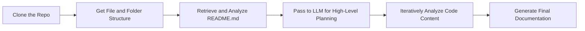

## Project Idea: Codebase Genius

Welcome to the **Codebase Genius** project.
The goal of this project is to build an **AI-powered, agentic system** capable of autonomously generating **comprehensive documentation** for any given software repository from GitHub.

This project is built around a **multi-agent architecture**, where each intelligent agent is responsible for a distinct task such as file structure parsing, semantic understanding, diagram generation, and final documentation writing. These agents **collaborate in a pipeline** to analyze and document codebases effectively.

This document outlines the **project's scope, agent-based architecture**, and **core functionalities** to guide you in your development process.

---

## Project Scope

The primary objective is to create an agentic system that accepts a **GitHub repository URL** and produces **quality markdown documentation**.
The system should be particularly effective for repositories written in **Python** and **Jac**.

A key feature will be the **automatic generation of visual diagrams** to represent the codebase's structure and flow.

---

## Core Functionalities

The final application should be able to perform the following tasks:

- **Clone a Repository**: Fetch the source code from a given GitHub URL.
- **Analyze File Structure**: Understand and map the complete directory and file layout.
- **Analyze Code Relationships**: Parse the code to understand how different parts of the system interact (e.g., which functions call others, how classes are related). This is also known as building a **Code Context Graph (CCG)**.
- **Generate Documentation**: Create a final markdown document that includes descriptions of the code and visual aids.

---

## High-Level Workflow

The process can be broken down into a sequence of clear steps. The agent will first understand the **"what" and "where"** of the code and then dive deeper to understand the **"how."**

### Workflow Steps

1. **Clone the Repo**
   Clone the target GitHub repository to access its files.

2. **Get File and Folder Structure**
   Generate a map of the entire repository to understand the layout.

3. **Retrieve and Analyze `README.md`**
   Use the README file for a high-level project summary.

4. **High-Level Planning**
   An LLM uses this initial data to create a plan for which parts of the codebase to document first.

5. **Iteratively Analyze Code Content**
   Parse source files to understand logic, structure, and relationships.

6. **Generate the Documentation**
   Assemble a comprehensive markdown document with visual diagrams.

---

## Proposed Architecture: A Multi-Agent System

To accomplish this, a **multi-agent architecture** will be used. Think of it as a team of specialized AI agents managed by a supervisor.

### Components

- **Supervisor Agent**:  Manages the workflow and orchestrates the agents.

- **Worker Agents**:  Each with a distinct role:
    - **Repo Mapper**: Analyzes structure and README.
    - **Code Analyzer**: Parses and understands source code.
    - **DocGenie**: Produces the documentation and diagrams.

---

## Agent Responsibilities

### Code Genius Agent (Supervisor)

- Oversees the entire workflow.
- Manages execution order and integration of all worker agents.
- Ensures final output is cohesive and complete.

---

### Repo Mapper

Responsible for high-level repository mapping:

- **File Tree Generator**: Builds a structured view of the file system, ignoring unnecessary files and folders (e.g., `.git`, `node_modules`, etc.).
- **Readme Summarizer**: Extracts a concise summary from the `README.md` file to provide context for the documentation process.

---

### Code Analyzer

Performs in-depth code analysis:

- Uses tools such as Tree-sitter for parsing.
- Identifies functions, classes, and their relationships.
- Builds the foundation for understanding code logic and interaction.

---

### DocGenie

Responsible for generating documentation:

- Converts structured code insights into human-readable markdown.
- Integrates visual diagrams to enhance clarity and comprehension.

---

## Documentation Strategy

To ensure that the documentation is both clear and complete, follow this three-phase strategy:

### 1. Initial Mapping

- Begin with a full map of the repository structure.
- Helps understand the overall layout of the codebase.

### 2. Prioritized Exploration

- Focus on high-impact files (e.g., `main.py`, `app.py`, entry points).
- Document these areas first for maximum value.

### 3. Backfill Coverage

- Complete documentation for remaining utility and support files.
- Ensures completeness without sacrificing efficiency.

---

## Inputs & Outputs

**Input**: A GitHub repository URL (public repo for MVP)
**Output**: Markdown (`.md`) files saved locally, containing comprehensive documentation of the repository

---

## Final Notes

- The output should be **quality markdown files**.
- It must be readable, logically structured, and visually aided with diagrams where applicable.
- The system should be generalizable but optimized for **Python** and **Jac** repositories.
- If you are able to support additional programming languages beyond Python and Jac, feel free to extend the system's capabilities to handle them as well.

---

### Good Luck!

Build smart, write clean, and may your agents generate world-class documentation! ✨
