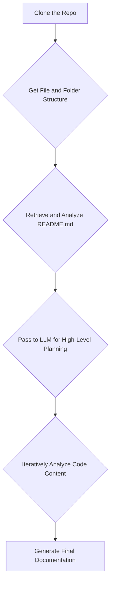
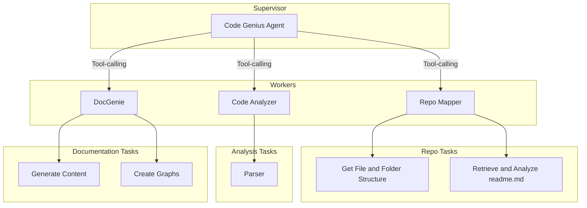

# 🚀 Project: Codebase Genius P2

Welcome to the **Codebase Genius P2** project!  
The goal of this project is to build an **AI-powered agent** that can automatically generate **comprehensive documentation** for any given software repository from GitHub.

This document outlines the **project's scope**, **architecture**, and **core functionalities** to guide you in your development process.

---

## 🧭 Project Scope

Your primary objective is to create a system that takes a **GitHub repository URL** and produces **high-quality markdown documentation**.  
The system should be particularly effective for repositories written in **Python** and **Jac**.

A key feature will be the **automatic generation of Mermaid graphs** to visually represent the codebase's structure and flow.

---

## ✨ Core Functionalities

The final application should be able to perform the following tasks:

- ✅ **Clone a Repository**: Fetch the source code from a given GitHub URL.
- 📁 **Analyze File Structure**: Understand and map the complete directory and file layout.
- 🧠 **Analyze Code Relationships**: Parse the code to understand how different parts of the system interact (e.g., which functions call others, how classes are related). This is also known as building a **Code Context Graph (CCG)**.
- 📝 **Generate Documentation**: Create a final markdown document that includes descriptions of the code and visual aids like **Mermaid flow charts**.

---

## 🔄 High-Level Workflow

The process can be broken down into a sequence of clear steps. The agent will first understand the **"what" and "where"** of the code and then dive deeper to understand the **"how."**

## 🔍 Workflow Explained

1. **Clone the Repo**  
   Clone the target GitHub repository to access its files.

2. **Get File and Folder Structure**  
   Generate a map of the entire repository to understand the layout.

3. **Retrieve and Analyze `README.md`**  
   Use the README file for a high-level project summary.

4. **High-Level Planning**  
   An LLM uses this initial data to create a plan for which parts of the codebase to document first.

5. **Iteratively Analyze Code Content**  
   Parse source files to understand logic, structure, and relationships.

6. **Generate the Documentation**  
   Assemble a comprehensive markdown document with visual Mermaid diagrams.

## 🧠 Proposed Architecture: A Multi-Agent System

We will use a multi-agent architecture, like a team of AI specialists managed by a supervisor.

## 🧑‍💼 Agent Responsibilities

### **Code Genius Agent (Supervisor)**
Oversees the entire workflow and manages the worker agents in sequence.

---

### **Repo Mapper**
Handles initial mapping:

- 🗂 **File Tree Generator**: Builds the repository's file tree and ignores irrelevant files (e.g., `.git`, `node_modules`, etc.).
- 📄 **Readme Summarizer**: Extracts a concise summary from the `README.md` file.

---

### **Code Analyzer**
Performs deep code analysis using tools like Tree-sitter to:

- Identify functions and classes.
- Detect code relationships (e.g., function calls, inheritance).

---

### **DocGenie**
The writer and visualizer:

- Generates markdown documentation from structured insights.
- Creates Mermaid diagrams to represent code structure and flow.

---

## 🧭 The Documentation Strategy

To ensure the documentation is clear, complete, and navigable, use this three-phase strategy:

### 1. 📌 Initial Mapping (Bottom-Up)
- Generate the complete file structure first.
- Provides a lightweight overview of the codebase.

### 2. 🔝 Prioritized Exploration (Top-Down)
- Identify and focus on critical files like `main.py`, `app.py`, etc.
- Document the core logic and entry points early.

### 3. 🧩 Backfill Coverage (Bottom-Up)
- Document less critical or utility files to complete the documentation.

## 🎉 Good Luck!

Build smart, write clean, and may your agents generate world-class documentation! 💻📄✨
