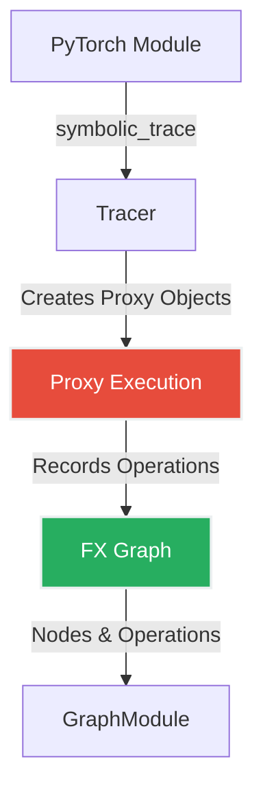
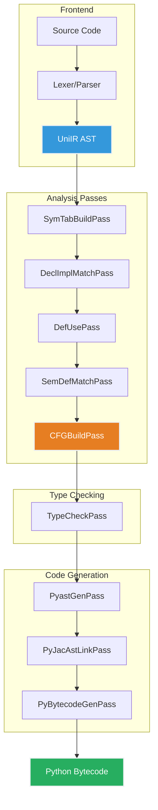
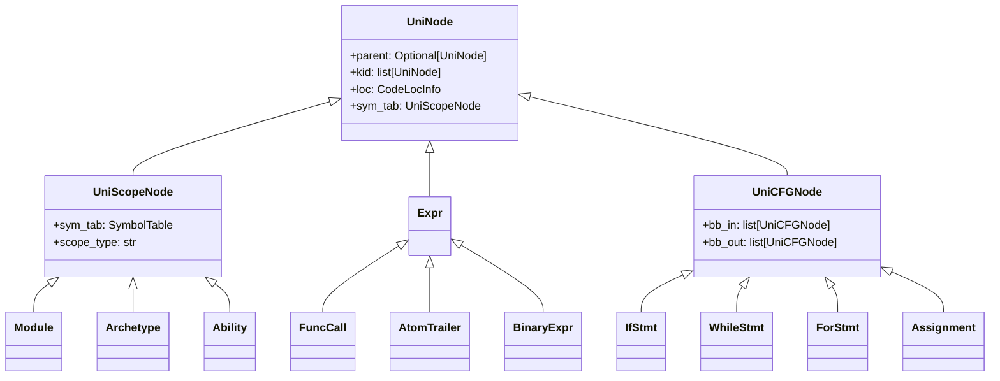
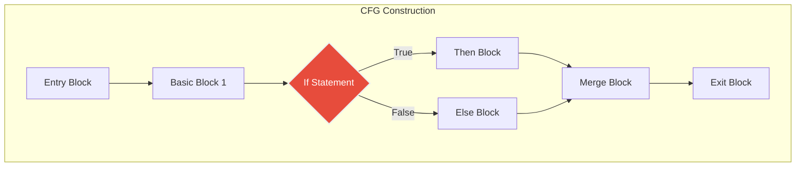
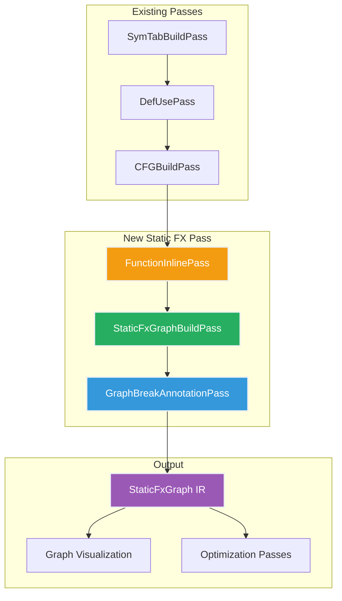
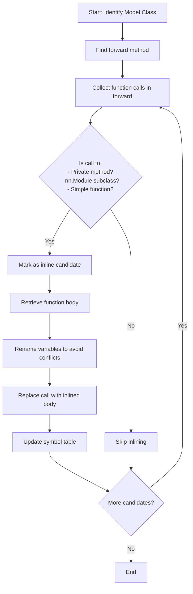
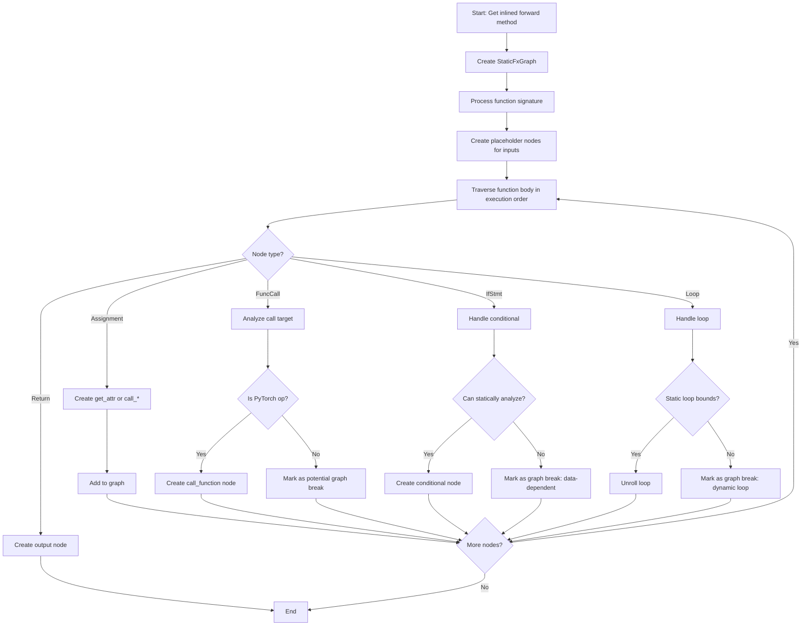
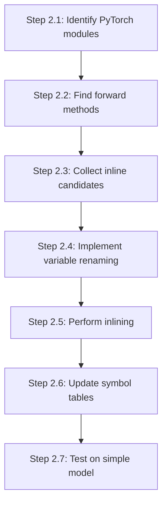

# Static FX Graph Generation Pass

## Project Overview

This document provides a comprehensive specification for building a **Static FX Graph Generation Pass** in the Jaseci compiler. Unlike PyTorch 2's dynamic symbolic tracing approach (which uses runtime execution with Proxy objects), this pass will perform **static analysis** on the UniIR representation of PyTorch models to construct an FX-like graph without symbolic execution. The key innovation is that instead of breaking the graph when encountering unsupported code (like data-dependent control flow), this pass will **tag and annotate** those regions while maintaining a complete representation of the model.

### Motivation

PyTorch 2's `torch.fx.symbolic_trace` has several limitations:

1. **Graph Breaks**: When encountering data-dependent control flow or unsupported operations, PyTorch creates multiple disconnected FX graphs
2. **Runtime Requirement**: Symbolic tracing requires executing the model with Proxy objects
3. **Limited Analysis**: Graph breaks prevent whole-program optimization and analysis
4. **No Static Guarantees**: Cannot analyze control flow without runtime execution

This project aims to create a **static analysis pass** that:

- Works entirely on the UniIR AST without execution
- Creates a complete graph representation even for "untraceble" code
- Tags problematic regions (graph break causes) inline in the representation
- Enables static optimizations and analysis not possible with dynamic tracing

---

## Background: PyTorch FX Graph System

### How PyTorch FX Works



PyTorch FX uses a **runtime tracing** approach:

1. **Proxy Objects**: Special wrapper objects that intercept operations via `__torch_function__`
2. **Symbolic Execution**: The model's forward method is executed with Proxy inputs
3. **Operation Recording**: Each PyTorch operation on Proxies is recorded as a Node in the Graph
4. **IR Construction**: The recorded operations form an FX Graph (intermediate representation)

### FX Graph Structure

An FX Graph consists of:

```python
# FX Graph Node Types
- placeholder: Input parameters
- get_attr: Accessing module parameters
- call_function: Function calls (torch.relu, etc.)
- call_method: Method calls on tensors
- call_module: Submodule invocations
- output: Return values
```

### Graph Breaks in PyTorch 2

**Graph breaks** occur when TorchDynamo encounters code it cannot trace:

```python
def forward(self, x):
    # Traceable
    x = self.linear1(x)

    # GRAPH BREAK: Data-dependent control flow
    if x.sum() > 0:  # Cannot evaluate Proxy to bool
        x = self.linear2(x)
    else:
        x = self.linear3(x)

    # New graph starts here
    return self.output(x)
```

**Common Graph Break Causes**:

1. Data-dependent conditionals (`if tensor.sum() > 0`)
2. Data-dependent loops (`for i in range(tensor.item())`)
3. Python I/O operations (`print`, file operations)
4. Unsupported Python builtins (`getattr`, `inspect` module)
5. Dynamic attribute access
6. Certain tensor operations that create dynamic shapes

### PyTorch Codebase References

To understand FX graph generation, examine these key files in the PyTorch repository:

```
torch/fx/
├── symbolic_trace.py        # Main tracing entry point
├── proxy.py                  # Proxy object implementation
├── graph.py                  # Graph and Node classes
├── interpreter.py            # Graph execution
└── node.py                   # Node representation

torch/_dynamo/
├── symbolic_convert.py       # TorchDynamo bytecode analysis
├── guards.py                 # Dynamic shape guards
└── eval_frame.py            # Frame evaluation hooks
```

**Key Functions to Study**:

- `torch.fx.symbolic_trace()` - Main entry point
- `torch.fx.Tracer.trace()` - Core tracing logic
- `torch.fx.Proxy.__torch_function__()` - Operation interception
- `torch._dynamo.symbolic_convert.InstructionTranslator` - Bytecode to FX conversion

---

## The Jaseci Compiler Architecture

### High-Level Compiler Pipeline



### Key Compiler Components

#### 1. UniIR (Unified Intermediate Representation)

Located in `jac/jaclang/compiler/unitree.py`, UniIR is the AST representation used throughout the compiler.

**Key Characteristics**:

- **Universal**: Represents both Jac and Python code
- **Hierarchical**: Tree structure with parent/child relationships
- **Annotated**: Nodes carry symbol tables, type information, and source locations
- **Traversable**: Built for pass-based transformations

**Core UniNode Base Class**:

```python
class UniNode:
    """Base class for all IR nodes"""

    def __init__(self, kid: Sequence[UniNode]) -> None:
        self.parent: Optional[UniNode] = None
        self.kid: list[UniNode] = []  # Child nodes
        self._sub_node_tab: dict[type, list[UniNode]] = {}  # Fast subnode lookup
        self.gen: CodeGenTarget = CodeGenTarget()  # Code generation target
        self.loc: CodeLocInfo = CodeLocInfo()  # Source location
```

**Important UniNode Types**:



#### 2. Pass Infrastructure

Located in `jac/jaclang/compiler/passes/`, the compiler uses a **pass-based architecture**.

**Base Transform Class** (`transform.py`):

```python
class Transform(ABC, Generic[T, R]):
    """Base class for all compiler transformations"""

    def __init__(self, ir_in: T, prog: JacProgram):
        self.ir_in: T = ir_in
        self.ir_out: R = self.transform(ir_in=ir_in)
        self.errors_had: list[Alert] = []
        self.warnings_had: list[Alert] = []

    @abstractmethod
    def transform(self, ir_in: T) -> R:
        """Transform IR input to IR output"""
        pass
```

**UniPass Class** (`uni_pass.py`):

```python
class UniPass(Transform[uni.Module, uni.Module]):
    """Base class for AST traversal passes"""

    def enter_node(self, node: uni.UniNode) -> None:
        """Called when entering a node during traversal"""
        # Dispatches to enter_{node_type} methods

    def exit_node(self, node: uni.UniNode) -> None:
        """Called when exiting a node during traversal"""
        # Dispatches to exit_{node_type} methods

    def traverse(self, node: uni.UniNode) -> uni.UniNode:
        """Depth-first traversal of the AST"""
        self.enter_node(node)
        for child in node.kid:
            self.traverse(child)
        self.exit_node(node)
```

**Pass Dispatch Mechanism**:

Passes use **dynamic method dispatch** based on node type:

```python
# In UniPass
def enter_node(self, node: uni.UniNode) -> None:
    method_name = f"enter_{pascal_to_snake(type(node).__name__)}"
    if hasattr(self, method_name):
        getattr(self, method_name)(node)

# In your pass
def enter_func_call(self, node: uni.FuncCall) -> None:
    # Handle function call nodes
    pass

def exit_if_stmt(self, node: uni.IfStmt) -> None:
    # Handle if statement nodes
    pass
```

#### 3. Existing Passes

##### SymTabBuildPass

**Purpose**: Constructs symbol tables for name resolution

**Location**: `jac/jaclang/compiler/passes/main/sym_tab_build_pass.py`

**Key Operations**:

- Creates scope hierarchies
- Registers symbols (variables, functions, classes)
- Links parent-child scopes
- Adds special symbols (`self`, `super`)

**Example**:

```python
def enter_archetype(self, node: uni.Archetype) -> None:
    self.push_scope_and_link(node)
    node.parent_scope.def_insert(node, access_spec=node)

def enter_ability(self, node: uni.Ability) -> None:
    self.push_scope_and_link(node)
    if node.is_method:
        # Add 'self' symbol
        node.sym_tab.def_insert(uni.Name.gen_stub_from_node(node, "self"))
```

##### CFGBuildPass

**Purpose**: Builds control flow graphs for program analysis

**Location**: `jac/jaclang/compiler/passes/main/cfg_build_pass.py`

**Key Operations**:

- Identifies basic blocks (straight-line code sequences)
- Links basic blocks with control flow edges
- Tracks loop structures
- Handles conditional branches

**CFG Structure**:



**Basic Block Connections**:

```python
class UniCFGNode(UniNode):
    """Node participating in control flow"""
    bb_in: list[UniCFGNode]   # Incoming edges
    bb_out: list[UniCFGNode]  # Outgoing edges
```

##### PreDynamoPass

**Purpose**: Prepares PyTorch code for dynamic compilation by transforming certain patterns

**Location**: `jac/jaclang/compiler/passes/main/predynamo_pass.py`

**Example Transformation**:

```python
# Before
if condition:
    x = tensor_a
else:
    x = tensor_b

# After (transformed to)
x = torch.where(condition, tensor_a, tensor_b)
```

This pass is **highly relevant** to our project as it already performs PyTorch-specific transformations!

---

## Project Architecture

### Overall Design



### Phase 1: Function Inlining Pass

**Purpose**: Inline method calls in PyTorch model forward methods to create a flat representation for analysis.

#### Why Inlining is Necessary

PyTorch models typically have this structure:

```python
class MyModel(nn.Module):
    def forward(self, x):
        x = self.layer1(x)      # Calls another module
        x = self._helper(x)     # Calls private method
        return self.layer2(x)

    def _helper(self, x):
        return F.relu(x)
```

**Without inlining**, we'd have:

- Incomplete static analysis (can't see into `_helper`)
- Missing optimization opportunities
- Fragmented graph representation

**With inlining**, we get:

```python
def forward_inlined(self, x):
    # Inlined self.layer1(x)
    x = self.layer1.linear(x)
    # Inlined self._helper(x)
    x = F.relu(x)
    # Inlined self.layer2(x)
    x = self.layer2.linear(x)
    return x
```

#### Implementation Strategy

**Location**: Create `jac/jaclang/compiler/passes/main/function_inline_pass.py`

**Data Structure for Inlining**:

```python
@dataclass
class InlineCandidate:
    """Represents a function that can be inlined"""
    func_node: uni.Ability
    call_site: uni.FuncCall
    caller_node: uni.Ability
    inline_priority: int  # Higher = inline first

@dataclass
class InlineContext:
    """Context for performing inlining"""
    variable_mapping: dict[str, str]  # Old name -> New name
    parent_scope: uni.UniScopeNode
    depth: int  # Current inline depth
```

**Algorithm**:



**Key Methods**:

```python
class FunctionInlinePass(UniPass):

    def before_pass(self) -> None:
        self.inline_candidates: list[InlineCandidate] = []
        self.inline_depth_limit = 3  # Prevent infinite recursion
        self.inlined_functions: set[str] = set()

    def enter_archetype(self, node: uni.Archetype) -> None:
        """Look for PyTorch model classes"""
        # Check if inherits from nn.Module
        if self.is_pytorch_module(node):
            self.current_model = node

    def enter_ability(self, node: uni.Ability) -> None:
        """Find forward method"""
        if node.name_ref.value == "forward":
            self.analyze_for_inlining(node)

    def analyze_for_inlining(self, forward_method: uni.Ability) -> None:
        """Find all function calls that should be inlined"""
        calls = self.get_all_sub_nodes(forward_method, uni.FuncCall)

        for call in calls:
            if self.should_inline(call):
                candidate = self.create_inline_candidate(call)
                self.inline_candidates.append(candidate)

    def should_inline(self, call: uni.FuncCall) -> bool:
        """Determine if a call should be inlined"""
        # Inline if:
        # 1. Private method call (self._method)
        # 2. Call to simple nn.Module (Linear, Conv2d, etc.)
        # 3. Utility function (not recursive, not too large)
        pass

    def perform_inline(self, candidate: InlineCandidate) -> None:
        """Replace call with inlined function body"""
        # 1. Clone function body
        # 2. Rename variables (prevent conflicts)
        # 3. Replace parameters with arguments
        # 4. Update symbol table
        # 5. Replace call node with inlined body
        pass
```

**Variable Renaming Example**:

```python
# Original helper function
def _helper(self, x, scale):
    result = x * scale
    return result

# Called as: y = self._helper(a, 2.0)

# After inlining (renamed variables)
__helper_x_0 = a
__helper_scale_0 = 2.0
__helper_result_0 = __helper_x_0 * __helper_scale_0
y = __helper_result_0
```

#### Handling Special Cases

1. **Recursive calls**: Don't inline (mark with annotation)
2. **External functions**: Only inline if definition is available in IR
3. **Lambda functions**: Can inline directly
4. **Generator functions**: Skip (cannot inline)

### Phase 2: Static FX Graph Builder

**Purpose**: Construct an FX-like graph representation from the inlined UniIR.

#### Graph IR Design

**Location**: Create `jac/jaclang/compiler/passes/main/static_fx_ir.py`

**New IR Nodes**:

```python
@dataclass
class StaticFxNode:
    """Node in the static FX graph"""
    op: str  # "placeholder", "call_function", "call_method", "get_attr", "output"
    name: str  # Unique identifier
    target: Any  # Function/method/attribute being called
    args: tuple[Any, ...]  # Positional arguments
    kwargs: dict[str, Any]  # Keyword arguments
    meta: dict[str, Any]  # Metadata (types, shapes, source location)
    users: list[StaticFxNode]  # Nodes that use this node's output
    graph_break_reason: Optional[str] = None  # Why this causes a graph break

class StaticFxGraph:
    """Complete FX-like graph representation"""
    nodes: list[StaticFxNode]
    input_nodes: list[StaticFxNode]
    output_nodes: list[StaticFxNode]
    graph_break_regions: list[GraphBreakRegion]

@dataclass
class GraphBreakRegion:
    """Represents a region that would cause graph breaks in PyTorch"""
    reason: str  # "data_dependent_control_flow", "dynamic_loop", etc.
    nodes: list[StaticFxNode]  # Nodes involved in the break
    source_loc: CodeLocInfo
    workaround: Optional[str]  # Suggested fix
```

#### Graph Construction Algorithm



**Implementation**:

```python
class StaticFxGraphBuildPass(UniPass):

    def before_pass(self) -> None:
        self.current_graph: Optional[StaticFxGraph] = None
        self.node_map: dict[str, StaticFxNode] = {}  # Variable name -> FX node
        self.graph_break_regions: list[GraphBreakRegion] = []

    def enter_ability(self, node: uni.Ability) -> None:
        """Build graph for forward method"""
        if node.name_ref.value == "forward" and self.is_pytorch_module(node.parent):
            self.current_graph = StaticFxGraph(nodes=[], ...)
            self.build_graph(node)

    def build_graph(self, forward_method: uni.Ability) -> None:
        """Main graph construction"""
        # 1. Create placeholder nodes for parameters
        self.create_input_placeholders(forward_method)

        # 2. Process function body
        for stmt in forward_method.body:
            self.process_statement(stmt)

        # 3. Create output node
        self.create_output_node(forward_method)

    def process_statement(self, stmt: uni.UniNode) -> None:
        """Process a single statement"""
        if isinstance(stmt, uni.Assignment):
            self.process_assignment(stmt)
        elif isinstance(stmt, uni.IfStmt):
            self.process_conditional(stmt)
        elif isinstance(stmt, (uni.InForStmt, uni.WhileStmt)):
            self.process_loop(stmt)
        elif isinstance(stmt, uni.ReturnStmt):
            self.process_return(stmt)

    def process_assignment(self, node: uni.Assignment) -> None:
        """Convert assignment to FX node"""
        if isinstance(node.value, uni.FuncCall):
            fx_node = self.create_fx_call_node(node.value)
            # Map variable to FX node
            target_name = node.target[0].value
            self.node_map[target_name] = fx_node

    def create_fx_call_node(self, call: uni.FuncCall) -> StaticFxNode:
        """Create FX node for function call"""
        # Determine operation type
        if self.is_torch_function(call):
            op = "call_function"
            target = self.resolve_torch_function(call)
        elif self.is_tensor_method(call):
            op = "call_method"
            target = self.extract_method_name(call)
        elif self.is_module_call(call):
            op = "call_module"
            target = self.extract_module_path(call)
        else:
            # Unknown call type - potential graph break
            op = "call_function"
            target = "unknown"
            # Mark as graph break

        # Extract arguments
        args = self.extract_args(call)
        kwargs = self.extract_kwargs(call)

        fx_node = StaticFxNode(
            op=op,
            name=self.generate_node_name(),
            target=target,
            args=args,
            kwargs=kwargs,
            meta={"source_loc": call.loc}
        )

        self.current_graph.nodes.append(fx_node)
        return fx_node

    def process_conditional(self, node: uni.IfStmt) -> None:
        """Handle if statements"""
        condition_expr = node.condition

        # Check if condition is data-dependent
        if self.is_data_dependent(condition_expr):
            # Mark as graph break
            break_region = GraphBreakRegion(
                reason="data_dependent_control_flow",
                nodes=[],  # Will be populated
                source_loc=node.loc,
                workaround="Consider using torch.where() or masking"
            )
            self.graph_break_regions.append(break_region)

            # Still process both branches (record them)
            self.process_branch_with_tag(node.body, "then_branch", break_region)
            if node.else_body:
                self.process_branch_with_tag(node.else_body.body, "else_branch", break_region)
        else:
            # Statically resolvable - can safely include
            # (e.g., if check based on model config, not tensor values)
            pass

    def is_data_dependent(self, expr: uni.Expr) -> bool:
        """Check if expression depends on tensor runtime values"""
        # Data-dependent if:
        # - Tensor item() call
        # - Tensor comparison (tensor > 0)
        # - Tensor shape/size accessed as value
        # - Any operation on tensor producing scalar bool

        # Find all tensor operations in expression
        tensor_ops = self.find_tensor_operations(expr)
        return any(self.produces_runtime_value(op) for op in tensor_ops)

    def process_loop(self, node: uni.UniNode) -> None:
        """Handle loops"""
        if isinstance(node, uni.InForStmt):
            # Check if loop bounds are static
            if self.has_static_bounds(node):
                # Unroll the loop
                self.unroll_loop(node)
            else:
                # Dynamic loop - graph break
                break_region = GraphBreakRegion(
                    reason="dynamic_loop",
                    nodes=[],
                    source_loc=node.loc,
                    workaround="Use static loop bounds or vectorize"
                )
                self.graph_break_regions.append(break_region)
                # Still record loop body with tag
                self.process_loop_body_with_tag(node.body, break_region)
```

#### Recognizing PyTorch Operations

**PyTorch Operation Categories**:

```python
TORCH_FUNCTIONS = {
    # Tensor creation
    "torch.zeros", "torch.ones", "torch.tensor", "torch.randn",
    # Operations
    "torch.matmul", "torch.add", "torch.mul", "torch.div",
    "torch.cat", "torch.stack", "torch.split",
    # Activations
    "torch.relu", "torch.sigmoid", "torch.tanh", "torch.softmax",
    # NN functions
    "F.linear", "F.conv2d", "F.max_pool2d", "F.dropout",
}

TENSOR_METHODS = {
    "view", "reshape", "permute", "transpose",
    "sum", "mean", "std", "max", "min",
    "unsqueeze", "squeeze", "expand",
}

NN_MODULES = {
    "torch.nn.Linear", "torch.nn.Conv2d", "torch.nn.BatchNorm2d",
    "torch.nn.ReLU", "torch.nn.Dropout", "torch.nn.MaxPool2d",
}
```

**Recognition Strategy**:

```python
def is_torch_function(self, call: uni.FuncCall) -> bool:
    """Check if call is a torch.* function"""
    if isinstance(call.target, uni.AtomTrailer):
        # Resolve full qualified name
        full_name = self.resolve_qualified_name(call.target)
        return full_name in TORCH_FUNCTIONS
    return False

def resolve_qualified_name(self, node: uni.AtomTrailer) -> str:
    """Resolve torch.nn.functional.relu -> 'F.relu' or 'torch.relu'"""
    parts = []
    current = node
    while isinstance(current, uni.AtomTrailer):
        if isinstance(current.right, uni.Name):
            parts.append(current.right.value)
        current = current.target
    if isinstance(current, uni.Name):
        parts.insert(0, current.value)
    return ".".join(parts)
```

### Phase 3: Graph Break Annotation

**Purpose**: Enhance graph break regions with detailed analysis and suggested workarounds.

```python
class GraphBreakAnnotationPass(UniPass):
    """Analyzes graph breaks and suggests fixes"""

    def annotate_graph_breaks(self, graph: StaticFxGraph) -> None:
        """Add detailed annotations to graph break regions"""
        for region in graph.graph_break_regions:
            # Analyze the cause
            analysis = self.analyze_break_cause(region)

            # Suggest workaround
            workaround = self.suggest_workaround(region, analysis)

            # Estimate performance impact
            impact = self.estimate_break_impact(region, graph)

            region.meta.update({
                "analysis": analysis,
                "workaround": workaround,
                "impact": impact,
            })

    def suggest_workaround(self, region: GraphBreakRegion, analysis: dict) -> str:
        """Generate workaround suggestion"""
        if region.reason == "data_dependent_control_flow":
            return self.suggest_control_flow_fix(region, analysis)
        elif region.reason == "dynamic_loop":
            return self.suggest_loop_fix(region, analysis)
        # ... more cases
```

---

## Implementation Guide

### Step 1: Setup and Prerequisites

**1. Create new files in the codebase:**

```bash
# Navigate to passes directory
cd jac/jaclang/compiler/passes/main

# Create new pass files
touch function_inline_pass.py
touch static_fx_graph_pass.py
touch graph_break_annotation_pass.py

# Create IR definition file
touch static_fx_ir.py
```

**2. Update pass registry:**

Edit `jac/jaclang/compiler/passes/main/__init__.py`:

```python
from .function_inline_pass import FunctionInlinePass
from .static_fx_graph_pass import StaticFxGraphBuildPass
from .graph_break_annotation_pass import GraphBreakAnnotationPass

__all__ = [
    # ... existing passes
    "FunctionInlinePass",
    "StaticFxGraphBuildPass",
    "GraphBreakAnnotationPass",
]
```

**3. Study existing passes:**

Read and understand these files thoroughly:

- `unitree.py` (lines 44-650): UniNode class hierarchy
- `uni_pass.py`: Pass infrastructure
- `cfg_build_pass.py`: Example of complex pass with graph building
- `predynamo_pass.py`: PyTorch-specific transformations

### Step 2: Implement Function Inlining Pass

**File**: `jac/jaclang/compiler/passes/main/function_inline_pass.py`

**Implementation checklist**:



**2.1**: Start with detecting PyTorch model classes:

```python
def is_pytorch_module(self, node: uni.Archetype) -> bool:
    """Check if archetype inherits from nn.Module"""
    # Look at base classes
    if hasattr(node, 'base_classes'):
        for base in node.base_classes:
            # Check if any base is nn.Module or torch.nn.Module
            base_name = self.get_qualified_name(base)
            if 'nn.Module' in base_name or 'Module' in base_name:
                return True
    return False
```

**2.2**: Find forward methods and helper methods:

```python
def collect_methods(self, model_class: uni.Archetype) -> dict[str, uni.Ability]:
    """Collect all methods in the model class"""
    methods = {}
    for node in model_class.body:
        if isinstance(node, uni.Ability):
            methods[node.name_ref.value] = node
    return methods
```

**2.3**: Determine what to inline:

```python
def should_inline(self, call: uni.FuncCall, context: InlineContext) -> bool:
    """Decide if this call should be inlined"""

    # Don't inline if too deep
    if context.depth >= self.inline_depth_limit:
        return False

    # Check if it's a method call on self
    if isinstance(call.target, uni.AtomTrailer):
        if self.is_self_method_call(call.target):
            method_name = self.extract_method_name(call.target)
            # Inline private methods
            if method_name.startswith('_'):
                return True

    # Check for simple nn.Module calls
    if self.is_simple_nn_module(call):
        return True

    return False
```

**2.4**: Rename variables to avoid conflicts:

```python
def rename_variables_in_body(
    self,
    function_body: list[uni.UniNode],
    suffix: str
) -> list[uni.UniNode]:
    """Clone function body and rename all variables"""
    # Use deep copy to clone nodes
    cloned_body = self.deep_clone_nodes(function_body)

    # Find all variable assignments and references
    assignments = self.get_all_sub_nodes(cloned_body, uni.Assignment)
    names = self.get_all_sub_nodes(cloned_body, uni.Name)

    # Build rename map
    rename_map = {}
    for assign in assignments:
        for target in assign.target:
            if isinstance(target, uni.Name):
                old_name = target.value
                new_name = f"__{old_name}_{suffix}"
                rename_map[old_name] = new_name

    # Apply renames
    for name_node in names:
        if name_node.value in rename_map:
            name_node.value = rename_map[name_node.value]

    return cloned_body, rename_map
```

**2.5**: Perform the actual inlining:

```python
def inline_function_call(
    self,
    call: uni.FuncCall,
    func_def: uni.Ability,
    context: InlineContext
) -> list[uni.UniNode]:
    """Replace function call with inlined body"""

    # 1. Clone and rename function body
    suffix = f"inline_{context.depth}_{self.inline_counter}"
    self.inline_counter += 1
    inlined_body, rename_map = self.rename_variables_in_body(
        func_def.body,
        suffix
    )

    # 2. Create parameter assignments
    param_assignments = self.create_parameter_bindings(
        func_def.signature.params,
        call.params,
        rename_map
    )

    # 3. Combine: parameter bindings + function body
    result = param_assignments + inlined_body

    # 4. Handle return statement
    return_stmts = self.get_all_sub_nodes(result, uni.ReturnStmt)
    if return_stmts:
        # Replace return with assignment to call result
        self.replace_returns_with_assignments(return_stmts)

    return result
```

**2.6**: Update symbol tables after inlining:

```python
def update_symbol_table_after_inline(
    self,
    parent_scope: uni.UniScopeNode,
    inlined_nodes: list[uni.UniNode],
    rename_map: dict[str, str]
) -> None:
    """Register new symbols from inlined code"""

    # Add renamed variables to parent scope's symbol table
    for old_name, new_name in rename_map.items():
        # Create stub symbol
        stub = uni.Name.gen_stub_from_node(
            parent_scope,
            new_name
        )
        parent_scope.sym_tab.def_insert(stub)
```

**2.7**: Test with a simple PyTorch model:

```python
# Test case: test_function_inline_pass.py
def test_inline_simple_method():
    source = """
    import torch.nn as nn

    class SimpleModel(nn.Module):
        def forward(self, x):
            return self._helper(x)

        def _helper(self, x):
            return x * 2
    """

    # Run passes up to and including inline pass
    # Verify that _helper is inlined into forward
    pass
```

### Step 3: Define Static FX IR

**File**: `jac/jaclang/compiler/passes/main/static_fx_ir.py`

**Key data structures**:

```python
from dataclasses import dataclass, field
from typing import Any, Optional
from enum import Enum

class FxOpType(Enum):
    """FX operation types (matching torch.fx)"""
    PLACEHOLDER = "placeholder"
    GET_ATTR = "get_attr"
    CALL_FUNCTION = "call_function"
    CALL_METHOD = "call_method"
    CALL_MODULE = "call_module"
    OUTPUT = "output"

@dataclass
class StaticFxNode:
    """Node in static FX graph"""
    op: FxOpType
    name: str
    target: Any
    args: tuple[Any, ...] = field(default_factory=tuple)
    kwargs: dict[str, Any] = field(default_factory=dict)

    # Additional static analysis info
    meta: dict[str, Any] = field(default_factory=dict)

    # Graph break annotation
    is_graph_break: bool = False
    graph_break_reason: Optional[str] = None
    graph_break_workaround: Optional[str] = None

    # Connections
    users: list['StaticFxNode'] = field(default_factory=list)

    def __repr__(self) -> str:
        args_repr = ', '.join(str(a) for a in self.args)
        kwargs_repr = ', '.join(f'{k}={v}' for k, v in self.kwargs.items())
        all_args = ', '.join(filter(None, [args_repr, kwargs_repr]))

        break_marker = " [GRAPH_BREAK]" if self.is_graph_break else ""
        return f"{self.name}: {self.op.value}[{self.target}]({all_args}){break_marker}"

@dataclass
class GraphBreakRegion:
    """Represents a region causing graph breaks"""
    reason: str
    nodes: list[StaticFxNode] = field(default_factory=list)
    source_loc: Any = None
    workaround: Optional[str] = None
    severity: str = "warning"  # "info", "warning", "error"

    # Detailed analysis
    analysis: dict[str, Any] = field(default_factory=dict)
    fixable: bool = False

class StaticFxGraph:
    """Complete FX graph with graph break annotations"""

    def __init__(self, name: str):
        self.name = name
        self.nodes: list[StaticFxNode] = []
        self._node_map: dict[str, StaticFxNode] = {}

        self.input_nodes: list[StaticFxNode] = []
        self.output_nodes: list[StaticFxNode] = []

        self.graph_break_regions: list[GraphBreakRegion] = []

    def add_node(self, node: StaticFxNode) -> StaticFxNode:
        """Add node to graph"""
        self.nodes.append(node)
        self._node_map[node.name] = node
        return node

    def get_node(self, name: str) -> Optional[StaticFxNode]:
        """Retrieve node by name"""
        return self._node_map.get(name)

    def add_edge(self, from_node: StaticFxNode, to_node: StaticFxNode) -> None:
        """Add edge between nodes"""
        if to_node not in from_node.users:
            from_node.users.append(to_node)

    def print_graph(self) -> str:
        """Pretty print the graph"""
        lines = [f"Graph: {self.name}", "=" * 50]

        for node in self.nodes:
            lines.append(str(node))
            if node.graph_break_reason:
                lines.append(f"  └─ Break Reason: {node.graph_break_reason}")
                if node.graph_break_workaround:
                    lines.append(f"  └─ Workaround: {node.graph_break_workaround}")

        if self.graph_break_regions:
            lines.append("\nGraph Break Summary:")
            lines.append("-" * 50)
            for i, region in enumerate(self.graph_break_regions):
                lines.append(f"{i+1}. {region.reason}")
                lines.append(f"   Severity: {region.severity}")
                if region.workaround:
                    lines.append(f"   Fix: {region.workaround}")

        return "\n".join(lines)

    def to_dot(self) -> str:
        """Generate Graphviz DOT representation"""
        lines = ["digraph StaticFxGraph {"]
        lines.append('  rankdir=TB;')

        # Nodes
        for node in self.nodes:
            color = "red" if node.is_graph_break else "black"
            label = f"{node.name}\\n{node.op.value}\\n{node.target}"
            lines.append(f'  "{node.name}" [label="{label}", color="{color}"];')

        # Edges
        for node in self.nodes:
            for user in node.users:
                lines.append(f'  "{node.name}" -> "{user.name}";')

        lines.append("}")
        return "\n".join(lines)
```

### Step 4: Implement Static FX Graph Builder

**File**: `jac/jaclang/compiler/passes/main/static_fx_graph_pass.py`

**Main pass structure**:

```python
import jaclang.compiler.unitree as uni
from jaclang.compiler.passes import UniPass
from .static_fx_ir import (
    StaticFxGraph, StaticFxNode, FxOpType, GraphBreakRegion
)

class StaticFxGraphBuildPass(UniPass):
    """Build static FX graph from inlined forward method"""

    def before_pass(self) -> None:
        """Initialize pass state"""
        self.graphs: dict[str, StaticFxGraph] = {}
        self.current_graph: Optional[StaticFxGraph] = None

        # Maps variable names to FX nodes
        self.value_map: dict[str, StaticFxNode] = {}

        # Counter for unique node names
        self.node_counter = 0

        # Track potential graph breaks
        self.graph_break_candidates: list[tuple[uni.UniNode, str]] = []

    def enter_archetype(self, node: uni.Archetype) -> None:
        """Process PyTorch model classes"""
        if not self.is_pytorch_module(node):
            return

        self.current_model = node
        self.model_name = node.name.value

    def enter_ability(self, node: uni.Ability) -> None:
        """Process forward method"""
        if node.name_ref.value != "forward":
            return

        if not hasattr(self, 'current_model'):
            return

        # Create new graph
        graph_name = f"{self.model_name}.forward"
        self.current_graph = StaticFxGraph(name=graph_name)

        # Build the graph
        self.build_graph_from_forward(node)

        # Store graph
        self.graphs[graph_name] = self.current_graph

    def build_graph_from_forward(self, forward: uni.Ability) -> None:
        """Main graph construction from forward method"""

        # Step 1: Create placeholders for inputs
        self.create_input_placeholders(forward)

        # Step 2: Process function body
        for stmt in forward.body:
            self.process_statement(stmt)

        # Step 3: Handle return/output
        return_stmts = self.get_all_sub_nodes(forward, uni.ReturnStmt)
        if return_stmts:
            self.create_output_node(return_stmts[-1])

    def create_input_placeholders(self, forward: uni.Ability) -> None:
        """Create placeholder nodes for function parameters"""
        if not forward.signature or not forward.signature.params:
            return

        for param in forward.signature.params:
            if isinstance(param, uni.Param):
                # Skip 'self' parameter
                if param.name.value == 'self':
                    continue

                node = StaticFxNode(
                    op=FxOpType.PLACEHOLDER,
                    name=param.name.value,
                    target=param.name.value,
                    meta={
                        "type": param.type_tag if param.type_tag else "unknown"
                    }
                )

                self.current_graph.add_node(node)
                self.current_graph.input_nodes.append(node)
                self.value_map[param.name.value] = node

    def process_statement(self, stmt: uni.UniNode) -> None:
        """Process different statement types"""

        if isinstance(stmt, uni.Assignment):
            self.process_assignment(stmt)

        elif isinstance(stmt, uni.ExprStmt):
            self.process_expr_stmt(stmt)

        elif isinstance(stmt, uni.IfStmt):
            self.process_if_statement(stmt)

        elif isinstance(stmt, (uni.InForStmt, uni.IterForStmt)):
            self.process_for_loop(stmt)

        elif isinstance(stmt, uni.WhileStmt):
            self.process_while_loop(stmt)

        elif isinstance(stmt, uni.ReturnStmt):
            # Handled separately
            pass

        else:
            # Unknown statement type - potential issue
            self.log_warning(f"Unhandled statement type: {type(stmt).__name__}", stmt)

    def process_assignment(self, stmt: uni.Assignment) -> None:
        """Process assignment: x = f(y)"""

        # Process right-hand side
        if isinstance(stmt.value, uni.FuncCall):
            fx_node = self.process_func_call(stmt.value)
        elif isinstance(stmt.value, uni.BinaryExpr):
            fx_node = self.process_binary_expr(stmt.value)
        elif isinstance(stmt.value, uni.Name):
            # Simple variable reference
            fx_node = self.value_map.get(stmt.value.value)
        else:
            # Other expression types
            fx_node = self.process_expression(stmt.value)

        # Map target variable(s) to result node
        for target in stmt.target:
            if isinstance(target, uni.Name):
                if fx_node:
                    self.value_map[target.value] = fx_node

    def process_func_call(self, call: uni.FuncCall) -> StaticFxNode:
        """Process function call and create FX node"""

        # Determine call type
        if self.is_torch_function(call):
            return self.create_torch_function_node(call)

        elif self.is_torch_nn_functional(call):
            return self.create_torch_function_node(call)

        elif self.is_module_call(call):
            return self.create_module_call_node(call)

        elif self.is_tensor_method(call):
            return self.create_tensor_method_node(call)

        else:
            # Unknown call - potential graph break
            return self.create_unknown_call_node(call)

    def create_torch_function_node(self, call: uni.FuncCall) -> StaticFxNode:
        """Create node for torch.* function call"""

        # Extract function name
        func_name = self.get_qualified_name(call.target)

        # Extract arguments
        args = self.extract_call_args(call)
        kwargs = self.extract_call_kwargs(call)

        # Create node
        node = StaticFxNode(
            op=FxOpType.CALL_FUNCTION,
            name=self.generate_unique_name(func_name),
            target=func_name,
            args=args,
            kwargs=kwargs,
            meta={
                "source_loc": call.loc,
            }
        )

        self.current_graph.add_node(node)

        # Add edges from arguments
        self.add_edges_from_args(args, node)

        return node

    def create_module_call_node(self, call: uni.FuncCall) -> StaticFxNode:
        """Create node for nn.Module forward call"""

        # Extract module path (e.g., "self.layer1")
        module_path = self.get_module_path(call.target)

        args = self.extract_call_args(call)
        kwargs = self.extract_call_kwargs(call)

        node = StaticFxNode(
            op=FxOpType.CALL_MODULE,
            name=self.generate_unique_name(module_path),
            target=module_path,
            args=args,
            kwargs=kwargs,
            meta={
                "source_loc": call.loc,
            }
        )

        self.current_graph.add_node(node)
        self.add_edges_from_args(args, node)

        return node

    def process_if_statement(self, stmt: uni.IfStmt) -> None:
        """Process if statement - check for data dependency"""

        condition = stmt.condition

        # Check if condition depends on tensor values
        if self.is_data_dependent_condition(condition):
            # This is a graph break!
            reason = "Data-dependent control flow (if statement)"

            # Create graph break region
            region = GraphBreakRegion(
                reason=reason,
                source_loc=stmt.loc,
                severity="warning",
            )

            # Still process both branches to record operations
            self.process_branch_with_annotation(
                stmt.body,
                region,
                branch_type="then"
            )

            if stmt.else_body:
                self.process_branch_with_annotation(
                    stmt.else_body.body,
                    region,
                    branch_type="else"
                )

            self.current_graph.graph_break_regions.append(region)

        else:
            # Static condition - safe to trace
            # (Could evaluate at compile time)
            for s in stmt.body:
                self.process_statement(s)

            if stmt.else_body:
                for s in stmt.else_body.body:
                    self.process_statement(s)

    def is_data_dependent_condition(self, condition: uni.Expr) -> bool:
        """Check if condition depends on runtime tensor values"""

        # Look for patterns that indicate data dependency:
        # 1. Tensor comparisons: x > 0, x.sum() > threshold
        # 2. Tensor.item() calls
        # 3. Tensor bool evaluation

        # Find all function calls in condition
        calls = self.get_all_sub_nodes(condition, uni.FuncCall)

        for call in calls:
            # Check for .item()
            if self.is_tensor_item_call(call):
                return True

        # Check for tensor comparisons
        comparisons = self.get_all_sub_nodes(condition, uni.BinaryExpr)
        for comp in comparisons:
            if self.involves_tensor_comparison(comp):
                return True

        return False

    def process_for_loop(self, stmt: uni.InForStmt) -> None:
        """Process for loop - check for dynamic bounds"""

        # Check if loop has static bounds
        if self.has_static_loop_bounds(stmt):
            # Can unroll the loop
            self.unroll_static_loop(stmt)
        else:
            # Dynamic loop bounds - graph break
            region = GraphBreakRegion(
                reason="Dynamic loop bounds",
                source_loc=stmt.loc,
                severity="warning",
                workaround="Use static loop bounds or vectorize operations"
            )

            # Process loop body with annotation
            self.process_loop_body_with_annotation(stmt.body, region)

            self.current_graph.graph_break_regions.append(region)

    def has_static_loop_bounds(self, stmt: uni.InForStmt) -> bool:
        """Check if for loop has compile-time known bounds"""

        # Check if iterating over:
        # - range(constant)
        # - List literal
        # - Other static iterables

        collection = stmt.collection

        if isinstance(collection, uni.FuncCall):
            # Check for range(N) where N is constant
            if self.is_range_with_constant(collection):
                return True

        elif isinstance(collection, uni.ListVal):
            # List literal - static
            return True

        return False

    def unroll_static_loop(self, stmt: uni.InForStmt) -> None:
        """Unroll loop with static bounds"""

        # Get loop iterations
        iterations = self.get_loop_iterations(stmt)

        # Process body for each iteration
        for iter_value in iterations:
            # Bind loop variable
            loop_var = stmt.target.value
            # Create node for iteration value
            # Process body statements
            for body_stmt in stmt.body:
                self.process_statement(body_stmt)

    def create_output_node(self, return_stmt: uni.ReturnStmt) -> None:
        """Create output node for return value"""

        if not return_stmt.expr:
            return

        # Get the FX node representing return value
        return_value = self.get_value_node(return_stmt.expr)

        node = StaticFxNode(
            op=FxOpType.OUTPUT,
            name="output",
            target="output",
            args=(return_value,) if return_value else (),
            meta={
                "source_loc": return_stmt.loc,
            }
        )

        self.current_graph.add_node(node)
        self.current_graph.output_nodes.append(node)

        if return_value:
            self.current_graph.add_edge(return_value, node)

    # Helper methods

    def generate_unique_name(self, base: str) -> str:
        """Generate unique node name"""
        name = f"{base}_{self.node_counter}"
        self.node_counter += 1
        return name

    def extract_call_args(self, call: uni.FuncCall) -> tuple:
        """Extract positional arguments as FX nodes"""
        args = []
        for param in call.params:
            if isinstance(param, uni.KWPair):
                continue  # Skip kwargs
            arg_node = self.get_value_node(param)
            args.append(arg_node)
        return tuple(args)

    def extract_call_kwargs(self, call: uni.FuncCall) -> dict:
        """Extract keyword arguments as FX nodes"""
        kwargs = {}
        for param in call.params:
            if isinstance(param, uni.KWPair):
                key = param.key.value
                value_node = self.get_value_node(param.value)
                kwargs[key] = value_node
        return kwargs

    def get_value_node(self, expr: uni.Expr) -> StaticFxNode:
        """Get or create FX node for expression"""
        if isinstance(expr, uni.Name):
            # Variable reference
            return self.value_map.get(expr.value)
        elif isinstance(expr, uni.FuncCall):
            return self.process_func_call(expr)
        else:
            # Other expressions - may need special handling
            return self.process_expression(expr)

    def add_edges_from_args(self, args: tuple, target_node: StaticFxNode) -> None:
        """Add edges from argument nodes to target node"""
        for arg in args:
            if isinstance(arg, StaticFxNode):
                self.current_graph.add_edge(arg, target_node)
```

### Step 5: Implement Graph Break Annotation Pass

**File**: `jac/jaclang/compiler/passes/main/graph_break_annotation_pass.py`

```python
from jaclang.compiler.passes import UniPass
from .static_fx_ir import StaticFxGraph, GraphBreakRegion

class GraphBreakAnnotationPass(UniPass):
    """Analyze and annotate graph break regions"""

    def after_pass(self) -> None:
        """Process all graphs after traversal"""

        # Access graphs from previous pass
        if hasattr(self.prog, 'static_fx_graphs'):
            for graph_name, graph in self.prog.static_fx_graphs.items():
                self.annotate_graph(graph)

    def annotate_graph(self, graph: StaticFxGraph) -> None:
        """Add detailed annotations to graph breaks"""

        for region in graph.graph_break_regions:
            # Perform detailed analysis
            analysis = self.analyze_break_region(region)
            region.analysis = analysis

            # Generate workaround suggestion
            workaround = self.suggest_workaround(region, analysis)
            region.workaround = workaround

            # Determine if fixable
            region.fixable = self.is_fixable(region, analysis)

            # Estimate impact
            impact = self.estimate_impact(region, graph)
            region.analysis['impact'] = impact

    def analyze_break_region(self, region: GraphBreakRegion) -> dict:
        """Perform detailed analysis of graph break"""

        analysis = {
            "reason": region.reason,
            "location": str(region.source_loc),
            "affected_nodes": len(region.nodes),
        }

        if "control_flow" in region.reason.lower():
            analysis.update(self.analyze_control_flow_break(region))

        elif "loop" in region.reason.lower():
            analysis.update(self.analyze_loop_break(region))

        return analysis

    def suggest_workaround(self, region: GraphBreakRegion, analysis: dict) -> str:
        """Generate specific workaround suggestion"""

        if "data-dependent control" in region.reason.lower():
            return (
                "Consider refactoring to use tensor operations instead:\n"
                "  • Replace if-else with torch.where(condition, x, y)\n"
                "  • Use masking: result = condition * x + (~condition) * y\n"
                "  • Apply conditional operations: x.masked_fill(condition, value)"
            )

        elif "dynamic loop" in region.reason.lower():
            return (
                "Consider these alternatives:\n"
                "  • Use static loop bounds if possible\n"
                "  • Vectorize the loop using tensor operations\n"
                "  • Use torch.vmap for batch operations"
            )

        return "No specific workaround available"

    def is_fixable(self, region: GraphBreakRegion, analysis: dict) -> bool:
        """Determine if break can be automatically fixed"""

        # Simple cases that can be auto-fixed:
        # - if-else with tensor operations -> torch.where
        # - Static loops -> unrolling

        if "control_flow" in region.reason.lower():
            # Check if both branches are simple tensor ops
            return analysis.get('branches_are_simple', False)

        return False
```

### Step 6: Integration and Testing

**6.1 Update JacProgram**:

Edit `jac/jaclang/compiler/program.py`:

```python
# Add to ir_gen_sched
ir_gen_sched = [
    SymTabBuildPass,
    DeclImplMatchPass,
    DefUsePass,
    SemDefMatchPass,
    CFGBuildPass,
    FunctionInlinePass,        # NEW
    StaticFxGraphBuildPass,    # NEW
    GraphBreakAnnotationPass,  # NEW
]
```

**6.2 Create test suite**:

Create `jac/jaclang/compiler/passes/main/tests/test_static_fx_pass.py`:

```python
import unittest
from jaclang.compiler.program import JacProgram

class TestStaticFxPass(unittest.TestCase):

    def test_simple_linear_model(self):
        """Test static FX graph for simple linear model"""
        source = """
import torch
import torch.nn as nn

class SimpleModel(nn.Module):
    def __init__(self):
        super().__init__()
        self.linear = nn.Linear(10, 5)

    def forward(self, x):
        x = self.linear(x)
        x = torch.relu(x)
        return x
"""

        prog = JacProgram()
        mod = prog.compile(use_str=source, file_path="test.py")

        # Check that graph was built
        self.assertIsNotNone(prog.static_fx_graphs)
        self.assertIn("SimpleModel.forward", prog.static_fx_graphs)

        graph = prog.static_fx_graphs["SimpleModel.forward"]

        # Verify graph structure
        self.assertEqual(len(graph.input_nodes), 1)  # x
        self.assertEqual(len(graph.output_nodes), 1)

        # Should have: placeholder, call_module (linear), call_function (relu), output
        self.assertEqual(len(graph.nodes), 4)

    def test_data_dependent_control_flow(self):
        """Test detection of graph breaks"""
        source = """
import torch
import torch.nn as nn

class ConditionalModel(nn.Module):
    def forward(self, x):
        if x.sum() > 0:  # GRAPH BREAK
            x = torch.relu(x)
        else:
            x = torch.tanh(x)
        return x
"""

        prog = JacProgram()
        mod = prog.compile(use_str=source, file_path="test.py")

        graph = prog.static_fx_graphs["ConditionalModel.forward"]

        # Should have detected graph break
        self.assertEqual(len(graph.graph_break_regions), 1)

        region = graph.graph_break_regions[0]
        self.assertIn("data-dependent", region.reason.lower())
        self.assertIsNotNone(region.workaround)
```

**6.3 CLI tool for visualization**:

Create `jac/jaclang/cli/static_fx_tool.py`:

```python
#!/usr/bin/env python3
"""CLI tool for static FX graph analysis"""

import argparse
from jaclang.compiler.program import JacProgram

def main():
    parser = argparse.ArgumentParser(description="Static FX Graph Analyzer")
    parser.add_argument("file", help="Python file with PyTorch model")
    parser.add_argument("--output", "-o", help="Output file for graph")
    parser.add_argument("--format", choices=["text", "dot"], default="text")

    args = parser.parse_args()

    # Compile and generate graph
    prog = JacProgram()
    mod = prog.compile(file_path=args.file)

    # Output graphs
    if hasattr(prog, 'static_fx_graphs'):
        for name, graph in prog.static_fx_graphs.items():
            print(f"\n{'='*60}")
            print(f"Graph: {name}")
            print('='*60)

            if args.format == "text":
                print(graph.print_graph())
            elif args.format == "dot":
                print(graph.to_dot())

            # Output to file
            if args.output:
                with open(args.output, 'w') as f:
                    if args.format == "text":
                        f.write(graph.print_graph())
                    else:
                        f.write(graph.to_dot())

if __name__ == "__main__":
    main()
```

---

## Usage Examples

### Example 1: Simple Model

**Input** (`simple_model.py`):

```python
import torch
import torch.nn as nn
import torch.nn.functional as F

class SimpleNet(nn.Module):
    def __init__(self):
        super().__init__()
        self.fc1 = nn.Linear(784, 128)
        self.fc2 = nn.Linear(128, 10)

    def forward(self, x):
        x = self.fc1(x)
        x = F.relu(x)
        x = self.fc2(x)
        return x
```

**Static FX Graph Output**:

```
Graph: SimpleNet.forward
==================================================
x: placeholder[x]()
fc1_0: call_module[self.fc1](x)
relu_1: call_function[F.relu](fc1_0)
fc2_2: call_module[self.fc2](relu_1)
output: output[output](fc2_2)

Graph Break Summary:
--------------------------------------------------
No graph breaks detected!
```

### Example 2: Model with Graph Breaks

**Input** (`conditional_model.py`):

```python
import torch
import torch.nn as nn

class ConditionalNet(nn.Module):
    def __init__(self):
        super().__init__()
        self.fc1 = nn.Linear(10, 10)
        self.fc2 = nn.Linear(10, 10)

    def forward(self, x):
        x = self.fc1(x)

        # GRAPH BREAK: Data-dependent control flow
        if x.sum() > 0:
            x = torch.relu(x)
        else:
            x = torch.tanh(x)

        x = self.fc2(x)
        return x
```

**Static FX Graph Output**:

```
Graph: ConditionalNet.forward
==================================================
x: placeholder[x]()
fc1_0: call_module[self.fc1](x)
sum_1: call_method[sum](fc1_0)
compare_2: call_function[operator.gt](sum_1, 0) [GRAPH_BREAK]
  └─ Break Reason: Data-dependent control flow (if statement)
  └─ Workaround: Consider refactoring to use tensor operations:
     • Replace if-else with torch.where(condition, x, y)
     • Use masking: result = condition * x + (~condition) * y
relu_3: call_function[torch.relu](fc1_0) [GRAPH_BREAK: then_branch]
tanh_4: call_function[torch.tanh](fc1_0) [GRAPH_BREAK: else_branch]
fc2_5: call_module[self.fc2](...)
output: output[output](fc2_5)

Graph Break Summary:
--------------------------------------------------
1. Data-dependent control flow (if statement)
   Severity: warning
   Fixable: yes
   Fix: Consider refactoring to use tensor operations:
     • Replace if-else with torch.where(condition, x, y)
     • Use masking
```

---

## Future Extensions

### 1. Automatic Graph Break Fixing

Implement a pass that automatically refactors code to eliminate graph breaks:

```python
class GraphBreakFixerPass(UniPass):
    """Automatically fix graph breaks where possible"""

    def fix_data_dependent_conditional(self, if_stmt: uni.IfStmt) -> uni.Assignment:
        """Transform if-else to torch.where"""
        # Convert:
        #   if cond: x = a else: x = b
        # To:
        #   x = torch.where(cond, a, b)
        pass
```

### 2. Shape Analysis Integration

Integrate with shape inference to detect dynamic shapes:

```python
class ShapeAnalysisPass(UniPass):
    """Infer tensor shapes through the graph"""

    def infer_shapes(self, graph: StaticFxGraph) -> None:
        """Propagate shape information through graph"""
        # Start from input placeholders
        # Propagate through operations
        # Detect dynamic shapes
        pass
```

### 3. Optimization Passes

Use the static FX graph for optimizations:

```python
class FxOptimizationPass(UniPass):
    """Optimize FX graph"""

    def fuse_operations(self, graph: StaticFxGraph) -> StaticFxGraph:
        """Fuse consecutive operations (e.g., conv + relu)"""
        pass

    def eliminate_dead_code(self, graph: StaticFxGraph) -> StaticFxGraph:
        """Remove unused nodes"""
        pass
```

### 4. Visualization Dashboard

Create an interactive web dashboard:

```python
# Flask app for visualizing graphs
@app.route('/graph/<model_name>')
def show_graph(model_name):
    # Render interactive graph with:
    # - Node highlighting
    # - Graph break annotations
    # - Suggested fixes
    pass
```

---

## Key Differences from PyTorch FX

| Aspect | PyTorch FX | This Project (Static FX) |
|--------|-----------|--------------------------|
| **Analysis Type** | Dynamic (runtime tracing) | Static (compile-time analysis) |
| **Execution** | Requires running model | No execution needed |
| **Graph Breaks** | Creates multiple disconnected graphs | Single annotated graph |
| **Control Flow** | Cannot handle data-dependent | Tags but includes in graph |
| **Completeness** | Only traceable code | Complete program representation |
| **Use Case** | Runtime optimization | Static analysis & optimization |

---

## Conclusion

This project combines:

1. **Compiler Engineering**: Leveraging Jaseci's pass-based architecture
2. **Static Analysis**: Analyzing code without execution
3. **ML Systems**: Understanding PyTorch's execution model
4. **Graph Theory**: Building and manipulating computation graphs

The resulting system will enable:

- **Better Analysis**: See the full model structure without runtime execution
- **Optimization Opportunities**: Identify patterns for compiler optimizations
- **Developer Tools**: Help developers write more traceable PyTorch code
- **Research Platform**: Experiment with novel ML compiler techniques

**Next Steps**: Start with implementing the `FunctionInlinePass`, then move to basic graph construction for simple models, and gradually add support for more complex patterns and graph break detection.

Good luck with the implementation! This is an exciting project at the intersection of compilers and ML systems.
