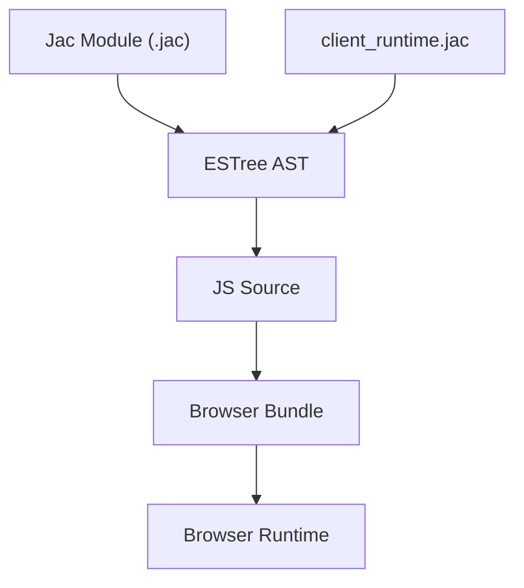
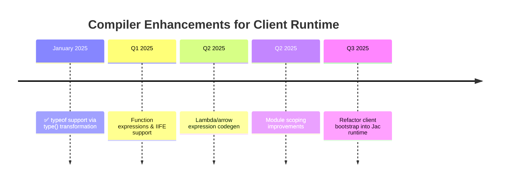

# Jac Client Runtime Feature Roadmap

This document captures the language and compiler enhancements needed to migrate the remaining JavaScript glue code in `client_bundle.py` into native Jac modules.

# Overview

The current web compilation pipeline relies on three moving pieces:

1. `client_runtime.jac` — Jac source that provides JSX helpers, DOM builders, and walker RPC shims.
2. Jac compiler (`jac.lark` + `esast_gen_pass.py`) — translates Jac AST into ESTree, then JavaScript.
3. `client_bundle.py` — Python glue that compiles the runtime and target module to JS and injects browser bootstrap code.



`client_bundle.py` still hosts a significant block of JavaScript — chiefly the polyfill, global registration, and hydration bootstrap — because the Jac language and ECMAScript backend lack certain constructs. Bridging these gaps will let us author the entire client runtime (including bootstrap) in Jac.

# Implemented Features

## ✅ 1. `typeof` Support via `type()` Function

**Status**: **COMPLETED** (2025-01-15)

The `type()` function call is now automatically transformed to JavaScript's `typeof` operator during compilation. This enables browser environment detection in pure Jac.

### Usage

```jac
cl def check_browser_env() {
    let scope = type(globalThis) != "undefined" ? globalThis : window;

    if type(document) == "undefined" {
        return;
    }
}
```

**Generates**:
```javascript
function check_browser_env() {
  const scope = typeof globalThis !== "undefined" ? globalThis : window;

  if (typeof document === "undefined") {
    return;
  }
}
```

### Implementation

* **File**: [esast_gen_pass.py:1586-1640](../jaclang/compiler/passes/ecmascript/esast_gen_pass.py#L1586-L1640)
* **Transformation**: `type(x)` → `typeof x` (client-side only)
* **Tests**: [test_client_codegen.py:68-113](../jaclang/compiler/tests/test_client_codegen.py#L68-L113)
* **Documentation**: [js_compilation_impl_notes.md](./js_compilation_impl_notes.md#1-the-type-keyword-transformation)

### Future Enhancement (Optional)

Native `typeof` keyword syntax could be added for consistency with JavaScript:

```jac
// Potential future syntax (not currently supported)
let t = typeof globalThis;  // Would require parser changes
```

This would require:
- Adding `TYPEOF` token to lexer
- Extending `factor` grammar rule
- Mapping in `exit_unary_expr`

**However**, the current `type(x)` syntax is sufficient and maintains consistency with Python.

---

# Remaining Feature Gaps & Proposals

## 1. Function Expressions and Closures

### Motivation

`client_bundle.py` wraps registration logic in an Immediately Invoked Function Expression (IIFE) to prevent leaking helper variables:

```javascript
(function registerJacClientModule() {
  const moduleFunctions = {};
  // ...
})();
```

Jac currently supports `def` only as declarations, not expressions. Although `jac.lark` lists `lambda_expr`, `EsastGenPass` doesn't implement it, and there is no syntax for emitting a multi-statement closure at expression sites.

### Desired Jac Source

```jac
(def registerJacClientModule() {
    let moduleFunctions: dict[str, any] = {};
    // ...
})()  # IIFE pattern
```

or using lambda syntax if extended:

```jac
lambda registerJacClientModule() {
    let moduleFunctions: dict[str, any] = {};
    // ...
}();
```

### Proposed Design

1. **Function Expression Syntax**
   * Option A: Permit `def` as an expression when parenthesized.
   * Option B: Promote `lambda_expr` to generate `FunctionExpression` / `ArrowFunctionExpression`.

2. **AST Representation**
   * Introduce a new IR node (e.g., `FunctionExpr`) or reuse `Ability` with a flag.

3. **Codegen**
   * Emit `es.FunctionExpression` or `es.ArrowFunctionExpression` rather than `FunctionDeclaration`.
   * Handle name scoping: if the expression carries an identifier, emit named function expressions for stack traces while keeping them local.

4. **Immediate Invocation**
   * Allow call syntax immediately after the function expression (`(... )()`).

### Examples

**Jac (proposed)**:

```jac
let hydrate = def(payload: dict) {
    if not payload.get("function") {
        return;
    }
    // ...
};

hydrate(init_payload);
```

**Generated JS**:

```javascript
const hydrate = function (payload) {
  if (!payload.get("function")) {
    return;
  }
  // ...
};

hydrate(init_payload);
```

### Testing & Tooling

* Parser tests ensuring precedence with surrounding expressions.
* Codegen tests verifying IIFE emission.
* Formatting rules (Jac formatter) updated to handle inline `def`.

## 2. Arrow Functions / Concise Lambdas

### Motivation

The bootstrap defines small callbacks (e.g., `const applyRender = (node) => { ... };`). Forcing these to be top-level Jac functions clutters the API.

### Proposal

Implement arrow-style lambda expressions leveraging the existing but unused `lambda_expr` rule:

**Jac (proposed)**:

```jac
let apply_render = (node) => {
    let renderer = globalThis.renderJsxTree or renderJsxTree;
    if not renderer {
        return;
    }
    renderer(node, root_el);
};
```

**Generated JS**:

```javascript
const apply_render = (node) => {
  const renderer = globalThis.renderJsxTree || renderJsxTree;
  if (!renderer) {
    return;
  }
  renderer(node, root_el);
};
```

### Implementation Notes

* Reuse `lambda_expr` grammar, map to `uni.LambdaExpr`.
* Extend `EsastGenPass` with `exit_lambda_expr` to produce `es.ArrowFunctionExpression`.
* Support both expression-bodied and block-bodied lambdas.

### Compatibility

Arrow functions capture lexical `this`; ensure Jac semantics align or document differences.

## 3. Module-Scoped State Encapsulation

### Motivation

The JS bootstrap uses block scope (`const moduleFunctions = {};`) hidden inside the IIFE. Jac's `let` at top level currently emits `const` in module scope, risking collisions.

### Proposal

Introduce a `module` block or use function expressions (Feature 2) to isolate scope. Additional enhancements could include:

* Allowing `with entry` blocks to compile into closures.
* Supporting block-scoped `let` inside top-level braces.

```jac
with module {
    let module_functions: dict[str, any] = {};
    // ...
}
```

Generates:

```javascript
(()=>{
  const module_functions = {};
  // ...
})();
```

This could piggyback on the same IIFE infrastructure introduced for function expressions.

## 4. JSON Serialization Helpers

The bootstrap serializes manifest payloads using `JSON.stringify`. Jac already wraps these in `client_runtime.jac`. No compiler changes are required, but we should expose higher-level helpers to avoid duplicating serialization logic when moving the bootstrap into Jac.

# Summary Roadmap



# Next Steps

1. ✅ ~~`typeof` support~~ - **COMPLETED** via `type()` function transformation
2. Design and implement function expression syntax and semantics.
3. Enable arrow/lambda expressions and update tooling (formatter, linter).
4. Implement module-scoped state encapsulation.
5. Refactor `client_bundle.py` to call Jac-authored bootstrap once language support lands.

These changes will streamline the client build pipeline, reduce handwritten JS, and keep runtime logic in the Jac language proper.
