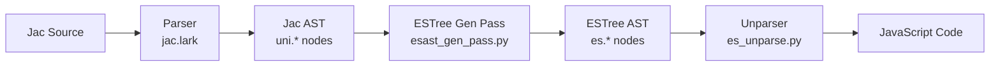

# JavaScript Compilation Pipeline - Implementation Notes

This document captures implementation details, design decisions, and language-specific transformations in the Jac-to-JavaScript compilation pipeline. It serves as a reference for developers working on the ECMAScript backend and documents behaviors that differ between Python and JavaScript targets.

## Overview

The JavaScript compilation pipeline transforms Jac source code into executable JavaScript for client-side (browser) execution. This enables full-stack development in a single language, where code marked with `cl` compiles to JavaScript while server-side code compiles to Python.



### Key Components

| Component | File | Purpose |
|-----------|------|---------|
| **Grammar** | [jac.lark](../jaclang/compiler/jac.lark) | Defines Jac language syntax |
| **UniTree** | [unitree.py](../jaclang/compiler/unitree.py) | Universal IR for Jac AST |
| **ESTree Generator** | [esast_gen_pass.py](../jaclang/compiler/passes/ecmascript/esast_gen_pass.py) | Transforms Jac AST → ESTree AST |
| **ESTree Spec** | [estree.py](../jaclang/compiler/passes/ecmascript/estree.py) | ESTree node definitions |
| **JavaScript Unparser** | [es_unparse.py](../jaclang/compiler/passes/ecmascript/es_unparse.py) | ESTree AST → JavaScript source |

## Language-Specific Transformations

This section documents cases where Jac semantics must be adapted for JavaScript's runtime behavior.

### 1. The `type()` Keyword Transformation

**Status**: ✅ Implemented (as of 2025-01-15)

#### Problem

In Jac, `type(x)` is a Python builtin that returns the type object of `x`. In JavaScript, the equivalent operation is the `typeof` operator, which returns a string like `"number"`, `"string"`, `"object"`, etc.

**Jac (Python context)**:
```python
x = 42
t = type(x)  # <class 'int'>
```

**Jac (JavaScript context - before fix)**:
```javascript
let x = 42;
let t = type(x);  // ❌ ReferenceError: type is not defined
```

#### Solution

When compiling client-side code (`cl` context), `type(expr)` function calls are transformed into `typeof expr` unary expressions.

**Jac source**:
```jac
cl def check_types() {
    let x = 42;
    let y = "hello";
    let t1 = type(x);      // Will become: typeof x
    let t2 = type(y);      // Will become: typeof y
}
```

**Generated JavaScript**:
```javascript
function check_types() {
  let x = 42;
  let y = "hello";
  let t1 = typeof x;
  let t2 = typeof y;
}
```

#### Implementation Details

**File**: [esast_gen_pass.py:1586-1640](../jaclang/compiler/passes/ecmascript/esast_gen_pass.py#L1586-L1640)

The transformation happens in `EsastGenPass.exit_func_call()`:

```python
def exit_func_call(self, node: uni.FuncCall) -> None:
    """Process function call."""
    # Special case: type(x) -> typeof x in JavaScript
    # Check the target directly before processing it into an es_ast
    target_is_type = False
    if isinstance(node.target, (uni.Name, uni.BuiltinType)):
        target_name = getattr(node.target, "sym_name", None)
        if target_name == "type":
            target_is_type = True

    args: list[Union[es.Expression, es.SpreadElement]] = []
    for param in node.params:
        if param.gen.es_ast:
            args.append(param.gen.es_ast)

    if target_is_type and len(args) == 1 and isinstance(args[0], es.Expression):
        typeof_expr = self.sync_loc(
            es.UnaryExpression(operator="typeof", prefix=True, argument=args[0]),
            jac_node=node,
        )
        node.gen.es_ast = typeof_expr
        return

    # ... rest of function call handling
```

**Key Points**:

1. **Early Detection**: The target is checked before attempting to generate its ESTree AST, because `BuiltinType` nodes may not have their `es_ast` populated.

2. **Node Types**: Handles both `uni.Name` and `uni.BuiltinType` since `type` can appear as either depending on context.

3. **Single Argument Only**: The transformation only applies when exactly one argument is provided, matching JavaScript's `typeof` operator syntax.

4. **Client-Side Only**: This transformation is part of `esast_gen_pass.py`, which only runs for client code. Server-side Python code retains `type()` as a function call.

#### Edge Cases Handled

| Case | Jac Input | JavaScript Output |
|------|-----------|-------------------|
| Simple variable | `type(x)` | `typeof x` |
| Object property | `type(obj.prop)` | `typeof obj.prop` |
| Array element | `type(arr[0])` | `typeof arr[0]` |
| Function result | `type(func())` | `typeof func()` |
| String literal | `type("hello")` | `typeof "hello"` |
| Nested expression | `type(x + y)` | `typeof (x + y)` |

#### Test Coverage

**Test File**: [test_client_codegen.py:68-113](../jaclang/compiler/tests/test_client_codegen.py#L68-L113)

```python
def test_type_to_typeof_conversion() -> None:
    """Test that type() calls are converted to typeof in JavaScript."""
    test_code = '''
cl def check_types() {
    let x = 42;
    let y = "hello";
    let t1 = type(x);
    let t2 = type(y);
    return t1;
}
'''
    # Verify type() was converted to typeof
    assert "typeof" in module.gen.js
    assert module.gen.js.count("typeof") == 2
    assert "type(" not in module.gen.js
```

#### Semantic Differences

Developers should be aware of behavioral differences between Python's `type()` and JavaScript's `typeof`:

| Aspect | Python `type(x)` | JavaScript `typeof x` |
|--------|------------------|----------------------|
| **Return Type** | Type object (`<class 'int'>`) | String (`"number"`) |
| **Arrays** | `<class 'list'>` | `"object"` |
| **null/None** | `<class 'NoneType'>` | `"object"` (quirk) |
| **Functions** | `<class 'function'>` | `"function"` |
| **Class instances** | Class type object | `"object"` |

**Example**:
```jac
// Server-side (Python)
def server_check() {
    x = [1, 2, 3];
    print(type(x));  // <class 'list'>
}

// Client-side (JavaScript)
cl def client_check() {
    let x = [1, 2, 3];
    console.log(type(x));  // "object"
}
```

#### Future Considerations

1. **Type Checking**: Consider adding compile-time warnings when `type()` is used in client code, as the semantics differ from Python.

2. **instanceof Alternative**: For class instance checking, JavaScript's `instanceof` operator may be more appropriate than `typeof`. Consider adding helper functions or language support.

3. **Type Reflection**: If full Python-like type introspection is needed in JavaScript, consider providing a runtime library with `__jac_type(x)` that returns more detailed type information.

---

## Additional Transformations

*This section will be expanded with additional JavaScript-specific transformations as they are implemented.*

### 2. Method Name Mapping

**Status**: ✅ Implemented

Common Python string/list methods are mapped to their JavaScript equivalents:

| Jac/Python | JavaScript |
|------------|------------|
| `str.lower()` | `str.toLowerCase()` |
| `str.upper()` | `str.toUpperCase()` |
| `str.startswith(x)` | `str.startsWith(x)` |
| `str.endswith(x)` | `str.endsWith(x)` |

**Implementation**: [esast_gen_pass.py:1615-1635](../jaclang/compiler/passes/ecmascript/esast_gen_pass.py#L1615-L1635)

### 3. Boolean Literals

**Status**: ✅ Implemented

Python's `True`, `False`, and `None` are mapped to JavaScript equivalents:

| Jac/Python | JavaScript |
|------------|------------|
| `True` | `true` |
| `False` | `false` |
| `None` | `null` |

**Implementation**: [esast_gen_pass.py:2007-2019](../jaclang/compiler/passes/ecmascript/esast_gen_pass.py#L2007-L2019)

### 4. The `self` Keyword

**Status**: ✅ Implemented

Jac's `self` keyword (Python convention) is mapped to JavaScript's `this`:

```jac
cl obj MyClass {
    has value: int = 0;

    can increment() {
        self.value += 1;  // Becomes: this.value += 1;
    }
}
```

**Implementation**: [esast_gen_pass.py:2007-2019](../jaclang/compiler/passes/ecmascript/esast_gen_pass.py#L2007-L2019)

---

## Compiler Architecture

### Pass Execution Order

For client-side code marked with `cl`:

1. **Parsing** ([jac_parser.py](../jaclang/compiler/parser.py))
   - Lexical analysis and syntax parsing
   - Produces Jac AST (uni.* nodes)

2. **Symbol Resolution** ([def_use_pass.py](../jaclang/compiler/passes/main/def_use_pass.py))
   - Build symbol tables
   - Resolve name references

3. **Type Checking** (optional, [type_check_pass.py](../jaclang/compiler/passes/main/type_check_pass.py))
   - Infer and validate types
   - Generate type errors/warnings

4. **ESTree Generation** ([esast_gen_pass.py](../jaclang/compiler/passes/ecmascript/esast_gen_pass.py))
   - Transform Jac AST → ESTree AST
   - Apply JavaScript-specific transformations
   - Generate `module.gen.es_ast`

5. **JavaScript Unparsing** ([es_unparse.py](../jaclang/compiler/passes/ecmascript/es_unparse.py))
   - Convert ESTree AST → JavaScript source
   - Generate `module.gen.js`

6. **Client Manifest** ([esast_gen_pass.py](../jaclang/compiler/passes/ecmascript/esast_gen_pass.py))
   - Collect exported functions, globals, parameters
   - Store in `module.gen.client_manifest`

### ESTree Node Types

The ESTree specification (derived from Mozilla's SpiderMonkey parser) defines JavaScript's AST structure. Key node types:

| Category | Node Types |
|----------|------------|
| **Declarations** | `FunctionDeclaration`, `VariableDeclaration`, `ClassDeclaration` |
| **Expressions** | `CallExpression`, `BinaryExpression`, `UnaryExpression`, `MemberExpression` |
| **Statements** | `IfStatement`, `ForStatement`, `WhileStatement`, `ReturnStatement` |
| **Patterns** | `Identifier`, `ArrayPattern`, `ObjectPattern` |
| **Literals** | `Literal`, `TemplateLiteral` |

**Reference**: [estree.py](../jaclang/compiler/passes/ecmascript/estree.py)

---

## Testing Strategy

### Test Organization

| Test Suite | Location | Purpose |
|------------|----------|---------|
| **Client Codegen** | [test_client_codegen.py](../jaclang/compiler/tests/test_client_codegen.py) | High-level client compilation tests |
| **ESTree Generation** | [test_esast_gen_pass.py](../jaclang/compiler/passes/ecmascript/tests/test_esast_gen_pass.py) | AST transformation tests |
| **JavaScript Generation** | [test_js_generation.py](../jaclang/compiler/passes/ecmascript/tests/test_js_generation.py) | JS code output tests |

### Writing Transformation Tests

When adding a new JavaScript-specific transformation:

1. **Create Test Fixture**: Write Jac source demonstrating the feature
2. **Compile and Assert**: Verify the generated JavaScript
3. **Check Edge Cases**: Test boundary conditions
4. **Document Semantics**: Note any behavioral differences

**Example Pattern**:
```python
def test_new_transformation() -> None:
    """Test that feature X transforms to JavaScript Y."""
    jac_code = '''
    cl def example() {
        // Jac code using feature X
    }
    '''
    prog = JacProgram()
    module = prog.compile_from_string(jac_code)

    # Verify transformation
    assert "expected_js_pattern" in module.gen.js
    assert "old_pattern" not in module.gen.js
```

---

## Development Guidelines

### Adding a New Transformation

1. **Identify the Need**: Document why JavaScript requires special handling
2. **Design the Transformation**: Consider edge cases and semantic differences
3. **Implement in ESTree Pass**: Modify [esast_gen_pass.py](../jaclang/compiler/passes/ecmascript/esast_gen_pass.py)
4. **Write Tests**: Add comprehensive test coverage
5. **Document Here**: Add a section to this document with:
   - Problem statement
   - Solution approach
   - Implementation details
   - Edge cases
   - Semantic differences (if any)

### Code Review Checklist

When reviewing JavaScript compilation changes:

- [ ] Does the transformation preserve Jac semantics where possible?
- [ ] Are edge cases handled (null, undefined, empty arrays, etc.)?
- [ ] Are tests comprehensive (positive and negative cases)?
- [ ] Is the transformation documented in this file?
- [ ] Does the generated JavaScript follow idiomatic patterns?
- [ ] Are source maps/locations preserved (`sync_loc`)?

---

## Debugging Tips

### Inspecting Generated AST

```python
from jaclang.compiler.program import JacProgram
import json

prog = JacProgram()
module = prog.compile("myfile.jac")

# View ESTree AST
print(json.dumps(module.gen.es_ast.to_dict(), indent=2))

# View generated JavaScript
print(module.gen.js)
```

### Common Issues

| Issue | Cause | Solution |
|-------|-------|----------|
| `gen.es_ast is None` | Node handler not implemented | Add `exit_<node_type>` method |
| Incorrect operator | Operator mapping missing | Update `op_map` in relevant handler |
| Missing source location | `sync_loc` not called | Wrap ESTree nodes with `self.sync_loc()` |
| Type errors in output | Incorrect node type generated | Verify ESTree node matches JavaScript semantics |

---

## References

- [ESTree Specification](https://github.com/estree/estree) - JavaScript AST standard
- [client_bundle_language_features.md](./client_bundle_language_features.md) - Planned language features
- [jsx_client_serv_design.md](./jsx_client_serv_design.md) - Client-server architecture
- [MDN JavaScript Reference](https://developer.mozilla.org/en-US/docs/Web/JavaScript) - JavaScript semantics

---

## Changelog

| Date | Contributor | Change |
|------|-------------|--------|
| 2025-01-15 | System | Added `type()` → `typeof` transformation documentation |
| 2025-01-15 | System | Created initial document structure |
