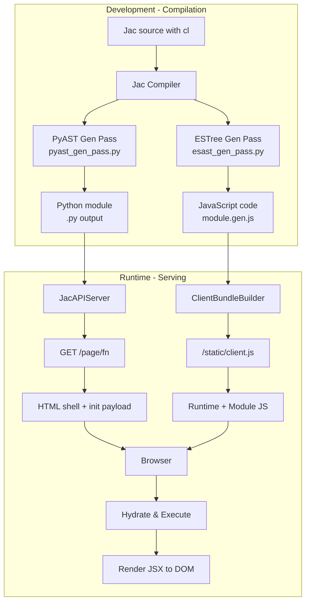

# JSX-Based Webpage Generation Design Document

## Overview

This document describes how Jac's `cl` (client) keyword produces browser-ready web experiences. Client-marked declarations compile to JavaScript and ship through `jac serve` as static bundles that execute entirely in the browser. The current implementation is **CSR-only** (Client-Side Rendering): the server returns an empty HTML shell with bootstrapping metadata and a JavaScript bundle that handles all rendering in the browser.

## Architecture Overview



### CSR Execution Flow

1. **Compilation**: When a `.jac` file is compiled:
   - The `cl` keyword marks declarations for client-side execution
   - `pyast_gen_pass.py` skips Python codegen for client-only nodes (via `_should_skip_client`)
   - `esast_gen_pass.py` generates ECMAScript AST and JavaScript code
   - Client metadata is collected in `ClientManifest` (exports, globals, params)

2. **Bundle Generation**: `ClientBundleBuilder` creates the browser bundle:
   - Compiles [client_runtime.jac](../jaclang/runtimelib/client_runtime.jac) to provide JSX and walker runtime
   - Compiles the application module's client-marked code
   - Generates registration code that exposes functions globally
   - Includes polyfills (e.g., `Object.prototype.get()` for dict-like access)

3. **Page Request**: When `GET /page/<function_name>` is requested:
   - Server returns minimal HTML with empty `<div id="__jac_root"></div>`
   - Embeds `<script id="__jac_init__">` with JSON payload containing:
     - Module name and function name to execute
     - Arguments and their ordering
     - Global variable values
   - Links to `<script src="/static/client.js?hash=...">` bundle

4. **Client Execution**: On DOM load, the browser:
   - Parses the `__jac_init__` payload
   - Looks up the requested function from the global registry
   - Restores client global variables
   - Executes the function with provided arguments
   - Calls `renderJsxTree()` to render the returned JSX into `__jac_root`

> **Note**: SSR + hydration is not currently implemented. All rendering happens on the client.

## Language Features

### 1. The `cl` (Client) Keyword

The `cl` keyword marks Jac declarations for **client-side compilation**. This enables a single `.jac` file to contain both:
- **Server-side code** (compiled to Python via `pyast_gen_pass`)
- **Client-side code** (compiled to JavaScript via `esast_gen_pass`)

When `cl` is present:
- Node is marked with `is_client_decl = True`
- Python codegen is skipped for the declaration (via `_should_skip_client()` in [pyast_gen_pass.py:292-294](../jaclang/compiler/passes/main/pyast_gen_pass.py#L292-L294))
- JavaScript codegen generates ECMAScript AST (in [esast_gen_pass.py](../jaclang/compiler/passes/ecmascript/esast_gen_pass.py))
- The declaration is tracked in the module's `ClientManifest` (exports, globals, params)

#### Supported Constructs

```jac
// Client function - executes in browser, can return JSX
cl def homepage() -> dict {
    return <div>
        <h1>Welcome</h1>
        <button onclick={spawn load_feed()}>Load Feed</button>
    </div>;
}

// Client object - available on both client and server
cl obj ButtonProps {
    has label: str = "Hello";
    has count: int = 0;
}

// Client global - literal value sent to browser
cl let API_BASE_URL: str = "https://api.example.com";
```

#### Grammar Definition

From [jac.lark:8-16, 586](../jaclang/compiler/jac.lark#L8-L16):

```lark
toplevel_stmt: KW_CLIENT? import_stmt
       | KW_CLIENT? archetype
       | impl_def
       | sem_def
       | KW_CLIENT? ability
       | KW_CLIENT? global_var
       | KW_CLIENT? free_code
       | py_code_block
       | KW_CLIENT? test

KW_CLIENT: "cl"
```

### 2. JSX Syntax

JSX is fully supported in Jac with grammar defined in [jac.lark:444-473](../jaclang/compiler/jac.lark#L444-L473). JSX elements are transpiled to `__jacJsx(tag, props, children)` calls by [esast_gen_pass.py:600-701](../jaclang/compiler/passes/ecmascript/esast_gen_pass.py#L600-L701).

#### JSX Features

```jac
cl def render_example() {
    // Basic elements
    let basic = <div>Hello World</div>;

    // Elements with attributes
    let with_attrs = <button id="submit" class="btn">Click</button>;

    // Expression attributes and children
    let name = "Alice";
    let greeting = <h1 data-user={name}>Welcome, {name}!</h1>;

    // Spread attributes
    let props = {"class": "card", "id": "main"};
    let with_spread = <div {...props}>Content</div>;

    // Fragment syntax
    let fragment = <>
        <div>First</div>
        <div>Second</div>
    </>;

    // Component usage (capitalized names)
    let component = <Button label="Click Me" />;

    return <div>{greeting}{component}</div>;
}
```

#### JSX Transpilation

JSX elements compile to function calls:
- `<div>Hello</div>` → `__jacJsx("div", {}, ["Hello"])`
- `<Button {...props} />` → `__jacJsx(Button, Object.assign({}, props), [])`
- Tag names starting with lowercase become string literals
- Tag names starting with uppercase become identifier references
- Props merge via `Object.assign()` when spreads are present

## Implementation Details

### Core Components

| Component | Implementation | Key Responsibilities |
|-----------|----------------|---------------------|
| **Compiler Passes** | | |
| [pyast_gen_pass.py](../jaclang/compiler/passes/main/pyast_gen_pass.py) | Python AST generation | Skips Python codegen for `cl`-marked nodes |
| [esast_gen_pass.py](../jaclang/compiler/passes/ecmascript/esast_gen_pass.py) | ECMAScript AST generation | Generates JavaScript for `cl`-marked nodes, JSX transpilation |
| [es_unparse.py](../jaclang/compiler/passes/ecmascript/es_unparse.py) | JavaScript code generation | Converts ESTree AST to JavaScript source |
| **Runtime Components** | | |
| [client_bundle.py](../jaclang/runtimelib/client_bundle.py) | Bundle builder | Compiles runtime + module, generates registration code |
| [client_runtime.jac](../jaclang/runtimelib/client_runtime.jac) | Client runtime | JSX rendering (`__jacJsx`, `renderJsxTree`), walker spawning (`__jacSpawn`), auth helpers |
| [server.py](../jaclang/runtimelib/server.py) | HTTP server | Serves pages (`/page/<fn>`), bundles (`/static/client.js`), walkers |
| **Data Structures** | | |
| `ClientManifest` | Metadata container | Stores `exports` (function names), `globals` (var names), `params` (arg order), `globals_values` (literal values) |

### Client Bundle Structure

The bundle generated by `ClientBundleBuilder` contains (in order):

1. **Polyfills** - Browser compatibility shims:
   ```javascript
   Object.prototype.get = function(key, defaultValue) {
       return this.hasOwnProperty(key) ? this[key] : (defaultValue !== undefined ? defaultValue : null);
   };
   ```

2. **Client Runtime** - Compiled from [client_runtime.jac](../jaclang/runtimelib/client_runtime.jac):
   - `__jacJsx(tag, props, children)` - JSX factory function
   - `renderJsxTree(node, container)` - DOM rendering
   - `__buildDom(node)` - Recursive DOM builder
   - `__applyProp(element, key, value)` - Attribute/event handler application
   - `__jacSpawn(walker, fields)` - Walker invocation via `/walker/<name>` endpoint
   - Auth helpers: `jacLogin`, `jacLogout`, `jacIsLoggedIn`

3. **Application Module** - Transpiled user code with `cl` declarations

4. **Registration Code** - Exposes module symbols globally:
   ```javascript
   (function registerJacClientModule(){
       const scope = typeof globalThis !== 'undefined' ? globalThis : window;
       const registry = scope.__jacClient || (scope.__jacClient = { functions: {}, globals: {}, modules: {} });

       // Register functions and globals
       moduleFunctions["homepage"] = homepage;
       scope["homepage"] = homepage;

       // Hydration logic - executes on DOMContentLoaded
       function hydrateJacClient() {
           const payload = JSON.parse(document.getElementById('__jac_init__').textContent);
           const target = registry.functions[payload.function];
           const result = target.apply(scope, orderedArgs);
           renderJsxTree(result, document.getElementById('__jac_root'));
       }
   })();
   ```

### Server Endpoints

From [server.py](../jaclang/runtimelib/server.py):

| Endpoint | Method | Description | Implementation |
|----------|--------|-------------|----------------|
| `/page/<fn>` | GET | Render HTML page for client function | Lines 709-741 |
| `/static/client.js` | GET | Serve compiled JavaScript bundle | Lines 662-684 |
| `/walker/<name>` | POST | Spawn walker on node | Lines 914-927 |
| `/function/<name>` | POST | Call server-side function | Lines 899-912 |
| `/user/create` | POST | Create new user account | Lines 857-872 |
| `/user/login` | POST | Authenticate and get token | Lines 874-889 |
| `/functions` | GET | List available functions | Lines 751-759 |
| `/walkers` | GET | List available walkers | Lines 761-769 |

#### Page Rendering Flow

When `GET /page/homepage?arg1=value1` is requested:

1. **Parse request** - Extract function name and query params
2. **Authenticate** - Check auth token, or create guest user
3. **Load module** - Ensure module is loaded and manifest is available
4. **Validate function** - Check function is in `client_exports`
5. **Build payload** - Serialize args, globals, arg order
6. **Render HTML** - Return shell with embedded payload and script tag

HTML template (from [server.py:343-356](../jaclang/runtimelib/server.py#L343-L356)):
```html
<!DOCTYPE html>
<html lang="en">
<head>
    <meta charset="utf-8"/>
    <title>homepage</title>
</head>
<body>
    <div id="__jac_root"></div>
    <script id="__jac_init__" type="application/json">{"module":"myapp","function":"homepage","args":{},"globals":{},"argOrder":[]}</script>
    <script src="/static/client.js?hash=abc123..." defer></script>
</body>
</html>
```

### Client-Side Execution

On page load in the browser:

1. **Wait for DOM** - Registration code waits for `DOMContentLoaded`
2. **Parse payload** - Extract `__jac_init__` JSON
3. **Restore globals** - Set global variables from payload
4. **Lookup function** - Find target function in `__jacClient.functions`
5. **Order arguments** - Map args dict to positional array using `argOrder`
6. **Execute function** - Call function with arguments
7. **Handle result** - If Promise, await; otherwise render immediately
8. **Render JSX** - Call `renderJsxTree(result, __jac_root)`

From [client_bundle.py:262-279](../jaclang/runtimelib/client_bundle.py#L262-L279):
```javascript
const result = target.apply(scope, orderedArgs);
if (result && typeof result.then === 'function') {
    result.then(applyRender).catch((err) => {
        console.error('[Jac] Error resolving client function promise', err);
    });
} else {
    applyRender(result);
}
```

### JSX Rendering

The `renderJsxTree` function ([client_runtime.jac:9-11](../jaclang/runtimelib/client_runtime.jac#L9-L11)) calls `__buildDom` to recursively build DOM:

1. **Null/undefined** → Empty text node
2. **Primitive values** → Text node with `String(value)`
3. **Object with callable `tag`** → Execute component function, recurse
4. **Object with string `tag`** → Create element:
   - Apply props (attributes, event listeners, styles)
   - Recursively build and append children
5. **Return DOM node** → Attach to container

Event handlers are bound in `__applyProp` ([client_runtime.jac:53-68](../jaclang/runtimelib/client_runtime.jac#L53-L68)):
- Props starting with `on` become `addEventListener(event, handler)`
- `onclick` → `click`, `onsubmit` → `submit`, etc.
- `class` and `className` set `element.className`
- `style` objects are applied to `element.style[key]`

## Example Usage

### Complete Application

```jac
// Server-side data model
node User {
    has name: str;
    has email: str;
}

// Client-side global configuration
cl let API_URL: str = "/api";

// Client-side component
cl obj CardProps {
    has title: str = "Untitled";
    has content: str = "";
}

// Client page - renders in browser
cl def homepage() {
    return <div class="app">
        <header>
            <h1>Welcome to Jac</h1>
        </header>
        <main>
            <p>Full-stack web development in one language!</p>
            <button onclick={spawn load_users()}>Load Users</button>
        </main>
    </div>;
}

// Server-side walker - called from client via spawn
walker LoadUsers {
    has users: list = [];

    can process with `root entry {
        # Fetch users from database
        self.users = [{"name": "Alice"}, {"name": "Bob"}];
        report self.users;
    }
}
```

### Running the Application

```bash
# Compile the Jac file
jac myapp.jac

# Start the server
jac serve myapp.jac

# Access the page
# Browser: http://localhost:8000/page/homepage
```

### Client-Server Interaction

When the user clicks "Load Users":

1. **Client**: `spawn load_users()` triggers `__jacSpawn("LoadUsers", {})`
2. **HTTP**: `POST /walker/LoadUsers` with `{"nd": "root"}`
3. **Server**: Spawns `LoadUsers` walker on root node
4. **Server**: Walker executes, generates reports
5. **HTTP**: Returns `{"result": {...}, "reports": [...]}`
6. **Client**: Receives walker results (could update UI)

## Test Coverage

| Test Suite | Location | Coverage |
|------------|----------|----------|
| **Client codegen tests** | [test_client_codegen.py](../jaclang/compiler/tests/test_client_codegen.py) | `cl` keyword detection, manifest generation |
| **ESTree generation tests** | [test_esast_gen_pass.py](../jaclang/compiler/passes/ecmascript/tests/test_esast_gen_pass.py) | JavaScript AST generation |
| **JavaScript generation tests** | [test_js_generation.py](../jaclang/compiler/passes/ecmascript/tests/test_js_generation.py) | JS code output from ESTree |
| **Client bundle tests** | [test_client_bundle.py](../jaclang/runtimelib/tests/test_client_bundle.py) | Bundle building, caching |
| **Server endpoint tests** | [test_serve.py](../jaclang/runtimelib/tests/test_serve.py) | HTTP endpoints, page rendering |
| **JSX rendering tests** | [test_jsx_render.py](../jaclang/runtimelib/tests/test_jsx_render.py) | JSX parsing and rendering |

### Example Test Fixtures

- [client_jsx.jac](../jaclang/compiler/passes/ecmascript/tests/fixtures/client_jsx.jac) - Comprehensive client syntax examples
- [jsx_elements.jac](../examples/reference/jsx_elements.jac) - JSX feature demonstrations

## Known Limitations

1. **No SSR/Hydration** - All rendering happens on the client; no server-side pre-rendering
2. **No Type Checking in JS** - Type annotations are stripped during transpilation
3. **Limited Walker Integration** - `spawn` from client requires server round-trip
4. **No React Ecosystem** - Custom JSX runtime, not compatible with React components
5. **Bundle Size** - Runtime included in every bundle (no code splitting)

## Future Enhancements

Potential improvements for this system:

1. **Server-Side Rendering** - Pre-render initial HTML on server, hydrate on client
2. **Code Splitting** - Separate runtime from application code, lazy load modules
3. **Hot Module Replacement** - Live reload during development
4. **TypeScript Generation** - Optionally emit `.d.ts` files for client code
5. **React Compatibility** - Support importing and using React components
6. **WebSocket Support** - Real-time walker updates without polling
