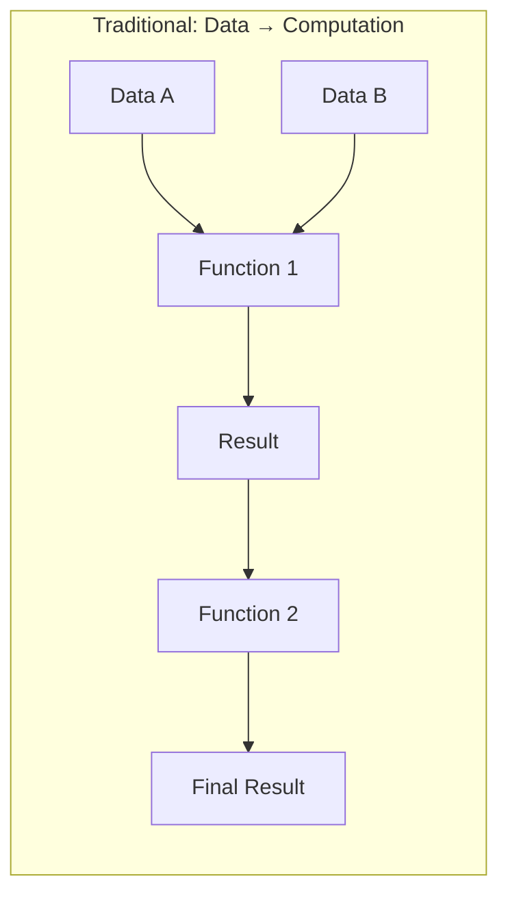
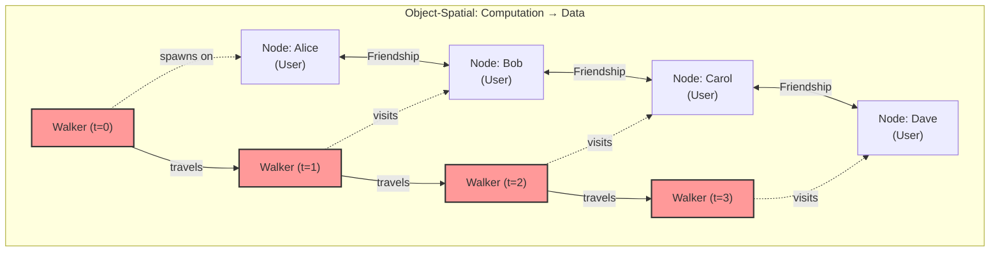
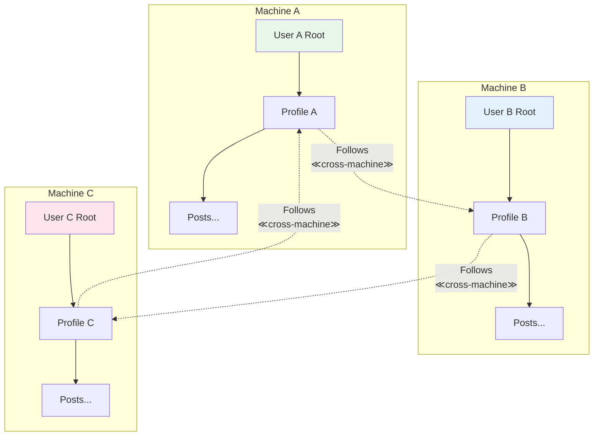
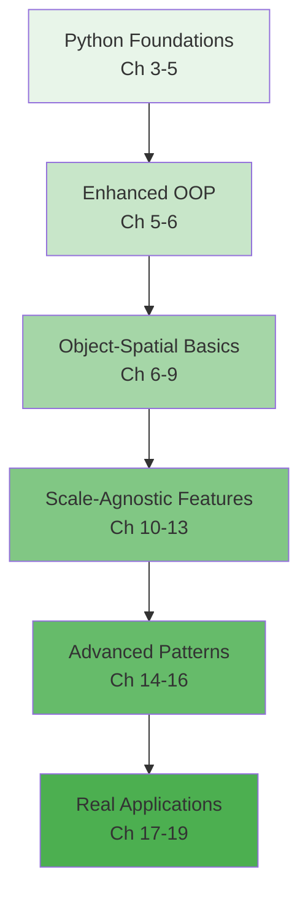

### Chapter 1: Welcome to Jac

#### 1.1 What is Jac?

Jac is a programming language that extends familiar Python-like syntax with revolutionary concepts from Object-Spatial Programming (OSP). While maintaining the readability and expressiveness that Python developers love, Jac introduces a fundamental paradigm shift in how we think about and structure computation.

#### Evolution from Python-like Syntax to Object-Spatial Programming

Jac began as an effort to address the limitations of traditional programming paradigms when dealing with inherently graph-like, interconnected systems. While you'll recognize much of the syntax from Python, Jac adds powerful new constructs that make it natural to express complex relationships and computational flows.

```python
# Traditional Python approach
class User:
    def __init__(self, name):
        self.name = name
        self.friends = []

    def add_friend(self, friend):
        self.friends.append(friend)
        friend.friends.append(self)

# Processing requires external traversal logic
def find_friends_of_friends(user):
    fof = set()
    for friend in user.friends:
        for friend_of_friend in friend.friends:
            if friend_of_friend != user:
                fof.add(friend_of_friend)


    print(f"Friends of {user.name}'s friends:", [user.name for user in fof])
    return fof


# Create users
alice = User("Alice")
bob = User("Bob")
carol = User("Carol")
dave = User("Dave")

# Build friendship connections
alice.add_friend(bob)    # Alice ↔ Bob
bob.add_friend(carol)    # Bob ↔ Carol
carol.add_friend(dave)   # Carol ↔ Dave

# Test the function
fof_alice = find_friends_of_friends(alice)
print(fof_alice)
```

<div class="code-block">
```jac
# Jac's Object-Spatial approach
 node User {
    has name: str;
}

edge Friendship {
    has since: str;
}

walker FindFriendsOfFriends {
    has person: User , friends_of_friends: set = set();

    can traverse with User entry {
        if here != self.person {
            self.friends_of_friends.add(here);
        }
        visit [->:Friendship :->];
    }
}

with entry {
    alice = User(name="Alice");
    bob = User(name="Bob");
    carol = User(name="Carol");
    dave = User(name="Dave");

    alice +>: Friendship(since="today") :+> bob;
    bob +>: Friendship(since="yesterday") :+> carol;
    carol +>: Friendship(since="last month") :+> dave;

    fof = FindFriendsOfFriends(alice) spawn alice;
    print(fof.friends_of_friends);
}
```
</div>

#### The Paradigm Shift: From "Data to Computation" to "Computation to Data"

Traditional programming paradigms operate on a fundamental assumption: data moves to computation. We pass data as arguments to functions, return data from methods, and shuttle information between computational units.



Jac inverts this relationship. In Object-Spatial Programming, computation moves to data through mobile computational entities called "walkers" that traverse a graph of interconnected data locations called "nodes."



This paradigm shift has profound implications:

1. **Natural Graph Representation**: Relationships become first-class citizens through edges
2. **Localized Computation**: Logic executes where data lives, improving locality
3. **Dynamic Behavior**: Computation paths determined at runtime based on data
4. **Distributed-Ready**: Computation naturally spans machine boundaries

#### Scale-Agnostic Programming: Write Once, Scale Anywhere

Perhaps Jac's most revolutionary feature is scale-agnostic programming. Applications written for a single user automatically scale to handle multiple users and distribute across machines without code changes.

```jac
# This same code works for:
# - Single user on one machine
# - Thousands of users on one machine
# - Millions of users across distributed systems

node Profile {
    has user_name: str,
        user_bio: str;
}

node Post {
    has text: str;
}

node Notification {
    has type: str;
}

# Walkers automatically turn into API endpoints in cloud context
walker CreatePost {
    has content: str;
    has timestamp: str;
    has new_post: Post;

    can create with `root entry {
        # 'root' automatically refers to the current user's root node
        # first class variable like 'this' or 'self' references
        self.new_post = here ++> Post(
            content=self.content,
            timestamp=self.timestamp,
            author=here
        );

        # Notify followers - works regardless of scale
        visit [<-:Follows:<->];
    }

    can notify with Profile entry {
        # 'root' automatically refers to the current user's root node
        follower ++> Notification(type="new_post") <++ self.new_post;
    }
}
```

#### 1.2 Why Jac?

#### Limitations of Traditional OOP for Graph-like Structures

Object-Oriented Programming excels at modeling entities and their behaviors, but struggles with several common patterns:

##### 1. **Complex Relationships**
Traditional OOP treats relationships as secondary concerns, typically implemented as references or collections within objects.

```python
# Python: Relationships are afterthoughts
class Person:
    def __init__(self):
        self.friends = []  # Just a list
        self.followers = []  # Another list
        self.blocking = []  # And another

# Relationship logic scattered across methods
def can_see_post(viewer, author, post):
    if viewer in author.blocking:
        return False
    if post.privacy == "friends" and viewer not in author.friends:
        return False
    # More complex logic...
```

```jac
# Jac: Relationships are first-class edges with behavior
edge Follows {
    has since: str;
    has notifications_enabled: bool = true;
}

edge Blocks {
    has reason: str;
    has timestamp: str;
}

# Relationship logic lives in the graph structure
walker CanSeePost {
    has post: Post;

    can check with entry {
        # Blocks prevent traversal naturally
        if [-->:Blocks:-->](?.target == self.post.author) {
            report false;
        }
        # Privacy emerges from graph topology
        report can_reach(here, self.post);
    }
}
```

##### 2. **Traversal Logic**
In traditional OOP, graph traversal requires explicit, often repetitive code.

```python
# Python: Manual traversal with risk of cycles, memory issues
def find_all_dependencies(package, visited=None):
    if visited is None:
        visited = set()

    if package in visited:
        return []

    visited.add(package)
    deps = []

    for dep in package.dependencies:
        deps.append(dep)
        deps.extend(find_all_dependencies(dep, visited))

    return deps
```

```jac
# Jac: Declarative traversal with built-in cycle handling
walker FindDependencies {
    has found: set = {};

    can search with entry {
        self.found.add(here);
        visit [-->:DependsOn:];  # Automatic cycle prevention
    }
}
```

##### 3. **Context-Dependent Behavior**
Objects in traditional OOP have fixed methods that execute the same regardless of context.

```python
# Python: Context requires explicit parameter passing
class Document:
    def render(self, viewer=None, device=None, locale=None):
        if viewer and not self.can_access(viewer):
            return "Access Denied"

        if device == "mobile":
            return self.render_mobile(locale)
        else:
            return self.render_desktop(locale)
```

```jac
# Jac: Context naturally flows with computation
node Document {
    has content: dict;

    # Different behavior for different visitors
    can render with MobileUser entry {
        report self.content.mobile_version;
    }

    can render with DesktopUser entry {
        report self.content.desktop_version;
    }

    can render with Translator entry {
        report translate(self.content, visitor.target_locale);
    }
}
```

#### Benefits of Topological Programming

Jac's topological approach offers several key advantages:

##### 1. **Intuitive Relationship Modeling**

```mermaid
graph TB
    subgraph "Social Network Topology"
        U1[User: Alice]
        U2[User: Bob]
        U3[User: Carol]
        P1[Post: 'Hello!']
        P2[Post: 'Great day!']
        C1[Comment: 'Nice!']

        U1 -->|Follows| U2
        U2 -->|Follows| U1
        U2 -->|Follows| U3
        U1 -->|Authored| P1
        U2 -->|Authored| P2
        U3 -->|Commented| C1
        P2 -->|Has| C1
        U1 -.->|Blocked| U3

        style U1 fill:#01151e
        style U2 fill:#01151e
        style U3 fill:#01151e
        style P1 fill:#1f1320
        style P2 fill:#1f1320
        style C1 fill:#132515
    end
```



##### 2. **Natural Concurrency**
Since walkers are independent computational entities, they naturally support concurrent execution:

```jac
# Multiple walkers can traverse simultaneously
walker AnalyzeUser {
    can analyze with entry {
        # Each walker instance operates independently
        report {
            "post_count": len([-->:Authored:]),
            "follower_count": len([<--:Follows:]),
            "engagement_rate": calculate_engagement(here)
        };
    }
}

# Spawn multiple walkers concurrently
with entry {
    # These execute in parallel automatically
    for user in get_active_users() {
        spawn AnalyzeUser() on user;
    }
}
```

##### 3. **Locality of Reference**
Computation happens where data lives, improving cache efficiency and reducing data movement:

```jac
# Traditional: Data gathered then processed
# Requires loading all posts and comments into memory
def calculate_thread_stats(post_id):
    post = load_post(post_id)
    comments = load_all_comments(post_id)  # Potentially huge

    stats = {
        'total_comments': len(comments),
        'unique_commenters': len(set(c.author for c in comments)),
        'max_depth': calculate_max_depth(comments)
    }
    return stats

# Jac: Process data in place
walker ThreadStats {
    has total_comments: int = 0;
    has commenters: set = {};
    has max_depth: int = 0;
    has current_depth: int = 0;

    can analyze with Comment entry {
        self.total_comments += 1;
        self.commenters.add(here.author);
        self.max_depth = max(self.max_depth, self.current_depth);

        # Traverse deeper
        self.current_depth += 1;
        visit [-->:HasReply:];
        self.current_depth -= 1;
    }
}
```

#### Built-in Persistence and Multi-User Support

Unlike traditional languages that treat persistence as an external concern, Jac makes it intrinsic:

```jac
# Automatic persistence - no database required!
node UserProfile {
    has username: str;
    has email: str;
    has created_at: str;
}

with entry {
    # Connected to root = automatically persisted
    root ++> UserProfile(
        username="alice",
        email="alice@example.com",
        created_at=timestamp_now()
    );
}  # Data persists after program exits

# Next execution can access the same data
walker GetProfile {
    can get with entry {
        profile = [-->:UserProfile:][0];
        report profile;
    }
}
```

Multi-user support is equally seamless:

```jac
# Each user automatically gets their own isolated root node
walker UpdateBio {
    has new_bio: str;

    can update with entry {
        # 'root' refers to the current user's root
        # No explicit user context needed!
        profile = root[-->:UserProfile:][0];
        profile.bio = self.new_bio;
    }
}
```

#### Natural Expression of Distributed Systems

Jac's topological model naturally extends across machine boundaries:



The same walker code works regardless of distribution:

```jac
walker FindMutualFollowers {
    has target_user: User;
    has mutuals: set = {};

    can find with entry {
        my_followers = set([<--:Follows:]);

        # This works even if target_user is on another machine!
        visit self.target_user {
            their_followers = set([<--:Follows:]);
            self.mutuals = my_followers.intersection(their_followers);
        };

        report self.mutuals;
    }
}
```

#### 1.3 This Guide's Approach

#### Leveraging Your Python Knowledge

As a Python developer, you already possess most of the knowledge needed to be productive in Jac. This guide builds on your existing expertise while introducing new concepts gradually.

##### What Transfers Directly:
- Basic syntax for expressions and statements
- Data types (with mandatory type annotations)
- Control flow concepts (with curly braces)
- Object-oriented principles (enhanced with archetypes)
- Standard library patterns (with Jac equivalents)

##### What's Enhanced:
- Functions become "abilities" with context-aware execution
- Classes become "archetypes" with richer semantics
- Decorators work with new constructs
- Type system is mandatory but more expressive

##### What's New:
- Graph-based program structure
- Mobile computation via walkers
- Automatic persistence and multi-user support
- Scale-agnostic deployment

#### Progressive Learning Path

This guide follows a carefully designed progression:



1. **Start Familiar**: Begin with Python-like features to build confidence
2. **Introduce Concepts**: Learn object-spatial concepts with simple examples
3. **Build Understanding**: Create increasingly complex graph structures
4. **Master Scale**: Understand persistence and distribution
5. **Apply Knowledge**: Build real-world applications

#### Hands-on Examples Throughout

Every concept in this guide is illustrated with practical, runnable examples. You'll build:

- **Chapter 3-5**: A todo list app (familiar territory)
- **Chapter 6-9**: A social network (graph basics)
- **Chapter 10-13**: A multi-user blog (scale-agnostic features)
- **Chapter 14-16**: A distributed task queue (advanced patterns)
- **Chapter 17-19**: Complete applications combining all concepts

Each example builds on the previous, creating a coherent learning journey from Python developer to Jac expert.

```jac
# Your journey starts here!
with entry {
    print("Welcome to Jac!");

    # Create your first persistent node
    root ++> LearningProgress(
        developer="You",
        started_at=timestamp_now(),
        excitement_level=100
    );
}
```

Ready to begin? In the next chapter, we'll set up your Jac development environment and write your first Object-Spatial program. The future of programming awaits!