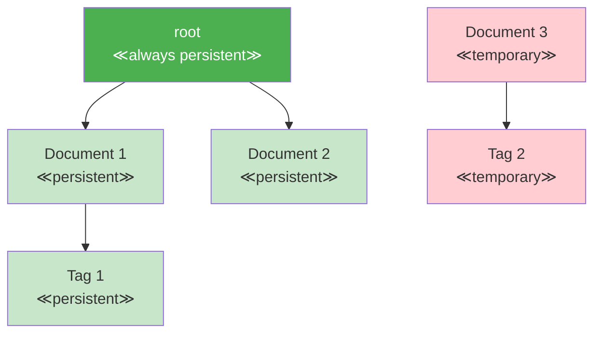

# Chapter 10: The Root Node and Persistence

One of Jac's most revolutionary features is automatic persistence through the root node. Unlike traditional applications that require explicit database operations, Jac programs naturally persist state between executions. This chapter explores how the root node enables scale-agnostic programming, where the same code works for single-user scripts and multi-user applications.

## 10.1 Understanding the Root Node

### Global Accessibility via `root` Keyword

The `root` keyword provides global access to a special persistent node that serves as the anchor for your application's data:

<div class="code-block">

```jac
def do_something() {
    # root accessible in any function
    root ++> CustomNode(data = "test");
}

walker Explorer {
    can explore with entry {
        # root accessible in walkers
        print(f"Starting from: {root}");
        visit root;
    }
}

node CustomNode {
    has data: str ;

    can check_root with root entry {
        # root accessible in node abilities
        print(f"Root from node: {root}");
    }
}

# root is available everywhere - no imports needed
with entry {
    print(f"Root node: {root}");
    print(f"Type: {type(root).__name__}");

    # root is always the same node within a user context
    id1 = id(root);
    do_something();
    id2 = id(root);
    assert id1 == id2;  # Always true
}

```
</div>

The `root` node is special:

- **Always Available**: No declaration or initialization needed
- **Globally Accessible**: Available in any context without passing
- **Type-Safe**: It's a real node with all node capabilities
- **User-Specific**: Each user gets their own isolated root

### Automatic Persistence Model

Everything connected to root persists automatically:

<div class="code-block">

```jac
node UserProfile {
    has username: str;
    has login_count: int;
}
# First run - create data
with entry {
    print("=== First Run - Creating Data ===");

    # Data connected to root persists
    user_profile = root ++> UserProfile(username = "alice", login_count = 1);

    print(f"Created profile: {user_profile[0].username}");
}

# Second run - data still exists!
with entry {
    print("=== Second Run - Data Persists ===");

    # Find existing data
    profiles = [root --> (`?UserProfile)];
    if profiles {
        profile = profiles[0];
        print(f"Found profile: {profile.username}");
        print(f"Previous logins: {profile.login_count}");

        # Update persistent data
        profile.login_count += 1;
        print(f"Updated logins: {profile.login_count}");
    }
}

# Third run - updates persist too
with entry {
    print("=== Third Run - Updates Persist ===");

    profile = [root --> (`?UserProfile)][0];
    profile.login_count += 1;
    print(f"Login count is now: {profile.login_count}");  # Shows 3
}
```
</div>

### Reachability-Based Persistence

Nodes persist based on reachability from root:

<div class="code-block">

```jac
node Document {
    has title: str;
    has content: str;
}

node Tag {
    has name: str;
    has color: str = "#0000FF";
}

with entry {
    # Connected to root = persistent
    doc1 = root ++> Document(
        title="My First Document",
        content="This will persist"
    );

    # Connected to persistent node = also persistent
    tag1 = doc1[0] ++> Tag(name="important");

    # NOT connected to root = temporary
    doc2 = Document(
        title="Temporary Document",
        content="This will NOT persist"
    );

    # Connecting later makes it persistent
    root ++> doc2;  # Now doc2 will persist
    print([root --> ]);

    # Disconnecting makes it non-persistent
    edge2 = [root -->][1];
    del edge2;  # doc1 and tag1 no longer persist
    print([root --> ]);
}
```
</div>




## 10.2 Building Persistent Applications

### Connecting to Root for Persistence

Here's how to design applications with automatic persistence:

<div class="code-block">

```jac
import from datetime {datetime, timedelta}
import secrets;

# Application data model
node AppData {
    has version: str = "1.0.0";
    has settings: dict = {};
    has initialized: bool = False;
}

node User {
    has id: str by postinit;
    has email: str;
    has created_at: str;
    has preferences: dict = {};

    def postinit(){
        self.id = jid(self);
    }
}

node Session {
    has token: str;
    has user_id: str;
    has expires_at: str;
    has active: bool = True;
}

def generate_token(length:int =32) {
    return secrets.token_hex(length);
}


# Initialize or get existing app data
def get_or_create_app_data() -> AppData {
    app_data_nodes = [root -->(`?AppData)];

    if not app_data_nodes {
        print("First run - initializing app data");
        app_data_node = root ++> AppData(
            initialized=True,
            settings={
                "theme": "light",
                "language": "en",
                "debug": False
            }
        );
        return app_data_node[0];
    }

    return app_data_nodes[0];
}

# User management with persistence
def create_user(email: str) -> User | None {
    app = get_or_create_app_data();

    # Check if user exists
    existing = [app -->(`?User)](?email == email);

    if existing {
        print(f"User {email} already exists");
        return existing[0];
    }

    # Create persistent user
    user = app ++> User(
        email=email,
        created_at=datetime.now()
    );

    print(f"Created user: {email}");
    print(f"User jid {user[0].id}");
    return user[0];
}

# Session management
def create_session(user: User) -> Session {

    # Sessions connected to user (persistent)
    session = user ++> Session(
        token=generate_token(),
        user_id=user.id,
        expires_at=(datetime.now() + timedelta(hours=24)).isoformat()
    );

    return session;
}

# Example usage
with entry {
    app = get_or_create_app_data();
    print(f"App version: {app.version}");

    # Create or get user
    email = "alice@example.com";
    user = create_user(email);

    if user {
        session = create_session(user);
        print(f"Session created: {session[0].token[:8]}...");
    } else {
        # User already exists, find them
        user = [app -->(`?User)](?email == email);
        print(f"Welcome back, {user.email}!");
        print(f"Account created: {user.created_at}");
    }
}
```
</div>

### Managing Ephemeral vs Persistent State

Not everything should persist. Here's how to manage both:

<div class="code-block">

```jac
node PersistentCache {
    has updated_at: str;
    has data: dict = {};
}

node EphemeralCache {
    has created_at: str;
    has data: dict = {};
}

walker CacheManager {
    has operation: str;
    has key: str;
    has value: any = None;

    can manage with entry {
        # Get or create persistent cache
        p_cache_list = [root -->(`?PersistentCache)] if [root -->(`?PersistentCache)]
                     else root ++> PersistentCache(updated_at=now());
        p_cache = p_cache_list[0];

        # Ephemeral cache is not connected to root
        e_cache_list = EphemeralCache(created_at=now());
        e_cache = e_cache_list[0];

        if self.operation == "store" {
            # Store in both caches
            p_cache.data[self.key] = self.value;
            p_cache.updated_at = now();
            e_cache.data[self.key] = self.value;

            print(f"Stored {self.key} in both caches");

        } elif self.operation == "get" {
            # Try ephemeral first (faster)
            if self.key in e_cache.data {
                print(f"Found {self.key} in ephemeral cache");
                report e_cache.data[self.key];
            } elif self.key in p_cache.data {
                print(f"Found {self.key} in persistent cache");
                report p_cache.data[self.key];
            } else {
                print(f"Key {self.key} not found");
                report None;
            }
        }
    }
}

# Hybrid approach for performance
node FastStore {
    has persistent_data: dict = {};    # Important data
    has memory_cache: dict = {};      # Temporary cache
    has stats: dict = {               # Temporary stats
        "hits": 0,
        "misses": 0
    };

    def get(key: str) -> any {
        # Check memory first
        if key in self.memory_cache {
            self.stats["hits"] += 1;
            return self.memory_cache[key];
        }

        # Check persistent
        if key in self.persistent_data {
            self.stats["misses"] += 1;
            # Populate memory cache
            self.memory_cache[key] = self.persistent_data[key];
            return self.persistent_data[key];
        }

        return None;
    }

    def store(key: str, value: any, persist: bool = True) {
        self.memory_cache[key] = value;

        if persist {
            self.persistent_data[key] = value;
        }
    }
}
```
</div>

### Database-Free Data Persistence

Jac eliminates the need for separate databases in many applications:

```python
# Traditional approach requires database setup
# Python with SQLAlchemy:
from sqlalchemy import create_engine, Column, String, Integer
from sqlalchemy.ext.declarative import declarative_base

Base = declarative_base()
engine = create_engine('sqlite:///app.db')

class Task(Base):
    __tablename__ = 'tasks'
    id = Column(Integer, primary_key=True)
    title = Column(String)
    completed = Column(Boolean)

Base.metadata.create_all(engine)
session = Session(engine)
# ... lots more boilerplate ...
```

<div class="code-block">

```jac
import from datetime { datetime }
import sys;

# Jac approach - just connect to root!
node Task {
    has id: str by postinit;
    has title: str;
    has created_at: str;
    has completed: bool = False;
    has completed_at: str|None = None;

    def postinit() {
        self.id = jid(self);
    }
}

node TaskList {
    has name: str;
    has created_at: str;
}

# Complete task management with zero database code
walker TaskManager {
    has command: str;
    has title: str = "";
    has list_name: str = "default";
    has task_id: str = "";

    can execute with entry {
        # Get or create task list
        lists = [root -->(`?TaskList)](?name == self.list_name);
        task_list = lists[0] if lists else root ++> TaskList(
            name=self.list_name,
            created_at=datetime.now()
        );

        match self.command {
            case "add": self.add_task(task_list);
            case "complete": self.complete_task(task_list);
            case "list": self.list_tasks(task_list);
            case "stats": self.show_stats(task_list);
        }
    }

    def add_task(task_list: TaskList) -> None {
        task = task_list ++> Task(
            title=self.title,
            created_at=datetime.now()
        );

        print(f"Added task: {task[0].title} (ID: {task[0].id[:8]})");
    }

    def complete_task(task_list: TaskList) {
        tasks = [task_list-->(`?Task)](id.startswith(self.task_id));

        if tasks {
            task = tasks[0];
            task.completed = True;
            task.completed_at = datetime.now();
            print(f"Completed: {task.title}");
        } else {
            print(f"Task {self.task_id} not found");
        }
    }

    def list_tasks(task_list: TaskList) {
        tasks = [task_list -->(`?Task)];
        print(f"\n=== {task_list.name} Tasks ===");

        for task in tasks {
            status = "✓" if task.completed else "○";
            print(f"{status} [{task.id[:8]}] {task.title}");
        }

        completed = [task_list -->(`?Task)](?completed==True);
        print(f"\nTotal: {len(tasks)} | Completed: {len(completed)}");
    }

    def show_stats(task_list: TaskList) {
        tasks = [task_list -->(`?Task)];
        completed = [task_list -->(`?Task)](?completed==True);

        print(f"\n=== Task Statistics ===");
        print(f"List: {task_list.name}");
        print(f"Total tasks: {len(tasks)}");
        print(f"Completed: {len(completed)}");
        print(f"Pending: {len(tasks) - len(completed)}");

        if completed {
            # Calculate average completion time
            total_time = 0;

            for task in completed {
                created = datetime.fromisoformat(task.created_at);
                completed = datetime.fromisoformat(task.completed_at);
                total_time += (completed - created).total_seconds();
            }

            avg_hours = (total_time / len(completed)) / 3600;
            print(f"Avg completion time: {avg_hours} hours");
        }
    }
}

# Usage - all data persists automatically!
with entry {

    if len(sys.argv) < 2 {
        print("Usage: jac run tasks.jac <command> [args]");
        print("Commands:");
        print("  add <title> - Add a new task");
        print("  complete <id> - Mark task as complete");
        print("  list - Show all tasks");
        print("  stats - Show statistics");
    }

    command = sys.argv[1];
    manager = TaskManager(command=command);

    if command == "add" and len(sys.argv) > 2 {
        manager.title = " ".join(sys.argv[2:]);
    } elif command == "complete" and len(sys.argv) > 2 {
        manager.task_id = sys.argv[2];
    }

    root spawn manager;
}
```
</div>

### Advanced Persistence Patterns

#### Versioned Data

<div class="code-block">

```jac
import from datetime {datetime}

node VersionedDocument {
    has id: str;
    has content: str;
    has created_at: str;
    has modified_at: str;
    has version: int = 1;
}

node DocumentVersion {
    has version: int;
    has content: str;
    has modified_at: str;
    has modified_by: str;
}

walker DocumentEditor {
    has doc_id: str;
    has new_content: str;
    has user: str;

    can edit with entry {
        # Find document
        docs = [root -->(`?VersionedDocument)](id == self.doc_id);
        if not docs {
            print(f"Document {self.doc_id} not found");
            report f"Document {self.doc_id} not found";
        }

        doc = docs[0];

        # Save current version
        doc ++> DocumentVersion(
            version=doc.version,
            content=doc.content,
            modified_at=doc.modified_at,
            modified_by=self.user
        );

        # Update document
        doc.content = self.new_content;
        doc.version += 1;
        doc.modified_at = datetime.now();

        print(f"Document updated to version {doc.version}");
    }

    can get_history with entry {
        docs = [root -->(`?VersionedDocument)](id == self.doc_id);
        if not docs {
            report f"Document {self.doc_id} not found";
        }

        doc = docs[0];
        versions = [doc -->(`?DocumentVersion)];

        print(f"\n=== History for {doc.id} ===");
        print(f"Current version: {doc.version}");

        for v in versions.sorted(key=lambda x:int : x.version, reverse=True) {
            print(f"\nVersion {v.version}:");
            print(f"  Modified: {v.modified_at}");
            print(f"  By: {v.modified_by}");
            print(f"  Content: {v.content[:50]}...");
        }
    }
}
```
</div>

#### Lazy Loading Pattern

<div class="code-block">

```jac
import time;

node DataContainer {
    has id: str;
    has metadata: dict;
    has data_loaded: bool = False;
}

node HeavyData {
    has payload: list;
    has size_mb: float;
}

walker DataLoader {
    has container_id: str;
    has operation: str;

    can operate with DataContainer entry {
        if self.operation == "get_metadata" {
            # Just return metadata without loading heavy data
            report here.metadata;

        } elif self.operation == "load_full" {
            if not here.data_loaded {
                # Load heavy data only when needed
                self.load_heavy_data(here);
            }

            heavy = [here -->(`?HeavyData)][0];
            report {
                "metadata": here.metadata,
                "data": heavy.payload,
                "size": heavy.size_mb
            };
        }
    }

    def load_heavy_data(container: DataContainer) {
        print(f"Loading heavy data for {container.id}...");

        # Simulate loading large data
        time.sleep(1);

        container ++> HeavyData(
            payload=list(range(1000000)),
            size_mb=7.6
        );

        container.data_loaded = True;
    }
}
```
</div>

#### Garbage Collection Pattern

<div class="code-block">

```jac
import from datetime { datetime, timedelta }

node CachedItem {
    has key: str;
    has value: any;
    has created_at: str;
    has last_accessed: str;
    has ttl_hours: int = 24;
}

walker CacheCleanup {
    has cleaned_count: int = 0;
    has checked_count: int = 0;

    can cleanup with CachedItem entry {

        self.checked_count += 1;

        last_access = datetime.fromisoformat(here.last_accessed);
        age = datetime.now() - last_access;

        if age > timedelta(hours=here.ttl_hours) {
            print(f"Removing expired cache item: {here.key}");

            # Disconnect from root to remove persistence
            for edge in [here <--] {
                del edge;
            }

            self.cleaned_count += 1;
        }

        visit [-->];
    }

    can report with exit {
        print(f"\nCache cleanup complete:");
        print(f"  Checked: {self.checked_count} items");
        print(f"  Cleaned: {self.cleaned_count} items");
    }
}

# Run periodic cleanup
with entry {
    print("Running cache cleanup...");
    root spawn CacheCleanup();
}
```
</div>

### Performance Considerations

While persistence is automatic, consider these patterns for optimization:

```python
# pythonic_indexing.py - Traditional Python approach with manual indexing
import json
from typing import Dict, List, Any, Optional

class DataItem:
    def __init__(self, data: Dict[str, Any]):
        self.data = data

    def __repr__(self):
        return f"DataItem({self.data})"

class IndexedCollection:
    def __init__(self, name: str):
        self.name = name
        self.items: List[DataItem] = []
        self.indices: Dict[str, Dict[Any, List[DataItem]]] = {}

    def add_item(self, item_data: Dict[str, Any]) -> None:
        """Add item with automatic indexing - Pythonic approach"""
        # Store item
        item = DataItem(item_data)
        self.items.append(item)

        # Update indices manually (traditional Python way)
        for key, value in item_data.items():
            if key not in self.indices:
                self.indices[key] = {}

            if value not in self.indices[key]:
                self.indices[key][value] = []

            self.indices[key][value].append(item)

    def find_by(self, key: str, value: Any) -> List[DataItem]:
        """Fast O(1) lookup using indices - Pythonic optimization"""
        if key in self.indices and value in self.indices[key]:
            return self.indices[key][value]
        return []

print("=== PYTHONIC APPROACH: Manual Indexing in Python ===")

# Create indexed collection
collection = IndexedCollection("python_collection")

# Add test data
test_data = [
    {"name": "Alice", "age": 30, "city": "New York", "department": "Engineering"},
    {"name": "Bob", "age": 25, "city": "Boston", "department": "Sales"},
    {"name": "Charlie", "age": 30, "city": "Chicago", "department": "Engineering"},
    {"name": "Diana", "age": 28, "city": "New York", "department": "Marketing"},
    {"name": "Eve", "age": 25, "city": "Seattle", "department": "Engineering"}
]

for item in test_data:
    collection.add_item(item)
    print("Data is added")

# Fast index-based queries
print("--- Fast Index-based Queries (O(1)) ---")

age_30_users = collection.find_by("age", 30)
print("Users with age 30")
for user in age_30_users:
    print(f"  - {user.data['name']} from {user.data['city']}, age {user.data['age']}")

engineers = collection.find_by("department", "Engineering")
print("Engineers")
for engineer in engineers:
    print(f"  - {engineer.data['name']} from {engineer.data['city']}, age {engineer.data['age']}")
```

<div class="code-block">

```jac
# Indexing pattern for fast lookups
node DataItem {
    has data: dict;
}

walker add_item {
    has data: dict;

    can add with `root entry {
        root ++> DataItem(self.data);
        print("Data is added");
    }
}

walker finder {
    has key: str;
    has value: any;

    can find with `root entry {
        visit [root --> (`?DataItem)];
    }

    can reported with DataItem entry {
        if here.data.get(self.key) == self.value {
            print(f"  - {here.data['name']} from {here.data['city']}, age {here.data['age']}");
        }
    }
}

# Example usage
with entry {
    test_data = [
        {"name": "Alice", "age": 30, "city": "New York", "department": "Engineering"},
        {"name": "Bob", "age": 25, "city": "Boston", "department": "Sales"},
        {"name": "Charlie", "age": 30, "city": "Chicago", "department": "Engineering"},
        {"name": "Diana", "age": 28, "city": "New York", "department": "Marketing"},
        {"name": "Eve", "age": 25, "city": "Seattle", "department": "Engineering"}
    ];
    for data in test_data {
        add_item(data) spawn root;
    }

    print("--- Fast Jac Based Filtering ---");
    print("Users with age 30");
    finder("age", 30) spawn root;
    print("Engineers");
    finder("department", "Engineering") spawn root;

}
```
</div>

## Summary

In this chapter, we've explored Jac's revolutionary persistence model:

- **The Root Node**: A globally accessible anchor for persistent data
- **Automatic Persistence**: No database required—just connect to root
- **Reachability Model**: Data persists based on graph connectivity
- **Zero Configuration**: No schema definitions, migrations, or connection strings
- **Performance Patterns**: Indexing, lazy loading, and cleanup strategies

This persistence model eliminates entire categories of boilerplate code. You focus on your domain logic while Jac handles data persistence automatically. The same patterns that work for a simple script scale to multi-user applications—which we'll explore in the next chapter.