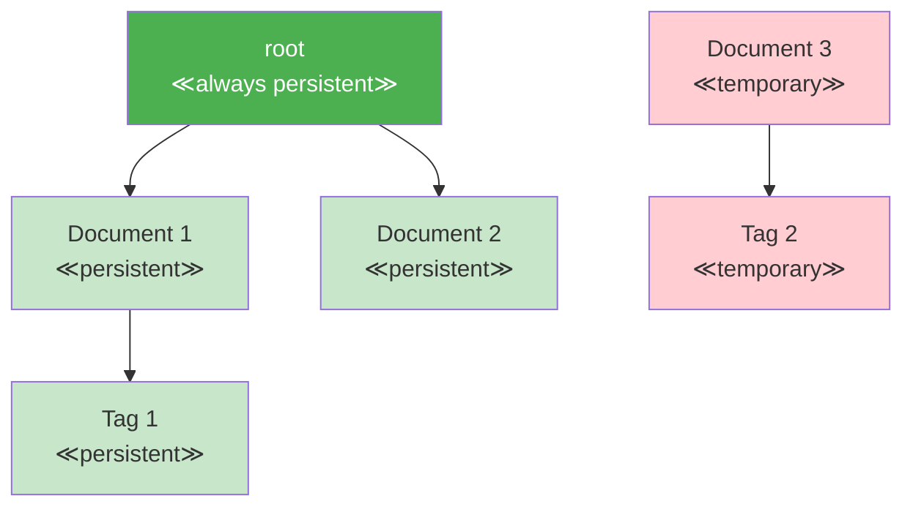

### Chapter 10: The Root Node and Persistence

One of Jac's most revolutionary features is automatic persistence through the root node. Unlike traditional applications that require explicit database operations, Jac programs naturally persist state between executions. This chapter explores how the root node enables scale-agnostic programming, where the same code works for single-user scripts and multi-user applications.

#### 10.1 Understanding the Root Node

### Global Accessibility via `root` Keyword

The `root` keyword provides global access to a special persistent node that serves as the anchor for your application's data:

```jac
// root is available everywhere - no imports needed
with entry {
    print(f"Root node: {root}");
    print(f"Type: {type(root).__name__}");

    // root is always the same node within a user context
    let id1 = id(root);
    do_something();
    let id2 = id(root);
    assert id1 == id2;  // Always true
}

can do_something() {
    // root accessible in any function
    root ++> node { has data: str = "test"; };
}

walker Explorer {
    can explore with entry {
        // root accessible in walkers
        print(f"Starting from: {root}");
        visit root;
    }
}

node CustomNode {
    can check_root with entry {
        // root accessible in node abilities
        print(f"Root from node: {root}");
    }
}
```

The `root` node is special:
- **Always Available**: No declaration or initialization needed
- **Globally Accessible**: Available in any context without passing
- **Type-Safe**: It's a real node with all node capabilities
- **User-Specific**: Each user gets their own isolated root

### Automatic Persistence Model

Everything connected to root persists automatically:

```jac
// First run - create data
with entry {
    print("=== First Run - Creating Data ===");

    // Data connected to root persists
    let user_profile = root ++> node UserProfile {
        has username: str = "alice";
        has created_at: str = "2024-01-15";
        has login_count: int = 1;
    };

    print(f"Created profile: {user_profile.username}");
}

// Second run - data still exists!
with entry {
    print("=== Second Run - Data Persists ===");

    // Find existing data
    let profiles = root[-->:UserProfile:];
    if profiles {
        let profile = profiles[0];
        print(f"Found profile: {profile.username}");
        print(f"Previous logins: {profile.login_count}");

        // Update persistent data
        profile.login_count += 1;
        print(f"Updated logins: {profile.login_count}");
    }
}

// Third run - updates persist too
with entry {
    print("=== Third Run - Updates Persist ===");

    let profile = root[-->:UserProfile:][0];
    print(f"Login count is now: {profile.login_count}");  // Shows 3
}
```

### Reachability-Based Persistence

Nodes persist based on reachability from root:

```jac
node Document {
    has title: str;
    has content: str;
    has created: str;
}

node Tag {
    has name: str;
    has color: str = "#0000FF";
}

with entry {
    // Connected to root = persistent
    let doc1 = root ++> Document(
        title="My First Document",
        content="This will persist",
        created=now()
    );

    // Connected to persistent node = also persistent
    let tag1 = doc1 ++> Tag(name="important");

    // NOT connected to root = temporary
    let doc2 = Document(
        title="Temporary Document",
        content="This will NOT persist",
        created=now()
    );

    // Connecting later makes it persistent
    root ++> doc2;  // Now doc2 will persist

    // Disconnecting makes it non-persistent
    del root --> doc1;  // doc1 and tag1 no longer persist
}
```



#### 10.2 Building Persistent Applications

### Connecting to Root for Persistence

Here's how to design applications with automatic persistence:

```jac
// Application data model
node AppData {
    has version: str = "1.0.0";
    has settings: dict = {};
    has initialized: bool = false;
}

node User {
    has id: str;
    has email: str;
    has preferences: dict = {};
    has created_at: str;
}

node Session {
    has token: str;
    has user_id: str;
    has expires_at: str;
    has active: bool = true;
}

// Initialize or get existing app data
can get_or_create_app_data() -> AppData {
    let app_data_nodes = root[-->:AppData:];

    if not app_data_nodes {
        print("First run - initializing app data");
        return root ++> AppData(
            initialized=true,
            settings={
                "theme": "light",
                "language": "en",
                "debug": false
            }
        );
    }

    return app_data_nodes[0];
}

// User management with persistence
can create_user(email: str) -> User? {
    let app = get_or_create_app_data();

    // Check if user exists
    let existing = app[-->:User:].filter(
        lambda u: User -> bool : u.email == email
    );

    if existing {
        print(f"User {email} already exists");
        return None;
    }

    // Create persistent user
    let user = app ++> User(
        id=generate_id(),
        email=email,
        created_at=now()
    );

    print(f"Created user: {email}");
    return user;
}

// Session management
can create_session(user: User) -> Session {
    import:py from datetime import datetime, timedelta;

    // Sessions connected to user (persistent)
    let session = user ++> Session(
        token=generate_token(),
        user_id=user.id,
        expires_at=(datetime.now() + timedelta(hours=24)).isoformat()
    );

    return session;
}

// Example usage
with entry {
    let app = get_or_create_app_data();
    print(f"App version: {app.version}");

    // Create or get user
    let email = "alice@example.com";
    let user = create_user(email);

    if user {
        let session = create_session(user);
        print(f"Session created: {session.token[:8]}...");
    } else {
        // User already exists, find them
        let user = app[-->:User:].filter(
            lambda u: User -> bool : u.email == email
        )[0];
        print(f"Welcome back, {user.email}!");
        print(f"Account created: {user.created_at}");
    }
}
```

### Managing Ephemeral vs Persistent State

Not everything should persist. Here's how to manage both:

```jac
node PersistentCache {
    has data: dict = {};
    has updated_at: str;
}

node EphemeralCache {
    has data: dict = {};
    has created_at: str;
}

walker CacheManager {
    has operation: str;
    has key: str;
    has value: any? = None;

    can manage with entry {
        // Get or create persistent cache
        let p_cache = root[-->:PersistentCache:][0] if root[-->:PersistentCache:]
                     else root ++> PersistentCache(updated_at=now());

        // Ephemeral cache is not connected to root
        let e_cache = EphemeralCache(created_at=now());

        if self.operation == "store" {
            // Store in both caches
            p_cache.data[self.key] = self.value;
            p_cache.updated_at = now();
            e_cache.data[self.key] = self.value;

            print(f"Stored {self.key} in both caches");

        } elif self.operation == "get" {
            // Try ephemeral first (faster)
            if self.key in e_cache.data {
                print(f"Found {self.key} in ephemeral cache");
                report e_cache.data[self.key];
            } elif self.key in p_cache.data {
                print(f"Found {self.key} in persistent cache");
                report p_cache.data[self.key];
            } else {
                print(f"Key {self.key} not found");
                report None;
            }
        }
    }
}

// Hybrid approach for performance
node FastStore {
    has persistent_data: dict = {};    // Important data
    has memory_cache: dict = {};      // Temporary cache
    has stats: dict = {               // Temporary stats
        "hits": 0,
        "misses": 0
    };

    can get(key: str) -> any? {
        // Check memory first
        if key in self.memory_cache {
            self.stats["hits"] += 1;
            return self.memory_cache[key];
        }

        // Check persistent
        if key in self.persistent_data {
            self.stats["misses"] += 1;
            // Populate memory cache
            self.memory_cache[key] = self.persistent_data[key];
            return self.persistent_data[key];
        }

        return None;
    }

    can store(key: str, value: any, persist: bool = true) {
        self.memory_cache[key] = value;

        if persist {
            self.persistent_data[key] = value;
        }
    }
}
```

### Database-Free Data Persistence

Jac eliminates the need for separate databases in many applications:

```jac
// Traditional approach requires database setup
// Python with SQLAlchemy:
# from sqlalchemy import create_engine, Column, String, Integer
# from sqlalchemy.ext.declarative import declarative_base
#
# Base = declarative_base()
# engine = create_engine('sqlite:///app.db')
#
# class Task(Base):
#     __tablename__ = 'tasks'
#     id = Column(Integer, primary_key=True)
#     title = Column(String)
#     completed = Column(Boolean)
#
# Base.metadata.create_all(engine)
# session = Session(engine)
# # ... lots more boilerplate ...

// Jac approach - just connect to root!
node Task {
    has id: str;
    has title: str;
    has completed: bool = false;
    has created_at: str;
    has completed_at: str? = None;
}

node TaskList {
    has name: str;
    has created_at: str;
}

// Complete task management with zero database code
walker TaskManager {
    has command: str;
    has title: str = "";
    has list_name: str = "default";
    has task_id: str = "";

    can execute with entry {
        // Get or create task list
        let lists = root[-->:TaskList:(?.name == self.list_name):];
        let task_list = lists[0] if lists else root ++> TaskList(
            name=self.list_name,
            created_at=now()
        );

        match self.command {
            case "add": self.add_task(task_list);
            case "complete": self.complete_task(task_list);
            case "list": self.list_tasks(task_list);
            case "stats": self.show_stats(task_list);
        }
    }

    can add_task(task_list: TaskList) {
        let task = task_list ++> Task(
            id=generate_id(),
            title=self.title,
            created_at=now()
        );

        print(f"Added task: {task.title} (ID: {task.id[:8]})");
    }

    can complete_task(task_list: TaskList) {
        let tasks = task_list[-->:Task:(?.id.startswith(self.task_id)):];

        if tasks {
            let task = tasks[0];
            task.completed = true;
            task.completed_at = now();
            print(f"Completed: {task.title}");
        } else {
            print(f"Task {self.task_id} not found");
        }
    }

    can list_tasks(task_list: TaskList) {
        let tasks = task_list[-->:Task:];
        print(f"\n=== {task_list.name} Tasks ===");

        for task in tasks {
            let status = "✓" if task.completed else "○";
            print(f"{status} [{task.id[:8]}] {task.title}");
        }

        let completed = tasks.filter(lambda t: Task -> bool : t.completed);
        print(f"\nTotal: {len(tasks)} | Completed: {len(completed)}");
    }

    can show_stats(task_list: TaskList) {
        let tasks = task_list[-->:Task:];
        let completed = tasks.filter(lambda t: Task -> bool : t.completed);

        print(f"\n=== Task Statistics ===");
        print(f"List: {task_list.name}");
        print(f"Total tasks: {len(tasks)}");
        print(f"Completed: {len(completed)}");
        print(f"Pending: {len(tasks) - len(completed)}");

        if completed {
            // Calculate average completion time
            import:py from datetime import datetime;
            total_time = 0;

            for task in completed {
                created = datetime.fromisoformat(task.created_at);
                completed = datetime.fromisoformat(task.completed_at);
                total_time += (completed - created).total_seconds();
            }

            avg_hours = (total_time / len(completed)) / 3600;
            print(f"Avg completion time: {avg_hours:.1f} hours");
        }
    }
}

// Usage - all data persists automatically!
with entry {
    import:py sys;

    if len(sys.argv) < 2 {
        print("Usage: jac run tasks.jac <command> [args]");
        print("Commands:");
        print("  add <title> - Add a new task");
        print("  complete <id> - Mark task as complete");
        print("  list - Show all tasks");
        print("  stats - Show statistics");
        return;
    }

    let command = sys.argv[1];
    let manager = TaskManager(command=command);

    if command == "add" and len(sys.argv) > 2 {
        manager.title = " ".join(sys.argv[2:]);
    } elif command == "complete" and len(sys.argv) > 2 {
        manager.task_id = sys.argv[2];
    }

    spawn manager on root;
}
```

### Advanced Persistence Patterns

#### Versioned Data

```jac
node VersionedDocument {
    has id: str;
    has content: str;
    has version: int = 1;
    has created_at: str;
    has modified_at: str;
}

node DocumentVersion {
    has version: int;
    has content: str;
    has modified_at: str;
    has modified_by: str;
}

walker DocumentEditor {
    has doc_id: str;
    has new_content: str;
    has user: str;

    can edit with entry {
        // Find document
        let docs = root[-->:VersionedDocument:(?.id == self.doc_id):];
        if not docs {
            print(f"Document {self.doc_id} not found");
            return;
        }

        let doc = docs[0];

        // Save current version
        doc ++> DocumentVersion(
            version=doc.version,
            content=doc.content,
            modified_at=doc.modified_at,
            modified_by=self.user
        );

        // Update document
        doc.content = self.new_content;
        doc.version += 1;
        doc.modified_at = now();

        print(f"Document updated to version {doc.version}");
    }

    can get_history with entry {
        let docs = root[-->:VersionedDocument:(?.id == self.doc_id):];
        if not docs {
            return;
        }

        let doc = docs[0];
        let versions = doc[-->:DocumentVersion:];

        print(f"\n=== History for {doc.id} ===");
        print(f"Current version: {doc.version}");

        for v in versions.sorted(key=lambda x: x.version, reverse=true) {
            print(f"\nVersion {v.version}:");
            print(f"  Modified: {v.modified_at}");
            print(f"  By: {v.modified_by}");
            print(f"  Content: {v.content[:50]}...");
        }
    }
}
```

#### Lazy Loading Pattern

```jac
node DataContainer {
    has id: str;
    has metadata: dict;
    has data_loaded: bool = false;
}

node HeavyData {
    has payload: list;
    has size_mb: float;
}

walker DataLoader {
    has container_id: str;
    has operation: str;

    can operate with DataContainer entry {
        if self.operation == "get_metadata" {
            // Just return metadata without loading heavy data
            report here.metadata;

        } elif self.operation == "load_full" {
            if not here.data_loaded {
                // Load heavy data only when needed
                self.load_heavy_data(here);
            }

            let heavy = here[-->:HeavyData:][0];
            report {
                "metadata": here.metadata,
                "data": heavy.payload,
                "size": heavy.size_mb
            };
        }
    }

    can load_heavy_data(container: DataContainer) {
        print(f"Loading heavy data for {container.id}...");

        // Simulate loading large data
        import:py time;
        time.sleep(1);

        container ++> HeavyData(
            payload=list(range(1000000)),
            size_mb=7.6
        );

        container.data_loaded = true;
    }
}
```

#### Garbage Collection Pattern

```jac
node CachedItem {
    has key: str;
    has value: any;
    has created_at: str;
    has last_accessed: str;
    has ttl_hours: int = 24;
}

walker CacheCleanup {
    has cleaned_count: int = 0;
    has checked_count: int = 0;

    can cleanup with CachedItem entry {
        import:py from datetime import datetime, timedelta;

        self.checked_count += 1;

        last_access = datetime.fromisoformat(here.last_accessed);
        age = datetime.now() - last_access;

        if age > timedelta(hours=here.ttl_hours) {
            print(f"Removing expired cache item: {here.key}");

            // Disconnect from root to remove persistence
            for edge in here[<--] {
                del edge;
            }

            self.cleaned_count += 1;
        }

        visit [-->];
    }

    can report with exit {
        print(f"\nCache cleanup complete:");
        print(f"  Checked: {self.checked_count} items");
        print(f"  Cleaned: {self.cleaned_count} items");
    }
}

// Run periodic cleanup
with entry:cleanup {
    print("Running cache cleanup...");
    spawn CacheCleanup() on root;
}
```

### Performance Considerations

While persistence is automatic, consider these patterns for optimization:

```jac
// Indexing pattern for fast lookups
node IndexedCollection {
    has name: str;
    has indices: dict = {};

    can add_item(item: dict) {
        // Store item
        let item_node = self ++> node DataItem {
            has data: dict;
        }(data=item);

        // Update indices
        for key, value in item.items() {
            if key not in self.indices {
                self.indices[key] = {};
            }

            if value not in self.indices[key] {
                self.indices[key][value] = [];
            }

            self.indices[key][value].append(item_node);
        }
    }

    can find_by(key: str, value: any) -> list {
        if key in self.indices and value in self.indices[key] {
            return self.indices[key][value];
        }
        return [];
    }
}

// Pagination pattern for large collections
walker PaginatedQuery {
    has page: int = 1;
    has page_size: int = 20;
    has filters: dict = {};
    has total_count: int = 0;
    has results: list = [];

    can query with entry {
        // Get all matching items
        let all_items = root[-->:DataItem:];

        // Apply filters
        let filtered = all_items;
        for key, value in self.filters.items() {
            filtered = filtered.filter(
                lambda item: DataItem -> bool : item.data.get(key) == value
            );
        }

        self.total_count = len(filtered);

        // Paginate
        let start = (self.page - 1) * self.page_size;
        let end = start + self.page_size;
        self.results = filtered[start:end];

        report {
            "page": self.page,
            "page_size": self.page_size,
            "total": self.total_count,
            "pages": (self.total_count + self.page_size - 1) // self.page_size,
            "data": self.results
        };
    }
}
```

### Summary

In this chapter, we've explored Jac's revolutionary persistence model:

- **The Root Node**: A globally accessible anchor for persistent data
- **Automatic Persistence**: No database required—just connect to root
- **Reachability Model**: Data persists based on graph connectivity
- **Zero Configuration**: No schema definitions, migrations, or connection strings
- **Performance Patterns**: Indexing, lazy loading, and cleanup strategies

This persistence model eliminates entire categories of boilerplate code. You focus on your domain logic while Jac handles data persistence automatically. The same patterns that work for a simple script scale to multi-user applications—which we'll explore in the next chapter.