### Chapter 11: Multi-User Applications

Jac's automatic user isolation transforms single-user code into multi-user applications without modification. Each user gets their own isolated root node and data space, enabling secure multi-tenancy by default. This chapter explores how to build applications that serve multiple users simultaneously while maintaining data isolation and enabling controlled sharing.

#### 11.1 Automatic User Isolation

### User-Specific Root Nodes

In Jac, each user automatically gets their own isolated root node:

```jac
// This same code works for ANY user
with entry {
    // 'root' always refers to the current user's root
    let profile = root[-->:UserProfile:];

    if not profile {
        // First time user
        print("Welcome! Creating your profile...");
        root ++> UserProfile(
            created_at=now(),
            last_login=now()
        );
    } else {
        // Returning user
        let prof = profile[0];
        print(f"Welcome back! Last login: {prof.last_login}");
        prof.last_login = now();
    }
}

node UserProfile {
    has created_at: str;
    has last_login: str;
    has preferences: dict = {};
    has subscription: str = "free";
}
```

When different users run this code:
- Alice sees only Alice's data
- Bob sees only Bob's data
- No explicit user management needed!

```mermaid
graph TD
    subgraph "User: Alice"
        RA[root<br/>≪Alice's≫]
        PA[Profile<br/>≪Alice's≫]
        DA[Data<br/>≪Alice's≫]
        RA --> PA
        PA --> DA
    end

    subgraph "User: Bob"
        RB[root<br/>≪Bob's≫]
        PB[Profile<br/>≪Bob's≫]
        DB[Data<br/>≪Bob's≫]
        RB --> PB
        PB --> DB
    end

    subgraph "User: Charlie"
        RC[root<br/>≪Charlie's≫]
        PC[Profile<br/>≪Charlie's≫]
        DC[Data<br/>≪Charlie's≫]
        RC --> PC
        PC --> DC
    end

    style RA fill:#e8f5e9
    style RB fill:#e3f2fd
    style RC fill:#fff3e0
```



### Built-in Session Management

Jac handles user sessions automatically:

```jac
// No session management code needed!
walker TodoManager {
    has command: str;
    has task_title: str = "";

    can manage with entry {
        // Automatically executes in correct user context
        match self.command {
            case "add": self.add_task();
            case "list": self.list_tasks();
            case "stats": self.show_stats();
        }
    }

    can add_task {
        // Creates task in current user's space
        let task = root ++> Task(
            title=self.task_title,
            created_at=now(),
            owner=get_current_user_id()  // Automatic!
        );

        print(f"Task added: {task.title}");
    }

    can list_tasks {
        // Only sees current user's tasks
        let tasks = root[-->:Task:];

        print(f"\nYour tasks ({len(tasks)} total):");
        for task in tasks {
            let status = "✓" if task.completed else "○";
            print(f"  {status} {task.title}");
        }
    }
}

node Task {
    has title: str;
    has completed: bool = false;
    has created_at: str;
    has owner: str;
}
```

### Security Through Topology

User isolation is enforced at the graph level:

```jac
// Attempting cross-user access
walker SecurityTest {
    has target_user_id: str;

    can test_isolation with entry {
        // This will NEVER access another user's data
        let my_data = root[-->:PrivateData:];
        print(f"Found {len(my_data)} private items");

        // Even if you somehow got another user's node reference,
        // the runtime prevents cross-user traversal
        try {
            let other_root = self.get_other_user_root(self.target_user_id);
            let their_data = other_root[-->:PrivateData:];  // BLOCKED!
        } except SecurityError as e {
            print(f"Security: {e}");  // "Cross-user access denied"
        }
    }
}

node PrivateData {
    has content: str;
    has classification: str = "confidential";
}
```

#### 11.2 Multi-User Patterns

### User Data Organization

Best practices for organizing user-specific data:

```jac
// User data hierarchy pattern
node UserSpace {
    has user_id: str;
    has created_at: str;
    has tier: str = "free";
}

node Projects {
    has active_count: int = 0;
    has archived_count: int = 0;
}

node Settings {
    has theme: str = "light";
    has language: str = "en";
    has notifications: dict = {
        "email": true,
        "push": false,
        "sms": false
    };
}

// Initialize user space
walker InitializeUser {
    has user_id: str;
    has tier: str = "free";

    can setup with entry {
        // Check if already initialized
        let existing = root[-->:UserSpace:];
        if existing {
            print(f"User {self.user_id} already initialized");
            return;
        }

        // Create organized structure
        let space = root ++> UserSpace(
            user_id=self.user_id,
            created_at=now(),
            tier=self.tier
        );

        space ++> Projects();
        space ++> Settings();

        print(f"Initialized user space for {self.user_id}");
    }
}

// Organize user projects
node Project {
    has name: str;
    has description: str = "";
    has created_at: str;
    has updated_at: str;
    has archived: bool = false;
    has collaborators: list[str] = [];
}

walker ProjectManager {
    has action: str;
    has project_name: str;
    has description: str = "";

    can manage with entry {
        // Get user's project container
        let space = root[-->:UserSpace:][0];
        let projects = space[-->:Projects:][0];

        match self.action {
            case "create": self.create_project(projects);
            case "list": self.list_projects(projects);
            case "archive": self.archive_project(projects);
            case "share": self.share_project(projects);
        }
    }

    can create_project(projects: Projects) {
        let project = projects ++> Project(
            name=self.project_name,
            description=self.description,
            created_at=now(),
            updated_at=now()
        );

        projects.active_count += 1;
        print(f"Created project: {project.name}");
    }

    can list_projects(projects: Projects) {
        let all_projects = projects[-->:Project:];
        let active = all_projects.filter(lambda p: Project -> bool : not p.archived);
        let archived = all_projects.filter(lambda p: Project -> bool : p.archived);

        print(f"\n=== Your Projects ===");
        print(f"Active ({len(active)}):");
        for p in active {
            print(f"  - {p.name}: {p.description}");
        }

        if archived {
            print(f"\nArchived ({len(archived)}):");
            for p in archived {
                print(f"  - {p.name} (archived)");
            }
        }
    }
}
```

### Shared vs Private Subgraphs

Creating controlled sharing between users:

```jac
// Shared workspace pattern
node SharedWorkspace {
    has id: str;
    has name: str;
    has created_by: str;
    has created_at: str;
    has members: list[str] = [];
}

node WorkspaceLink {
    has workspace_id: str;
    has role: str = "viewer";  // viewer, editor, admin
    has joined_at: str;
}

edge CanAccess {
    has permissions: list[str];
}

walker WorkspaceManager {
    has action: str;
    has workspace_name: str = "";
    has workspace_id: str = "";
    has invite_user: str = "";
    has role: str = "viewer";

    can manage with entry {
        match self.action {
            case "create": self.create_workspace();
            case "invite": self.invite_to_workspace();
            case "list": self.list_workspaces();
            case "access": self.access_workspace();
        }
    }

    can create_workspace {
        // Create in shared space (not under user root)
        let workspace = SharedWorkspace(
            id=generate_id(),
            name=self.workspace_name,
            created_by=get_current_user_id(),
            created_at=now(),
            members=[get_current_user_id()]
        );

        // Link to user's root
        root ++> WorkspaceLink(
            workspace_id=workspace.id,
            role="admin",
            joined_at=now()
        );

        print(f"Created workspace: {workspace.name} (ID: {workspace.id})");
        report workspace.id;
    }

    can invite_to_workspace {
        // Check if current user has permission
        let links = root[-->:WorkspaceLink:(?.workspace_id == self.workspace_id):];
        if not links or links[0].role != "admin" {
            print("Only admins can invite users");
            return;
        }

        // Create invitation (would be sent to other user)
        let invitation = {
            "workspace_id": self.workspace_id,
            "invited_by": get_current_user_id(),
            "role": self.role,
            "created_at": now()
        };

        // In real app, this would notify the other user
        print(f"Invitation sent to {self.invite_user}");
        report invitation;
    }

    can access_workspace {
        // Find workspace link
        let links = root[-->:WorkspaceLink:(?.workspace_id == self.workspace_id):];
        if not links {
            print("You don't have access to this workspace");
            return;
        }

        let link = links[0];
        print(f"Accessing workspace {self.workspace_id} as {link.role}");

        // In real app, would load shared workspace data
        // based on permissions
    }
}
```

### Cross-User Communication Patterns

Enabling users to interact while maintaining isolation:

```jac
// Message passing between users
node Message {
    has id: str;
    has from_user: str;
    has to_user: str;
    has subject: str;
    has content: str;
    has sent_at: str;
    has read_at: str? = None;
}

node Inbox;
node Outbox;

walker MessageSystem {
    has action: str;
    has to_user: str = "";
    has subject: str = "";
    has content: str = "";
    has message_id: str = "";

    can setup_messaging with entry {
        // Ensure user has inbox/outbox
        if not root[-->:Inbox:] {
            root ++> Inbox();
        }
        if not root[-->:Outbox:] {
            root ++> Outbox();
        }
    }

    can send_message with entry {
        self.setup_messaging();

        let outbox = root[-->:Outbox:][0];
        let from_user = get_current_user_id();

        // Create message in sender's outbox
        let message = outbox ++> Message(
            id=generate_id(),
            from_user=from_user,
            to_user=self.to_user,
            subject=self.subject,
            content=self.content,
            sent_at=now()
        );

        // In real system, this would trigger delivery to recipient
        // For demo, we'll simulate it
        self.deliver_message(message);

        print(f"Message sent to {self.to_user}");
    }

    can deliver_message(message: Message) {
        // This would run in recipient's context
        // Simulating cross-user delivery
        print(f"[System] Delivering message {message.id} to {message.to_user}");

        // Would create a copy in recipient's inbox
        // recipient_root[-->:Inbox:][0] ++> message_copy;
    }

    can list_inbox with entry {
        self.setup_messaging();

        let inbox = root[-->:Inbox:];
        if not inbox {
            print("No inbox found");
            return;
        }

        let messages = inbox[0][-->:Message:];
        print(f"\n=== Inbox ({len(messages)} messages) ===");

        for msg in messages.sorted(key=lambda m: m.sent_at, reverse=true) {
            let status = "📬" if msg.read_at else "📨";
            print(f"{status} From: {msg.from_user}");
            print(f"   Subject: {msg.subject}");
            print(f"   Sent: {msg.sent_at}");
        }
    }
}
```

### Public Profiles and Discovery

Allowing users to discover each other:

```jac
// Public profile system
node PublicProfile {
    has user_id: str;
    has display_name: str;
    has bio: str = "";
    has avatar_url: str = "";
    has is_public: bool = true;
    has followers_count: int = 0;
    has following_count: int = 0;
}

// Global discovery space (not under any user's root)
node GlobalDirectory {
    has profile_count: int = 0;
}

edge Follows {
    has since: str;
}

walker ProfileManager {
    has action: str;
    has display_name: str = "";
    has bio: str = "";
    has target_user: str = "";

    can manage with entry {
        match self.action {
            case "create": self.create_public_profile();
            case "update": self.update_profile();
            case "follow": self.follow_user();
            case "discover": self.discover_users();
        }
    }

    can create_public_profile {
        // Check if profile exists
        let existing = root[-->:PublicProfile:];
        if existing {
            print("Profile already exists");
            return;
        }

        // Create profile linked to user
        let profile = root ++> PublicProfile(
            user_id=get_current_user_id(),
            display_name=self.display_name,
            bio=self.bio
        );

        // Also add to global directory
        // (In real system, this would be in shared space)
        print(f"Created public profile: {profile.display_name}");
    }

    can follow_user {
        // Get my profile
        let my_profile = root[-->:PublicProfile:][0];

        // In real system, would find target user's profile
        // For demo, we'll simulate
        print(f"Following user: {self.target_user}");

        // Create follow relationship
        my_profile ++>:Follows(since=now()):++> self.target_user;
        my_profile.following_count += 1;

        // Target user's follower count would increase
        // target_profile.followers_count += 1;
    }

    can discover_users {
        // In real system, would search global directory
        print("\n=== Discover Users ===");
        print("Featured profiles:");
        print("  - @alice_dev - Software engineer and Jac enthusiast");
        print("  - @bob_designer - UI/UX Designer");
        print("  - @charlie_data - Data scientist");

        // Would actually search/filter profiles
    }
}
```

### Activity Feeds and Notifications

Building user-specific activity streams:

```jac
node Activity {
    has id: str;
    has type: str;  // post, comment, like, follow
    has actor_id: str;
    has actor_name: str;
    has content: dict;
    has created_at: str;
    has read: bool = false;
}

node ActivityFeed {
    has last_checked: str;
}

walker ActivityManager {
    has action: str;
    has activity_type: str = "";
    has content: dict = {};

    can manage with entry {
        // Ensure feed exists
        if not root[-->:ActivityFeed:] {
            root ++> ActivityFeed(last_checked=now());
        }

        match self.action {
            case "add": self.add_activity();
            case "view": self.view_feed();
            case "mark_read": self.mark_all_read();
        }
    }

    can add_activity {
        let feed = root[-->:ActivityFeed:][0];

        feed ++> Activity(
            id=generate_id(),
            type=self.activity_type,
            actor_id=get_current_user_id(),
            actor_name="Current User",
            content=self.content,
            created_at=now()
        );

        print(f"Activity added: {self.activity_type}");
    }

    can view_feed {
        let feed = root[-->:ActivityFeed:][0];
        let activities = feed[-->:Activity:];

        // Sort by time, newest first
        let sorted_activities = activities.sorted(
            key=lambda a: a.created_at,
            reverse=true
        );

        print(f"\n=== Activity Feed ===");
        print(f"Last checked: {feed.last_checked}");

        let unread_count = len([a for a in activities if not a.read]);
        if unread_count > 0 {
            print(f"🔔 {unread_count} new activities\n");
        }

        for activity in sorted_activities[:10] {  // Show latest 10
            let indicator = "●" if not activity.read else "○";

            match activity.type {
                case "post":
                    print(f"{indicator} {activity.actor_name} created a new post");
                case "comment":
                    print(f"{indicator} {activity.actor_name} commented on your post");
                case "like":
                    print(f"{indicator} {activity.actor_name} liked your content");
                case "follow":
                    print(f"{indicator} {activity.actor_name} started following you");
            }

            print(f"   {activity.created_at}");
        }

        // Update last checked
        feed.last_checked = now();
    }
}
```

### Permission Systems

Implementing fine-grained permissions:

```jac
node Resource {
    has id: str;
    has type: str;  // document, folder, etc
    has name: str;
    has owner: str;
    has created_at: str;
}

edge HasPermission {
    has permissions: list[str];  // read, write, delete, share
    has granted_by: str;
    has granted_at: str;
}

walker PermissionManager {
    has action: str;
    has resource_id: str = "";
    has user_id: str = "";
    has permissions: list[str] = [];

    can check_permission(resource: Resource, permission: str) -> bool {
        let current_user = get_current_user_id();

        // Owner has all permissions
        if resource.owner == current_user {
            return true;
        }

        // Check granted permissions
        let perms = resource[<--:HasPermission:].filter(
            lambda p: HasPermission -> bool : current_user in p.permissions
        );

        return permission in perms[0].permissions if perms else false;
    }

    can grant_permission with entry {
        // Find resource
        let resources = root[-->*:Resource:(?.id == self.resource_id):];
        if not resources {
            print("Resource not found");
            return;
        }

        let resource = resources[0];

        // Check if current user can share
        if not self.check_permission(resource, "share") {
            print("You don't have permission to share this resource");
            return;
        }

        // Grant permission
        resource ++>:HasPermission(
            permissions=self.permissions,
            granted_by=get_current_user_id(),
            granted_at=now()
        ):++> self.user_id;

        print(f"Granted {self.permissions} to {self.user_id}");
    }
}
```

### Multi-User Analytics

Aggregate analytics while preserving privacy:

```jac
// User analytics node
node UserAnalytics {
    has user_id: str;
    has events: list[dict] = [];
    has summary: dict = {};
}

// Global analytics (anonymized)
node GlobalAnalytics {
    has total_users: int = 0;
    has total_events: int = 0;
    has event_types: dict = {};
    has daily_active: dict = {};
}

walker AnalyticsTracker {
    has event_type: str;
    has event_data: dict = {};

    can track_event with entry {
        // Get or create user analytics
        let analytics = root[-->:UserAnalytics:];
        let user_analytics = analytics[0] if analytics else root ++> UserAnalytics(
            user_id=get_current_user_id()
        );

        // Record event
        let event = {
            "type": self.event_type,
            "data": self.event_data,
            "timestamp": now()
        };

        user_analytics.events.append(event);

        // Update user summary
        if self.event_type not in user_analytics.summary {
            user_analytics.summary[self.event_type] = 0;
        }
        user_analytics.summary[self.event_type] += 1;

        // Would also update global analytics (anonymized)
        print(f"Tracked event: {self.event_type}");
    }
}

walker AnalyticsReporter {
    has scope: str = "user";  // user or global

    can generate_report with entry {
        if self.scope == "user" {
            self.user_report();
        } else {
            self.global_report();
        }
    }

    can user_report {
        let analytics = root[-->:UserAnalytics:];
        if not analytics {
            print("No analytics data found");
            return;
        }

        let data = analytics[0];
        print(f"\n=== Your Analytics ===");
        print(f"Total events: {len(data.events)}");

        print("\nEvent breakdown:");
        for event_type, count in data.summary.items() {
            print(f"  {event_type}: {count}");
        }

        // Recent activity
        let recent = data.events[-5:] if len(data.events) >= 5 else data.events;
        print(f"\nRecent activity:");
        for event in recent {
            print(f"  - {event['type']} at {event['timestamp']}");
        }
    }
}
```

### Best Practices for Multi-User Apps

##### 1. **Design for Isolation First**

```jac
// Good: User data naturally isolated
node UserContent {
    has title: str;
    has content: str;
    has private: bool = true;
}

walker ContentManager {
    can create_content with entry {
        // Automatically in user's space
        root ++> UserContent(
            title=self.title,
            content=self.content
        );
    }
}

// Bad: Trying to manage users manually
node BadContent {
    has owner_id: str;  // Don't do this!
    has title: str;
}
```

##### 2. **Use Topology for Permissions**

```jac
// Good: Permissions through graph structure
node Team {
    has name: str;
}

edge MemberOf {
    has role: str;
}

can user_can_access_team(team: Team) -> bool {
    // Check if path exists from user to team
    return len(root[-->*:MemberOf:-->:Team:(? == team):]) > 0;
}

// Bad: Storing permissions in lists
node BadTeam {
    has member_ids: list[str];  // Don't do this!
}
```

##### 3. **Plan for Sharing Early**

```jac
// Sharing pattern
node SharedContent {
    has id: str;
    has created_by: str;
}

node ContentRef {
    has content_id: str;
    has permissions: list[str];
}

// Users have references to shared content
can share_content(content: SharedContent, with_user: str, perms: list[str]) {
    // Would create ContentRef in other user's space
    // other_user_root ++> ContentRef(content_id=content.id, permissions=perms);
}
```

##### 4. **Handle Concurrent Access**

```jac
node Counter {
    has value: int = 0;
    has version: int = 0;
}

walker IncrementCounter {
    can increment with Counter entry {
        // Optimistic concurrency control
        let expected_version = here.version;

        here.value += 1;
        here.version += 1;

        // In real system, would check version hasn't changed
        if here.version != expected_version + 1 {
            print("Concurrent modification detected!");
            // Handle conflict
        }
    }
}
```

### Summary

In this chapter, we've explored Jac's powerful multi-user capabilities:

- **Automatic Isolation**: Each user gets their own root and data space
- **Zero Configuration**: No user management code needed
- **Security by Design**: Cross-user access prevented at runtime
- **Sharing Patterns**: Controlled sharing through graph topology
- **Communication**: Message passing and activity feeds
- **Scale-Agnostic**: Same code works for 1 or 1 million users

Jac's multi-user support isn't bolted on—it's fundamental to the architecture. You write code as if for a single user, and Jac handles the complexity of user isolation, session management, and data security automatically.

Next, we'll see how walkers can serve as API endpoints, turning your graph traversals into web services that can serve these multiple users over the network.