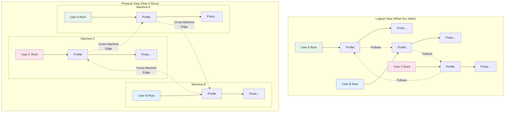

### Chapter 13: Distributed Jac Applications

The true power of Jac's scale-agnostic programming model shines when applications need to scale beyond a single machine. This chapter explores how Jac applications naturally distribute across multiple machines without requiring code changes, maintaining the same topological programming model at planetary scale.

#### 13.1 Distribution Concepts

### Topology-Aware Distribution

In traditional distributed systems, developers must explicitly handle network communication, data partitioning, and fault tolerance. Jac's topological model treats distribution as a natural extension of the graph structure:



### Key Distribution Principles

1. **Location Transparency**: Code doesn't know or care where nodes physically reside
2. **Automatic Partitioning**: Jac runtime handles data distribution based on access patterns
3. **Seamless Walker Migration**: Walkers traverse cross-machine edges naturally
4. **Consistent Semantics**: Same behavior whether local or distributed

### Automatic Node Partitioning

Jac automatically partitions nodes across machines based on several strategies:

```jac
// This configuration goes in jac.toml
[distribution]
strategy = "user_affinity"  // or "load_balanced", "geo_distributed"
replication_factor = 3
consistency_level = "eventual"  // or "strong", "bounded"

[distribution.rules]
# Keeps user data together
affinity_paths = [
    "root -> Profile",
    "Profile -> Post",
    "Post -> Comment"
]

# Distributes shared data
distributed_types = [
    "SharedResource",
    "GlobalConfig"
]
```

### Cross-Machine Edges

Edges that span machines are handled transparently:

```jac
// This code works identically for local and cross-machine edges!
walker MessageSender {
    has message: str;
    has recipient: User;

    can send with entry {
        // Even if recipient is on another machine, this just works
        here ++> Message(
            content=self.message,
            from_user=here,
            to_user=self.recipient,
            timestamp=now()
        );

        // Visit recipient's node (automatic cross-machine travel)
        visit self.recipient;
    }

    can notify with User entry {
        // Now executing on recipient's machine!
        here ++> Notification(
            type="new_message",
            message=self.message
        );
    }
}
```

### Distribution Metadata

Jac provides built-in functions to inspect distribution:

```jac
// Check node location
can get_node_info(n: node) -> dict {
    return {
        "machine_id": n.__machine_id__,
        "partition": n.__partition__,
        "replicas": n.__replicas__,
        "is_local": n.__is_local__
    };
}

// Monitor cross-machine edges
walker DistributionAnalyzer {
    has cross_machine_count: int = 0;
    has local_count: int = 0;

    can analyze with entry {
        for edge in [<-->] {
            if edge.__is_cross_machine__ {
                self.cross_machine_count += 1;
            } else {
                self.local_count += 1;
            }
        }

        report {
            "node": here,
            "local_edges": self.local_count,
            "remote_edges": self.cross_machine_count,
            "distribution_score": self.local_count / (self.local_count + self.cross_machine_count)
        };
    }
}
```

#### 13.2 Scaling Patterns

### From Single-Machine to Distributed

The beauty of Jac is that the same code scales naturally. Here's a social media application that works identically from one to thousands of machines:

```jac
// User profile and social graph
node UserProfile {
    has username: str;
    has bio: str;
    has joined_date: str;
    has post_count: int = 0;
}

node Post {
    has content: str;
    has timestamp: str;
    has likes: int = 0;
    has view_count: int = 0;
}

edge Follows {
    has since: str;
    has notifications_enabled: bool = true;
}

edge Likes {
    has timestamp: str;
}

// This walker works across any number of machines!
walker CreatePost {
    has content: str;

    can create with UserProfile entry {
        // Create post (stays on same machine as user)
        new_post = here ++> Post(
            content=self.content,
            timestamp=now()
        );

        here.post_count += 1;

        // Notify followers (may span many machines)
        spawn NotifyFollowers(post=new_post) on here;
    }
}

walker NotifyFollowers {
    has post: Post;
    has notified_count: int = 0;

    can notify with UserProfile entry {
        // Get all followers (some local, some remote)
        followers = [<--:Follows:];

        // Spawn notification walkers (distributed automatically)
        for follower in followers {
            if follower.notifications_enabled {
                spawn CreateNotification(
                    post=self.post,
                    user=follower.source  // The following user
                ) on follower.source;

                self.notified_count += 1;
            }
        }

        report {
            "post": self.post,
            "notified": self.notified_count
        };
    }
}

walker CreateNotification {
    has post: Post;
    has user: UserProfile;

    can create with UserProfile entry {
        // This executes on the follower's machine
        here ++> Notification(
            type="new_post",
            post=self.post,
            timestamp=now(),
            read=false
        );
    }
}
```

### Load Balancing Through Topology

Jac can automatically balance load by redistributing nodes:

```jac
// Configuration for automatic load balancing
[distribution.load_balancing]
enabled = true
check_interval = 60  // seconds
threshold_cpu = 0.8
threshold_memory = 0.85
threshold_edge_latency = 100  // ms

// Nodes can provide hints for distribution
node ComputeIntensiveTask {
    has priority: int;
    has estimated_cpu_hours: float;
    has data_size_gb: float;

    // Distribution hints
    :distribution: {
        "prefer_high_cpu": true,
        "collocate_with": ["TaskData", "TaskResult"],
        "avoid_machines": ["low_memory_tier"]
    }
}

// Monitor and rebalance
walker LoadBalancer {
    can check_balance with entry {
        let machine_stats = get_cluster_stats();

        for machine in machine_stats {
            if machine.cpu_usage > 0.8 {
                // Find nodes to migrate
                candidates = get_migration_candidates(machine);
                target_machine = find_least_loaded_machine();

                for node in candidates[:5] {  // Migrate up to 5 nodes
                    migrate_node(node, target_machine);
                }
            }
        }
    }
}
```

### Fault Tolerance and Recovery

Jac provides built-in fault tolerance through replication and automatic recovery:

```jac
// Configure replication
node CriticalData {
    has data: dict;
    has version: int = 0;

    :replication: {
        "factor": 3,
        "sync_mode": "async",  // or "sync" for strong consistency
        "preferred_regions": ["us-east", "eu-west", "ap-south"]
    }
}

// Automatic failover handling
walker ResilientOperation {
    has max_retries: int = 3;
    has retry_count: int = 0;

    can operate with entry {
        try {
            // Normal operation
            result = process_critical_data(here);
            report {"success": true, "result": result};

        } except NodeUnavailableError as e {
            // Automatic failover to replica
            self.retry_count += 1;

            if self.retry_count < self.max_retries {
                // Jac automatically redirects to healthy replica
                visit here.__replica__;  // Transparent failover
            } else {
                report {"success": false, "error": "All replicas failed"};
            }
        }
    }
}

// Health monitoring
walker HealthChecker {
    can check with entry {
        let health = {
            "node": here,
            "status": "healthy",
            "checks": {}
        };

        // Check node health
        try {
            health["checks"]["data_integrity"] = verify_data_integrity(here);
            health["checks"]["connection_count"] = len([<-->]);
            health["checks"]["response_time"] = measure_response_time();

        } except Exception as e {
            health["status"] = "unhealthy";
            health["error"] = str(e);

            // Trigger automatic recovery
            initiate_recovery(here);
        }

        report health;
    }
}
```

### Geo-Distribution Patterns

Deploy Jac applications globally with location-aware distribution:

```jac
// Geo-distributed configuration
[distribution.geo]
enabled = true
regions = ["us-east-1", "eu-west-1", "ap-southeast-1"]
default_region = "us-east-1"

// Location-aware nodes
node GeoUser {
    has username: str;
    has preferred_region: str;
    has data_residency: str;  // Legal requirement

    :geo: {
        "pin_to_region": self.data_residency,
        "cache_in_regions": [self.preferred_region],
        "exclude_regions": []  // For compliance
    }
}

// Cross-region walker with latency awareness
walker GlobalSearch {
    has query: str;
    has max_latency_ms: int = 200;
    has results: list = [];

    can search with entry {
        let regions = get_all_regions();
        let local_region = here.__region__;

        // Search local region first
        local_results = search_region(local_region, self.query);
        self.results.extend(local_results);

        // Search remote regions in parallel
        for region in regions {
            if region != local_region {
                expected_latency = estimate_latency(local_region, region);

                if expected_latency < self.max_latency_ms {
                    spawn RegionalSearch(
                        query=self.query,
                        region=region
                    ) on get_region_root(region);
                }
            }
        }
    }
}

// Regional caching for performance
node CachedContent {
    has content: str;
    has cache_regions: list[str] = [];

    can ensure_cached_in(region: str) {
        if region not in self.cache_regions {
            replicate_to_region(self, region);
            self.cache_regions.append(region);
        }
    }
}
```

### Distributed Transactions

Jac handles distributed transactions transparently:

```jac
// Distributed transaction example
walker TransferCredits {
    has from_user: User;
    has to_user: User;
    has amount: int;

    can transfer with entry {
        // Start distributed transaction
        :transaction: {
            "isolation": "serializable",
            "timeout": 5000,  // ms
            "retry_on_conflict": true
        }

        // These operations are atomic across machines!
        try {
            // Debit from source (might be on machine A)
            visit self.from_user {
                if here.credits < self.amount {
                    raise InsufficientCreditsError();
                }
                here.credits -= self.amount;
            };

            // Credit to destination (might be on machine B)
            visit self.to_user {
                here.credits += self.amount;
            };

            // Log transaction (might be on machine C)
            spawn LogTransaction(
                from_user=self.from_user,
                to_user=self.to_user,
                amount=self.amount,
                status="completed"
            ) on get_transaction_log_node();

            :commit:;  // Commit distributed transaction

        } except Exception as e {
            :rollback:;  // Automatic rollback across all machines
            report {"success": false, "error": str(e)};
        }
    }
}
```

### Scaling Patterns in Practice

Here's a complete example of a distributed task processing system:

```jac
// Distributed task queue implementation
node TaskQueue {
    has name: str;
    has priority: int;

    :distribution: {
        "partition_by": "priority",
        "replicas": 2
    }
}

node Task {
    has id: str;
    has payload: dict;
    has status: str = "pending";
    has assigned_worker: str = "";
    has created_at: str;
    has completed_at: str = "";

    :distribution: {
        "collocate_with_parent": true  // Stay with queue
    }
}

edge InQueue {
    has position: int;
    has enqueued_at: str;
}

// Distributed worker pool
walker TaskWorker {
    has worker_id: str;
    has capabilities: list[str];
    has max_concurrent: int = 5;
    has current_tasks: list[Task] = [];

    can find_work with entry {
        // Find available task queues across cluster
        queues = find_all_nodes(TaskQueue);

        // Sort by priority and machine locality
        queues.sort(key=lambda q: (-q.priority, q.__is_local__));

        for queue in queues {
            if len(self.current_tasks) >= self.max_concurrent {
                break;
            }

            visit queue;
        }

        // Process tasks in parallel
        for task in self.current_tasks {
            spawn ProcessTask(
                task=task,
                worker=self
            ) on task;
        }
    }

    can claim_task with TaskQueue entry {
        // Atomic task claiming across distributed queue
        :transaction: {
            available_tasks = [-->:InQueue:-->:Task:]
                .filter(lambda t: t.status == "pending")
                .sort(key=lambda t: t.position);

            if available_tasks {
                task = available_tasks[0];
                task.status = "processing";
                task.assigned_worker = self.worker_id;
                self.current_tasks.append(task);

                // Remove from queue
                del here --> task;
            }
        :commit:;
        }
    }
}

walker ProcessTask {
    has task: Task;
    has worker: TaskWorker;

    can process with Task entry {
        try {
            // Process the task
            result = execute_task_payload(here.payload);

            here.status = "completed";
            here.completed_at = now();

            // Store result (might be on different machine)
            here ++> TaskResult(
                result=result,
                worker_id=self.worker.worker_id,
                completed_at=now()
            );

            // Update worker
            self.worker.current_tasks.remove(here);

        } except Exception as e {
            here.status = "failed";
            here ++> TaskError(
                error=str(e),
                traceback=get_traceback()
            );

            // Requeue for retry
            find_queue(here.priority) ++>:InQueue:++> here;
        }
    }
}

// Monitoring across distributed system
walker SystemMonitor {
    can monitor with entry {
        let stats = {
            "total_tasks": 0,
            "pending": 0,
            "processing": 0,
            "completed": 0,
            "failed": 0,
            "machines": {},
            "queue_depths": {}
        };

        // Gather stats from all machines
        all_tasks = find_all_nodes(Task);

        for task in all_tasks {
            stats["total_tasks"] += 1;
            stats[task.status] += 1;

            machine = task.__machine_id__;
            if machine not in stats["machines"] {
                stats["machines"][machine] = {"count": 0, "processing": 0};
            }
            stats["machines"][machine]["count"] += 1;
            if task.status == "processing" {
                stats["machines"][machine]["processing"] += 1;
            }
        }

        // Check queue depths
        for queue in find_all_nodes(TaskQueue) {
            depth = len([queue -->:InQueue:]);
            stats["queue_depths"][queue.name] = depth;
        }

        report stats;
    }
}

// Auto-scaling based on load
walker AutoScaler {
    has min_workers: int = 5;
    has max_workers: int = 50;
    has scale_up_threshold: float = 0.8;
    has scale_down_threshold: float = 0.3;

    can check_scaling with entry {
        let metrics = spawn SystemMonitor() on root;

        let total_capacity = count_workers() * 5;  // max_concurrent per worker
        let utilization = metrics["processing"] / total_capacity;

        if utilization > self.scale_up_threshold {
            let new_workers = min(5, self.max_workers - count_workers());
            for i in range(new_workers) {
                spawn_worker_on_best_machine();
            }
            print(f"Scaled up by {new_workers} workers");

        } elif utilization < self.scale_down_threshold {
            let remove_workers = min(5, count_workers() - self.min_workers);
            gracefully_shutdown_workers(remove_workers);
            print(f"Scaled down by {remove_workers} workers");
        }
    }
}

// Entry point that works at any scale
with entry {
    // Initialize task queues (distributed automatically)
    high_priority = root ++> TaskQueue(name="high", priority=10);
    medium_priority = root ++> TaskQueue(name="medium", priority=5);
    low_priority = root ++> TaskQueue(name="low", priority=1);

    // Start workers (distributed across available machines)
    for i in range(10) {
        spawn TaskWorker(
            worker_id=f"worker_{i}",
            capabilities=["general"]
        ) on root;
    }

    // Start monitoring and auto-scaling
    spawn SystemMonitor() on root;
    spawn AutoScaler() on root;

    print("Distributed task processing system initialized!");
}
```

### Summary

This chapter demonstrated how Jac's scale-agnostic programming model extends naturally to distributed systems:

- **Transparent Distribution**: The same code works across machines without modification
- **Automatic Partitioning**: Jac handles data distribution based on access patterns
- **Cross-Machine Traversal**: Walkers seamlessly move between machines
- **Built-in Fault Tolerance**: Replication and failover happen automatically
- **Geo-Distribution**: Deploy globally with location-aware optimizations

The key insight is that distribution becomes a deployment concern rather than a development concern. You write your application logic once, focusing on the relationships and computations, and Jac handles the complexities of distributed execution.

In the next chapter, we'll explore advanced language features including concurrent programming, type system deep dives, and sophisticated error handling patterns that make Jac suitable for production systems at any scale.
