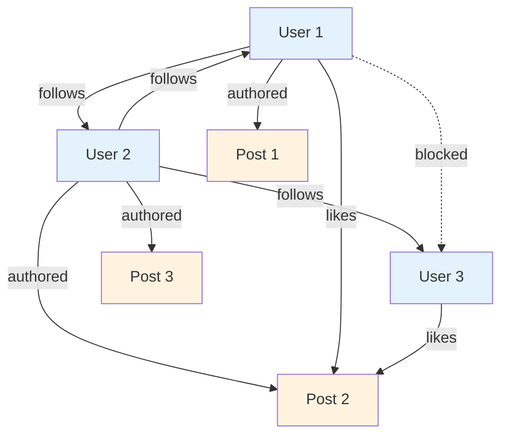
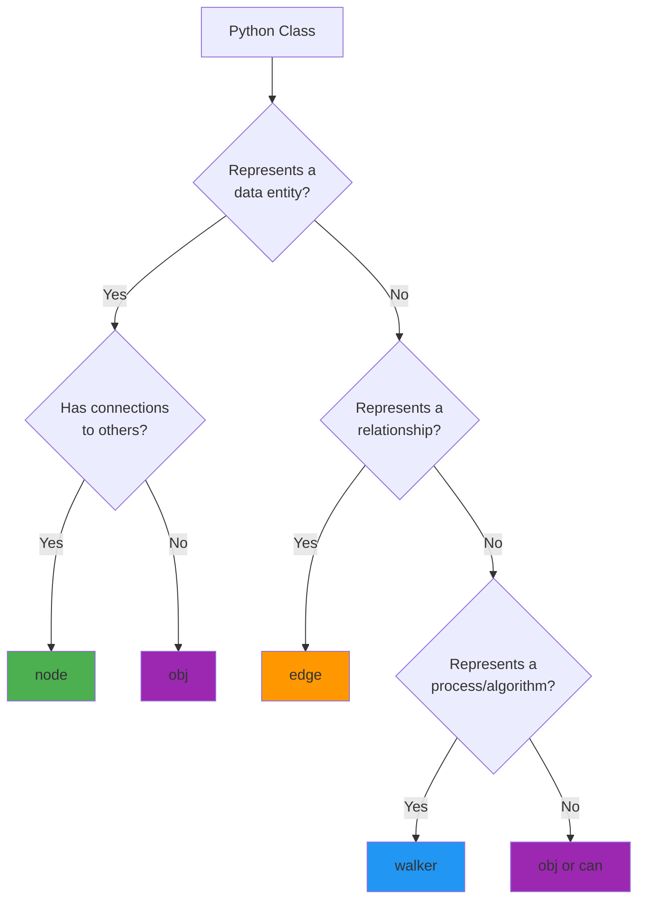
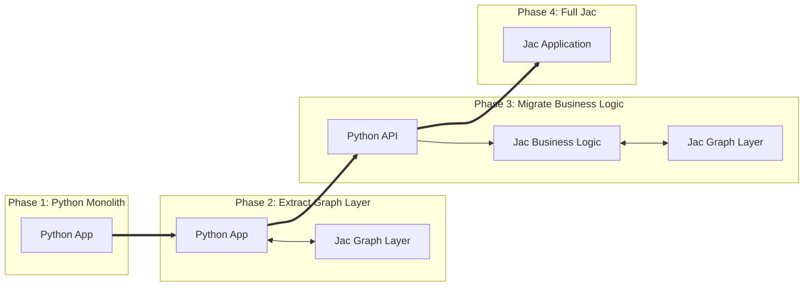

### Chapter 18: Migration Guide

#### 18.1 Porting Python Applications

Migrating Python applications to Jac requires a shift in thinking from object-oriented to object-spatial patterns. This section guides you through identifying opportunities for migration and transforming Python code to leverage Jac's unique capabilities.

### Identifying Graph Structures

Most Python applications contain implicit graph structures that become explicit in Jac. Learning to recognize these patterns is the first step in successful migration.

#### Common Graph Patterns in Python Applications

```python
# Python: Hidden graph structure in user relationships
class User:
    def __init__(self, username):
        self.username = username
        self.followers = []
        self.following = []
        self.posts = []
        self.liked_posts = []
        self.blocked_users = []

    def follow(self, other_user):
        if other_user not in self.following:
            self.following.append(other_user)
            other_user.followers.append(self)

    def create_post(self, content):
        post = Post(content, self)
        self.posts.append(post)
        return post
```

This Python code hides several graph relationships:
- User → User (following/followers)
- User → Post (authored)
- User → Post (liked)
- User → User (blocked)



#### Recognizing Graph Structures

Look for these indicators in your Python code:

1. **Collections of References**
   ```python
   # Python: Collection indicates relationship
   self.friends = []  # → Friend edge
   self.items = []    # → Contains edge
   self.tags = []     # → TaggedWith edge
   ```

2. **Many-to-Many Relationships**
   ```python
   # Python: Join tables or intermediate objects
   class UserGroup:
       def __init__(self):
           self.members = []

   class GroupMembership:
       def __init__(self, user, group, role):
           self.user = user
           self.group = group
           self.role = role
   ```

3. **Hierarchical Structures**
   ```python
   # Python: Parent-child relationships
   class Category:
       def __init__(self, name, parent=None):
           self.name = name
           self.parent = parent
           self.children = []
   ```

4. **State Machines**
   ```python
   # Python: State transitions
   class Order:
       STATES = ['pending', 'paid', 'shipped', 'delivered']

       def transition_to(self, new_state):
           if self.can_transition(new_state):
               self.state = new_state
   ```

5. **Event Systems**
   ```python
   # Python: Observer patterns
   class EventEmitter:
       def __init__(self):
           self.listeners = defaultdict(list)

       def on(self, event, callback):
           self.listeners[event].append(callback)
   ```

### Converting Classes to Archetypes

The transformation from Python classes to Jac archetypes involves identifying which archetype best represents each class's role.

#### Decision Tree for Archetype Selection



#### Example: User Management System

**Python Original:**
```python
# models.py
from datetime import datetime
from typing import List, Optional

class User:
    def __init__(self, email: str, username: str):
        self.id = generate_id()
        self.email = email
        self.username = username
        self.created_at = datetime.now()
        self.profile = None
        self.sessions = []

    def create_profile(self, bio: str, avatar_url: str):
        self.profile = UserProfile(bio, avatar_url)
        return self.profile

    def get_active_sessions(self) -> List['Session']:
        return [s for s in self.sessions if s.is_active()]

class UserProfile:
    def __init__(self, bio: str, avatar_url: str):
        self.bio = bio
        self.avatar_url = avatar_url
        self.updated_at = datetime.now()

class Session:
    def __init__(self, user: User, ip_address: str):
        self.id = generate_id()
        self.user = user
        self.ip_address = ip_address
        self.created_at = datetime.now()
        self.last_activity = datetime.now()
        self.active = True

    def is_active(self) -> bool:
        timeout = datetime.now() - self.last_activity
        return self.active and timeout.seconds < 3600

    def terminate(self):
        self.active = False

class Friendship:
    def __init__(self, user1: User, user2: User):
        self.user1 = user1
        self.user2 = user2
        self.created_at = datetime.now()
        self.status = 'pending'

    def accept(self):
        self.status = 'accepted'

    def reject(self):
        self.status = 'rejected'
```

**Jac Migration:**
```jac
# models.jac

# User becomes a node (has connections)
node User {
    has email: str;
    has username: str;
    has created_at: str;

    # Automatic ID generation via postinit
    has id: str by postinit;

    can postinit {
        self.id = generate_id();
    }
}

# Profile becomes obj (1-1 with User, no independent connections)
obj UserProfile {
    has bio: str;
    has avatar_url: str;
    has updated_at: str;
}

# Session becomes an edge (connects User to temporal context)
edge Session(User, TimeContext) {
    has id: str by postinit;
    has ip_address: str;
    has created_at: str;
    has last_activity: str;
    has active: bool = true;

    can postinit {
        self.id = generate_id();
    }

    can is_active -> bool {
        import:py from datetime { datetime };
        if not self.active { return false; }

        last = datetime.fromisoformat(self.last_activity);
        timeout = datetime.now() - last;
        return timeout.seconds < 3600;
    }

    can terminate {
        self.active = false;
    }
}

# Friendship becomes an edge with status
edge Friendship(User, User) {
    has created_at: str;
    has status: str = 'pending';

    can accept {
        self.status = 'accepted';
    }

    can reject {
        self.status = 'rejected';
    }
}

# Profile creation becomes a walker
walker CreateProfile {
    has bio: str;
    has avatar_url: str;

    can create with User entry {
        # Check if profile already exists
        existing = here[-->:HasProfile:];
        if existing {
            report {"error": "Profile already exists"};
            disengage;
        }

        # Create profile and connect
        profile = UserProfile(
            bio=self.bio,
            avatar_url=self.avatar_url,
            updated_at=timestamp_now()
        );

        here ++>:HasProfile:++> profile;
        report {"success": true, "profile": profile};
    }
}

# Active sessions becomes a walker query
walker GetActiveSessions {
    has sessions: list = [];

    can collect with User entry {
        for session in [-->:Session:] {
            if session.is_active() {
                self.sessions.append({
                    "id": session.id,
                    "ip": session.ip_address,
                    "last_activity": session.last_activity
                });
            }
        }
    }
}
```

### Refactoring for Object-Spatial Patterns

Moving beyond direct translation, we can refactor to truly leverage object-spatial patterns.

##### Pattern 1: Replace Method Calls with Walker Traversal

**Python:**
```python
class NotificationService:
    def notify_followers(self, user, message):
        for follower in user.followers:
            if self.should_notify(follower, user):
                self.send_notification(follower, message)

    def should_notify(self, recipient, sender):
        # Check blocks, preferences, etc.
        return sender not in recipient.blocked_users
```

**Jac Refactored:**
```jac
walker NotifyFollowers {
    has message: str;
    has notifications_sent: int = 0;

    can notify with User entry {
        # Natural traversal with filtering
        for follower in [<--:Follows:] {
            # Blocked relationships prevent traversal
            if not follower[-->:Blocks:-->](?.target == here) {
                visit follower;
            }
        }
    }

    can deliver with User entry {
        # Create notification node
        notif = here ++> Notification(
            message=self.message,
            from_user=here,
            timestamp=timestamp_now(),
            read=false
        );
        self.notifications_sent += 1;
    }

    can summarize with `root exit {
        report {
            "sent": self.notifications_sent,
            "message": self.message
        };
    }
}
```

##### Pattern 2: Replace Queries with Graph Traversal

**Python:**
```python
# Finding mutual friends
def find_mutual_friends(user1, user2):
    friends1 = set(user1.friends)
    friends2 = set(user2.friends)
    return friends1.intersection(friends2)

# Finding friend recommendations
def recommend_friends(user, limit=10):
    recommendations = {}

    # Friends of friends
    for friend in user.friends:
        for fof in friend.friends:
            if fof != user and fof not in user.friends:
                recommendations[fof] = recommendations.get(fof, 0) + 1

    # Sort by mutual friend count
    sorted_recs = sorted(recommendations.items(),
                        key=lambda x: x[1], reverse=True)
    return [user for user, _ in sorted_recs[:limit]]
```

**Jac Refactored:**
```jac
walker FindMutualFriends {
    has other_user: User;
    has mutuals: set = {};

    can find with User entry {
        # Collect my friends
        my_friends = set([-->:Follows:-->]);

        # Visit other user and find intersection
        visit self.other_user else {
            report {"error": "User not found"};
        };
    }

    can compare with User entry {
        their_friends = set([-->:Follows:-->]);
        self.mutuals = my_friends.intersection(their_friends);
        report list(self.mutuals);
    }
}

walker RecommendFriends {
    has limit: int = 10;
    has recommendations: dict = {};
    has visited: set = {};
    has original_user: User by postinit;

    can postinit {
        self.original_user = here;
    }

    can explore with User entry {
        if here in self.visited { return; }
        self.visited.add(here);

        # First level: my friends
        if here == self.original_user {
            visit [-->:Follows:-->];
        }
        # Second level: friends of friends
        else {
            for fof in [-->:Follows:-->] {
                if fof != self.original_user and
                   not self.original_user[-->:Follows:-->](? == fof) {
                    self.recommendations[fof] = \
                        self.recommendations.get(fof, 0) + 1;
                }
            }
        }
    }

    can report_results with `root exit {
        # Sort and limit recommendations
        sorted_recs = sorted(
            self.recommendations.items(),
            key=lambda x: x[1],
            reverse=true
        );

        report [user for user, _ in sorted_recs[:self.limit]];
    }
}
```

##### Pattern 3: Replace State Machines with Graph Topology

**Python:**
```python
class Order:
    STATES = {
        'pending': ['cancelled', 'paid'],
        'paid': ['cancelled', 'processing'],
        'processing': ['shipped'],
        'shipped': ['delivered', 'returned'],
        'delivered': ['returned'],
        'cancelled': [],
        'returned': []
    }

    def __init__(self):
        self.state = 'pending'
        self.history = []

    def transition_to(self, new_state):
        if new_state in self.STATES[self.state]:
            self.history.append({
                'from': self.state,
                'to': new_state,
                'timestamp': datetime.now()
            })
            self.state = new_state
            self.trigger_state_actions(new_state)
        else:
            raise ValueError(f"Invalid transition: {self.state} -> {new_state}")
```

**Jac Refactored:**
```jac
# States as nodes
node OrderState {
    has name: str;
    has entry_actions: list = [];
    has exit_actions: list = [];
}

# Transitions as edges
edge Transition(OrderState, OrderState) {
    has name: str;
    has condition: str = "";
    has timestamp: str by postinit;

    can postinit {
        self.timestamp = timestamp_now();
    }
}

# Order exists in a state
edge InState(Order, OrderState);

# Walker to transition states
walker TransitionOrder {
    has target_state: str;
    has transition_history: list = [];

    can transition with Order entry {
        # Find current state
        current_state = here[-->:InState:-->][0];

        # Find valid transition
        for trans in current_state[-->:Transition:] {
            if trans.target.name == self.target_state {
                # Execute exit actions
                for action in current_state.exit_actions {
                    execute_action(action, here);
                }

                # Move to new state
                del here -->:InState:--> current_state;
                here ++>:InState:++> trans.target;

                # Record transition
                self.transition_history.append({
                    "from": current_state.name,
                    "to": trans.target.name,
                    "timestamp": trans.timestamp
                });

                # Execute entry actions
                for action in trans.target.entry_actions {
                    execute_action(action, here);
                }

                report {"success": true, "new_state": trans.target.name};
                disengage;
            }
        }

        report {"error": f"Invalid transition to {self.target_state}"};
    }
}

# Initialize state machine
with entry {
    # Create states
    pending = OrderState(name="pending");
    paid = OrderState(name="paid");
    processing = OrderState(name="processing");
    shipped = OrderState(name="shipped");
    delivered = OrderState(name="delivered");
    cancelled = OrderState(name="cancelled");
    returned = OrderState(name="returned");

    # Create transitions
    pending ++>:Transition(name="pay"):++> paid;
    pending ++>:Transition(name="cancel"):++> cancelled;
    paid ++>:Transition(name="process"):++> processing;
    paid ++>:Transition(name="cancel"):++> cancelled;
    processing ++>:Transition(name="ship"):++> shipped;
    shipped ++>:Transition(name="deliver"):++> delivered;
    shipped ++>:Transition(name="return"):++> returned;
    delivered ++>:Transition(name="return"):++> returned;
}
```

#### 18.2 Incremental Adoption

Jac is designed to work alongside Python, enabling gradual migration strategies that minimize risk and disruption.

### Using Python from Jac

Jac provides seamless Python interoperability through multiple mechanisms:

#### Direct Python Imports

```jac
# Import Python modules directly
import:py numpy as np;
import:py from pandas { DataFrame, Series };
import:py from sklearn.cluster { KMeans };

# Use Python libraries naturally
walker DataAnalyzer {
    has data: list;
    has clusters: int = 3;

    can analyze with entry {
        # Use pandas for data manipulation
        df = DataFrame(self.data);

        # Statistical analysis
        summary = df.describe();

        # Machine learning with sklearn
        features = df[['feature1', 'feature2']].values;
        kmeans = KMeans(n_clusters=self.clusters);
        labels = kmeans.fit_predict(features);

        # Store results in graph
        here ++> AnalysisResult(
            summary=summary.to_dict(),
            cluster_labels=labels.tolist(),
            centroids=kmeans.cluster_centers_.tolist()
        );
    }
}
```

#### Inline Python Code

```jac
# Complex Python logic inline
walker PythonIntegration {
    can process with entry {
        ::py::
        # Any Python code here
        import matplotlib.pyplot as plt
        import seaborn as sns

        # Create visualization
        data = here.get_metric_data()
        plt.figure(figsize=(10, 6))
        sns.lineplot(data=data, x='timestamp', y='value')
        plt.title(f'Metrics for {here.name}')
        plt.savefig(f'metrics_{here.id}.png')
        plt.close()

        # Complex computation
        result = perform_complex_calculation(data)
        ::py::

        # Back to Jac
        here.visualization_path = f'metrics_{here.id}.png';
        here.computed_result = result;
    }
}
```

#### Python Function Wrapping

```jac
# Wrap Python functions for Jac use
import:py from legacy_system {
    process_payment,
    validate_credit_card,
    send_email
};

# Create Jac-friendly wrappers
can process_payment_safe(amount: float, card: dict) -> dict {
    try {
        # Call Python function
        result = process_payment(amount, card);
        return {"success": true, "transaction_id": result.id};
    } except Exception as e {
        return {"success": false, "error": str(e)};
    }
}

# Use in walkers
walker ProcessOrder {
    has order_total: float;
    has payment_info: dict;

    can process with Order entry {
        # Validate card using Python
        if not validate_credit_card(self.payment_info) {
            report {"error": "Invalid card"};
            disengage;
        }

        # Process payment
        result = process_payment_safe(self.order_total, self.payment_info);

        if result["success"] {
            here ++> Payment(
                transaction_id=result["transaction_id"],
                amount=self.order_total,
                timestamp=timestamp_now()
            );

            # Send confirmation email
            send_email(
                to=here.customer_email,
                subject="Order Confirmed",
                body=f"Your order {here.id} has been confirmed."
            );
        }

        report result;
    }
}
```

### Hybrid Applications

Building applications that leverage both Python and Jac strengths:

#### Architecture Pattern: Python Backend, Jac Graph Layer

```python
# python_api.py
from flask import Flask, request, jsonify
from jac_runtime import JacRuntime

app = Flask(__name__)
jrt = JacRuntime('graph_layer.jac')

@app.route('/api/users/<user_id>/friends', methods=['GET'])
def get_friends(user_id):
    # Use Jac for graph operations
    result = jrt.run_walker('GetFriends', {
        'user_id': user_id,
        'include_pending': request.args.get('pending', False)
    })
    return jsonify(result)

@app.route('/api/recommendations/<user_id>', methods=['GET'])
def get_recommendations(user_id):
    # Complex graph algorithm in Jac
    result = jrt.run_walker('RecommendContent', {
        'user_id': user_id,
        'limit': int(request.args.get('limit', 10))
    })
    return jsonify(result)

# Traditional Python for non-graph operations
@app.route('/api/upload', methods=['POST'])
def upload_file():
    # Handle file upload with Python
    file = request.files['file']
    # Process with Python libraries
    processed = process_file(file)

    # Store metadata in Jac graph
    jrt.run_walker('StoreFileMetadata', {
        'filename': file.filename,
        'size': file.size,
        'processed_data': processed
    })

    return jsonify({'status': 'success'})
```

```jac
# graph_layer.jac

walker GetFriends {
    has user_id: str;
    has include_pending: bool = false;
    has friends: list = [];

    can find with entry {
        user = find_user_by_id(self.user_id);
        if not user {
            report {"error": "User not found"};
            disengage;
        }
        visit user;
    }

    can collect with User entry {
        for friend_edge in [-->:Friendship:] {
            if friend_edge.status == "accepted" or
               (self.include_pending and friend_edge.status == "pending") {
                self.friends.append({
                    "user": friend_edge.target.to_dict(),
                    "friendship_status": friend_edge.status,
                    "since": friend_edge.created_at
                });
            }
        }
        report {"friends": self.friends};
    }
}
```

#### Pattern: Jac for Business Logic, Python for Infrastructure

```jac
# business_logic.jac

# Define business rules in Jac
walker ApplyDiscounts {
    has order: dict;
    has discounts_applied: list = [];

    can apply with Customer entry {
        # Customer loyalty discount
        if here.loyalty_points > 1000 {
            self.add_discount("LOYALTY10", 0.10);
        }

        # Visit purchase history
        visit [-->:PurchaseHistory:];
    }

    can check_history with PurchaseHistory entry {
        # Frequent buyer discount
        recent_purchases = here.get_recent_purchases(days=30);
        if len(recent_purchases) >= 5 {
            self.add_discount("FREQUENT5", 0.05);
        }
    }

    can add_discount(code: str, percentage: float) {
        self.discounts_applied.append({
            "code": code,
            "percentage": percentage
        });
    }
}

# Wrapper for Python integration
can calculate_order_total(order: dict) -> dict {
    # Create temporary graph structure
    customer = Customer(id=order["customer_id"]);

    # Run business logic
    walker = ApplyDiscounts(order=order);
    spawn walker on customer;

    # Apply discounts using Python for calculation
    ::py::
    total = order["subtotal"]
    for discount in walker.discounts_applied:
        total *= (1 - discount["percentage"])

    # Add tax calculation (complex Python logic)
    tax = calculate_tax(total, order["shipping_address"])
    final_total = total + tax
    ::py::

    return {
        "subtotal": order["subtotal"],
        "discounts": walker.discounts_applied,
        "tax": tax,
        "total": final_total
    };
}
```

### Migration Strategies

##### Strategy 1: Strangler Fig Pattern

Gradually replace Python components with Jac equivalents:



**Phase 1 to 2 Example:**
```python
# Original Python
class UserService:
    def get_user_network(self, user_id):
        user = User.query.get(user_id)
        friends = [f.to_dict() for f in user.friends]
        followers = [f.to_dict() for f in user.followers]
        return {
            'friends': friends,
            'followers': followers
        }
```

```jac
# Extract to Jac
walker GetUserNetwork {
    has user_id: str;

    can get with entry {
        # Still use Python for data access initially
        ::py::
        from models import User
        user = User.query.get(self.user_id)
        ::py::

        # Build graph structure
        user_node = User(
            id=user.id,
            username=user.username
        );

        # Migrate relationships to graph
        visit user_node;
    }

    can collect with User entry {
        report {
            "friends": [-->:Friend:-->].to_dict(),
            "followers": [<--:Follows:].to_dict()
        };
    }
}
```

##### Strategy 2: Feature Branch Migration

Implement new features in Jac while maintaining existing Python:

```python
# config.py
FEATURE_FLAGS = {
    'use_jac_recommendations': True,
    'use_jac_notifications': False,
    'use_jac_auth': False
}

# app.py
def get_recommendations(user_id):
    if FEATURE_FLAGS['use_jac_recommendations']:
        # New Jac implementation
        return jac_runtime.get_recommendations(user_id)
    else:
        # Legacy Python implementation
        return python_recommendation_engine.get_recommendations(user_id)
```

##### Strategy 3: Microservice Extraction

Build new microservices in Jac:

```yaml
# docker-compose.yml
version: '3.8'
services:
  legacy-api:
    build: ./python-api
    ports:
      - "5000:5000"

  recommendation-service:
    build: ./jac-recommendations
    environment:
      - JAC_PERSIST_PATH=/data/recommendations
    volumes:
      - jac-data:/data

  notification-service:
    build: ./jac-notifications
    environment:
      - JAC_PERSIST_PATH=/data/notifications
    volumes:
      - jac-data:/data

volumes:
  jac-data:
```

##### Strategy 4: Database Migration Pattern

```jac
# Migrate data from Python ORM to Jac graph
walker MigrateUsers {
    has batch_size: int = 100;
    has offset: int = 0;

    can migrate with entry {
        ::py::
        from sqlalchemy import create_engine
        from sqlalchemy.orm import sessionmaker
        from legacy_models import User, Friendship

        engine = create_engine('postgresql://...')
        Session = sessionmaker(bind=engine)
        session = Session()

        # Fetch batch of users
        users = session.query(User)\
            .offset(self.offset)\
            .limit(self.batch_size)\
            .all()
        ::py::

        # Convert to Jac nodes
        for py_user in users {
            jac_user = root ++> User(
                id=py_user.id,
                username=py_user.username,
                email=py_user.email,
                created_at=py_user.created_at.isoformat()
            );

            # Migrate relationships
            ::py::
            friendships = session.query(Friendship)\
                .filter_by(user_id=py_user.id)\
                .all()
            ::py::

            for friendship in friendships {
                target = find_or_create_user(friendship.friend_id);
                jac_user ++>:Friend(
                    since=friendship.created_at.isoformat(),
                    status=friendship.status
                ):++> target;
            }
        }

        # Continue with next batch
        if len(users) == self.batch_size {
            self.offset += self.batch_size;
            visit root;  # Process next batch
        } else {
            report {"migrated": self.offset + len(users)};
        }
    }
}
```

### Best Practices for Migration

1. **Start with the Graph**
   - Identify core entities and relationships
   - Model in Jac first, implement incrementally

2. **Maintain Compatibility**
   - Keep APIs stable during migration
   - Use adapter patterns for gradual transition

3. **Test Extensively**
   - Maintain parallel test suites
   - Verify behavior equivalence

4. **Monitor Performance**
   - Compare Python vs Jac implementations
   - Optimize graph traversal patterns

5. **Document Differences**
   - Note semantic changes
   - Create migration guides for team

### Migration Checklist

- [ ] Identify graph structures in Python code
- [ ] Map Python classes to Jac archetypes
- [ ] Create Jac equivalents for core models
- [ ] Implement Python-Jac interop layer
- [ ] Migrate business logic incrementally
- [ ] Convert data access patterns
- [ ] Update deployment infrastructure
- [ ] Train team on Jac concepts
- [ ] Monitor and optimize performance
- [ ] Deprecate Python components gradually

The key to successful migration is recognizing that Jac isn't just Python with different syntax—it's a fundamentally different way of thinking about program structure. Embrace the graph, let computation flow to data, and watch your applications become more intuitive, scalable, and maintainable.