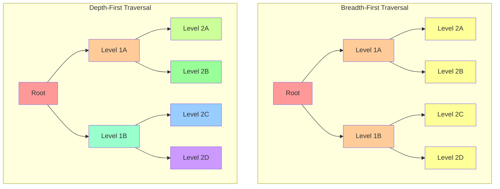
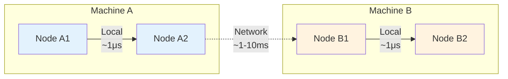

### Chapter 19: Performance and Optimization

#### 19.1 Performance Characteristics

Understanding Jac's performance characteristics is crucial for building efficient applications. The object-spatial paradigm introduces unique performance considerations that differ significantly from traditional programming models.

### Traversal Optimization

Walker traversal is at the heart of Jac's execution model. Understanding how to optimize traversal patterns can dramatically improve application performance.

#### Traversal Complexity Analysis

```jac
# Analyzing traversal patterns
walker PerformanceAnalyzer {
    has nodes_visited: int = 0;
    has edges_traversed: int = 0;
    has ability_executions: int = 0;
    has start_time: float by postinit;

    can postinit {
        import:py time;
        self.start_time = time.time();
    }

    can analyze with entry {
        self.nodes_visited += 1;
        self.ability_executions += 1;

        # Track edge traversals
        outgoing = [-->];
        self.edges_traversed += len(outgoing);

        # Continue traversal
        visit outgoing;
    }

    can report_metrics with `root exit {
        import:py time;
        elapsed = time.time() - self.start_time;

        report {
            "nodes_visited": self.nodes_visited,
            "edges_traversed": self.edges_traversed,
            "ability_executions": self.ability_executions,
            "elapsed_time": elapsed,
            "nodes_per_second": self.nodes_visited / elapsed,
            "traversal_efficiency": self.edges_traversed / self.nodes_visited
        };
    }
}
```

#### Breadth-First vs Depth-First Performance



```jac
# Breadth-first traversal (default)
walker BreadthFirstSearch {
    has target_value: any;
    has max_depth: int = 5;
    has current_depth: int = 0;
    has found: bool = false;

    can search with entry {
        if here.value == self.target_value {
            self.found = true;
            report here;
            disengage;
        }

        if self.current_depth < self.max_depth {
            # Natural breadth-first
            visit [-->];
        }
    }
}

# Depth-first traversal (explicit implementation)
walker DepthFirstSearch {
    has target_value: any;
    has max_depth: int = 5;
    has path: list = [];

    can search with entry {
        self.path.append(here);

        if here.value == self.target_value {
            report {"found": here, "path": self.path};
            disengage;
        }

        if len(self.path) < self.max_depth {
            # Process children immediately
            for child in [-->] {
                spawn DepthFirstSearch(
                    target_value=self.target_value,
                    max_depth=self.max_depth,
                    path=self.path.copy()
                ) on child;
            }
        }
    }
}
```

#### Early Termination Strategies

```jac
# Efficient search with early termination
walker OptimizedSearch {
    has criteria: dict;
    has max_results: int = 10;
    has results: list = [];
    has visited: set = {};

    can search with entry {
        # Skip already visited nodes
        if here.id in self.visited {
            return;  # Don't visit children
        }
        self.visited.add(here.id);

        # Check criteria
        if matches_criteria(here, self.criteria) {
            self.results.append(here);

            # Early termination when enough results
            if len(self.results) >= self.max_results {
                report self.results;
                disengage;  # Stop entire traversal
            }
        }

        # Smart traversal - prioritize promising branches
        children = [-->];
        promising = sort_by_promise(children, self.criteria);

        # Visit only top branches
        visit promising[:3];
    }
}

# Helper functions
can matches_criteria(node: node, criteria: dict) -> bool {
    for key, value in criteria.items() {
        if not hasattr(node, key) or getattr(node, key) != value {
            return false;
        }
    }
    return true;
}

can sort_by_promise(nodes: list, criteria: dict) -> list {
    # Score nodes by how likely they lead to matches
    scored = [];
    for n in nodes {
        score = calculate_promise_score(n, criteria);
        scored.append((score, n));
    }
    scored.sort(reverse=true);
    return [n for _, n in scored];
}
```

### Memory Management

Jac's automatic memory management includes garbage collection, but understanding memory patterns helps optimize performance.

#### Node and Edge Memory Footprint

```jac
# Memory-efficient node design
node LightweightNode {
    # Use appropriate data types
    has id: int;  # 8 bytes vs string (variable)
    has flags: int;  # Bit flags vs multiple bools
    has data_ref: str;  # Reference vs embedded data
}

# Memory-heavy node (avoid for large graphs)
node HeavyNode {
    has id: str;  # UUID string = 36+ bytes
    has metadata: dict;  # Unbounded size
    has history: list;  # Grows over time
    has cached_computations: dict;  # Memory leak risk
}

# Monitoring memory usage
walker MemoryProfiler {
    has node_count: int = 0;
    has edge_count: int = 0;
    has total_data_size: int = 0;

    can profile with entry {
        import:py sys;

        self.node_count += 1;

        # Estimate node memory
        node_size = sys.getsizeof(here);

        # Add data structure sizes
        for attr_name in dir(here) {
            if not attr_name.startswith('_') {
                attr_value = getattr(here, attr_name);
                self.total_data_size += sys.getsizeof(attr_value);
            }
        }

        # Count edges
        self.edge_count += len([-->]) + len([<--]);

        visit [-->];
    }

    can report with `root exit {
        avg_node_size = self.total_data_size / self.node_count;

        report {
            "nodes": self.node_count,
            "edges": self.edge_count,
            "total_data_size": self.total_data_size,
            "avg_node_size": avg_node_size,
            "estimated_total_memory": (
                self.node_count * avg_node_size +
                self.edge_count * 64  # Rough edge overhead
            )
        };
    }
}
```

#### Walker State Management

```jac
# Memory-efficient walker with bounded state
walker EfficientCollector {
    has max_items: int = 1000;
    has buffer: list = [];
    has result_handler: callable;

    can collect with entry {
        if should_collect(here) {
            self.buffer.append(extract_data(here));

            # Flush buffer periodically
            if len(self.buffer) >= 100 {
                self.flush_buffer();
            }
        }

        visit [-->];
    }

    can flush_buffer {
        # Process and clear buffer
        self.result_handler(self.buffer);
        self.buffer = [];  # Free memory
    }

    can finalize with `root exit {
        # Final flush
        if self.buffer {
            self.flush_buffer();
        }
    }
}

# Memory-inefficient walker (avoid)
walker InefficientCollector {
    # Unbounded collections
    has all_nodes: list = [];
    has all_paths: list = [];
    has node_data_cache: dict = {};

    can collect with entry {
        # Keeps references to everything
        self.all_nodes.append(here);
        self.all_paths.append(self.current_path.copy());
        self.node_data_cache[here.id] = here.to_dict();

        # Memory grows with graph size
        visit [-->];
    }
}
```

#### Circular Reference Management

```jac
# Potential circular reference
node Document {
    has title: str;
    has metadata: dict = {};

    can add_reverse_reference(other: Document) {
        # Creates circular reference through dict
        self.metadata["related"] = other;
        other.metadata["related"] = self;
    }
}

# Better approach using edges
edge RelatedTo(Document, Document) {
    has relationship_type: str;
}

# Clean reference management
can link_documents(doc1: Document, doc2: Document, rel_type: str) {
    doc1 ++>:RelatedTo(relationship_type=rel_type):++> doc2;
    # Graph structure handles references properly
}
```

### Distribution Overhead

When Jac applications scale across machines, understanding distribution overhead becomes critical.

#### Cross-Machine Edge Traversal



```jac
# Measuring distribution overhead
walker LatencyProfiler {
    has local_traversals: int = 0;
    has remote_traversals: int = 0;
    has local_time: float = 0.0;
    has remote_time: float = 0.0;

    can measure with entry {
        import:py time;

        for edge in [-->] {
            start = time.time();

            # Check if edge crosses machine boundary
            if is_remote(edge.target) {
                self.remote_traversals += 1;
                visit edge.target;
                self.remote_time += time.time() - start;
            } else {
                self.local_traversals += 1;
                visit edge.target;
                self.local_time += time.time() - start;
            }
        }
    }

    can report with `root exit {
        avg_local = self.local_time / max(1, self.local_traversals);
        avg_remote = self.remote_time / max(1, self.remote_traversals);

        report {
            "local_traversals": self.local_traversals,
            "remote_traversals": self.remote_traversals,
            "avg_local_latency": avg_local,
            "avg_remote_latency": avg_remote,
            "overhead_factor": avg_remote / max(0.000001, avg_local)
        };
    }
}
```

#### Optimizing Distributed Traversal

```jac
# Batch operations to reduce network calls
walker BatchedProcessor {
    has batch_size: int = 50;
    has operation_batch: list = [];

    can process with entry {
        # Queue operation
        self.operation_batch.append({
            "node": here,
            "operation": "process",
            "data": extract_data(here)
        });

        # Process batch when full
        if len(self.operation_batch) >= self.batch_size {
            self.process_batch();
        }

        visit [-->];
    }

    can process_batch {
        # Group by machine
        by_machine = group_by_machine(self.operation_batch);

        # Send batched operations
        for machine, operations in by_machine.items() {
            if machine == current_machine() {
                # Process locally
                for op in operations {
                    execute_local(op);
                }
            } else {
                # Send batch to remote machine
                send_remote_batch(machine, operations);
            }
        }

        self.operation_batch = [];
    }
}

# Data locality optimization
walker LocalityAwareTraverser {
    has prefer_local: bool = true;
    has locality_threshold: float = 0.8;

    can traverse with entry {
        edges = [-->];

        if self.prefer_local {
            # Partition edges by locality
            local_edges = [];
            remote_edges = [];

            for edge in edges {
                if is_local(edge.target) {
                    local_edges.append(edge);
                } else {
                    remote_edges.append(edge);
                }
            }

            # Visit local first
            visit local_edges;

            # Visit remote only if necessary
            if random.random() > self.locality_threshold {
                visit remote_edges;
            }
        } else {
            visit edges;
        }
    }
}
```

#### 19.2 Optimization Techniques

### Graph Layout Optimization

The physical layout of your graph structure significantly impacts performance. Optimizing this layout can reduce traversal time and memory usage.

#### Node Clustering Strategies

```jac
# Cluster related nodes for better cache locality
walker ClusterAnalyzer {
    has clusters: dict = {};
    has cluster_threshold: float = 0.7;

    can analyze with entry {
        # Find node clusters based on connectivity
        cluster_id = self.find_or_create_cluster(here);

        # Analyze connections
        connections = [-->] + [<--];
        for conn in connections {
            similarity = calculate_similarity(here, conn);
            if similarity > self.cluster_threshold {
                self.add_to_cluster(conn, cluster_id);
            }
        }

        visit [-->];
    }

    can find_or_create_cluster(node: node) -> str {
        # Check existing clusters
        for cluster_id, members in self.clusters.items() {
            if node in members {
                return cluster_id;
            }
        }

        # Create new cluster
        import:py uuid;
        cluster_id = str(uuid.uuid4());
        self.clusters[cluster_id] = {node};
        return cluster_id;
    }
}

# Reorganize graph based on clustering
walker GraphReorganizer {
    has clusters: dict;
    has hub_nodes: dict = {};

    can reorganize with entry {
        # Create hub nodes for each cluster
        for cluster_id, members in self.clusters.items() {
            hub = root ++> ClusterHub(
                cluster_id=cluster_id,
                member_count=len(members)
            );
            self.hub_nodes[cluster_id] = hub;

            # Connect members to hub
            for member in members {
                hub ++>:InCluster:++> member;
            }
        }

        # Optimize inter-cluster connections
        self.optimize_cross_cluster_edges();
    }

    can optimize_cross_cluster_edges {
        # Replace many-to-many with hub-to-hub connections
        for cluster_id, hub in self.hub_nodes.items() {
            members = hub[-->:InCluster:];

            # Find external connections
            external_counts = {};
            for member in members {
                for external in member[-->] {
                    if external not in self.clusters[cluster_id] {
                        external_cluster = self.find_cluster(external);
                        external_counts[external_cluster] = \
                            external_counts.get(external_cluster, 0) + 1;
                    }
                }
            }

            # Create hub-to-hub edges for frequent connections
            for other_cluster, count in external_counts.items() {
                if count > 5 {  # Threshold
                    other_hub = self.hub_nodes[other_cluster];
                    hub ++>:ClusterConnection(weight=count):++> other_hub;
                }
            }
        }
    }
}
```

#### Hot Path Optimization

```jac
# Identify and optimize frequently traversed paths
walker HotPathAnalyzer {
    has path_counts: dict = {};
    has edge_counts: dict = {};
    has sampling_rate: float = 0.1;

    can analyze with entry {
        # Sample traversals
        if random.random() < self.sampling_rate {
            self.record_path();
        }

        # Record edge usage
        for edge in [-->] {
            edge_id = f"{here.id}->{edge.target.id}";
            self.edge_counts[edge_id] = self.edge_counts.get(edge_id, 0) + 1;
        }

        visit [-->];
    }

    can identify_hot_paths with `root exit {
        # Sort by frequency
        hot_edges = sorted(
            self.edge_counts.items(),
            key=lambda x: x[1],
            reverse=true
        );

        # Top 10% are hot paths
        threshold_index = int(len(hot_edges) * 0.1);
        hot_paths = hot_edges[:threshold_index];

        report {
            "hot_paths": hot_paths,
            "total_edges": len(self.edge_counts),
            "optimization_targets": [edge_id for edge_id, _ in hot_paths]
        };
    }
}

# Create shortcuts for hot paths
walker PathOptimizer {
    has hot_paths: list;
    has shortcut_threshold: int = 3;

    can optimize with entry {
        for path_info in self.hot_paths {
            src_id, dst_id = path_info["path"].split("->");
            src = find_node_by_id(src_id);
            dst = find_node_by_id(dst_id);

            # Find actual path length
            path_length = find_shortest_path_length(src, dst);

            # Create shortcut if path is long
            if path_length > self.shortcut_threshold {
                src ++>:Shortcut(
                    original_length=path_length,
                    usage_count=path_info["count"]
                ):++> dst;
            }
        }
    }
}
```

### Walker Batching

Processing multiple items in a single walker traversal can significantly improve performance.

```jac
# Inefficient: One walker per item
walker SingleItemProcessor {
    has item_id: str;

    can process with entry {
        item = find_item(self.item_id);
        result = expensive_computation(item);
        here ++> ProcessingResult(
            item_id=self.item_id,
            result=result
        );
    }
}

# Efficient: Batch processing
walker BatchProcessor {
    has item_ids: list;
    has batch_size: int = 100;
    has results: dict = {};

    can process with entry {
        # Process items in batches
        for i in range(0, len(self.item_ids), self.batch_size) {
            batch = self.item_ids[i:i + self.batch_size];

            # Bulk operations are more efficient
            items = bulk_find_items(batch);

            # Vectorized computation
            batch_results = vectorized_computation(items);

            # Store results
            for item_id, result in zip(batch, batch_results) {
                self.results[item_id] = result;
            }
        }

        # Create result nodes
        for item_id, result in self.results.items() {
            here ++> ProcessingResult(
                item_id=item_id,
                result=result,
                batch_processed=true
            );
        }
    }
}

# Parallel batch processing
walker ParallelBatchProcessor {
    has items: list;
    has num_workers: int = 4;
    has results: list = [];

    can process with entry {
        import:py from concurrent.futures { ThreadPoolExecutor };

        # Split items into chunks
        chunk_size = len(self.items) // self.num_workers;
        chunks = [
            self.items[i:i + chunk_size]
            for i in range(0, len(self.items), chunk_size)
        ];

        # Process chunks in parallel
        with ThreadPoolExecutor(max_workers=self.num_workers) as executor {
            futures = [];

            for chunk in chunks {
                # Spawn sub-walker for each chunk
                sub_walker = ChunkProcessor(items=chunk);
                future = executor.submit(lambda: spawn sub_walker on here);
                futures.append(future);
            }

            # Collect results
            for future in futures {
                chunk_results = future.result();
                self.results.extend(chunk_results);
            }
        }

        report self.results;
    }
}
```

### Caching Strategies

Intelligent caching can dramatically improve performance for repeated operations.

#### Node-Level Caching

```jac
node CachedDataNode {
    has data: dict;
    has cache: dict = {};
    has cache_ttl: int = 300;  # 5 minutes
    has cache_timestamps: dict = {};

    can get_computed_value(key: str) -> any {
        import:py time;

        # Check cache
        if key in self.cache {
            timestamp = self.cache_timestamps.get(key, 0);
            if time.time() - timestamp < self.cache_ttl {
                return self.cache[key];
            }
        }

        # Compute value
        value = expensive_computation(self.data, key);

        # Update cache
        self.cache[key] = value;
        self.cache_timestamps[key] = time.time();

        return value;
    }

    can invalidate_cache(key: str = None) {
        if key {
            self.cache.pop(key, None);
            self.cache_timestamps.pop(key, None);
        } else {
            self.cache = {};
            self.cache_timestamps = {};
        }
    }
}
```

#### Walker Result Caching

```jac
# Cache walker results based on input parameters
glob WALKER_CACHE: dict = {};

walker CachedAnalyzer {
    has params: dict;
    has cache_key: str by postinit;
    has use_cache: bool = true;

    can postinit {
        # Generate cache key from parameters
        import:py json;
        self.cache_key = json.dumps(self.params, sort_keys=true);
    }

    can analyze with entry {
        # Check cache first
        if self.use_cache and self.cache_key in WALKER_CACHE {
            cache_entry = WALKER_CACHE[self.cache_key];

            # Validate cache age
            import:py time;
            if time.time() - cache_entry["timestamp"] < 3600 {  # 1 hour
                report cache_entry["result"];
                disengage;
            }
        }

        # Perform actual analysis
        result = self.perform_analysis();

        # Cache result
        if self.use_cache {
            import:py time;
            WALKER_CACHE[self.cache_key] = {
                "result": result,
                "timestamp": time.time()
            };
        }

        report result;
    }

    can perform_analysis -> dict {
        # Expensive analysis logic
        visited_count = 0;
        total_value = 0;

        queue = [here];
        visited = set();

        while queue {
            current = queue.pop(0);
            if current.id in visited {
                continue;
            }

            visited.add(current.id);
            visited_count += 1;
            total_value += current.value;

            # Add neighbors
            queue.extend([-->]);
        }

        return {
            "visited_count": visited_count,
            "total_value": total_value,
            "average_value": total_value / visited_count
        };
    }
}
```

#### Query Result Caching

```jac
# Cache complex graph queries
walker QueryOptimizer {
    has query_cache: dict = {};
    has cache_hits: int = 0;
    has cache_misses: int = 0;

    can find_pattern(pattern: dict) -> list {
        # Generate cache key
        cache_key = self.pattern_to_key(pattern);

        # Check cache
        if cache_key in self.query_cache {
            self.cache_hits += 1;
            return self.query_cache[cache_key];
        }

        self.cache_misses += 1;

        # Execute query
        results = self.execute_pattern_search(pattern);

        # Cache results
        self.query_cache[cache_key] = results;

        # Evict old entries if cache too large
        if len(self.query_cache) > 1000 {
            self.evict_oldest_entries(100);
        }

        return results;
    }

    can pattern_to_key(pattern: dict) -> str {
        # Convert pattern to stable string key
        import:py json;
        return json.dumps(pattern, sort_keys=true);
    }

    can evict_oldest_entries(count: int) {
        # Simple FIFO eviction
        keys = list(self.query_cache.keys());
        for key in keys[:count] {
            del self.query_cache[key];
        }
    }
}
```

### Performance Monitoring and Profiling

Building performance monitoring directly into your Jac applications helps identify bottlenecks.

```jac
# Performance monitoring walker
walker PerformanceMonitor {
    has metrics: dict = {
        "ability_timings": {},
        "node_visit_counts": {},
        "edge_traversal_counts": {},
        "memory_snapshots": []
    };
    has profile_enabled: bool = true;

    can monitor with entry {
        import:py time;
        import:py psutil;

        if self.profile_enabled {
            # Record node visit
            node_type = type(here).__name__;
            self.metrics["node_visit_counts"][node_type] = \
                self.metrics["node_visit_counts"].get(node_type, 0) + 1;

            # Memory snapshot
            process = psutil.Process();
            self.metrics["memory_snapshots"].append({
                "timestamp": time.time(),
                "memory_mb": process.memory_info().rss / 1024 / 1024,
                "node_id": here.id
            });
        }

        # Continue monitoring
        visit [-->];
    }

    can measure_ability(ability_name: str, ability_func: callable) -> any {
        if not self.profile_enabled {
            return ability_func();
        }

        import:py time;
        start = time.time();

        try {
            result = ability_func();
            elapsed = time.time() - start;

            # Record timing
            if ability_name not in self.metrics["ability_timings"] {
                self.metrics["ability_timings"][ability_name] = {
                    "count": 0,
                    "total_time": 0,
                    "max_time": 0,
                    "min_time": float('inf')
                };
            }

            timing = self.metrics["ability_timings"][ability_name];
            timing["count"] += 1;
            timing["total_time"] += elapsed;
            timing["max_time"] = max(timing["max_time"], elapsed);
            timing["min_time"] = min(timing["min_time"], elapsed);

            return result;
        } except Exception as e {
            self.metrics["errors"] = self.metrics.get("errors", 0) + 1;
            raise e;
        }
    }

    can generate_report with `root exit {
        # Calculate averages
        for ability_name, timing in self.metrics["ability_timings"].items() {
            timing["avg_time"] = timing["total_time"] / timing["count"];
        }

        # Memory analysis
        if self.metrics["memory_snapshots"] {
            memory_values = [s["memory_mb"] for s in self.metrics["memory_snapshots"]];
            self.metrics["memory_summary"] = {
                "start_mb": memory_values[0],
                "end_mb": memory_values[-1],
                "peak_mb": max(memory_values),
                "growth_mb": memory_values[-1] - memory_values[0]
            };
        }

        report self.metrics;
    }
}

# Usage example
with entry {
    monitor = PerformanceMonitor();

    # Wrap your main walker
    main_walker = YourApplicationWalker();

    # Run with monitoring
    spawn monitor on root;
    spawn main_walker on root;

    # Get performance report
    report = monitor.generate_report();
    save_performance_report(report);
}
```

### Best Practices Summary

1. **Optimize Traversal Patterns**
   - Use early termination when possible
   - Batch operations to reduce overhead
   - Consider traversal order (BFS vs DFS)

2. **Manage Memory Efficiently**
   - Keep walker state bounded
   - Use references instead of copies
   - Clear large collections when done

3. **Leverage Caching**
   - Cache expensive computations
   - Implement TTL for cache entries
   - Monitor cache hit rates

4. **Monitor Performance**
   - Build monitoring into your application
   - Profile different graph sizes
   - Track memory usage over time

5. **Optimize for Distribution**
   - Minimize cross-machine traversals
   - Batch remote operations
   - Consider data locality in graph design

The key to Jac performance is understanding that computation moves through your data structure. By optimizing the structure and the movement patterns, you can achieve excellent performance at any scale.