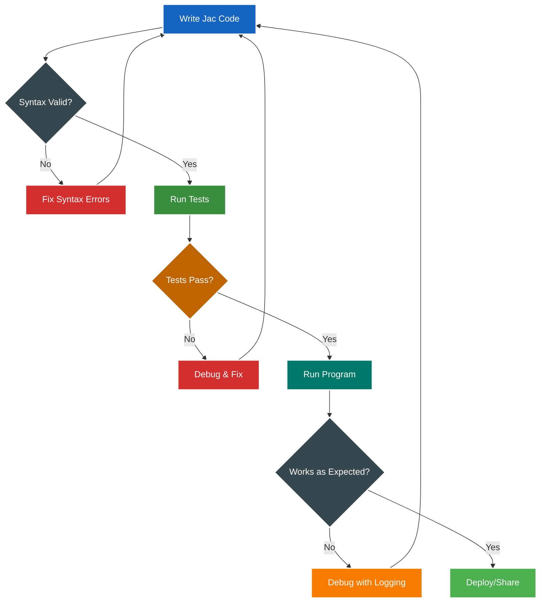

# Chapter 2: Setting Up Your Jac Environment

## 2.1 Installation and Setup

Getting started with Jac is straightforward, especially for Python developers and integrates well with familiar development tools.

### Installing Jac Compiler and Runtime

#### Method 1: Using pip (Recommended)

```bash
# Install the latest stable version
pip install jaclang

# Verify installation
jac --version
# Output: Jac 0.7.19 (or current version)
```

#### Method 2: From Source

```bash
# Clone the repository
git clone https://github.com/jaseci-labs/jaseci.git
cd jaseci/jac

# Install in development mode
pip install -e .

# Run tests to verify
python -m pytest
```

### System Requirements

- **Python**: 3.10 or higher (Jac compiles to Python)
- **Memory**: 4GB RAM minimum, 8GB recommended
- **OS**: Linux, macOS, Windows (WSL recommended)
- **Storage**: 500MB for Jac + dependencies

### IDE Support and Extensions

#### Visual Studio Code (Recommended)

Install the official Jac extension for syntax highlighting, auto-completion, and debugging:

```bash
# Install via VS Code marketplace
code --install-extension jaseci.jac-lang
```

**Features:**
- Syntax highlighting for `.jac` files
- IntelliSense for Jac keywords and types
- Integrated debugging support
- Graph visualization for nodes and edges
- Automatic formatting

#### JetBrains IDEs (PyCharm, IntelliJ)

```xml
<!-- Add to your .idea/fileTypes.xml -->
<component name="FileTypeManager">
  <extensionMap>
    <mapping pattern="*.jac" type="Python" />
    <mapping pattern="*.impl.jac" type="Python" />
    <mapping pattern="*.test.jac" type="Python" />
  </extensionMap>
</component>
```

#### Vim/Neovim

```vim
" Add to your .vimrc or init.vim
autocmd BufRead,BufNewFile *.jac set filetype=python
autocmd BufRead,BufNewFile *.jac set syntax=python

" Better: Install jac.vim plugin
Plug 'jaseci-labs/jac.vim'
```

#### Project Structure Conventions

Jac projects follow a structured organization that supports its unique features like implementation separation:

```
my-jac-project/
│
├── src/
│   ├── main.jac                 # Main entry point
│   ├── models/
│   │   ├── user.jac            # User node definition
│   │   ├── user.impl.jac       # User implementation
│   │   └── user.test.jac       # User tests
│   │
│   ├── walkers/
│   │   ├── auth.jac            # Authentication walkers
│   │   └── auth.impl/          # Implementation folder
│   │       ├── login.impl.jac
│   │       └── register.impl.jac
│   │
│   └── edges/
│       └── relationships.jac    # Edge definitions
│
├── tests/
│   ├── integration/
│   └── unit/
│
├── data/                        # Persistent data (auto-generated)
│   └── .jac_db/                # Jac's persistence layer
│
├── jac.toml                     # Project configuration
└── README.md
```

#### jac.toml Configuration

```toml
[project]
name = "my-jac-project"
version = "0.1.0"
description = "A Jac application"

[runtime]
persist_path = "./data/.jac_db"
log_level = "INFO"
enable_distributed = false

[build]
target = "optimized"  # or "debug"
include_tests = false

[dependencies]
# External Jac modules
```

#### Environment Setup

##### Development Environment Variables

```bash
# .env file
JAC_PERSIST_PATH=./data/.jac_db
JAC_LOG_LEVEL=DEBUG
JAC_USER_CONTEXT=development
JAC_ENABLE_METRICS=true
```

##### Python Virtual Environment (Recommended)

```bash
# Create virtual environment
python -m venv jac-env

# Activate it
source jac-env/bin/activate


# Install Jac in the virtual environment
pip install jaclang
```

## 2.2 Your First Jac Program

Let's create your first Jac program and understand the key differences from Python.

### Hello World Comparison: Python vs Jac

#### Python Version

```python
# hello.py
def greet(name):
    return f"Hello, {name}!"

if __name__ == "__main__":
    message = greet("World")
    print(message)
```

#### Jac Version

<div class="code-block">

```jac
# hello.jac
def greet(name:str) {
    return f"Hello, {name}!";
}

with entry {
    message = greet("World");
    print(message);
}
```
</div>


##### Key differences:
1. **Type annotations**: Required in Jac (`name: str`)
2. **Semicolons**: Required for statements
3. **Entry point**: `with entry` instead of `if __name__ == "__main__"`
4. **Curly braces**: Instead of indentation

### Understanding Entry Blocks

Entry blocks are Jac's way of organizing executable code at the module level:

<div class="code-block">

```jac
# Imports (similar to Python)
import from datetime { datetime }
import random;

# Global variables must be declared
glob start_time: str = datetime.now().isoformat();

# Function definitions
def setup_application() -> bool {
    print(f"Application started at {start_time}");
    return True;
}

# Classes (called objects in Jac)
obj Application {
    has name: str;
    has version: str = "1.0.0";

    def display_info {
        print(f"{self.name} v{self.version}");
    }
}

# Entry block - code that runs when module executes
with entry {
    print("=== Jac Module Demo ===");

    if setup_application() {
        app = Application(name="MyApp");
        app.display_info();
    }
}
```
</div>


### Your First Object-Spatial Program
Let's create a simple but complete object-spatial program:

<div class="code-block">

```jac
# social_hello.jac
# Define a Person node
node Person {
    has name: str;
    has joined: str;
}

# Define a Knows edge
edge Knows {
    has since: str;
}

# Define a Greeter walker
walker Greeter {
    has greeting_count: int = 0;

    # Ability triggered when entering a Person node
    can greet with Person entry {
        print(f"Hello, {here.name}! You joined on {here.joined}");
        self.greeting_count += 1;

        # Visit all people this person knows
        visit [->:Knows:->];
    }

    # Ability triggered when walker finishes
    can summarize with `root exit {
        print(f"Greeted {self.greeting_count} people total!");
    }
}

# Main program
with entry {
    # Create a small social network
    person1 = Person(name="Alice", joined="2024-01-15");
    person2 = Person(name="Bob", joined="2024-02-20");
    person3 = Person(name="Charlie", joined="2024-03-10");

    # Create relationships
    person1 +>:Knows(since="2024-02-01"):+> person2;
    person2 +>:Knows(since="2024-03-01"):+> person3;

    # Spawn walker to greet everyone
    greeter = Greeter();
    greeter spawn person1;
}
```
</div>

#### Running Jac Programs

##### Basic Execution

```bash
# Run a Jac file
jac run social_hello.jac
```

##### Interactive Mode (REPL)

```bash
# Start Jac REPL
jac

# In the REPL:
> x = 42;
> print(x * 2);
84
> node TestNode { has value: int; }
> n = TestNode(value=100);
> print(n.value);
100
```

#### Testing Your Programs

```jac
# social_hello.test.jac

test greet_function_works_correctly {
    assert greet("Jac") == "Hello, Jac!";
    assert greet("") == "Hello, !";
}

test greet_with_special_characters {
    assert greet("世界") == "Hello, 世界!";
    assert greet("O'Brien") == "Hello, O'Brien!";
}

# Run tests
# Command: jac test social_hello.jac
```

### Building a Complete Example

Let's build a simple todo list application that showcases basic Jac features:

<div class="code-block">

```jac
# todo_app.jac
import from datetime { datetime }
import json;

# Define our data structures
node TodoList {
    has name: str;
    has created_at: str;
}

node TodoItem {
    has title: str;
    has created_at: str;
    has completed: bool = False;
    has due_date: str = "";

}

edge Contains{}
edge NextItem{}

# Walker to add new todos
walker AddTodo {
    has title: str;
    has due_date: str = "";

    can add with TodoList entry {
        new_item = here +>:Contains:+> TodoItem(
            title=self.title,
            created_at=datetime.now().isoformat(),
            due_date=self.due_date
        );

        # Link to previous items
        last_item = [->:Contains:->(`?TodoItem)][-2:];
        if last_item {
            last_item[0] +>:NextItem:+> new_item;
        }

        report f"Added: {self.title}";
    }
}

# Walker to list todos
walker ListTodos {
    has show_completed: bool = False;
    has items: list = [];

    can collect with TodoList entry {
        temp = [->:Contains:->(`?TodoItem)];
        for item in [->:Contains:->(`?TodoItem)] {
            if not item.completed or self.show_completed {
                self.items.append({
                    "title": item.title,
                    "completed": item.completed,
                    "created": item.created_at,
                    "due": item.due_date
                });
            }
        }
    }

    can display with TodoList exit {
        print("=== Todo List ===");
        for (i, item) in enumerate(self.items) {
            status = f"✓" if item["completed"] else f"○";
            due = f" (due: {item['due']})" if item["due"] else "";
            print(f"{i+1}. {status} {item['title']}{due}");
        }
        print(f"Total: {len(self.items)} items");
    }
}

# Walker to complete todos
walker CompleteTodo {
    has item_index: int;

    can complete with TodoList entry {
        items = [->:Contains:->(`?TodoItem)];
        if 0 <= self.item_index < len(items) {
            items[self.item_index].completed = True;
            report f"Completed: {items[self.item_index].title}";
        } else {
            report "Invalid item index!";
        }
    }
}

# Main program
with entry {
    # Create or get existing todo list
    my_list = TodoList(
        name="My Tasks",
        created_at=datetime.now().isoformat()
    );

    # Example: Add some todos
    AddTodo(title="Learn Jac basics", due_date="2024-12-31") spawn my_list;
    AddTodo(title="Build first Jac app") spawn my_list;
    AddTodo(title="Master object-spatial programming") spawn my_list;

    # List all todos
    ListTodos(show_completed=True) spawn my_list;
}
```
</div>

#### Running the Todo App

```bash
# First run - creates the list
jac run todo_app.jac
```


### Development Workflow



### Common Issues and Solutions

| Issue | Solution |
|-------|----------|
| `ModuleNotFoundError` | Ensure Jac is installed: `pip install jaclang` |
| `SyntaxError: Missing semicolon` | Add `;` at end of statements |
| `TypeError: Missing type annotation` | Add type hints to all function parameters |
| `RuntimeError: No entry point` | Add `with entry { ... }` block |
| `PersistenceError` | Check write permissions for `JAC_PERSIST_PATH` |

### Next Steps

Now that you have Jac installed and have written your first programs, you're ready to dive deeper into the language. In the next chapter, we'll explore how Jac's syntax relates to Python and learn about the enhanced features that make Jac powerful for modern application development.

Try modifying the todo app to add new features:
- Add priority levels to todos
- Implement due date notifications
- Create categories for todos
- Add a search walker to find specific items

Remember: every Jac program you write is automatically persistent and ready for multi-user scenarios. The same todo app could serve thousands of users without any code changes - that's the power of scale-agnostic programming!