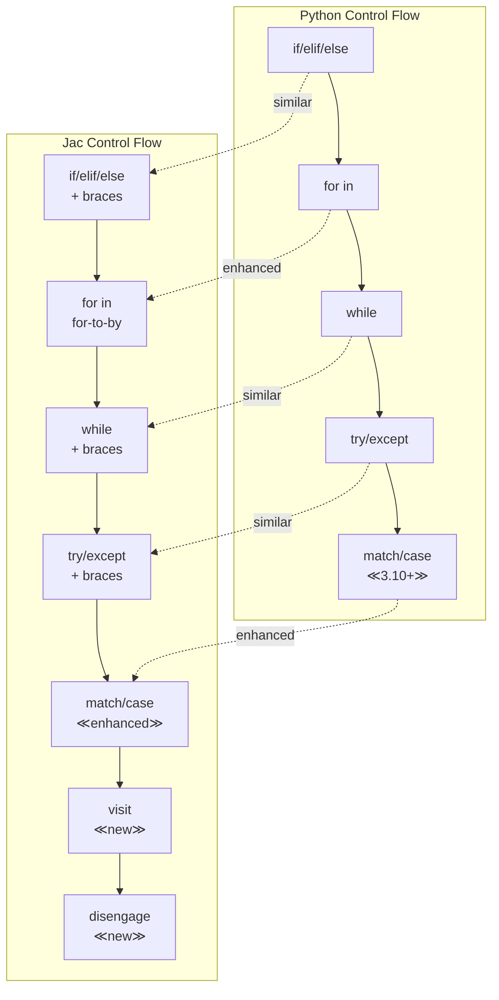

# Chapter 3: Familiar Syntax with New Semantics
As a Python developer, you'll find Jac's syntax comfortably familiar while discovering powerful enhancements that make your code more robust and expressive. This chapter explores the core language features, highlighting what's similar, what's enhanced, and what's new.

## 3.1 Variables and Types
### Type Annotations are Mandatory (Unlike Python's Optional Hints)

In Python, type hints are optional and primarily serve as documentation:

```python
# Python - types are optional hints
name = "Alice"  # Type inferred
age = 30        # Type inferred
score = 95.5    # Type inferred

# Type hints can be added but aren't enforced
def calculate_grade(score: float) -> str:  # Optional
    return "A" if score >= 90 else "B"
```

In Jac, type annotations are mandatory and enforced at compile time:

<div class="code-block">

```jac
# Function parameters and returns MUST have types
def calculate_grade(score: float) -> str {
    return "A" if score >= 90.0 else "B";
}

with entry{
    # Jac - types are required and enforced
    name: str = "Alice";    # Explicit type required
    age: int = 30;          # Must specify type
    score: float = 95.5;    # Type checking enforced

    # This would cause a compile error:
    # mystery = "something";  # Error: missing type annotation
}

```
</div>

### Benefits of Mandatory Types

<div class="code-block">

```jac
# Type safety prevents runtime errors
obj Student {
    has name: str;
    has grades: list[float];

    def add_grade(grade: float) {
        # This would fail at compile time if grade wasn't a float
        self.grades.append(grade);
    }

    def get_average() -> float {
        if len(self.grades) == 0 {
            return 0.0;  # Must return float, not int
        }
        return sum(self.grades) / len(self.grades);
    }
}

# Type errors caught at compile time
with entry {
    student = Student(name="Bob", grades=[]);

    # student.add_grade("95");  # Compile error: string != float
    student.add_grade(95.0);     # Correct

    avg: float = student.get_average();  # Type-safe assignment
    print(f"{student.name}'s average grade: {avg}");  # Should print "Bob's average grade: 95.0"
}
```
</div>

### `glob` for Global Variables

While Python uses the `global` keyword to modify globals within functions, Jac uses `glob` for declaration and `:g:` for access:

```python
# Python
counter = 0  # Global variable

def increment():
    global counter  # Declare intent to modify global
    counter += 1
```

<div class="code-block">

```jac
glob counter: int = 0;  # Explicitly global variable

def increment() {
    :g: counter;    # Declare access to global
    counter += 1;
}

# Access control for globals
glob:pub api_version: str = "1.0";      # Public global
glob:priv secret_key: str = "hidden";   # Private global
glob:protect internal_state: dict = {}; # Protected global

# Module-level globals with entry block
with entry {
    increment();
    increment();

    print(f"Counter: {counter}, API Version: {api_version}");
}
```
</div>


### Working with Collection Types

<div class="code-block">

```jac
with entry{
    # Lists with explicit typing
    numbers: list[int] = [1, 2, 3, 4, 5];
    names: list[str] = ["Alice", "Bob", "Charlie"];
    matrix: list[list[float]] = [[1.0, 2.0], [3.0, 4.0]];

    # Dictionaries with key-value types
    scores: dict[str, int] = {"Alice": 95, "Bob": 87};
    config: dict[str, any] = {"debug": True, "port": 8080};

    # Sets with element types
    unique_ids: set[int] = {101, 102, 103};
    tags: set[str] = {"python", "jac", "programming"};

    # Tuples - both positional and keyword (Jac special!)
    point: tuple = (3, 4);                    # Positional
}
```
</div>

### Working with Any Type

Sometimes you need dynamic typing. Jac provides `any` as an escape hatch:

<div class="code-block">

```jac
with entry{
    # Using 'any' for flexible types
    flexible: any = 42;
    print(flexible);

    flexible = "now a string";  # Allowed with 'any'
    print(flexible);

    flexible = [1, 2, 3];      # Still allowed
    print(flexible);


    # Useful for JSON-like data
    json_data: dict[str, any] = {
        "name": "Alice",
        "age": 30,
        "tags": ["developer", "python"],
        "active": True
    };
    print(json_data);

}
```
</div>

## 3.2 Control Flow

### Curly Braces Instead of Indentation

The most visible difference from Python is the use of curly braces for code blocks:

```python
# Python uses indentation
if temperature > 30:
    print("It's hot!")
    if temperature > 40:
        print("It's very hot!")
else:
    print("It's comfortable")
```

<div class="code-block">

```jac
with entry{
    temperature = 35;  # Temperature in Celsius

    # Jac uses curly braces
    if temperature > 30 {
        print("It's hot!");
        if temperature > 40 {
            print("It's very hot!");
        }
    } else {
        print("It's comfortable");
    }
}
```
</div>

### Enhanced For Loops: `for-to-by` Syntax

Jac provides multiple for loop syntaxes, including a unique `for-to-by` construct:

<div class="code-block">

```jac
with entry{
    # Traditional for-in loop (like Python)
    items: list[str] = ["apple", "banana", "cherry"];
    for item in items {
        print(item);
    }

    # Range-based loop (like Python)
    for i in range(5) {
        print(i);  # 0, 1, 2, 3, 4
    }

    # Jac's unique for-to-by loop
    for i = 0 to i < 10 by i += 2 {
        print(i);  # 0, 2, 4, 6, 8
    }

    # Complex for-to-by examples
    # Countdown
    for count = 10 to count > 0 by count -= 1 {
        print(f"{count}...");
    }
    print("Liftoff!");

    # Exponential growth
    for value = 1 to value <= 1000 by value *= 2 {
        print(value);  # 1, 2, 4, 8, 16, 32, 64, 128, 256, 512
    }
}
```
</div>

### Match Statements (Pattern Matching)

Jac includes the familiar pattern matching from similar Python 3.10+':
<div class="code-block">

```jac
# Basic pattern matching
def describe_number(n: int) -> str {
    match n {
        case 0: return "zero";
        case 1: return "one";
        case 2: return "two";
        case x if x < 0: return "negative";
        case x if x > 100: return "large";
        case _: return "other";
    }
}

# Structural pattern matching
def process_data(data: any) -> str {
    match data {
        case None:
            return "No data";

        case list() if data == []:
            return "Empty list";

        case [x]:
            return f"Single item: {x}";

        case [first, *rest]:
            return f"List starting with {first}";

        case {"type": "user", "name": name}:
            return f"User: {name}";

        case {"type": t, **kwargs}:
            return f"Object of type {t}";

        case _:
            return "Unknown data";
    }
}

# Type pattern matching
node Animal {
    has name: str;
}

node Dog(Animal) {
    has breed: str;
}

node Cat(Animal) {
    has indoor: bool;
}

walker AnimalHandler {
    can handle with Animal entry {
        match here {
            case Dog():
                print(f"{here.name} is a {here.breed} dog");

            case Cat() if here.indoor:
                print(f"{here.name} is an indoor cat");

            case Cat():
                print(f"{here.name} is an outdoor cat");

            case _:
                print(f"{here.name} is some other animal");
        }
    }
}

with entry {
    dog = Dog(name = "Buddy", breed = "Golden Retriever");
    cat = Cat(name = "Whiskers", indoor = True);
    unknown_animal = Animal(name = "Mystery");

    AnimalHandler() spawn dog;
    AnimalHandler() spawn cat;
    AnimalHandler() spawn unknown_animal;

    result = process_data([3, 4]);
    print(result);  # Should print "List starting with 3"
}
```
</div>

### Walrus Operator (`:=`)

Both Python and Jac support the walrus operator for assignment expressions:

```python
# Python walrus operator
while (line := file.readline()):
    process(line)

if (n := len(items)) > 10:
    print(f"Large list with {n} items")
```
<div class="code-block">

```jac
with entry {
    # Jac walrus operator - same syntax, similar usage
    while (line := file.readline()) {
        process(line);
    }

    if (n := len(items)) > 10 {
        print(f"Large list with {n} items");
    }

    # Useful in comprehensions
    results: list[int] = [
        y for x in data
        if (y := expensive_computation(x)) > threshold
    ];

    # In match statements
    match get_user() {
        case user if (role := user.get_role()) == "admin":
            grant_admin_access(role);
        case _:
            grant_basic_access();
    }
}
```
</div>

### Control Flow Comparison



### Exception Handling

Exception handling in Jac follows Python patterns with brace syntax:

<div class="code-block">

```jac
# Basic pattern matching
def safe_divide(a: float, b: float) -> float {
    try {
        return a / b;
    } except ZeroDivisionError {
        print("Cannot divide by zero!");
        return 0.0;
    }
}

# Raising exceptions
def validate_age(age: int) {
    if age < 0 {
        raise ValueError("Age cannot be negative");
    }
    if age > 150 {
        raise ValueError("Age seems unrealistic");
    }
}

with entry {
    print(safe_divide(10, 2));  # Should print 5.0
    print(safe_divide(10, 0));  # Should print "Cannot divide by zero!" and return 0.0

    try {
        validate_age(-5);  # Should raise ValueError
    } except ValueError as e {
        print(f"Validation error: {e}");
    }
}
```
</div>

## 3.3 Functions to Abilities


Jac uses the same `def` as Python for function definitions:

```python
# Python function
def calculate_area(radius: float) -> float:
    return 3.14159 * radius ** 2
```
<div class="code-block">

```jac
# Jac function
def calculate_area(radius: float) -> float {
    return 3.14159 * radius ** 2;
}
with entry {
    # Functions are first-class objects
    area_calculator: func = calculate_area;
    result: float = area_calculator(5.0);
}
```
</div>

### Type Safety and Return Types

Jac enforces return type consistency:

<div class="code-block">

```jac
# Return types are enforced
def get_grade(score: float) -> str {
    if score >= 90.0 {
        return "A";
    } elif score >= 80.0 {
        return "B";
    }
    # return;  # Error: must return str
    return "F";  # Must cover all paths
}

# Multiple return values via tuples
def divmod(a: int, b: int) -> tuple[int, int] {
    return (a // b, a % b);
}


def find_item(items: list[str], target: str) -> int {
    for (i, item) in enumerate(items) {
        if item == target {
            return i;
        }
    }
    return None;  # Explicitly return None for not found
}

with entry {
    print(get_grade(85));  # Should print "B"
    print(divmod(10, 3));  # Should print (3, 1)
    print(find_item(["apple", "banana", "cherry"], "banana"));  # Should print 1
}
```
</div>

### Lambda Expressions with Required Type Annotations

Python's lambdas can infer types, but Jac requires explicit annotations:

```python
# Python lambdas - types optional
square = lambda x: x ** 2
add = lambda x, y: x + y
```

<div class="code-block">

```jac
with entry {
    # Jac lambdas - types required
    square = lambda x: int : x ** 2;
    add = lambda x: int, y: int : x + y;

    # Using lambdas with higher-order functions
    numbers: list[int] = [1, 2, 3, 4, 5];
    squared: list[int] = map(lambda x: int : x ** 2, numbers);
    evens: list[int] = filter(lambda x: int : x % 2 == 0, numbers);


    # Lambda in sort
    people: list[dict] = [
        {"name": "Alice", "age": 30},
        {"name": "Bob", "age": 25},
        {"name": "Charlie", "age": 35}
    ];
    people.sort(key=lambda p: dict : p["age"]);
    print(people);
}
```
</div>

### Function Decorators and Metadata

Jac supports Python-style decorators with enhanced integration:

<div class="code-block">

```jac
import from functools { lru_cache }

# Using Python decorators
@lru_cache(maxsize=128)
def fibonacci(n: int) -> int {
    if n <= 1 {
        return n;
    }
    return fibonacci(n - 1) + fibonacci(n - 2);
}

# Custom decorators
def timing_decorator(func: callable) -> callable {
    def wrapper(*args: any, **kwargs: any) -> any {
        import time;
        start = time.time();
        result = func(*args, **kwargs);
        end = time.time();
        print(f"{func.__name__} took {end - start} seconds");
        return result;
    }
    return wrapper;
}

@timing_decorator
def slow_operation(n: int) -> int {
    result: int = 0;
    for i in range(n) {
        result += i ** 2;
    }
    return result;
}


with entry {
    print("=== Decorators Example ===");

    # Using the cached Fibonacci function
    for i in range(10){
        print(f"Fibonacci({i}) = {fibonacci(i)}");
    }


    # Using the slow operation with timing decorator
    result = slow_operation(1000000);
    print(f"Result of slow operation: {result}");
}
```
</div>

### Async Functions

Jac supports asynchronous programming similar to Python:

<div class="code-block">

```jac
import asyncio;

async def fetch_data(){
    print("Starting fetch...");
    # simulate an I/O-bound operation
    await asyncio.sleep(2);
    print("Fetch complete");
    return {"data": 123};
}

async def main(){
    print("Before fetch");
    result = await fetch_data();   # pause here until fetch_data() finishes
    print("After fetch:", result);
}

with entry {
    asyncio.run(main());
}
```
</div>

### Method Resolution and Super

Jac provides clear method resolution with the `super` keyword:

<div class="code-block">

```jac
obj Animal {
    has name: str;

    def speak() -> str {
        return f"{self.name} makes a sound";
    }
}

obj Dog(Animal) {
    has breed: str;

    def speak() -> str {
        # Call parent method
        base_sound = super.speak();
        return f"{base_sound}: Woof!";
    }

    def fetch() {
        print(f"{self.name} the {self.breed} is fetching!");
    }
}

obj GuideDog(Dog) {
    has handler: str;

    def speak() -> str {
        # Chain through inheritance
        return f"{super.speak()} (Guide dog for {self.handler})";
    }
}

with entry {
    my_dog = Dog(name="Buddy", breed="Golden Retriever");
    print(my_dog.speak());  # Buddy makes a sound: Woof!
    my_dog.fetch();

    guide_dog = GuideDog(name="Max", breed="Labrador", handler="Alice");
    print(guide_dog.speak());  # Max makes a sound (Guide dog for Alice): Woof!
    guide_dog.fetch();
}
```
</div>

### Best Practices for Functions and Abilities

1. **Use Functions for Algorithms**: Pure computations without side effects
2. **Use Abilities for Behavior**: Context-dependent actions in graph traversal
3. **Type Everything**: Clear types prevent errors and improve readability
4. **Avoid Deep Nesting**: Use early returns and guard clauses
5. **Document Complex Logic**: Use docstrings for non-obvious behavior

<div class="code-block">

```jac
# Well-structured function example
def calculate_discount(
    price: float,
    customer_type: str,
    quantity: int
) -> float {
    # Guard clauses
    if price <= 0.0 {
        return 0.0;
    }

    # Base discount by customer type
    base_discount: float = 0.0;


    match customer_type {
        case "premium": base_discount = 0.15;
        case "regular": base_discount = 0.05;
    };

    # Quantity bonus
    quantity_bonus: float = 0.0;
    match quantity {
        case n if n >= 100: quantity_bonus = 0.10;
        case n if n >= 50: quantity_bonus = 0.05;
        case n if n >= 10: quantity_bonus = 0.02;
    };

    # Calculate total discount
    total_rate = min(base_discount + quantity_bonus, 0.25);
    return price * total_rate;
}

with entry {
    # Example usage
    price = 200.0;
    customer_type = "premium";
    quantity = 75;

    discount = calculate_discount(price, customer_type, quantity);
    print(f"Discount for {customer_type} customer buying {quantity} items at ${price} each: ${discount}");
}
```
</div>

## Summary

In this chapter, we've seen how Jac builds on Python's familiar syntax while adding:

- **Mandatory type safety** for more robust code
- **Explicit variable declaration** for clarity
- **Enhanced control flow** with for-to-by loops and pattern matching
- **Implicit self** for cleaner method definitions
- **Context-aware abilities** alongside traditional functions

These enhancements make Jac code more explicit, safer, and better suited for the complex, distributed systems you'll build with object-spatial programming.

In the next chapter, we'll explore Jac's data structures and unique features like keyword tuples and pipe operators that make data manipulation even more powerful and expressive.