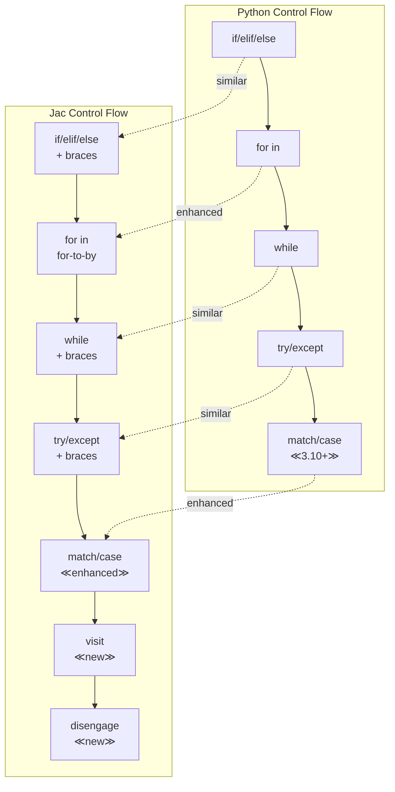

### Chapter 3: Familiar Syntax with New Semantics

As a Python developer, you'll find Jac's syntax comfortably familiar while discovering powerful enhancements that make your code more robust and expressive. This chapter explores the core language features, highlighting what's similar, what's enhanced, and what's new.

#### 3.1 Variables and Types

#### Type Annotations are Mandatory (Unlike Python's Optional Hints)

In Python, type hints are optional and primarily serve as documentation:

```python
# Python - types are optional hints
name = "Alice"  # Type inferred
age = 30        # Type inferred
score = 95.5    # Type inferred

# Type hints can be added but aren't enforced
def calculate_grade(score: float) -> str:  # Optional
    return "A" if score >= 90 else "B"
```

In Jac, type annotations are mandatory and enforced at compile time:

```jac
// Jac - types are required and enforced
let name: str = "Alice";    // Explicit type required
let age: int = 30;          // Must specify type
let score: float = 95.5;    // Type checking enforced

// Function parameters and returns MUST have types
can calculate_grade(score: float) -> str {
    return "A" if score >= 90.0 else "B";
}

// This would cause a compile error:
// let mystery = "something";  // Error: missing type annotation
```

#### Benefits of Mandatory Types

```jac
// Type safety prevents runtime errors
obj Student {
    has name: str;
    has grades: list[float];

    can add_grade(grade: float) {
        // This would fail at compile time if grade wasn't a float
        self.grades.append(grade);
    }

    can get_average() -> float {
        if len(self.grades) == 0 {
            return 0.0;  // Must return float, not int
        }
        return sum(self.grades) / len(self.grades);
    }
}

// Type errors caught at compile time
with entry {
    let student = Student(name="Bob", grades=[]);

    // student.add_grade("95");  // Compile error: string != float
    student.add_grade(95.0);     // Correct

    let avg: float = student.get_average();  // Type-safe assignment
}
```

#### `let` for Explicit Declarations vs Python's Implicit Declaration

Python creates variables implicitly on first assignment:

```python
# Python
x = 10        # Variable created implicitly
x = "hello"   # Type can change (dynamic typing)
y = x         # Another implicit creation
```

Jac requires explicit declaration with `let`:

```jac
// Jac
let x: int = 10;        // Explicit declaration with type
// x = "hello";         // Error: can't change type
let y: int = x;         // Must declare before use

// let provides clarity about variable creation
can process_data(data: list[int]) -> int {
    let sum: int = 0;              // Clear: new variable
    let count: int = len(data);    // Clear: new variable

    for item in data {
        sum += item;    // Clear: modifying existing variable
    }

    let average: float = sum / count;  // Clear: new variable
    return int(average);
}
```

#### `glob` for Global Variables

While Python uses the `global` keyword to modify globals within functions, Jac uses `glob` for declaration and `:g:` for access:

```python
# Python
counter = 0  # Global variable

def increment():
    global counter  # Declare intent to modify global
    counter += 1
```

```jac
// Jac
glob counter: int = 0;  // Explicitly global variable

can increment() {
    :g: counter;    // Declare access to global
    counter += 1;
}

// Access control for globals
glob:pub api_version: str = "1.0";      // Public global
glob:priv secret_key: str = "hidden";   // Private global
glob:protect internal_state: dict = {}; // Protected global

// Module-level globals with entry block
with entry {
    :g: counter, api_version;
    print(f"Counter: {counter}, API Version: {api_version}");
}
```

#### Built-in Types Comparison Table

| Python Type | Jac Type | Notes |
|------------|----------|-------|
| `int` | `int` | Same behavior, explicit declaration |
| `float` | `float` | Same precision rules |
| `str` | `str` | Same string operations |
| `bool` | `bool` | Same True/False values |
| `list` | `list[T]` | Generic type required |
| `dict` | `dict[K,V]` | Key and value types required |
| `tuple` | `tuple` | Supports both positional and keyword |
| `set` | `set[T]` | Element type required |
| `None` | `None` | Same null/none concept |
| `Any` | `any` | Escape hatch for dynamic typing |
| `bytes` | `bytes` | Binary data handling |
| `type` | `type` | Type introspection |

#### Working with Collection Types

```jac
// Lists with explicit typing
let numbers: list[int] = [1, 2, 3, 4, 5];
let names: list[str] = ["Alice", "Bob", "Charlie"];
let matrix: list[list[float]] = [[1.0, 2.0], [3.0, 4.0]];

// Dictionaries with key-value types
let scores: dict[str, int] = {"Alice": 95, "Bob": 87};
let config: dict[str, any] = {"debug": true, "port": 8080};

// Sets with element types
let unique_ids: set[int] = {101, 102, 103};
let tags: set[str] = {"python", "jac", "programming"};

// Tuples - both positional and keyword (Jac special!)
let point: tuple = (3, 4);                    // Positional
let person: tuple = (name="Alice", age=30);  // Keyword tuple!
```

#### Type Inference and Validation

While types must be declared, Jac can infer complex types in some contexts:

```jac
// Type inference in comprehensions
let numbers: list[int] = [1, 2, 3, 4, 5];
let squared = [x * x for x in numbers];  // Inferred as list[int]

// But explicit is often better
let squared_explicit: list[int] = [x * x for x in numbers];

// Type validation at compile time
can safe_divide(a: float, b: float) -> float {
    if b == 0.0 {
        return 0.0;  // Must return float
        // return None;  // Error: None is not float
    }
    return a / b;
}

// Optional types for nullable values
can find_user(id: int) -> str? {  // Can return str or None
    if id < 0 {
        return None;  // Valid
    }
    return f"User_{id}";  // Valid
}
```

#### Working with Any Type

Sometimes you need dynamic typing. Jac provides `any` as an escape hatch:

```jac
// Using 'any' for flexible types
let flexible: any = 42;
flexible = "now a string";  // Allowed with 'any'
flexible = [1, 2, 3];      // Still allowed

// Useful for JSON-like data
let json_data: dict[str, any] = {
    "name": "Alice",
    "age": 30,
    "tags": ["developer", "python"],
    "active": true
};

// But prefer specific types when possible
obj ConfigValue {
    has value: any;
    has type_name: str;

    can get_typed[T](expected_type: type) -> T? {
        if type(self.value) == expected_type {
            return self.value;
        }
        return None;
    }
}
```

#### 3.2 Control Flow

#### Curly Braces Instead of Indentation

The most visible difference from Python is the use of curly braces for code blocks:

```python
# Python uses indentation
if temperature > 30:
    print("It's hot!")
    if temperature > 40:
        print("It's very hot!")
else:
    print("It's comfortable")
```

```jac
// Jac uses curly braces
if temperature > 30 {
    print("It's hot!");
    if temperature > 40 {
        print("It's very hot!");
    }
} else {
    print("It's comfortable");
}

// Indentation is for readability, not syntax
if user.is_authenticated {
print("Welcome!");     // Still works but not recommended
    print("Logged in");  // Inconsistent indentation is allowed
}                        // But maintain consistency for readability!
```

#### Enhanced For Loops: `for-to-by` Syntax

Jac provides multiple for loop syntaxes, including a unique `for-to-by` construct:

```jac
// Traditional for-in loop (like Python)
let items: list[str] = ["apple", "banana", "cherry"];
for item in items {
    print(item);
}

// Range-based loop (like Python)
for i in range(5) {
    print(i);  // 0, 1, 2, 3, 4
}

// Jac's unique for-to-by loop
for i = 0 to i < 10 by i += 2 {
    print(i);  // 0, 2, 4, 6, 8
}

// Complex for-to-by examples
// Countdown
for count = 10 to count > 0 by count -= 1 {
    print(f"{count}...");
}
print("Liftoff!");

// Exponential growth
for value = 1 to value <= 1000 by value *= 2 {
    print(value);  // 1, 2, 4, 8, 16, 32, 64, 128, 256, 512
}

// Multiple variables (advanced)
for i = 0, j = 10 to i < j by i += 1, j -= 1 {
    print(f"i={i}, j={j}");
}
```

#### Match Statements (Pattern Matching)

Jac includes pattern matching, similar to Python 3.10+'s match statement but with enhanced features:

```jac
// Basic pattern matching
can describe_number(n: int) -> str {
    match n {
        case 0: return "zero";
        case 1: return "one";
        case 2: return "two";
        case x if x < 0: return "negative";
        case x if x > 100: return "large";
        case _: return "other";
    }
}

// Structural pattern matching
can process_data(data: any) -> str {
    match data {
        case None:
            return "No data";

        case []:
            return "Empty list";

        case [x]:
            return f"Single item: {x}";

        case [first, *rest]:
            return f"List starting with {first}";

        case {"type": "user", "name": name}:
            return f"User: {name}";

        case {"type": t, **kwargs}:
            return f"Object of type {t}";

        case _:
            return "Unknown data";
    }
}

// Type pattern matching
node Animal {
    has name: str;
}

node Dog(Animal) {
    has breed: str;
}

node Cat(Animal) {
    has indoor: bool;
}

walker AnimalHandler {
    can handle with Animal entry {
        match here {
            case Dog:
                print(f"{here.name} is a {here.breed} dog");

            case Cat if here.indoor:
                print(f"{here.name} is an indoor cat");

            case Cat:
                print(f"{here.name} is an outdoor cat");

            case _:
                print(f"{here.name} is some other animal");
        }
    }
}
```

#### Walrus Operator (`:=`) Similarities and Differences

Both Python and Jac support the walrus operator for assignment expressions:

```python
# Python walrus operator
while (line := file.readline()):
    process(line)

if (n := len(items)) > 10:
    print(f"Large list with {n} items")
```

```jac
// Jac walrus operator - same syntax, similar usage
while (line := file.readline()) {
    process(line);
}

if (n := len(items)) > 10 {
    print(f"Large list with {n} items");
}

// Useful in comprehensions
let results: list[int] = [
    y for x in data
    if (y := expensive_computation(x)) > threshold
];

// In match statements
match get_user() {
    case user if (role := user.get_role()) == "admin":
        grant_admin_access(role);
    case _:
        grant_basic_access();
}
```

#### Control Flow Comparison



#### Exception Handling

Exception handling in Jac follows Python patterns with brace syntax:

```jac
// Basic try-except
can safe_divide(a: float, b: float) -> float {
    try {
        return a / b;
    } except ZeroDivisionError {
        print("Cannot divide by zero!");
        return 0.0;
    }
}

// Multiple exception types
can process_file(filename: str) -> str {
    try {
        let file = open(filename, "r");
        let content = file.read();
        file.close();
        return content;
    } except FileNotFoundError as e {
        print(f"File not found: {e}");
        return "";
    } except IOError as e {
        print(f"IO error: {e}");
        return "";
    } finally {
        print("Cleanup complete");
    }
}

// Raising exceptions
can validate_age(age: int) {
    if age < 0 {
        raise ValueError("Age cannot be negative");
    }
    if age > 150 {
        raise ValueError("Age seems unrealistic");
    }
}
```

#### 3.3 Functions to Abilities

#### Traditional Functions with `can` Keyword

Jac uses `can` instead of Python's `def` for function definitions:

```python
# Python function
def calculate_area(radius: float) -> float:
    return 3.14159 * radius ** 2
```

```jac
// Jac function
can calculate_area(radius: float) -> float {
    return 3.14159 * radius ** 2;
}

// Functions are first-class objects
let area_calculator: func = calculate_area;
let result: float = area_calculator(5.0);
```

#### Why `self` is Optional in Jac

One of Jac's conveniences is that `self` is implicit in methods unless you need it:

```python
# Python - self is always required
class Rectangle:
    def __init__(self, width, height):
        self.width = width
        self.height = height

    def area(self):  # Must include self
        return self.width * self.height

    def describe(self):  # Must include self even if unused
        return "A rectangle"
```

```jac
// Jac - self is implicit
obj Rectangle {
    has width: float;
    has height: float;

    can area() -> float {  // No self needed!
        return self.width * self.height;  // self still accessible
    }

    can describe() -> str {  // No self parameter
        return "A rectangle";  // Not using self? Don't declare it!
    }

    can set_dimensions(width: float, height: float) {
        self.width = width;    // self available when needed
        self.height = height;
    }
}
```

#### Type Safety and Return Types

Jac enforces return type consistency:

```jac
// Return types are enforced
can get_grade(score: float) -> str {
    if score >= 90.0 {
        return "A";
    } elif score >= 80.0 {
        return "B";
    }
    // return;  // Error: must return str
    return "F";  // Must cover all paths
}

// Multiple return values via tuples
can divmod(a: int, b: int) -> tuple[int, int] {
    return (a // b, a % b);
}

// Optional returns
can find_item(items: list[str], target: str) -> int? {
    for i, item in enumerate(items) {
        if item == target {
            return i;
        }
    }
    return None;  // Explicitly return None for not found
}
```

#### Lambda Expressions with Required Type Annotations

Python's lambdas can infer types, but Jac requires explicit annotations:

```python
# Python lambdas - types optional
square = lambda x: x ** 2
add = lambda x, y: x + y
```

```jac
// Jac lambdas - types required
let square = lambda x: int -> int : x ** 2;
let add = lambda x: int, y: int -> int : x + y;

// Using lambdas with higher-order functions
let numbers: list[int] = [1, 2, 3, 4, 5];
let squared: list[int] = numbers.map(lambda x: int -> int : x ** 2);
let evens: list[int] = numbers.filter(lambda x: int -> bool : x % 2 == 0);

// Lambda in sort
let people: list[tuple] = [
    (name="Alice", age=30),
    (name="Bob", age=25),
    (name="Charlie", age=35)
];
people.sort(key=lambda p: tuple -> int : p.age);
```

#### Abilities: Context-Aware Functions

Beyond traditional functions, Jac introduces abilities - functions that execute based on context:

```jac
// Traditional function - explicitly called
can greet(name: str) -> str {
    return f"Hello, {name}!";
}

// Ability - implicitly triggered
walker Greeter {
    can greet_person with Person entry {
        // No parameters! Context provided by 'here' and 'self'
        print(f"Hello, {here.name}!");
    }
}

// Node ability - triggered by visitor
node Person {
    has name: str;

    can welcome with Greeter entry {
        // 'visitor' refers to the walker
        print(f"{self.name} says: Welcome, traveler!");
    }
}

// Usage comparison
with entry {
    // Traditional function - explicit call
    message = greet("Alice");
    print(message);

    // Ability - implicit execution
    let alice = Person(name="Alice");
    let greeter = Greeter();
    greeter spawn alice;  // Triggers both abilities!
}
```

#### Function Decorators and Metadata

Jac supports Python-style decorators with enhanced integration:

```jac
import:py from functools { lru_cache }
import:py from typing { deprecated }

// Using Python decorators
@lru_cache(maxsize=128)
can fibonacci(n: int) -> int {
    if n <= 1 {
        return n;
    }
    return fibonacci(n - 1) + fibonacci(n - 2);
}

// Custom decorators
can timing_decorator(func: callable) -> callable {
    can wrapper(*args: any, **kwargs: any) -> any {
        import:py time;
        start = time.time();
        result = func(*args, **kwargs);
        end = time.time();
        print(f"{func.__name__} took {end - start:.4f} seconds");
        return result;
    }
    return wrapper;
}

@timing_decorator
can slow_operation(n: int) -> int {
    let result: int = 0;
    for i in range(n) {
        result += i ** 2;
    }
    return result;
}
```

#### Async Functions

Jac supports asynchronous programming similar to Python:

```jac
import:py asyncio;
import:py from aiohttp { ClientSession }

// Async function definition
async can fetch_data(url: str) -> dict {
    async with ClientSession() as session {
        async with session.get(url) as response {
            return await response.json();
        }
    }
}

// Async walker ability
walker AsyncDataCollector {
    has urls: list[str];
    has results: list[dict] = [];

    async can collect with entry {
        // Parallel fetch
        let tasks = [fetch_data(url) for url in self.urls];
        self.results = await asyncio.gather(*tasks);
    }
}

// Using async in entry
with entry {
    async can main() {
        let urls = [
            "https://api.example.com/data1",
            "https://api.example.com/data2"
        ];

        let collector = AsyncDataCollector(urls=urls);
        await collector.collect();
        print(f"Collected {len(collector.results)} results");
    }

    asyncio.run(main());
}
```

#### Method Resolution and Super

Jac provides clear method resolution with the `super` keyword:

```jac
obj Animal {
    has name: str;

    can speak() -> str {
        return f"{self.name} makes a sound";
    }
}

obj Dog(Animal) {
    has breed: str;

    can speak() -> str {
        // Call parent method
        let base_sound = super.speak();
        return f"{base_sound}: Woof!";
    }

    can fetch() {
        print(f"{self.name} the {self.breed} is fetching!");
    }
}

obj GuideDog(Dog) {
    has handler: str;

    can speak() -> str {
        // Chain through inheritance
        return f"{super.speak()} (Guide dog for {self.handler})";
    }
}
```

#### Best Practices for Functions and Abilities

1. **Use Functions for Algorithms**: Pure computations without side effects
2. **Use Abilities for Behavior**: Context-dependent actions in graph traversal
3. **Type Everything**: Clear types prevent errors and improve readability
4. **Avoid Deep Nesting**: Use early returns and guard clauses
5. **Document Complex Logic**: Use docstrings for non-obvious behavior

```jac
// Well-structured function example
can calculate_discount(
    price: float,
    customer_type: str,
    quantity: int
) -> float {
    """
    Calculate discount based on customer type and quantity.

    Returns the discount amount (not the final price).
    """
    // Guard clauses
    if price <= 0.0 {
        return 0.0;
    }

    // Base discount by customer type
    let base_discount: float = match customer_type {
        case "premium": 0.15;
        case "regular": 0.05;
        case _: 0.0;
    };

    // Quantity bonus
    let quantity_bonus: float = match quantity {
        case n if n >= 100: 0.10;
        case n if n >= 50: 0.05;
        case n if n >= 10: 0.02;
        case _: 0.0;
    };

    // Calculate total discount
    let total_rate = min(base_discount + quantity_bonus, 0.25);
    return price * total_rate;
}
```

### Summary

In this chapter, we've seen how Jac builds on Python's familiar syntax while adding:

- **Mandatory type safety** for more robust code
- **Explicit variable declaration** for clarity
- **Enhanced control flow** with for-to-by loops and pattern matching
- **Implicit self** for cleaner method definitions
- **Context-aware abilities** alongside traditional functions

These enhancements make Jac code more explicit, safer, and better suited for the complex, distributed systems you'll build with object-spatial programming.

In the next chapter, we'll explore Jac's data structures and unique features like keyword tuples and pipe operators that make data manipulation even more powerful and expressive.