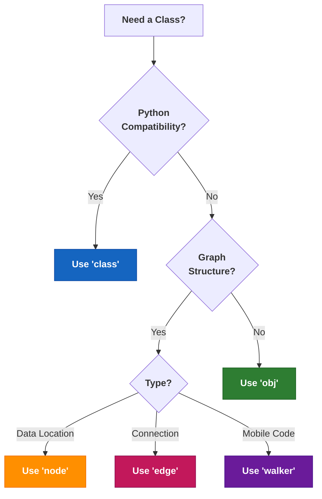

### Chapter 5: Object-Oriented Programming Enhanced

Jac takes the familiar concepts of object-oriented programming and enhances them with modern features like automatic constructors, implementation separation, and object-spatial archetypes. This chapter explores how Jac improves upon traditional OOP while maintaining compatibility with Python when needed.

#### 5.1 From Classes to Archetypes

### `obj` - Enhanced Dataclass-like Behavior

Jac's `obj` archetype combines the best of Python classes and dataclasses with automatic constructor generation:

#### Python - Traditional class

- This Python example shows how you must manually define constructors and string representations for even simple classes.

```python
class Person:
    def __init__(self, name: str, age: int, email: str = ""):
        self.name = name
        self.age = age
        self.email = email

    def __repr__(self):
        return f"Person(name={self.name}, age={self.age})"
```

#### Python - Dataclass (closer to Jac's `obj`)

- Python’s `@dataclass` reduces boilerplate by auto-generating constructors and common methods, though it still lacks deeper architectural semantics and extensibility.

```python
from dataclasses import dataclass

@dataclass
class PersonDC:
    name: str
    age: int
    email: str = ""
```

#### Jac `obj` Archetype

- Jac's `obj` archetype automatically handles constructors, default values, and representations with minimal syntax, offering clean and powerful object definitions.

```jac
obj Person {
    has name: str;
    has age: int;
    has email: str = "";
}

# That's it! Constructor, initialization, all automatic
with entry {
    let p = Person(name="Alice", age=30);
    print(p);  # Automatic string representation
}
```

### Automatic Constructors with `has` Declarations

The `has` keyword declares instance variables and automatically generates constructors:

```jac
obj Employee {
    has id: int;
    has name: str;
    has department: str;
    has start_date: str;
    has salary: float = 50000.0;  # Default value
    has is_active: bool = True;
    has skills: list[str] = [];  # Mutable default handled correctly!
}

# Automatic constructor handles all of this:
with entry {
    # All required fields must be provided
    let emp1 = Employee(
        id=101,
        name="Alice Smith",
        department="Engineering",
        start_date="2024-01-15"
    );
    # salary=50000.0, is_active=True, skills=[] are defaults

    # Can override defaults
    let emp2 = Employee(
        id=102,
        name="Bob Jones",
        department="Marketing",
        salary=65000.0,
        start_date="2023-06-01",
        is_active=True,
        skills=["communication", "analysis"]
    );
}
```

### Advanced `has` Patterns

```jac
obj Configuration {
    # Simple fields
    has version: str;
    has debug: bool = False;

    # Complex types
    has settings: dict[str, any] = {};
    has modules: list[str] = [];

    # Computed fields (set in postinit)
    has config_path: str by postinit;
    has validated: bool by postinit;

    # Private fields (access control)
    has :priv secret_key: str = "";
    has :protect internal_state: dict = {};

    def postinit {
        # config_path and validated are set in postinit
    }
}

# The 'by postinit' fields aren't in constructor
let config = Configuration(
    version="1.0.0",
    debug=True,
    settings={"theme": "dark"}
);
```

### `class` - Traditional Python-Compatible Classes

When you need full Python compatibility, use the `class` archetype:

```jac
# Python-style class with explicit self
class PythonStyleClass {
    def __init__(self:self, value: int) {
        self.value = value;
        self.history = [];
    }

    def increment(self:self, amount: int = 1) {
        self.value += amount;
        self.history.append(("increment", amount));
    }

    def get_value(self:self) -> int {
        return self.value;
    }

    def __str__(self:self) -> str {
        return f"PythonStyleClass(value={self.value})";
    }
}

# Compare with obj style
obj JacStyleClass {
    has value: int;
    has history: list[tuple] = [];

    def increment(amount: int = 1) {
        self.value += amount;
        self.history.append(("increment", amount));
    }

    def get_value() -> int {
        return self.value;
    }
}
```

### When to Use Each Archetype



### `postinit` vs Python's `__post_init__`

The `postinit` method runs after automatic initialization:

```python
# Python dataclass post-init
from dataclasses import dataclass, field

@dataclass
class PythonExample:
    radius: float
    area: float = field(init=False)

    def __post_init__(self):
        self.area = 3.14159 * self.radius ** 2
```

```jac
# Jac postinit - cleaner syntax
obj Circle {
    has radius: float;
    has area: float by postinit;
    has circumference: float by postinit;
    has valid: bool by postinit;

    def postinit {
        self.area = 3.14159 * self.radius ** 2;
        self.circumference = 2 * 3.14159 * self.radius;
        self.valid = self.radius > 0;
    }
}

# Usage
with entry {
    c = Circle(radius=5.0);
    print(f"Area: {c.area}");  # Area: 78.53975
    print(f"Circumference: {c.circumference}");  # Circumference: 31.4159
    print(f"Valid: {c.valid}");  # Valid: True
}
```

### Complex Initialization Patterns

```jac
obj DatabaseConnection {
    has host: str;
    has username: str;
    has password: str;
    has database: str;
    has port: int = 5432;

    # Runtime computed fields
    has connection_string: str by postinit;
    has connection: any by postinit;
    has connected: bool by postinit;

    def postinit {
        # Build connection string
        self.connection_string =
            f"postgresql:#{self.username}:{self.password}@" +
            f"{self.host}:{self.port}/{self.database}";

        # Try to connect
        try {
            import psycopg2;
            self.connection = psycopg2.connect(self.connection_string);
            self.connected = true;
        } except Exception as e {
            print(f"Connection failed: {e}");
            self.connection = None;
            self.connected = false;
        }
    }

    def close {
        if self.connection {
            self.connection.close();
            self.connected = false;
        }
    }
}
```

#### 5.2 Implementation Separation

### Declaring Interfaces vs Implementations

Jac allows you to separate interface declarations from their implementations:

```jac
# user_interface.jac - Just the interface
obj User {
    has id: int;
    has username: str;
    has email: str;
    has created_at: str;

    can authenticate(password: str) -> bool;
    can update_profile(data: dict) -> bool;
    can get_permissions() -> list[str];
}

# user.impl.jac - The implementation
impl User {
    can authenticate(password: str) -> bool {
        import:py bcrypt;
        stored_hash = self.load_password_hash();
        return bcrypt.checkpw(
            password.encode('utf-8'),
            stored_hash.encode('utf-8')
        );
    }

    can update_profile(data: dict) -> bool {
        # Validation
        if "email" in data and not self.validate_email(data["email"]) {
            return false;
        }

        # Update fields
        for key, value in data.items() {
            if hasattr(self, key) {
                setattr(self, key, value);
            }
        }
        return true;
    }

    can get_permissions() -> list[str] {
        # Load from database or cache
        return ["read", "write", "comment"];
    }
}
```

### File Organization with `.impl.jac`

```
project/
├── models/
│   ├── user.jac              # Interface declaration
│   ├── user.impl.jac         # Implementation
│   ├── user.test.jac         # Tests
│   │
│   ├── product.jac           # Another model
│   ├── product.impl/         # Implementation directory
│   │   ├── crud.impl.jac     # CRUD operations
│   │   ├── search.impl.jac   # Search functionality
│   │   └── analytics.impl.jac # Analytics methods
│   │
│   └── order.jac
│       └── order.impl.jac
```

### Implementation Separation Example

```jac
# shape.jac - Abstract interface
obj Shape {
    has name: str;

    can area() -> float abs;  # Abstract method
    can perimeter() -> float abs;
    can describe() -> str;
}

# circle.jac - Concrete shape
obj Circle(Shape) {
    has radius: float;
}

# circle.impl.jac - Implementation
impl Circle {
    can area() -> float {
        return 3.14159 * self.radius ** 2;
    }

    can perimeter() -> float {
        return 2 * 3.14159 * self.radius;
    }

    can describe() -> str {
        return f"{self.name}: Circle with radius {self.radius}";
    }
}

# rectangle.jac
obj Rectangle(Shape) {
    has width: float;
    has height: float;
}

# rectangle.impl.jac
impl Rectangle {
    can area() -> float {
        return self.width * self.height;
    }

    can perimeter() -> float {
        return 2 * (self.width + self.height);
    }

    can describe() -> str {
        return f"{self.name}: Rectangle {self.width}x{self.height}";
    }
}
```

### Benefits for Large Codebases

1. **Parallel Development**: Teams can work on interfaces and implementations separately
2. **Cleaner Organization**: Separate concerns into different files
3. **Easier Testing**: Mock implementations for testing
4. **Better Documentation**: Interfaces serve as documentation

```jac
# api_service.jac - Interface for external team
obj ApiService {
    has base_url: str;
    has auth_token: str;

    can fetch_data(endpoint: str) -> dict;
    can post_data(endpoint: str, data: dict) -> dict;
    can delete_resource(endpoint: str, id: str) -> bool;
}

# api_service_mock.impl.jac - Mock for testing
impl ApiService {
    can fetch_data(endpoint: str) -> dict {
        # Return mock data for testing
        return {
            "status": "success",
            "data": {"mock": true, "endpoint": endpoint}
        };
    }

    can post_data(endpoint: str, data: dict) -> dict {
        return {
            "status": "created",
            "id": "mock_123",
            "data": data
        };
    }

    can delete_resource(endpoint: str, id: str) -> bool {
        return true;  # Always successful in tests
    }
}

# api_service_real.impl.jac - Real implementation
impl ApiService {
    can fetch_data(endpoint: str) -> dict {
        import:py requests;

        response = requests.get(
            f"{self.base_url}/{endpoint}",
            headers={"Authorization": f"Bearer {self.auth_token}"}
        );

        if response.status_code == 200 {
            return response.json();
        } else {
            raise Exception(f"API error: {response.status_code}");
        }
    }

    # ... real implementations
}
```

#### 5.3 Access Control

### `:pub`, `:priv`, `:protect` Modifiers

Jac provides explicit access control modifiers:

```jac
obj BankAccount {
    # Public - accessible from anywhere
    has :pub account_number: str;
    has :pub holder_name: str;

    # Protected - accessible within module and subclasses
    has :protect balance: float;
    has :protect transaction_history: list[dict] = [];

    # Private - only accessible within this class
    has :priv pin: str;
    has :priv security_questions: dict[str, str] = {};

    # Public methods
    can :pub get_balance() -> float {
        return self.balance;
    }

    can :pub deposit(amount: float) -> bool {
        if amount > 0 {
            self.balance += amount;
            self.log_transaction("deposit", amount);
            return true;
        }
        return false;
    }

    # Protected method - for subclasses
    can :protect log_transaction(type: str, amount: float) {
        self.transaction_history.append({
            "type": type,
            "amount": amount,
            "timestamp": timestamp_now(),
            "balance": self.balance
        });
    }

    # Private method - internal only
    can :priv validate_pin(pin: str) -> bool {
        return self.pin == pin;
    }

    can :pub withdraw(amount: float, pin: str) -> bool {
        if not self.validate_pin(pin) {
            return false;
        }

        if amount > 0 and amount <= self.balance {
            self.balance -= amount;
            self.log_transaction("withdrawal", amount);
            return true;
        }
        return false;
    }
}
```

### Comparison with Python's Convention-Based Privacy

```python
# Python - Convention-based privacy
class PythonBankAccount:
    def __init__(self, account_number, pin):
        self.account_number = account_number  # Public by convention
        self._balance = 0.0  # "Protected" by convention (single underscore)
        self.__pin = pin     # "Private" by convention (double underscore)

    def _internal_method(self):  # "Protected" method
        pass

    def __private_method(self):  # "Private" method (name mangled)
        pass
```

```jac
# Jac - Enforced privacy
obj JacBankAccount {
    has :pub account_number: str;     # Truly public
    has :protect balance: float = 0.0;  # Truly protected
    has :priv pin: str;               # Truly private

    can :protect internal_method() {  # Enforced protected
        # ...
    }

    can :priv private_method() {      # Enforced private
        # ...
    }
}
```

### Access Control in Inheritance

```jac
obj Vehicle {
    has :pub brand: str;
    has :pub model: str;
    has :protect engine_code: str;
    has :priv vin: str;

    can :pub get_info() -> str {
        return f"{self.brand} {self.model}";
    }

    can :protect start_engine() {
        print(f"Starting engine {self.engine_code}");
    }

    can :priv validate_vin() -> bool {
        return len(self.vin) == 17;
    }
}

obj ElectricVehicle(Vehicle) {
    has :pub battery_capacity: float;
    has :protect battery_health: float = 100.0;

    can :pub get_range() -> float {
        # Can access protected members from parent
        if self.engine_code.startswith("EV") {
            return self.battery_capacity * self.battery_health / 100;
        }
        return 0.0;
    }

    can :protect start_engine() {
        # Override protected method
        print("Initializing electric motor...");
        super.start_engine();  # Call parent's protected method
    }

    # Cannot access parent's private members!
    # can test() {
    #     print(self.vin);  # Error: Cannot access private member
    # }
}
```

### Module-Level Access Control

```jac
# utilities.jac

# Public function - exported
can :pub calculate_tax(amount: float, rate: float) -> float {
    return amount * rate;
}

# Protected function - module and submodules only
can :protect validate_rate(rate: float) -> bool {
    return 0.0 <= rate <= 1.0;
}

# Private function - this file only
can :priv round_to_cents(amount: float) -> float {
    return round(amount, 2);
}

# Public class
obj :pub TaxCalculator {
    has :priv rates: dict[str, float];

    can :pub calculate(amount: float, category: str) -> float {
        if category in self.rates {
            return calculate_tax(amount, self.rates[category]);
        }
        return 0.0;
    }
}

# Private class - not exported
obj :priv InternalCache {
    has data: dict = {};
}
```

### Advanced OOP Patterns

```jac
# Abstract base with template method pattern
obj DataProcessor {
    can :pub process(data: list) -> list {
        # Template method - defines algorithm structure
        validated = self.validate(data);
        transformed = self.transform(validated);
        return self.finalize(transformed);
    }

    # Abstract methods for subclasses
    can :protect validate(data: list) -> list abs;
    can :protect transform(data: list) -> list abs;

    # Hook method with default implementation
    can :protect finalize(data: list) -> list {
        return data;  # Default: no finalization
    }
}

# Concrete implementation
obj CsvProcessor(DataProcessor) {
    has :priv delimiter: str = ",";

    can :protect validate(data: list) -> list {
        # Remove empty rows
        return [row for row in data if row.strip()];
    }

    can :protect transform(data: list) -> list {
        # Parse CSV rows
        import:py csv;
        reader = csv.reader(data, delimiter=self.delimiter);
        return list(reader);
    }

    can :protect finalize(data: list) -> list {
        # Convert to dictionaries using first row as headers
        if not data { return []; }

        headers = data[0];
        return [
            {headers[i]: row[i] for i in range(len(headers))}
            for row in data[1:]
        ];
    }
}
```

### Composition over Inheritance

```jac
# Component interfaces
obj Flyable {
    can fly() -> str abs;
}

obj Swimmable {
    can swim() -> str abs;
}

obj Walkable {
    can walk() -> str abs;
}

# Concrete components
obj FlyingComponent(Flyable) {
    has :priv wing_span: float;

    can fly() -> str {
        return f"Flying with {self.wing_span}m wingspan";
    }
}

obj SwimmingComponent(Swimmable) {
    has :priv swim_speed: float;

    can swim() -> str {
        return f"Swimming at {self.swim_speed} km/h";
    }
}

# Composition-based design
obj Duck {
    has :priv flying: Flyable;
    has :priv swimming: Swimmable;
    has name: str;

    can :pub fly() -> str {
        return f"{self.name}: {self.flying.fly()}";
    }

    can :pub swim() -> str {
        return f"{self.name}: {self.swimming.swim()}";
    }
}

with entry {
    let donald = Duck(
        name="Donald",
        flying=FlyingComponent(wing_span=0.5),
        swimming=SwimmingComponent(swim_speed=5.0)
    );

    print(donald.fly());   # Donald: Flying with 0.5m wingspan
    print(donald.swim());  # Donald: Swimming at 5.0 km/h
}
```

### Design Patterns in Jac

```jac
# Singleton pattern with access control
obj :pub Database {
    has :priv static instance: Database? = None;
    has :priv connection: any;

    # Private constructor
    can :priv init(connection_string: str) {
        import:py psycopg2;
        self.connection = psycopg2.connect(connection_string);
    }

    # Public factory method
    can :pub static get_instance() -> Database {
        if Database.instance is None {
            Database.instance = Database._create_instance();
        }
        return Database.instance;
    }

    can :priv static _create_instance() -> Database {
        return Database(connection_string=get_db_config());
    }
}

# Observer pattern
obj :pub Subject {
    has :priv observers: list[Observer] = [];

    can :pub attach(observer: Observer) {
        self.observers.append(observer);
    }

    can :pub detach(observer: Observer) {
        self.observers.remove(observer);
    }

    can :protect notify(data: any) {
        for observer in self.observers {
            observer.update(self, data);
        }
    }
}

obj :pub Observer {
    can update(subject: Subject, data: any) abs;
}
```

### Best Practices for OOP in Jac

1. **Use `obj` by Default**: Unless you need Python compatibility
   ```jac
   obj User {  # Preferred
       has name: str;
   }

   class User {  # Only for Python interop
       def __init__(self, name: str) {
           self.name = name;
       }
   }
   ```

2. **Leverage Automatic Constructors**: Don't write boilerplate
   ```jac
   # Good
   obj Point {
       has x: float;
       has y: float;
   }

   # Unnecessary
   obj Point {
       has x: float;
       has y: float;

       can init(x: float, y: float) {
           self.x = x;
           self.y = y;
       }
   }
   ```

3. **Use Access Control Meaningfully**: Don't make everything public
   ```jac
   obj Service {
       has :pub api_key: str;      # Public: part of interface
       has :protect cache: dict;    # Protected: for extensions
       has :priv secrets: dict;     # Private: implementation detail
   }
   ```

4. **Separate Interface from Implementation**: For large classes
   ```jac
   # Good for large projects
   # user.jac - just interface
   # user.impl.jac - implementation
   # user.test.jac - tests
   ```

5. **Prefer Composition for Flexibility**: Especially for cross-cutting concerns
   ```jac
   # Instead of deep inheritance
   obj LoggingMixin {
       can log(message: str) {
           print(f"[{timestamp_now()}] {message}");
       }
   }

   obj Service {
       has :priv logger: LoggingMixin;

       can process() {
           self.logger.log("Processing started");
       }
   }
   ```

### Summary

In this chapter, we've seen how Jac enhances object-oriented programming with:

- **Automatic constructors** that eliminate boilerplate
- **Implementation separation** for better code organization
- **Enforced access control** instead of naming conventions
- **Dataclass-like `obj`** with more power and less syntax
- **Python compatibility** when you need it

These features make Jac's OOP both more powerful and more convenient than traditional approaches. The automatic constructor generation alone can save hundreds of lines of boilerplate in larger projects, while implementation separation enables better team collaboration and code organization.

Next, we'll dive into the revolutionary Object-Spatial Programming features that make Jac truly unique—nodes, edges, and walkers that transform how we think about program structure and execution.