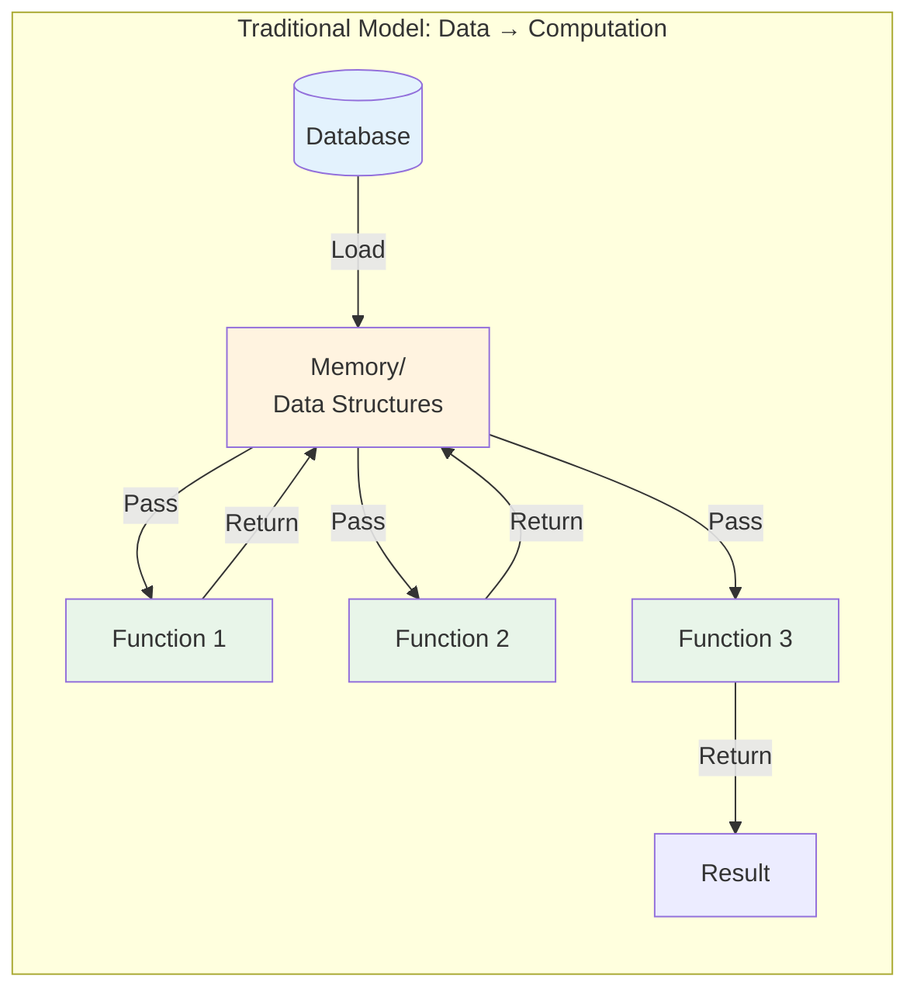
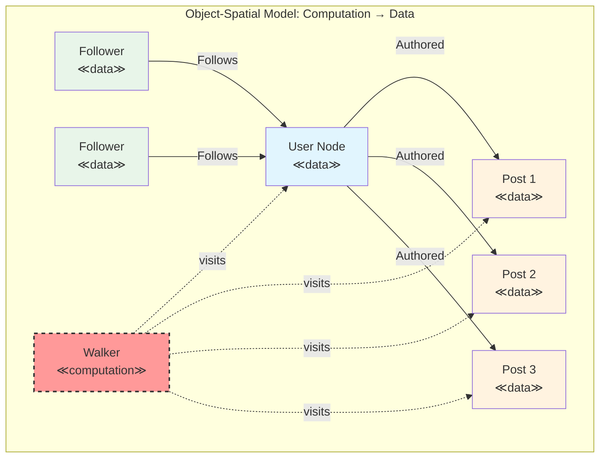
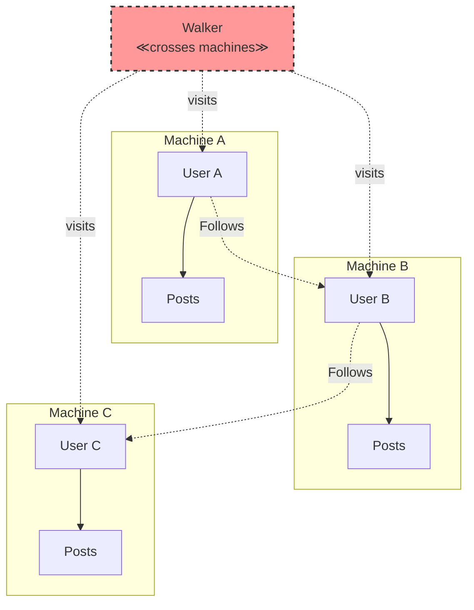

### Chapter 6: Introduction to Object-Spatial Concepts

Welcome to the heart of what makes Jac revolutionary. In this chapter, we'll explore Object-Spatial Programming (OSP), a paradigm that fundamentally changes how we think about and structure computation. If you've ever felt that traditional programming models don't naturally express the interconnected, graph-like nature of modern applications, you're about to discover a better way.

#### 6.1 The Paradigm Shift

### Traditional: Moving Data to Functions

In traditional programming, we've always moved data to computation. This model is so ingrained that we rarely question it:

```python
# Traditional Python - Data moves to functions
def calculate_social_influence(user_data, follower_data, post_data):
    influence_score = len(follower_data) * 0.3
    engagement_rate = sum(p['likes'] for p in post_data) / len(post_data)
    return influence_score + engagement_rate * 0.7

# Gather all data first
user = load_user(user_id)
followers = load_followers(user_id)  # Potentially huge dataset
posts = load_posts(user_id)        # More data movement

# Then pass to function
score = calculate_social_influence(user, followers, posts)
```

This approach has fundamental limitations:

1. **Data Movement Overhead**: We load entire datasets into memory
2. **Loss of Context**: Functions don't know where data came from
3. **Artificial Separation**: Data and its processing logic are disconnected
4. **Poor Locality**: Related data may be scattered across memory



### Object-Spatial: Moving Computation to Data

Object-Spatial Programming inverts this relationship. Instead of bringing data to functions, we send computation to where data lives:

```jac
// Jac - Computation moves to data
walker CalculateInfluence {
    has influence_score: float = 0.0;
    has engagement_total: float = 0.0;
    has post_count: int = 0;

    can calculate with User entry {
        // Computation happens AT the user node
        self.influence_score = len([<--:Follows:]) * 0.3;

        // Visit posts without loading them all
        visit [-->:Authored:];
    }

    can calculate with Post entry {
        // Computation happens AT each post
        self.engagement_total += here.likes;
        self.post_count += 1;
    }

    can finalize with User exit {
        // Back at user node to finalize
        if self.post_count > 0 {
            engagement_rate = self.engagement_total / self.post_count;
            self.influence_score += engagement_rate * 0.7;
        }
        report self.influence_score;
    }
}
```



### Real-World Analogies and Use Cases

The Object-Spatial paradigm mirrors how we naturally think about many real-world scenarios:

##### 1. **The Inspector Analogy**
Imagine a quality inspector in a factory:
- Traditional: Bring all products to the inspector's office
- Object-Spatial: Inspector walks through the factory, examining products where they are

```jac
walker QualityInspector {
    has defects_found: list = [];

    can inspect with ProductionLine entry {
        print(f"Inspecting line: {here.name}");
        visit [-->:Contains:];  // Walk to products on this line
    }

    can inspect with Product entry {
        if here.quality_score < 0.95 {
            self.defects_found.append({
                "product": here.id,
                "score": here.quality_score,
                "line": here[<--:Contains:][0].name
            });
        }
    }
}
```

##### 2. **The Social Network**
People don't physically move to a central location to interact:

```jac
walker ViralContentTracker {
    has content: Post;
    has reach: int = 0;
    has depth: int = 0;
    has max_depth: int = 3;

    can track with User entry {
        self.reach += 1;

        if self.depth < self.max_depth {
            // Content spreads through network
            self.depth += 1;
            visit [-->:Follows:] where (
                ?interested_in(here, self.content.topic)
            );
            self.depth -= 1;
        }
    }
}
```

##### 3. **The Delivery System**
Packages move through a network of locations:

```jac
walker PackageDelivery {
    has package_id: str;
    has destination: Location;
    has route: list = [];

    can deliver with Location entry {
        self.route.append(here);

        if here == self.destination {
            here.receive_package(self.package_id);
            report "Delivered!";
            disengage;
        }

        // Find next hop
        next_hop = here.get_next_hop(self.destination);
        if next_hop {
            visit next_hop;
        } else {
            report "No route found!";
            disengage;
        }
    }
}
```

### Benefits of the Paradigm Shift

##### 1. **Natural Problem Modeling**
Many problems are inherently graph-like:
- Social networks
- Transportation systems
- Organizational hierarchies
- Biological systems
- Computer networks
- Supply chains

##### 2. **Improved Locality**
Computation happens where data lives:
```jac
// Traditional: Load all data
recommendations = []
for user in all_users:  # Load millions of users
    for friend in user.friends:  # Load all friends
        for post in friend.posts:  # Load all posts
            if matches_interests(user, post):
                recommendations.append(post)

// Object-Spatial: Process in place
walker RecommendationEngine {
    has user_interests: list;
    has recommendations: list = [];

    can find with User entry {
        self.user_interests = here.interests;
        visit [-->:Follows:];  # Only visit friends
    }

    can find with User entry via Follows {
        // At friend node, check recent posts
        for post in [-->:Authored:][0:10] {  # Only recent posts
            if self.matches_interests(post) {
                self.recommendations.append(post);
            }
        }
    }
}
```

##### 3. **Distributed-Ready**
The paradigm naturally extends across machines:



#### 6.2 Core Archetypes

### Nodes: Data Locations with Computation

Nodes are the fundamental data containers in OSP, but unlike traditional objects, they're aware of their position in the topology and can respond to visitors:

```jac
node UserProfile {
    has username: str;
    has bio: str;
    has joined_date: str;
    has reputation: int = 0;

    // Node ability - triggered by walker visits
    can update_reputation with ReputationCalculator entry {
        old_rep = self.reputation;
        self.reputation = visitor.calculate_for(self);

        if self.reputation > old_rep {
            print(f"{self.username} gained {self.reputation - old_rep} reputation!");
        }
    }

    // Nodes can have regular methods too
    can get_account_age() -> int {
        import:py from datetime import datetime;
        joined = datetime.fromisoformat(self.joined_date);
        return (datetime.now() - joined).days;
    }
}
```

Key characteristics of nodes:
1. **Persistent by Connection**: Connect to `root` for automatic persistence
2. **Location-Aware**: Know their connections and position
3. **Reactive**: Respond to walker visits with abilities
4. **Stateful**: Maintain data between visits

### Edges: First-Class Relationships

Edges aren't just connections—they're full objects with behavior:

```jac
edge Friendship {
    has since: str;
    has strength: float = 1.0;
    has interaction_count: int = 0;

    // Edges can have abilities too!
    can strengthen with SocialInteraction entry {
        self.interaction_count += 1;
        self.strength = min(10.0, self.strength * 1.1);

        print(f"Friendship strengthened to {self.strength:.1f}");
    }

    // Regular methods
    can get_duration_days() -> int {
        import:py from datetime import datetime;
        start = datetime.fromisoformat(self.since);
        return (datetime.now() - start).days;
    }
}

edge Follows {
    has notifications: bool = true;
    has categories: list[str] = [];

    can should_notify(post_category: str) -> bool {
        return self.notifications and (
            not self.categories or
            post_category in self.categories
        );
    }
}
```

Why edges as first-class objects matter:
1. **Rich Relationships**: Model complex relationship properties
2. **Relationship Evolution**: Relationships can change over time
3. **Traversal Control**: Filter traversals based on edge properties
4. **Behavioral Relationships**: Edges can have their own logic

### Walkers: Mobile Computational Entities

Walkers are the "programs" of OSP—they move through the graph executing computation:

```jac
walker DataAggregator {
    // Walker state - travels with the walker
    has totals: dict = {};
    has visit_count: int = 0;
    has max_depth: int = 3;
    has current_depth: int = 0;

    // Entry ability for Department nodes
    can aggregate with Department entry {
        dept_name = here.name;
        dept_total = here.budget;

        // Aggregate sub-departments
        if self.current_depth < self.max_depth {
            self.current_depth += 1;
            visit [-->:Contains:];
            self.current_depth -= 1;
        }

        // Store results
        if dept_name not in self.totals {
            self.totals[dept_name] = 0;
        }
        self.totals[dept_name] += dept_total;
        self.visit_count += 1;
    }

    // Exit ability - cleanup or final processing
    can summarize with Department exit {
        if self.current_depth == 0 {  // Back at starting node
            print(f"Visited {self.visit_count} departments");
            print(f"Totals: {self.totals}");
        }
    }
}
```

Walker characteristics:
1. **Stateful**: Carry data as they traverse
2. **Reactive**: Different behavior for different node/edge types
3. **Autonomous**: Make traversal decisions based on discoveries
4. **Composable**: Multiple walkers can work together

### How They Extend Traditional OOP

Traditional OOP gives us encapsulation and inheritance. OSP adds:

1. **Topology**: Objects know their relationships
2. **Mobility**: Computation can move between objects
3. **Reactivity**: Objects respond to computational visitors
4. **Distribution**: Natural support for distributed systems

```mermaid
graph TD
    subgraph "Traditional OOP"
        O1[Object]
        O2[Object]
        O3[Object]
        M1[method()]
        M2[method()]
        M3[method()]

        O1 --> M1
        O2 --> M2
        O3 --> M3
    end

    subgraph "Object-Spatial"
        N1[Node]
        N2[Node]
        N3[Node]
        E1[Edge]
        E2[Edge]
        W[Walker]

        N1 ---|E1| N2
        N2 ---|E2| N3
        W -.->|visits| N1
        W -.->|visits| N2
        W -.->|visits| N3
    end

    style O1 fill:#e3f2fd
    style O2 fill:#e3f2fd
    style O3 fill:#e3f2fd
    style N1 fill:#e8f5e9
    style N2 fill:#e8f5e9
    style N3 fill:#e8f5e9
    style E1 fill:#fff3e0
    style E2 fill:#fff3e0
    style W fill:#ff9999
```

### Complete Example: Task Management System

Let's see all archetypes working together:

```jac
// Nodes represent data locations
node Project {
    has name: str;
    has deadline: str;
    has status: str = "active";

    can update_status with StatusUpdater entry {
        old_status = self.status;
        self.status = visitor.new_status;
        print(f"Project {self.name}: {old_status} → {self.status}");
    }
}

node Task {
    has title: str;
    has completed: bool = false;
    has estimated_hours: float;
    has actual_hours: float = 0.0;

    can mark_complete with TaskCompleter entry {
        self.completed = true;
        self.actual_hours = visitor.hours_spent;
        visitor.tasks_completed += 1;
    }
}

node Developer {
    has name: str;
    has skills: list[str];
    has capacity: float = 40.0;  // hours per week
}

// Edges represent relationships
edge Contains {
    has created_at: str;
}

edge AssignedTo {
    has assigned_date: str;
    has priority: int = 5;

    can is_overdue() -> bool {
        // Check if task is overdue based on project deadline
        task = self.target;
        project = task[<--:Contains:][0];
        return not task.completed and now() > project.deadline;
    }
}

// Walkers perform computations
walker ProjectAnalyzer {
    has total_tasks: int = 0;
    has completed_tasks: int = 0;
    has total_hours: float = 0.0;
    has overdue_tasks: list = [];

    can analyze with Project entry {
        print(f"Analyzing project: {here.name}");
        visit [-->:Contains:];
    }

    can analyze with Task entry {
        self.total_tasks += 1;

        if here.completed {
            self.completed_tasks += 1;
            self.total_hours += here.actual_hours;
        }

        // Check assignments
        for assignment in [-->:AssignedTo:] {
            if assignment.is_overdue() {
                self.overdue_tasks.append({
                    "task": here.title,
                    "developer": assignment.target.name
                });
            }
        }
    }

    can report with Project exit {
        completion_rate = (self.completed_tasks / self.total_tasks * 100)
                         if self.total_tasks > 0 else 0;

        report {
            "project": here.name,
            "total_tasks": self.total_tasks,
            "completed": self.completed_tasks,
            "completion_rate": f"{completion_rate:.1f}%",
            "total_hours": self.total_hours,
            "overdue": self.overdue_tasks
        };
    }
}

// Using it all together
with entry {
    // Create project structure
    web_project = Project(
        name="Website Redesign",
        deadline="2024-12-31"
    );
    root ++> web_project;

    // Add tasks
    task1 = web_project ++>:Contains:++> Task(
        title="Design Homepage",
        estimated_hours=20
    );

    task2 = web_project ++>:Contains:++> Task(
        title="Implement Backend",
        estimated_hours=40
    );

    // Assign to developers
    alice = root ++> Developer(
        name="Alice",
        skills=["design", "frontend"]
    );

    bob = root ++> Developer(
        name="Bob",
        skills=["backend", "database"]
    );

    task1 ++>:AssignedTo(priority=8):++> alice;
    task2 ++>:AssignedTo(priority=9):++> bob;

    // Analyze the project
    analyzer = ProjectAnalyzer();
    result = analyzer spawn web_project;
    print(result);
}
```

### Why This Matters

The Object-Spatial approach provides:

1. **Natural Modeling**: The code structure mirrors the problem domain
2. **Separation of Concerns**: Data (nodes), relationships (edges), and algorithms (walkers) are clearly separated
3. **Reusability**: Walkers can traverse any compatible graph structure
4. **Scalability**: The same code works for 10 nodes or 10 million
5. **Maintainability**: Changes to structure don't break algorithms

In the next chapters, we'll dive deeper into building and traversing these graph structures, exploring the full power of Object-Spatial Programming.

### Summary

In this chapter, we've introduced the revolutionary concepts of Object-Spatial Programming:

- **The Paradigm Shift**: From moving data to computation → moving computation to data
- **Nodes**: Data locations that can react to visitors
- **Edges**: First-class relationships with properties and behavior
- **Walkers**: Mobile computational entities that traverse and process

This isn't just a new syntax—it's a fundamentally different way of thinking about program structure that aligns with how we naturally model interconnected systems. Next, we'll get hands-on with building your first graph structures in Jac.