### Chapter 7: Building Your First Graph

Now that you understand the conceptual foundations of Object-Spatial Programming, let's get hands-on and build real graph structures. In this chapter, you'll learn how to create nodes and edges, connect them into meaningful topologies, and perform basic graph operations that form the foundation of OSP applications.

#### 7.1 Creating Nodes and Edges

### Node Declaration and Instantiation

Let's start with the basics of creating nodes. Unlike traditional objects, nodes are designed to exist within a graph topology:

```jac
// Simple node declaration
node Person {
    has name: str;
    has email: str;
    has age: int;
}

// Creating node instances
with entry {
    // Standalone node (not persistent)
    let alice = Person(
        name="Alice Johnson",
        email="alice@example.com",
        age=28
    );

    // Connected to root (persistent)
    let bob = root ++> Person(
        name="Bob Smith",
        email="bob@example.com",
        age=32
    );

    // Alternative: create then connect
    let charlie = Person(
        name="Charlie Brown",
        email="charlie@example.com",
        age=25
    );
    root ++> charlie;  // Now persistent
}
```

### Understanding Node Persistence

```mermaid
graph TD
    R[root<br/>≪persistent≫]
    A[Alice<br/>≪temporary≫]
    B[Bob<br/>≪persistent≫]
    C[Charlie<br/>≪persistent≫]

    R --> B
    R --> C

    style R fill:#4caf50,color:white
    style A fill:#ffcdd2
    style B fill:#c8e6c9
    style C fill:#c8e6c9
```



Nodes connected to `root` (directly or indirectly) persist between program runs:

```jac
// First run - create data
with entry {
    print("Creating user profiles...");

    let user1 = root ++> Person(
        name="User One",
        email="user1@example.com",
        age=30
    );
}

// Second run - data still exists!
with entry {
    let users = root[-->:Person:];
    print(f"Found {len(users)} existing users");

    for user in users {
        print(f"- {user.name} ({user.email})");
    }
}
```

### Connecting Nodes with Edges

Edges represent relationships between nodes. They can be simple connections or rich objects with properties:

```jac
// Simple edge creation
node City {
    has name: str;
    has population: int;
    has country: str;
}

with entry {
    let nyc = root ++> City(
        name="New York",
        population=8_336_000,
        country="USA"
    );

    let london = root ++> City(
        name="London",
        population=9_002_000,
        country="UK"
    );

    // Simple connection (unnamed edge)
    nyc ++> london;  // NYC connects to London
}
```

### Edge Types and Properties

Edges can have types and properties, making relationships first-class citizens:

```jac
// Typed edge with properties
edge Flight {
    has airline: str;
    has flight_number: str;
    has departure_time: str;
    has duration_hours: float;
    has price: float;

    can is_red_eye() -> bool {
        hour = int(self.departure_time.split(":")[0]);
        return hour >= 22 or hour <= 5;
    }
}

with entry {
    let lax = root ++> City(name="Los Angeles", population=4_000_000, country="USA");
    let jfk = root ++> City(name="New York", population=8_336_000, country="USA");

    // Create typed edge with properties
    lax ++>:Flight(
        airline="United",
        flight_number="UA123",
        departure_time="23:45",
        duration_hours=5.5,
        price=450.00
    ):++> jfk;

    // Another flight
    jfk ++>:Flight(
        airline="JetBlue",
        flight_number="B6456",
        departure_time="06:30",
        duration_hours=6.0,
        price=380.00
    ):++> lax;
}
```

### Graph Construction Patterns

Let's build a more complex example - a social network:

```jac
// Node types for social network
node User {
    has username: str;
    has full_name: str;
    has bio: str = "";
    has joined_date: str;
    has verified: bool = false;
}

node Post {
    has content: str;
    has created_at: str;
    has likes: int = 0;
    has views: int = 0;
}

node Comment {
    has text: str;
    has created_at: str;
    has edited: bool = false;
}

// Edge types
edge Follows {
    has since: str;
    has notifications: bool = true;
}

edge Authored {
    has device: str = "unknown";
}

edge Likes {
    has timestamp: str;
}

edge CommentedOn {
    has timestamp: str;
}

// Build the social network
with entry {
    import:py from datetime import datetime;

    // Create users
    let alice = root ++> User(
        username="alice_dev",
        full_name="Alice Johnson",
        bio="Software engineer and coffee enthusiast",
        joined_date="2024-01-15",
        verified=true
    );

    let bob = root ++> User(
        username="bob_designer",
        full_name="Bob Smith",
        bio="UI/UX Designer | Digital Artist",
        joined_date="2024-02-20"
    );

    let charlie = root ++> User(
        username="charlie_data",
        full_name="Charlie Brown",
        bio="Data Scientist | ML Enthusiast",
        joined_date="2024-03-10"
    );

    // Create follow relationships
    alice ++>:Follows(since="2024-02-21"):++> bob;
    bob ++>:Follows(since="2024-02-22", notifications=false):++> alice;
    charlie ++>:Follows(since="2024-03-11"):++> alice;
    charlie ++>:Follows(since="2024-03-12"):++> bob;

    // Alice creates a post
    let post1 = alice ++>:Authored(device="mobile"):++> Post(
        content="Just discovered Jac's Object-Spatial Programming! 🚀",
        created_at=datetime.now().isoformat(),
        views=150
    );

    // Bob likes and comments
    bob ++>:Likes(timestamp=datetime.now().isoformat()):++> post1;
    post1.likes += 1;

    let comment1 = bob ++>:Authored:++> Comment(
        text="This looks amazing! Can't wait to try it out.",
        created_at=datetime.now().isoformat()
    );
    comment1 ++>:CommentedOn(timestamp=datetime.now().isoformat()):++> post1;

    // Charlie also interacts
    charlie ++>:Likes(timestamp=datetime.now().isoformat()):++> post1;
    post1.likes += 1;

    print("Social network created successfully!");
}
```

### Visualizing the Graph Structure

```mermaid
graph LR
    subgraph Users
        A[alice_dev<br/>≪User≫]
        B[bob_designer<br/>≪User≫]
        C[charlie_data<br/>≪User≫]
    end

    subgraph Content
        P1[Post: Jac Discovery<br/>≪Post≫]
        CM1[Comment<br/>≪Comment≫]
    end

    A -->|Follows| B
    B -->|Follows| A
    C -->|Follows| A
    C -->|Follows| B

    A -->|Authored| P1
    B -->|Authored| CM1
    B -->|Likes| P1
    C -->|Likes| P1
    CM1 -->|CommentedOn| P1

    style A fill:#e3f2fd
    style B fill:#e3f2fd
    style C fill:#e3f2fd
    style P1 fill:#fff3e0
    style CM1 fill:#f3e5f5
```



#### 7.2 Basic Graph Operations

### Navigating with Edge References (`[-->]`, `[<--]`)

Jac provides intuitive syntax for graph navigation:

```jac
walker SocialAnalyzer {
    can analyze with User entry {
        // Get all outgoing edges (who this user follows)
        let following = [-->];
        print(f"{here.username} follows {len(following)} users");

        // Get all incoming edges (who follows this user)
        let followers = [<--];
        print(f"{here.username} has {len(followers)} followers");

        // Get specific edge types
        let follow_edges = [-->:Follows:];
        let authored_content = [-->:Authored:];

        print(f"  - Following: {len(follow_edges)}");
        print(f"  - Posts/Comments: {len(authored_content)}");

        // Navigate to connected nodes
        let followed_users = [-->:Follows:-->];
        for user in followed_users {
            print(f"  → {user.username}");
        }
    }
}

with entry {
    // Spawn analyzer on each user
    for user in root[-->:User:] {
        spawn SocialAnalyzer() on user;
        print("---");
    }
}
```

### Edge Reference Syntax Patterns

```jac
// Basic navigation patterns
let outgoing = [-->];           // All outgoing edges
let incoming = [<--];           // All incoming edges
let bidirectional = [<-->];     // All edges (in or out)

// Typed navigation
let follows_out = [-->:Follows:];              // Outgoing Follows edges
let follows_in = [<--:Follows:];               // Incoming Follows edges
let all_follows = [<-->:Follows:];             // All Follows edges

// Navigate to nodes through edges
let following = [-->:Follows:-->];             // Nodes I follow
let followers = [<--:Follows:-->];             // Nodes following me
let friends = [<-->:Follows:-->];              // All connected via Follows

// Multi-hop navigation
let friends_of_friends = [-->:Follows:-->:Follows:-->];

// Navigate to specific node types
let my_posts = [-->:Authored:-->:Post:];       // Only Post nodes
let my_comments = [-->:Authored:-->:Comment:]; // Only Comment nodes
```

### Filtering Edges and Nodes

Jac provides powerful filtering capabilities:

```jac
walker ContentFilter {
    can find_popular with User entry {
        // Filter by edge properties
        let recent_follows = [-->:Follows:(?.since > "2024-01-01"):];

        // Filter by node properties
        let popular_posts = [-->:Authored:-->:Post:(?.likes > 10):];

        // Complex filters
        let verified_followers = [<--:Follows:-->:User:(?.verified == true):];

        // Filter with null safety (?)
        let active_users = [-->:Follows:-->:User:(?len(.bio) > 0):];

        print(f"User {here.username}:");
        print(f"  Recent follows: {len(recent_follows)}");
        print(f"  Popular posts: {len(popular_posts)}");
        print(f"  Verified followers: {len(verified_followers)}");
    }
}
```

### Type-Safe Graph Operations

```jac
// Define specific node types
node Admin(User) {
    has permissions: list[str] = ["read", "write", "delete"];
}

node RegularUser(User) {
    has subscription: str = "free";
}

walker TypedNavigator {
    can navigate with entry {
        // Get only Admin nodes
        let admins = [-->`Admin];

        // Get only RegularUser nodes
        let regular_users = [-->`RegularUser];

        // Type-specific operations
        for admin in admins {
            print(f"Admin {admin.username} has permissions: {admin.permissions}");
        }

        // Combined type and property filtering
        let premium_users = [-->`RegularUser:(?.subscription == "premium"):];
    }
}
```

### Graph Modification Operations

```jac
walker GraphModifier {
    has new_connections: int = 0;
    has removed_connections: int = 0;

    can modify with User entry {
        // Add new connections
        let potential_friends = self.find_potential_friends(here);

        for friend in potential_friends {
            if not self.already_connected(here, friend) {
                here ++>:Follows(since=now()):++> friend;
                self.new_connections += 1;
            }
        }

        // Remove old connections
        let old_follows = [-->:Follows:(?.since < "2023-01-01"):];
        for edge in old_follows {
            del edge;  // Remove the edge
            self.removed_connections += 1;
        }
    }

    can already_connected(user1: User, user2: User) -> bool {
        let connections = user1[-->:Follows:-->];
        return user2 in connections;
    }

    can find_potential_friends(user: User) -> list[User] {
        // Friends of friends who aren't already connected
        let friends = user[-->:Follows:-->];
        let potential = [];

        for friend in friends {
            let fof = friend[-->:Follows:-->];
            for candidate in fof {
                if candidate != user and not self.already_connected(user, candidate) {
                    potential.append(candidate);
                }
            }
        }

        return potential[0:5];  // Limit to 5 suggestions
    }
}
```

### Advanced Navigation Patterns

```jac
// Breadth-first search pattern
walker BreadthFirstSearch {
    has target_username: str;
    has visited: set = {};
    has found: bool = false;
    has path: list = [];

    can search with User entry {
        if here.username == self.target_username {
            self.found = true;
            self.path.append(here.username);
            report self.path;
            disengage;
        }

        if here in self.visited {
            skip;  // Already visited this node
        }

        self.visited.add(here);
        self.path.append(here.username);

        // Visit all connected users
        visit [-->:Follows:-->];

        // Backtrack if not found
        self.path.pop();
    }
}

// Depth-limited search
walker DepthLimitedExplorer {
    has max_depth: int = 3;
    has current_depth: int = 0;
    has discovered: list = [];

    can explore with User entry {
        if self.current_depth >= self.max_depth {
            return;  // Don't go deeper
        }

        self.discovered.append({
            "user": here.username,
            "depth": self.current_depth
        });

        // Go deeper
        self.current_depth += 1;
        visit [-->:Follows:-->];
        self.current_depth -= 1;
    }
}
```

### Graph Metrics and Analysis

```jac
walker GraphMetrics {
    has node_count: int = 0;
    has edge_count: int = 0;
    has node_types: dict = {};
    has edge_types: dict = {};

    can analyze with entry {
        // Count all nodes
        let all_nodes = [-->*];  // * means all reachable
        self.node_count = len(all_nodes);

        // Count by type
        for node in all_nodes {
            node_type = type(node).__name__;
            if node_type not in self.node_types {
                self.node_types[node_type] = 0;
            }
            self.node_types[node_type] += 1;

            // Count edges from this node
            for edge in node[-->] {
                edge_type = type(edge).__name__;
                if edge_type not in self.edge_types {
                    self.edge_types[edge_type] = 0;
                }
                self.edge_types[edge_type] += 1;
                self.edge_count += 1;
            }
        }

        report {
            "total_nodes": self.node_count,
            "total_edges": self.edge_count,
            "node_types": self.node_types,
            "edge_types": self.edge_types
        };
    }
}
```

### Practical Example: Building a Recommendation System

Let's combine everything to build a simple recommendation system:

```jac
node Movie {
    has title: str;
    has genre: str;
    has year: int;
    has rating: float;
}

edge Watched {
    has rating: int;  // User's rating (1-5)
    has date: str;
}

edge Similar {
    has similarity_score: float;
}

walker MovieRecommender {
    has user_profile: dict = {};
    has recommendations: list = [];
    has visited_movies: set = {};

    can analyze with User entry {
        print(f"Building recommendations for {here.username}...");

        // Analyze user's watching history
        let watched_movies = [-->:Watched:-->:Movie:];

        for movie in watched_movies {
            if movie.genre not in self.user_profile {
                self.user_profile[movie.genre] = {"count": 0, "avg_rating": 0.0};
            }

            let edge = here[-->:Watched:][0];  // Get the edge
            self.user_profile[movie.genre]["count"] += 1;
            self.user_profile[movie.genre]["avg_rating"] += edge.rating;

            self.visited_movies.add(movie);
        }

        // Calculate average ratings per genre
        for genre, data in self.user_profile.items() {
            data["avg_rating"] /= data["count"];
        }

        // Find movies to recommend
        visit watched_movies;
    }

    can explore with Movie entry {
        // Find similar movies
        let similar_movies = [-->:Similar:-->:Movie:];

        for movie in similar_movies {
            if movie not in self.visited_movies {
                // Score based on user preferences
                score = 0.0;
                if movie.genre in self.user_profile {
                    score = self.user_profile[movie.genre]["avg_rating"];
                    score *= movie.rating / 5.0;  // Weight by movie rating
                }

                if score > 3.0 {  // Threshold
                    self.recommendations.append({
                        "movie": movie.title,
                        "genre": movie.genre,
                        "score": score
                    });
                }
            }
        }
    }

    can finalize with User exit {
        // Sort and limit recommendations
        self.recommendations.sort(key=lambda x: x["score"], reverse=true);

        print(f"\nTop recommendations for {here.username}:");
        for i, rec in enumerate(self.recommendations[:5]) {
            print(f"{i+1}. {rec['movie']} ({rec['genre']}) - Score: {rec['score']:.2f}");
        }
    }
}

// Build movie database
with entry {
    // Create movies
    let inception = root ++> Movie(
        title="Inception",
        genre="Sci-Fi",
        year=2010,
        rating=4.8
    );

    let interstellar = root ++> Movie(
        title="Interstellar",
        genre="Sci-Fi",
        year=2014,
        rating=4.6
    );

    let dark_knight = root ++> Movie(
        title="The Dark Knight",
        genre="Action",
        year=2008,
        rating=4.9
    );

    // Create similarities
    inception ++>:Similar(similarity_score=0.85):++> interstellar;
    inception ++>:Similar(similarity_score=0.60):++> dark_knight;

    // Create user and watch history
    let user = root ++> User(
        username="movie_buff",
        full_name="John Doe",
        joined_date="2024-01-01"
    );

    user ++>:Watched(rating=5, date="2024-03-01"):++> inception;
    user ++>:Watched(rating=4, date="2024-03-05"):++> dark_knight;

    // Get recommendations
    spawn MovieRecommender() on user;
}
```

### Best Practices for Graph Building

1. **Start with Clear Node Types**: Define what entities exist in your domain
2. **Model Relationships Explicitly**: Use typed edges for meaningful connections
3. **Keep Edges Lightweight**: Heavy computation belongs in nodes or walkers
4. **Use Consistent Naming**: Follow patterns like `Verb` for edges, `Noun` for nodes
5. **Think About Traversal Early**: Design your graph to support intended algorithms

### Summary

In this chapter, we've learned:

- **Node Creation**: How to create persistent and temporary nodes
- **Edge Types**: Building rich relationships with properties and behavior
- **Graph Navigation**: Using `[-->]`, `[<--]`, and filtering syntax
- **Graph Operations**: Modifying, analyzing, and traversing graph structures

We've seen how Jac's syntax makes graph operations intuitive and type-safe. The combination of expressive navigation syntax and powerful filtering capabilities enables complex graph algorithms to be expressed concisely.

Next, we'll explore walkers in depth—the mobile computational entities that bring your graphs to life by moving computation to data.