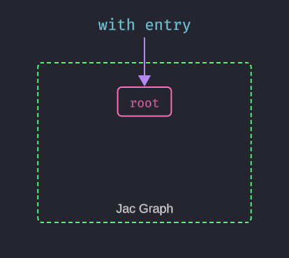
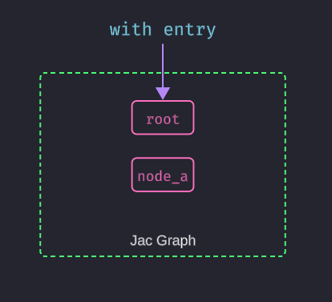
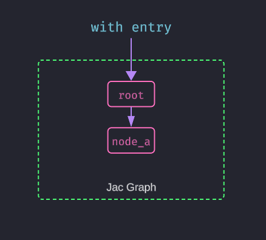
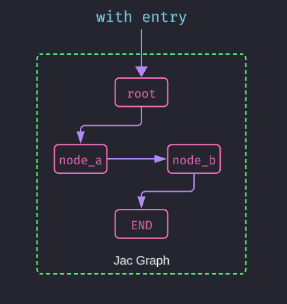

# Chapter 8: OSP Introduction and Paradigm Shift
---
So far, we have explored Jac's enhancements to familiar programming concepts. Now, we will introduce the paradigm that makes Jac truly unique, Object-Spatial Programming (OSP). This represents a fundamental shift in how we structure and execute our programs.

In traditional programming, the application logic is stationary, and data is constantly fetched from databases and other services to be processed. OSP inverts this model, it allows your computation to travel to where your data lives. This approach is more natural, efficient, and scalable for the interconnected data that defines modern AI applications.

## Journey from OOP to OSP
---
The transition from Object-Oriented Programming to Object-Spatial Programming begins with understanding how Jac perceives your program's structure.

### `with entry` vs `if __name__ == "__main__":`

In Python, the entry point of a program is typically defined by the `if __name__ == "__main__":` block. This tells the interpreter, "Start running the script from here."

Jac's `with entry` block serves a similar purpose but has a deeper, more powerful meaning. It isn't just starting a script, it is your moment of entry into a persistent, spatial environment. Think of it as opening the door to a workshop. When your program starts, this workshop is not empty; it contains a single, special starting point: the `root` node. We're entering the root of a global graph structure that we can build upon and traverse.

{ width=350px }

`with entry` marks your entry point into the program's graph. This graph initially contains only the root node, which serves as the anchor for everything you will build.


Everything you create and connect within this graph space can be persisted, traversed, and reasoned about spatially.

### Creating a Node and adding it to the Graph

When the `with entry` block is executed, it creates a root node in the Jac graph. From there, we can add nodes` and `edges` to build our data structure. Lets look at an example of creating a simple node using Jac's syntax:

```jac
node Node{
    has name: str;
}

with entry {
    node_a = Node(name="A");
}
```
<br />

{ width=350px }


Here, we define a node using the `node` keyword, which is similar to defining a class in traditional OOP. The `has` keyword declares properties for the node, and we create an instance of this node within the `with entry` block.

### Connecting Nodes with Edges

When the entry point is executed, it creates a root node on the Jac graph, which can be accessed using the `root` variable. This root node serves as the starting point for the program's graph structure, enabling traversal and manipulation of connected nodes.

In the example above, we create a new node `node_a` with the name "A". However, this node is not automatically part of the graph—it exists in isolation. To incorporate it into the graph, we need to connect it to an existing node using an `edge`.

This is where the `++>` operator comes in. It creates a directional edge from the root node to `node_a`, effectively linking the two and adding `node_a` into the graph.

```jac
node Node{
    has name: str;
}

with entry {
    node_a = Node(name="A");
    root ++> node_a;  # Add node_a to the root graph
}
```
<br />

{ width=350px }


### Building out the rest of the Graph

Now that we have a basic understanding of nodes and edges, let's add a few more nodes and edges to create a more complex graph structure. We'll introduce a second node and connect it to the first one:

```jac
node Node{
    has name: str;
}

with entry {
    node_a = Node(name="A");
    node_b = Node(name="B");

    root ++> node_a;  # Add node_a to the root graph
    node_a ++> node_b;  # Connect node_a to node_b
}
```
<br />

Next let's define a terminal node that will represent the end of our graph traversal. This node will not have any outgoing edges, indicating that it is a leaf node in our graph structure:

```jac
node EndNode {}
glob END = EndNode();  # Create a global end node
```
<br />

Now we can connect our nodes to this end node, creating a complete graph structure:
```jac
node Node{
    has name: str;
}
node EndNode {}
glob END = EndNode();

with entry {
    node_a = Node(name="A");
    node_b = Node(name="B");

    root ++> node_a;  # Add node_a to the root graph
    node_a ++> node_b;  # Connect node_a to node_b
    node_b ++> END;  # Connect node_b to the end node
}
```
<br />

{ width=350px }

## From "Data to Computation" to "Computation to Data"


### Walking the Graph

In Object-Oriented Programming, your objects are stationary. You call a method on an object, and the logic executes within that object's context.

One of the core innovations of Object-Spatial Programming (OSP) is the concept of **walkers**. A walker is a mobile unit of computation that you design to travel through your graph, moving from node to node along the edges that connect them. Instead of pulling data to your logic, a walker brings your logic directly to the data.

Walkers operate **locally**, performing actions at each node or edge they encounter. This enables a more natural and efficient way to process distributed data, especially in systems modeled as networks, hierarchies, or flows.


Walkers are more than simple graph crawlers. Because they are a subtype of the `object` archetype, they can,

- Maintain State: A walker can have its own attributes (has fields) to store information it collects during its journey.
- Execute Logic: A walker has methods (can abilities) that are automatically triggered when it "lands on" a specific type of node or edge.
- Make Decisions: Based on the data it finds at its current location, a walker can decide where to go next.

This paradigm shift—from centralized logic to distributed, mobile computation—is what makes OSP so powerful for modeling complex, real-world systems.


Getting back to our graph structure, lets define a simple walker that will traverse our graph and gather the names of the nodes it visits. When it reaches the terminal node, it will stop and return the collected names as a string:

First, we need to enhance our graph with a starting and ending point.

```jac
node Node {
    has name: str;
}

# A special node to mark the end of a path.
node EndNode {}

# Our full graph structure
with entry {
    # Spawn nodes and attach them to the graph.
    node_a = root ++> Node(name="A");
    node_b = node_a ++> Node(name="B");
    node_c = node_b ++> Node(name="C");
    end_node = node_c ++> EndNode(); # The path ends here.
}
```

Next we define our walker archetype, that has a `input` field to store the names of the nodes it visits:
```jac
walker PathWalker {
    has input: str;
}

walker PathWalker {
    has input: str;

    # 1. The starting point for the walker's journey.
    can start with `root entry {
        # Start visiting nodes connected to the root.
        visit [-->];
    }

    # 2. This ability triggers every time the walker lands on a 'Node'.
    can visit_node with Node entry {
        # 'here' refers to the node the walker is currently on.
        self.input += ", visiting " + here.name;  # Append node name to input
        # Continue to the next node in the path.
        visit [-->];
    }

    # 3. This ability triggers when the walker reaches the 'EndNode'.
    can visit_end with EndNode entry {
        self.input += ", reached the end";  # Append end message
        return;  # Stop visiting
    }
}
```
<br />

### The `visit` Statement and `-->` Syntax

To understand how walkers move through the graph, it's important to break down the `visit` statement and the `-->` operator used in the example above.

In Jac, visit tells the walker to continue its traversal along the graph. What makes this powerful is the use of edge selectors inside the square brackets, like `[-->]`, which control how and where the walker moves.

The `-->` symbol represents a forward edge in the graph—specifically, an edge from the current node (`here`) to any of its connected child nodes. So when you write visit `[-->];`, you're instructing the walker to follow all outgoing edges from the current node to the next set of reachable nodes.

Let's walk through what each part means:

- `visit [-->];`: Move the walker along all forward edges from the current node.
- `visit [<--];`: Move backward (along incoming edges), useful for reverse traversals or backtracking.
- `visit [-->-->];`: Move along two forward edges in succession, allowing for deeper traversal into the graph.

Jac supports more complex edge selectors as well which we'll explore in subsequent chapters. For now, the key takeaway is that `visit` combined with edge selectors allows walkers to navigate the graph structure dynamically, processing nodes and edges as they go.


### Putting it All Together

Lets put everything together in a complete example that demonstrates how to create a graph, define a walker, and run it to collect node names:

```jac
node Node{
    has name: str;
}

node EndNode {}
glob END = EndNode();

walker PathWalker {
    has input: str;

    can start with `root entry {
        visit [-->];
    }

    can visit_node  with Node entry{
        self.input += ", visiting " + here.name;
        visit [here-->];
    }

    can visit_end with EndNode entry {
        self.input += ", reached the end";
        return;
    }
}

with entry {
    root ++> Node(name="A")
         ++> Node(name="B")
         ++> END;

    my_walker = PathWalker(input="Start walking") spawn root;

    print(my_walker.input);
}
```
<br />

```bash
$ jac run path_walker.jac
Start walking, visiting A, visiting B, reached the end
```
<br />


## Wrapping Up

In this chapter, we've introduced the core concepts of Object-Spatial Programming (OSP) and how it differs from traditional object-oriented programming. We've seen how Jac allows us to define nodes and edges, create walkers, and traverse graphs in a way that naturally reflects the relationships between data.


## Key Takeaways


- **Computation to data**: Move processing to where data naturally lives
- **Spatial relationships**: Model connections as first-class graph structures
- **Natural representation**: Express real-world relationships directly in code
- **Distributed processing**: Each data location can be processed independently

**Core Concepts:**

- **Nodes**: Stateful entities that hold data and can react to visitors
- **Edges**: First-class relationships with their own properties and behaviors
- **Walkers**: Mobile computation that traverses and processes graph structures
- **Graph thinking**: Shift from object-oriented to relationship-oriented design

**Key Advantages:**

- **Intuitive modeling**: Problems are expressed in their natural graph form
- **Efficient processing**: Computation happens exactly where it's needed
- **Scalable architecture**: Naturally distributes across multiple nodes
- **Maintainable code**: Clear separation of data, relationships, and processing logic


!!! tip "Try It Yourself"
    Start thinking spatially by modeling:
    - Family trees with person nodes and relationship edges
    - Social networks with user connections
    - Organization charts with employee and department relationships
    - Knowledge graphs with concept connections

    Remember: OSP shines when your problem naturally involves connected data!

---

*You've now grasped the fundamental paradigm shift of OSP. Let's build the foundation with nodes and edges!*
