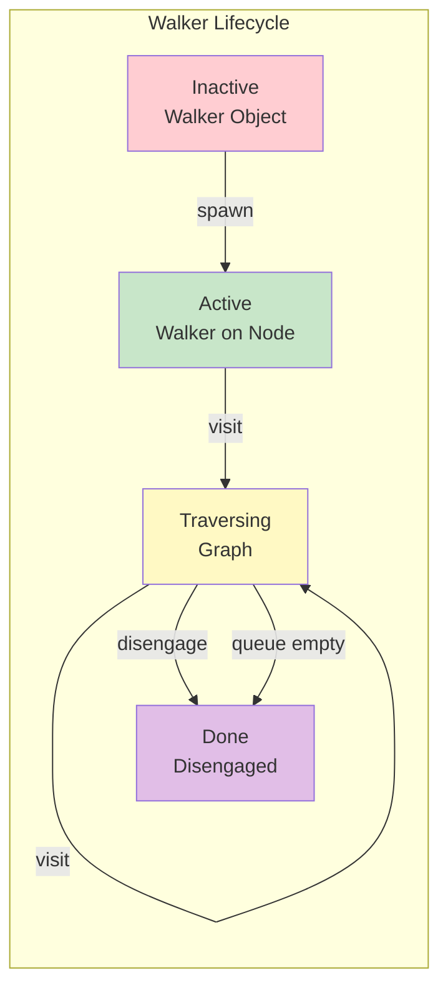

### Chapter 8: Walkers - Computation in Motion

Walkers are the beating heart of Object-Spatial Programming. They embody the paradigm shift from static functions to mobile computational entities that traverse your data graph, processing information where it lives. In this chapter, we'll master the art of creating and controlling walkers to build powerful, scalable algorithms.

#### 8.1 Walker Basics

### Declaring Walker Classes

Walkers are declared using the `walker` keyword and can contain state, abilities, and methods:

```jac
walker SimpleVisitor {
    // Walker state - travels with the walker
    has visits: int = 0;
    has path: list[str] = [];

    // Regular method
    can get_stats() -> dict {
        return {
            "total_visits": self.visits,
            "path_length": len(self.path),
            "current_path": self.path
        };
    }

    // Walker ability - triggered on node entry
    can visit_node with entry {
        self.visits += 1;
        self.path.append(here.name if hasattr(here, 'name') else str(here));
        print(f"Visit #{self.visits}: {self.path[-1]}");
    }
}
```

Key walker components:
- **State Variables** (`has`): Data that travels with the walker
- **Methods** (`can`): Regular functions for computation
- **Abilities** (`can ... with`): Event-triggered behaviors

### Spawning Walkers on Nodes

Walkers start as inactive objects and must be "spawned" to begin traversal:

```jac
node Location {
    has name: str;
    has description: str;
}

with entry {
    // Create a simple graph
    let home = root ++> Location(name="Home", description="Starting point");
    let park = home ++> Location(name="Park", description="Green space");
    let store = home ++> Location(name="Store", description="Shopping center");

    // Create walker instance (inactive)
    let visitor = SimpleVisitor();
    print(f"Walker created. Stats: {visitor.get_stats()}");

    // Spawn walker on a node (activates it)
    home spawn visitor;

    // Or use alternative syntax
    let another_visitor = SimpleVisitor();
    spawn another_visitor on home;
}
```



### The Walker Lifecycle

Understanding the walker lifecycle is crucial:

```jac
walker LifecycleDemo {
    has state: str = "created";
    has nodes_visited: list = [];

    // Called when walker is created (optional)
    can init(mission: str = "explore") {
        print(f"Walker initialized with mission: {mission}");
        self.state = "initialized";
    }

    // Entry ability - when arriving at a node
    can on_entry with entry {
        self.state = "active";
        self.nodes_visited.append(here);
        print(f"Entered node. Total visits: {len(self.nodes_visited)}");

        // Decide whether to continue
        if len(self.nodes_visited) < 5 {
            visit [-->];  // Continue to connected nodes
        } else {
            print("Mission complete!");
            self.state = "completed";
            disengage;  // End traversal
        }
    }

    // Exit ability - when leaving a node
    can on_exit with exit {
        print(f"Leaving node after processing");
    }

    // Final cleanup (if needed)
    can cleanup {
        print(f"Walker finished. State: {self.state}");
        print(f"Visited {len(self.nodes_visited)} nodes");
    }
}
```

#### 8.2 Traversal Patterns

### `visit` Statements for Navigation

The `visit` statement is how walkers move through the graph:

```jac
walker Explorer {
    has max_depth: int = 3;
    has current_depth: int = 0;

    can explore with entry {
        print(f"At depth {self.current_depth}: {here.name}");

        if self.current_depth < self.max_depth {
            // Visit all connected nodes
            visit [-->];

            // Or visit specific nodes
            let important_nodes = [-->].filter(
                lambda n: n.priority > 5 if hasattr(n, 'priority') else False
            );
            visit important_nodes;

            // Or visit with type filtering
            visit [-->:ImportantEdge:];
        }
    }
}
```

### `disengage` for Early Termination

Use `disengage` to stop traversal immediately:

```jac
walker SearchWalker {
    has target_name: str;
    has found: bool = false;
    has result: node? = None;

    can search with entry {
        print(f"Checking: {here.name if hasattr(here, 'name') else 'unknown'}");

        if hasattr(here, 'name') and here.name == self.target_name {
            print(f"Found target: {here.name}!");
            self.found = true;
            self.result = here;
            report here;  // Report finding
            disengage;    // Stop searching
        }

        // Continue search if not found
        visit [-->];
    }
}

with entry {
    let searcher = SearchWalker(target_name="Store");
    let result = spawn searcher on root;

    if searcher.found {
        print(f"Search successful! Found: {searcher.result.name}");
    } else {
        print("Target not found in graph");
    }
}
```

### `skip` for Conditional Processing

The `skip` statement ends processing at the current node but continues traversal:

```jac
walker ConditionalProcessor {
    has process_count: int = 0;
    has skip_count: int = 0;

    can process with entry {
        // Skip nodes that don't meet criteria
        if hasattr(here, 'active') and not here.active {
            self.skip_count += 1;
            print(f"Skipping inactive node");
            skip;  // Move to next node without further processing
        }

        // Process active nodes
        print(f"Processing node {self.process_count + 1}");
        self.process_count += 1;

        // Expensive operation only for active nodes
        self.perform_expensive_operation();

        // Continue traversal
        visit [-->];
    }

    can perform_expensive_operation {
        import:py time;
        time.sleep(0.1);  // Simulate work
        print("  - Expensive operation completed");
    }
}
```

### Queue-Based Traversal Model

Walkers use an internal queue for traversal:

```jac
walker QueueDemo {
    has visited_order: list = [];

    can demonstrate with entry {
        self.visited_order.append(here.name);
        print(f"Current queue after visiting {here.name}:");

        // The visit statement adds to queue
        let neighbors = [-->];
        for i, neighbor in enumerate(neighbors) {
            print(f"  Adding to queue: {neighbor.name}");
            visit neighbor;
        }

        print(f"Queue will be processed in order\n");
    }

    can summarize with exit {
        if len([-->) == 0 {  // At a leaf node
            print(f"Traversal order: {' -> '.join(self.visited_order)}");
        }
    }
}
```

### Advanced Traversal Patterns

#### Breadth-First Search (BFS)

```jac
walker BFSWalker {
    has visited: set = {};
    has level: dict = {};
    has current_level: int = 0;

    can bfs with entry {
        // Mark as visited
        if here in self.visited {
            skip;
        }

        self.visited.add(here);
        self.level[here] = self.current_level;

        print(f"Level {self.current_level}: {here.name}");

        // Queue all unvisited neighbors (BFS behavior)
        let unvisited = [-->].filter(lambda n: n not in self.visited);
        visit unvisited;

        // Increment level for next wave
        if all(n in self.visited for n in [-->]) {
            self.current_level += 1;
        }
    }
}
```

#### Depth-First Search (DFS)

```jac
walker DFSWalker {
    has visited: set = {};
    has stack: list = [];
    has dfs_order: list = [];

    can dfs with entry {
        if here in self.visited {
            skip;
        }

        self.visited.add(here);
        self.dfs_order.append(here.name);
        self.stack.append(here.name);

        print(f"DFS visiting: {here.name}");
        print(f"  Stack: {self.stack}");

        // Visit one unvisited neighbor at a time (DFS)
        let unvisited = [-->].filter(lambda n: n not in self.visited);
        if unvisited {
            visit unvisited[0];  // Visit first unvisited
        } else {
            // Backtrack
            self.stack.pop();
        }

        // After exploring all children, visit siblings
        for neighbor in unvisited[1:] {
            visit neighbor;
        }
    }
}
```

#### Bidirectional Search

```jac
walker BidirectionalSearch {
    has target: node;
    has forward_visited: set = {};
    has backward_visited: set = {};
    has meeting_point: node? = None;
    has search_forward: bool = true;

    can search with entry {
        if self.search_forward {
            // Forward search from source
            if here in self.backward_visited {
                self.meeting_point = here;
                print(f"Paths met at: {here.name}!");
                disengage;
            }

            self.forward_visited.add(here);
            visit [-->];

        } else {
            // Backward search from target
            if here in self.forward_visited {
                self.meeting_point = here;
                print(f"Paths met at: {here.name}!");
                disengage;
            }

            self.backward_visited.add(here);
            visit [<--];  // Reverse direction
        }
    }
}

// Usage: Spawn two walkers
with entry {
    let source = get_node("A");
    let target = get_node("Z");

    // Forward search
    let forward = BidirectionalSearch(target=target, search_forward=true);
    spawn forward on source;

    // Backward search
    let backward = BidirectionalSearch(target=source, search_forward=false);
    spawn backward on target;
}
```

#### 8.3 Walker Abilities

### Entry and Exit Abilities

Abilities are event-driven methods that execute automatically:

```jac
node Store {
    has name: str;
    has inventory: dict = {};
    has revenue: float = 0.0;
}

walker InventoryChecker {
    has low_stock_items: list = [];
    has total_value: float = 0.0;
    has stores_checked: int = 0;

    // Entry ability - main processing
    can check_inventory with Store entry {
        print(f"\nChecking store: {here.name}");
        self.stores_checked += 1;

        let store_value = 0.0;
        for item, details in here.inventory.items() {
            let quantity = details["quantity"];
            let price = details["price"];

            store_value += quantity * price;

            if quantity < 10 {
                self.low_stock_items.append({
                    "store": here.name,
                    "item": item,
                    "quantity": quantity
                });
            }
        }

        self.total_value += store_value;
        print(f"  Store value: ${store_value:.2f}");
    }

    // Exit ability - cleanup or summary
    can summarize with Store exit {
        if len([-->]) == 0 {  // Last store
            print(f"\n=== Inventory Check Complete ===");
            print(f"Stores checked: {self.stores_checked}");
            print(f"Total inventory value: ${self.total_value:.2f}");
            print(f"Low stock items: {len(self.low_stock_items)}");

            for item in self.low_stock_items {
                print(f"  - {item['store']}: {item['item']} ({item['quantity']} left)");
            }
        }
    }
}
```

### Context References: `here`, `self`, `visitor`

Understanding context references is crucial for walker abilities:

```jac
node Server {
    has name: str;
    has status: str = "running";
    has load: float = 0.0;
    has last_check: str = "";

    // Node ability - 'visitor' refers to the walker
    can log_visit with HealthChecker entry {
        print(f"Server {self.name} being checked by {visitor.checker_id}");
        self.last_check = visitor.check_time;
    }

    can provide_metrics with HealthChecker entry {
        return {
            "name": self.name,
            "status": self.status,
            "load": self.load
        };
    }
}

walker HealthChecker {
    has checker_id: str;
    has check_time: str;
    has unhealthy_servers: list = [];

    // Walker ability - 'here' refers to current node, 'self' to walker
    can check_health with Server entry {
        print(f"Checker {self.checker_id} at server {here.name}");

        // Get metrics from the server (node calling its method)
        let metrics = here.provide_metrics();

        // Check health criteria
        if here.status != "running" or here.load > 0.8 {
            self.unhealthy_servers.append({
                "server": here.name,
                "status": here.status,
                "load": here.load,
                "checked_at": self.check_time
            });

            // Try to fix issues
            if here.load > 0.8 {
                self.rebalance_load(here);
            }
        }

        // Continue to connected servers
        visit [-->:NetworkLink:];
    }

    can rebalance_load(server: Server) {
        print(f"  Attempting to rebalance load on {server.name}");
        // Rebalancing logic here
        server.load *= 0.7;  // Simplified rebalancing
    }
}
```

### Bidirectional Computation Model

The power of OSP comes from bidirectional interaction between walkers and nodes:

```jac
node SmartDevice {
    has device_id: str;
    has device_type: str;
    has settings: dict = {};
    has metrics: dict = {};

    // Node responds to configuration walker
    can apply_config with ConfigUpdater entry {
        print(f"Device {self.device_id} receiving config");

        // Node can access walker data
        let new_settings = visitor.get_settings_for(self.device_type);

        // Node updates itself
        self.settings.update(new_settings);

        // Node can modify walker state
        visitor.devices_updated += 1;
        visitor.log_update(self.device_id, new_settings);
    }

    // Node provides data to analytics walker
    can share_metrics with AnalyticsCollector entry {
        // Complex computation at the node
        let processed_metrics = self.process_raw_metrics();

        // Give data to walker
        visitor.collect_metrics(self.device_id, processed_metrics);
    }

    can process_raw_metrics() -> dict {
        // Node's own complex logic
        return {
            "uptime": self.metrics.get("uptime", 0),
            "efficiency": self.calculate_efficiency(),
            "health_score": self.calculate_health()
        };
    }

    can calculate_efficiency() -> float {
        // Complex calculation
        return 0.85;  // Simplified
    }

    can calculate_health() -> float {
        return 0.92;  // Simplified
    }
}

walker ConfigUpdater {
    has config_version: str;
    has devices_updated: int = 0;
    has update_log: list = [];

    can get_settings_for(device_type: str) -> dict {
        // Walker provides configuration based on device type
        let configs = {
            "thermostat": {"temp_unit": "celsius", "schedule": "auto"},
            "camera": {"resolution": "1080p", "night_mode": true},
            "sensor": {"sensitivity": "high", "interval": 60}
        };

        return configs.get(device_type, {});
    }

    can log_update(device_id: str, settings: dict) {
        self.update_log.append({
            "device": device_id,
            "settings": settings,
            "timestamp": now()
        });
    }

    can update_devices with SmartDevice entry {
        // Walker's main logic is in the node ability
        // This is just navigation
        visit [-->:ConnectedTo:];
    }

    can report with exit {
        print(f"\nConfiguration Update Complete:");
        print(f"  Version: {self.config_version}");
        print(f"  Devices updated: {self.devices_updated}");
    }
}

walker AnalyticsCollector {
    has metrics_db: dict = {};
    has device_count: int = 0;

    can collect_metrics(device_id: str, metrics: dict) {
        self.metrics_db[device_id] = metrics;
        self.device_count += 1;
    }

    can analyze with SmartDevice entry {
        # Trigger node's ability
        // Node will call walker's collect_metrics
        visit [-->];
    }

    can generate_report with exit {
        if self.device_count > 0 {
            print(f"\n=== Analytics Report ===");
            print(f"Devices analyzed: {self.device_count}");

            // Calculate aggregates
            avg_uptime = sum(m["uptime"] for m in self.metrics_db.values()) / self.device_count;
            avg_health = sum(m["health_score"] for m in self.metrics_db.values()) / self.device_count;

            print(f"Average uptime: {avg_uptime:.1f} hours");
            print(f"Average health score: {avg_health:.2%}");
        }
    }
}
```

### Practical Walker Patterns

#### The Aggregator Pattern

```jac
walker DataAggregator {
    has aggregation: dict = {};
    has visit_count: int = 0;

    can aggregate with DataNode entry {
        let category = here.category;
        if category not in self.aggregation {
            self.aggregation[category] = {
                "count": 0,
                "total": 0.0,
                "items": []
            };
        }

        self.aggregation[category]["count"] += 1;
        self.aggregation[category]["total"] += here.value;
        self.aggregation[category]["items"].append(here.name);

        self.visit_count += 1;
        visit [-->];
    }

    can report_summary with exit {
        print(f"\nAggregation complete. Visited {self.visit_count} nodes.");

        for category, data in self.aggregation.items() {
            avg = data["total"] / data["count"];
            print(f"\n{category}:");
            print(f"  Count: {data['count']}");
            print(f"  Average: {avg:.2f}");
            print(f"  Total: {data['total']:.2f}");
        }
    }
}
```

#### The Validator Pattern

```jac
walker GraphValidator {
    has errors: list = [];
    has warnings: list = [];
    has nodes_validated: int = 0;

    can validate with entry {
        self.nodes_validated += 1;

        // Check node properties
        if not hasattr(here, 'name') or not here.name {
            self.errors.append({
                "node": here,
                "error": "Missing or empty name"
            });
        }

        // Check connections
        let outgoing = [-->];
        let incoming = [<--];

        if len(outgoing) == 0 and len(incoming) == 0 {
            self.warnings.append({
                "node": here.name if hasattr(here, 'name') else "unknown",
                "warning": "Isolated node (no connections)"
            });
        }

        // Type-specific validation
        if hasattr(here, 'validate') {
            let validation_result = here.validate();
            if not validation_result["valid"] {
                self.errors.extend(validation_result["errors"]);
            }
        }

        visit [-->];
    }

    can report with exit {
        print(f"\n=== Validation Report ===");
        print(f"Nodes validated: {self.nodes_validated}");
        print(f"Errors found: {len(self.errors)}");
        print(f"Warnings: {len(self.warnings)}");

        if self.errors {
            print("\nErrors:");
            for error in self.errors {
                print(f"  - {error}");
            }
        }

        if self.warnings {
            print("\nWarnings:");
            for warning in self.warnings {
                print(f"  - {warning}");
            }
        }
    }
}
```

#### The Transformer Pattern

```jac
walker DataTransformer {
    has transformation_rules: dict;
    has transformed_count: int = 0;
    has backup: dict = {};

    can init(rules: dict) {
        self.transformation_rules = rules;
    }

    can transform with entry {
        // Backup original data
        if hasattr(here, 'data') {
            self.backup[here] = here.data.copy();

            // Apply transformations
            for field, rule in self.transformation_rules.items() {
                if field in here.data {
                    here.data[field] = self.apply_rule(here.data[field], rule);
                }
            }

            self.transformed_count += 1;
        }

        visit [-->];
    }

    can apply_rule(value: any, rule: dict) -> any {
        if rule["type"] == "multiply" {
            return value * rule["factor"];
        } elif rule["type"] == "uppercase" {
            return str(value).upper();
        } elif rule["type"] == "round" {
            return round(float(value), rule["decimals"]);
        }
        return value;
    }

    can rollback {
        // Restore original data if needed
        for node, original_data in self.backup.items() {
            node.data = original_data;
        }
    }
}
```

### Walker Composition

Multiple walkers can work together:

```jac
// First walker identifies targets
walker TargetIdentifier {
    has criteria: dict;
    has targets: list = [];

    can identify with entry {
        if self.matches_criteria(here) {
            self.targets.append(here);
            here.mark_as_target();  // Mark for second walker
        }
        visit [-->];
    }

    can matches_criteria(node: any) -> bool {
        // Check criteria
        return true;  // Simplified
    }
}

// Second walker processes marked targets
walker TargetProcessor {
    has processed: int = 0;

    can process with entry {
        if hasattr(here, 'is_target') and here.is_target {
            self.perform_processing(here);
            self.processed += 1;
        }
        visit [-->];
    }

    can perform_processing(node: any) {
        print(f"Processing target: {node.name if hasattr(node, 'name') else node}");
        // Processing logic
    }
}

// Orchestrator walker coordinates others
walker Orchestrator {
    has phase: str = "identify";

    can orchestrate with entry {
        if self.phase == "identify" {
            // Spawn identifier
            let identifier = TargetIdentifier(criteria={"type": "important"});
            spawn identifier on here;

            // Move to next phase
            self.phase = "process";
            visit here;  // Revisit this node

        } elif self.phase == "process" {
            // Spawn processor
            let processor = TargetProcessor();
            spawn processor on here;

            self.phase = "complete";
        }
    }
}
```

### Summary

In this chapter, we've mastered walkers—the mobile computational entities that make Object-Spatial Programming unique:

- **Walker Basics**: Creating, spawning, and managing walker lifecycle
- **Traversal Control**: Using `visit`, `disengage`, and `skip` effectively
- **Walker Abilities**: Writing entry/exit abilities with proper context usage
- **Bidirectional Computation**: Leveraging the interplay between walkers and nodes
- **Advanced Patterns**: Implementing search algorithms and walker composition

Walkers transform static data structures into dynamic, reactive systems. They enable algorithms that naturally adapt to the shape and content of your data, scaling from simple traversals to complex distributed computations.

Next, we'll explore abilities in depth—the event-driven computation model that makes the interaction between walkers and nodes so powerful.