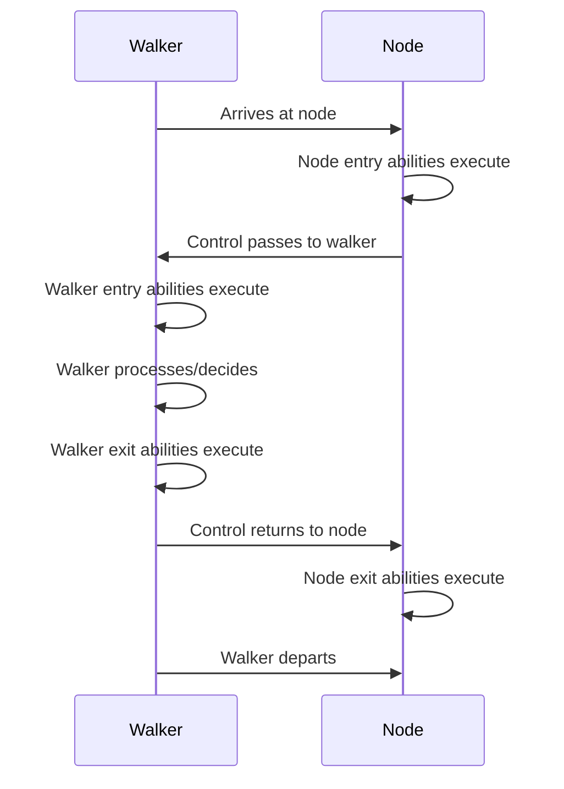

### Chapter 9: Abilities - Event-Driven Computation

Abilities represent a fundamental shift from traditional method invocation to event-driven computation. Instead of explicitly calling functions, abilities automatically execute when specific conditions are met during graph traversal. This chapter explores how abilities enable the bidirectional computation model that makes Object-Spatial Programming so powerful.

#### 9.1 Understanding Abilities

### Implicit Execution vs Explicit Invocation

Traditional programming relies on explicit function calls:

```python
# Python - Explicit invocation
class DataProcessor:
    def process(self, data):
        return self.transform(data)

    def transform(self, data):
        # Must be explicitly called
        return data.upper()

processor = DataProcessor()
result = processor.process("hello")  # Explicit call
```

Abilities execute implicitly based on events:

```jac
// Jac - Implicit execution
walker DataProcessor {
    has results: list = [];

    // This ability executes automatically when entering a DataNode
    can process with DataNode entry {
        // No explicit call needed - triggered by traversal
        let transformed = here.data.upper();
        self.results.append(transformed);
    }
}

node DataNode {
    has data: str;

    // This executes automatically when DataProcessor visits
    can provide_context with DataProcessor entry {
        print(f"Processing {self.data} for {visitor.id}");
    }
}
```

The key insight: **computation happens as a natural consequence of traversal**, not through explicit invocation chains.

### Walker, Node, and Edge Abilities

Each archetype can define abilities that respond to traversal events:

```jac
// Walker abilities - defined in walkers
walker Analyzer {
    // Triggered when entering any node
    can analyze_any with entry {
        print(f"Entering some node");
    }

    // Triggered when entering specific node type
    can analyze_data with DataNode entry {
        print(f"Entering DataNode: {here.value}");
    }

    // Triggered when entering specific edge type
    can traverse_connection with Connection entry {
        print(f"Traversing Connection edge: {here.strength}");
    }

    // Exit abilities
    can complete_analysis with DataNode exit {
        print(f"Leaving DataNode: {here.value}");
    }
}

// Node abilities - defined in nodes
node DataNode {
    has value: any;
    has metadata: dict = {};

    // Triggered when any walker enters
    can log_visitor with entry {
        self.metadata["last_visitor"] = str(type(visitor).__name__);
        self.metadata["visit_count"] = self.metadata.get("visit_count", 0) + 1;
    }

    // Triggered when specific walker type enters
    can provide_data with Analyzer entry {
        // Node can modify the visiting walker
        visitor.collected_data.append(self.value);
    }

    // Exit abilities
    can cleanup with Analyzer exit {
        print(f"Analyzer leaving with {len(visitor.collected_data)} items");
    }
}

// Edge abilities - defined in edges
edge Connection {
    has strength: float;
    has established: str;

    // Triggered when any walker traverses
    can log_traversal with entry {
        print(f"Edge traversed: strength={self.strength}");
    }

    // Triggered when specific walker traverses
    can apply_weight with Analyzer entry {
        // Edges can influence traversal
        visitor.path_weight += self.strength;
    }
}
```

### Execution Order and Precedence

When a walker interacts with a location, abilities execute in a specific order:

```jac
node ExperimentNode {
    has name: str;
    has data: dict = {};

    can phase1 with OrderTest entry {
        print(f"1. Node entry ability (general)");
    }

    can phase2 with OrderTest entry {
        print(f"2. Node entry ability (specific to OrderTest)");
        visitor.log.append("node-entry");
    }

    can phase5 with OrderTest exit {
        print(f"5. Node exit ability");
        visitor.log.append("node-exit");
    }
}

walker OrderTest {
    has log: list = [];

    can phase3 with ExperimentNode entry {
        print(f"3. Walker entry ability");
        self.log.append("walker-entry");
    }

    can phase4 with ExperimentNode exit {
        print(f"4. Walker exit ability");
        self.log.append("walker-exit");
    }

    can demonstrate with entry {
        // This shows the complete order
        visit [-->];
    }
}

// Execution order is always:
// 1. Location (node/edge) entry abilities
// 2. Walker entry abilities
// 3. Walker exit abilities
// 4. Location (node/edge) exit abilities
```



#### 9.2 Practical Ability Patterns

### Data Validation on Arrival

Abilities excel at validating data as walkers traverse:

```jac
node DataRecord {
    has id: str;
    has data: dict;
    has validated: bool = false;
    has validation_errors: list = [];

    // Validate when validator arrives
    can validate_record with DataValidator entry {
        print(f"Validating record {self.id}");

        // Clear previous validation
        self.validation_errors = [];
        self.validated = false;

        // Perform validation
        let errors = visitor.validate_schema(self.data);

        if errors {
            self.validation_errors = errors;
            visitor.invalid_count += 1;
        } else {
            self.validated = true;
            visitor.valid_count += 1;
        }
    }

    // Provide data to collectors only if valid
    can provide_data with DataCollector entry {
        if self.validated {
            visitor.collect(self.id, self.data);
        } else {
            visitor.skip_invalid(self.id, self.validation_errors);
        }
    }
}

walker DataValidator {
    has schema: dict;
    has valid_count: int = 0;
    has invalid_count: int = 0;

    can validate_schema(data: dict) -> list {
        let errors = [];

        // Check required fields
        for field in self.schema.get("required", []) {
            if field not in data {
                errors.append(f"Missing required field: {field}");
            }
        }

        // Check field types
        for field, expected_type in self.schema.get("types", {}).items() {
            if field in data and not isinstance(data[field], expected_type) {
                errors.append(f"Invalid type for {field}: expected {expected_type.__name__}");
            }
        }

        // Check constraints
        for field, constraints in self.schema.get("constraints", {}).items() {
            if field in data {
                value = data[field];

                if "min" in constraints and value < constraints["min"] {
                    errors.append(f"{field} below minimum: {value} < {constraints['min']}");
                }

                if "max" in constraints and value > constraints["max"] {
                    errors.append(f"{field} above maximum: {value} > {constraints['max']}");
                }
        }

        return errors;
    }

    can validate_all with entry {
        visit [-->];
    }

    can report with exit {
        print(f"\nValidation Complete:");
        print(f"  Valid records: {self.valid_count}");
        print(f"  Invalid records: {self.invalid_count}");
    }
}
```

### State Transformation During Traversal

Abilities can transform node state based on traversal context:

```jac
node Account {
    has id: str;
    has balance: float;
    has status: str = "active";
    has transactions: list = [];
    has interest_rate: float = 0.02;

    // Apply interest when processor visits
    can apply_interest with InterestProcessor entry {
        if self.status == "active" and self.balance > 0 {
            let interest = self.balance * visitor.get_rate(self);
            self.balance += interest;

            self.transactions.append({
                "type": "interest",
                "amount": interest,
                "date": visitor.processing_date,
                "balance_after": self.balance
            });

            visitor.total_interest_paid += interest;
            visitor.accounts_processed += 1;
        }
    }

    // Update status based on balance
    can update_status with StatusUpdater entry {
        let old_status = self.status;

        if self.balance < 0 {
            self.status = "overdrawn";
        } elif self.balance == 0 {
            self.status = "zero_balance";
        } elif self.balance < 100 {
            self.status = "low_balance";
        } else {
            self.status = "active";
        }

        if old_status != self.status {
            visitor.status_changes.append({
                "account": self.id,
                "from": old_status,
                "to": self.status
            });
        }
    }
}

walker InterestProcessor {
    has processing_date: str;
    has base_rate: float = 0.02;
    has total_interest_paid: float = 0.0;
    has accounts_processed: int = 0;

    can get_rate(account: Account) -> float {
        // Premium accounts get better rates
        if account.balance > 10000 {
            return self.base_rate * 1.5;
        } elif account.balance > 5000 {
            return self.base_rate * 1.25;
        }
        return self.base_rate;
    }

    can process_batch with entry {
        print(f"Starting interest processing for {self.processing_date}");
        visit [-->:Account:];
    }

    can summarize with exit {
        print(f"\nInterest Processing Complete:");
        print(f"  Date: {self.processing_date}");
        print(f"  Accounts processed: {self.accounts_processed}");
        print(f"  Total interest paid: ${self.total_interest_paid:.2f}");
    }
}
```

### Aggregation and Reporting

Abilities enable elegant aggregation patterns:

```jac
node SalesRegion {
    has name: str;
    has sales_data: list = [];

    can contribute_data with SalesAggregator entry {
        // Calculate region metrics
        let total_sales = sum(sale["amount"] for sale in self.sales_data);
        let avg_sale = total_sales / len(self.sales_data) if self.sales_data else 0;

        // Add to aggregator
        visitor.add_region_data(
            region=self.name,
            total=total_sales,
            average=avg_sale,
            count=len(self.sales_data)
        );

        // Visit sub-regions
        visit [-->:Contains:];
    }
}

node SalesPerson {
    has name: str;
    has sales: list = [];
    has quota: float;

    can report_performance with SalesAggregator entry {
        let total = sum(sale["amount"] for sale in self.sales);
        let performance = (total / self.quota * 100) if self.quota > 0 else 0;

        visitor.add_person_data(
            name=self.name,
            total=total,
            quota=self.quota,
            performance=performance
        );

        // Contribute to region totals
        if here[<--:WorksIn:] {
            let region = here[<--:WorksIn:][0].source;
            region.sales_data.extend(self.sales);
        }
    }
}

walker SalesAggregator {
    has period: str;
    has region_data: dict = {};
    has person_data: list = [];
    has summary: dict = {};

    can add_region_data(region: str, total: float, average: float, count: int) {
        self.region_data[region] = {
            "total": total,
            "average": average,
            "count": count
        };
    }

    can add_person_data(name: str, total: float, quota: float, performance: float) {
        self.person_data.append({
            "name": name,
            "total": total,
            "quota": quota,
            "performance": performance
        });
    }

    can aggregate with entry {
        print(f"Aggregating sales data for {self.period}");
        visit [-->];
    }

    can generate_summary with exit {
        // Calculate company-wide metrics
        self.summary = {
            "period": self.period,
            "total_sales": sum(r["total"] for r in self.region_data.values()),
            "regions_analyzed": len(self.region_data),
            "salespeople_count": len(self.person_data),
            "top_region": max(self.region_data.items(), key=lambda x: x[1]["total"])[0],
            "top_performer": max(self.person_data, key=lambda x: x["performance"])["name"]
        };

        print(f"\n=== Sales Summary for {self.period} ===");
        print(f"Total Sales: ${self.summary['total_sales']:,.2f}");
        print(f"Top Region: {self.summary['top_region']}");
        print(f"Top Performer: {self.summary['top_performer']}");
    }
}
```

### Error Handling in Abilities

Abilities should handle errors gracefully:

```jac
node DataSource {
    has url: str;
    has cache: dict? = None;
    has last_fetch: str? = None;
    has error_count: int = 0;

    can provide_data with DataFetcher entry {
        try {
            // Try cache first
            if self.cache and self.is_cache_valid() {
                visitor.receive_data(self.cache);
                visitor.cache_hits += 1;
                return;
            }

            // Fetch fresh data
            import:py requests;
            response = requests.get(self.url, timeout=5);

            if response.status_code == 200 {
                self.cache = response.json();
                self.last_fetch = now();
                self.error_count = 0;

                visitor.receive_data(self.cache);
                visitor.fetch_count += 1;
            } else {
                self.handle_error(f"HTTP {response.status_code}");
                visitor.error_sources.append(self);
            }

        } except TimeoutError {
            self.handle_error("Timeout");
            visitor.timeout_sources.append(self);

        } except Exception as e {
            self.handle_error(str(e));
            visitor.error_sources.append(self);
        }
    }

    can handle_error(error: str) {
        self.error_count += 1;
        print(f"Error fetching from {self.url}: {error}");

        // Exponential backoff
        if self.error_count > 3 {
            print(f"  Source marked as unreliable after {self.error_count} errors");
        }
    }

    can is_cache_valid() -> bool {
        if not self.last_fetch {
            return false;
        }

        // Cache valid for 1 hour
        import:py from datetime import datetime, timedelta;
        last = datetime.fromisoformat(self.last_fetch);
        return datetime.now() - last < timedelta(hours=1);
    }
}

walker DataFetcher {
    has data_buffer: list = [];
    has fetch_count: int = 0;
    has cache_hits: int = 0;
    has error_sources: list = [];
    has timeout_sources: list = [];

    can receive_data(data: dict) {
        self.data_buffer.append(data);
    }

    can fetch_all with entry {
        visit [-->:DataSource:];
    }

    can report_status with exit {
        print(f"\nData Fetch Complete:");
        print(f"  Sources fetched: {self.fetch_count}");
        print(f"  Cache hits: {self.cache_hits}");
        print(f"  Errors: {len(self.error_sources)}");
        print(f"  Timeouts: {len(self.timeout_sources)}");
        print(f"  Total data collected: {len(self.data_buffer)} items");

        if self.error_sources {
            print("\nFailed sources:");
            for source in self.error_sources {
                print(f"  - {source.url} (errors: {source.error_count})");
            }
        }
    }
}
```

### Advanced Ability Patterns

### Cooperative Processing

Multiple walkers can cooperate through abilities:

```jac
node WorkItem {
    has id: str;
    has status: str = "pending";
    has data: dict;
    has assigned_to: str? = None;
    has result: any? = None;
    has dependencies: list = [];

    // First walker marks items
    can mark_ready with DependencyChecker entry {
        let deps_complete = all(
            dep.status == "completed"
            for dep in self.dependencies
        );

        if deps_complete and self.status == "pending" {
            self.status = "ready";
            visitor.ready_count += 1;
        }
    }

    // Second walker assigns work
    can assign_work with WorkAssigner entry {
        if self.status == "ready" and not self.assigned_to {
            let worker = visitor.get_next_worker();
            self.assigned_to = worker;
            self.status = "assigned";

            visitor.assignments[worker].append(self);
        }
    }

    // Third walker processes
    can process_work with WorkProcessor entry {
        if self.status == "assigned" and self.assigned_to == visitor.worker_id {
            try {
                // Simulate processing
                self.result = self.perform_work();
                self.status = "completed";
                visitor.completed_items.append(self.id);

                // Notify dependents
                self.notify_dependents();

            } except Exception as e {
                self.status = "failed";
                visitor.failed_items.append({
                    "id": self.id,
                    "error": str(e)
                });
            }
        }
    }

    can perform_work() -> any {
        // Actual work logic
        return f"Processed: {self.data}";
    }

    can notify_dependents {
        // Find items depending on this
        for item in [<--:DependsOn:] {
            print(f"  Notifying dependent: {item.source.id}");
        }
    }
}

// Orchestrator spawns walkers in sequence
walker WorkflowOrchestrator {
    has phases: list = ["check_deps", "assign", "process"];
    has current_phase: int = 0;

    can orchestrate with entry {
        let phase = self.phases[self.current_phase];
        print(f"\nExecuting phase: {phase}");

        if phase == "check_deps" {
            spawn DependencyChecker() on here;
        } elif phase == "assign" {
            spawn WorkAssigner(workers=["w1", "w2", "w3"]) on here;
        } elif phase == "process" {
            // Spawn processor for each worker
            for worker in ["w1", "w2", "w3"] {
                spawn WorkProcessor(worker_id=worker) on here;
            }
        }

        // Move to next phase
        self.current_phase += 1;
        if self.current_phase < len(self.phases) {
            visit here;  // Revisit to continue
        }
    }
}
```

### Ability Composition

Abilities can be composed for complex behaviors:

```jac
// Mixin-like node abilities
node ObservableNode {
    has observers: list = [];
    has change_log: list = [];

    can notify_observers(change: dict) {
        for observer in self.observers {
            observer.on_change(self, change);
        }

        self.change_log.append({
            "timestamp": now(),
            "change": change
        });
    }
}

node CacheableNode {
    has cache_key: str;
    has cached_at: str? = None;
    has ttl_seconds: int = 3600;

    can is_cache_valid() -> bool {
        if not self.cached_at {
            return false;
        }

        import:py from datetime import datetime, timedelta;
        cached = datetime.fromisoformat(self.cached_at);
        return datetime.now() - cached < timedelta(seconds=self.ttl_seconds);
    }

    can invalidate_cache {
        self.cached_at = None;
    }
}

// Composed node using both patterns
node SmartDataNode(ObservableNode, CacheableNode) {
    has data: dict;
    has version: int = 0;

    // Override data setter to trigger notifications
    can update_data with DataUpdater entry {
        let old_data = self.data.copy();
        let changes = visitor.get_changes();

        // Update data
        self.data.update(changes);
        self.version += 1;
        self.cached_at = now();

        // Notify observers
        self.notify_observers({
            "type": "data_update",
            "old": old_data,
            "new": self.data,
            "version": self.version
        });

        visitor.nodes_updated += 1;
    }

    // Provide cached data efficiently
    can get_data with DataReader entry {
        visitor.requests += 1;

        if self.is_cache_valid() {
            visitor.cache_hits += 1;
            visitor.receive_data(self.data, cached=true);
        } else {
            // Simulate expensive operation
            self.refresh_data();
            visitor.receive_data(self.data, cached=false);
        }
    }

    can refresh_data {
        import:py time;
        time.sleep(0.1);  // Simulate work
        self.cached_at = now();
    }
}
```

### Dynamic Ability Selection

Abilities can conditionally execute based on runtime state:

```jac
node AdaptiveProcessor {
    has mode: str = "normal";
    has load: float = 0.0;
    has error_rate: float = 0.0;

    // Different processing strategies based on mode
    can process_normal with DataWalker entry {
        if self.mode != "normal" {
            return;  // Skip if not in normal mode
        }

        // Normal processing
        let result = self.standard_process(visitor.data);
        visitor.results.append(result);

        // Update metrics
        self.load = self.calculate_load();
        self.check_mode_change();
    }

    can process_degraded with DataWalker entry {
        if self.mode != "degraded" {
            return;
        }

        // Simplified processing for high load
        let result = self.simple_process(visitor.data);
        visitor.results.append(result);
        visitor.degraded_count += 1;
    }

    can process_recovery with DataWalker entry {
        if self.mode != "recovery" {
            return;
        }

        // Careful processing during recovery
        try {
            let result = self.careful_process(visitor.data);
            visitor.results.append(result);
            self.error_rate *= 0.9;  // Reduce error rate
        } except {
            self.error_rate = min(1.0, self.error_rate * 1.1);
        }

        self.check_mode_change();
    }

    can check_mode_change {
        let old_mode = self.mode;

        if self.error_rate > 0.2 {
            self.mode = "recovery";
        } elif self.load > 0.8 {
            self.mode = "degraded";
        } else {
            self.mode = "normal";
        }

        if old_mode != self.mode {
            print(f"Mode changed: {old_mode} -> {self.mode}");
        }
    }

    can standard_process(data: any) -> any {
        // Full processing
        return data;
    }

    can simple_process(data: any) -> any {
        // Reduced processing
        return data;
    }

    can careful_process(data: any) -> any {
        // Careful processing with validation
        return data;
    }
}
```

### Performance Considerations

Abilities should be designed for efficiency:

```jac
node OptimizedNode {
    has large_data: list;
    has index: dict? = None;
    has stats_cache: dict? = None;
    has stats_valid: bool = false;

    // Lazy initialization
    can build_index {
        if self.index is None {
            print("Building index...");
            self.index = {};
            for i, item in enumerate(self.large_data) {
                if "id" in item {
                    self.index[item["id"]] = i;
            }
        }
    }

    // Efficient lookup using index
    can find_item with ItemFinder entry {
        self.build_index();

        let target_id = visitor.target_id;
        if target_id in self.index {
            let idx = self.index[target_id];
            visitor.found_item = self.large_data[idx];
            visitor.comparisons = 1;  // O(1) lookup
        } else {
            visitor.found_item = None;
            visitor.comparisons = 0;
        }
    }

    // Cached statistics
    can get_stats with StatsCollector entry {
        if not self.stats_valid {
            self.stats_cache = {
                "count": len(self.large_data),
                "total": sum(item.get("value", 0) for item in self.large_data),
                "average": sum(item.get("value", 0) for item in self.large_data) / len(self.large_data)
            };
            self.stats_valid = true;
        }

        visitor.collect_stats(self.stats_cache);
    }

    // Invalidate cache on updates
    can update_data with DataUpdater entry {
        self.large_data.extend(visitor.new_data);
        self.stats_valid = false;  // Invalidate cache
        self.index = None;  // Rebuild index on next search
    }
}

// Batch processing for efficiency
walker BatchProcessor {
    has batch_size: int = 100;
    has current_batch: list = [];
    has processed_count: int = 0;

    can collect with DataNode entry {
        self.current_batch.append(here.data);

        if len(self.current_batch) >= self.batch_size {
            self.process_batch();
            self.current_batch = [];
        }

        visit [-->];
    }

    can process_batch {
        // Process entire batch at once
        print(f"Processing batch of {len(self.current_batch)} items");

        // Batch operations are often more efficient
        import:py numpy as np;
        if all(isinstance(item, (int, float)) for item in self.current_batch) {
            batch_array = np.array(self.current_batch);
            result = np.mean(batch_array);  // Vectorized operation
            print(f"  Batch mean: {result}");
        }

        self.processed_count += len(self.current_batch);
    }

    can finalize with exit {
        // Process remaining items
        if self.current_batch {
            self.process_batch();
        }

        print(f"Total processed: {self.processed_count}");
    }
}
```

### Best Practices for Abilities

##### 1. **Keep Abilities Focused**
Each ability should have a single, clear purpose:

```jac
// Good - focused abilities
node Order {
    can validate_items with OrderValidator entry {
        // Only validation logic
    }

    can calculate_total with PriceCalculator entry {
        // Only price calculation
    }

    can check_inventory with InventoryChecker entry {
        // Only inventory checking
    }
}

// Bad - doing too much
node Order {
    can process_everything with OrderProcessor entry {
        // Validation, calculation, inventory, shipping, etc.
        // Too much in one ability!
    }
}
```

##### 2. **Use Guards for Conditional Execution**
Prevent unnecessary processing with early returns:

```jac
can process_premium with PremiumProcessor entry {
    // Guard clause
    if not here.is_premium_eligible() {
        return;  // Skip processing
    }

    // Main logic only for eligible nodes
    self.apply_premium_benefits(here);
}
```

##### 3. **Handle State Mutations Carefully**
Be explicit about state changes:

```jac
node Counter {
    has value: int = 0;
    has history: list = [];

    can increment with CounterWalker entry {
        // Store previous state
        let old_value = self.value;

        // Mutate state
        self.value += visitor.increment_by;

        // Track changes
        self.history.append({
            "from": old_value,
            "to": self.value,
            "by": visitor.walker_id,
            "at": now()
        });

        // Notify visitor of change
        visitor.changes_made.append({
            "node": self,
            "old": old_value,
            "new": self.value
        });
    }
}
```

##### 4. **Design for Testability**
Make abilities testable by keeping them pure when possible:

```jac
node Calculator {
    has formula: str;

    // Pure calculation - easy to test
    can calculate(values: dict) -> float {
        // Parse and evaluate formula
        return eval_formula(self.formula, values);
    }

    // Ability delegates to pure function
    can provide_result with CalculationWalker entry {
        let result = self.calculate(visitor.values);
        visitor.collect_result(self, result);
    }
}
```

##### 5. **Document Ability Contracts**
Be clear about what abilities expect and provide:

```jac
node DataProvider {
    """
    Provides data to visiting walkers.

    Expected visitor interface:
    - receive_data(data: dict, metadata: dict)
    - can_handle_format(format: str) -> bool

    Modifies visitor state:
    - Adds data to visitor's collection
    - Updates visitor's metadata
    """
    can provide with DataCollector entry {
        if not visitor.can_handle_format(self.format) {
            visitor.skip_unsupported(self);
            return;
        }

        visitor.receive_data(
            data=self.data,
            metadata=self.get_metadata()
        );
    }
}
```

### Summary

In this chapter, we've explored abilities—the event-driven computation model at the heart of Object-Spatial Programming:

- **Implicit Execution**: Abilities trigger automatically during traversal
- **Multi-Actor System**: Walkers, nodes, and edges all participate
- **Execution Order**: Predictable sequencing enables complex interactions
- **Practical Patterns**: Validation, transformation, aggregation, and error handling
- **Advanced Techniques**: Composition, cooperation, and performance optimization

Abilities transform static data structures into reactive, intelligent systems. They enable computation to happen exactly where and when it's needed, without explicit orchestration. This event-driven model, combined with mobile walkers, creates systems that are both powerful and maintainable.

Next, we'll explore the scale-agnostic features that make Jac applications automatically persist data and handle multiple users without additional code—taking the concepts we've learned and making them production-ready.
