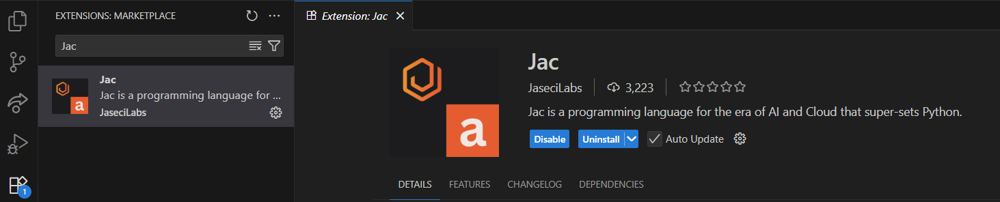
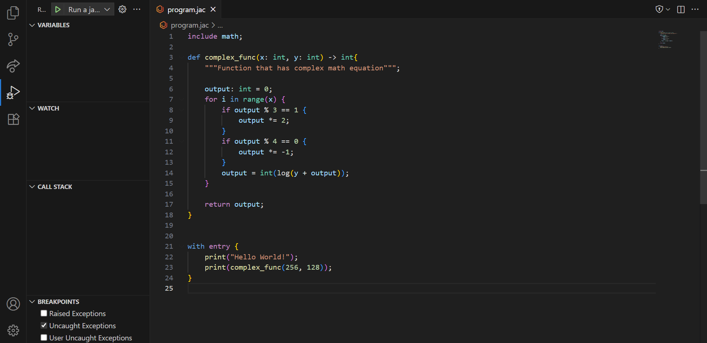
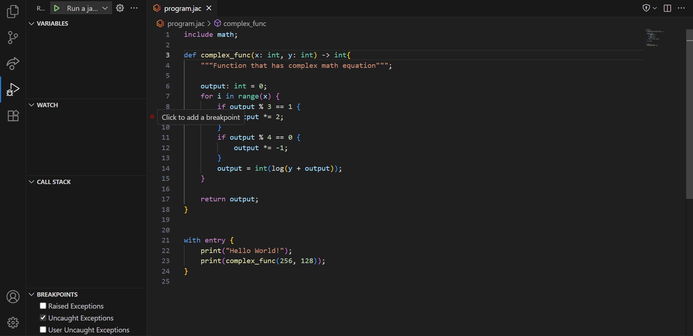
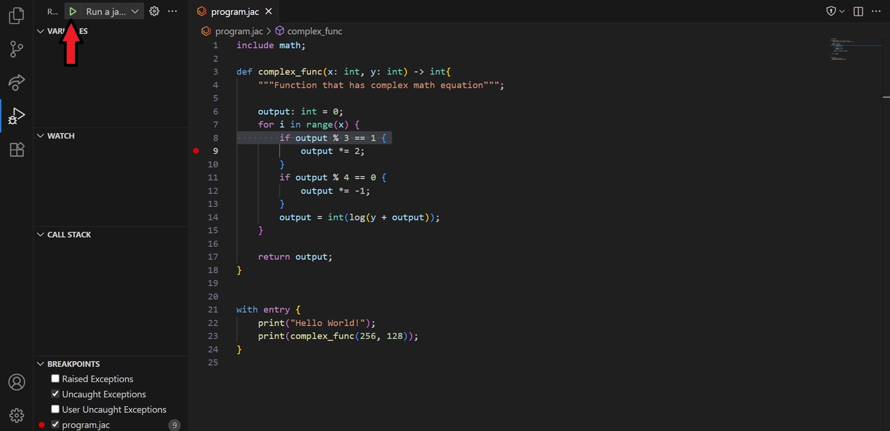
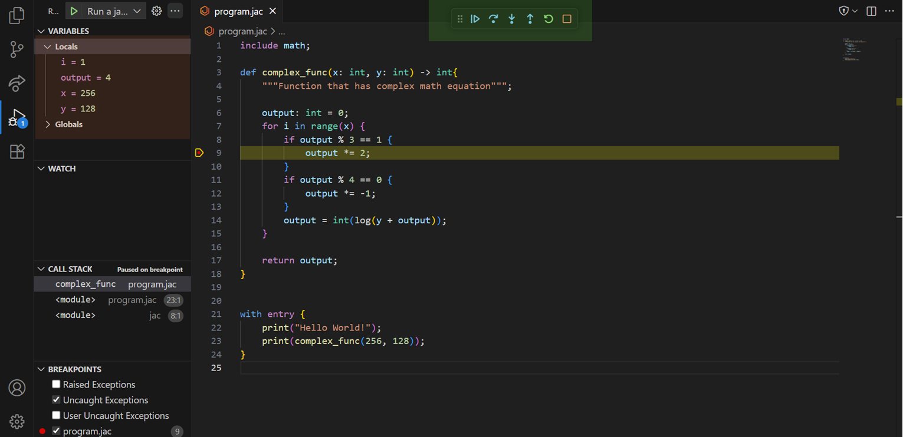
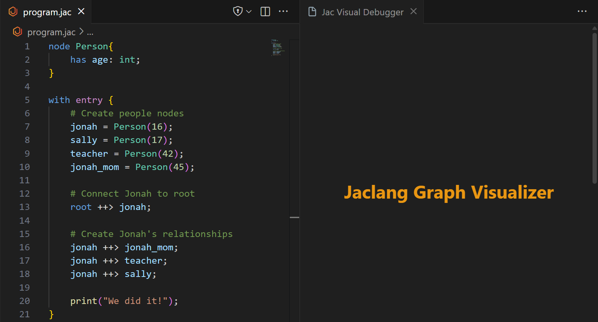

# Jac debugging in VS Code

---
!!! note
    This tutorial goes over the Jac Extension for locally debugging your Jac program. If you are interested in using an online debugger checkout [Jac Playground](https://www.jac-lang.org/playground/)


!!! tldr
    If you already have some development experience, here's a quick guide to get the debugger running.

    (If not no worries! The rest of the tutorial walks through each step in detail.)

    - Install Python 3.12+
    - Install jaclang
    - Install VS Code + Jac extension
    - Create launch.json (Debug and Run -> Create launch.json -> Jac Debug)
    - Open VS Code Command Palette and run jacvis for graph visualization
    - Set a breakpoint -> Run Debugger -> Inspect variables

## What is the Jac Debugger?

The Jac Debugger helps you find and fix issues in Jac programs. It supports:

- Breakpoints
- Step-through execution
- Variable inspection
- Graph visualization (unique to Jac)

In this tutorial, we’ll walk through how to set up the debugger and demonstrate how to use its features.


## Setup (one time)
---

!!! info
    Complete these steps once per computer.

!!! important
    **Required** (Follow [setup](#setup-one-time) if any requirement is missing):

    - **Python 3.12+**
        - Check: `python --version` or `python3 --version`

    - **jaclang 0.8.10+**
        - Check: `jac --version`

    - **Visual Studio Code (latest version)**

    - **Jac VS Code extension installed**
        - In VS Code → Extensions tab → search **"Jac"** and install

### VS Code Setup

To create breakpoints in a Jac program we need to enable `Debug: Allow Breakpoints Everywhere`

Steps:

1. Install VS Code: https://code.visualstudio.com/
2. Open Settings
3. Search for **"breakpoints"**
4. Enable **Debug: Allow Breakpoints Everywhere**

<iframe width="640" height="360"
    src="https://www.youtube.com/embed/2V02bv7k1UA"
    title="YouTube video player"
    frameborder="0"
    allow="accelerometer; autoplay; clipboard-write; encrypted-media; gyroscope; picture-in-picture"
    allowfullscreen
    crossorigin>
</iframe>

### Jac Extension setup

The Jac extension includes many features, including a built-in debugger. To use it, we first need to install the extension.

Steps (in VS Code):

1. Open **Extensions**
2. Search for **"Jac"**
3. Install the Jac extension



## Setup (every time)

!!! info
    Do this every time you start a **new** Jac project.

### Jac Environment Setup

If you haven’t installed Jac yet, see the **[Jac Installation Guide](https://www.jac-lang.org/learn/installation/)**

This ensures you have the minimum tools needed for debugging.

### Create `launch.json`

`launch.json` tells VS Code how to run the debugger.

1. Open **Run and Debug** panel
2. Click **Create a launch.json**
3. Select **Jac Debug**
4. VS Code generates the file automatically

<iframe width="640" height="360"
    src="https://www.youtube.com//embed/5zaR_HQzNU4"
    title="YouTube video player"
    frameborder="0"
    allow="accelerometer; autoplay; clipboard-write; encrypted-media; gyroscope; picture-in-picture"
    allowfullscreen
    crossorigin>
</iframe>


## Debugger Tutorial

Below are some examples of how to use the Jac Debugger

### Breakpoints
!!! note
    If you already know how debuggers work, skip to [Graph Visualizer](#graph-visualizer)

Breakpoints pause the program so you can:

- Inspect variables
- Check logic
- Watch execution line-by-line

Example program with a function we want to debug:



To set a breakpoint, click to the left of a line number:



Then click **Run and Debug** in the top-left toolbar:



When the program reaches the breakpoint, it will pause. You’ll see:

*Debugger Options* (in green):

| Debugger Action | What It Does                                            |
| --------------- | ------------------------------------------------------- |
| **Continue**    | Runs until the next breakpoint or the program ends.     |
| **Step Over**   | Executes the next line, *skipping into* function calls. |
| **Step Into**   | Executes the next line and *enters* called functions.   |
| **Step Out**    | Runs until the current function returns.                |
| **Restart**     | Restarts the program from the beginning.                |
| **Stop**        | Halts execution and exits the debugger.                 |


*Variable Viewer* (in red):

| Type                 | Meaning                                                                                  | Where They Can Be Used                                                                                        |
| -------------------- | ---------------------------------------------------------------------------------------- | ------------------------------------------------------------------------------------------------------------- |
| **Local Variables**  | Variables created **inside a function**. They exist only while that function is running. | Only inside that specific function. They cannot be accessed from outside.                                     |
| **Global Variables** | Variables defined **outside all functions**, at the top level of the program.            | Can be accessed from anywhere in the program (functions can read them, and write to them if declared global). |



Use this to understand program state and logic flow.

### Graph Visualizer

!!! note
    If breakpoints still feel confusing, review the [Breakpoints Tutorial Section](#breakpoints)

Jac’s debugger includes a **visual graph tool** to show nodes and edges.

Example graph program:
```jac
node Person{
    has age: int;
}

with entry {
    # Create people nodes
    jonah = Person(16);
    sally = Person(17);
    teacher = Person(42);
    jonah_mom = Person(45);

    # Connect Jonah to root
    root ++> jonah;

    # Create Jonah's relationships
    jonah ++> jonah_mom;
    jonah ++> teacher;
    jonah ++> sally;
}
```


#### Open visualization panel:

1. Open the VS Code Command Palette
    This can be done by either:
    - On your keyboard pressing `ctrl+shift+p` or `⌘+⇧+p` on mac
    - On the top menu bar pressing `view > command palette`
2. Type `jacvis`
3. Select `jacvis: Visualize Jaclang Graph`

You will see a side panel like this:



#### Watch the Graph Build in Real Time

1. Set a breakpoint in your code
3. Click Run and Debug
3. Step through the program each created node/edge appears in real time

<iframe width="560" height="315"
    src="https://www.youtube.com/embed/9bdZn4Zvf9M?si=da8VXiIYaKK1hxMo"
    title="YouTube video player"
    frameborder="0"
    allow="accelerometer; autoplay; clipboard-write; encrypted-media; gyroscope; picture-in-picture; web-share" referrerpolicy="strict-origin-when-cross-origin"
    allowfullscreen
    crossorigin>
</iframe>

As shown in the video, these nodes will show their values and can be dragged around to better visualize the data.

## Common Pitfalls

| Problem                                | Fix                                                               |
| -------------------------------------- | ----------------------------------------------------------------- |
| Breakpoints are grey / don’t stop      | Turn on **Debug: Allow Breakpoints Everywhere**                   |
| VS Code says "No Jac debugger found"   | Reload VS Code Window after installing Jac extension              |
| Program runs but debugger doesn’t stop | Make sure you are running through **Run and Debug**, not terminal |
| Graph doesn't update                   | Open the `jacvis` before starting the debugger              |