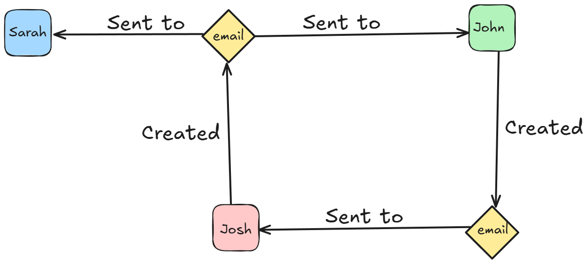
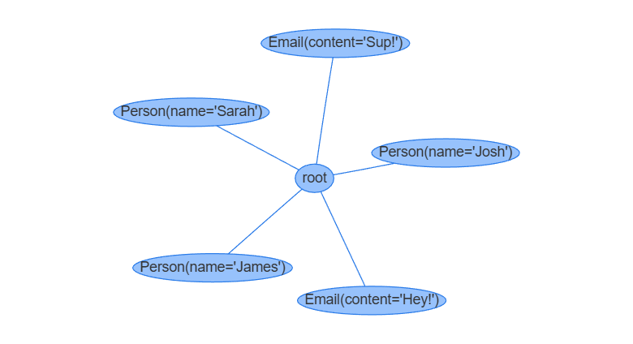
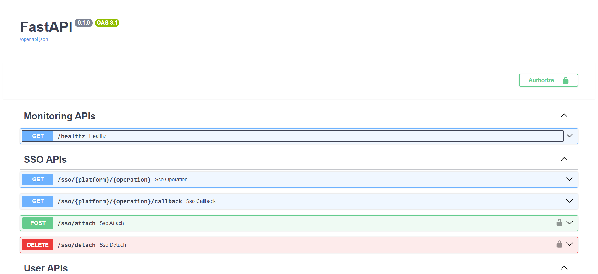

# EmailBuddy

Your inbox is a disorganized archive of conversations, attachments, and commitments. Finding specific information like "what was the final price we agreed on?" is hard, and searching through your vast inbox is incredibly time-consuming. You're forced to rely on keyword search and manual digging, wasting valuable time just to catch up.

EmailBuddy is an agentic AI email assistant built with Jac, a new programming language for creating intelligent agents. It tackles this problem by transforming your entire inbox from a flat list of messages into an intelligent, graph-based knowledge system. This new structure maps out the relationships between people and emails, enabling semantic search, deep analysis, and RAG-powered navigation. It lets you stop digging and start asking questions to get answers from your email history!

## Key Features:

- Summarization & Context Retrieval: Get concise summaries or ask questions about conversations
- Graph-Based Representation: Emails stored as relationships between people and emails
- Web-based Chat Interface: Easy to setup webpage

## How it works under the hood?

In this breakdown, you'll learn how EmailBuddy works under the hood, and why Jac is an ideal language for powering intelligent, graph-driven agents.

This article will NOT go through the entire source code directly. If you want to view the source code checkout the EmailBuddy GitHub repository

### Object-Spatial Programming

#### What is Object-Spatial Programming

Think of your computer's files. Traditional programming (OOP) is like having a list of all your files in a spreadsheet. You can sort, filter, and look them up. Object-Spatial Programming (OSP) on the other hand is like your actual desktop, where files and folders are objects in a space. You can visually see that 'Project_Report.pdf' is inside the 'Work' folder, which is next to the 'Clients' folder. OSP is about these relationships and locations.

Object Spatial Programming (OSP) is a programming paradigm where software logic is expressed and organized using relational connections rather than only class or functional based code. Instead of writing everything as functions and classes, OSP treats program components as objects placed in space, like nodes, blocks, or agents whose location or  proximity influences behavior.

#### Why Object-Spatial Programming Fits EmailBuddy

EmailBuddy uses this programming paradigm to structure the relationship between people and their emails.

We can represent both emails and people as nodes on a graph. Each node can contain information relevant to itself as shown below:

```Jac
node Person{
    has name: str;
    has email: str;
}

node EmailNode{
    has sender: str;
    has recipients: str;
    has date: str;
    has subject: str;
    has body: str;
    has email_uuid: str;
}
```

Traditional object-oriented programming (OOP) would have similar "classes" to represent this information, however OSP allows for assigning connections between the nodes helps us better understand the relationship between individual nodes. We do this by representing directed edges between a person to an email as a "sender of email" and an email to a person as a "recipient of email"

With this concept we can imagine a scenario where:

- Josh sends an email to John and Sarah
- John sends a response email ONLY to Josh directly

We may imagine a graph like the following below




#### How EmailBuddy sets up the Object-Spatial graph

Now that we have a high-level understanding how to represent these Email/People node interactions, how can we actually implement this?

EmailBuddy has two main user-interactions:

1. Upload emails
2. Query chatbot

First we will talk about uploading emails.

EmailBuddy handles email uploads by allowing users to upload a json file in the following format:

```json
[
  {
    "date": "2025-10-09T06:20:18+00:00",
    "from": "Lily Carter <lcarter@protonmail.com>",
    "to": "Evan Brooks <evan.brooks@gmail.com>",
    "subject": "Hows it going",
    "body": "Hey Evan! We haven't spoken in a while, let's catch up soon."
  }
]
```

These json files are parsed in Jac and are used to create our nodes. We handle node creation by treating our 2 node types (Person & Email) as 3 (Sender, Recipients, & Email).


For each email uploaded, EmailBuddy:

- Extract sender and recipient addresses
- Create Person nodes if they do not already exist
- Create or skip Email node based on UUID matching
- Connect all Person and Email nodes to the root
- Create directed edges: person → email, and email → recipients


We must connect ALL nodes (Email and Person) to the root node so we can access them later.

??? tip "What is a root node?"
    The root node in Jac acts as a fundamental global pointer on the graph. It is a special node that is always accessible in every request context, especially when running Jac in server mode (jac serve). Think of the root node as the front door or lobby of your email graph. When a 'walker' (our search agent) arrives, it always starts at the root. By connecting every new Person and Email to this root, we ensure the walker can find them, like adding a new room's key to the lobby's key rack.

    This design ensures that no nodes get "lost" since all nodes are directly or indirectly connected to the root node, making them accessible to the program. This persistent organization facilitates data traversal and manipulation across the graph.

    This is particularly useful for us since every node is connected to root, we can always find any email, even if we don't know who sent it or who received it.


Now that we have all the nodes created (and connected to root) our graph will likely look something like this:



The issue with this graph is that we don't have any connections between People and Emails

This can be accomplished by something like the following

```Jac
recipientNodes: list[People];
senderNode: People;
emailNode: Email;

senderNode ++> emailNode;
for node in recipientNodes{
    emailNode ++> node;
}
```

With these steps we will have a connected graph representation of our emails for us to traverse.


#### How EmailBuddy uses the graph

Once our graph is created, we can traverse it using walkers.

??? tip "What is a walker?"
    A walker is a program that moves through a Jac graph and executes code at each node.

    A walker is like a little robot that moves through your graph.

    As it moves, it can:

    - look at data on a node
    - save information
    - change data
    - create new nodes

    Think of it like a character exploring a map.
    Instead of a function pushing data around, the walker visits the data itself.

EmailBuddy uses a few helper walkers to answer questions like:

- "Does this sender already exist?"
- "Have we seen this email before?"
- "Is this person already in the graph?"

Each helper walker starts at a node (usually the root node) and explores outward until it finds what it needs or reaches the end.

```
(root) → Person → Email → Person
   ↑
 spawn walker here
```


Here's an example: a walker that starts at root and searches the graph for a Person whose email matches the target.

```Jac
walker FindSenderNode {
    has target: str;
    has person: Person = None;

    can start with `root entry {
        visit [-->];
        return self.person;
    }

    can search with Person entry {
        if here.email == self.target {
            self.person = here;
            disengage;
        }
    }
}
```

??? tip "Need help with syntax?"
    - `has <memberVariable>: <type>`: Create member variables for walker
    - `can <attributeName> with <nodeType> entry`: Assigns walker behavior when it is on the node type (root must have `` `root ``)
    - `disengage`: Stops the walker immediately so it doesn't keep searching.
    - `visit [-->]`: Tells the walker to explore all nodes reachable from this one along outgoing edges.


This walkers goal is to find a specific Person node and return the value. The walker will search through ALL people nodes connected to root until it finds its target or runs out of People to search. If the walker does not find a matching Person node, self.person stays None.

When the FindSenderNode walker is initialized, the walker is passed a target email address as a member variable to find a Person node attached to it.

```Jac
FindSend = FindSenderNode(target=sender_email);
```

Once the walker is initialized, it behaves just like any other object in OOP: it has member variables and functions you can access. It doesn't actually do anything until we spawn it. Spawning a walker means placing it on a starting node in the graph and letting it run until it reaches its stopping condition. While the walker is active, it can move between nodes and perform actions, such as creating new nodes or modifying existing ones.


We can spawn the walker on root by doing the following command.

```Jac
root spawn FindSend;
```

Once the walker terminates, we can extract the node as follows.

```Jac
sender: Person = FindSend.person;
```
If no matching Person is found, the walker finishes naturally and FindSend.person will still be None.

EmailBuddy has two other helper walkers (FindEmailNode and FindRecipientNodes) that follow a very similar pattern, however the main traversal/query walker (ask_email) works differently. To learn more read about this last walker continue reading about [AI Agents](#ai-agents).

#### Common OSP pitfalls

| Mistake                                 | Symptom                             | Fix                                    |
| --------------------------------------- | ----------------------------------- | -------------------------------------- |
| Forgot to connect nodes to root         | Walker can't find anything          | `root ++> newNode`                     |
| Email duplicate created twice           | Graph has repeated email nodes      | Check UUID before creation             |
| Walker never stops                      | Infinite graph crawl                | Use `disengage` when end condition met |
| Walker doesn't do anything after spawn  | Attribute undefined for node type   | `can <attrName> with <nodeType> entry` |

### AI Agents (byllm)

#### What is an AI Agent

An AI agent is a system that perceives its environment, makes decisions, and takes actions to achieve goals, either autonomously or with minimal human input. It can learn from data, adapt its behavior, and optimize future decisions. Examples range from simple chatbots to advanced robotics and planning systems.

#### Why Agentic Programming fits EmailBuddy

EmailBuddy answers user questions by searching through a user's email history, which is stored in a graph-based database. In this type of structure, information is spread across many interconnected nodes of People and Emails.

Agentic programming is a strong fit because agents can plan and adapt their search across the graph. Instead of generating a single static query, an agent can:

- Explore a node
- Evaluate its relevance
- Decide which related emails or entities to visit next
- Refine the search based on partial results.

In the situation below we have many emails sent to Josh. Without having a agentic "judge" deciding which Email node to next explore, it would be near impossible to properly traverse and explore the graph to answer a user query.


#### How EmailBuddy uses AI Agents

To search effectively through a user's email graph, EmailBuddy relies on AI-driven decision-making. This is where the "Summarization & Context Retrieval" feature comes to life. The agent has two primary jobs:

1. Information Collection: Summarize key information from nodes to not clutter internal memory.
2. Navigation: Traverse graph, finding all the relevant email and person nodes.

This is powered by Jac's byllm feature. byllm allows developers to define a function with only a name, input/output types, and a docstring. This leaves the LLM to infer how the function should behave.

##### 1. Information Collection

Before the the agent can make a decisions, it needs to receive context of the walker's position and previous knowledge. The LLM agent should receive only the most important information, not large amounts of repetitive or irrelevant text. One way to accomplish this is by summarizing what the agent has discovered so far.

As the Walker moves through the graph, it may encounter nodes with a large amount of information, for example, a person who has sent many emails. Passing all of that content directly to the LLM would quickly overwhelm the context window. Instead, a separate summarization agent reviews the existing findings and conversation history, then condenses them into a short, meaningful summary. This keeps the LLM's working memory efficient, even as the exploration continues and more data is discovered.

This process reflects adaptive decision-making: rather than following a strict sequence or rule set, the agent adjusts its behavior based on context, available information, and new node options.

EmailBuddy uses Jac’s byllm feature to enable this behavior. byllm lets developers define a function by specifying only the name, input/output types, and a short description of what it should do. The LLM then determines how the function should behave based on context and past interactions.

For example, the following simplified function asks the LLM to summarize key information from nearby nodes (such as emails) before the agent decides what to do next:

```Jac
import from byllm.lib { Model }

glob llm = Model(model_name="openai/gpt-5", verbose=True);

"""
Summarize relevant part of each option to the initial query not in current conversation history
"""
def summarize(presented_option: list[str], convo_history: list[dict]) -> str by llm();
```

Once defined, this function can be called like any regular function through byllm handling response generation and input/outputs formatting behind the scenes.

##### 2. Navigation

For an Agent to act it has to decide what the best action is. In EmailBuddy's case, the agent must decide at each node whether to continue exploring neighbors, refine its search, or stop. This adaptive decision-making is powered by an internal byllm function.

**Setup byllm**

```
obj Response{
    has option: str;
    has selection: str;
    has explanation: str;
}

sem Response = "Structured response used by an agentic traversal logic.";
sem Response.option = "A control token defining action: @selected@, @query@, or @end@.";
sem Response.selection = "The chosen node, search query, or final response.";
sem Response.explanation = "A short justification for why this decision was made.";

"""Decide which option is best. Choose one of the emails our current person has sent/received, semantic search for a new email to explore, or answer the initial query"""
def choose_next_email_node(person: str, sent: list[str], received: list[str], conversation_history: list[dict]) -> Response by llm();
```

To begin, we define a custom output type that the LLM will use when returning a result. In this case, that type is `Response`, which gives the agent a structured way to communicate its decision.

Next, we attach semantic strings ("semstrings") to the `Response` type and each of its fields. These short descriptors provide the LLM additional context about the meaning and expectations behind each variable. In other words, semstrings give the LLM 'developer hints' about your code. Instead of writing a giant, complex prompt trying to explain what Response.option is, we just add a 'semantic string'. For the above snippet `sem Response.option = "A control token defining action..."`, it is telling the LLM "Hey, this option variable isn't just text, but a command." This simple hint makes the LLM much more accurate and the code much cleaner.

Finally, we declare the function itself. The signature includes:
- A short docstring describing the function's purpose
- Input and output type definitions
- The by llm modifier, telling Jac that this function is backed by an LLM rather than a traditional implementation.

With these three pieces in place, Jac handles everything under the hood, from building the structured prompt to formatting the model output into the expected type.

!!! note
    Unlike traditional prompt engineering, the docstring here does not need to carry the full cognitive load. Because byllm includes context from variable names, type signatures, and semstrings, the docstring should stay concise. Short guidance performs better than long paragraphs of instruction.


**Runtime byllm**

During traversal, the agent first collects all relevant context from the current node,such as emails sent and received by the person, and appends this information to the conversation history. This ensures the agent has a memory of what it has already seen.

Next, the agent calls the LLM-backed decision function:

```jac
response = choose_next_email_node(person_formatted, sent_formatted, received_formatted, conversation_history);
```

The function returns a structured `Response` object. Based on the option field in this response, the walker takes the appropriate action:

- @selected@: Move to the chosen neighboring node and continue traversal
- @query@: Perform a semantic search for additional relevant emails outside immediate neighbors
- @end@: Stop traversal and return the final answer to the user

This multi-step agentic process using byllm functions to collect context and navigate the graph is what allows EmailBuddy to provide deep, context-aware answers.

### Scale Native

#### What is Scale Native

Scale-native systems are built to automatically grow or shrink with demand, without rewriting code or manually resizing infrastructure. Unlike traditional cloud apps that require human intervention to scale, scale-native software dynamically allocates resources, balances workloads, handles failures, and maintains performance under changing usage.

Frameworks like Jac Cloud embody this principle by making applications inherently elastic, resilient, and globally deployable.

#### Why Scale Native fits EmailBuddy

EmailBuddy lets users interact with their emails through a chat-style interface. As users store or process more emails, the system must grow accordingly.

Right now, the implementation we have of EmailBuddy runs locally, but Jac's scale-native design allows the exact same code to be deployed to the cloud and scaled on demand without architectural changes.

#### How EmailBuddy uses Scale Native

EmailBuddy's walkers, which handle uploading and querying, are the core logic. Jac's Scale-Native features are what connect this logic to the outside world by turning those walkers into API endpoints that a website can interact with.

This diagram shows how all the pieces work together:


Here is a breakdown of the flow shown in the diagram:

- **Front End Webpage**: This is what the user sees (e.g., the chat interface). It is a separate application (like a JavaScript webpage) that communicates with your Jac program.
- **Scale-Native API (The Green Diamonds)**: When you run jac serve, Jac automatically creates API endpoints for your walkers. The Upload Walker becomes an endpoint that accepts a list of emails, and the Query Walker (our ask_email agent) becomes an endpoint that accepts a question.
- **Immediate Visibility (The root node)**: When the webpage sends a request to one of these endpoints, the jac serve process "spawns" the correct walker on the graph's root node.
- **Discovery (The Graph)**: From the root node, the walker can then traverse the graph to discover all the connected nodes to find the answer.

This architecture is what allows your JavaScript code to activate a Jac walker.

#### From Localhost to Global Scale

Scaling happens in two natural steps:

1. **Run locally with jac serve**: This turns your Jac program into a live HTTP API at localhost:8000.

2. **Deploy to the cloud using the same code**: Because the app is already an API server, deploying it simply moves it from local mode to a scalable cloud environment—where load balancing and autoscaling can support thousands or millions of users.

#### Calling EmailBuddy Walkers via API

Once `jac serve` is running:

```bash
jac serve server.jac
```

Now you have multiple local endpoints you can interact with, which are ready to be deployed for global scale.

You can view available endpoints at:

```
http://localhost:8000/docs
```



Once you know which endpoint you want, you can call a Jac walker using an HTTP request:

```js
  $.ajax({
        url: 'http://localhost:8000/walker/ask_email',
        method: 'POST',
        contentType: 'application/json',
        data: JSON.stringify({
            query: message
        }),
        ...
    });
```

This code snippet activates the walker by passing in the proper args as an HTTP request. The walker will work until it completes its task and returns the requested value to the frontend.

With this architecture, EmailBuddy grows seamlessly from a local prototype into a globally available intelligent email assistant without rewriting or redesigning the system.

## What did we learn?

As we've seen, EmailBuddy's power comes from the unique synergy of Jac's core design principles:

- **Object-Spatial Programming (OSP)** builds the foundational knowledge graph, turning your flat list of emails into a connected web of relationships.
- **AI Agents (powered by byllm)** act as intelligent "walkers" that can autonomously navigate this graph, collect context, and make decisions to find the precise answers you need.
- **Scale-Native design** provides the API that connects this powerful graph-based agent to a simple web interface, making the entire system accessible and ready to grow.

Together, these pillars transform your inbox from a disorganized, static archive into a dynamic and intelligent assistant you can collaborate with.

To see this in action and explore the complete implementation, check out the EmailBuddy GitHub repository or learn more about building your own intelligent agents with Jac.
