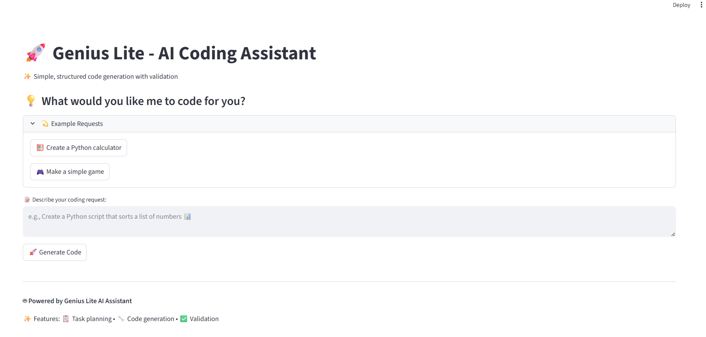

# <span style="color: orange">Aider Genius Lite - AI Coding Assistant

## <span style="color: orange">Overview

Aider Genius Lite is a simple Jac-based Streamlit application for AI-powered code generation with task planning and validation. It provides a clean, intuitive interface for generating code from natural language requests with real-time feedback and validation.

## <span style="color: orange">Features

- Simple, clean interface for code generation requests
- Pre-built example requests for quick testing
- Real-time task progress and results display
- Easy code viewing with syntax highlighting
- AI feedback and validation results
- Separate Jac Streamlit frontend and backend

## <span style="color: orange">Files

- `genius_lite.jac` - Backend with AI logic, task processing, and API endpoints
- `frontend.jac` - Streamlit frontend interface

## <span style="color: orange">Complete Code Preview

Here's what you'll build - a simple AI coding assistant in just **two files**:

=== "Frontend Preview"
    

=== "genius_lite.jac"
    ```jac linenums="1"
    --8<-- "docs/learn/examples/agentic_ai/aider-genius-lite/genius_lite.jac"
    ```

=== "frontend.jac"
    ```jac linenums="1"
    --8<-- "docs/learn/examples/agentic_ai/aider-genius-lite/frontend.jac"
    ```

---

## <span style="color: orange">Setup

### <span style="color: orange">Installation

**Install dependencies:**
   ```bash
   pip install jac-streamlit requests jaclang jac-cloud byllm
   ```

4. **Open your browser** to `http://localhost:8501`

## <span style="color: orange">Usage

1. **Start the backend server:**
   ```bash
   jac serve genius_lite.jac
   ```
   The backend API will be available at `http://localhost:8000`

2. **Launch the frontend (in a new terminal):**
   ```bash
   jac streamlit frontend.jac
   ```
   The web interface will be available at `http://localhost:8501`

## <span style="color: orange">Usage Examples

### <span style="color: orange">Basic Code Generation
Try these example requests:

- "Create a Python calculator with basic math operations"
- "Make a simple number guessing game in Python"

> **Looking for the full version?** This is a lite version for learning purposes. Check out the [full-scale Aider Genius project](https://github.com/jaseci-labs/Agentic-AI/tree/main/aider-genius) for a complete implementation with advanced features.

## <span style="color: orange">Code Architecture Deep Dive

### <span style="color: orange">Task Planning System
The core of Genius Lite's intelligence lies in its task planning system, which:
- Analyzes the complexity and scope of user requests
- Breaks down large problems into smaller, manageable components
- Creates dependency graphs for complex multi-step tasks
- Prioritizes execution order for optimal results

### <span style="color: orange">Code Generation Pipeline
1. **Request Analysis**: Understanding the user's intent and requirements
2. **Context Gathering**: Identifying relevant libraries, frameworks, and patterns
3. **Code Synthesis**: Generating code that meets the specified requirements
4. **Quality Assurance**: Validating syntax, logic, and best practices

### <span style="color: orange">Validation Framework
The validation system ensures code quality through:

- **Syntax Checking**: Validates generated code for syntactic correctness
- **Logic Analysis**: Reviews code flow and potential edge cases
- **Best Practice Compliance**: Ensures adherence to coding standards
- **Security Assessment**: Identifies potential security vulnerabilities


### <span style="color: orange">Integration Options

---

*Aider Genius Lite demonstrates the power of agentic AI for code generation, showcasing how intelligent systems can understand, plan, and execute complex programming tasks autonomously.*
