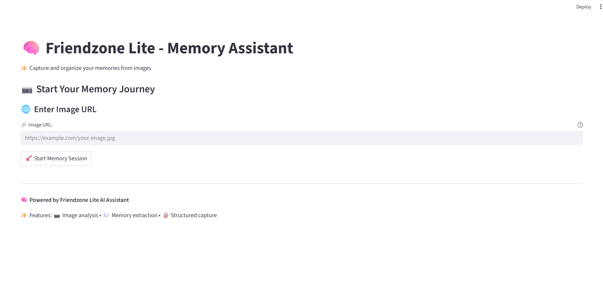

# <span style="color: orange">Friendzone Lite - AI Memory Capture System

## <span style="color: orange">Overview

Friendzone Lite is an AI-powered memory capture and organization system that helps you extract, refine, and structure memories from images through intelligent conversation. It transforms images into structured, searchable memories through natural language interaction.

## <span style="color: orange">Features

### <span style="color: orange">Image-Based Memory Extraction
- Upload images via URL to start memory capture sessions
- AI analyzes visual content to understand the context
- Extracts initial memory details from image content

### <span style="color: orange">Interactive Memory Refinement
- Conversational interface to gather missing details
- AI asks targeted follow-up questions
- Progressive refinement of memory information

### <span style="color: orange">Structured Memory Organization
- **When**: Date information (YYYY-MM-DD format)
- **Who**: People involved in the memory
- **Where**: Locations relevant to the memory
- **What**: Description of what the memory is about

### <span style="color: orange">Completion Tracking
- Real-time progress indication
- Summary generation when details are complete
- Clear completion status with final memory summary

## <span style="color: orange">Architecture

### <span style="color: orange">Core Components
- **Memory Processing Function**: `update_memory_details()` - AI-powered memory extraction and refinement
- **Session Node**: Maintains persistent memory state across interactions
- **Update Walker**: Handles user interactions and memory updates

```jac
obj Response {
    has follow_up_questions: str;    # Next question to ask
    has summary: str;                # Concise memory summary
    has when: str;                   # Date in YYYY-MM-DD format
    has who: List[str];              # Names of people involved
    has what: str;                   # What the memory is about
    has where: List[str];            # Relevant locations
    has terminate_conversation: bool; # Completion flag
    has show_summary: bool;          # Display summary flag
}
```

## <span style="color: orange">Complete Code Preview

Here's what you'll build - an AI memory capture system in just **two files**:

=== "Frontend Preview"
    

=== "friendzone_lite.jac"
    ```jac linenums="1"
    --8<-- "docs/learn/examples/agentic_ai/friendzone-lite/friendzone_lite.jac"
    ```

=== "frontend.jac"
    ```jac linenums="1"
    --8<-- "docs/learn/examples/agentic_ai/friendzone-lite/frontend.jac"
    ```

---

## <span style="color: orange">Usage

1. Install dependencies:
   ```bash
   pip install jac-streamlit requests jaclang jac-cloud byllm
   ```

2. Start the Jac Cloud server:
   ```bash
   jac serve friendzone_lite.jac
   ```

3. Run the frontend:
   ```bash
   jac streamlit frontend.jac
   ```

## <span style="color: orange">Usage Workflow

### <span style="color: orange">Step 1: Image Upload
- Provide an image URL of a photo containing a memory you want to capture
- The system supports various image formats (JPEG, PNG, WebP)
- Images can be from social media, cloud storage, or any accessible web location

### <span style="color: orange">Step 2: Initial Analysis
The AI will:
- Analyze the visual content of your image
- Identify key elements like people, places, and activities
- Generate an initial memory framework
- Ask the first targeted question to gather more details

### <span style="color: orange">Step 3: Conversational Refinement
Engage in a natural conversation where the AI will:
- Ask specific questions about missing details
- Focus on one aspect at a time (when, who, where, what)
- Build upon your previous answers
- Gradually complete the memory profile

### <span style="color: orange">Step 4: Memory Completion
When sufficient details are gathered:
- The AI will indicate the conversation is complete
- A comprehensive summary will be generated
- All memory details will be structured and stored

## <span style="color: orange">Example Memory Capture Session

### <span style="color: orange">Initial Image Analysis
**User uploads:** Beach vacation photo with friends

**AI Initial Response:**
"I can see this appears to be a beach scene with several people. To help me capture this memory completely, when was this photo taken?"

### <span style="color: orange">Conversational Flow
**User:** "This was taken last summer, around July 2024"

**AI:** "Great! I can see there are several people in the photo. Can you tell me who these people are?"

**User:** "That's me with my college friends Sarah and Mike"

**AI:** "Wonderful! Where was this beach vacation? Which beach or location was this at?"

**User:** "This was at Santa Monica Beach in California"

**AI:** "Perfect! What was the occasion or what were you doing during this beach visit?"

**User:** "We were celebrating Sarah's birthday with a beach day trip"

### <span style="color: orange">Final Summary
**Generated Memory:**

- **When:** 2024-07-15
- **Who:** User, Sarah, Mike
- **Where:** Santa Monica Beach, California
- **What:** Beach day celebration for Sarah's birthday

## <span style="color: orange">Advanced Features

### <span style="color: orange">Memory Categories
The system automatically categorizes memories:
- **Social Events**: Gatherings, parties, celebrations
- **Travel Experiences**: Vacations, trips, explorations
- **Personal Milestones**: Achievements, life events
- **Daily Moments**: Casual interactions, routine activities

### <span style="color: orange">Context Enhancement
- **Emotional Context**: Captures feelings and atmosphere
- **Environmental Details**: Weather, time of day, setting
- **Activity Recognition**: Identifies specific actions and events
- **Relationship Mapping**: Understands social connections

### <span style="color: orange">Quality Assurance
- **Consistency Checking**: Validates logical coherence of memory details
- **Completeness Assessment**: Ensures all key aspects are captured
- **Accuracy Verification**: Cross-references visual and textual information

> **Looking for the full version?** This is a lite version for learning purposes. Check out the [full-scale FriendZone project](https://github.com/jaseci-labs/Agentic-AI/tree/main/FriendZone) for a complete implementation with advanced features.

## <span style="color: orange">Technical Implementation

### <span style="color: orange">Visual Analysis Pipeline
1. **Image Processing**: Loads and preprocesses uploaded images
2. **Object Detection**: Identifies people, objects, and scenes
3. **Scene Understanding**: Analyzes context and activities
4. **Initial Memory Extraction**: Creates preliminary memory structure

### <span style="color: orange">Conversational AI System
1. **Question Generation**: Creates contextually relevant follow-up questions
2. **Response Processing**: Analyzes and incorporates user answers
3. **Progress Tracking**: Monitors completion of memory aspects
4. **Dialogue Management**: Maintains conversation flow and coherence

### <span style="color: orange">Memory Storage Format
```json
{
  "memory_id": "unique_identifier",
  "created_at": "timestamp",
  "image_url": "source_image_url",
  "details": {
    "when": "2024-07-15",
    "who": ["User", "Sarah", "Mike"],
    "where": ["Santa Monica Beach", "California"],
    "what": "Beach day celebration for Sarah's birthday"
  },
  "summary": "Comprehensive memory description",
  "conversation_log": ["question_response_pairs"]
}
```

## <span style="color: orange">Customization Options

### Question Templates
Modify questioning strategies for different memory types:

- **Event-focused**: Emphasizes activities and occasions
- **People-centered**: Prioritizes social connections and relationships
- **Location-based**: Focuses on geographical and environmental details
- **Time-sensitive**: Emphasizes chronological and temporal aspects

### Analysis Depth
Configure the level of detail for memory capture:

- **Quick Capture**: Basic who, what, when, where
- **Detailed Analysis**: Extended context and emotional elements
- **Comprehensive Profiling**: Full environmental and social mapping

### Integration Possibilities
- **Photo Libraries**: Connect with Google Photos, iCloud, or other services
- **Social Media**: Import memories from Facebook, Instagram, or Twitter
- **Calendar Integration**: Link memories with calendar events and dates
- **Search Functionality**: Build searchable memory databases

## Use Cases and Applications

### Personal Memory Keeping
- **Family Archives**: Document family events and milestones
- **Travel Journals**: Capture vacation and trip memories
- **Life Documentation**: Record personal achievements and experiences
- **Social Memories**: Preserve moments with friends and loved ones

### Professional Applications
- **Event Documentation**: Corporate events and team building activities
- **Project Milestones**: Capture important project moments
- **Training Records**: Document learning experiences and workshops
- **Client Interactions**: Preserve significant business relationships

### Therapeutic and Wellness
- **Memory Therapy**: Support for individuals with memory challenges
- **Mindfulness Practice**: Intentional memory capture and reflection
- **Gratitude Journaling**: Focus on positive experiences and emotions
- **Life Review**: Systematic documentation of life experiences

## Troubleshooting

### Common Issues

**Image Loading Problems:**
- Verify image URL accessibility and format support
- Check internet connection and firewall settings
- Ensure image file size is within reasonable limits

**Conversation Flow Issues:**
- Provide clear, specific answers to AI questions
- If stuck, try rephrasing or providing additional context
- Restart the session if conversation becomes inconsistent

**Memory Quality Concerns:**
- Be specific and detailed in your responses
- Correct any misunderstandings immediately
- Use follow-up sessions to refine captured memories


---

*Friendzone Lite showcases the potential of combining visual AI with conversational intelligence to create meaningful, structured memory systems that preserve and organize life's important moments.*
