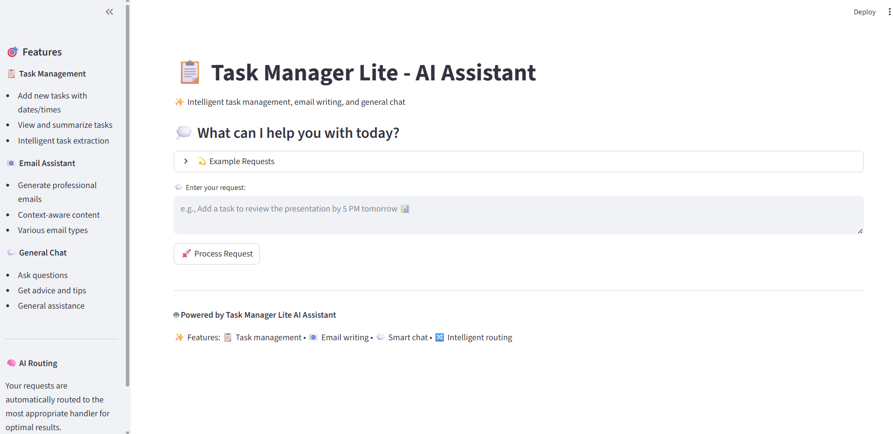

# <span style="color: orange">Task Manager Lite - Intelligent Task Routing System

## <span style="color: orange">Running the Application

1. **Start the backend server:**
   ```bash
   jac serve task_manager.jac
   ```
   The API server will be available at `http://localhost:8000`

2. **Launch the frontend (in a new terminal window):**
   ```bash
   jac streamlit frontend.jac
   ```
   The web interface will be accessible at `http://localhost:8501`

## <span style="color: orange">Usage Examples

Task Management Operationsk Manager Lite is a lightweight AI-powered task management system that intelligently routes user requests to specialized handlers for task management, email writing, and general conversation.

## <span style="color: orange">Features

### <span style="color: orange">Intelligent Routing
- Automatically determines the best handler for your request
- Routes to specialized nodes: TaskHandling, EmailHandling, or GeneralChat
- Uses AI-powered classification for accurate routing

### <span style="color: orange">Task Management
- **Add Tasks**: Create tasks with dates and times
- **Task Summarization**: Get summaries of all scheduled tasks
- **Smart Extraction**: Automatically extracts task details from natural language

### <span style="color: orange">Email Writing
- Generate professional emails for various purposes
- Context-aware email content creation
- Support for different email types (meetings, follow-ups, etc.)

### <span style="color: orange">General Chat
- Ask questions and get intelligent responses
- Get advice on productivity and time management
- General AI assistance for various topics

## <span style="color: orange">Architecture

### <span style="color: orange">Nodes
- **TaskHandling**: Manages task creation, scheduling, and summarization
- **EmailHandling**: Handles email content generation
- **GeneralChat**: Provides general AI conversation capabilities

### <span style="color: orange">Walker
- **task_manager**: Main walker that routes requests and coordinates responses

## <span style="color: orange">Complete Code Preview

Here's what you'll build - an intelligent task routing system in just **two files**:

=== "Frontend Preview"
    

=== "task_manager.jac"
    ```jac linenums="1"
    --8<-- "docs/learn/examples/agentic_ai/task-manager-lite/task_manager.jac"
    ```

=== "frontend.jac"
    ```jac linenums="1"
    --8<-- "docs/learn/examples/agentic_ai/task-manager-lite/frontend.jac"
    ```

---

## <span style="color: orange">Usage

1. Install dependencies:
   ```bash
   pip install jac-streamlit requests jaclang jac-cloud byllm
   ```

1. Start the Jac Cloud server:
   ```bash
   jac serve task_manager.jac
   ```

2. Run the frontend:
   ```bash
   jac streamlit frontend.jac
   ```

### <span style="color: orange">Task Management
- "Add a task to buy groceries tomorrow at 3 PM"
- "Schedule a meeting with the team for Friday at 10 AM"
- "Summarize all my tasks"

### <span style="color: orange">Email Writing
- "Write an email to schedule a meeting with my team"
- "Create a follow-up email for the project update"
- "Write a professional email to request a deadline extension"

### <span style="color: orange">General Chat
- "What are the best practices for time management?"
- "How can I be more productive at work?"
- "What was the most popular programming language in 2020?"

## <span style="color: orange">Requirements

- Python 3.8+
- JAC (Jaseci Action Circuit)
- Streamlit (for frontend)
- OpenAI API key (for GPT-4)

## <span style="color: orange">Configuration

The system uses GPT-4 by default. You can modify the model in `task_manager.jac`:

```jac
glob llm = Model(model_name="gpt-4o");
```

> **Looking for the full version?** This is a lite version for learning purposes. Check out the [full-scale Task Manager project](https://github.com/jaseci-labs/Agentic-AI/tree/main/task_manager) for a complete implementation with advanced features.

## <span style="color: orange">File Structure

1. **Install required dependencies:**
   ```bash
   pip install jac-streamlit jaclang datetime byllm jac-cloud
   ```

### Running the Application

1. **Start the backend server:**
   ```bash
   jac serve task_manager.jac
   ```
   The API server will be available at `http://localhost:8000`

2. **Launch the frontend interface:**
   ```bash
   jac streamlit frontend.jac
   ```
   The web interface will be accessible at `http://localhost:8501`

## Usage Examples

### Task Management Operations

**Creating Tasks:**
```
"Schedule a team meeting with the development team next Tuesday at 2 PM"
"Remind me to call the client about the project update tomorrow morning"
"Add a deadline for the quarterly report submission on March 15th"
```

**Task Queries:**
```
"What do I have scheduled for next week?"
"Show me all my high-priority tasks"
"Summarize my meetings for this month"
```

### <span style="color: orange">Email Generation

**Meeting Invitations:**
```
"Write an email inviting the team to a project kickoff meeting"
"Create a follow-up email for the client presentation yesterday"
```

**Professional Communications:**
```
"Draft an email updating stakeholders on project progress"
"Write a professional response declining a meeting request"
```

### <span style="color: orange">General Chat and Assistance

**Productivity Questions:**
```
"What are some effective time management strategies for remote work?"
"How can I better organize my daily tasks?"
"What's the best way to handle multiple project deadlines?"
```

**Information Requests:**
```
"Explain the Pomodoro technique"
"What are common productivity tools for teams?"
```

## <span style="color: orange">Technical Deep Dive


### <span style="color: orange">Task Extraction Algorithm

Natural language processing extracts structured task information:

```jac
obj Task {
    has title: str;
    has description: str;
    has due_date: str;
    has priority: str;
    has status: str;
    has assignee: str;
}
```

### <span style="color: orange">Email Template System

Dynamic email generation based on context and purpose:

```jac
obj EmailTemplate {
    has subject: str;
    has greeting: str;
    has body: str;
    has closing: str;
    has tone: str; # formal, casual, urgent
}
```

## <span style="color: orange">Advanced Features

### <span style="color: orange">Smart Scheduling
- **Conflict Detection**: Identifies scheduling conflicts automatically
- **Optimal Time Suggestions**: Proposes best meeting times based on availability
- **Calendar Integration**: Syncs with external calendar systems
- **Timezone Handling**: Manages tasks across different time zones

### <span style="color: orange">Task Dependencies
- **Prerequisite Tracking**: Manages task dependencies and ordering
- **Automatic Prioritization**: Adjusts task priorities based on dependencies
- **Progress Monitoring**: Tracks completion of dependent tasks
- **Bottleneck Identification**: Highlights tasks blocking project progress

### <span style="color: orange">Email Context Integration
- **Task-Aware Emails**: Incorporates relevant task information in emails
- **Meeting Summaries**: Generates emails with meeting outcomes and action items
- **Status Updates**: Creates progress reports based on task completion
- **Reminder Emails**: Automated follow-ups for upcoming deadlines

### <span style="color: orange">Learning and Adaptation
- **User Pattern Recognition**: Learns from user preferences and habits
- **Improved Routing**: Enhances intent classification over time
- **Personalized Responses**: Adapts communication style to user preferences
- **Context Memory**: Maintains long-term conversation context


## <span style="color: orange">Future Integration Improvements

### Calendar Systems
- **Google Calendar**: Sync tasks and events with Google Calendar
- **Outlook Integration**: Connect with Microsoft Outlook and Exchange
- **Calendar APIs**: Support for various calendar service APIs
- **ICS Export**: Generate standard calendar files for import

### Communication Platforms
- **Slack Integration**: Send task updates and reminders via Slack
- **Microsoft Teams**: Integrate with Teams for collaborative task management
- **Email Services**: Connect with SMTP servers for automated email sending
- **Notification Systems**: Push notifications for task deadlines and updates

### Project Management Tools
- **Jira Sync**: Synchronize with Jira for software development projects
- **Trello Integration**: Connect with Trello boards and cards
- **Asana Compatibility**: Import and export tasks to Asana projects
- **Custom APIs**: Flexible integration with proprietary systems

## Performance Optimization

### Scalability Features
- **Async Processing**: Handle multiple requests concurrently
- **Caching Systems**: Cache frequent responses and classifications
- **Load Balancing**: Distribute requests across multiple handler instances
- **Database Optimization**: Efficient storage and retrieval of tasks and emails

### Response Time Optimization
- **Predictive Loading**: Pre-load common responses and templates
- **Smart Caching**: Cache personalized responses for frequent users
- **Batch Processing**: Handle multiple similar requests efficiently
- **Resource Management**: Optimal allocation of computational resources

## Security and Privacy

### Data Protection
- **Encryption**: Secure storage of tasks and personal information
- **Access Control**: Role-based permissions for multi-user environments
- **Audit Logging**: Track all system interactions and modifications
- **Data Anonymization**: Protect sensitive information in logs and analytics

### Authentication and Authorization
- **User Authentication**: Secure login and session management
- **API Security**: Token-based authentication for API access
- **Permission Management**: Fine-grained control over feature access
- **Single Sign-On**: Integration with enterprise authentication systems

## Monitoring and Analytics

### Usage Analytics
- **Request Patterns**: Analysis of common user requests and intents
- **Handler Performance**: Metrics on routing accuracy and response quality
- **User Satisfaction**: Feedback collection and satisfaction measurement
- **System Health**: Monitoring of system performance and availability

### Improvement Metrics
- **Classification Accuracy**: Intent recognition success rates
- **Response Quality**: User ratings of generated content
- **Task Completion Rates**: Success metrics for task management features
- **User Engagement**: Metrics on user interaction and retention

---

*Task Manager Lite demonstrates the power of intelligent routing and specialized handling in agentic AI systems, showing how different capabilities can be combined to create comprehensive and effective task management solutions.*
