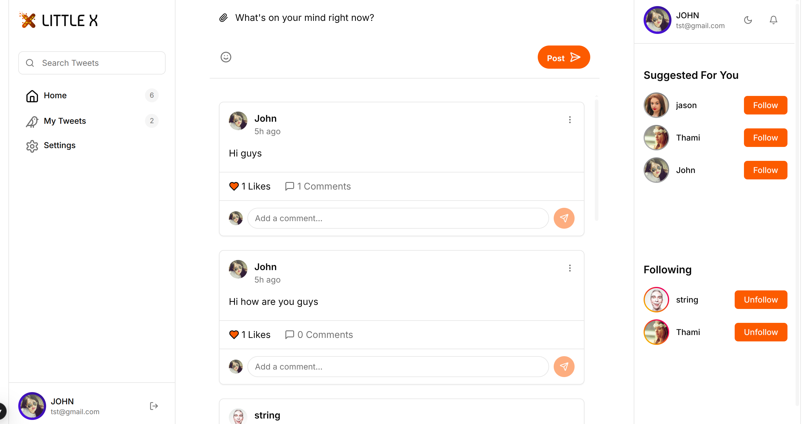

# LittleX Tutorial for Beginners

Welcome to the **LittleX tutorial**! This comprehensive guide is designed especially for beginners who want to learn Jaseci by building a simple Twitter-like application called **LittleX**. We'll break everything down into simple, digestible steps with clear explanations.

---

## What is Jaseci?

**Jaseci** is a powerful programming framework that makes building AI applications easier and more intuitive. Think of it as a comprehensive toolbox that enables you to:

- **Store data** in a connected graph structure (like a social network)
- **Navigate** through this graph to perform complex actions
- **Add AI capabilities** without complex coding requirements

---

## What We'll Build: LittleX

**LittleX** is a simplified yet functional version of Twitter that allows users to:

- **Create accounts** and personalized profiles
- **Post short messages** (tweets) with rich content
- **Follow other users** to build their network
- **View a personalized feed** of posts from people they follow

### Complete Implementation

*Just **200 lines of code** to build a full social media platform!*

=== "Frontend Preview"
    

=== "LittleX.jac"
    ```jac linenums="1"
    --8<-- "docs/learn/examples/littleX/src/littleX.jac:17:125"
    ```

=== "LittleX.impl.jac"
    ```jac linenums="1"
    --8<-- "docs/learn/examples/littleX/src/littleX.impl.jac:9:121"
    ```

=== "LittleX.test.jac"
    ```jac linenums="1"
    --8<-- "docs/learn/examples/littleX/src/littleX.test.jac:1:88"
    ```

---

## Getting Started

### Step 1: Install Jaseci

First, let's install the required Jaseci libraries on your computer:

```bash
pip install jac_cloud
```

### Step 2: Get the LittleX Code

Clone the repository and navigate to the project directory:

```bash
git clone https://github.com/Jaseci-Labs/littleX.git
cd littleX
```

### Step 3: Install Dependencies

Install backend and frontend dependencies:

```bash
# Install backend dependencies
pip install -r littleX_BE/requirements.txt

# Install frontend dependencies
cd littleX_FE
npm install
cd ..
```

---

## Understanding Jaclang's Building Blocks

Jaclang has **three main components** that form the foundation of our LittleX application:

### Project File Structure

Before diving into the components, let's understand how LittleX organizes its code using Jaseci's **three-file pattern**:

#### **littleX.jac** - The Blueprint
Contains all **declarations** (what your application has):

```jac
# Defines what exists
node Profile {
    has username: str;
    can update with update_profile entry;
}

walker create_tweet(visit_profile) {
    has content: str;
}
```

#### **littleX.impl.jac** - The Implementation
Contains all **implementations** (how your application works):

```jac
# Defines how things work
impl Profile.update {
    self.username = here.new_username;
    report self;
}

impl create_tweet.tweet {
    # Actual tweet creation logic
}
```

#### **littleX.test.jac** - The Tests
Contains **test cases** (proving your application works):

```jac
# Verifies functionality
test create_tweet {
    root spawn create_tweet(content = "Hello World");
    tweet = [root --> (?Profile) --> (?Tweet)][0];
    check tweet.content == "Hello World";
}
```

#### **How to Run**
```bash
# Run the application (auto-loads impl)
jac run littleX.jac

# Run tests (auto-loads impl + tests)
jac test littleX.jac

# Start API server (auto-loads impl)
jac serve littleX.jac
```

> **Key Insight**: Jaseci automatically links these files together - you define the structure once, implement separately, and test comprehensively!

### 1. Nodes (The "Things")

**Nodes** are objects that store data and represent entities in your application. In LittleX, we have:

- **User nodes** → Store profile information
- **Post nodes** → Store tweet content and metadata
- **Comment nodes** → Store comments on tweets

**Example: Simple User Node**
```jac
node user {
    has username: str;
}
```

> This code creates a user object with a username property.

### 2. Edges (The "Connections")

**Edges** connect nodes to represent relationships between entities. In LittleX, we have:

- **Follow edges** → User follows another user
- **Post edges** → User created a post
- **Like edges** → User liked a post

**Example: Simple Follow Edge**
```jac
edge Follow {}
```

> This creates a "Follow" connection that links users together.

### 3. Walkers (The "Actions")

**Walkers** are like functions that move through your graph and perform actions. They're what makes things happen in your application!

**Example: Tweet Creation Walker**
```jac
walker create_tweet(visit_profile) {
    has content: str;
    can tweet with Profile entry;
}

impl create_tweet.tweet {
    embedding = sentence_transformer.encode(self.content).tolist();
    tweet_node = here +>:Post:+> Tweet(content=self.content, embedding=embedding);
    grant(tweet_node[0], level=ConnectPerm);
    report tweet_node;
}
```

> This walker creates a new post with the provided content and links it to the current user.

---

## Building LittleX Step by Step

Now let's see how these pieces come together to build our social media application:

### 1. User Profile Creation

When a new user registers, the system:

1. Creates a new user node
2. Stores their username and profile data

```jac
walker visit_profile {
    can visit_profile with `root entry;
}

impl visit_profile.visit_profile {
    visit [-->(`?Profile)] else {
        new_profile = here ++> Profile();
        grant(new_profile[0], level=ConnectPerm);
        visit new_profile;
    }
}
```

### 2. Creating Posts

After logging in, users can create and share posts:

```jac
walker create_tweet(visit_profile) {
    has content: str;
    can tweet with Profile entry;
}

impl create_tweet.tweet {
    embedding = sentence_transformer.encode(self.content).tolist();
    tweet_node = here +>:Post:+> Tweet(content=self.content, embedding=embedding);
    grant(tweet_node[0], level=ConnectPerm);
    report tweet_node;
}
```

### 3. Following Users

Users can build their network by following each other:

```jac
walker follow_request {}

impl Profile.follow {
    current_profile = [root-->(`?Profile)];
    current_profile[0] +>:Follow():+> self;
    report self;
}
```

### 4. Viewing Feed

Display posts from people the user follows:

```jac
walker load_feed(visit_profile) {
    has search_query: str = "";
    has results: list = [];
    can load with Profile entry;
}

impl load_feed.load {
    visit [-->(`?Tweet)];
    for user_node in [->:Follow:->(`?Profile)] {
        visit [user_node-->(`?Tweet)];
    }
    report self.results;
}
```

---

## Run LittleX Locally

Let's get your application up and running:

### Step 1: Start the Backend Server

```bash
jac serve littleX_BE/littleX.jac
```

> **Success**: Your backend server should now be running!

### Step 2: Start the Frontend

Open a **new terminal** and run:

```bash
cd littleX_FE
npm run dev
```

> **Success**: Your frontend development server is now active!

### Step 3: Use the Application

1. **Open your browser** to: [`http://localhost:5173`](http://localhost:5173)

2. **Try these features**:
   - Creating a new account
   - Posting some tweets
   - Following other users
   - Checking your personalized feed

---

## Exploring the LittleX Code

Let's examine some key components of the actual LittleX application:

### The Profile Node

```jac
node Profile {
    has username: str = "";

    can update with update_profile entry;
    can get with get_profile entry;
    can follow with follow_request entry;
    can un_follow with un_follow_request entry;
}
```

> This node represents a user profile with username and comprehensive social media abilities.

### The Tweet Node

```jac
node Tweet {
    has content: str;
    has embedding: list;
    has created_at: str = datetime.datetime.now().strftime("%Y-%m-%d %H:%M:%S");

    can update with update_tweet exit;
    can delete with remove_tweet exit;
    can like_tweet with like_tweet entry;
    can remove_like with remove_like entry;
    can comment with comment_tweet entry;

    def get_info() -> TweetInfo;
    can get with load_feed entry;
}
```

> This node represents a tweet with rich metadata and full social interaction capabilities.

### The Follow Ability

```jac
impl Profile.follow {
    current_profile = [root-->(`?Profile)];
    current_profile[0] +>:Follow():+> self;
    report self;
}
```

> This implementation creates a follow relationship between user profiles.

---

<!-- ## Adding AI Features

Jaseci makes integrating AI into your application incredibly simple. Here's an example that summarizes tweets using AI:

```jac
import from mtllm.llms {Ollama}
glob llm = Ollama(host="http://127.0.0.1:11434", model_name="llama3.2:1b");

can 'Summarize latest trends, major events, and notable interactions from the recent tweets in one line.'
    summarise_tweets(tweets: list[str]) -> 'Summarisation': str by llm();
```

> This code leverages a Llama language model to automatically summarize tweet collections.

--- -->

## Try These Exercises

Ready to expand your skills? Try implementing these features:

1. **Add a like system** for posts
2. **Create profile pages** that display user-specific posts
3. **Implement user search** functionality by username
4. **Add comment threading** for deeper conversations

---

## Conclusion

**Congratulations!** You've successfully learned how to build a complete social media application with Jaseci. You now understand how:

- **Nodes** store and organize your application data
- **Edges** create meaningful relationships between entities
- **Walkers** perform complex actions and business logic

Jaseci's **graph-based approach** makes it perfect for social networks and other applications where connections between data are crucial for functionality.

---

## Next Steps

Ready to dive deeper? Explore these resources:

- [**Jaseci Documentation**](https://jac-lang.org/) - Comprehensive guides
- [**Full LittleX Guide**](full_guide.md) - Advanced features and enterprise patterns
<!-- - [**Jac Book**](../../jac_book/chapter_1.md) - Build more complex applications -->

> **Happy coding with Jaseci!** 🚀
