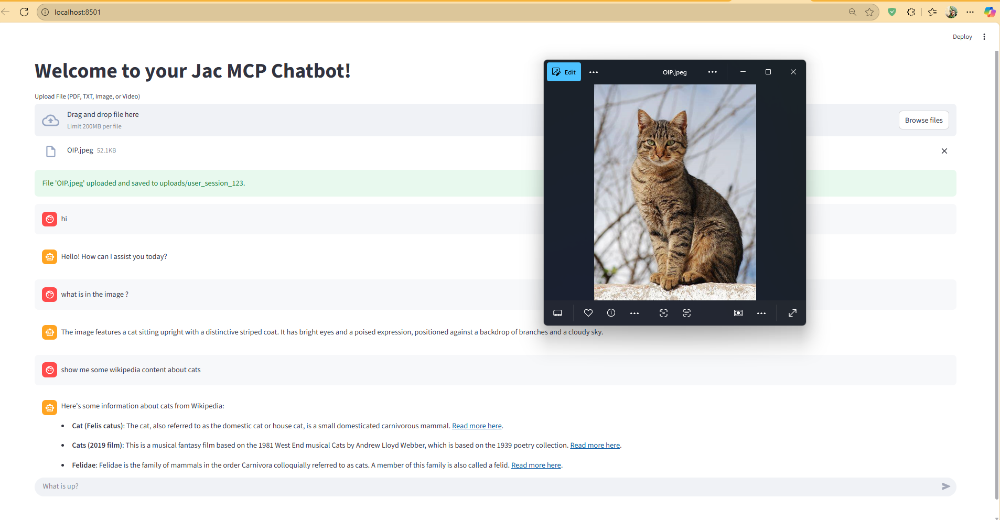

# Build an AI-Powered Multimodal MCP Chatbot

This step-by-step guide will walk you through building a modern chatbot that can chat with your documents, images, and videos. By the end, you'll have a working multimodal AI assistant and understand how to use Jac's unique programming features to build intelligent applications.

## What You'll Build

You'll create a chatbot that can:

- Upload and chat with PDFs, text files, images, and videos
- Search your documents and provide context-aware answers
- Answer general questions using web search
- Understand and discuss images and videos using AI vision
- Route different types of questions to specialized AI handlers



*The AI-powered chatbot in action, demonstrating its multi modality and mcp tool calling while maintaining conversational context.*

## What You'll Learn

- **Object Spatial Programming**: Use Jac's node-walker architecture to organize your application
- **Mean Typed Programming (MTP)**: Let AI classify and route user queries automatically with just simple definitions
- **Model Context Protocol (MCP)**: Build modular, reusable AI tools
- **Multimodal AI**: Work with text, images, and videos in one application

## Technologies We'll Use

- **Jac Language**: For the main application logic
- **Jac Cloud**: Backend server infrastructure
- **Streamlit**: User-friendly web interface
- **ChromaDB**: Document search and storage
- **OpenAI GPT**: AI chat and vision capabilities
- **Serper API**: Real-time web search

## Project Structure

We'll create five main files:

- `client.jac`: The web interface for chat and file uploads
- `server.jac`: The main application using Object Spatial Programming
- `mcp_server.jac`: Tool server for document search and web search
- `mcp_client.jac`: Interface to communicate with tools
- `tools.jac`: Document processing and search logic

## Step 1: Set Up Your Environment

First, install the required packages. We recommend Python 3.12 or newer:

```bash
pip install jaclang jac-cloud jac-streamlit byllm langchain langchain-community langchain-openai langchain-chroma chromadb openai pypdf tiktoken requests mcp[cli] anyio
```

Next, get your API keys. You'll need an OpenAI API key for the AI features. For web search, get a free API key from [Serper](https://serper.dev/).

Set your environment variables:

```bash
export OPENAI_API_KEY=<your-openai-key>
export SERPER_API_KEY=<your-serper-key>
```

If you see no errors, you're ready to start building!

## Step 2: Build the Document Processing Engine

We'll start by creating the core engine that processes and searches your documents. Create `tools.jac`:

=== "tools.jac"
    ```jac linenums="1"
    --8<-- "docs/learn/examples/rag_chatbot/solution/tools.jac"
    ```

This engine is the foundation of your chatbot. It processes your uploaded documents, splits them into chunks, creates embeddings, and stores them for efficient search. Let's break down what it does:

- **Document Processing**: Reads PDFs and text files, extracting their content
- **Text Chunking**: Splits large documents into smaller, searchable pieces
- **Vector Embeddings**: Converts text into numerical representations for semantic search
- **Storage**: Uses ChromaDB to store and index your documents

## Step 3: Build the Tool Server

Now create the MCP server that exposes document search and web search as tools. Create `mcp_server.jac`:

=== "mcp_server.jac"
    ```jac linenums="1"
    --8<-- "docs/learn/examples/rag_chatbot/solution/mcp_server.jac"
    ```

This server exposes two tools: one for searching your uploaded documents and another for web search. The FastMCP framework makes it easy to create these modular tools that your main application can use.

## Step 4: Create the Tool Interface

Next, create `mcp_client.jac` to communicate with your tool server:

=== "mcp_client.jac"
    ```jac linenums="1"
    --8<-- "docs/learn/examples/rag_chatbot/solution/mcp_client.jac"
    ```

This client handles the communication between your main application and the tools.

## Step 5: Create the Main Application with Object Spatial Programming

Now for the core application logic. Create `server.jac`:

=== "server.jac"
    ```jac linenums="1"
    --8<-- "docs/learn/examples/rag_chatbot/solution/server.jac"
    ```

Let's break down what we just built:

**Router Node**: This is the brain of your application. It uses Mean Typed Programming (MTP) to automatically classify user questions and route them to the right specialist.

**Specialized Chat Nodes**: Each type of question gets its own expert:

- `RagChat`: Handles document-based questions
- `QAChat`: Manages general questions and web search
- `ImageChat`: Processes image-related conversations
- `VideoChat`: Handles video discussions

**Session Management**: The `Session` node keeps track of each user's conversation history and uploaded files.

**Walkers**: These handle the flow of your application:

- `infer`: Routes questions to the right chat node
- `interact`: Manages conversations and maintains session state
- `upload_file`: Processes file uploads

## Step 6: Build the Web Interface

Finally, create the user-friendly interface with `client.jac`:

=== "client.jac"
    ```jac linenums="1"
    --8<-- "docs/learn/examples/rag_chatbot/solution/client.jac"
    ```

This creates a clean, intuitive interface where users can register, log in, upload files, and chat with the AI.

## Step 7: Run Your Application

Now let's see your creation in action! You'll need three terminal windows:

**Terminal 1 - Start the tool server:**
```bash
jac run mcp_server.jac
```

**Terminal 2 - Start the main application:**
```bash
jac serve server.jac
```

**Terminal 3 - Launch the web interface:**
```bash
jac streamlit client.jac
```

If everything starts successfully, open your browser and go to the Streamlit URL (typically `http://localhost:8501`).

## Step 8: Test Your Chatbot

1. **Register and log in** using the web interface
2. **Upload some files**: Try PDFs, text files, images, or videos
3. **Start chatting**: Ask questions about your uploaded content or general questions

The system will automatically route your questions:

- Document questions go to the RAG system
- General questions use web search
- Image questions use vision AI
- Video questions analyze video content

## Understanding the Architecture

Your application uses Jac's Object Spatial Programming to create a clean, modular design:

**Nodes** represent different parts of your system (Router, Chat types, Sessions). Each node has specific responsibilities and capabilities.

**Walkers** move through your node network, carrying information and executing logic. They represent the actions your system can perform.

**Mean Typed Programming (MTP)** lets AI automatically classify and route requests, making your application intelligent without complex rule-based logic.

## What You've Accomplished

Congratulations! You've built a sophisticated AI application that demonstrates several advanced concepts:

- **Multimodal AI capabilities** that work with text, images, and videos
- **Intelligent routing** using AI-based classification
- **Modular architecture** with reusable tools via MCP
- **Clean separation of concerns** using Object Spatial Programming
- **Real-time web search integration**
- **Efficient document search** with vector embeddings

## Extending Your Chatbot

Your chatbot is designed to be extensible. You could add:

- **New file types**: Support for audio files, spreadsheets, or presentations
- **Additional tools**: Weather APIs, database connections, or custom business logic
- **Enhanced AI models**: Different LLMs for specialized tasks
- **Advanced search**: Hybrid search combining keyword and semantic search
- **Custom chat nodes**: Specialized handlers for domain-specific questions

## Troubleshooting

If you run into issues:

- **Dependencies**: Make sure all packages are installed and compatible with your Python version
- **Server startup**: Start the MCP server before the main server
- **File uploads**: Check server logs if uploads fail, and verify supported file types
- **API keys**: Verify your OpenAI and Serper API keys are set correctly
- **Ports**: Ensure all three services are running on their respective ports

## API Reference

Your application exposes these main endpoints:

- `POST /user/register` — Create a new user account
- `POST /user/login` — Login and get an access token
- `POST /walker/upload_file` — Upload files (requires authentication)
- `POST /walker/interact` — Chat with the AI (requires authentication)

Visit `http://localhost:8000/docs` to see the full API documentation.

---

You now have the foundation to build sophisticated AI applications using Jac's unique programming paradigms. The combination of Object Spatial Programming, Mean Typed Programming, and modular tool architecture gives you a solid base for creating intelligent, scalable applications.
