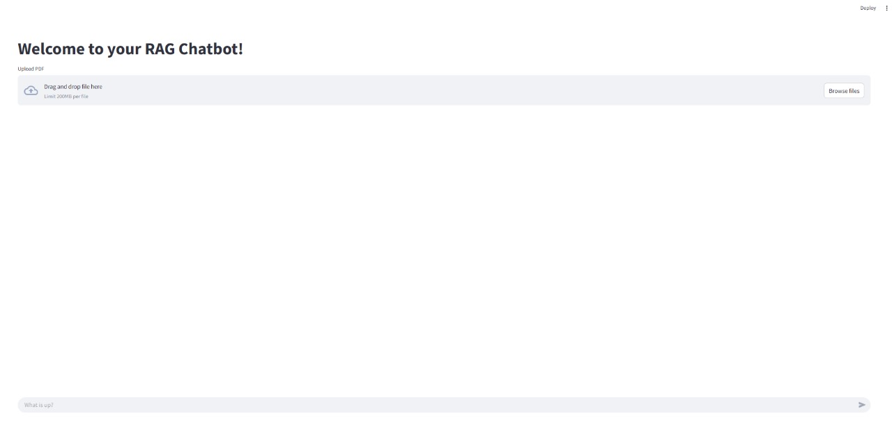

# MCP Chatbot Overview

This project demonstrates a modern Retrieval-Augmented Generation (RAG) chatbot built using the Jac programming language, MTLLM, Jac Cloud, and Model Context Protocol (MCP) servers. It combines document ingestion, semantic search, multimodal capabilities, and large language models (LLMs) to deliver a conversational AI experience that can answer questions based on your own documents, images, videos, and real-time web search.

## Key Features

- **Multimodal Upload & Processing**: Upload PDF, text files, images, and videos, which are automatically processed and indexed for semantic and multimodal search.
- **Retrieval-Augmented Generation**: Combines LLMs with document retrieval for accurate, context-aware answers.
- **Multimodal Chat**: Users can chat about uploaded images and videos, not just text documents, using advanced multimodal LLMs.
- **Web Search Integration**: Augments responses with real-time web search results using Serper API.
- **MCP Server Architecture**: Uses Model Context Protocol with FastMCP for modular tool management and better scalability.
- **Object Spatial Programming**: Leverages Jac's unique node-walker architecture for intelligent routing and task handling.
- **Mean Typed Programming (MTP)**: Uses LLM-based classification to route queries to specialized nodes (RAG, QA, IMAGE, VIDEO).
- **Streamlit Frontend**: User-friendly chat interface for interacting with the bot and uploading documents, images, and videos.
- **API Server**: RESTful endpoints for chat, multimodal file upload, and more, powered by Jac Cloud.
- **Session Management**: Maintains chat history and user sessions with file context.

## Technologies Used
- **Jac Language**: Object Spatial Programming with nodes and walkers
- **Mean Typed Programming (MTP)**: LLM-based query classification and routing
- **Jac Cloud**: Backend infrastructure and a Production ready server
- **Model Context Protocol (MCP)** with FastMCP for tool management
- **LangChain, ChromaDB, PyPDF**: Document processing and vector storage
- **Streamlit**: Frontend interface
- **Serper API**: Real-time web search

## Architecture

- **client.jac**: Implements the Streamlit-based frontend for chat and multimodal file upload (PDFs, images, videos).
- **server.jac**: Hosts the API using Object Spatial Programming with Router, Session, and specialized Chat nodes (RagChat, QAChat, ImageChat, VideoChat). Uses Mean Typed Programming for intelligent routing.
- **mcp_server.jac**: FastMCP server that exposes document search and web search tools.
- **mcp_client.jac**: Client interface for communicating with MCP servers.
- **tools.jac**: Contains the RAG engine and web search implementations used by the MCP server.

### Node-Walker Architecture
- **Router Node**: Classifies user queries using MTP to route to appropriate chat nodes
- **Chat Nodes**: Specialized nodes for different interaction types (RAG, QA, IMAGE, VIDEO)
- **Session Node**: Manages user sessions and chat history
- **Walkers**: `infer` walker handles routing logic, `interact` walker manages sessions, `upload_file` walker processes file uploads


=== "Frontend Preview"
    

=== "client.jac"
    ```jac linenums="1"
    --8<-- "docs/learn/examples/rag_chatbot/solution/client.jac"
    ```

=== "mcp_server.jac"
    ```jac linenums="1"
    --8<-- "docs/learn/examples/rag_chatbot/solution/mcp_server.jac"
    ```

=== "mcp_client.jac"
    ```jac linenums="1"
    --8<-- "docs/learn/examples/rag_chatbot/solution/mcp_client.jac"
    ```

=== "server.jac"
    ```jac linenums="1"
    --8<-- "docs/learn/examples/rag_chatbot/solution/server.jac"
    ```

=== "tools.jac"
    ```jac linenums="1"
    --8<-- "docs/learn/examples/rag_chatbot/solution/tools.jac"
    ```

---

## How to Run

Install the necessary dependencies
```bash
pip install jaclang jac-cloud jac-streamlit mtllm langchain langchain-community langchain-openai langchain-chroma chromadb openai pypdf tiktoken requests mcp[cli] anyio
```

To use the Web Search, get a free API key from [Serper](https://serper.dev/).
```bash
export OPENAI_API_KEY=<your-openai-key>
export SERPER_API_KEY=<your-serper-key>
```

To run the MCP server (in one terminal)
```bash
jac run mcp_server.jac
```

To run the main server (in another terminal)
```bash
jac serve server.jac
```

To run the frontend (in a third terminal)
```bash
jac streamlit client.jac
```


For full setup instructions and advanced usage, see `Full Guide`.
