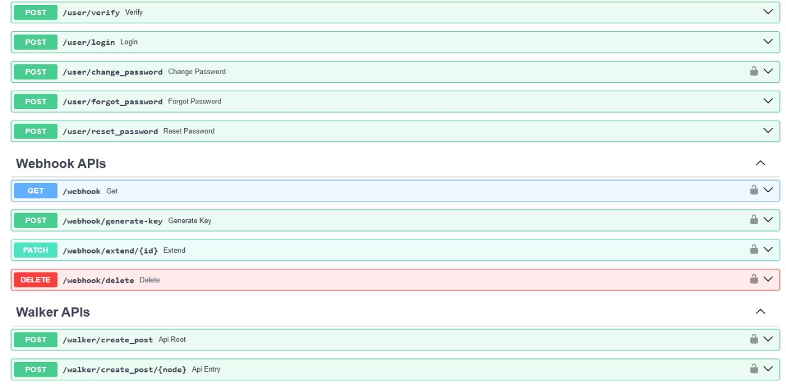

<h1 style="color: orange; font-weight: bold; text-align: center;">Tour of Jac</h1>

## Python Superset Philosophy: All of Python Plus More

Jac is a drop-in replacement for Python and supersets Python, much like Typescript supersets Javascript or C++ supersets C. It extends Python's semantics while maintaining full interoperability with the Python ecosystem, introducing cutting-edge abstractions designed to minimize complexity and embrace AI-forward development.

<div class="code-block">
```jac
import math;
import from random { uniform }

def calc_distance(x1: float, y1: float, x2: float, y2: float) -> float {
return math.sqrt((x2 - x1) ** 2 + (y2 - y1) ** 2);
}

with entry { # Generate random points
(x1, y1) = (uniform(0, 10), uniform(0, 10));
(x2, y2) = (uniform(0, 10), uniform(0, 10));

    distance = calc_distance(x1, y1, x2, y2);
    area = math.pi * (distance / 2) ** 2;

    print("Distance:", round(distance, 2), ", Circle area:", round(area, 2));

}

```
</div>

This snippet natively imports Python packages `math` and `random` and runs identically to its Python counterpart. Jac targets Python bytecode, so all Python libraries work with Jac.


## Beyond OOP with Object-Spatial Programming

Object-Spatial Programming (OSP) inverts the traditional relationship between data and computation. Rather than moving data to computation, OSP moves computation to data through topologically aware constructs. This paradigm introduces specialized archetypes—objects, nodes, edges and walkers—that model spatial relationships directly in the language and enable optimizations around data locality and distributed execution.    |

### 🎮 Spatial Game Example

**"Think of your data as an enemy spy network. In OOP, you'd sit at a desk phoning known contacts. In Jac, you deploy a Secret Agent (a walker) who infiltrates the network, moving from one safehouse to the next to uncover the entire plot on their own."**

This example shows how computation flows spatially rather than centrally:

<div class="code-block">
```jac
# Define game stage nodes with properties
node GameStage {
    has name: str,
    frame_time: float = 0.0;
}

# Walker that travels between game stages
walker RenderWalk {
    has fps: int = 60;  # Target frames per second

    # Process each GameStage when walker arrives
    can process with GameStage entry {
        print(f"Processing {here.name} stage");

        # Calculate frame time based on FPS
        here.frame_time = 1000.0 / self.fps;  # ms per frame

        # Move to next connected stage
        visit [-->];  # Follow outgoing edges
    }
}

# Entry point - construct the game stage flow
with entry {
    # Create the first stage
    input_stage = GameStage(name="Input");

    # Connect Stages using spatial connections
    input_stage ++> GameStage(name="Update") ++>
                    GameStage(name="Render") ++>
                    GameStage(name="Present");

    # Spawn walker to begin traversal
    RenderWalk() spawn input_stage;
}
```

</div>

A walker travels through game stages using edges, demonstrating Object-Spatial Programming.

### 🔄 Traditional OOP vs 🚀 Object-Spatial Programming

| **Traditional OOP**                                       | **Object-Spatial Programming**                                |
| --------------------------------------------------------- | ------------------------------------------------------------- |
| • **Centralized Control**: Logic pulls data to itself     | • **Distributed Execution**: Logic travels to data            |
| • **Global Loops**: `for stage in stages: compute(stage)` | • **Spatial Awareness**: Walker visits GameStage nodes        |
| • **Data Movement**: Objects moved to processing units    | • **Data Locality**: Computation happens where data lives     |
| • **Rigid Structure**: Hard-coded execution patterns      | • **Composable Flows**: Stages as nodes, transitions as edges |
| • **Single Machine**: Difficult to distribute             | • **Scale-Ready**: Walkers can traverse across devices        |

## Programming Abstractions for AI

Jac provides novel constructs for integrating LLMs into code. A function body can simply be replaced with a call to an LLM, removing the need for prompt engineering or extensive use of new libraries.

```jac
import from mtllm.llms { Gemini }
glob llm = Gemini(model_name="gemini-2.0-flash");

enum Personality {
    INTROVERT = "Introvert",
    EXTROVERT = "Extrovert",
    AMBIVERT = "Ambivert"
}

def get_personality(name: str) -> Personality by llm();

with entry {
    name = "Albert Einstein";
    result = get_personality(name);
    print(f"{result.value} personality detected for {name}");
}
```

!!! info "How To Run"
    1. Install the MTLLM plugin by `pip install mtllm[google]`
    2. Get a free Gemini API key: Visit [Google AI Studio](https://aistudio.google.com/app/apikey)
    3. Save your Gemini API as an environment variable (`export GEMINI_API_KEY="xxxxxxxx"`). > **Note:** > > You can use OpenAI, Anthropic or other API services as well as host your own LLM using Ollama or Huggingface.
    4. Copy this code into `example.jac` file and run with `jac run example.jac`

??? example "Output"
    `   Introvert personality detected for Albert Einstein
    `

`by llm()` delegates execution to an LLM without any extra library code.

## Zero to Infinite Scale without any Code Changes

### Instantly deploy a Production ready Fast API server with no code changes !!!

### What is Jac Cloud?

Jac Cloud is a cloud-native execution environment designed specifically for Jac programs, allowing developers to build, deploy, and scale applications effortlessly. It integrates essential features like persistence, user management, and distributed execution directly into the language, enabling you to focus on business logic without worrying about infrastructure complexity.

Jac's cloud-native abstractions make persistence and user concepts part of the language so that simple programs can run unchanged locally or in the cloud. Deployments can be scaled by increasing replicas of the `jac-cloud` service when needed.

```jac
node Post {
    has content: str;
    has author: str;
}

walker create_post {
    has content: str, author: str;

    can func_name with `root entry {
        new_post = Post(content=self.content, author=self.author);
        here ++> new_post;
        report {"id": new_post.id, "status": "posted"};
    }
}
```

!!! info "How To Run"
    1. Install the Jac Cloud by `pip install jac-cloud`
    2. Copy this code into `example.jac` file and run with `jac serve example.jac`

??? example "Output"
    `   INFO:     Started server process [26286]
        INFO:     Waiting for application startup.
        INFO - DATABASE_HOST is not available! Using LocalDB...
        INFO - Scheduler started
        INFO:     Application startup complete.
        INFO:     Uvicorn running on http://0.0.0.0:8000 (Press CTRL+C to quit)
    `



### Key Features of Jac Cloud

#### 🚀 Scale-Agnostic Programming

- **Write Once, Run Anywhere**: Jac Cloud enables you to write your application code once and run it seamlessly on your local machine or scale it to millions of users in the cloud—without any code changes.
- **Automatic Scaling**: You can increase the number of Jac Cloud service replicas to handle higher loads. The platform manages all the complexities of scaling, so you don't have to.

#### ⚡ Instant API Generation

- **No Manual Endpoint Definition**: Jac Cloud automatically transforms your Jac walkers into RESTful API endpoints. You don't need to manually define API routes or handlers—your business logic is instantly accessible as web services.
- **Supports REST and WebSockets**: Applications can expose RESTful APIs, WebSocket services, and scheduled tasks with minimal configuration.

#### 💾 Integrated Persistence and User Management

- **User Authentication and Authorization**: Jac Cloud includes token-based authentication and role-based access control, making it easy to build secure, multi-user applications.

#### ☁️ Cloud-Native Abstractions

- **First-Class Support for Modern Patterns**: Concepts like nodes, walkers, and graphs are deeply integrated, making it straightforward to model complex data and workflows that scale

This simple social media post system runs locally or scales infinitely in the cloud with no code changes.

## Better Organized and Well Typed Codebases

Jac focuses on type safety and readability. Type hints are required and the built-in typing system eliminates boilerplate imports. Code structure can be split across multiple files, allowing definitions and implementations to be organized separately while still being checked by Jac's native type system.

=== "tweet.jac"

    ```jac
    obj Tweet {
        has content: str, author: str, timestamp: str, likes: int = 0;

        def like() -> None;
        def unlike() -> None;
        def get_preview(max_length: int) -> str;
        def get_like_count() -> int;
    }
    ```

=== "tweet.impl.jac"

    ```jac
    impl Tweet.like() -> None {
        self.likes += 1;
    }

    impl Tweet.unlike() -> None {
        if self.likes > 0 {
            self.likes -= 1;
        }
    }

    impl Tweet.get_preview(max_length: int) -> str {
        return self.content[:max_length] + "..." if len(self.content) > max_length else self.content;
    }

    impl Tweet.get_like_count() -> int {
        return self.likes;
    }
    ```

This shows how declarations and implementations can live in separate files for maintainable, typed codebases.

<div class="grid cards" markdown>

- **In The Works**

  ***

  _Roadmap Items_

  [In The Roadmap](bigfeatures.md){ .md-button .md-button--primary }

- **In The Future**

  ***

  _Research in Jac/Jaseci_

  [In Research](research.md){ .md-button }

</div>
