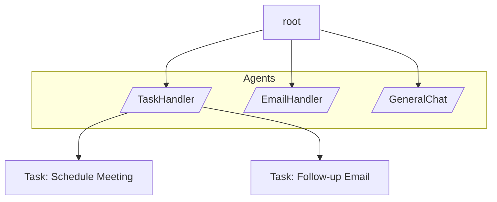

# Agentic AI with byLLM and OSP

An **AI agent** is a software entity capable of autonomously performing actions using available resources to achieve defined goals.
In traditional systems, all tools and actions are explicitly defined by humans.

**Agentic AI**, in contrast, refers to AI systems that can **independently plan, decide, and act** toward a goal using available tools and contextual information, **without** relying on a fixed, human-defined sequence of steps.

An agentic application can be visualized as a **graph or network**, where:

- **Each node** represents an **agent** with specific capabilities and responsibilities.
- An **orchestrator** traverses this graph, managing how agents collaborate to achieve a shared goal.

To build such applications, we need to:

1. **Represent agents as nodes in a graph**: Each agent becomes a node with data (attributes) and behaviors (abilities).
2. **Implement an orchestrator agent**: Typically a "walking peice of code" that coordinates task decomposition, routing, and execution across agents.
3. **Integrate LLMs to guide decisions**: Use LLM-annotated methods to enable dynamic planning, routing, and tool execution.

> These capabilities are **natively supported** through **Object Spatial Programming (OSP)** in **Jaclang**, combined with **byLLM** for seamless AI integration. This combination allows you to declaratively define agents and their interactions without boilerplate orchestration code.

## Example: Task Manager

To demonstrate these capabilities, we built an agentic task manager application in Jac. This example features three main agents:

- **Task Handler**: Manages task creation, updates, and scheduling
- **Email Handler**: Composes and manages emails
- **General Chat**: Provides general conversational assistance

The orchestrator (walker) receives a high-level user request, decomposes it into specialized subtasks using the LLM, and routes each subtask to the appropriate agent. Each agent executes independently using its own tools while maintaining a shared state through the object graph.

Here's a visual representation of the architecture:



### Object Spatial Programming for Agentic AI

Let's understand the three main constructs in Object Spatial Programming (OSP) and how they relate to agentic workflows:

1. **Nodes**: Represent locations where compute and logic execute. Nodes have attributes (data) and special abilities that trigger on preset events rather than being directly called. In an agentic system, nodes are agents that maintain local state and respond to visitor events.

2. **Edges**: Create explicit connections between nodes, allowing agentic workflows to be formally defined. Edges represent relationships, dependencies, or hierarchies between agents. For example, a TaskHandler node might have edges pointing to Task nodes it created.

3. **Walkers**: Entities spawned on the graph that traverse it, triggering node abilities and serving as the execution engine. In agentic systems, walkers are the orchestrators that coordinate task flow and decision-making across agents.

**Why OSP for Agentic AI?**

OSP provides a **declarative way to express agent interactions** without writing explicit orchestration logic. The graph structure naturally represents multi-agent systems, and walkers provide a clean mechanism for routing and coordination. Combined with byLLM's LLM capabilities, you get a powerful framework where:

- Agents are defined as Jac nodes with clear responsibilities
- LLMs make intelligent routing and planning decisions
- The object graph maintains consistency across distributed agent interactions

## Defining Agents as Nodes

The following walkthrough shows how the Task Manager example is implemented (source: `jac-byllm/examples/agentic_ai/task-manager-lite/task_manager.jac`). The goal is to map Jac constructs to the Agentic AI architecture described above.

Each agent node in this example demonstrates a key pattern:

- **Local tools** as member methods that the LLM can invoke
- **LLM-powered decision-making** via the `by llm()` annotation
- **Entry points** (abilities with `can execute`) that trigger when a walker visits the node

**Task Node** (`node Task`)

A simple data structure for storing individual tasks. New `Task` nodes are created when `TaskHandling.add_task()` is called and linked back to the handler via `self ++> task_created;`, allowing the handler to maintain local knowledge of scheduled tasks.

This demonstrates a key OSP pattern: **parent-child relationships through edges**. The TaskHandling node "owns" Task nodes it creates, maintaining a persistent record in the graph structure.

```jac linenums="1"
node Task {
  has task:str = "";
  has date:str = "";
  has time:str = "";
}
```

**TaskHandling Node** (`node TaskHandling`)

This is the first agent in our system. It demonstrates how to build a **specialized agent with tools and LLM reasoning**.

The node exposes the following tools (member methods) that the LLM can invoke:

- `get_current_time()`: Returns a formatted timestamp (utility function for planning)
- `add_task(task, date, time)`: Creates a Task node and links it to the handler (state modification)
- `summarize_tasks()`: Queries linked task nodes and returns a summary (knowledge retrieval)

The key LLM-powered method:

- `route_and_run(utterance)`: Uses `by llm(method="ReAct", tools=(...))` to enable the LLM to reason and plan. Given a user utterance, the LLM can chain tool calls to accomplish the goal (e.g., get current time → add task → summarize tasks).

The agent's entry point is the `can execute with task_manager entry` ability. This = ability triggers **automatically** when the `task_manager` walker visits this node, making it easy to define agent behavior without explicit callbacks.

```jac linenums="1"
node TaskHandling {
  def get_current_time() -> str {
    return time.strftime("%Y-%m-%d %H:%M:%S", time.gmtime());
  }

  def add_task(task: str, date: str, time: str) -> str {
    task_created = Task(task=task, date=date, time=time);
    self ++> task_created;
    return "Task added successfully";
  }

  def summarize_tasks -> str {
    scheduled_tasks = [self-->(`?Task)];
    return str(scheduled_tasks);
  }

  def route_and_run(utterance: str) -> str by llm(
    method="ReAct",
    tools=([self.add_task, self.get_current_time, self.summarize_tasks])
  );

  can execute with task_manager entry {
    print("[TaskHandling Node Activated]");
    response = self.route_and_run(visitor.cur_task.task);
    print("→", response);
    report {
      "utterance": visitor.cur_task.task,
      "response": response,
      "node_type": self.__class__.__name__
    };
  }
}
```

In a similar fashion, the other two agent nodes are implemented:

**EmailHandling Node** (`node EmailHandling`)

Similar to TaskHandling, this agent specializes in email operations. It exposes an `write_email_content()` tool and uses `route_and_run()` to orchestrate email composition via the LLM. The pattern is identical: methods as tools, LLM reasoning, and an entry ability that runs when visited by the orchestrator.

```jac linenums="1"
node EmailHandling {
  def write_email_content(utterance: str) -> str by llm();
  def route_and_run(utterance: str) -> str by llm(
    method="ReAct",
    tools=([self.write_email_content])
  );
  can execute with task_manager entry {
    print("[EmailHandling Node Activated]");
    response = self.route_and_run(visitor.cur_task.task);
    print("→", response);
    report {
      "utterance": visitor.cur_task.task,
      "response": response,
      "node_type": self.__class__.__name__
    };
  }
}
```

**GeneralChat Node** (`node GeneralChat`)

This agent handles general conversational tasks. It provides a simpler interface with just a `chat()` method, demonstrating that not all agents need complex tool sets. The byLLM `by llm()` annotation enables the LLM to directly power the conversation.

```jac linenums="1"
node GeneralChat {
  def chat(utterance: str) -> str by llm();
  can execute with task_manager entry {
    print("[GeneralChat Node Activated]");
    response = self.chat(visitor.cur_task.task);
    print("→", response);
    report {
      "utterance": visitor.cur_task.task,
      "response": response,
      "node_type": self.__class__.__name__
    };
  }
}
```

## Defining the Orchestrator as a Walker

The `walker task_manager` is the orchestrator: the "brain" of the agentic system. Unlike agents (nodes) which are passive and reactive, the orchestrator is **active** and **proactive**. It:

1. Receives the user's high-level goal (utterance)
2. Plans decomposition into subtasks using the LLM
3. Routes each subtask to the appropriate agent
4. Manages execution flow across agents

The orchestrator demonstrates how **walkers coordinate multi-agent systems**. Because walkers can traverse the graph and visit nodes, they provide the perfect mechanism for implementing orchestration logic.

**Routing and Task Decomposition**

The walker uses `plan_tasks(main_task: str) -> list[TaskPartition]` to ask the LLM to decompose the main task into subtasks. This is a key pattern: **let the LLM make strategic decisions** about task decomposition.

Each subtask is represented as a `TaskPartition` object with:

- `task`: The subtask description
- `agent_type`: Which agent should handle it (from `RoutingNodes` enum)

The enum and object definitions show how to **annotate routing choices** for the LLM. By defining the enum and object, you give the LLM structured types to work with, improving reliability.

```jac linenums="1"
enum RoutingNodes {
  TASK_HANDLING,
  EMAIL_HANDLING,
  GENERAL_CHAT
}

obj TaskPartition {
  has task: str;
  has agent_type: RoutingNodes;
}
```

**Walker Execution**

The walker executes in three steps:

1. **Plan**: Call the LLM to decompose the user's request into a list of subtasks
2. **Map**: For each subtask, map the `agent_type` to its corresponding node class (TaskHandling → TaskHandling, EmailHandling → EmailHandling, etc.)
3. **Execute**: Ensure a node instance exists on the graph, set the current task on the walker, and `visit` the node to trigger its `can execute` ability

This pattern is powerful because it separates **strategy** (what needs to be done) from **execution** (how it's done). The walker handles strategy via the LLM, while agents handle execution through their entry abilities.

```jac linenums="1"
walker task_manager {
  has utterance: str = "";
  has cur_task: TaskPartition = None;

  def route_to_node(utterance: str) -> RoutingNodes by llm();
  def plan_tasks(main_task: str) -> list[TaskPartition] by llm();

  can execute with `root entry {
    # Step 1: Plan - decompose the user's request
    subtasks = self.plan_tasks(self.utterance);
    print("[Planned Subtasks]:", subtasks);

    # Step 2: Map agent types to node classes
    node_map = {
      RoutingNodes.TASK_HANDLING: TaskHandling,
      RoutingNodes.EMAIL_HANDLING: EmailHandling,
      RoutingNodes.GENERAL_CHAT: GeneralChat
    };

    # Step 3: Execute - route and visit each agent
    for subtask in subtasks {
      node_type = node_map[subtask.agent_type];
      routed_node = [-->(`?node_type)];  # Check if agent exists
      if not routed_node {
        routed_node = here ++> node_type();  # Create if doesn't exist
      }
      self.cur_task = subtask;  # Pass subtask to agent
      visit routed_node;  # Trigger agent's can execute ability
    }
  }
}
```

## How the Flow Works:

1. The orchestrator's `can execute with root entry` runs when spawned at the root of the graph
2. It calls `plan_tasks()` which asks the LLM to break down the user's request
3. For each returned subtask, it finds or creates the appropriate agent node
4. It visits the node, which triggers the agent's `can execute with task_manager entry` ability
5. Each agent processes its subtask using its own tools and LLM reasoning
6. The walker reports results via `report` statements, creating a log of the entire execution

This is **declarative multi-agent orchestration**. You define what you want to happen (agents, their tools, routing), and Jac + byLLM handle the execution flow.

## Adding Context with Semstrings

To help the LLM make better decisions, especially during routing, you can annotate enums and objects with **semantic strings** (semstrings). These provide the LLM with natural language descriptions of each option, significantly improving decision quality.

**Why Semstrings Matter:**

When the LLM calls `plan_tasks()` or needs to route tasks, it receives the enum definition. Without semstrings, it only sees:

```
RoutingNodes.TASK_HANDLING
RoutingNodes.EMAIL_HANDLING
RoutingNodes.GENERAL_CHAT
```

With semstrings, the LLM understands the purpose of each routing option:

```jac linenums="1"
sem RoutingNodes.TASK_HANDLING = "Creating/deleting/updating/summarizing tasks to TODO";
sem RoutingNodes.EMAIL_HANDLING = "Composing and managing emails";
sem RoutingNodes.GENERAL_CHAT = "Providing intelligent answers, productivity advice, and general AI assistance across various topics.";
```

Now when the LLM decomposes a request like "Schedule a meeting and send a follow-up email", it can confidently route the first subtask to TASK_HANDLING and the second to EMAIL_HANDLING because it understands each agent's purpose.

**Best Practices:**

- Write semstrings that clearly describe **what** the agent does and **when** to use it
- Avoid generic descriptions, be specific about capabilities and use cases
- Include examples if the purpose might be ambiguous
- For objects, annotate key fields to help the LLM understand the data structure

Semstrings are a simple but powerful way to embed domain knowledge into your agentic application, enabling more reliable LLM routing and planning decisions.

!!! note "Building Agentic Apps with Jaclang"
    While byLLM can be used from Python, the full power of Object Spatial Programming is best leveraged through Jaclang. For building sophisticated agentic applications, we recommend learning Jaclang's straightforward syntax to take advantage of all the features demonstrated in this guide.
