# Jac Programming Guide for Python Developers: Outline

## Part I: Introduction and Motivation

### Chapter 1: Welcome to Jac

#### 1.1 What is Jac?

Jac is a programming language that extends familiar Python-like syntax with revolutionary concepts from Data Spatial Programming (DSP). While maintaining the readability and expressiveness that Python developers love, Jac introduces a fundamental paradigm shift in how we think about and structure computation.

#### Evolution from Python-like Syntax to Data Spatial Programming

Jac began as an effort to address the limitations of traditional programming paradigms when dealing with inherently graph-like, interconnected systems. While you'll recognize much of the syntax from Python, Jac adds powerful new constructs that make it natural to express complex relationships and computational flows.

```python
# Traditional Python approach
class User:
    def __init__(self, name):
        self.name = name
        self.friends = []

    def add_friend(self, friend):
        self.friends.append(friend)
        friend.friends.append(self)

# Processing requires external traversal logic
def find_friends_of_friends(user):
    fof = set()
    for friend in user.friends:
        for friend_of_friend in friend.friends:
            if friend_of_friend != user:
                fof.add(friend_of_friend)


    print(f"Friends of {user.name}'s friends:", [user.name for user in fof])
    return fof


# Create users
alice = User("Alice")
bob = User("Bob")
carol = User("Carol")
dave = User("Dave")

# Build friendship connections
alice.add_friend(bob)    # Alice ↔ Bob
bob.add_friend(carol)    # Bob ↔ Carol
carol.add_friend(dave)   # Carol ↔ Dave

# Test the function
fof_alice = find_friends_of_friends(alice)
```

```jac
# Jac's Data Spatial approach
node User {
    has name: str;
}

edge Friendship {
    has since: str;
}

walker FindFriendsOfFriends {
    has visited: set = set();
    has friends_of_friends: set = set();

    can traverse with entry {
        if here in self.visited { return; }
        self.visited.add(here);

        # First hop: direct friends
        for friend in [->:Friendship:->(`?User)] {
            # Second hop: friends of friends
            for fof in [friend->:Friendship:->(`?User)] {
                if fof != root {  # root is the starting user
                    self.friends_of_friends.add(fof);
                }
            }
        }

        print(f"Friends of {here.name}'s friends:",
              [fof.name for fof in self.friends_of_friends]);
    }
}

with entry {
    alice = User(name = "Alice");
    bob = User(name = "Bob");
    carol = User(name = "Carol");
    dave = User(name = "Dave");

    alice +>:Friendship(since="today"):+> bob;
    bob +>:Friendship(since="yesterday"):+> carol;
    carol +>:Friendship(since="last month"):+> dave;


    FindFriendsOfFriends() spawn alice;
}
```

#### The Paradigm Shift: From "Data to Computation" to "Computation to Data"

Traditional programming paradigms operate on a fundamental assumption: data moves to computation. We pass data as arguments to functions, return data from methods, and shuttle information between computational units.

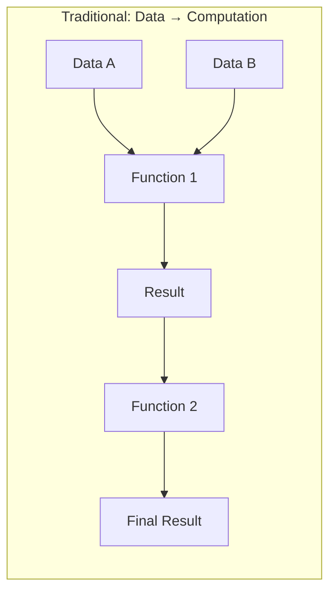

Jac inverts this relationship. In Data Spatial Programming, computation moves to data through mobile computational entities called "walkers" that traverse a graph of interconnected data locations called "nodes."

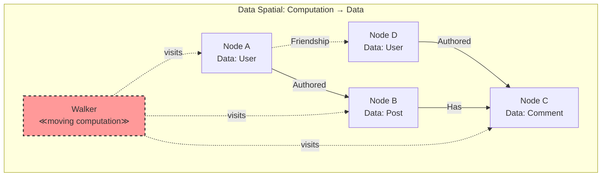

This paradigm shift has profound implications:

1. **Natural Graph Representation**: Relationships become first-class citizens through edges
2. **Localized Computation**: Logic executes where data lives, improving locality
3. **Dynamic Behavior**: Computation paths determined at runtime based on data
4. **Distributed-Ready**: Computation naturally spans machine boundaries

#### Scale-Agnostic Programming: Write Once, Scale Anywhere

Perhaps Jac's most revolutionary feature is scale-agnostic programming. Applications written for a single user automatically scale to handle multiple users and distribute across machines without code changes.

```jac
# This same code works for:
# - Single user on one machine
# - Thousands of users on one machine
# - Millions of users across distributed systems

walker CreatePost {
    has content: str;
    has timestamp: str;

    can create with entry {
        # 'root' automatically refers to the current user's root node
        new_post = here ++> Post(
            content=self.content,
            timestamp=self.timestamp,
            author=here
        );

        # Notify followers - works regardless of scale
        for follower in [<--:Follows:] {
            follower ++> Notification(
                type="new_post",
                post=new_post
            );
        }
    }
}
```

#### 1.2 Why Jac?

#### Limitations of Traditional OOP for Graph-like Structures

Object-Oriented Programming excels at modeling entities and their behaviors, but struggles with several common patterns:

##### 1. **Complex Relationships**
Traditional OOP treats relationships as secondary concerns, typically implemented as references or collections within objects.

```python
# Python: Relationships are afterthoughts
class Person:
    def __init__(self):
        self.friends = []  # Just a list
        self.followers = []  # Another list
        self.blocking = []  # And another

# Relationship logic scattered across methods
def can_see_post(viewer, author, post):
    if viewer in author.blocking:
        return False
    if post.privacy == "friends" and viewer not in author.friends:
        return False
    # More complex logic...
```

```jac
# Jac: Relationships are first-class edges with behavior
edge Follows {
    has since: str;
    has notifications_enabled: bool = true;
}

edge Blocks {
    has reason: str;
    has timestamp: str;
}

# Relationship logic lives in the graph structure
walker CanSeePost {
    has post: Post;

    can check with entry {
        # Blocks prevent traversal naturally
        if [-->:Blocks:-->](?.target == self.post.author) {
            report false;
        }
        # Privacy emerges from graph topology
        report can_reach(here, self.post);
    }
}
```

##### 2. **Traversal Logic**
In traditional OOP, graph traversal requires explicit, often repetitive code.

```python
# Python: Manual traversal with risk of cycles, memory issues
def find_all_dependencies(package, visited=None):
    if visited is None:
        visited = set()

    if package in visited:
        return []

    visited.add(package)
    deps = []

    for dep in package.dependencies:
        deps.append(dep)
        deps.extend(find_all_dependencies(dep, visited))

    return deps
```

```jac
# Jac: Declarative traversal with built-in cycle handling
walker FindDependencies {
    has found: set = {};

    can search with entry {
        self.found.add(here);
        visit [-->:DependsOn:];  # Automatic cycle prevention
    }
}
```

##### 3. **Context-Dependent Behavior**
Objects in traditional OOP have fixed methods that execute the same regardless of context.

```python
# Python: Context requires explicit parameter passing
class Document:
    def render(self, viewer=None, device=None, locale=None):
        if viewer and not self.can_access(viewer):
            return "Access Denied"

        if device == "mobile":
            return self.render_mobile(locale)
        else:
            return self.render_desktop(locale)
```

```jac
# Jac: Context naturally flows with computation
node Document {
    has content: dict;

    # Different behavior for different visitors
    can render with MobileUser entry {
        report self.content.mobile_version;
    }

    can render with DesktopUser entry {
        report self.content.desktop_version;
    }

    can render with Translator entry {
        report translate(self.content, visitor.target_locale);
    }
}
```

#### Benefits of Topological Programming

Jac's topological approach offers several key advantages:

##### 1. **Intuitive Relationship Modeling**

```mermaid
graph TB
    subgraph "Social Network Topology"
        U1[User: Alice]
        U2[User: Bob]
        U3[User: Carol]
        P1[Post: 'Hello!']
        P2[Post: 'Great day!']
        C1[Comment: 'Nice!']

        U1 -->|Follows| U2
        U2 -->|Follows| U1
        U2 -->|Follows| U3
        U1 -->|Authored| P1
        U2 -->|Authored| P2
        U3 -->|Commented| C1
        P2 -->|Has| C1
        U1 -.->|Blocked| U3

        style U1 fill:#01151e
        style U2 fill:#01151e
        style U3 fill:#01151e
        style P1 fill:#1f1320
        style P2 fill:#1f1320
        style C1 fill:#132515
    end
```

##### 2. **Natural Concurrency**
Since walkers are independent computational entities, they naturally support concurrent execution:

```jac
# Multiple walkers can traverse simultaneously
walker AnalyzeUser {
    can analyze with entry {
        # Each walker instance operates independently
        report {
            "post_count": len([-->:Authored:]),
            "follower_count": len([<--:Follows:]),
            "engagement_rate": calculate_engagement(here)
        };
    }
}

# Spawn multiple walkers concurrently
with entry {
    # These execute in parallel automatically
    for user in get_active_users() {
        spawn AnalyzeUser() on user;
    }
}
```

##### 3. **Locality of Reference**
Computation happens where data lives, improving cache efficiency and reducing data movement:

```jac
# Traditional: Data gathered then processed
# Requires loading all posts and comments into memory
def calculate_thread_stats(post_id):
    post = load_post(post_id)
    comments = load_all_comments(post_id)  # Potentially huge

    stats = {
        'total_comments': len(comments),
        'unique_commenters': len(set(c.author for c in comments)),
        'max_depth': calculate_max_depth(comments)
    }
    return stats

# Jac: Process data in place
walker ThreadStats {
    has total_comments: int = 0;
    has commenters: set = {};
    has max_depth: int = 0;
    has current_depth: int = 0;

    can analyze with Comment entry {
        self.total_comments += 1;
        self.commenters.add(here.author);
        self.max_depth = max(self.max_depth, self.current_depth);

        # Traverse deeper
        self.current_depth += 1;
        visit [-->:HasReply:];
        self.current_depth -= 1;
    }
}
```

#### Built-in Persistence and Multi-User Support

Unlike traditional languages that treat persistence as an external concern, Jac makes it intrinsic:

```jac
# Automatic persistence - no database required!
node UserProfile {
    has username: str;
    has email: str;
    has created_at: str;
}

with entry {
    # Connected to root = automatically persisted
    root ++> UserProfile(
        username="alice",
        email="alice@example.com",
        created_at=timestamp_now()
    );
}  # Data persists after program exits

# Next execution can access the same data
walker GetProfile {
    can get with entry {
        profile = [-->:UserProfile:][0];
        report profile;
    }
}
```

Multi-user support is equally seamless:

```jac
# Each user automatically gets their own isolated root node
walker UpdateBio {
    has new_bio: str;

    can update with entry {
        # 'root' refers to the current user's root
        # No explicit user context needed!
        profile = root[-->:UserProfile:][0];
        profile.bio = self.new_bio;
    }
}
```

#### Natural Expression of Distributed Systems

Jac's topological model naturally extends across machine boundaries:

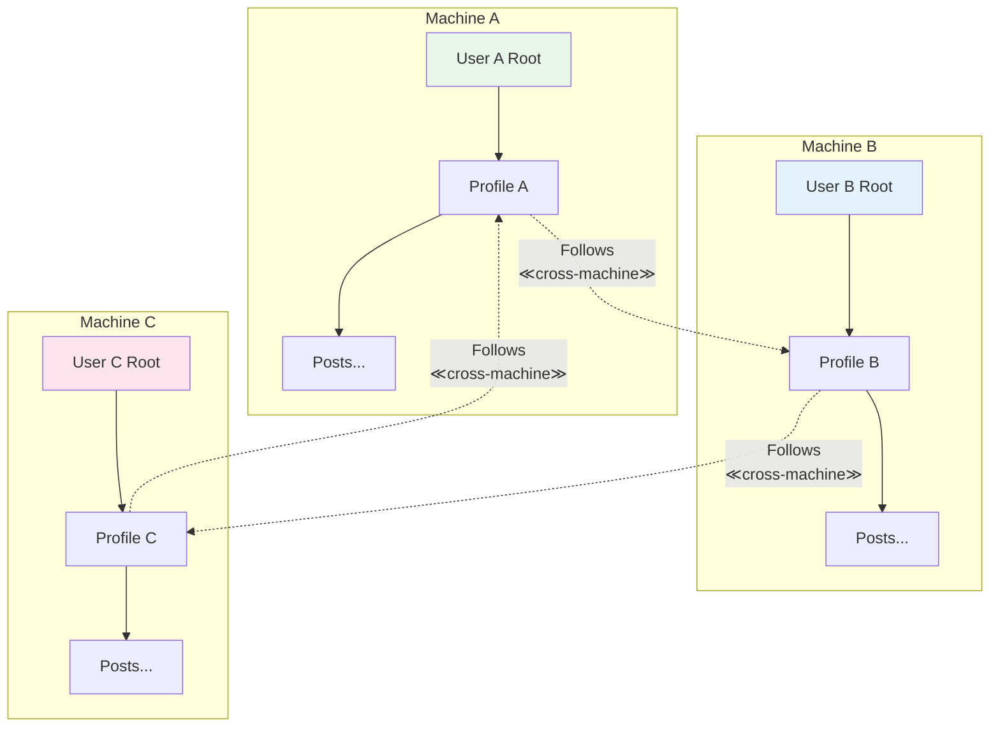

The same walker code works regardless of distribution:

```jac
walker FindMutualFollowers {
    has target_user: User;
    has mutuals: set = {};

    can find with entry {
        my_followers = set([<--:Follows:]);

        # This works even if target_user is on another machine!
        visit self.target_user {
            their_followers = set([<--:Follows:]);
            self.mutuals = my_followers.intersection(their_followers);
        };

        report self.mutuals;
    }
}
```

#### 1.3 This Guide's Approach

#### Leveraging Your Python Knowledge

As a Python developer, you already possess most of the knowledge needed to be productive in Jac. This guide builds on your existing expertise while introducing new concepts gradually.

##### What Transfers Directly:
- Basic syntax for expressions and statements
- Data types (with mandatory type annotations)
- Control flow concepts (with curly braces)
- Object-oriented principles (enhanced with archetypes)
- Standard library patterns (with Jac equivalents)

##### What's Enhanced:
- Functions become "abilities" with context-aware execution
- Classes become "archetypes" with richer semantics
- Decorators work with new constructs
- Type system is mandatory but more expressive

##### What's New:
- Graph-based program structure
- Mobile computation via walkers
- Automatic persistence and multi-user support
- Scale-agnostic deployment

#### Progressive Learning Path

This guide follows a carefully designed progression:

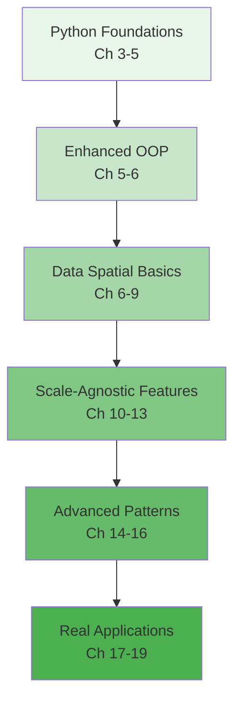

1. **Start Familiar**: Begin with Python-like features to build confidence
2. **Introduce Concepts**: Learn data spatial concepts with simple examples
3. **Build Understanding**: Create increasingly complex graph structures
4. **Master Scale**: Understand persistence and distribution
5. **Apply Knowledge**: Build real-world applications

#### Hands-on Examples Throughout

Every concept in this guide is illustrated with practical, runnable examples. You'll build:

- **Chapter 3-5**: A todo list app (familiar territory)
- **Chapter 6-9**: A social network (graph basics)
- **Chapter 10-13**: A multi-user blog (scale-agnostic features)
- **Chapter 14-16**: A distributed task queue (advanced patterns)
- **Chapter 17-19**: Complete applications combining all concepts

Each example builds on the previous, creating a coherent learning journey from Python developer to Jac expert.

```jac
# Your journey starts here!
with entry {
    print("Welcome to Jac!");

    # Create your first persistent node
    root ++> LearningProgress(
        developer="You",
        started_at=timestamp_now(),
        excitement_level=100
    );
}
```

Ready to begin? In the next chapter, we'll set up your Jac development environment and write your first Data Spatial program. The future of programming awaits!

### Chapter 2: Setting Up Your Jac Environment

#### 2.1 Installation and Setup

Getting started with Jac is straightforward, especially for Python developers. Jac provides multiple installation methods and integrates well with familiar development tools.

#### Installing Jac Compiler and Runtime

##### Method 1: Using pip (Recommended)

```bash
# Install the latest stable version
pip install jaclang

# Verify installation
jac --version
# Output: Jac 0.7.19 (or current version)

# Install with development tools
pip install jaclang[dev]
```

##### Method 2: From Source

```bash
# Clone the repository
git clone https://github.com/Jaseci-Labs/jaclang.git
cd jaclang

# Install in development mode
pip install -e .

# Run tests to verify
python -m pytest
```

##### Method 3: Docker Container

```dockerfile
# Dockerfile for Jac development
FROM python:3.10-slim

RUN pip install jaclang
WORKDIR /app

# Copy your Jac files
COPY . .

CMD ["jac", "run", "main.jac"]
```

```bash
# Build and run
docker build -t my-jac-app .
docker run -it my-jac-app
```

#### System Requirements

- **Python**: 3.10 or higher (Jac compiles to Python)
- **Memory**: 4GB RAM minimum, 8GB recommended
- **OS**: Linux, macOS, Windows (WSL recommended)
- **Storage**: 500MB for Jac + dependencies

#### IDE Support and Extensions

#### Visual Studio Code (Recommended)

Install the official Jac extension for syntax highlighting, auto-completion, and debugging:

```bash
# Install via VS Code marketplace
code --install-extension jaseci.jac-lang
```

**Features:**
- Syntax highlighting for `.jac` files
- IntelliSense for Jac keywords and types
- Integrated debugging support
- Graph visualization for nodes and edges
- Automatic formatting

#### JetBrains IDEs (PyCharm, IntelliJ)

```xml
<!-- Add to your .idea/fileTypes.xml -->
<component name="FileTypeManager">
  <extensionMap>
    <mapping pattern="*.jac" type="Python" />
    <mapping pattern="*.impl.jac" type="Python" />
    <mapping pattern="*.test.jac" type="Python" />
  </extensionMap>
</component>
```

#### Vim/Neovim

```vim
" Add to your .vimrc or init.vim
autocmd BufRead,BufNewFile *.jac set filetype=python
autocmd BufRead,BufNewFile *.jac set syntax=python

" Better: Install jac.vim plugin
Plug 'jaseci-labs/jac.vim'
```

#### Project Structure Conventions

Jac projects follow a structured organization that supports its unique features like implementation separation:

```
my-jac-project/
│
├── src/
│   ├── main.jac                 # Main entry point
│   ├── models/
│   │   ├── user.jac            # User node definition
│   │   ├── user.impl.jac       # User implementation
│   │   └── user.test.jac       # User tests
│   │
│   ├── walkers/
│   │   ├── auth.jac            # Authentication walkers
│   │   └── auth.impl/          # Implementation folder
│   │       ├── login.impl.jac
│   │       └── register.impl.jac
│   │
│   └── edges/
│       └── relationships.jac    # Edge definitions
│
├── tests/
│   ├── integration/
│   └── unit/
│
├── data/                        # Persistent data (auto-generated)
│   └── .jac_db/                # Jac's persistence layer
│
├── jac.toml                     # Project configuration
└── README.md
```

#### jac.toml Configuration

```toml
[project]
name = "my-jac-project"
version = "0.1.0"
description = "A Jac application"

[runtime]
persist_path = "./data/.jac_db"
log_level = "INFO"
enable_distributed = false

[build]
target = "optimized"  # or "debug"
include_tests = false

[dependencies]
# External Jac modules
```

#### Environment Setup

#### Development Environment Variables

```bash
# .env file
JAC_PERSIST_PATH=./data/.jac_db
JAC_LOG_LEVEL=DEBUG
JAC_USER_CONTEXT=development
JAC_ENABLE_METRICS=true
```

#### Python Virtual Environment (Recommended)

```bash
# Create virtual environment
python -m venv jac-env

# Activate it
# On Unix/macOS:
source jac-env/bin/activate
# On Windows:
jac-env\Scripts\activate

# Install Jac in the virtual environment
pip install jaclang
```

#### 2.2 Your First Jac Program

Let's create your first Jac program and understand the key differences from Python.

#### Hello World Comparison: Python vs Jac

#### Python Version

```python
# hello.py
def greet(name):
    return f"Hello, {name}!"

if __name__ == "__main__":
    message = greet("World")
    print(message)
```

#### Jac Version

```jac
# hello.jac
can greet(name: str) -> str {
    return f"Hello, {name}!";
}

with entry {
    message = greet("World");
    print(message);
}
```

Key differences:
1. **Function declaration**: `can` instead of `def`
2. **Type annotations**: Required in Jac (`name: str`)
3. **Semicolons**: Required for statements
4. **Entry point**: `with entry` instead of `if __name__ == "__main__"`
5. **Curly braces**: Instead of indentation

#### Understanding Entry Blocks

Entry blocks are Jac's way of organizing executable code at the module level:

```jac
# module_demo.jac

# Imports (similar to Python)
import:py from datetime { datetime }
import:py random;

# Global variables must be declared
glob start_time: str = datetime.now().isoformat();
let config: dict = {"debug": true};

# Function definitions
can setup_application() -> bool {
    print(f"Application started at {start_time}");
    return true;
}

# Classes (called objects in Jac)
obj Application {
    has name: str;
    has version: str = "1.0.0";

    can display_info {
        print(f"{self.name} v{self.version}");
    }
}

# Entry block - code that runs when module executes
with entry {
    print("=== Jac Module Demo ===");

    if setup_application() {
        app = Application(name="MyApp");
        app.display_info();
    }
}

# Named entry block - alternative entry point
with entry:cli {
    print("Running from CLI entry point");
    # Different initialization for CLI mode
}
```

#### Your First Data Spatial Program

Let's create a simple but complete data spatial program:

```jac
# social_hello.jac

# Define a Person node
node Person {
    has name: str;
    has joined: str;
}

# Define a Knows edge
edge Knows {
    has since: str;
}

# Define a Greeter walker
walker Greeter {
    has greeting_count: int = 0;

    # Ability triggered when entering a Person node
    can greet with Person entry {
        print(f"Hello, {here.name}! You joined on {here.joined}");
        self.greeting_count += 1;

        # Visit all people this person knows
        visit [-->:Knows:];
    }

    # Ability triggered when walker finishes
    can summarize with `root exit {
        print(f"\nGreeted {self.greeting_count} people total!");
    }
}

# Main program
with entry {
    # Create a small social network
    person1 = Person(name="Alice", joined="2024-01-15");
    person2 = Person(name="Bob", joined="2024-02-20");
    person3 = Person(name="Charlie", joined="2024-03-10");

    # Connect to root for persistence
    root ++> person1;

    # Create relationships
    person1 ++>:Knows(since="2024-02-01"):++> person2;
    person2 ++>:Knows(since="2024-03-01"):++> person3;

    # Spawn walker to greet everyone
    greeter = Greeter();
    root spawn greeter;
}
```

#### Running and Testing Jac Programs

#### Basic Execution

```bash
# Run a Jac file
jac run hello.jac

# Run with specific entry point
jac run module_demo.jac:cli

# Run with debugging
jac run --debug social_hello.jac
```

#### Interactive Mode (REPL)

```bash
# Start Jac REPL
jac shell

# In the REPL:
> let x = 42;
> print(x * 2);
84
> node TestNode { has value: int; }
> n = TestNode(value=100);
> print(n.value);
100
```

#### Testing Your Programs

```jac
# test_hello.jac

import:jac from hello { greet }

test "greet function works correctly" {
    assert greet("Jac") == "Hello, Jac!";
    assert greet("") == "Hello, !";
}

test "greet with special characters" {
    assert greet("世界") == "Hello, 世界!";
    assert greet("O'Brien") == "Hello, O'Brien!";
}

# Run tests
# Command: jac test test_hello.jac
```

#### Debugging Techniques

```jac
# debug_example.jac

walker DebugWalker {
    has visited_nodes: list = [];

    can walk with entry {
        # Debug print statements
        print(f"[DEBUG] Entering node: {here}");
        print(f"[DEBUG] Node type: {type(here)}");

        # Inspect node properties
        ::py::
        import pprint
        print("[DEBUG] Node properties:")
        pprint.pprint(here.__dict__)
        ::py::

        self.visited_nodes.append(here);

        # Conditional debugging
        if len(self.visited_nodes) > 10 {
            print("[WARNING] Visited more than 10 nodes!");
            disengage;  # Stop walker
        }

        visit [-->];
    }
}

# Enable verbose logging
with entry {
    import:py logging;
    logging.basicConfig(level=logging.DEBUG);

    # Your code here
}
```

#### Building a Complete Example

Let's build a simple todo list application that showcases basic Jac features:

```jac
# todo_app.jac

import:py from datetime { datetime }
import:py json;

# Define our data structures
node TodoList {
    has name: str;
    has created_at: str;
}

node TodoItem {
    has title: str;
    has completed: bool = false;
    has created_at: str;
    has due_date: str = "";
}

edge Contains;
edge NextItem;

# Walker to add new todos
walker AddTodo {
    has title: str;
    has due_date: str = "";

    can add with TodoList entry {
        new_item = here ++>:Contains:++> TodoItem(
            title=self.title,
            created_at=datetime.now().isoformat(),
            due_date=self.due_date
        );

        # Link to previous items
        last_item = [-->:Contains:-->:TodoItem:][-2:];
        if last_item {
            last_item[0] ++>:NextItem:++> new_item;
        }

        report f"Added: {self.title}";
    }
}

# Walker to list todos
walker ListTodos {
    has show_completed: bool = false;
    has items: list = [];

    can collect with TodoList entry {
        for item in [-->:Contains:-->:TodoItem:] {
            if not item.completed or self.show_completed {
                self.items.append({
                    "title": item.title,
                    "completed": item.completed,
                    "created": item.created_at,
                    "due": item.due_date
                });
            }
        }
    }

    can display with `root exit {
        print("\n=== Todo List ===");
        for i, item in enumerate(self.items) {
            status = "✓" if item["completed"] else "○";
            due = f" (due: {item['due']})" if item["due"] else "";
            print(f"{i+1}. {status} {item['title']}{due}");
        }
        print(f"\nTotal: {len(self.items)} items\n");
    }
}

# Walker to complete todos
walker CompleteTodo {
    has item_index: int;

    can complete with TodoList entry {
        items = [-->:Contains:-->:TodoItem:];
        if 0 <= self.item_index < len(items) {
            items[self.item_index].completed = true;
            report f"Completed: {items[self.item_index].title}";
        } else {
            report "Invalid item index!";
        }
    }
}

# Main program
with entry {
    # Create or get existing todo list
    lists = root[-->:TodoList:];

    if not lists {
        print("Creating new todo list...");
        my_list = root ++> TodoList(
            name="My Tasks",
            created_at=datetime.now().isoformat()
        );
    } else {
        my_list = lists[0];
        print("Loading existing todo list...");
    }

    # Example: Add some todos
    spawn AddTodo(title="Learn Jac basics", due_date="2024-12-31") on my_list;
    spawn AddTodo(title="Build first Jac app") on my_list;
    spawn AddTodo(title="Master data spatial programming") on my_list;

    # List all todos
    spawn ListTodos(show_completed=true) on my_list;
}

# CLI entry point
with entry:add {
    import:py sys;
    if len(sys.argv) < 3 {
        print("Usage: jac run todo_app.jac:add 'Task title' [due_date]");
        exit(1);
    }

    title = sys.argv[2];
    due_date = sys.argv[3] if len(sys.argv) > 3 else "";

    lists = root[-->:TodoList:];
    if lists {
        spawn AddTodo(title=title, due_date=due_date) on lists[0];
        spawn ListTodos() on lists[0];
    }
}
```

### Running the Todo App

```bash
# First run - creates the list
jac run todo_app.jac

# Add a new todo via CLI
jac run todo_app.jac:add "Buy groceries" "2024-12-25"

# Run again - todos persist!
jac run todo_app.jac
```

#### Development Workflow

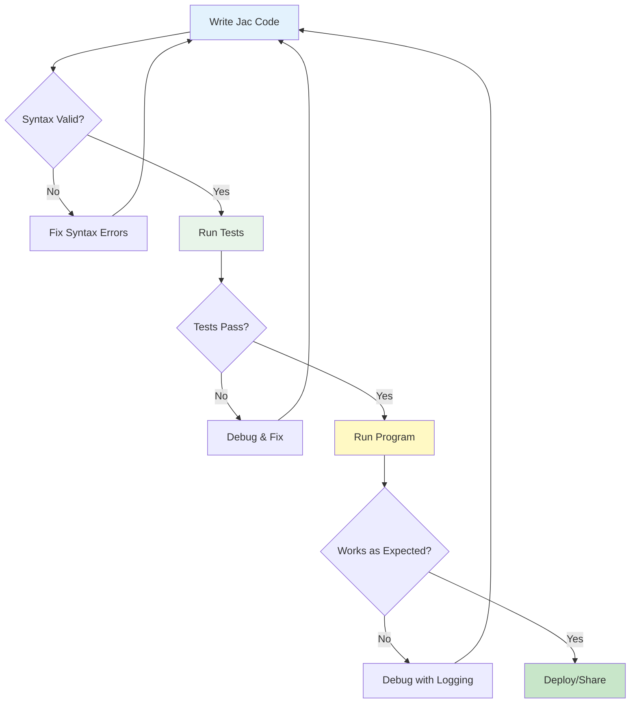

#### Common Issues and Solutions

| Issue | Solution |
|-------|----------|
| `ModuleNotFoundError` | Ensure Jac is installed: `pip install jaclang` |
| `SyntaxError: Missing semicolon` | Add `;` at end of statements |
| `TypeError: Missing type annotation` | Add type hints to all function parameters |
| `RuntimeError: No entry point` | Add `with entry { ... }` block |
| `PersistenceError` | Check write permissions for `JAC_PERSIST_PATH` |

#### Next Steps

Now that you have Jac installed and have written your first programs, you're ready to dive deeper into the language. In the next chapter, we'll explore how Jac's syntax relates to Python and learn about the enhanced features that make Jac powerful for modern application development.

Try modifying the todo app to add new features:
- Add priority levels to todos
- Implement due date notifications
- Create categories for todos
- Add a search walker to find specific items

Remember: every Jac program you write is automatically persistent and ready for multi-user scenarios. The same todo app could serve thousands of users without any code changes - that's the power of scale-agnostic programming!

## Part II: Core Language Features - Python to Jac

### Chapter 3: Familiar Syntax with New Semantics

As a Python developer, you'll find Jac's syntax comfortably familiar while discovering powerful enhancements that make your code more robust and expressive. This chapter explores the core language features, highlighting what's similar, what's enhanced, and what's new.

#### 3.1 Variables and Types

#### Type Annotations are Mandatory (Unlike Python's Optional Hints)

In Python, type hints are optional and primarily serve as documentation:

```python
# Python - types are optional hints
name = "Alice"  # Type inferred
age = 30        # Type inferred
score = 95.5    # Type inferred

# Type hints can be added but aren't enforced
def calculate_grade(score: float) -> str:  # Optional
    return "A" if score >= 90 else "B"
```

In Jac, type annotations are mandatory and enforced at compile time:

```jac
// Jac - types are required and enforced
let name: str = "Alice";    // Explicit type required
let age: int = 30;          // Must specify type
let score: float = 95.5;    // Type checking enforced

// Function parameters and returns MUST have types
can calculate_grade(score: float) -> str {
    return "A" if score >= 90.0 else "B";
}

// This would cause a compile error:
// let mystery = "something";  // Error: missing type annotation
```

#### Benefits of Mandatory Types

```jac
// Type safety prevents runtime errors
obj Student {
    has name: str;
    has grades: list[float];

    can add_grade(grade: float) {
        // This would fail at compile time if grade wasn't a float
        self.grades.append(grade);
    }

    can get_average() -> float {
        if len(self.grades) == 0 {
            return 0.0;  // Must return float, not int
        }
        return sum(self.grades) / len(self.grades);
    }
}

// Type errors caught at compile time
with entry {
    let student = Student(name="Bob", grades=[]);

    // student.add_grade("95");  // Compile error: string != float
    student.add_grade(95.0);     // Correct

    let avg: float = student.get_average();  // Type-safe assignment
}
```

#### `let` for Explicit Declarations vs Python's Implicit Declaration

Python creates variables implicitly on first assignment:

```python
# Python
x = 10        # Variable created implicitly
x = "hello"   # Type can change (dynamic typing)
y = x         # Another implicit creation
```

Jac requires explicit declaration with `let`:

```jac
// Jac
let x: int = 10;        // Explicit declaration with type
// x = "hello";         // Error: can't change type
let y: int = x;         // Must declare before use

// let provides clarity about variable creation
can process_data(data: list[int]) -> int {
    let sum: int = 0;              // Clear: new variable
    let count: int = len(data);    // Clear: new variable

    for item in data {
        sum += item;    // Clear: modifying existing variable
    }

    let average: float = sum / count;  // Clear: new variable
    return int(average);
}
```

#### `glob` for Global Variables

While Python uses the `global` keyword to modify globals within functions, Jac uses `glob` for declaration and `:g:` for access:

```python
# Python
counter = 0  # Global variable

def increment():
    global counter  # Declare intent to modify global
    counter += 1
```

```jac
// Jac
glob counter: int = 0;  // Explicitly global variable

can increment() {
    :g: counter;    // Declare access to global
    counter += 1;
}

// Access control for globals
glob:pub api_version: str = "1.0";      // Public global
glob:priv secret_key: str = "hidden";   // Private global
glob:protect internal_state: dict = {}; // Protected global

// Module-level globals with entry block
with entry {
    :g: counter, api_version;
    print(f"Counter: {counter}, API Version: {api_version}");
}
```

#### Built-in Types Comparison Table

| Python Type | Jac Type | Notes |
|------------|----------|-------|
| `int` | `int` | Same behavior, explicit declaration |
| `float` | `float` | Same precision rules |
| `str` | `str` | Same string operations |
| `bool` | `bool` | Same True/False values |
| `list` | `list[T]` | Generic type required |
| `dict` | `dict[K,V]` | Key and value types required |
| `tuple` | `tuple` | Supports both positional and keyword |
| `set` | `set[T]` | Element type required |
| `None` | `None` | Same null/none concept |
| `Any` | `any` | Escape hatch for dynamic typing |
| `bytes` | `bytes` | Binary data handling |
| `type` | `type` | Type introspection |

#### Working with Collection Types

```jac
// Lists with explicit typing
let numbers: list[int] = [1, 2, 3, 4, 5];
let names: list[str] = ["Alice", "Bob", "Charlie"];
let matrix: list[list[float]] = [[1.0, 2.0], [3.0, 4.0]];

// Dictionaries with key-value types
let scores: dict[str, int] = {"Alice": 95, "Bob": 87};
let config: dict[str, any] = {"debug": true, "port": 8080};

// Sets with element types
let unique_ids: set[int] = {101, 102, 103};
let tags: set[str] = {"python", "jac", "programming"};

// Tuples - both positional and keyword (Jac special!)
let point: tuple = (3, 4);                    // Positional
let person: tuple = (name="Alice", age=30);  // Keyword tuple!
```

#### Type Inference and Validation

While types must be declared, Jac can infer complex types in some contexts:

```jac
// Type inference in comprehensions
let numbers: list[int] = [1, 2, 3, 4, 5];
let squared = [x * x for x in numbers];  // Inferred as list[int]

// But explicit is often better
let squared_explicit: list[int] = [x * x for x in numbers];

// Type validation at compile time
can safe_divide(a: float, b: float) -> float {
    if b == 0.0 {
        return 0.0;  // Must return float
        // return None;  // Error: None is not float
    }
    return a / b;
}

// Optional types for nullable values
can find_user(id: int) -> str? {  // Can return str or None
    if id < 0 {
        return None;  // Valid
    }
    return f"User_{id}";  // Valid
}
```

#### Working with Any Type

Sometimes you need dynamic typing. Jac provides `any` as an escape hatch:

```jac
// Using 'any' for flexible types
let flexible: any = 42;
flexible = "now a string";  // Allowed with 'any'
flexible = [1, 2, 3];      // Still allowed

// Useful for JSON-like data
let json_data: dict[str, any] = {
    "name": "Alice",
    "age": 30,
    "tags": ["developer", "python"],
    "active": true
};

// But prefer specific types when possible
obj ConfigValue {
    has value: any;
    has type_name: str;

    can get_typed[T](expected_type: type) -> T? {
        if type(self.value) == expected_type {
            return self.value;
        }
        return None;
    }
}
```

#### 3.2 Control Flow

#### Curly Braces Instead of Indentation

The most visible difference from Python is the use of curly braces for code blocks:

```python
# Python uses indentation
if temperature > 30:
    print("It's hot!")
    if temperature > 40:
        print("It's very hot!")
else:
    print("It's comfortable")
```

```jac
// Jac uses curly braces
if temperature > 30 {
    print("It's hot!");
    if temperature > 40 {
        print("It's very hot!");
    }
} else {
    print("It's comfortable");
}

// Indentation is for readability, not syntax
if user.is_authenticated {
print("Welcome!");     // Still works but not recommended
    print("Logged in");  // Inconsistent indentation is allowed
}                        // But maintain consistency for readability!
```

#### Enhanced For Loops: `for-to-by` Syntax

Jac provides multiple for loop syntaxes, including a unique `for-to-by` construct:

```jac
// Traditional for-in loop (like Python)
let items: list[str] = ["apple", "banana", "cherry"];
for item in items {
    print(item);
}

// Range-based loop (like Python)
for i in range(5) {
    print(i);  // 0, 1, 2, 3, 4
}

// Jac's unique for-to-by loop
for i = 0 to i < 10 by i += 2 {
    print(i);  // 0, 2, 4, 6, 8
}

// Complex for-to-by examples
// Countdown
for count = 10 to count > 0 by count -= 1 {
    print(f"{count}...");
}
print("Liftoff!");

// Exponential growth
for value = 1 to value <= 1000 by value *= 2 {
    print(value);  // 1, 2, 4, 8, 16, 32, 64, 128, 256, 512
}

// Multiple variables (advanced)
for i = 0, j = 10 to i < j by i += 1, j -= 1 {
    print(f"i={i}, j={j}");
}
```

#### Match Statements (Pattern Matching)

Jac includes pattern matching, similar to Python 3.10+'s match statement but with enhanced features:

```jac
// Basic pattern matching
can describe_number(n: int) -> str {
    match n {
        case 0: return "zero";
        case 1: return "one";
        case 2: return "two";
        case x if x < 0: return "negative";
        case x if x > 100: return "large";
        case _: return "other";
    }
}

// Structural pattern matching
can process_data(data: any) -> str {
    match data {
        case None:
            return "No data";

        case []:
            return "Empty list";

        case [x]:
            return f"Single item: {x}";

        case [first, *rest]:
            return f"List starting with {first}";

        case {"type": "user", "name": name}:
            return f"User: {name}";

        case {"type": t, **kwargs}:
            return f"Object of type {t}";

        case _:
            return "Unknown data";
    }
}

// Type pattern matching
node Animal {
    has name: str;
}

node Dog(Animal) {
    has breed: str;
}

node Cat(Animal) {
    has indoor: bool;
}

walker AnimalHandler {
    can handle with Animal entry {
        match here {
            case Dog:
                print(f"{here.name} is a {here.breed} dog");

            case Cat if here.indoor:
                print(f"{here.name} is an indoor cat");

            case Cat:
                print(f"{here.name} is an outdoor cat");

            case _:
                print(f"{here.name} is some other animal");
        }
    }
}
```

#### Walrus Operator (`:=`) Similarities and Differences

Both Python and Jac support the walrus operator for assignment expressions:

```python
# Python walrus operator
while (line := file.readline()):
    process(line)

if (n := len(items)) > 10:
    print(f"Large list with {n} items")
```

```jac
// Jac walrus operator - same syntax, similar usage
while (line := file.readline()) {
    process(line);
}

if (n := len(items)) > 10 {
    print(f"Large list with {n} items");
}

// Useful in comprehensions
let results: list[int] = [
    y for x in data
    if (y := expensive_computation(x)) > threshold
];

// In match statements
match get_user() {
    case user if (role := user.get_role()) == "admin":
        grant_admin_access(role);
    case _:
        grant_basic_access();
}
```

#### Control Flow Comparison

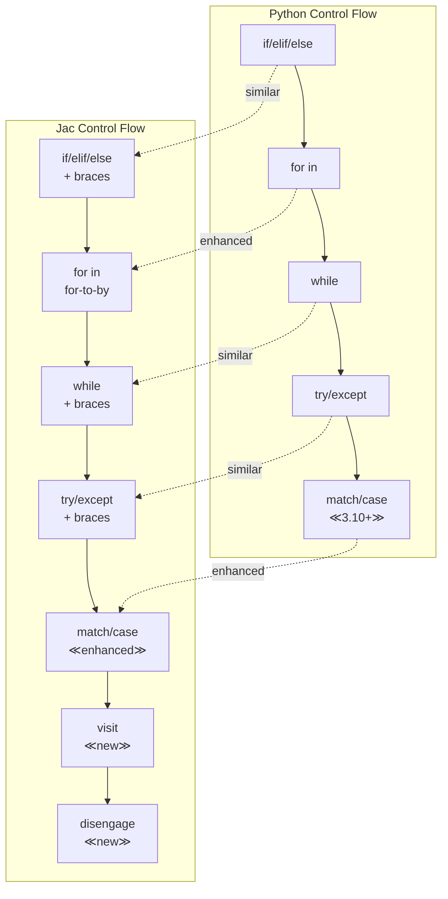

#### Exception Handling

Exception handling in Jac follows Python patterns with brace syntax:

```jac
// Basic try-except
can safe_divide(a: float, b: float) -> float {
    try {
        return a / b;
    } except ZeroDivisionError {
        print("Cannot divide by zero!");
        return 0.0;
    }
}

// Multiple exception types
can process_file(filename: str) -> str {
    try {
        let file = open(filename, "r");
        let content = file.read();
        file.close();
        return content;
    } except FileNotFoundError as e {
        print(f"File not found: {e}");
        return "";
    } except IOError as e {
        print(f"IO error: {e}");
        return "";
    } finally {
        print("Cleanup complete");
    }
}

// Raising exceptions
can validate_age(age: int) {
    if age < 0 {
        raise ValueError("Age cannot be negative");
    }
    if age > 150 {
        raise ValueError("Age seems unrealistic");
    }
}
```

#### 3.3 Functions to Abilities

#### Traditional Functions with `can` Keyword

Jac uses `can` instead of Python's `def` for function definitions:

```python
# Python function
def calculate_area(radius: float) -> float:
    return 3.14159 * radius ** 2
```

```jac
// Jac function
can calculate_area(radius: float) -> float {
    return 3.14159 * radius ** 2;
}

// Functions are first-class objects
let area_calculator: func = calculate_area;
let result: float = area_calculator(5.0);
```

#### Why `self` is Optional in Jac

One of Jac's conveniences is that `self` is implicit in methods unless you need it:

```python
# Python - self is always required
class Rectangle:
    def __init__(self, width, height):
        self.width = width
        self.height = height

    def area(self):  # Must include self
        return self.width * self.height

    def describe(self):  # Must include self even if unused
        return "A rectangle"
```

```jac
// Jac - self is implicit
obj Rectangle {
    has width: float;
    has height: float;

    can area() -> float {  // No self needed!
        return self.width * self.height;  // self still accessible
    }

    can describe() -> str {  // No self parameter
        return "A rectangle";  // Not using self? Don't declare it!
    }

    can set_dimensions(width: float, height: float) {
        self.width = width;    // self available when needed
        self.height = height;
    }
}
```

#### Type Safety and Return Types

Jac enforces return type consistency:

```jac
// Return types are enforced
can get_grade(score: float) -> str {
    if score >= 90.0 {
        return "A";
    } elif score >= 80.0 {
        return "B";
    }
    // return;  // Error: must return str
    return "F";  // Must cover all paths
}

// Multiple return values via tuples
can divmod(a: int, b: int) -> tuple[int, int] {
    return (a // b, a % b);
}

// Optional returns
can find_item(items: list[str], target: str) -> int? {
    for i, item in enumerate(items) {
        if item == target {
            return i;
        }
    }
    return None;  // Explicitly return None for not found
}
```

#### Lambda Expressions with Required Type Annotations

Python's lambdas can infer types, but Jac requires explicit annotations:

```python
# Python lambdas - types optional
square = lambda x: x ** 2
add = lambda x, y: x + y
```

```jac
// Jac lambdas - types required
let square = lambda x: int -> int : x ** 2;
let add = lambda x: int, y: int -> int : x + y;

// Using lambdas with higher-order functions
let numbers: list[int] = [1, 2, 3, 4, 5];
let squared: list[int] = numbers.map(lambda x: int -> int : x ** 2);
let evens: list[int] = numbers.filter(lambda x: int -> bool : x % 2 == 0);

// Lambda in sort
let people: list[tuple] = [
    (name="Alice", age=30),
    (name="Bob", age=25),
    (name="Charlie", age=35)
];
people.sort(key=lambda p: tuple -> int : p.age);
```

#### Abilities: Context-Aware Functions

Beyond traditional functions, Jac introduces abilities - functions that execute based on context:

```jac
// Traditional function - explicitly called
can greet(name: str) -> str {
    return f"Hello, {name}!";
}

// Ability - implicitly triggered
walker Greeter {
    can greet_person with Person entry {
        // No parameters! Context provided by 'here' and 'self'
        print(f"Hello, {here.name}!");
    }
}

// Node ability - triggered by visitor
node Person {
    has name: str;

    can welcome with Greeter entry {
        // 'visitor' refers to the walker
        print(f"{self.name} says: Welcome, traveler!");
    }
}

// Usage comparison
with entry {
    // Traditional function - explicit call
    message = greet("Alice");
    print(message);

    // Ability - implicit execution
    let alice = Person(name="Alice");
    let greeter = Greeter();
    greeter spawn alice;  // Triggers both abilities!
}
```

#### Function Decorators and Metadata

Jac supports Python-style decorators with enhanced integration:

```jac
import:py from functools { lru_cache }
import:py from typing { deprecated }

// Using Python decorators
@lru_cache(maxsize=128)
can fibonacci(n: int) -> int {
    if n <= 1 {
        return n;
    }
    return fibonacci(n - 1) + fibonacci(n - 2);
}

// Custom decorators
can timing_decorator(func: callable) -> callable {
    can wrapper(*args: any, **kwargs: any) -> any {
        import:py time;
        start = time.time();
        result = func(*args, **kwargs);
        end = time.time();
        print(f"{func.__name__} took {end - start:.4f} seconds");
        return result;
    }
    return wrapper;
}

@timing_decorator
can slow_operation(n: int) -> int {
    let result: int = 0;
    for i in range(n) {
        result += i ** 2;
    }
    return result;
}
```

#### Async Functions

Jac supports asynchronous programming similar to Python:

```jac
import:py asyncio;
import:py from aiohttp { ClientSession }

// Async function definition
async can fetch_data(url: str) -> dict {
    async with ClientSession() as session {
        async with session.get(url) as response {
            return await response.json();
        }
    }
}

// Async walker ability
walker AsyncDataCollector {
    has urls: list[str];
    has results: list[dict] = [];

    async can collect with entry {
        // Parallel fetch
        let tasks = [fetch_data(url) for url in self.urls];
        self.results = await asyncio.gather(*tasks);
    }
}

// Using async in entry
with entry {
    async can main() {
        let urls = [
            "https://api.example.com/data1",
            "https://api.example.com/data2"
        ];

        let collector = AsyncDataCollector(urls=urls);
        await collector.collect();
        print(f"Collected {len(collector.results)} results");
    }

    asyncio.run(main());
}
```

#### Method Resolution and Super

Jac provides clear method resolution with the `super` keyword:

```jac
obj Animal {
    has name: str;

    can speak() -> str {
        return f"{self.name} makes a sound";
    }
}

obj Dog(Animal) {
    has breed: str;

    can speak() -> str {
        // Call parent method
        let base_sound = super.speak();
        return f"{base_sound}: Woof!";
    }

    can fetch() {
        print(f"{self.name} the {self.breed} is fetching!");
    }
}

obj GuideDog(Dog) {
    has handler: str;

    can speak() -> str {
        // Chain through inheritance
        return f"{super.speak()} (Guide dog for {self.handler})";
    }
}
```

#### Best Practices for Functions and Abilities

1. **Use Functions for Algorithms**: Pure computations without side effects
2. **Use Abilities for Behavior**: Context-dependent actions in graph traversal
3. **Type Everything**: Clear types prevent errors and improve readability
4. **Avoid Deep Nesting**: Use early returns and guard clauses
5. **Document Complex Logic**: Use docstrings for non-obvious behavior

```jac
// Well-structured function example
can calculate_discount(
    price: float,
    customer_type: str,
    quantity: int
) -> float {
    """
    Calculate discount based on customer type and quantity.

    Returns the discount amount (not the final price).
    """
    // Guard clauses
    if price <= 0.0 {
        return 0.0;
    }

    // Base discount by customer type
    let base_discount: float = match customer_type {
        case "premium": 0.15;
        case "regular": 0.05;
        case _: 0.0;
    };

    // Quantity bonus
    let quantity_bonus: float = match quantity {
        case n if n >= 100: 0.10;
        case n if n >= 50: 0.05;
        case n if n >= 10: 0.02;
        case _: 0.0;
    };

    // Calculate total discount
    let total_rate = min(base_discount + quantity_bonus, 0.25);
    return price * total_rate;
}
```

### Summary

In this chapter, we've seen how Jac builds on Python's familiar syntax while adding:

- **Mandatory type safety** for more robust code
- **Explicit variable declaration** for clarity
- **Enhanced control flow** with for-to-by loops and pattern matching
- **Implicit self** for cleaner method definitions
- **Context-aware abilities** alongside traditional functions

These enhancements make Jac code more explicit, safer, and better suited for the complex, distributed systems you'll build with data spatial programming.

In the next chapter, we'll explore Jac's data structures and unique features like keyword tuples and pipe operators that make data manipulation even more powerful and expressive.

### Chapter 4: Data Structures and Collections

Jac's data structures will feel familiar to Python developers, but they come with enhanced type safety, powerful new operations, and unique features like keyword tuples and pipe operators. This chapter explores how to work with collections effectively in Jac.

#### 4.1 Collections Comparison

### Lists, Tuples, Dicts, Sets - Familiar but Enhanced

Let's start by comparing Python and Jac collections:

```python
# Python - Dynamic typing, flexible but potentially error-prone
numbers = [1, 2, 3]
numbers.append("four")  # Allowed, but might cause issues later

person = ("Alice", 30)  # Simple tuple
scores = {"Alice": 95, "Bob": 87}
tags = {"python", "programming", "tutorial"}
```

```jac
// Jac - Static typing, safe and predictable
let numbers: list[int] = [1, 2, 3];
// numbers.append("four");  // Compile error: type mismatch

let person: tuple = ("Alice", 30);  // Positional tuple
let person_kw: tuple = (name="Alice", age=30);  // Keyword tuple!
let scores: dict[str, int] = {"Alice": 95, "Bob": 87};
let tags: set[str] = {"python", "programming", "tutorial"};
```

### Working with Lists

Lists in Jac maintain order and allow duplicates, just like Python, but with type safety:

```jac
// List creation and basic operations
let fruits: list[str] = ["apple", "banana", "cherry"];
fruits.append("date");
fruits.insert(1, "blueberry");
print(fruits);  // ["apple", "blueberry", "banana", "cherry", "date"]

// List methods with type safety
let numbers: list[int] = [3, 1, 4, 1, 5, 9, 2, 6];
numbers.sort();  // In-place sort
let unique_sorted: list[int] = sorted(set(numbers));  // Remove duplicates and sort

// Slicing works like Python
let subset: list[int] = numbers[2:5];  // [2, 3, 4]
let reversed: list[int] = numbers[::-1];  // Reverse the list

// Multi-dimensional lists
let matrix: list[list[int]] = [
    [1, 2, 3],
    [4, 5, 6],
    [7, 8, 9]
];

// Safe access with bounds checking
can safe_get[T](lst: list[T], index: int, default: T) -> T {
    if 0 <= index < len(lst) {
        return lst[index];
    }
    return default;
}
```

### Advanced List Operations

```jac
// List comprehensions with filtering
let numbers: list[int] = range(1, 21);
let evens: list[int] = [n for n in numbers if n % 2 == 0];
let squares: list[int] = [n * n for n in numbers];
let even_squares: list[int] = [n * n for n in numbers if n % 2 == 0];

// Nested comprehensions
let coords: list[tuple] = [(x, y) for x in range(3) for y in range(3)];
// [(0,0), (0,1), (0,2), (1,0), (1,1), (1,2), (2,0), (2,1), (2,2)]

// Functional operations
let doubled: list[int] = numbers.map(lambda x: int -> int : x * 2);
let filtered: list[int] = numbers.filter(lambda x: int -> bool : x > 10);
let total: int = numbers.reduce(lambda a: int, b: int -> int : a + b, 0);

// List flattening
let nested: list[list[int]] = [[1, 2], [3, 4], [5, 6]];
let flat: list[int] = [item for sublist in nested for item in sublist];
```

### Dictionaries with Type Safety

```jac
// Dictionary creation and manipulation
let user_scores: dict[str, int] = {
    "Alice": 95,
    "Bob": 87,
    "Charlie": 92
};

// Safe access patterns
let alice_score: int = user_scores.get("Alice", 0);  // Default value
let david_score: int = user_scores.get("David", 0);  // Returns 0

// Dictionary comprehensions
let squared_scores: dict[str, int] = {
    name: score * score for name, score in user_scores.items()
};

// Nested dictionaries
let user_profiles: dict[str, dict[str, any]] = {
    "alice": {
        "email": "alice@example.com",
        "age": 30,
        "scores": [95, 87, 91]
    },
    "bob": {
        "email": "bob@example.com",
        "age": 25,
        "scores": [87, 89, 85]
    }
};

// Merging dictionaries
let defaults: dict[str, any] = {"status": "active", "role": "user"};
let user_data: dict[str, any] = {"name": "Alice", "role": "admin"};
let merged: dict[str, any] = {**defaults, **user_data};
// {"status": "active", "role": "admin", "name": "Alice"}
```

### Sets for Unique Collections

```jac
// Set operations
let skills_a: set[str] = {"Python", "Jac", "SQL", "Git"};
let skills_b: set[str] = {"Jac", "JavaScript", "Git", "Docker"};

// Set operations
let common: set[str] = skills_a & skills_b;  // {"Jac", "Git"}
let all_skills: set[str] = skills_a | skills_b;  // Union
let unique_to_a: set[str] = skills_a - skills_b;  // {"Python", "SQL"}
let symmetric_diff: set[str] = skills_a ^ skills_b;  // Unique to either

// Set comprehensions
let numbers: set[int] = {x * x for x in range(10) if x % 2 == 0};
// {0, 4, 16, 36, 64}

// Frozen sets (immutable)
let constants: frozenset[str] = frozenset(["PI", "E", "PHI"]);
```

### Special Comprehensions and Filter Syntax

Jac introduces powerful filter comprehensions with null-safety:

```jac
// Standard filter (may fail on null)
let active_users = [user for user in users if user.is_active];

// Null-safe filter with ? operator
let active_users_safe = [user for user in users if ?user.is_active];

// Special filter syntax for graph operations
node User {
    has name: str;
    has age: int;
    has active: bool;
}

walker FindActiveAdults {
    can search with entry {
        // Filter nodes with special syntax
        let adults = [-->(?age >= 18)];  // Null-safe property access
        let active_adults = [-->(?age >= 18, ?active == true)];

        // Type-specific filtering
        let user_nodes = [-->(`User)];  // Only User nodes
        let typed_adults = [-->(`User: ?age >= 18)];  // Typed + filtered
    }
}

// Assignment comprehensions - unique to Jac!
walker UpdateNodes {
    can update with entry {
        // Update all connected nodes
        [-->](=visited: true, =timestamp: now());

        // Conditional update
        [-->(?score < 50)](=needs_review: true);

        // Update specific types
        [-->(`User: ?age >= 18)](=adult: true);
    }
}
```

### Keyword Tuples - Jac's Unique Feature

One of Jac's most innovative features is keyword tuples, which combine the immutability of tuples with the clarity of named fields:

```jac
// Traditional positional tuple (like Python)
let point_2d: tuple = (3, 4);
let x: int = point_2d[0];  // Access by index

// Keyword tuple - Jac's innovation!
let point_named: tuple = (x=3, y=4);
let x_coord: int = point_named.x;  // Access by name!
let y_coord: int = point_named["y"];  // Also works

// Mixed tuples (positional followed by keyword)
let mixed: tuple = (100, 200, label="origin", visible=true);
print(mixed[0]);  // 100 (positional)
print(mixed.label);  // "origin" (keyword)

// Practical example: Database results
can fetch_user(id: int) -> tuple {
    // Simulate database fetch
    return (
        id=id,
        name="Alice Smith",
        email="alice@example.com",
        created_at="2024-01-15",
        active=true
    );
}

with entry {
    let user = fetch_user(123);
    print(f"User: {user.name} ({user.email})");
    print(f"Active: {user.active}");
}
```

### Keyword Tuples in Practice

```jac
// Function returning multiple named values
can calculate_stats(data: list[float]) -> tuple {
    let total = sum(data);
    let count = len(data);
    let avg = total / count if count > 0 else 0.0;

    return (
        mean=avg,
        sum=total,
        count=count,
        min=min(data) if data else 0.0,
        max=max(data) if data else 0.0
    );
}

// Using the results
let scores: list[float] = [85.5, 92.0, 78.5, 95.0, 88.0];
let stats = calculate_stats(scores);

print(f"Average: {stats.mean:.2f}");
print(f"Range: {stats.min} - {stats.max}");

// Keyword tuples in data structures
let employees: list[tuple] = [
    (id=1, name="Alice", dept="Engineering", salary=95000),
    (id=2, name="Bob", dept="Marketing", salary=75000),
    (id=3, name="Charlie", dept="Engineering", salary=105000)
];

// Easy filtering and processing
let engineers = [emp for emp in employees if emp.dept == "Engineering"];
let high_earners = [emp for emp in employees if emp.salary > 80000];
let total_salary = sum([emp.salary for emp in employees]);
```

#### 4.2 Pipe Operators

### Forward Pipe (`|>`) and Backward Pipe (`<|`)

Pipe operators transform nested function calls into readable pipelines:

```jac
// Traditional nested approach (hard to read)
let result = process(transform(validate(parse(data))));

// With forward pipe (left-to-right flow)
let result = data
    |> parse
    |> validate
    |> transform
    |> process;

// Backward pipe (right-to-left flow)
let result = process
    <| transform
    <| validate
    <| parse
    <| data;
```

### Real-World Pipeline Examples

```jac
// Data processing pipeline
can clean_text(text: str) -> str {
    return text.strip().lower();
}

can remove_punctuation(text: str) -> str {
    import:py string;
    return "".join([c for c in text if c not in string.punctuation]);
}

can tokenize(text: str) -> list[str] {
    return text.split();
}

can remove_stopwords(words: list[str]) -> list[str] {
    let stopwords = {"the", "a", "an", "and", "or", "but", "in", "on", "at"};
    return [w for w in words if w not in stopwords];
}

// Using the pipeline
let raw_text = "  The Quick Brown Fox Jumps Over the Lazy Dog!  ";
let processed = raw_text
    |> clean_text
    |> remove_punctuation
    |> tokenize
    |> remove_stopwords;

print(processed);  // ["quick", "brown", "fox", "jumps", "over", "lazy", "dog"]
```

### Atomic Pipes (`:>` and `<:`)

Atomic pipes have higher precedence for tighter binding:

```jac
// Standard pipe vs atomic pipe precedence
let data = [1, 2, 3, 4, 5];

// Standard pipe (lower precedence)
let result1 = data |> sum |> str;  // "15"

// Atomic pipe (higher precedence)
let result2 = data :> filter(lambda x: int -> bool : x > 2) :> sum;  // 12

// Mixing operators (atomic binds tighter)
let result3 = data
    :> filter(lambda x: int -> bool : x % 2 == 0)  // [2, 4]
    |> sum  // 6
    |> lambda x: int -> str : f"Sum: {x}";  // "Sum: 6"
```

### Replacing Nested Function Calls

```jac
// Complex nested calls (traditional)
can traditional_approach(users: list[User]) -> dict[str, list[str]] {
    return group_by(
        map(
            lambda u: User -> tuple : (u.department, u.name),
            filter(
                lambda u: User -> bool : u.active and u.age >= 18,
                sort(users, key=lambda u: User -> str : u.name)
            )
        ),
        key=lambda t: tuple -> str : t[0]
    );
}

// Same logic with pipes (much clearer!)
can piped_approach(users: list[User]) -> dict[str, list[str]] {
    return users
        |> sort(key=lambda u: User -> str : u.name)
        |> filter(lambda u: User -> bool : u.active and u.age >= 18)
        |> map(lambda u: User -> tuple : (u.department, u.name))
        |> group_by(key=lambda t: tuple -> str : t[0]);
}
```

### Integration with Method Chaining

```jac
// Combining pipes with method chaining
obj DataProcessor {
    has data: list[dict[str, any]];

    can filter_by(key: str, value: any) -> DataProcessor {
        self.data = [d for d in self.data if d.get(key) == value];
        return self;
    }

    can sort_by(key: str) -> DataProcessor {
        self.data.sort(key=lambda d: dict -> any : d.get(key, 0));
        return self;
    }

    can transform(func: callable) -> DataProcessor {
        self.data = [func(d) for d in self.data];
        return self;
    }

    can get_results() -> list[dict[str, any]] {
        return self.data;
    }
}

// Using pipes with methods
let processor = DataProcessor(data=raw_data);
let results = processor
    |> .filter_by("status", "active")
    |> .sort_by("priority")
    |> .transform(lambda d: dict -> dict : {**d, "processed": true})
    |> .get_results();

// Or with method chaining directly
let results2 = processor
    .filter_by("status", "active")
    .sort_by("priority")
    .transform(lambda d: dict -> dict : {**d, "processed": true})
    .get_results();
```

### Pipes with Keyword Tuples

Keyword tuples work beautifully with pipe operators:

```jac
// Pipeline returning keyword tuple
can analyze_text(text: str) -> tuple {
    let words = text.split();
    let chars = len(text);
    let lines = text.count("\n") + 1;

    return (
        word_count=len(words),
        char_count=chars,
        line_count=lines,
        avg_word_length=chars / len(words) if words else 0
    );
}

// Function that accepts keyword tuple
can format_analysis(stats: tuple) -> str {
    return f"""
    Text Analysis:
    - Words: {stats.word_count}
    - Characters: {stats.char_count}
    - Lines: {stats.line_count}
    - Avg Word Length: {stats.avg_word_length:.1f}
    """;
}

// Using pipes to flow data
let report = read_file("document.txt")
    |> analyze_text
    |> format_analysis
    |> print;
```

### Advanced Pipeline Patterns

```jac
// Error handling in pipelines
can safe_pipeline[T, R](
    data: T,
    *funcs: list[callable]
) -> R? {
    try {
        let result: any = data;
        for func in funcs {
            result = func(result);
        }
        return result;
    } except Exception as e {
        print(f"Pipeline failed: {e}");
        return None;
    }
}

// Conditional pipelines
can process_user_data(user: User) -> dict {
    let base_pipeline = user
        |> validate_user
        |> normalize_data;

    // Conditional continuation
    if user.age >= 18 {
        return base_pipeline
            |> apply_adult_rules
            |> generate_full_profile;
    } else {
        return base_pipeline
            |> apply_minor_rules
            |> generate_restricted_profile;
    }
}

// Parallel pipelines
can parallel_process(items: list[any]) -> list[any] {
    import:py from concurrent.futures { ThreadPoolExecutor }

    can process_item(item: any) -> any {
        return item
            |> validate
            |> transform
            |> enrich;
    }

    with ThreadPoolExecutor() as executor {
        return list(executor.map(process_item, items));
    }
}
```

### Collection Pipeline Patterns

```jac
// Common collection transformations
let numbers: list[int] = range(1, 101);

// Statistical pipeline
let stats = numbers
    |> filter(lambda n: int -> bool : n % 2 == 0)  // Even numbers
    |> map(lambda n: int -> float : n ** 0.5)      // Square roots
    |> sorted                                        // Sort
    |> lambda lst: list -> tuple : (                // Create stats tuple
        min=lst[0],
        max=lst[-1],
        median=lst[len(lst)//2],
        mean=sum(lst)/len(lst)
    );

// Text processing pipeline
let words: list[str] = ["hello", "WORLD", "jAc", "PYTHON"];
let processed = words
    |> map(str.lower)                               // Lowercase all
    |> filter(lambda w: str -> bool : len(w) > 3)  // Keep long words
    |> sorted                                        // Alphabetize
    |> lambda lst: list -> dict : {                 // Group by first letter
        letter: [w for w in lst if w[0] == letter]
        for letter in set(w[0] for w in lst)
    };
```

### Pipes in Data Spatial Context

```jac
// Using pipes with graph operations
walker DataAggregator {
    has process_node: callable;
    has combine_results: callable;

    can aggregate with entry {
        let results = [-->]                          // Get connected nodes
            |> filter(lambda n: node -> bool : n.has_data())
            |> map(self.process_node)                // Process each node
            |> filter(lambda r: any -> bool : r is not None)
            |> self.combine_results;                 // Combine all results

        report results;
    }
}

// Node data extraction pipeline
node DataNode {
    has raw_data: dict;
    has metadata: dict;

    can extract_info with Extractor entry {
        let info = self.raw_data
            |> validate_structure
            |> extract_fields(visitor.required_fields)
            |> apply_transformations(visitor.transforms)
            |> add_metadata(self.metadata);

        visitor.collect(info);
    }
}
```

### Best Practices for Collections and Pipes

1. **Type Your Collections**: Always specify element types
   ```jac
   let numbers: list[int] = [1, 2, 3];  // Good
   // let numbers = [1, 2, 3];          // Bad - missing type
   ```

2. **Use Keyword Tuples for Multiple Returns**: Clearer than positional
   ```jac
   return (success=true, data=result, errors=[]);  // Good
   return (true, result, []);                       // Less clear
   ```

3. **Build Pipelines Incrementally**: Test each stage
   ```jac
   // Debug by breaking pipeline
   let step1 = data |> clean;
   print(f"After clean: {step1}");
   let step2 = step1 |> validate;
   print(f"After validate: {step2}");
   ```

4. **Prefer Pipes Over Nesting**: For readability
   ```jac
   // Good
   result = data |> process |> transform |> format;

   // Avoid
   result = format(transform(process(data)));
   ```

5. **Use Comprehensions for Filtering**: More efficient than loops
   ```jac
   // Good
   adults = [u for u in users if u.age >= 18];

   // Less efficient
   adults = [];
   for u in users {
       if u.age >= 18 { adults.append(u); }
   }
   ```

### Summary

In this chapter, we've explored Jac's powerful collection features:

- **Type-safe collections** that prevent runtime errors
- **Special comprehensions** with null-safety and assignment operations
- **Keyword tuples** that combine structure with flexibility
- **Pipe operators** that transform nested calls into readable flows

These features work together to make data manipulation in Jac both safer and more expressive than traditional approaches. The combination of static typing and functional pipeline patterns creates code that is both robust and maintainable.

Next, we'll explore how Jac enhances object-oriented programming with archetypes, automatic constructors, and implementation separation—features that make large-scale development more manageable.

### Chapter 5: Object-Oriented Programming Enhanced

Jac takes the familiar concepts of object-oriented programming and enhances them with modern features like automatic constructors, implementation separation, and data spatial archetypes. This chapter explores how Jac improves upon traditional OOP while maintaining compatibility with Python when needed.

#### 5.1 From Classes to Archetypes

### `obj` - Enhanced Dataclass-like Behavior

Jac's `obj` archetype combines the best of Python classes and dataclasses with automatic constructor generation:

```python
# Python - Traditional class
class Person:
    def __init__(self, name: str, age: int, email: str = ""):
        self.name = name
        self.age = age
        self.email = email

    def __repr__(self):
        return f"Person(name={self.name}, age={self.age})"

# Python - Dataclass (closer to Jac's obj)
from dataclasses import dataclass

@dataclass
class PersonDC:
    name: str
    age: int
    email: str = ""
```

```jac
// Jac - obj archetype (automatic everything!)
obj Person {
    has name: str;
    has age: int;
    has email: str = "";
}

// That's it! Constructor, initialization, all automatic
with entry {
    let p = Person(name="Alice", age=30);
    print(p);  // Automatic string representation
}
```

### Automatic Constructors with `has` Declarations

The `has` keyword declares instance variables and automatically generates constructors:

```jac
obj Employee {
    has id: int;
    has name: str;
    has department: str;
    has salary: float = 50000.0;  // Default value
    has start_date: str;
    has is_active: bool = true;
    has skills: list[str] = [];  // Mutable default handled correctly!
}

// Automatic constructor handles all of this:
with entry {
    // All required fields must be provided
    let emp1 = Employee(
        id=101,
        name="Alice Smith",
        department="Engineering",
        start_date="2024-01-15"
    );
    // salary=50000.0, is_active=true, skills=[] are defaults

    // Can override defaults
    let emp2 = Employee(
        id=102,
        name="Bob Jones",
        department="Marketing",
        salary=65000.0,
        start_date="2023-06-01",
        is_active=true,
        skills=["communication", "analysis"]
    );
}
```

### Advanced `has` Patterns

```jac
obj Configuration {
    // Simple fields
    has version: str;
    has debug: bool = false;

    // Complex types
    has settings: dict[str, any] = {};
    has modules: list[str] = [];

    // Computed fields (set in postinit)
    has config_path: str by postinit;
    has validated: bool by postinit;

    // Private fields (access control)
    has :priv secret_key: str = "";
    has :protect internal_state: dict = {};
}

// The 'by postinit' fields aren't in constructor
let config = Configuration(
    version="1.0.0",
    debug=true,
    settings={"theme": "dark"}
);
// config_path and validated are set in postinit
```

### `class` - Traditional Python-Compatible Classes

When you need full Python compatibility, use the `class` archetype:

```jac
// Python-style class with explicit self
class PythonStyleClass {
    def __init__(self, value: int) {
        self.value = value;
        self.history = [];
    }

    def increment(self, amount: int = 1) {
        self.value += amount;
        self.history.append(("increment", amount));
    }

    def get_value(self) -> int {
        return self.value;
    }

    def __str__(self) -> str {
        return f"PythonStyleClass(value={self.value})";
    }
}

// Compare with obj style
obj JacStyleClass {
    has value: int;
    has history: list[tuple] = [];

    can increment(amount: int = 1) {
        self.value += amount;
        self.history.append(("increment", amount));
    }

    can get_value() -> int {
        return self.value;
    }
}
```

### When to Use Each Archetype

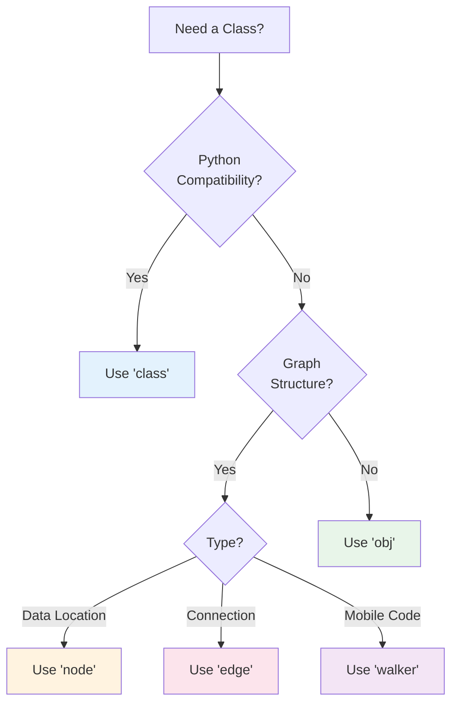

### `postinit` vs Python's `__post_init__`

The `postinit` method runs after automatic initialization:

```python
# Python dataclass post-init
@dataclass
class PythonExample:
    radius: float
    area: float = field(init=False)

    def __post_init__(self):
        self.area = 3.14159 * self.radius ** 2
```

```jac
// Jac postinit - cleaner syntax
obj Circle {
    has radius: float;
    has area: float by postinit;
    has circumference: float by postinit;
    has valid: bool by postinit;

    can postinit {
        self.area = 3.14159 * self.radius ** 2;
        self.circumference = 2 * 3.14159 * self.radius;
        self.valid = self.radius > 0;
    }
}

// Usage
let c = Circle(radius=5.0);
print(f"Area: {c.area:.2f}");  // Area: 78.54
```

### Complex Initialization Patterns

```jac
obj DatabaseConnection {
    has host: str;
    has port: int = 5432;
    has username: str;
    has password: str;
    has database: str;

    // Runtime computed fields
    has connection_string: str by postinit;
    has connection: any by postinit;
    has connected: bool by postinit;

    can postinit {
        // Build connection string
        self.connection_string =
            f"postgresql://{self.username}:{self.password}@" +
            f"{self.host}:{self.port}/{self.database}";

        // Try to connect
        try {
            import:py psycopg2;
            self.connection = psycopg2.connect(self.connection_string);
            self.connected = true;
        } except Exception as e {
            print(f"Connection failed: {e}");
            self.connection = None;
            self.connected = false;
        }
    }

    can close {
        if self.connection {
            self.connection.close();
            self.connected = false;
        }
    }
}
```

#### 5.2 Implementation Separation

### Declaring Interfaces vs Implementations

Jac allows you to separate interface declarations from their implementations:

```jac
// user_interface.jac - Just the interface
obj User {
    has id: int;
    has username: str;
    has email: str;
    has created_at: str;

    can authenticate(password: str) -> bool;
    can update_profile(data: dict) -> bool;
    can get_permissions() -> list[str];
}

// user.impl.jac - The implementation
impl User {
    can authenticate(password: str) -> bool {
        import:py bcrypt;
        stored_hash = self.load_password_hash();
        return bcrypt.checkpw(
            password.encode('utf-8'),
            stored_hash.encode('utf-8')
        );
    }

    can update_profile(data: dict) -> bool {
        // Validation
        if "email" in data and not self.validate_email(data["email"]) {
            return false;
        }

        // Update fields
        for key, value in data.items() {
            if hasattr(self, key) {
                setattr(self, key, value);
            }
        }
        return true;
    }

    can get_permissions() -> list[str] {
        // Load from database or cache
        return ["read", "write", "comment"];
    }
}
```

### File Organization with `.impl.jac`

```
project/
├── models/
│   ├── user.jac              # Interface declaration
│   ├── user.impl.jac         # Implementation
│   ├── user.test.jac         # Tests
│   │
│   ├── product.jac           # Another model
│   ├── product.impl/         # Implementation directory
│   │   ├── crud.impl.jac     # CRUD operations
│   │   ├── search.impl.jac   # Search functionality
│   │   └── analytics.impl.jac # Analytics methods
│   │
│   └── order.jac
│       └── order.impl.jac
```

### Implementation Separation Example

```jac
// shape.jac - Abstract interface
obj Shape {
    has name: str;

    can area() -> float abs;  // Abstract method
    can perimeter() -> float abs;
    can describe() -> str;
}

// circle.jac - Concrete shape
obj Circle(Shape) {
    has radius: float;
}

// circle.impl.jac - Implementation
impl Circle {
    can area() -> float {
        return 3.14159 * self.radius ** 2;
    }

    can perimeter() -> float {
        return 2 * 3.14159 * self.radius;
    }

    can describe() -> str {
        return f"{self.name}: Circle with radius {self.radius}";
    }
}

// rectangle.jac
obj Rectangle(Shape) {
    has width: float;
    has height: float;
}

// rectangle.impl.jac
impl Rectangle {
    can area() -> float {
        return self.width * self.height;
    }

    can perimeter() -> float {
        return 2 * (self.width + self.height);
    }

    can describe() -> str {
        return f"{self.name}: Rectangle {self.width}x{self.height}";
    }
}
```

### Benefits for Large Codebases

1. **Parallel Development**: Teams can work on interfaces and implementations separately
2. **Cleaner Organization**: Separate concerns into different files
3. **Easier Testing**: Mock implementations for testing
4. **Better Documentation**: Interfaces serve as documentation

```jac
// api_service.jac - Interface for external team
obj ApiService {
    has base_url: str;
    has auth_token: str;

    can fetch_data(endpoint: str) -> dict;
    can post_data(endpoint: str, data: dict) -> dict;
    can delete_resource(endpoint: str, id: str) -> bool;
}

// api_service_mock.impl.jac - Mock for testing
impl ApiService {
    can fetch_data(endpoint: str) -> dict {
        // Return mock data for testing
        return {
            "status": "success",
            "data": {"mock": true, "endpoint": endpoint}
        };
    }

    can post_data(endpoint: str, data: dict) -> dict {
        return {
            "status": "created",
            "id": "mock_123",
            "data": data
        };
    }

    can delete_resource(endpoint: str, id: str) -> bool {
        return true;  // Always successful in tests
    }
}

// api_service_real.impl.jac - Real implementation
impl ApiService {
    can fetch_data(endpoint: str) -> dict {
        import:py requests;

        response = requests.get(
            f"{self.base_url}/{endpoint}",
            headers={"Authorization": f"Bearer {self.auth_token}"}
        );

        if response.status_code == 200 {
            return response.json();
        } else {
            raise Exception(f"API error: {response.status_code}");
        }
    }

    // ... real implementations
}
```

#### 5.3 Access Control

### `:pub`, `:priv`, `:protect` Modifiers

Jac provides explicit access control modifiers:

```jac
obj BankAccount {
    // Public - accessible from anywhere
    has :pub account_number: str;
    has :pub holder_name: str;

    // Protected - accessible within module and subclasses
    has :protect balance: float;
    has :protect transaction_history: list[dict] = [];

    // Private - only accessible within this class
    has :priv pin: str;
    has :priv security_questions: dict[str, str] = {};

    // Public methods
    can :pub get_balance() -> float {
        return self.balance;
    }

    can :pub deposit(amount: float) -> bool {
        if amount > 0 {
            self.balance += amount;
            self.log_transaction("deposit", amount);
            return true;
        }
        return false;
    }

    // Protected method - for subclasses
    can :protect log_transaction(type: str, amount: float) {
        self.transaction_history.append({
            "type": type,
            "amount": amount,
            "timestamp": timestamp_now(),
            "balance": self.balance
        });
    }

    // Private method - internal only
    can :priv validate_pin(pin: str) -> bool {
        return self.pin == pin;
    }

    can :pub withdraw(amount: float, pin: str) -> bool {
        if not self.validate_pin(pin) {
            return false;
        }

        if amount > 0 and amount <= self.balance {
            self.balance -= amount;
            self.log_transaction("withdrawal", amount);
            return true;
        }
        return false;
    }
}
```

### Comparison with Python's Convention-Based Privacy

```python
# Python - Convention-based privacy
class PythonBankAccount:
    def __init__(self, account_number, pin):
        self.account_number = account_number  # Public by convention
        self._balance = 0.0  # "Protected" by convention (single underscore)
        self.__pin = pin     # "Private" by convention (double underscore)

    def _internal_method(self):  # "Protected" method
        pass

    def __private_method(self):  # "Private" method (name mangled)
        pass
```

```jac
// Jac - Enforced privacy
obj JacBankAccount {
    has :pub account_number: str;     // Truly public
    has :protect balance: float = 0.0;  // Truly protected
    has :priv pin: str;               // Truly private

    can :protect internal_method() {  // Enforced protected
        // ...
    }

    can :priv private_method() {      // Enforced private
        // ...
    }
}
```

### Access Control in Inheritance

```jac
obj Vehicle {
    has :pub brand: str;
    has :pub model: str;
    has :protect engine_code: str;
    has :priv vin: str;

    can :pub get_info() -> str {
        return f"{self.brand} {self.model}";
    }

    can :protect start_engine() {
        print(f"Starting engine {self.engine_code}");
    }

    can :priv validate_vin() -> bool {
        return len(self.vin) == 17;
    }
}

obj ElectricVehicle(Vehicle) {
    has :pub battery_capacity: float;
    has :protect battery_health: float = 100.0;

    can :pub get_range() -> float {
        // Can access protected members from parent
        if self.engine_code.startswith("EV") {
            return self.battery_capacity * self.battery_health / 100;
        }
        return 0.0;
    }

    can :protect start_engine() {
        // Override protected method
        print("Initializing electric motor...");
        super.start_engine();  // Call parent's protected method
    }

    // Cannot access parent's private members!
    // can test() {
    //     print(self.vin);  // Error: Cannot access private member
    // }
}
```

### Module-Level Access Control

```jac
// utilities.jac

// Public function - exported
can :pub calculate_tax(amount: float, rate: float) -> float {
    return amount * rate;
}

// Protected function - module and submodules only
can :protect validate_rate(rate: float) -> bool {
    return 0.0 <= rate <= 1.0;
}

// Private function - this file only
can :priv round_to_cents(amount: float) -> float {
    return round(amount, 2);
}

// Public class
obj :pub TaxCalculator {
    has :priv rates: dict[str, float];

    can :pub calculate(amount: float, category: str) -> float {
        if category in self.rates {
            return calculate_tax(amount, self.rates[category]);
        }
        return 0.0;
    }
}

// Private class - not exported
obj :priv InternalCache {
    has data: dict = {};
}
```

### Advanced OOP Patterns

```jac
// Abstract base with template method pattern
obj DataProcessor {
    can :pub process(data: list) -> list {
        // Template method - defines algorithm structure
        validated = self.validate(data);
        transformed = self.transform(validated);
        return self.finalize(transformed);
    }

    // Abstract methods for subclasses
    can :protect validate(data: list) -> list abs;
    can :protect transform(data: list) -> list abs;

    // Hook method with default implementation
    can :protect finalize(data: list) -> list {
        return data;  // Default: no finalization
    }
}

// Concrete implementation
obj CsvProcessor(DataProcessor) {
    has :priv delimiter: str = ",";

    can :protect validate(data: list) -> list {
        // Remove empty rows
        return [row for row in data if row.strip()];
    }

    can :protect transform(data: list) -> list {
        // Parse CSV rows
        import:py csv;
        reader = csv.reader(data, delimiter=self.delimiter);
        return list(reader);
    }

    can :protect finalize(data: list) -> list {
        // Convert to dictionaries using first row as headers
        if not data { return []; }

        headers = data[0];
        return [
            {headers[i]: row[i] for i in range(len(headers))}
            for row in data[1:]
        ];
    }
}
```

### Composition over Inheritance

```jac
// Component interfaces
obj Flyable {
    can fly() -> str abs;
}

obj Swimmable {
    can swim() -> str abs;
}

obj Walkable {
    can walk() -> str abs;
}

// Concrete components
obj FlyingComponent(Flyable) {
    has :priv wing_span: float;

    can fly() -> str {
        return f"Flying with {self.wing_span}m wingspan";
    }
}

obj SwimmingComponent(Swimmable) {
    has :priv swim_speed: float;

    can swim() -> str {
        return f"Swimming at {self.swim_speed} km/h";
    }
}

// Composition-based design
obj Duck {
    has :priv flying: Flyable;
    has :priv swimming: Swimmable;
    has name: str;

    can :pub fly() -> str {
        return f"{self.name}: {self.flying.fly()}";
    }

    can :pub swim() -> str {
        return f"{self.name}: {self.swimming.swim()}";
    }
}

with entry {
    let donald = Duck(
        name="Donald",
        flying=FlyingComponent(wing_span=0.5),
        swimming=SwimmingComponent(swim_speed=5.0)
    );

    print(donald.fly());   // Donald: Flying with 0.5m wingspan
    print(donald.swim());  // Donald: Swimming at 5.0 km/h
}
```

### Design Patterns in Jac

```jac
// Singleton pattern with access control
obj :pub Database {
    has :priv static instance: Database? = None;
    has :priv connection: any;

    // Private constructor
    can :priv init(connection_string: str) {
        import:py psycopg2;
        self.connection = psycopg2.connect(connection_string);
    }

    // Public factory method
    can :pub static get_instance() -> Database {
        if Database.instance is None {
            Database.instance = Database._create_instance();
        }
        return Database.instance;
    }

    can :priv static _create_instance() -> Database {
        return Database(connection_string=get_db_config());
    }
}

// Observer pattern
obj :pub Subject {
    has :priv observers: list[Observer] = [];

    can :pub attach(observer: Observer) {
        self.observers.append(observer);
    }

    can :pub detach(observer: Observer) {
        self.observers.remove(observer);
    }

    can :protect notify(data: any) {
        for observer in self.observers {
            observer.update(self, data);
        }
    }
}

obj :pub Observer {
    can update(subject: Subject, data: any) abs;
}
```

### Best Practices for OOP in Jac

1. **Use `obj` by Default**: Unless you need Python compatibility
   ```jac
   obj User {  // Preferred
       has name: str;
   }

   class User {  // Only for Python interop
       def __init__(self, name: str) {
           self.name = name;
       }
   }
   ```

2. **Leverage Automatic Constructors**: Don't write boilerplate
   ```jac
   // Good
   obj Point {
       has x: float;
       has y: float;
   }

   // Unnecessary
   obj Point {
       has x: float;
       has y: float;

       can init(x: float, y: float) {
           self.x = x;
           self.y = y;
       }
   }
   ```

3. **Use Access Control Meaningfully**: Don't make everything public
   ```jac
   obj Service {
       has :pub api_key: str;      // Public: part of interface
       has :protect cache: dict;    // Protected: for extensions
       has :priv secrets: dict;     // Private: implementation detail
   }
   ```

4. **Separate Interface from Implementation**: For large classes
   ```jac
   // Good for large projects
   // user.jac - just interface
   // user.impl.jac - implementation
   // user.test.jac - tests
   ```

5. **Prefer Composition for Flexibility**: Especially for cross-cutting concerns
   ```jac
   // Instead of deep inheritance
   obj LoggingMixin {
       can log(message: str) {
           print(f"[{timestamp_now()}] {message}");
       }
   }

   obj Service {
       has :priv logger: LoggingMixin;

       can process() {
           self.logger.log("Processing started");
       }
   }
   ```

### Summary

In this chapter, we've seen how Jac enhances object-oriented programming with:

- **Automatic constructors** that eliminate boilerplate
- **Implementation separation** for better code organization
- **Enforced access control** instead of naming conventions
- **Dataclass-like `obj`** with more power and less syntax
- **Python compatibility** when you need it

These features make Jac's OOP both more powerful and more convenient than traditional approaches. The automatic constructor generation alone can save hundreds of lines of boilerplate in larger projects, while implementation separation enables better team collaboration and code organization.

Next, we'll dive into the revolutionary Data Spatial Programming features that make Jac truly unique—nodes, edges, and walkers that transform how we think about program structure and execution.

## Part III: Data Spatial Programming Fundamentals

### Chapter 6: Introduction to Data Spatial Concepts

Welcome to the heart of what makes Jac revolutionary. In this chapter, we'll explore Data Spatial Programming (DSP), a paradigm that fundamentally changes how we think about and structure computation. If you've ever felt that traditional programming models don't naturally express the interconnected, graph-like nature of modern applications, you're about to discover a better way.

#### 6.1 The Paradigm Shift

### Traditional: Moving Data to Functions

In traditional programming, we've always moved data to computation. This model is so ingrained that we rarely question it:

```python
# Traditional Python - Data moves to functions
def calculate_social_influence(user_data, follower_data, post_data):
    influence_score = len(follower_data) * 0.3
    engagement_rate = sum(p['likes'] for p in post_data) / len(post_data)
    return influence_score + engagement_rate * 0.7

# Gather all data first
user = load_user(user_id)
followers = load_followers(user_id)  # Potentially huge dataset
posts = load_posts(user_id)        # More data movement

# Then pass to function
score = calculate_social_influence(user, followers, posts)
```

This approach has fundamental limitations:

1. **Data Movement Overhead**: We load entire datasets into memory
2. **Loss of Context**: Functions don't know where data came from
3. **Artificial Separation**: Data and its processing logic are disconnected
4. **Poor Locality**: Related data may be scattered across memory

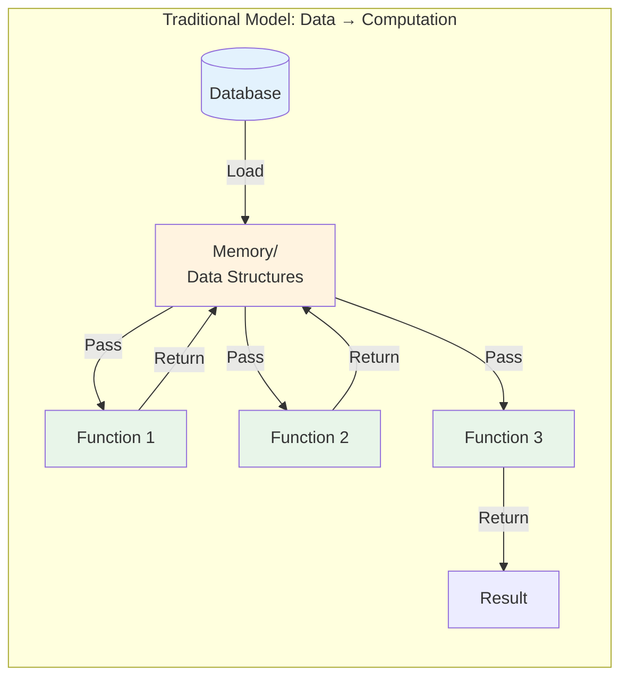

### Data Spatial: Moving Computation to Data

Data Spatial Programming inverts this relationship. Instead of bringing data to functions, we send computation to where data lives:

```jac
// Jac - Computation moves to data
walker CalculateInfluence {
    has influence_score: float = 0.0;
    has engagement_total: float = 0.0;
    has post_count: int = 0;

    can calculate with User entry {
        // Computation happens AT the user node
        self.influence_score = len([<--:Follows:]) * 0.3;

        // Visit posts without loading them all
        visit [-->:Authored:];
    }

    can calculate with Post entry {
        // Computation happens AT each post
        self.engagement_total += here.likes;
        self.post_count += 1;
    }

    can finalize with User exit {
        // Back at user node to finalize
        if self.post_count > 0 {
            engagement_rate = self.engagement_total / self.post_count;
            self.influence_score += engagement_rate * 0.7;
        }
        report self.influence_score;
    }
}
```

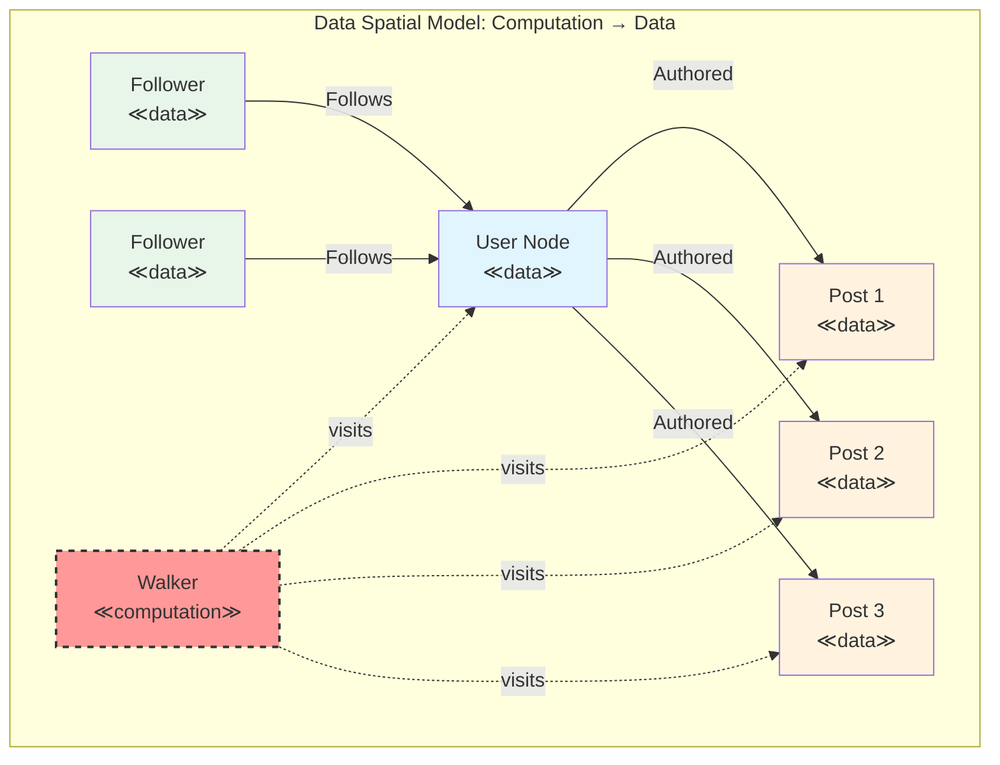

### Real-World Analogies and Use Cases

The Data Spatial paradigm mirrors how we naturally think about many real-world scenarios:

##### 1. **The Inspector Analogy**
Imagine a quality inspector in a factory:
- Traditional: Bring all products to the inspector's office
- Data Spatial: Inspector walks through the factory, examining products where they are

```jac
walker QualityInspector {
    has defects_found: list = [];

    can inspect with ProductionLine entry {
        print(f"Inspecting line: {here.name}");
        visit [-->:Contains:];  // Walk to products on this line
    }

    can inspect with Product entry {
        if here.quality_score < 0.95 {
            self.defects_found.append({
                "product": here.id,
                "score": here.quality_score,
                "line": here[<--:Contains:][0].name
            });
        }
    }
}
```

##### 2. **The Social Network**
People don't physically move to a central location to interact:

```jac
walker ViralContentTracker {
    has content: Post;
    has reach: int = 0;
    has depth: int = 0;
    has max_depth: int = 3;

    can track with User entry {
        self.reach += 1;

        if self.depth < self.max_depth {
            // Content spreads through network
            self.depth += 1;
            visit [-->:Follows:] where (
                ?interested_in(here, self.content.topic)
            );
            self.depth -= 1;
        }
    }
}
```

##### 3. **The Delivery System**
Packages move through a network of locations:

```jac
walker PackageDelivery {
    has package_id: str;
    has destination: Location;
    has route: list = [];

    can deliver with Location entry {
        self.route.append(here);

        if here == self.destination {
            here.receive_package(self.package_id);
            report "Delivered!";
            disengage;
        }

        // Find next hop
        next_hop = here.get_next_hop(self.destination);
        if next_hop {
            visit next_hop;
        } else {
            report "No route found!";
            disengage;
        }
    }
}
```

### Benefits of the Paradigm Shift

##### 1. **Natural Problem Modeling**
Many problems are inherently graph-like:
- Social networks
- Transportation systems
- Organizational hierarchies
- Biological systems
- Computer networks
- Supply chains

##### 2. **Improved Locality**
Computation happens where data lives:
```jac
// Traditional: Load all data
recommendations = []
for user in all_users:  # Load millions of users
    for friend in user.friends:  # Load all friends
        for post in friend.posts:  # Load all posts
            if matches_interests(user, post):
                recommendations.append(post)

// Data Spatial: Process in place
walker RecommendationEngine {
    has user_interests: list;
    has recommendations: list = [];

    can find with User entry {
        self.user_interests = here.interests;
        visit [-->:Follows:];  # Only visit friends
    }

    can find with User entry via Follows {
        // At friend node, check recent posts
        for post in [-->:Authored:][0:10] {  # Only recent posts
            if self.matches_interests(post) {
                self.recommendations.append(post);
            }
        }
    }
}
```

##### 3. **Distributed-Ready**
The paradigm naturally extends across machines:

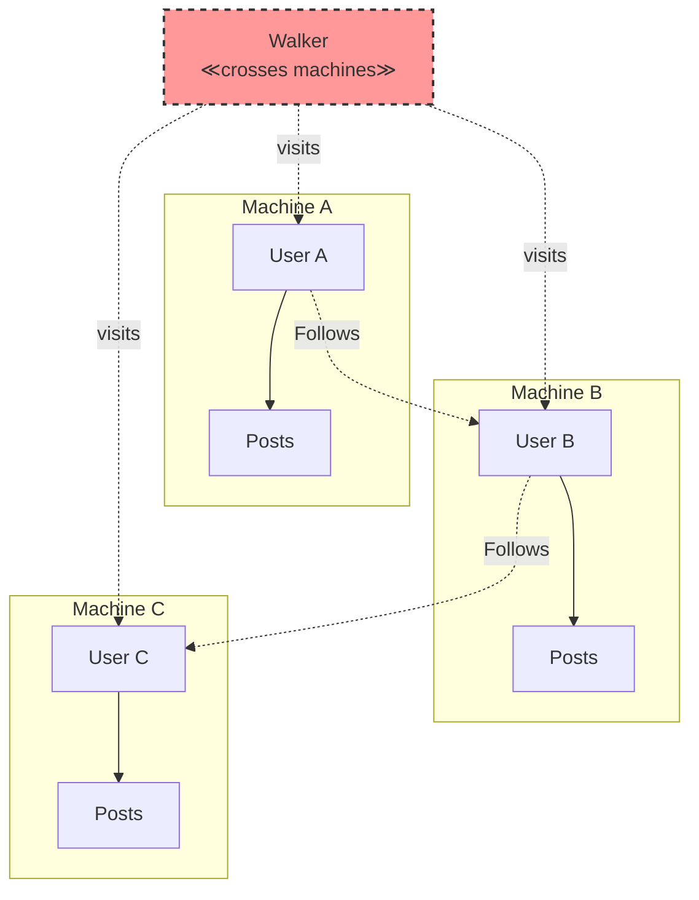

#### 6.2 Core Archetypes

### Nodes: Data Locations with Computation

Nodes are the fundamental data containers in DSP, but unlike traditional objects, they're aware of their position in the topology and can respond to visitors:

```jac
node UserProfile {
    has username: str;
    has bio: str;
    has joined_date: str;
    has reputation: int = 0;

    // Node ability - triggered by walker visits
    can update_reputation with ReputationCalculator entry {
        old_rep = self.reputation;
        self.reputation = visitor.calculate_for(self);

        if self.reputation > old_rep {
            print(f"{self.username} gained {self.reputation - old_rep} reputation!");
        }
    }

    // Nodes can have regular methods too
    can get_account_age() -> int {
        import:py from datetime import datetime;
        joined = datetime.fromisoformat(self.joined_date);
        return (datetime.now() - joined).days;
    }
}
```

Key characteristics of nodes:
1. **Persistent by Connection**: Connect to `root` for automatic persistence
2. **Location-Aware**: Know their connections and position
3. **Reactive**: Respond to walker visits with abilities
4. **Stateful**: Maintain data between visits

### Edges: First-Class Relationships

Edges aren't just connections—they're full objects with behavior:

```jac
edge Friendship {
    has since: str;
    has strength: float = 1.0;
    has interaction_count: int = 0;

    // Edges can have abilities too!
    can strengthen with SocialInteraction entry {
        self.interaction_count += 1;
        self.strength = min(10.0, self.strength * 1.1);

        print(f"Friendship strengthened to {self.strength:.1f}");
    }

    // Regular methods
    can get_duration_days() -> int {
        import:py from datetime import datetime;
        start = datetime.fromisoformat(self.since);
        return (datetime.now() - start).days;
    }
}

edge Follows {
    has notifications: bool = true;
    has categories: list[str] = [];

    can should_notify(post_category: str) -> bool {
        return self.notifications and (
            not self.categories or
            post_category in self.categories
        );
    }
}
```

Why edges as first-class objects matter:
1. **Rich Relationships**: Model complex relationship properties
2. **Relationship Evolution**: Relationships can change over time
3. **Traversal Control**: Filter traversals based on edge properties
4. **Behavioral Relationships**: Edges can have their own logic

### Walkers: Mobile Computational Entities

Walkers are the "programs" of DSP—they move through the graph executing computation:

```jac
walker DataAggregator {
    // Walker state - travels with the walker
    has totals: dict = {};
    has visit_count: int = 0;
    has max_depth: int = 3;
    has current_depth: int = 0;

    // Entry ability for Department nodes
    can aggregate with Department entry {
        dept_name = here.name;
        dept_total = here.budget;

        // Aggregate sub-departments
        if self.current_depth < self.max_depth {
            self.current_depth += 1;
            visit [-->:Contains:];
            self.current_depth -= 1;
        }

        // Store results
        if dept_name not in self.totals {
            self.totals[dept_name] = 0;
        }
        self.totals[dept_name] += dept_total;
        self.visit_count += 1;
    }

    // Exit ability - cleanup or final processing
    can summarize with Department exit {
        if self.current_depth == 0 {  // Back at starting node
            print(f"Visited {self.visit_count} departments");
            print(f"Totals: {self.totals}");
        }
    }
}
```

Walker characteristics:
1. **Stateful**: Carry data as they traverse
2. **Reactive**: Different behavior for different node/edge types
3. **Autonomous**: Make traversal decisions based on discoveries
4. **Composable**: Multiple walkers can work together

### How They Extend Traditional OOP

Traditional OOP gives us encapsulation and inheritance. DSP adds:

1. **Topology**: Objects know their relationships
2. **Mobility**: Computation can move between objects
3. **Reactivity**: Objects respond to computational visitors
4. **Distribution**: Natural support for distributed systems

```mermaid
graph TD
    subgraph "Traditional OOP"
        O1[Object]
        O2[Object]
        O3[Object]
        M1[method()]
        M2[method()]
        M3[method()]

        O1 --> M1
        O2 --> M2
        O3 --> M3
    end

    subgraph "Data Spatial"
        N1[Node]
        N2[Node]
        N3[Node]
        E1[Edge]
        E2[Edge]
        W[Walker]

        N1 ---|E1| N2
        N2 ---|E2| N3
        W -.->|visits| N1
        W -.->|visits| N2
        W -.->|visits| N3
    end

    style O1 fill:#e3f2fd
    style O2 fill:#e3f2fd
    style O3 fill:#e3f2fd
    style N1 fill:#e8f5e9
    style N2 fill:#e8f5e9
    style N3 fill:#e8f5e9
    style E1 fill:#fff3e0
    style E2 fill:#fff3e0
    style W fill:#ff9999
```

### Complete Example: Task Management System

Let's see all archetypes working together:

```jac
// Nodes represent data locations
node Project {
    has name: str;
    has deadline: str;
    has status: str = "active";

    can update_status with StatusUpdater entry {
        old_status = self.status;
        self.status = visitor.new_status;
        print(f"Project {self.name}: {old_status} → {self.status}");
    }
}

node Task {
    has title: str;
    has completed: bool = false;
    has estimated_hours: float;
    has actual_hours: float = 0.0;

    can mark_complete with TaskCompleter entry {
        self.completed = true;
        self.actual_hours = visitor.hours_spent;
        visitor.tasks_completed += 1;
    }
}

node Developer {
    has name: str;
    has skills: list[str];
    has capacity: float = 40.0;  // hours per week
}

// Edges represent relationships
edge Contains {
    has created_at: str;
}

edge AssignedTo {
    has assigned_date: str;
    has priority: int = 5;

    can is_overdue() -> bool {
        // Check if task is overdue based on project deadline
        task = self.target;
        project = task[<--:Contains:][0];
        return not task.completed and now() > project.deadline;
    }
}

// Walkers perform computations
walker ProjectAnalyzer {
    has total_tasks: int = 0;
    has completed_tasks: int = 0;
    has total_hours: float = 0.0;
    has overdue_tasks: list = [];

    can analyze with Project entry {
        print(f"Analyzing project: {here.name}");
        visit [-->:Contains:];
    }

    can analyze with Task entry {
        self.total_tasks += 1;

        if here.completed {
            self.completed_tasks += 1;
            self.total_hours += here.actual_hours;
        }

        // Check assignments
        for assignment in [-->:AssignedTo:] {
            if assignment.is_overdue() {
                self.overdue_tasks.append({
                    "task": here.title,
                    "developer": assignment.target.name
                });
            }
        }
    }

    can report with Project exit {
        completion_rate = (self.completed_tasks / self.total_tasks * 100)
                         if self.total_tasks > 0 else 0;

        report {
            "project": here.name,
            "total_tasks": self.total_tasks,
            "completed": self.completed_tasks,
            "completion_rate": f"{completion_rate:.1f}%",
            "total_hours": self.total_hours,
            "overdue": self.overdue_tasks
        };
    }
}

// Using it all together
with entry {
    // Create project structure
    web_project = Project(
        name="Website Redesign",
        deadline="2024-12-31"
    );
    root ++> web_project;

    // Add tasks
    task1 = web_project ++>:Contains:++> Task(
        title="Design Homepage",
        estimated_hours=20
    );

    task2 = web_project ++>:Contains:++> Task(
        title="Implement Backend",
        estimated_hours=40
    );

    // Assign to developers
    alice = root ++> Developer(
        name="Alice",
        skills=["design", "frontend"]
    );

    bob = root ++> Developer(
        name="Bob",
        skills=["backend", "database"]
    );

    task1 ++>:AssignedTo(priority=8):++> alice;
    task2 ++>:AssignedTo(priority=9):++> bob;

    // Analyze the project
    analyzer = ProjectAnalyzer();
    result = analyzer spawn web_project;
    print(result);
}
```

### Why This Matters

The Data Spatial approach provides:

1. **Natural Modeling**: The code structure mirrors the problem domain
2. **Separation of Concerns**: Data (nodes), relationships (edges), and algorithms (walkers) are clearly separated
3. **Reusability**: Walkers can traverse any compatible graph structure
4. **Scalability**: The same code works for 10 nodes or 10 million
5. **Maintainability**: Changes to structure don't break algorithms

In the next chapters, we'll dive deeper into building and traversing these graph structures, exploring the full power of Data Spatial Programming.

### Summary

In this chapter, we've introduced the revolutionary concepts of Data Spatial Programming:

- **The Paradigm Shift**: From moving data to computation → moving computation to data
- **Nodes**: Data locations that can react to visitors
- **Edges**: First-class relationships with properties and behavior
- **Walkers**: Mobile computational entities that traverse and process

This isn't just a new syntax—it's a fundamentally different way of thinking about program structure that aligns with how we naturally model interconnected systems. Next, we'll get hands-on with building your first graph structures in Jac.

### Chapter 7: Building Your First Graph

Now that you understand the conceptual foundations of Data Spatial Programming, let's get hands-on and build real graph structures. In this chapter, you'll learn how to create nodes and edges, connect them into meaningful topologies, and perform basic graph operations that form the foundation of DSP applications.

#### 7.1 Creating Nodes and Edges

### Node Declaration and Instantiation

Let's start with the basics of creating nodes. Unlike traditional objects, nodes are designed to exist within a graph topology:

```jac
// Simple node declaration
node Person {
    has name: str;
    has email: str;
    has age: int;
}

// Creating node instances
with entry {
    // Standalone node (not persistent)
    let alice = Person(
        name="Alice Johnson",
        email="alice@example.com",
        age=28
    );

    // Connected to root (persistent)
    let bob = root ++> Person(
        name="Bob Smith",
        email="bob@example.com",
        age=32
    );

    // Alternative: create then connect
    let charlie = Person(
        name="Charlie Brown",
        email="charlie@example.com",
        age=25
    );
    root ++> charlie;  // Now persistent
}
```

### Understanding Node Persistence

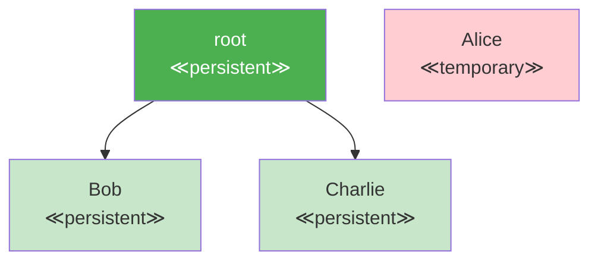

Nodes connected to `root` (directly or indirectly) persist between program runs:

```jac
// First run - create data
with entry {
    print("Creating user profiles...");

    let user1 = root ++> Person(
        name="User One",
        email="user1@example.com",
        age=30
    );
}

// Second run - data still exists!
with entry {
    let users = root[-->:Person:];
    print(f"Found {len(users)} existing users");

    for user in users {
        print(f"- {user.name} ({user.email})");
    }
}
```

### Connecting Nodes with Edges

Edges represent relationships between nodes. They can be simple connections or rich objects with properties:

```jac
// Simple edge creation
node City {
    has name: str;
    has population: int;
    has country: str;
}

with entry {
    let nyc = root ++> City(
        name="New York",
        population=8_336_000,
        country="USA"
    );

    let london = root ++> City(
        name="London",
        population=9_002_000,
        country="UK"
    );

    // Simple connection (unnamed edge)
    nyc ++> london;  // NYC connects to London
}
```

### Edge Types and Properties

Edges can have types and properties, making relationships first-class citizens:

```jac
// Typed edge with properties
edge Flight {
    has airline: str;
    has flight_number: str;
    has departure_time: str;
    has duration_hours: float;
    has price: float;

    can is_red_eye() -> bool {
        hour = int(self.departure_time.split(":")[0]);
        return hour >= 22 or hour <= 5;
    }
}

with entry {
    let lax = root ++> City(name="Los Angeles", population=4_000_000, country="USA");
    let jfk = root ++> City(name="New York", population=8_336_000, country="USA");

    // Create typed edge with properties
    lax ++>:Flight(
        airline="United",
        flight_number="UA123",
        departure_time="23:45",
        duration_hours=5.5,
        price=450.00
    ):++> jfk;

    // Another flight
    jfk ++>:Flight(
        airline="JetBlue",
        flight_number="B6456",
        departure_time="06:30",
        duration_hours=6.0,
        price=380.00
    ):++> lax;
}
```

### Graph Construction Patterns

Let's build a more complex example - a social network:

```jac
// Node types for social network
node User {
    has username: str;
    has full_name: str;
    has bio: str = "";
    has joined_date: str;
    has verified: bool = false;
}

node Post {
    has content: str;
    has created_at: str;
    has likes: int = 0;
    has views: int = 0;
}

node Comment {
    has text: str;
    has created_at: str;
    has edited: bool = false;
}

// Edge types
edge Follows {
    has since: str;
    has notifications: bool = true;
}

edge Authored {
    has device: str = "unknown";
}

edge Likes {
    has timestamp: str;
}

edge CommentedOn {
    has timestamp: str;
}

// Build the social network
with entry {
    import:py from datetime import datetime;

    // Create users
    let alice = root ++> User(
        username="alice_dev",
        full_name="Alice Johnson",
        bio="Software engineer and coffee enthusiast",
        joined_date="2024-01-15",
        verified=true
    );

    let bob = root ++> User(
        username="bob_designer",
        full_name="Bob Smith",
        bio="UI/UX Designer | Digital Artist",
        joined_date="2024-02-20"
    );

    let charlie = root ++> User(
        username="charlie_data",
        full_name="Charlie Brown",
        bio="Data Scientist | ML Enthusiast",
        joined_date="2024-03-10"
    );

    // Create follow relationships
    alice ++>:Follows(since="2024-02-21"):++> bob;
    bob ++>:Follows(since="2024-02-22", notifications=false):++> alice;
    charlie ++>:Follows(since="2024-03-11"):++> alice;
    charlie ++>:Follows(since="2024-03-12"):++> bob;

    // Alice creates a post
    let post1 = alice ++>:Authored(device="mobile"):++> Post(
        content="Just discovered Jac's Data Spatial Programming! 🚀",
        created_at=datetime.now().isoformat(),
        views=150
    );

    // Bob likes and comments
    bob ++>:Likes(timestamp=datetime.now().isoformat()):++> post1;
    post1.likes += 1;

    let comment1 = bob ++>:Authored:++> Comment(
        text="This looks amazing! Can't wait to try it out.",
        created_at=datetime.now().isoformat()
    );
    comment1 ++>:CommentedOn(timestamp=datetime.now().isoformat()):++> post1;

    // Charlie also interacts
    charlie ++>:Likes(timestamp=datetime.now().isoformat()):++> post1;
    post1.likes += 1;

    print("Social network created successfully!");
}
```

### Visualizing the Graph Structure

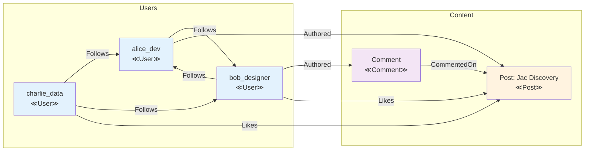

#### 7.2 Basic Graph Operations

### Navigating with Edge References (`[-->]`, `[<--]`)

Jac provides intuitive syntax for graph navigation:

```jac
walker SocialAnalyzer {
    can analyze with User entry {
        // Get all outgoing edges (who this user follows)
        let following = [-->];
        print(f"{here.username} follows {len(following)} users");

        // Get all incoming edges (who follows this user)
        let followers = [<--];
        print(f"{here.username} has {len(followers)} followers");

        // Get specific edge types
        let follow_edges = [-->:Follows:];
        let authored_content = [-->:Authored:];

        print(f"  - Following: {len(follow_edges)}");
        print(f"  - Posts/Comments: {len(authored_content)}");

        // Navigate to connected nodes
        let followed_users = [-->:Follows:-->];
        for user in followed_users {
            print(f"  → {user.username}");
        }
    }
}

with entry {
    // Spawn analyzer on each user
    for user in root[-->:User:] {
        spawn SocialAnalyzer() on user;
        print("---");
    }
}
```

### Edge Reference Syntax Patterns

```jac
// Basic navigation patterns
let outgoing = [-->];           // All outgoing edges
let incoming = [<--];           // All incoming edges
let bidirectional = [<-->];     // All edges (in or out)

// Typed navigation
let follows_out = [-->:Follows:];              // Outgoing Follows edges
let follows_in = [<--:Follows:];               // Incoming Follows edges
let all_follows = [<-->:Follows:];             // All Follows edges

// Navigate to nodes through edges
let following = [-->:Follows:-->];             // Nodes I follow
let followers = [<--:Follows:-->];             // Nodes following me
let friends = [<-->:Follows:-->];              // All connected via Follows

// Multi-hop navigation
let friends_of_friends = [-->:Follows:-->:Follows:-->];

// Navigate to specific node types
let my_posts = [-->:Authored:-->:Post:];       // Only Post nodes
let my_comments = [-->:Authored:-->:Comment:]; // Only Comment nodes
```

### Filtering Edges and Nodes

Jac provides powerful filtering capabilities:

```jac
walker ContentFilter {
    can find_popular with User entry {
        // Filter by edge properties
        let recent_follows = [-->:Follows:(?.since > "2024-01-01"):];

        // Filter by node properties
        let popular_posts = [-->:Authored:-->:Post:(?.likes > 10):];

        // Complex filters
        let verified_followers = [<--:Follows:-->:User:(?.verified == true):];

        // Filter with null safety (?)
        let active_users = [-->:Follows:-->:User:(?len(.bio) > 0):];

        print(f"User {here.username}:");
        print(f"  Recent follows: {len(recent_follows)}");
        print(f"  Popular posts: {len(popular_posts)}");
        print(f"  Verified followers: {len(verified_followers)}");
    }
}
```

### Type-Safe Graph Operations

```jac
// Define specific node types
node Admin(User) {
    has permissions: list[str] = ["read", "write", "delete"];
}

node RegularUser(User) {
    has subscription: str = "free";
}

walker TypedNavigator {
    can navigate with entry {
        // Get only Admin nodes
        let admins = [-->`Admin];

        // Get only RegularUser nodes
        let regular_users = [-->`RegularUser];

        // Type-specific operations
        for admin in admins {
            print(f"Admin {admin.username} has permissions: {admin.permissions}");
        }

        // Combined type and property filtering
        let premium_users = [-->`RegularUser:(?.subscription == "premium"):];
    }
}
```

### Graph Modification Operations

```jac
walker GraphModifier {
    has new_connections: int = 0;
    has removed_connections: int = 0;

    can modify with User entry {
        // Add new connections
        let potential_friends = self.find_potential_friends(here);

        for friend in potential_friends {
            if not self.already_connected(here, friend) {
                here ++>:Follows(since=now()):++> friend;
                self.new_connections += 1;
            }
        }

        // Remove old connections
        let old_follows = [-->:Follows:(?.since < "2023-01-01"):];
        for edge in old_follows {
            del edge;  // Remove the edge
            self.removed_connections += 1;
        }
    }

    can already_connected(user1: User, user2: User) -> bool {
        let connections = user1[-->:Follows:-->];
        return user2 in connections;
    }

    can find_potential_friends(user: User) -> list[User] {
        // Friends of friends who aren't already connected
        let friends = user[-->:Follows:-->];
        let potential = [];

        for friend in friends {
            let fof = friend[-->:Follows:-->];
            for candidate in fof {
                if candidate != user and not self.already_connected(user, candidate) {
                    potential.append(candidate);
                }
            }
        }

        return potential[0:5];  // Limit to 5 suggestions
    }
}
```

### Advanced Navigation Patterns

```jac
// Breadth-first search pattern
walker BreadthFirstSearch {
    has target_username: str;
    has visited: set = {};
    has found: bool = false;
    has path: list = [];

    can search with User entry {
        if here.username == self.target_username {
            self.found = true;
            self.path.append(here.username);
            report self.path;
            disengage;
        }

        if here in self.visited {
            skip;  // Already visited this node
        }

        self.visited.add(here);
        self.path.append(here.username);

        // Visit all connected users
        visit [-->:Follows:-->];

        // Backtrack if not found
        self.path.pop();
    }
}

// Depth-limited search
walker DepthLimitedExplorer {
    has max_depth: int = 3;
    has current_depth: int = 0;
    has discovered: list = [];

    can explore with User entry {
        if self.current_depth >= self.max_depth {
            return;  // Don't go deeper
        }

        self.discovered.append({
            "user": here.username,
            "depth": self.current_depth
        });

        // Go deeper
        self.current_depth += 1;
        visit [-->:Follows:-->];
        self.current_depth -= 1;
    }
}
```

### Graph Metrics and Analysis

```jac
walker GraphMetrics {
    has node_count: int = 0;
    has edge_count: int = 0;
    has node_types: dict = {};
    has edge_types: dict = {};

    can analyze with entry {
        // Count all nodes
        let all_nodes = [-->*];  // * means all reachable
        self.node_count = len(all_nodes);

        // Count by type
        for node in all_nodes {
            node_type = type(node).__name__;
            if node_type not in self.node_types {
                self.node_types[node_type] = 0;
            }
            self.node_types[node_type] += 1;

            // Count edges from this node
            for edge in node[-->] {
                edge_type = type(edge).__name__;
                if edge_type not in self.edge_types {
                    self.edge_types[edge_type] = 0;
                }
                self.edge_types[edge_type] += 1;
                self.edge_count += 1;
            }
        }

        report {
            "total_nodes": self.node_count,
            "total_edges": self.edge_count,
            "node_types": self.node_types,
            "edge_types": self.edge_types
        };
    }
}
```

### Practical Example: Building a Recommendation System

Let's combine everything to build a simple recommendation system:

```jac
node Movie {
    has title: str;
    has genre: str;
    has year: int;
    has rating: float;
}

edge Watched {
    has rating: int;  // User's rating (1-5)
    has date: str;
}

edge Similar {
    has similarity_score: float;
}

walker MovieRecommender {
    has user_profile: dict = {};
    has recommendations: list = [];
    has visited_movies: set = {};

    can analyze with User entry {
        print(f"Building recommendations for {here.username}...");

        // Analyze user's watching history
        let watched_movies = [-->:Watched:-->:Movie:];

        for movie in watched_movies {
            if movie.genre not in self.user_profile {
                self.user_profile[movie.genre] = {"count": 0, "avg_rating": 0.0};
            }

            let edge = here[-->:Watched:][0];  // Get the edge
            self.user_profile[movie.genre]["count"] += 1;
            self.user_profile[movie.genre]["avg_rating"] += edge.rating;

            self.visited_movies.add(movie);
        }

        // Calculate average ratings per genre
        for genre, data in self.user_profile.items() {
            data["avg_rating"] /= data["count"];
        }

        // Find movies to recommend
        visit watched_movies;
    }

    can explore with Movie entry {
        // Find similar movies
        let similar_movies = [-->:Similar:-->:Movie:];

        for movie in similar_movies {
            if movie not in self.visited_movies {
                // Score based on user preferences
                score = 0.0;
                if movie.genre in self.user_profile {
                    score = self.user_profile[movie.genre]["avg_rating"];
                    score *= movie.rating / 5.0;  // Weight by movie rating
                }

                if score > 3.0 {  // Threshold
                    self.recommendations.append({
                        "movie": movie.title,
                        "genre": movie.genre,
                        "score": score
                    });
                }
            }
        }
    }

    can finalize with User exit {
        // Sort and limit recommendations
        self.recommendations.sort(key=lambda x: x["score"], reverse=true);

        print(f"\nTop recommendations for {here.username}:");
        for i, rec in enumerate(self.recommendations[:5]) {
            print(f"{i+1}. {rec['movie']} ({rec['genre']}) - Score: {rec['score']:.2f}");
        }
    }
}

// Build movie database
with entry {
    // Create movies
    let inception = root ++> Movie(
        title="Inception",
        genre="Sci-Fi",
        year=2010,
        rating=4.8
    );

    let interstellar = root ++> Movie(
        title="Interstellar",
        genre="Sci-Fi",
        year=2014,
        rating=4.6
    );

    let dark_knight = root ++> Movie(
        title="The Dark Knight",
        genre="Action",
        year=2008,
        rating=4.9
    );

    // Create similarities
    inception ++>:Similar(similarity_score=0.85):++> interstellar;
    inception ++>:Similar(similarity_score=0.60):++> dark_knight;

    // Create user and watch history
    let user = root ++> User(
        username="movie_buff",
        full_name="John Doe",
        joined_date="2024-01-01"
    );

    user ++>:Watched(rating=5, date="2024-03-01"):++> inception;
    user ++>:Watched(rating=4, date="2024-03-05"):++> dark_knight;

    // Get recommendations
    spawn MovieRecommender() on user;
}
```

### Best Practices for Graph Building

1. **Start with Clear Node Types**: Define what entities exist in your domain
2. **Model Relationships Explicitly**: Use typed edges for meaningful connections
3. **Keep Edges Lightweight**: Heavy computation belongs in nodes or walkers
4. **Use Consistent Naming**: Follow patterns like `Verb` for edges, `Noun` for nodes
5. **Think About Traversal Early**: Design your graph to support intended algorithms

### Summary

In this chapter, we've learned:

- **Node Creation**: How to create persistent and temporary nodes
- **Edge Types**: Building rich relationships with properties and behavior
- **Graph Navigation**: Using `[-->]`, `[<--]`, and filtering syntax
- **Graph Operations**: Modifying, analyzing, and traversing graph structures

We've seen how Jac's syntax makes graph operations intuitive and type-safe. The combination of expressive navigation syntax and powerful filtering capabilities enables complex graph algorithms to be expressed concisely.

Next, we'll explore walkers in depth—the mobile computational entities that bring your graphs to life by moving computation to data.

### Chapter 8: Walkers - Computation in Motion

Walkers are the beating heart of Data Spatial Programming. They embody the paradigm shift from static functions to mobile computational entities that traverse your data graph, processing information where it lives. In this chapter, we'll master the art of creating and controlling walkers to build powerful, scalable algorithms.

#### 8.1 Walker Basics

### Declaring Walker Classes

Walkers are declared using the `walker` keyword and can contain state, abilities, and methods:

```jac
walker SimpleVisitor {
    // Walker state - travels with the walker
    has visits: int = 0;
    has path: list[str] = [];

    // Regular method
    can get_stats() -> dict {
        return {
            "total_visits": self.visits,
            "path_length": len(self.path),
            "current_path": self.path
        };
    }

    // Walker ability - triggered on node entry
    can visit_node with entry {
        self.visits += 1;
        self.path.append(here.name if hasattr(here, 'name') else str(here));
        print(f"Visit #{self.visits}: {self.path[-1]}");
    }
}
```

Key walker components:
- **State Variables** (`has`): Data that travels with the walker
- **Methods** (`can`): Regular functions for computation
- **Abilities** (`can ... with`): Event-triggered behaviors

### Spawning Walkers on Nodes

Walkers start as inactive objects and must be "spawned" to begin traversal:

```jac
node Location {
    has name: str;
    has description: str;
}

with entry {
    // Create a simple graph
    let home = root ++> Location(name="Home", description="Starting point");
    let park = home ++> Location(name="Park", description="Green space");
    let store = home ++> Location(name="Store", description="Shopping center");

    // Create walker instance (inactive)
    let visitor = SimpleVisitor();
    print(f"Walker created. Stats: {visitor.get_stats()}");

    // Spawn walker on a node (activates it)
    home spawn visitor;

    // Or use alternative syntax
    let another_visitor = SimpleVisitor();
    spawn another_visitor on home;
}
```

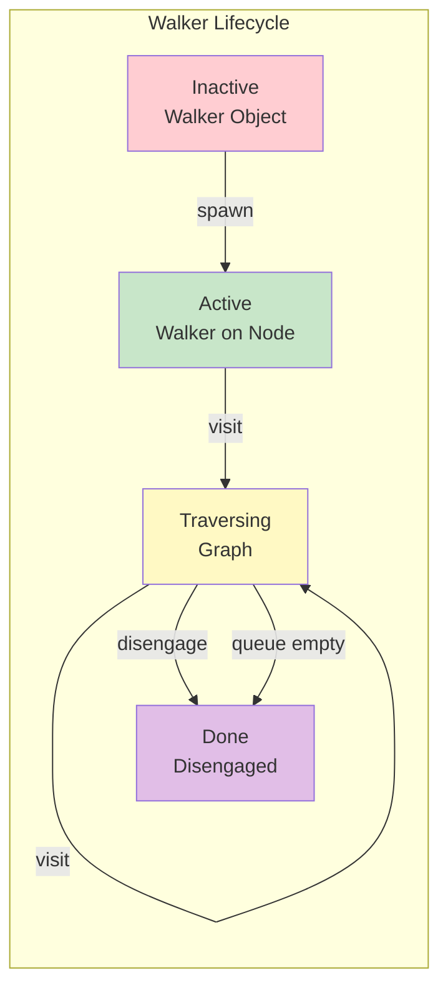

### The Walker Lifecycle

Understanding the walker lifecycle is crucial:

```jac
walker LifecycleDemo {
    has state: str = "created";
    has nodes_visited: list = [];

    // Called when walker is created (optional)
    can init(mission: str = "explore") {
        print(f"Walker initialized with mission: {mission}");
        self.state = "initialized";
    }

    // Entry ability - when arriving at a node
    can on_entry with entry {
        self.state = "active";
        self.nodes_visited.append(here);
        print(f"Entered node. Total visits: {len(self.nodes_visited)}");

        // Decide whether to continue
        if len(self.nodes_visited) < 5 {
            visit [-->];  // Continue to connected nodes
        } else {
            print("Mission complete!");
            self.state = "completed";
            disengage;  // End traversal
        }
    }

    // Exit ability - when leaving a node
    can on_exit with exit {
        print(f"Leaving node after processing");
    }

    // Final cleanup (if needed)
    can cleanup {
        print(f"Walker finished. State: {self.state}");
        print(f"Visited {len(self.nodes_visited)} nodes");
    }
}
```

#### 8.2 Traversal Patterns

### `visit` Statements for Navigation

The `visit` statement is how walkers move through the graph:

```jac
walker Explorer {
    has max_depth: int = 3;
    has current_depth: int = 0;

    can explore with entry {
        print(f"At depth {self.current_depth}: {here.name}");

        if self.current_depth < self.max_depth {
            // Visit all connected nodes
            visit [-->];

            // Or visit specific nodes
            let important_nodes = [-->].filter(
                lambda n: n.priority > 5 if hasattr(n, 'priority') else False
            );
            visit important_nodes;

            // Or visit with type filtering
            visit [-->:ImportantEdge:];
        }
    }
}
```

### `disengage` for Early Termination

Use `disengage` to stop traversal immediately:

```jac
walker SearchWalker {
    has target_name: str;
    has found: bool = false;
    has result: node? = None;

    can search with entry {
        print(f"Checking: {here.name if hasattr(here, 'name') else 'unknown'}");

        if hasattr(here, 'name') and here.name == self.target_name {
            print(f"Found target: {here.name}!");
            self.found = true;
            self.result = here;
            report here;  // Report finding
            disengage;    // Stop searching
        }

        // Continue search if not found
        visit [-->];
    }
}

with entry {
    let searcher = SearchWalker(target_name="Store");
    let result = spawn searcher on root;

    if searcher.found {
        print(f"Search successful! Found: {searcher.result.name}");
    } else {
        print("Target not found in graph");
    }
}
```

### `skip` for Conditional Processing

The `skip` statement ends processing at the current node but continues traversal:

```jac
walker ConditionalProcessor {
    has process_count: int = 0;
    has skip_count: int = 0;

    can process with entry {
        // Skip nodes that don't meet criteria
        if hasattr(here, 'active') and not here.active {
            self.skip_count += 1;
            print(f"Skipping inactive node");
            skip;  // Move to next node without further processing
        }

        // Process active nodes
        print(f"Processing node {self.process_count + 1}");
        self.process_count += 1;

        // Expensive operation only for active nodes
        self.perform_expensive_operation();

        // Continue traversal
        visit [-->];
    }

    can perform_expensive_operation {
        import:py time;
        time.sleep(0.1);  // Simulate work
        print("  - Expensive operation completed");
    }
}
```

### Queue-Based Traversal Model

Walkers use an internal queue for traversal:

```jac
walker QueueDemo {
    has visited_order: list = [];

    can demonstrate with entry {
        self.visited_order.append(here.name);
        print(f"Current queue after visiting {here.name}:");

        // The visit statement adds to queue
        let neighbors = [-->];
        for i, neighbor in enumerate(neighbors) {
            print(f"  Adding to queue: {neighbor.name}");
            visit neighbor;
        }

        print(f"Queue will be processed in order\n");
    }

    can summarize with exit {
        if len([-->) == 0 {  // At a leaf node
            print(f"Traversal order: {' -> '.join(self.visited_order)}");
        }
    }
}
```

### Advanced Traversal Patterns

#### Breadth-First Search (BFS)

```jac
walker BFSWalker {
    has visited: set = {};
    has level: dict = {};
    has current_level: int = 0;

    can bfs with entry {
        // Mark as visited
        if here in self.visited {
            skip;
        }

        self.visited.add(here);
        self.level[here] = self.current_level;

        print(f"Level {self.current_level}: {here.name}");

        // Queue all unvisited neighbors (BFS behavior)
        let unvisited = [-->].filter(lambda n: n not in self.visited);
        visit unvisited;

        // Increment level for next wave
        if all(n in self.visited for n in [-->]) {
            self.current_level += 1;
        }
    }
}
```

#### Depth-First Search (DFS)

```jac
walker DFSWalker {
    has visited: set = {};
    has stack: list = [];
    has dfs_order: list = [];

    can dfs with entry {
        if here in self.visited {
            skip;
        }

        self.visited.add(here);
        self.dfs_order.append(here.name);
        self.stack.append(here.name);

        print(f"DFS visiting: {here.name}");
        print(f"  Stack: {self.stack}");

        // Visit one unvisited neighbor at a time (DFS)
        let unvisited = [-->].filter(lambda n: n not in self.visited);
        if unvisited {
            visit unvisited[0];  // Visit first unvisited
        } else {
            // Backtrack
            self.stack.pop();
        }

        // After exploring all children, visit siblings
        for neighbor in unvisited[1:] {
            visit neighbor;
        }
    }
}
```

#### Bidirectional Search

```jac
walker BidirectionalSearch {
    has target: node;
    has forward_visited: set = {};
    has backward_visited: set = {};
    has meeting_point: node? = None;
    has search_forward: bool = true;

    can search with entry {
        if self.search_forward {
            // Forward search from source
            if here in self.backward_visited {
                self.meeting_point = here;
                print(f"Paths met at: {here.name}!");
                disengage;
            }

            self.forward_visited.add(here);
            visit [-->];

        } else {
            // Backward search from target
            if here in self.forward_visited {
                self.meeting_point = here;
                print(f"Paths met at: {here.name}!");
                disengage;
            }

            self.backward_visited.add(here);
            visit [<--];  // Reverse direction
        }
    }
}

// Usage: Spawn two walkers
with entry {
    let source = get_node("A");
    let target = get_node("Z");

    // Forward search
    let forward = BidirectionalSearch(target=target, search_forward=true);
    spawn forward on source;

    // Backward search
    let backward = BidirectionalSearch(target=source, search_forward=false);
    spawn backward on target;
}
```

#### 8.3 Walker Abilities

### Entry and Exit Abilities

Abilities are event-driven methods that execute automatically:

```jac
node Store {
    has name: str;
    has inventory: dict = {};
    has revenue: float = 0.0;
}

walker InventoryChecker {
    has low_stock_items: list = [];
    has total_value: float = 0.0;
    has stores_checked: int = 0;

    // Entry ability - main processing
    can check_inventory with Store entry {
        print(f"\nChecking store: {here.name}");
        self.stores_checked += 1;

        let store_value = 0.0;
        for item, details in here.inventory.items() {
            let quantity = details["quantity"];
            let price = details["price"];

            store_value += quantity * price;

            if quantity < 10 {
                self.low_stock_items.append({
                    "store": here.name,
                    "item": item,
                    "quantity": quantity
                });
            }
        }

        self.total_value += store_value;
        print(f"  Store value: ${store_value:.2f}");
    }

    // Exit ability - cleanup or summary
    can summarize with Store exit {
        if len([-->]) == 0 {  // Last store
            print(f"\n=== Inventory Check Complete ===");
            print(f"Stores checked: {self.stores_checked}");
            print(f"Total inventory value: ${self.total_value:.2f}");
            print(f"Low stock items: {len(self.low_stock_items)}");

            for item in self.low_stock_items {
                print(f"  - {item['store']}: {item['item']} ({item['quantity']} left)");
            }
        }
    }
}
```

### Context References: `here`, `self`, `visitor`

Understanding context references is crucial for walker abilities:

```jac
node Server {
    has name: str;
    has status: str = "running";
    has load: float = 0.0;
    has last_check: str = "";

    // Node ability - 'visitor' refers to the walker
    can log_visit with HealthChecker entry {
        print(f"Server {self.name} being checked by {visitor.checker_id}");
        self.last_check = visitor.check_time;
    }

    can provide_metrics with HealthChecker entry {
        return {
            "name": self.name,
            "status": self.status,
            "load": self.load
        };
    }
}

walker HealthChecker {
    has checker_id: str;
    has check_time: str;
    has unhealthy_servers: list = [];

    // Walker ability - 'here' refers to current node, 'self' to walker
    can check_health with Server entry {
        print(f"Checker {self.checker_id} at server {here.name}");

        // Get metrics from the server (node calling its method)
        let metrics = here.provide_metrics();

        // Check health criteria
        if here.status != "running" or here.load > 0.8 {
            self.unhealthy_servers.append({
                "server": here.name,
                "status": here.status,
                "load": here.load,
                "checked_at": self.check_time
            });

            // Try to fix issues
            if here.load > 0.8 {
                self.rebalance_load(here);
            }
        }

        // Continue to connected servers
        visit [-->:NetworkLink:];
    }

    can rebalance_load(server: Server) {
        print(f"  Attempting to rebalance load on {server.name}");
        // Rebalancing logic here
        server.load *= 0.7;  // Simplified rebalancing
    }
}
```

### Bidirectional Computation Model

The power of DSP comes from bidirectional interaction between walkers and nodes:

```jac
node SmartDevice {
    has device_id: str;
    has device_type: str;
    has settings: dict = {};
    has metrics: dict = {};

    // Node responds to configuration walker
    can apply_config with ConfigUpdater entry {
        print(f"Device {self.device_id} receiving config");

        // Node can access walker data
        let new_settings = visitor.get_settings_for(self.device_type);

        // Node updates itself
        self.settings.update(new_settings);

        // Node can modify walker state
        visitor.devices_updated += 1;
        visitor.log_update(self.device_id, new_settings);
    }

    // Node provides data to analytics walker
    can share_metrics with AnalyticsCollector entry {
        // Complex computation at the node
        let processed_metrics = self.process_raw_metrics();

        // Give data to walker
        visitor.collect_metrics(self.device_id, processed_metrics);
    }

    can process_raw_metrics() -> dict {
        // Node's own complex logic
        return {
            "uptime": self.metrics.get("uptime", 0),
            "efficiency": self.calculate_efficiency(),
            "health_score": self.calculate_health()
        };
    }

    can calculate_efficiency() -> float {
        // Complex calculation
        return 0.85;  // Simplified
    }

    can calculate_health() -> float {
        return 0.92;  // Simplified
    }
}

walker ConfigUpdater {
    has config_version: str;
    has devices_updated: int = 0;
    has update_log: list = [];

    can get_settings_for(device_type: str) -> dict {
        // Walker provides configuration based on device type
        let configs = {
            "thermostat": {"temp_unit": "celsius", "schedule": "auto"},
            "camera": {"resolution": "1080p", "night_mode": true},
            "sensor": {"sensitivity": "high", "interval": 60}
        };

        return configs.get(device_type, {});
    }

    can log_update(device_id: str, settings: dict) {
        self.update_log.append({
            "device": device_id,
            "settings": settings,
            "timestamp": now()
        });
    }

    can update_devices with SmartDevice entry {
        // Walker's main logic is in the node ability
        // This is just navigation
        visit [-->:ConnectedTo:];
    }

    can report with exit {
        print(f"\nConfiguration Update Complete:");
        print(f"  Version: {self.config_version}");
        print(f"  Devices updated: {self.devices_updated}");
    }
}

walker AnalyticsCollector {
    has metrics_db: dict = {};
    has device_count: int = 0;

    can collect_metrics(device_id: str, metrics: dict) {
        self.metrics_db[device_id] = metrics;
        self.device_count += 1;
    }

    can analyze with SmartDevice entry {
        # Trigger node's ability
        // Node will call walker's collect_metrics
        visit [-->];
    }

    can generate_report with exit {
        if self.device_count > 0 {
            print(f"\n=== Analytics Report ===");
            print(f"Devices analyzed: {self.device_count}");

            // Calculate aggregates
            avg_uptime = sum(m["uptime"] for m in self.metrics_db.values()) / self.device_count;
            avg_health = sum(m["health_score"] for m in self.metrics_db.values()) / self.device_count;

            print(f"Average uptime: {avg_uptime:.1f} hours");
            print(f"Average health score: {avg_health:.2%}");
        }
    }
}
```

### Practical Walker Patterns

#### The Aggregator Pattern

```jac
walker DataAggregator {
    has aggregation: dict = {};
    has visit_count: int = 0;

    can aggregate with DataNode entry {
        let category = here.category;
        if category not in self.aggregation {
            self.aggregation[category] = {
                "count": 0,
                "total": 0.0,
                "items": []
            };
        }

        self.aggregation[category]["count"] += 1;
        self.aggregation[category]["total"] += here.value;
        self.aggregation[category]["items"].append(here.name);

        self.visit_count += 1;
        visit [-->];
    }

    can report_summary with exit {
        print(f"\nAggregation complete. Visited {self.visit_count} nodes.");

        for category, data in self.aggregation.items() {
            avg = data["total"] / data["count"];
            print(f"\n{category}:");
            print(f"  Count: {data['count']}");
            print(f"  Average: {avg:.2f}");
            print(f"  Total: {data['total']:.2f}");
        }
    }
}
```

#### The Validator Pattern

```jac
walker GraphValidator {
    has errors: list = [];
    has warnings: list = [];
    has nodes_validated: int = 0;

    can validate with entry {
        self.nodes_validated += 1;

        // Check node properties
        if not hasattr(here, 'name') or not here.name {
            self.errors.append({
                "node": here,
                "error": "Missing or empty name"
            });
        }

        // Check connections
        let outgoing = [-->];
        let incoming = [<--];

        if len(outgoing) == 0 and len(incoming) == 0 {
            self.warnings.append({
                "node": here.name if hasattr(here, 'name') else "unknown",
                "warning": "Isolated node (no connections)"
            });
        }

        // Type-specific validation
        if hasattr(here, 'validate') {
            let validation_result = here.validate();
            if not validation_result["valid"] {
                self.errors.extend(validation_result["errors"]);
            }
        }

        visit [-->];
    }

    can report with exit {
        print(f"\n=== Validation Report ===");
        print(f"Nodes validated: {self.nodes_validated}");
        print(f"Errors found: {len(self.errors)}");
        print(f"Warnings: {len(self.warnings)}");

        if self.errors {
            print("\nErrors:");
            for error in self.errors {
                print(f"  - {error}");
            }
        }

        if self.warnings {
            print("\nWarnings:");
            for warning in self.warnings {
                print(f"  - {warning}");
            }
        }
    }
}
```

#### The Transformer Pattern

```jac
walker DataTransformer {
    has transformation_rules: dict;
    has transformed_count: int = 0;
    has backup: dict = {};

    can init(rules: dict) {
        self.transformation_rules = rules;
    }

    can transform with entry {
        // Backup original data
        if hasattr(here, 'data') {
            self.backup[here] = here.data.copy();

            // Apply transformations
            for field, rule in self.transformation_rules.items() {
                if field in here.data {
                    here.data[field] = self.apply_rule(here.data[field], rule);
                }
            }

            self.transformed_count += 1;
        }

        visit [-->];
    }

    can apply_rule(value: any, rule: dict) -> any {
        if rule["type"] == "multiply" {
            return value * rule["factor"];
        } elif rule["type"] == "uppercase" {
            return str(value).upper();
        } elif rule["type"] == "round" {
            return round(float(value), rule["decimals"]);
        }
        return value;
    }

    can rollback {
        // Restore original data if needed
        for node, original_data in self.backup.items() {
            node.data = original_data;
        }
    }
}
```

### Walker Composition

Multiple walkers can work together:

```jac
// First walker identifies targets
walker TargetIdentifier {
    has criteria: dict;
    has targets: list = [];

    can identify with entry {
        if self.matches_criteria(here) {
            self.targets.append(here);
            here.mark_as_target();  // Mark for second walker
        }
        visit [-->];
    }

    can matches_criteria(node: any) -> bool {
        // Check criteria
        return true;  // Simplified
    }
}

// Second walker processes marked targets
walker TargetProcessor {
    has processed: int = 0;

    can process with entry {
        if hasattr(here, 'is_target') and here.is_target {
            self.perform_processing(here);
            self.processed += 1;
        }
        visit [-->];
    }

    can perform_processing(node: any) {
        print(f"Processing target: {node.name if hasattr(node, 'name') else node}");
        // Processing logic
    }
}

// Orchestrator walker coordinates others
walker Orchestrator {
    has phase: str = "identify";

    can orchestrate with entry {
        if self.phase == "identify" {
            // Spawn identifier
            let identifier = TargetIdentifier(criteria={"type": "important"});
            spawn identifier on here;

            // Move to next phase
            self.phase = "process";
            visit here;  // Revisit this node

        } elif self.phase == "process" {
            // Spawn processor
            let processor = TargetProcessor();
            spawn processor on here;

            self.phase = "complete";
        }
    }
}
```

### Summary

In this chapter, we've mastered walkers—the mobile computational entities that make Data Spatial Programming unique:

- **Walker Basics**: Creating, spawning, and managing walker lifecycle
- **Traversal Control**: Using `visit`, `disengage`, and `skip` effectively
- **Walker Abilities**: Writing entry/exit abilities with proper context usage
- **Bidirectional Computation**: Leveraging the interplay between walkers and nodes
- **Advanced Patterns**: Implementing search algorithms and walker composition

Walkers transform static data structures into dynamic, reactive systems. They enable algorithms that naturally adapt to the shape and content of your data, scaling from simple traversals to complex distributed computations.

Next, we'll explore abilities in depth—the event-driven computation model that makes the interaction between walkers and nodes so powerful.

### Chapter 9: Abilities - Event-Driven Computation

Abilities represent a fundamental shift from traditional method invocation to event-driven computation. Instead of explicitly calling functions, abilities automatically execute when specific conditions are met during graph traversal. This chapter explores how abilities enable the bidirectional computation model that makes Data Spatial Programming so powerful.

#### 9.1 Understanding Abilities

### Implicit Execution vs Explicit Invocation

Traditional programming relies on explicit function calls:

```python
# Python - Explicit invocation
class DataProcessor:
    def process(self, data):
        return self.transform(data)

    def transform(self, data):
        # Must be explicitly called
        return data.upper()

processor = DataProcessor()
result = processor.process("hello")  # Explicit call
```

Abilities execute implicitly based on events:

```jac
// Jac - Implicit execution
walker DataProcessor {
    has results: list = [];

    // This ability executes automatically when entering a DataNode
    can process with DataNode entry {
        // No explicit call needed - triggered by traversal
        let transformed = here.data.upper();
        self.results.append(transformed);
    }
}

node DataNode {
    has data: str;

    // This executes automatically when DataProcessor visits
    can provide_context with DataProcessor entry {
        print(f"Processing {self.data} for {visitor.id}");
    }
}
```

The key insight: **computation happens as a natural consequence of traversal**, not through explicit invocation chains.

### Walker, Node, and Edge Abilities

Each archetype can define abilities that respond to traversal events:

```jac
// Walker abilities - defined in walkers
walker Analyzer {
    // Triggered when entering any node
    can analyze_any with entry {
        print(f"Entering some node");
    }

    // Triggered when entering specific node type
    can analyze_data with DataNode entry {
        print(f"Entering DataNode: {here.value}");
    }

    // Triggered when entering specific edge type
    can traverse_connection with Connection entry {
        print(f"Traversing Connection edge: {here.strength}");
    }

    // Exit abilities
    can complete_analysis with DataNode exit {
        print(f"Leaving DataNode: {here.value}");
    }
}

// Node abilities - defined in nodes
node DataNode {
    has value: any;
    has metadata: dict = {};

    // Triggered when any walker enters
    can log_visitor with entry {
        self.metadata["last_visitor"] = str(type(visitor).__name__);
        self.metadata["visit_count"] = self.metadata.get("visit_count", 0) + 1;
    }

    // Triggered when specific walker type enters
    can provide_data with Analyzer entry {
        // Node can modify the visiting walker
        visitor.collected_data.append(self.value);
    }

    // Exit abilities
    can cleanup with Analyzer exit {
        print(f"Analyzer leaving with {len(visitor.collected_data)} items");
    }
}

// Edge abilities - defined in edges
edge Connection {
    has strength: float;
    has established: str;

    // Triggered when any walker traverses
    can log_traversal with entry {
        print(f"Edge traversed: strength={self.strength}");
    }

    // Triggered when specific walker traverses
    can apply_weight with Analyzer entry {
        // Edges can influence traversal
        visitor.path_weight += self.strength;
    }
}
```

### Execution Order and Precedence

When a walker interacts with a location, abilities execute in a specific order:

```jac
node ExperimentNode {
    has name: str;
    has data: dict = {};

    can phase1 with OrderTest entry {
        print(f"1. Node entry ability (general)");
    }

    can phase2 with OrderTest entry {
        print(f"2. Node entry ability (specific to OrderTest)");
        visitor.log.append("node-entry");
    }

    can phase5 with OrderTest exit {
        print(f"5. Node exit ability");
        visitor.log.append("node-exit");
    }
}

walker OrderTest {
    has log: list = [];

    can phase3 with ExperimentNode entry {
        print(f"3. Walker entry ability");
        self.log.append("walker-entry");
    }

    can phase4 with ExperimentNode exit {
        print(f"4. Walker exit ability");
        self.log.append("walker-exit");
    }

    can demonstrate with entry {
        // This shows the complete order
        visit [-->];
    }
}

// Execution order is always:
// 1. Location (node/edge) entry abilities
// 2. Walker entry abilities
// 3. Walker exit abilities
// 4. Location (node/edge) exit abilities
```

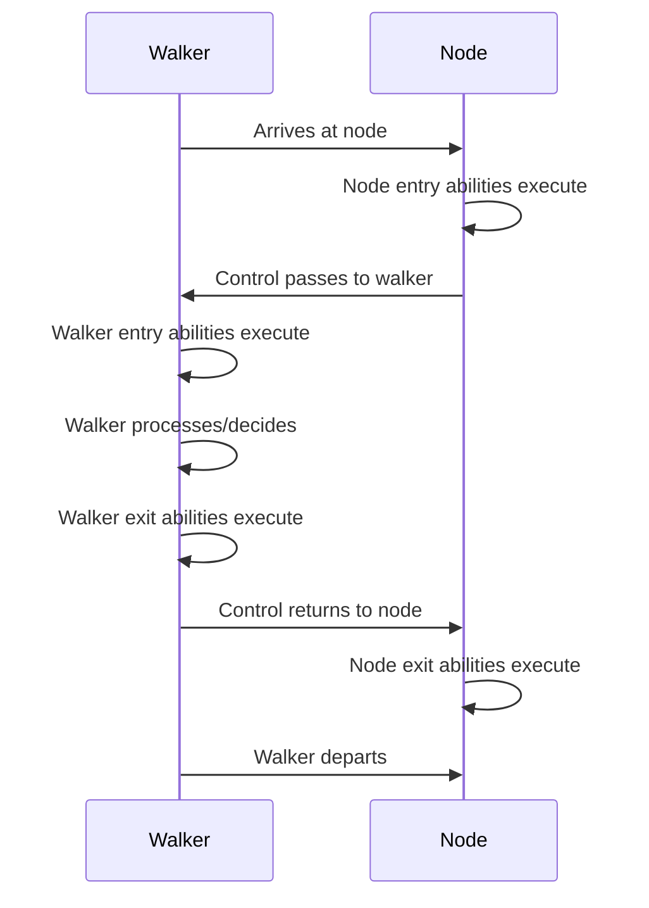

#### 9.2 Practical Ability Patterns

### Data Validation on Arrival

Abilities excel at validating data as walkers traverse:

```jac
node DataRecord {
    has id: str;
    has data: dict;
    has validated: bool = false;
    has validation_errors: list = [];

    // Validate when validator arrives
    can validate_record with DataValidator entry {
        print(f"Validating record {self.id}");

        // Clear previous validation
        self.validation_errors = [];
        self.validated = false;

        // Perform validation
        let errors = visitor.validate_schema(self.data);

        if errors {
            self.validation_errors = errors;
            visitor.invalid_count += 1;
        } else {
            self.validated = true;
            visitor.valid_count += 1;
        }
    }

    // Provide data to collectors only if valid
    can provide_data with DataCollector entry {
        if self.validated {
            visitor.collect(self.id, self.data);
        } else {
            visitor.skip_invalid(self.id, self.validation_errors);
        }
    }
}

walker DataValidator {
    has schema: dict;
    has valid_count: int = 0;
    has invalid_count: int = 0;

    can validate_schema(data: dict) -> list {
        let errors = [];

        // Check required fields
        for field in self.schema.get("required", []) {
            if field not in data {
                errors.append(f"Missing required field: {field}");
            }
        }

        // Check field types
        for field, expected_type in self.schema.get("types", {}).items() {
            if field in data and not isinstance(data[field], expected_type) {
                errors.append(f"Invalid type for {field}: expected {expected_type.__name__}");
            }
        }

        // Check constraints
        for field, constraints in self.schema.get("constraints", {}).items() {
            if field in data {
                value = data[field];

                if "min" in constraints and value < constraints["min"] {
                    errors.append(f"{field} below minimum: {value} < {constraints['min']}");
                }

                if "max" in constraints and value > constraints["max"] {
                    errors.append(f"{field} above maximum: {value} > {constraints['max']}");
                }
        }

        return errors;
    }

    can validate_all with entry {
        visit [-->];
    }

    can report with exit {
        print(f"\nValidation Complete:");
        print(f"  Valid records: {self.valid_count}");
        print(f"  Invalid records: {self.invalid_count}");
    }
}
```

### State Transformation During Traversal

Abilities can transform node state based on traversal context:

```jac
node Account {
    has id: str;
    has balance: float;
    has status: str = "active";
    has transactions: list = [];
    has interest_rate: float = 0.02;

    // Apply interest when processor visits
    can apply_interest with InterestProcessor entry {
        if self.status == "active" and self.balance > 0 {
            let interest = self.balance * visitor.get_rate(self);
            self.balance += interest;

            self.transactions.append({
                "type": "interest",
                "amount": interest,
                "date": visitor.processing_date,
                "balance_after": self.balance
            });

            visitor.total_interest_paid += interest;
            visitor.accounts_processed += 1;
        }
    }

    // Update status based on balance
    can update_status with StatusUpdater entry {
        let old_status = self.status;

        if self.balance < 0 {
            self.status = "overdrawn";
        } elif self.balance == 0 {
            self.status = "zero_balance";
        } elif self.balance < 100 {
            self.status = "low_balance";
        } else {
            self.status = "active";
        }

        if old_status != self.status {
            visitor.status_changes.append({
                "account": self.id,
                "from": old_status,
                "to": self.status
            });
        }
    }
}

walker InterestProcessor {
    has processing_date: str;
    has base_rate: float = 0.02;
    has total_interest_paid: float = 0.0;
    has accounts_processed: int = 0;

    can get_rate(account: Account) -> float {
        // Premium accounts get better rates
        if account.balance > 10000 {
            return self.base_rate * 1.5;
        } elif account.balance > 5000 {
            return self.base_rate * 1.25;
        }
        return self.base_rate;
    }

    can process_batch with entry {
        print(f"Starting interest processing for {self.processing_date}");
        visit [-->:Account:];
    }

    can summarize with exit {
        print(f"\nInterest Processing Complete:");
        print(f"  Date: {self.processing_date}");
        print(f"  Accounts processed: {self.accounts_processed}");
        print(f"  Total interest paid: ${self.total_interest_paid:.2f}");
    }
}
```

### Aggregation and Reporting

Abilities enable elegant aggregation patterns:

```jac
node SalesRegion {
    has name: str;
    has sales_data: list = [];

    can contribute_data with SalesAggregator entry {
        // Calculate region metrics
        let total_sales = sum(sale["amount"] for sale in self.sales_data);
        let avg_sale = total_sales / len(self.sales_data) if self.sales_data else 0;

        // Add to aggregator
        visitor.add_region_data(
            region=self.name,
            total=total_sales,
            average=avg_sale,
            count=len(self.sales_data)
        );

        // Visit sub-regions
        visit [-->:Contains:];
    }
}

node SalesPerson {
    has name: str;
    has sales: list = [];
    has quota: float;

    can report_performance with SalesAggregator entry {
        let total = sum(sale["amount"] for sale in self.sales);
        let performance = (total / self.quota * 100) if self.quota > 0 else 0;

        visitor.add_person_data(
            name=self.name,
            total=total,
            quota=self.quota,
            performance=performance
        );

        // Contribute to region totals
        if here[<--:WorksIn:] {
            let region = here[<--:WorksIn:][0].source;
            region.sales_data.extend(self.sales);
        }
    }
}

walker SalesAggregator {
    has period: str;
    has region_data: dict = {};
    has person_data: list = [];
    has summary: dict = {};

    can add_region_data(region: str, total: float, average: float, count: int) {
        self.region_data[region] = {
            "total": total,
            "average": average,
            "count": count
        };
    }

    can add_person_data(name: str, total: float, quota: float, performance: float) {
        self.person_data.append({
            "name": name,
            "total": total,
            "quota": quota,
            "performance": performance
        });
    }

    can aggregate with entry {
        print(f"Aggregating sales data for {self.period}");
        visit [-->];
    }

    can generate_summary with exit {
        // Calculate company-wide metrics
        self.summary = {
            "period": self.period,
            "total_sales": sum(r["total"] for r in self.region_data.values()),
            "regions_analyzed": len(self.region_data),
            "salespeople_count": len(self.person_data),
            "top_region": max(self.region_data.items(), key=lambda x: x[1]["total"])[0],
            "top_performer": max(self.person_data, key=lambda x: x["performance"])["name"]
        };

        print(f"\n=== Sales Summary for {self.period} ===");
        print(f"Total Sales: ${self.summary['total_sales']:,.2f}");
        print(f"Top Region: {self.summary['top_region']}");
        print(f"Top Performer: {self.summary['top_performer']}");
    }
}
```

### Error Handling in Abilities

Abilities should handle errors gracefully:

```jac
node DataSource {
    has url: str;
    has cache: dict? = None;
    has last_fetch: str? = None;
    has error_count: int = 0;

    can provide_data with DataFetcher entry {
        try {
            // Try cache first
            if self.cache and self.is_cache_valid() {
                visitor.receive_data(self.cache);
                visitor.cache_hits += 1;
                return;
            }

            // Fetch fresh data
            import:py requests;
            response = requests.get(self.url, timeout=5);

            if response.status_code == 200 {
                self.cache = response.json();
                self.last_fetch = now();
                self.error_count = 0;

                visitor.receive_data(self.cache);
                visitor.fetch_count += 1;
            } else {
                self.handle_error(f"HTTP {response.status_code}");
                visitor.error_sources.append(self);
            }

        } except TimeoutError {
            self.handle_error("Timeout");
            visitor.timeout_sources.append(self);

        } except Exception as e {
            self.handle_error(str(e));
            visitor.error_sources.append(self);
        }
    }

    can handle_error(error: str) {
        self.error_count += 1;
        print(f"Error fetching from {self.url}: {error}");

        // Exponential backoff
        if self.error_count > 3 {
            print(f"  Source marked as unreliable after {self.error_count} errors");
        }
    }

    can is_cache_valid() -> bool {
        if not self.last_fetch {
            return false;
        }

        // Cache valid for 1 hour
        import:py from datetime import datetime, timedelta;
        last = datetime.fromisoformat(self.last_fetch);
        return datetime.now() - last < timedelta(hours=1);
    }
}

walker DataFetcher {
    has data_buffer: list = [];
    has fetch_count: int = 0;
    has cache_hits: int = 0;
    has error_sources: list = [];
    has timeout_sources: list = [];

    can receive_data(data: dict) {
        self.data_buffer.append(data);
    }

    can fetch_all with entry {
        visit [-->:DataSource:];
    }

    can report_status with exit {
        print(f"\nData Fetch Complete:");
        print(f"  Sources fetched: {self.fetch_count}");
        print(f"  Cache hits: {self.cache_hits}");
        print(f"  Errors: {len(self.error_sources)}");
        print(f"  Timeouts: {len(self.timeout_sources)}");
        print(f"  Total data collected: {len(self.data_buffer)} items");

        if self.error_sources {
            print("\nFailed sources:");
            for source in self.error_sources {
                print(f"  - {source.url} (errors: {source.error_count})");
            }
        }
    }
}
```

### Advanced Ability Patterns

### Cooperative Processing

Multiple walkers can cooperate through abilities:

```jac
node WorkItem {
    has id: str;
    has status: str = "pending";
    has data: dict;
    has assigned_to: str? = None;
    has result: any? = None;
    has dependencies: list = [];

    // First walker marks items
    can mark_ready with DependencyChecker entry {
        let deps_complete = all(
            dep.status == "completed"
            for dep in self.dependencies
        );

        if deps_complete and self.status == "pending" {
            self.status = "ready";
            visitor.ready_count += 1;
        }
    }

    // Second walker assigns work
    can assign_work with WorkAssigner entry {
        if self.status == "ready" and not self.assigned_to {
            let worker = visitor.get_next_worker();
            self.assigned_to = worker;
            self.status = "assigned";

            visitor.assignments[worker].append(self);
        }
    }

    // Third walker processes
    can process_work with WorkProcessor entry {
        if self.status == "assigned" and self.assigned_to == visitor.worker_id {
            try {
                // Simulate processing
                self.result = self.perform_work();
                self.status = "completed";
                visitor.completed_items.append(self.id);

                // Notify dependents
                self.notify_dependents();

            } except Exception as e {
                self.status = "failed";
                visitor.failed_items.append({
                    "id": self.id,
                    "error": str(e)
                });
            }
        }
    }

    can perform_work() -> any {
        // Actual work logic
        return f"Processed: {self.data}";
    }

    can notify_dependents {
        // Find items depending on this
        for item in [<--:DependsOn:] {
            print(f"  Notifying dependent: {item.source.id}");
        }
    }
}

// Orchestrator spawns walkers in sequence
walker WorkflowOrchestrator {
    has phases: list = ["check_deps", "assign", "process"];
    has current_phase: int = 0;

    can orchestrate with entry {
        let phase = self.phases[self.current_phase];
        print(f"\nExecuting phase: {phase}");

        if phase == "check_deps" {
            spawn DependencyChecker() on here;
        } elif phase == "assign" {
            spawn WorkAssigner(workers=["w1", "w2", "w3"]) on here;
        } elif phase == "process" {
            // Spawn processor for each worker
            for worker in ["w1", "w2", "w3"] {
                spawn WorkProcessor(worker_id=worker) on here;
            }
        }

        // Move to next phase
        self.current_phase += 1;
        if self.current_phase < len(self.phases) {
            visit here;  // Revisit to continue
        }
    }
}
```

### Ability Composition

Abilities can be composed for complex behaviors:

```jac
// Mixin-like node abilities
node ObservableNode {
    has observers: list = [];
    has change_log: list = [];

    can notify_observers(change: dict) {
        for observer in self.observers {
            observer.on_change(self, change);
        }

        self.change_log.append({
            "timestamp": now(),
            "change": change
        });
    }
}

node CacheableNode {
    has cache_key: str;
    has cached_at: str? = None;
    has ttl_seconds: int = 3600;

    can is_cache_valid() -> bool {
        if not self.cached_at {
            return false;
        }

        import:py from datetime import datetime, timedelta;
        cached = datetime.fromisoformat(self.cached_at);
        return datetime.now() - cached < timedelta(seconds=self.ttl_seconds);
    }

    can invalidate_cache {
        self.cached_at = None;
    }
}

// Composed node using both patterns
node SmartDataNode(ObservableNode, CacheableNode) {
    has data: dict;
    has version: int = 0;

    // Override data setter to trigger notifications
    can update_data with DataUpdater entry {
        let old_data = self.data.copy();
        let changes = visitor.get_changes();

        // Update data
        self.data.update(changes);
        self.version += 1;
        self.cached_at = now();

        // Notify observers
        self.notify_observers({
            "type": "data_update",
            "old": old_data,
            "new": self.data,
            "version": self.version
        });

        visitor.nodes_updated += 1;
    }

    // Provide cached data efficiently
    can get_data with DataReader entry {
        visitor.requests += 1;

        if self.is_cache_valid() {
            visitor.cache_hits += 1;
            visitor.receive_data(self.data, cached=true);
        } else {
            // Simulate expensive operation
            self.refresh_data();
            visitor.receive_data(self.data, cached=false);
        }
    }

    can refresh_data {
        import:py time;
        time.sleep(0.1);  // Simulate work
        self.cached_at = now();
    }
}
```

### Dynamic Ability Selection

Abilities can conditionally execute based on runtime state:

```jac
node AdaptiveProcessor {
    has mode: str = "normal";
    has load: float = 0.0;
    has error_rate: float = 0.0;

    // Different processing strategies based on mode
    can process_normal with DataWalker entry {
        if self.mode != "normal" {
            return;  // Skip if not in normal mode
        }

        // Normal processing
        let result = self.standard_process(visitor.data);
        visitor.results.append(result);

        // Update metrics
        self.load = self.calculate_load();
        self.check_mode_change();
    }

    can process_degraded with DataWalker entry {
        if self.mode != "degraded" {
            return;
        }

        // Simplified processing for high load
        let result = self.simple_process(visitor.data);
        visitor.results.append(result);
        visitor.degraded_count += 1;
    }

    can process_recovery with DataWalker entry {
        if self.mode != "recovery" {
            return;
        }

        // Careful processing during recovery
        try {
            let result = self.careful_process(visitor.data);
            visitor.results.append(result);
            self.error_rate *= 0.9;  // Reduce error rate
        } except {
            self.error_rate = min(1.0, self.error_rate * 1.1);
        }

        self.check_mode_change();
    }

    can check_mode_change {
        let old_mode = self.mode;

        if self.error_rate > 0.2 {
            self.mode = "recovery";
        } elif self.load > 0.8 {
            self.mode = "degraded";
        } else {
            self.mode = "normal";
        }

        if old_mode != self.mode {
            print(f"Mode changed: {old_mode} -> {self.mode}");
        }
    }

    can standard_process(data: any) -> any {
        // Full processing
        return data;
    }

    can simple_process(data: any) -> any {
        // Reduced processing
        return data;
    }

    can careful_process(data: any) -> any {
        // Careful processing with validation
        return data;
    }
}
```

### Performance Considerations

Abilities should be designed for efficiency:

```jac
node OptimizedNode {
    has large_data: list;
    has index: dict? = None;
    has stats_cache: dict? = None;
    has stats_valid: bool = false;

    // Lazy initialization
    can build_index {
        if self.index is None {
            print("Building index...");
            self.index = {};
            for i, item in enumerate(self.large_data) {
                if "id" in item {
                    self.index[item["id"]] = i;
            }
        }
    }

    // Efficient lookup using index
    can find_item with ItemFinder entry {
        self.build_index();

        let target_id = visitor.target_id;
        if target_id in self.index {
            let idx = self.index[target_id];
            visitor.found_item = self.large_data[idx];
            visitor.comparisons = 1;  // O(1) lookup
        } else {
            visitor.found_item = None;
            visitor.comparisons = 0;
        }
    }

    // Cached statistics
    can get_stats with StatsCollector entry {
        if not self.stats_valid {
            self.stats_cache = {
                "count": len(self.large_data),
                "total": sum(item.get("value", 0) for item in self.large_data),
                "average": sum(item.get("value", 0) for item in self.large_data) / len(self.large_data)
            };
            self.stats_valid = true;
        }

        visitor.collect_stats(self.stats_cache);
    }

    // Invalidate cache on updates
    can update_data with DataUpdater entry {
        self.large_data.extend(visitor.new_data);
        self.stats_valid = false;  // Invalidate cache
        self.index = None;  // Rebuild index on next search
    }
}

// Batch processing for efficiency
walker BatchProcessor {
    has batch_size: int = 100;
    has current_batch: list = [];
    has processed_count: int = 0;

    can collect with DataNode entry {
        self.current_batch.append(here.data);

        if len(self.current_batch) >= self.batch_size {
            self.process_batch();
            self.current_batch = [];
        }

        visit [-->];
    }

    can process_batch {
        // Process entire batch at once
        print(f"Processing batch of {len(self.current_batch)} items");

        // Batch operations are often more efficient
        import:py numpy as np;
        if all(isinstance(item, (int, float)) for item in self.current_batch) {
            batch_array = np.array(self.current_batch);
            result = np.mean(batch_array);  // Vectorized operation
            print(f"  Batch mean: {result}");
        }

        self.processed_count += len(self.current_batch);
    }

    can finalize with exit {
        // Process remaining items
        if self.current_batch {
            self.process_batch();
        }

        print(f"Total processed: {self.processed_count}");
    }
}
```

### Best Practices for Abilities

##### 1. **Keep Abilities Focused**
Each ability should have a single, clear purpose:

```jac
// Good - focused abilities
node Order {
    can validate_items with OrderValidator entry {
        // Only validation logic
    }

    can calculate_total with PriceCalculator entry {
        // Only price calculation
    }

    can check_inventory with InventoryChecker entry {
        // Only inventory checking
    }
}

// Bad - doing too much
node Order {
    can process_everything with OrderProcessor entry {
        // Validation, calculation, inventory, shipping, etc.
        // Too much in one ability!
    }
}
```

##### 2. **Use Guards for Conditional Execution**
Prevent unnecessary processing with early returns:

```jac
can process_premium with PremiumProcessor entry {
    // Guard clause
    if not here.is_premium_eligible() {
        return;  // Skip processing
    }

    // Main logic only for eligible nodes
    self.apply_premium_benefits(here);
}
```

##### 3. **Handle State Mutations Carefully**
Be explicit about state changes:

```jac
node Counter {
    has value: int = 0;
    has history: list = [];

    can increment with CounterWalker entry {
        // Store previous state
        let old_value = self.value;

        // Mutate state
        self.value += visitor.increment_by;

        // Track changes
        self.history.append({
            "from": old_value,
            "to": self.value,
            "by": visitor.walker_id,
            "at": now()
        });

        // Notify visitor of change
        visitor.changes_made.append({
            "node": self,
            "old": old_value,
            "new": self.value
        });
    }
}
```

##### 4. **Design for Testability**
Make abilities testable by keeping them pure when possible:

```jac
node Calculator {
    has formula: str;

    // Pure calculation - easy to test
    can calculate(values: dict) -> float {
        // Parse and evaluate formula
        return eval_formula(self.formula, values);
    }

    // Ability delegates to pure function
    can provide_result with CalculationWalker entry {
        let result = self.calculate(visitor.values);
        visitor.collect_result(self, result);
    }
}
```

##### 5. **Document Ability Contracts**
Be clear about what abilities expect and provide:

```jac
node DataProvider {
    """
    Provides data to visiting walkers.

    Expected visitor interface:
    - receive_data(data: dict, metadata: dict)
    - can_handle_format(format: str) -> bool

    Modifies visitor state:
    - Adds data to visitor's collection
    - Updates visitor's metadata
    """
    can provide with DataCollector entry {
        if not visitor.can_handle_format(self.format) {
            visitor.skip_unsupported(self);
            return;
        }

        visitor.receive_data(
            data=self.data,
            metadata=self.get_metadata()
        );
    }
}
```

### Summary

In this chapter, we've explored abilities—the event-driven computation model at the heart of Data Spatial Programming:

- **Implicit Execution**: Abilities trigger automatically during traversal
- **Multi-Actor System**: Walkers, nodes, and edges all participate
- **Execution Order**: Predictable sequencing enables complex interactions
- **Practical Patterns**: Validation, transformation, aggregation, and error handling
- **Advanced Techniques**: Composition, cooperation, and performance optimization

Abilities transform static data structures into reactive, intelligent systems. They enable computation to happen exactly where and when it's needed, without explicit orchestration. This event-driven model, combined with mobile walkers, creates systems that are both powerful and maintainable.

Next, we'll explore the scale-agnostic features that make Jac applications automatically persist data and handle multiple users without additional code—taking the concepts we've learned and making them production-ready.

## Part IV: Scale-Agnostic Programming

### Chapter 10: The Root Node and Persistence

One of Jac's most revolutionary features is automatic persistence through the root node. Unlike traditional applications that require explicit database operations, Jac programs naturally persist state between executions. This chapter explores how the root node enables scale-agnostic programming, where the same code works for single-user scripts and multi-user applications.

#### 10.1 Understanding the Root Node

### Global Accessibility via `root` Keyword

The `root` keyword provides global access to a special persistent node that serves as the anchor for your application's data:

```jac
// root is available everywhere - no imports needed
with entry {
    print(f"Root node: {root}");
    print(f"Type: {type(root).__name__}");

    // root is always the same node within a user context
    let id1 = id(root);
    do_something();
    let id2 = id(root);
    assert id1 == id2;  // Always true
}

can do_something() {
    // root accessible in any function
    root ++> node { has data: str = "test"; };
}

walker Explorer {
    can explore with entry {
        // root accessible in walkers
        print(f"Starting from: {root}");
        visit root;
    }
}

node CustomNode {
    can check_root with entry {
        // root accessible in node abilities
        print(f"Root from node: {root}");
    }
}
```

The `root` node is special:
- **Always Available**: No declaration or initialization needed
- **Globally Accessible**: Available in any context without passing
- **Type-Safe**: It's a real node with all node capabilities
- **User-Specific**: Each user gets their own isolated root

### Automatic Persistence Model

Everything connected to root persists automatically:

```jac
// First run - create data
with entry {
    print("=== First Run - Creating Data ===");

    // Data connected to root persists
    let user_profile = root ++> node UserProfile {
        has username: str = "alice";
        has created_at: str = "2024-01-15";
        has login_count: int = 1;
    };

    print(f"Created profile: {user_profile.username}");
}

// Second run - data still exists!
with entry {
    print("=== Second Run - Data Persists ===");

    // Find existing data
    let profiles = root[-->:UserProfile:];
    if profiles {
        let profile = profiles[0];
        print(f"Found profile: {profile.username}");
        print(f"Previous logins: {profile.login_count}");

        // Update persistent data
        profile.login_count += 1;
        print(f"Updated logins: {profile.login_count}");
    }
}

// Third run - updates persist too
with entry {
    print("=== Third Run - Updates Persist ===");

    let profile = root[-->:UserProfile:][0];
    print(f"Login count is now: {profile.login_count}");  // Shows 3
}
```

### Reachability-Based Persistence

Nodes persist based on reachability from root:

```jac
node Document {
    has title: str;
    has content: str;
    has created: str;
}

node Tag {
    has name: str;
    has color: str = "#0000FF";
}

with entry {
    // Connected to root = persistent
    let doc1 = root ++> Document(
        title="My First Document",
        content="This will persist",
        created=now()
    );

    // Connected to persistent node = also persistent
    let tag1 = doc1 ++> Tag(name="important");

    // NOT connected to root = temporary
    let doc2 = Document(
        title="Temporary Document",
        content="This will NOT persist",
        created=now()
    );

    // Connecting later makes it persistent
    root ++> doc2;  // Now doc2 will persist

    // Disconnecting makes it non-persistent
    del root --> doc1;  // doc1 and tag1 no longer persist
}
```

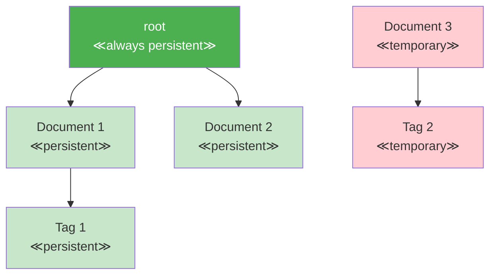

#### 10.2 Building Persistent Applications

### Connecting to Root for Persistence

Here's how to design applications with automatic persistence:

```jac
// Application data model
node AppData {
    has version: str = "1.0.0";
    has settings: dict = {};
    has initialized: bool = false;
}

node User {
    has id: str;
    has email: str;
    has preferences: dict = {};
    has created_at: str;
}

node Session {
    has token: str;
    has user_id: str;
    has expires_at: str;
    has active: bool = true;
}

// Initialize or get existing app data
can get_or_create_app_data() -> AppData {
    let app_data_nodes = root[-->:AppData:];

    if not app_data_nodes {
        print("First run - initializing app data");
        return root ++> AppData(
            initialized=true,
            settings={
                "theme": "light",
                "language": "en",
                "debug": false
            }
        );
    }

    return app_data_nodes[0];
}

// User management with persistence
can create_user(email: str) -> User? {
    let app = get_or_create_app_data();

    // Check if user exists
    let existing = app[-->:User:].filter(
        lambda u: User -> bool : u.email == email
    );

    if existing {
        print(f"User {email} already exists");
        return None;
    }

    // Create persistent user
    let user = app ++> User(
        id=generate_id(),
        email=email,
        created_at=now()
    );

    print(f"Created user: {email}");
    return user;
}

// Session management
can create_session(user: User) -> Session {
    import:py from datetime import datetime, timedelta;

    // Sessions connected to user (persistent)
    let session = user ++> Session(
        token=generate_token(),
        user_id=user.id,
        expires_at=(datetime.now() + timedelta(hours=24)).isoformat()
    );

    return session;
}

// Example usage
with entry {
    let app = get_or_create_app_data();
    print(f"App version: {app.version}");

    // Create or get user
    let email = "alice@example.com";
    let user = create_user(email);

    if user {
        let session = create_session(user);
        print(f"Session created: {session.token[:8]}...");
    } else {
        // User already exists, find them
        let user = app[-->:User:].filter(
            lambda u: User -> bool : u.email == email
        )[0];
        print(f"Welcome back, {user.email}!");
        print(f"Account created: {user.created_at}");
    }
}
```

### Managing Ephemeral vs Persistent State

Not everything should persist. Here's how to manage both:

```jac
node PersistentCache {
    has data: dict = {};
    has updated_at: str;
}

node EphemeralCache {
    has data: dict = {};
    has created_at: str;
}

walker CacheManager {
    has operation: str;
    has key: str;
    has value: any? = None;

    can manage with entry {
        // Get or create persistent cache
        let p_cache = root[-->:PersistentCache:][0] if root[-->:PersistentCache:]
                     else root ++> PersistentCache(updated_at=now());

        // Ephemeral cache is not connected to root
        let e_cache = EphemeralCache(created_at=now());

        if self.operation == "store" {
            // Store in both caches
            p_cache.data[self.key] = self.value;
            p_cache.updated_at = now();
            e_cache.data[self.key] = self.value;

            print(f"Stored {self.key} in both caches");

        } elif self.operation == "get" {
            // Try ephemeral first (faster)
            if self.key in e_cache.data {
                print(f"Found {self.key} in ephemeral cache");
                report e_cache.data[self.key];
            } elif self.key in p_cache.data {
                print(f"Found {self.key} in persistent cache");
                report p_cache.data[self.key];
            } else {
                print(f"Key {self.key} not found");
                report None;
            }
        }
    }
}

// Hybrid approach for performance
node FastStore {
    has persistent_data: dict = {};    // Important data
    has memory_cache: dict = {};      // Temporary cache
    has stats: dict = {               // Temporary stats
        "hits": 0,
        "misses": 0
    };

    can get(key: str) -> any? {
        // Check memory first
        if key in self.memory_cache {
            self.stats["hits"] += 1;
            return self.memory_cache[key];
        }

        // Check persistent
        if key in self.persistent_data {
            self.stats["misses"] += 1;
            // Populate memory cache
            self.memory_cache[key] = self.persistent_data[key];
            return self.persistent_data[key];
        }

        return None;
    }

    can store(key: str, value: any, persist: bool = true) {
        self.memory_cache[key] = value;

        if persist {
            self.persistent_data[key] = value;
        }
    }
}
```

### Database-Free Data Persistence

Jac eliminates the need for separate databases in many applications:

```jac
// Traditional approach requires database setup
// Python with SQLAlchemy:
# from sqlalchemy import create_engine, Column, String, Integer
# from sqlalchemy.ext.declarative import declarative_base
#
# Base = declarative_base()
# engine = create_engine('sqlite:///app.db')
#
# class Task(Base):
#     __tablename__ = 'tasks'
#     id = Column(Integer, primary_key=True)
#     title = Column(String)
#     completed = Column(Boolean)
#
# Base.metadata.create_all(engine)
# session = Session(engine)
# # ... lots more boilerplate ...

// Jac approach - just connect to root!
node Task {
    has id: str;
    has title: str;
    has completed: bool = false;
    has created_at: str;
    has completed_at: str? = None;
}

node TaskList {
    has name: str;
    has created_at: str;
}

// Complete task management with zero database code
walker TaskManager {
    has command: str;
    has title: str = "";
    has list_name: str = "default";
    has task_id: str = "";

    can execute with entry {
        // Get or create task list
        let lists = root[-->:TaskList:(?.name == self.list_name):];
        let task_list = lists[0] if lists else root ++> TaskList(
            name=self.list_name,
            created_at=now()
        );

        match self.command {
            case "add": self.add_task(task_list);
            case "complete": self.complete_task(task_list);
            case "list": self.list_tasks(task_list);
            case "stats": self.show_stats(task_list);
        }
    }

    can add_task(task_list: TaskList) {
        let task = task_list ++> Task(
            id=generate_id(),
            title=self.title,
            created_at=now()
        );

        print(f"Added task: {task.title} (ID: {task.id[:8]})");
    }

    can complete_task(task_list: TaskList) {
        let tasks = task_list[-->:Task:(?.id.startswith(self.task_id)):];

        if tasks {
            let task = tasks[0];
            task.completed = true;
            task.completed_at = now();
            print(f"Completed: {task.title}");
        } else {
            print(f"Task {self.task_id} not found");
        }
    }

    can list_tasks(task_list: TaskList) {
        let tasks = task_list[-->:Task:];
        print(f"\n=== {task_list.name} Tasks ===");

        for task in tasks {
            let status = "✓" if task.completed else "○";
            print(f"{status} [{task.id[:8]}] {task.title}");
        }

        let completed = tasks.filter(lambda t: Task -> bool : t.completed);
        print(f"\nTotal: {len(tasks)} | Completed: {len(completed)}");
    }

    can show_stats(task_list: TaskList) {
        let tasks = task_list[-->:Task:];
        let completed = tasks.filter(lambda t: Task -> bool : t.completed);

        print(f"\n=== Task Statistics ===");
        print(f"List: {task_list.name}");
        print(f"Total tasks: {len(tasks)}");
        print(f"Completed: {len(completed)}");
        print(f"Pending: {len(tasks) - len(completed)}");

        if completed {
            // Calculate average completion time
            import:py from datetime import datetime;
            total_time = 0;

            for task in completed {
                created = datetime.fromisoformat(task.created_at);
                completed = datetime.fromisoformat(task.completed_at);
                total_time += (completed - created).total_seconds();
            }

            avg_hours = (total_time / len(completed)) / 3600;
            print(f"Avg completion time: {avg_hours:.1f} hours");
        }
    }
}

// Usage - all data persists automatically!
with entry {
    import:py sys;

    if len(sys.argv) < 2 {
        print("Usage: jac run tasks.jac <command> [args]");
        print("Commands:");
        print("  add <title> - Add a new task");
        print("  complete <id> - Mark task as complete");
        print("  list - Show all tasks");
        print("  stats - Show statistics");
        return;
    }

    let command = sys.argv[1];
    let manager = TaskManager(command=command);

    if command == "add" and len(sys.argv) > 2 {
        manager.title = " ".join(sys.argv[2:]);
    } elif command == "complete" and len(sys.argv) > 2 {
        manager.task_id = sys.argv[2];
    }

    spawn manager on root;
}
```

### Advanced Persistence Patterns

#### Versioned Data

```jac
node VersionedDocument {
    has id: str;
    has content: str;
    has version: int = 1;
    has created_at: str;
    has modified_at: str;
}

node DocumentVersion {
    has version: int;
    has content: str;
    has modified_at: str;
    has modified_by: str;
}

walker DocumentEditor {
    has doc_id: str;
    has new_content: str;
    has user: str;

    can edit with entry {
        // Find document
        let docs = root[-->:VersionedDocument:(?.id == self.doc_id):];
        if not docs {
            print(f"Document {self.doc_id} not found");
            return;
        }

        let doc = docs[0];

        // Save current version
        doc ++> DocumentVersion(
            version=doc.version,
            content=doc.content,
            modified_at=doc.modified_at,
            modified_by=self.user
        );

        // Update document
        doc.content = self.new_content;
        doc.version += 1;
        doc.modified_at = now();

        print(f"Document updated to version {doc.version}");
    }

    can get_history with entry {
        let docs = root[-->:VersionedDocument:(?.id == self.doc_id):];
        if not docs {
            return;
        }

        let doc = docs[0];
        let versions = doc[-->:DocumentVersion:];

        print(f"\n=== History for {doc.id} ===");
        print(f"Current version: {doc.version}");

        for v in versions.sorted(key=lambda x: x.version, reverse=true) {
            print(f"\nVersion {v.version}:");
            print(f"  Modified: {v.modified_at}");
            print(f"  By: {v.modified_by}");
            print(f"  Content: {v.content[:50]}...");
        }
    }
}
```

#### Lazy Loading Pattern

```jac
node DataContainer {
    has id: str;
    has metadata: dict;
    has data_loaded: bool = false;
}

node HeavyData {
    has payload: list;
    has size_mb: float;
}

walker DataLoader {
    has container_id: str;
    has operation: str;

    can operate with DataContainer entry {
        if self.operation == "get_metadata" {
            // Just return metadata without loading heavy data
            report here.metadata;

        } elif self.operation == "load_full" {
            if not here.data_loaded {
                // Load heavy data only when needed
                self.load_heavy_data(here);
            }

            let heavy = here[-->:HeavyData:][0];
            report {
                "metadata": here.metadata,
                "data": heavy.payload,
                "size": heavy.size_mb
            };
        }
    }

    can load_heavy_data(container: DataContainer) {
        print(f"Loading heavy data for {container.id}...");

        // Simulate loading large data
        import:py time;
        time.sleep(1);

        container ++> HeavyData(
            payload=list(range(1000000)),
            size_mb=7.6
        );

        container.data_loaded = true;
    }
}
```

#### Garbage Collection Pattern

```jac
node CachedItem {
    has key: str;
    has value: any;
    has created_at: str;
    has last_accessed: str;
    has ttl_hours: int = 24;
}

walker CacheCleanup {
    has cleaned_count: int = 0;
    has checked_count: int = 0;

    can cleanup with CachedItem entry {
        import:py from datetime import datetime, timedelta;

        self.checked_count += 1;

        last_access = datetime.fromisoformat(here.last_accessed);
        age = datetime.now() - last_access;

        if age > timedelta(hours=here.ttl_hours) {
            print(f"Removing expired cache item: {here.key}");

            // Disconnect from root to remove persistence
            for edge in here[<--] {
                del edge;
            }

            self.cleaned_count += 1;
        }

        visit [-->];
    }

    can report with exit {
        print(f"\nCache cleanup complete:");
        print(f"  Checked: {self.checked_count} items");
        print(f"  Cleaned: {self.cleaned_count} items");
    }
}

// Run periodic cleanup
with entry:cleanup {
    print("Running cache cleanup...");
    spawn CacheCleanup() on root;
}
```

### Performance Considerations

While persistence is automatic, consider these patterns for optimization:

```jac
// Indexing pattern for fast lookups
node IndexedCollection {
    has name: str;
    has indices: dict = {};

    can add_item(item: dict) {
        // Store item
        let item_node = self ++> node DataItem {
            has data: dict;
        }(data=item);

        // Update indices
        for key, value in item.items() {
            if key not in self.indices {
                self.indices[key] = {};
            }

            if value not in self.indices[key] {
                self.indices[key][value] = [];
            }

            self.indices[key][value].append(item_node);
        }
    }

    can find_by(key: str, value: any) -> list {
        if key in self.indices and value in self.indices[key] {
            return self.indices[key][value];
        }
        return [];
    }
}

// Pagination pattern for large collections
walker PaginatedQuery {
    has page: int = 1;
    has page_size: int = 20;
    has filters: dict = {};
    has total_count: int = 0;
    has results: list = [];

    can query with entry {
        // Get all matching items
        let all_items = root[-->:DataItem:];

        // Apply filters
        let filtered = all_items;
        for key, value in self.filters.items() {
            filtered = filtered.filter(
                lambda item: DataItem -> bool : item.data.get(key) == value
            );
        }

        self.total_count = len(filtered);

        // Paginate
        let start = (self.page - 1) * self.page_size;
        let end = start + self.page_size;
        self.results = filtered[start:end];

        report {
            "page": self.page,
            "page_size": self.page_size,
            "total": self.total_count,
            "pages": (self.total_count + self.page_size - 1) // self.page_size,
            "data": self.results
        };
    }
}
```

### Summary

In this chapter, we've explored Jac's revolutionary persistence model:

- **The Root Node**: A globally accessible anchor for persistent data
- **Automatic Persistence**: No database required—just connect to root
- **Reachability Model**: Data persists based on graph connectivity
- **Zero Configuration**: No schema definitions, migrations, or connection strings
- **Performance Patterns**: Indexing, lazy loading, and cleanup strategies

This persistence model eliminates entire categories of boilerplate code. You focus on your domain logic while Jac handles data persistence automatically. The same patterns that work for a simple script scale to multi-user applications—which we'll explore in the next chapter.

### Chapter 11: Multi-User Applications

Jac's automatic user isolation transforms single-user code into multi-user applications without modification. Each user gets their own isolated root node and data space, enabling secure multi-tenancy by default. This chapter explores how to build applications that serve multiple users simultaneously while maintaining data isolation and enabling controlled sharing.

#### 11.1 Automatic User Isolation

### User-Specific Root Nodes

In Jac, each user automatically gets their own isolated root node:

```jac
// This same code works for ANY user
with entry {
    // 'root' always refers to the current user's root
    let profile = root[-->:UserProfile:];

    if not profile {
        // First time user
        print("Welcome! Creating your profile...");
        root ++> UserProfile(
            created_at=now(),
            last_login=now()
        );
    } else {
        // Returning user
        let prof = profile[0];
        print(f"Welcome back! Last login: {prof.last_login}");
        prof.last_login = now();
    }
}

node UserProfile {
    has created_at: str;
    has last_login: str;
    has preferences: dict = {};
    has subscription: str = "free";
}
```

When different users run this code:
- Alice sees only Alice's data
- Bob sees only Bob's data
- No explicit user management needed!

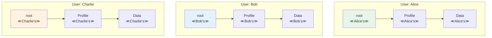

### Built-in Session Management

Jac handles user sessions automatically:

```jac
// No session management code needed!
walker TodoManager {
    has command: str;
    has task_title: str = "";

    can manage with entry {
        // Automatically executes in correct user context
        match self.command {
            case "add": self.add_task();
            case "list": self.list_tasks();
            case "stats": self.show_stats();
        }
    }

    can add_task {
        // Creates task in current user's space
        let task = root ++> Task(
            title=self.task_title,
            created_at=now(),
            owner=get_current_user_id()  // Automatic!
        );

        print(f"Task added: {task.title}");
    }

    can list_tasks {
        // Only sees current user's tasks
        let tasks = root[-->:Task:];

        print(f"\nYour tasks ({len(tasks)} total):");
        for task in tasks {
            let status = "✓" if task.completed else "○";
            print(f"  {status} {task.title}");
        }
    }
}

node Task {
    has title: str;
    has completed: bool = false;
    has created_at: str;
    has owner: str;
}
```

### Security Through Topology

User isolation is enforced at the graph level:

```jac
// Attempting cross-user access
walker SecurityTest {
    has target_user_id: str;

    can test_isolation with entry {
        // This will NEVER access another user's data
        let my_data = root[-->:PrivateData:];
        print(f"Found {len(my_data)} private items");

        // Even if you somehow got another user's node reference,
        // the runtime prevents cross-user traversal
        try {
            let other_root = self.get_other_user_root(self.target_user_id);
            let their_data = other_root[-->:PrivateData:];  // BLOCKED!
        } except SecurityError as e {
            print(f"Security: {e}");  // "Cross-user access denied"
        }
    }
}

node PrivateData {
    has content: str;
    has classification: str = "confidential";
}
```

#### 11.2 Multi-User Patterns

### User Data Organization

Best practices for organizing user-specific data:

```jac
// User data hierarchy pattern
node UserSpace {
    has user_id: str;
    has created_at: str;
    has tier: str = "free";
}

node Projects {
    has active_count: int = 0;
    has archived_count: int = 0;
}

node Settings {
    has theme: str = "light";
    has language: str = "en";
    has notifications: dict = {
        "email": true,
        "push": false,
        "sms": false
    };
}

// Initialize user space
walker InitializeUser {
    has user_id: str;
    has tier: str = "free";

    can setup with entry {
        // Check if already initialized
        let existing = root[-->:UserSpace:];
        if existing {
            print(f"User {self.user_id} already initialized");
            return;
        }

        // Create organized structure
        let space = root ++> UserSpace(
            user_id=self.user_id,
            created_at=now(),
            tier=self.tier
        );

        space ++> Projects();
        space ++> Settings();

        print(f"Initialized user space for {self.user_id}");
    }
}

// Organize user projects
node Project {
    has name: str;
    has description: str = "";
    has created_at: str;
    has updated_at: str;
    has archived: bool = false;
    has collaborators: list[str] = [];
}

walker ProjectManager {
    has action: str;
    has project_name: str;
    has description: str = "";

    can manage with entry {
        // Get user's project container
        let space = root[-->:UserSpace:][0];
        let projects = space[-->:Projects:][0];

        match self.action {
            case "create": self.create_project(projects);
            case "list": self.list_projects(projects);
            case "archive": self.archive_project(projects);
            case "share": self.share_project(projects);
        }
    }

    can create_project(projects: Projects) {
        let project = projects ++> Project(
            name=self.project_name,
            description=self.description,
            created_at=now(),
            updated_at=now()
        );

        projects.active_count += 1;
        print(f"Created project: {project.name}");
    }

    can list_projects(projects: Projects) {
        let all_projects = projects[-->:Project:];
        let active = all_projects.filter(lambda p: Project -> bool : not p.archived);
        let archived = all_projects.filter(lambda p: Project -> bool : p.archived);

        print(f"\n=== Your Projects ===");
        print(f"Active ({len(active)}):");
        for p in active {
            print(f"  - {p.name}: {p.description}");
        }

        if archived {
            print(f"\nArchived ({len(archived)}):");
            for p in archived {
                print(f"  - {p.name} (archived)");
            }
        }
    }
}
```

### Shared vs Private Subgraphs

Creating controlled sharing between users:

```jac
// Shared workspace pattern
node SharedWorkspace {
    has id: str;
    has name: str;
    has created_by: str;
    has created_at: str;
    has members: list[str] = [];
}

node WorkspaceLink {
    has workspace_id: str;
    has role: str = "viewer";  // viewer, editor, admin
    has joined_at: str;
}

edge CanAccess {
    has permissions: list[str];
}

walker WorkspaceManager {
    has action: str;
    has workspace_name: str = "";
    has workspace_id: str = "";
    has invite_user: str = "";
    has role: str = "viewer";

    can manage with entry {
        match self.action {
            case "create": self.create_workspace();
            case "invite": self.invite_to_workspace();
            case "list": self.list_workspaces();
            case "access": self.access_workspace();
        }
    }

    can create_workspace {
        // Create in shared space (not under user root)
        let workspace = SharedWorkspace(
            id=generate_id(),
            name=self.workspace_name,
            created_by=get_current_user_id(),
            created_at=now(),
            members=[get_current_user_id()]
        );

        // Link to user's root
        root ++> WorkspaceLink(
            workspace_id=workspace.id,
            role="admin",
            joined_at=now()
        );

        print(f"Created workspace: {workspace.name} (ID: {workspace.id})");
        report workspace.id;
    }

    can invite_to_workspace {
        // Check if current user has permission
        let links = root[-->:WorkspaceLink:(?.workspace_id == self.workspace_id):];
        if not links or links[0].role != "admin" {
            print("Only admins can invite users");
            return;
        }

        // Create invitation (would be sent to other user)
        let invitation = {
            "workspace_id": self.workspace_id,
            "invited_by": get_current_user_id(),
            "role": self.role,
            "created_at": now()
        };

        // In real app, this would notify the other user
        print(f"Invitation sent to {self.invite_user}");
        report invitation;
    }

    can access_workspace {
        // Find workspace link
        let links = root[-->:WorkspaceLink:(?.workspace_id == self.workspace_id):];
        if not links {
            print("You don't have access to this workspace");
            return;
        }

        let link = links[0];
        print(f"Accessing workspace {self.workspace_id} as {link.role}");

        // In real app, would load shared workspace data
        // based on permissions
    }
}
```

### Cross-User Communication Patterns

Enabling users to interact while maintaining isolation:

```jac
// Message passing between users
node Message {
    has id: str;
    has from_user: str;
    has to_user: str;
    has subject: str;
    has content: str;
    has sent_at: str;
    has read_at: str? = None;
}

node Inbox;
node Outbox;

walker MessageSystem {
    has action: str;
    has to_user: str = "";
    has subject: str = "";
    has content: str = "";
    has message_id: str = "";

    can setup_messaging with entry {
        // Ensure user has inbox/outbox
        if not root[-->:Inbox:] {
            root ++> Inbox();
        }
        if not root[-->:Outbox:] {
            root ++> Outbox();
        }
    }

    can send_message with entry {
        self.setup_messaging();

        let outbox = root[-->:Outbox:][0];
        let from_user = get_current_user_id();

        // Create message in sender's outbox
        let message = outbox ++> Message(
            id=generate_id(),
            from_user=from_user,
            to_user=self.to_user,
            subject=self.subject,
            content=self.content,
            sent_at=now()
        );

        // In real system, this would trigger delivery to recipient
        // For demo, we'll simulate it
        self.deliver_message(message);

        print(f"Message sent to {self.to_user}");
    }

    can deliver_message(message: Message) {
        // This would run in recipient's context
        // Simulating cross-user delivery
        print(f"[System] Delivering message {message.id} to {message.to_user}");

        // Would create a copy in recipient's inbox
        // recipient_root[-->:Inbox:][0] ++> message_copy;
    }

    can list_inbox with entry {
        self.setup_messaging();

        let inbox = root[-->:Inbox:];
        if not inbox {
            print("No inbox found");
            return;
        }

        let messages = inbox[0][-->:Message:];
        print(f"\n=== Inbox ({len(messages)} messages) ===");

        for msg in messages.sorted(key=lambda m: m.sent_at, reverse=true) {
            let status = "📬" if msg.read_at else "📨";
            print(f"{status} From: {msg.from_user}");
            print(f"   Subject: {msg.subject}");
            print(f"   Sent: {msg.sent_at}");
        }
    }
}
```

### Public Profiles and Discovery

Allowing users to discover each other:

```jac
// Public profile system
node PublicProfile {
    has user_id: str;
    has display_name: str;
    has bio: str = "";
    has avatar_url: str = "";
    has is_public: bool = true;
    has followers_count: int = 0;
    has following_count: int = 0;
}

// Global discovery space (not under any user's root)
node GlobalDirectory {
    has profile_count: int = 0;
}

edge Follows {
    has since: str;
}

walker ProfileManager {
    has action: str;
    has display_name: str = "";
    has bio: str = "";
    has target_user: str = "";

    can manage with entry {
        match self.action {
            case "create": self.create_public_profile();
            case "update": self.update_profile();
            case "follow": self.follow_user();
            case "discover": self.discover_users();
        }
    }

    can create_public_profile {
        // Check if profile exists
        let existing = root[-->:PublicProfile:];
        if existing {
            print("Profile already exists");
            return;
        }

        // Create profile linked to user
        let profile = root ++> PublicProfile(
            user_id=get_current_user_id(),
            display_name=self.display_name,
            bio=self.bio
        );

        // Also add to global directory
        // (In real system, this would be in shared space)
        print(f"Created public profile: {profile.display_name}");
    }

    can follow_user {
        // Get my profile
        let my_profile = root[-->:PublicProfile:][0];

        // In real system, would find target user's profile
        // For demo, we'll simulate
        print(f"Following user: {self.target_user}");

        // Create follow relationship
        my_profile ++>:Follows(since=now()):++> self.target_user;
        my_profile.following_count += 1;

        // Target user's follower count would increase
        // target_profile.followers_count += 1;
    }

    can discover_users {
        // In real system, would search global directory
        print("\n=== Discover Users ===");
        print("Featured profiles:");
        print("  - @alice_dev - Software engineer and Jac enthusiast");
        print("  - @bob_designer - UI/UX Designer");
        print("  - @charlie_data - Data scientist");

        // Would actually search/filter profiles
    }
}
```

### Activity Feeds and Notifications

Building user-specific activity streams:

```jac
node Activity {
    has id: str;
    has type: str;  // post, comment, like, follow
    has actor_id: str;
    has actor_name: str;
    has content: dict;
    has created_at: str;
    has read: bool = false;
}

node ActivityFeed {
    has last_checked: str;
}

walker ActivityManager {
    has action: str;
    has activity_type: str = "";
    has content: dict = {};

    can manage with entry {
        // Ensure feed exists
        if not root[-->:ActivityFeed:] {
            root ++> ActivityFeed(last_checked=now());
        }

        match self.action {
            case "add": self.add_activity();
            case "view": self.view_feed();
            case "mark_read": self.mark_all_read();
        }
    }

    can add_activity {
        let feed = root[-->:ActivityFeed:][0];

        feed ++> Activity(
            id=generate_id(),
            type=self.activity_type,
            actor_id=get_current_user_id(),
            actor_name="Current User",
            content=self.content,
            created_at=now()
        );

        print(f"Activity added: {self.activity_type}");
    }

    can view_feed {
        let feed = root[-->:ActivityFeed:][0];
        let activities = feed[-->:Activity:];

        // Sort by time, newest first
        let sorted_activities = activities.sorted(
            key=lambda a: a.created_at,
            reverse=true
        );

        print(f"\n=== Activity Feed ===");
        print(f"Last checked: {feed.last_checked}");

        let unread_count = len([a for a in activities if not a.read]);
        if unread_count > 0 {
            print(f"🔔 {unread_count} new activities\n");
        }

        for activity in sorted_activities[:10] {  // Show latest 10
            let indicator = "●" if not activity.read else "○";

            match activity.type {
                case "post":
                    print(f"{indicator} {activity.actor_name} created a new post");
                case "comment":
                    print(f"{indicator} {activity.actor_name} commented on your post");
                case "like":
                    print(f"{indicator} {activity.actor_name} liked your content");
                case "follow":
                    print(f"{indicator} {activity.actor_name} started following you");
            }

            print(f"   {activity.created_at}");
        }

        // Update last checked
        feed.last_checked = now();
    }
}
```

### Permission Systems

Implementing fine-grained permissions:

```jac
node Resource {
    has id: str;
    has type: str;  // document, folder, etc
    has name: str;
    has owner: str;
    has created_at: str;
}

edge HasPermission {
    has permissions: list[str];  // read, write, delete, share
    has granted_by: str;
    has granted_at: str;
}

walker PermissionManager {
    has action: str;
    has resource_id: str = "";
    has user_id: str = "";
    has permissions: list[str] = [];

    can check_permission(resource: Resource, permission: str) -> bool {
        let current_user = get_current_user_id();

        // Owner has all permissions
        if resource.owner == current_user {
            return true;
        }

        // Check granted permissions
        let perms = resource[<--:HasPermission:].filter(
            lambda p: HasPermission -> bool : current_user in p.permissions
        );

        return permission in perms[0].permissions if perms else false;
    }

    can grant_permission with entry {
        // Find resource
        let resources = root[-->*:Resource:(?.id == self.resource_id):];
        if not resources {
            print("Resource not found");
            return;
        }

        let resource = resources[0];

        // Check if current user can share
        if not self.check_permission(resource, "share") {
            print("You don't have permission to share this resource");
            return;
        }

        // Grant permission
        resource ++>:HasPermission(
            permissions=self.permissions,
            granted_by=get_current_user_id(),
            granted_at=now()
        ):++> self.user_id;

        print(f"Granted {self.permissions} to {self.user_id}");
    }
}
```

### Multi-User Analytics

Aggregate analytics while preserving privacy:

```jac
// User analytics node
node UserAnalytics {
    has user_id: str;
    has events: list[dict] = [];
    has summary: dict = {};
}

// Global analytics (anonymized)
node GlobalAnalytics {
    has total_users: int = 0;
    has total_events: int = 0;
    has event_types: dict = {};
    has daily_active: dict = {};
}

walker AnalyticsTracker {
    has event_type: str;
    has event_data: dict = {};

    can track_event with entry {
        // Get or create user analytics
        let analytics = root[-->:UserAnalytics:];
        let user_analytics = analytics[0] if analytics else root ++> UserAnalytics(
            user_id=get_current_user_id()
        );

        // Record event
        let event = {
            "type": self.event_type,
            "data": self.event_data,
            "timestamp": now()
        };

        user_analytics.events.append(event);

        // Update user summary
        if self.event_type not in user_analytics.summary {
            user_analytics.summary[self.event_type] = 0;
        }
        user_analytics.summary[self.event_type] += 1;

        // Would also update global analytics (anonymized)
        print(f"Tracked event: {self.event_type}");
    }
}

walker AnalyticsReporter {
    has scope: str = "user";  // user or global

    can generate_report with entry {
        if self.scope == "user" {
            self.user_report();
        } else {
            self.global_report();
        }
    }

    can user_report {
        let analytics = root[-->:UserAnalytics:];
        if not analytics {
            print("No analytics data found");
            return;
        }

        let data = analytics[0];
        print(f"\n=== Your Analytics ===");
        print(f"Total events: {len(data.events)}");

        print("\nEvent breakdown:");
        for event_type, count in data.summary.items() {
            print(f"  {event_type}: {count}");
        }

        // Recent activity
        let recent = data.events[-5:] if len(data.events) >= 5 else data.events;
        print(f"\nRecent activity:");
        for event in recent {
            print(f"  - {event['type']} at {event['timestamp']}");
        }
    }
}
```

### Best Practices for Multi-User Apps

##### 1. **Design for Isolation First**

```jac
// Good: User data naturally isolated
node UserContent {
    has title: str;
    has content: str;
    has private: bool = true;
}

walker ContentManager {
    can create_content with entry {
        // Automatically in user's space
        root ++> UserContent(
            title=self.title,
            content=self.content
        );
    }
}

// Bad: Trying to manage users manually
node BadContent {
    has owner_id: str;  // Don't do this!
    has title: str;
}
```

##### 2. **Use Topology for Permissions**

```jac
// Good: Permissions through graph structure
node Team {
    has name: str;
}

edge MemberOf {
    has role: str;
}

can user_can_access_team(team: Team) -> bool {
    // Check if path exists from user to team
    return len(root[-->*:MemberOf:-->:Team:(? == team):]) > 0;
}

// Bad: Storing permissions in lists
node BadTeam {
    has member_ids: list[str];  // Don't do this!
}
```

##### 3. **Plan for Sharing Early**

```jac
// Sharing pattern
node SharedContent {
    has id: str;
    has created_by: str;
}

node ContentRef {
    has content_id: str;
    has permissions: list[str];
}

// Users have references to shared content
can share_content(content: SharedContent, with_user: str, perms: list[str]) {
    // Would create ContentRef in other user's space
    // other_user_root ++> ContentRef(content_id=content.id, permissions=perms);
}
```

##### 4. **Handle Concurrent Access**

```jac
node Counter {
    has value: int = 0;
    has version: int = 0;
}

walker IncrementCounter {
    can increment with Counter entry {
        // Optimistic concurrency control
        let expected_version = here.version;

        here.value += 1;
        here.version += 1;

        // In real system, would check version hasn't changed
        if here.version != expected_version + 1 {
            print("Concurrent modification detected!");
            // Handle conflict
        }
    }
}
```

### Summary

In this chapter, we've explored Jac's powerful multi-user capabilities:

- **Automatic Isolation**: Each user gets their own root and data space
- **Zero Configuration**: No user management code needed
- **Security by Design**: Cross-user access prevented at runtime
- **Sharing Patterns**: Controlled sharing through graph topology
- **Communication**: Message passing and activity feeds
- **Scale-Agnostic**: Same code works for 1 or 1 million users

Jac's multi-user support isn't bolted on—it's fundamental to the architecture. You write code as if for a single user, and Jac handles the complexity of user isolation, session management, and data security automatically.

Next, we'll see how walkers can serve as API endpoints, turning your graph traversals into web services that can serve these multiple users over the network.

### Chapter 12: Walkers as API Endpoints

Jac revolutionizes API development by allowing walkers to serve as entry points into your application. Instead of writing separate endpoint handlers, parameter validation, and routing logic, you simply declare walkers as entry points. This chapter explores how to build modern APIs using walkers, transforming graph traversals into web services.

#### 12.1 Entry Point Walkers

### Declaring Walkers as Entry Points

Any walker can become an API endpoint through simple declaration:

```jac
walker GetUserProfile {
    has user_id: str = "";
    has include_stats: bool = false;

    can fetch_profile with entry {
        // If no user_id provided, get current user's profile
        if not self.user_id {
            self.user_id = get_current_user_id();
        }

        // Find profile
        let profiles = root[-->:UserProfile:(?.user_id == self.user_id):];
        if not profiles {
            report {
                "success": false,
                "error": "Profile not found"
            };
            return;
        }

        let profile = profiles[0];
        let response = {
            "success": true,
            "data": {
                "user_id": profile.user_id,
                "display_name": profile.display_name,
                "bio": profile.bio,
                "created_at": profile.created_at
            }
        };

        if self.include_stats {
            response["data"]["stats"] = self.gather_stats(profile);
        }

        report response;
    }

    can gather_stats(profile: UserProfile) -> dict {
        return {
            "posts": len(profile[-->:Post:]),
            "followers": len(profile[<--:Follows:]),
            "following": len(profile[-->:Follows:])
        };
    }
}

node UserProfile {
    has user_id: str;
    has display_name: str;
    has bio: str;
    has created_at: str;
}
```

When deployed, this walker automatically becomes an endpoint:
```bash
# API call
GET /api/GetUserProfile?user_id=alice123&include_stats=true

# Response
{
    "success": true,
    "data": {
        "user_id": "alice123",
        "display_name": "Alice Johnson",
        "bio": "Software engineer and Jac enthusiast",
        "created_at": "2024-01-15T10:30:00Z",
        "stats": {
            "posts": 42,
            "followers": 156,
            "following": 89
        }
    }
}
```

### Parameter Mapping from External Calls

Walker properties automatically map to API parameters:

```jac
walker CreatePost {
    has title: str;
    has content: str;
    has tags: list[str] = [];
    has draft: bool = false;

    // Type validation happens automatically!
    can validate_input() -> tuple {
        if not self.title {
            return (false, "Title is required");
        }

        if len(self.title) > 200 {
            return (false, "Title too long (max 200 chars)");
        }

        if not self.content {
            return (false, "Content is required");
        }

        if len(self.tags) > 10 {
            return (false, "Too many tags (max 10)");
        }

        return (true, "");
    }

    can create with entry {
        // Validate input
        let (valid, error) = self.validate_input();
        if not valid {
            report {
                "success": false,
                "error": error
            };
            return;
        }

        // Create post
        let posts_container = root[-->:PostsContainer:][0]
            if root[-->:PostsContainer:]
            else root ++> PostsContainer();

        let post = posts_container ++> Post(
            id=generate_id(),
            title=self.title,
            content=self.content,
            tags=self.tags,
            draft=self.draft,
            author_id=get_current_user_id(),
            created_at=now(),
            updated_at=now()
        );

        // Add tags as nodes
        for tag_name in self.tags {
            let tag = get_or_create_tag(tag_name);
            post ++>:HasTag:++> tag;
        }

        report {
            "success": true,
            "data": {
                "id": post.id,
                "title": post.title,
                "created_at": post.created_at,
                "url": f"/posts/{post.id}"
            }
        };
    }
}

node Post {
    has id: str;
    has title: str;
    has content: str;
    has tags: list[str];
    has draft: bool;
    has author_id: str;
    has created_at: str;
    has updated_at: str;
    has view_count: int = 0;
}
```

API usage:
```bash
# POST request
POST /api/CreatePost
Content-Type: application/json

{
    "title": "Getting Started with Jac",
    "content": "Jac is a revolutionary programming language...",
    "tags": ["programming", "jac", "tutorial"],
    "draft": false
}

# Response
{
    "success": true,
    "data": {
        "id": "post_abc123",
        "title": "Getting Started with Jac",
        "created_at": "2024-03-15T14:30:00Z",
        "url": "/posts/post_abc123"
    }
}
```

### Result Mapping

Control exactly what data is returned:

```jac
walker SearchPosts {
    has query: str;
    has tags: list[str] = [];
    has author: str = "";
    has limit: int = 20;
    has offset: int = 0;
    has sort_by: str = "relevance";  // relevance, date, popularity

    has results: list = [];
    has total_count: int = 0;

    can search with entry {
        let all_posts = root[-->:PostsContainer:][0][-->:Post:];

        // Filter posts
        let filtered = all_posts.filter(lambda p: Post -> bool :
            self.matches_criteria(p)
        );

        self.total_count = len(filtered);

        // Sort
        let sorted_posts = self.sort_posts(filtered);

        // Paginate
        let paginated = sorted_posts[self.offset:self.offset + self.limit];

        // Transform for response
        for post in paginated {
            self.results.append(self.transform_post(post));
        }

        report {
            "success": true,
            "data": {
                "posts": self.results,
                "pagination": {
                    "total": self.total_count,
                    "limit": self.limit,
                    "offset": self.offset,
                    "has_more": self.offset + self.limit < self.total_count
                }
            }
        };
    }

    can matches_criteria(post: Post) -> bool {
        // Text search
        if self.query {
            let text = (post.title + " " + post.content).lower();
            if self.query.lower() not in text {
                return false;
            }
        }

        // Tag filter
        if self.tags {
            let post_tags = set(post.tags);
            let required_tags = set(self.tags);
            if not required_tags.issubset(post_tags) {
                return false;
            }
        }

        // Author filter
        if self.author and post.author_id != self.author {
            return false;
        }

        // Don't show drafts unless author is searching own posts
        if post.draft and post.author_id != get_current_user_id() {
            return false;
        }

        return true;
    }

    can sort_posts(posts: list[Post]) -> list[Post] {
        if self.sort_by == "date" {
            return posts.sorted(key=lambda p: p.created_at, reverse=true);
        } elif self.sort_by == "popularity" {
            return posts.sorted(key=lambda p: p.view_count, reverse=true);
        } else {  // relevance
            // Simple relevance: posts with query in title rank higher
            return posts.sorted(
                key=lambda p: (
                    self.query.lower() in p.title.lower(),
                    p.view_count
                ),
                reverse=true
            );
        }
    }

    can transform_post(post: Post) -> dict {
        // Get author info
        let author = root[-->:UserProfile:(?.user_id == post.author_id):][0];

        return {
            "id": post.id,
            "title": post.title,
            "excerpt": post.content[:200] + "..." if len(post.content) > 200 else post.content,
            "tags": post.tags,
            "author": {
                "id": author.user_id,
                "display_name": author.display_name
            },
            "created_at": post.created_at,
            "view_count": post.view_count
        };
    }
}
```

#### 12.2 Building Services

### RESTful Patterns with Walkers

Implement complete REST APIs using walker patterns:

```jac
// Base CRUD walker pattern
walker ResourceManager {
    has resource_type: str;
    has resource_id: str = "";
    has method: str;  // GET, POST, PUT, DELETE
    has data: dict = {};

    can route with entry {
        match self.method {
            case "GET":
                if self.resource_id {
                    self.get_one();
                } else {
                    self.get_many();
                }
            case "POST": self.create();
            case "PUT": self.update();
            case "DELETE": self.delete();
            case _: self.method_not_allowed();
        }
    }

    can get_one abs;
    can get_many abs;
    can create abs;
    can update abs;
    can delete abs;

    can method_not_allowed {
        report {
            "success": false,
            "error": f"Method {self.method} not allowed"
        };
    }
}

// Concrete implementation for Posts
walker PostAPI(ResourceManager) {
    can get_one {
        let posts = root[-->*:Post:(?.id == self.resource_id):];
        if not posts {
            report {"success": false, "error": "Post not found"};
            return;
        }

        let post = posts[0];
        post.view_count += 1;  // Increment views

        report {
            "success": true,
            "data": self.serialize_post(post, detailed=true)
        };
    }

    can get_many {
        let container = root[-->:PostsContainer:][0];
        let posts = container[-->:Post:].filter(
            lambda p: Post -> bool : not p.draft or p.author_id == get_current_user_id()
        );

        report {
            "success": true,
            "data": {
                "posts": [self.serialize_post(p) for p in posts],
                "count": len(posts)
            }
        };
    }

    can create {
        let container = root[-->:PostsContainer:][0]
            if root[-->:PostsContainer:]
            else root ++> PostsContainer();

        let post = container ++> Post(
            id=generate_id(),
            title=self.data.get("title", ""),
            content=self.data.get("content", ""),
            tags=self.data.get("tags", []),
            draft=self.data.get("draft", false),
            author_id=get_current_user_id(),
            created_at=now(),
            updated_at=now()
        );

        report {
            "success": true,
            "data": self.serialize_post(post),
            "location": f"/api/posts/{post.id}"
        };
    }

    can update {
        let posts = root[-->*:Post:(?.id == self.resource_id):];
        if not posts {
            report {"success": false, "error": "Post not found"};
            return;
        }

        let post = posts[0];

        // Check ownership
        if post.author_id != get_current_user_id() {
            report {"success": false, "error": "Forbidden"};
            return;
        }

        // Update fields
        if "title" in self.data { post.title = self.data["title"]; }
        if "content" in self.data { post.content = self.data["content"]; }
        if "tags" in self.data { post.tags = self.data["tags"]; }
        if "draft" in self.data { post.draft = self.data["draft"]; }

        post.updated_at = now();

        report {
            "success": true,
            "data": self.serialize_post(post)
        };
    }

    can delete {
        let posts = root[-->*:Post:(?.id == self.resource_id):];
        if not posts {
            report {"success": false, "error": "Post not found"};
            return;
        }

        let post = posts[0];

        // Check ownership
        if post.author_id != get_current_user_id() {
            report {"success": false, "error": "Forbidden"};
            return;
        }

        // Delete post and all its edges
        for edge in post[<-->] {
            del edge;
        }
        del post;

        report {
            "success": true,
            "message": "Post deleted successfully"
        };
    }

    can serialize_post(post: Post, detailed: bool = false) -> dict {
        let data = {
            "id": post.id,
            "title": post.title,
            "tags": post.tags,
            "author_id": post.author_id,
            "created_at": post.created_at,
            "updated_at": post.updated_at,
            "view_count": post.view_count
        };

        if detailed {
            data["content"] = post.content;
            data["draft"] = post.draft;
        } else {
            data["excerpt"] = post.content[:200] + "..."
                if len(post.content) > 200 else post.content;
        }

        return data;
    }
}

// Usage examples:
// GET /api/posts -> PostAPI(method="GET")
// GET /api/posts/123 -> PostAPI(method="GET", resource_id="123")
// POST /api/posts -> PostAPI(method="POST", data={...})
// PUT /api/posts/123 -> PostAPI(method="PUT", resource_id="123", data={...})
// DELETE /api/posts/123 -> PostAPI(method="DELETE", resource_id="123")
```

### Event Handlers as Walkers

Walkers can handle real-time events:

```jac
walker WebSocketHandler {
    has event_type: str;
    has payload: dict = {};
    has connection_id: str;

    can handle with entry {
        match self.event_type {
            case "subscribe": self.handle_subscribe();
            case "unsubscribe": self.handle_unsubscribe();
            case "message": self.handle_message();
            case "typing": self.handle_typing();
            case _: self.handle_unknown();
        }
    }

    can handle_subscribe {
        let channel = self.payload.get("channel", "");
        if not channel {
            self.send_error("Channel required");
            return;
        }

        // Get or create subscription node
        let subs = root[-->:Subscriptions:][0]
            if root[-->:Subscriptions:]
            else root ++> Subscriptions();

        // Add subscription
        let sub = subs ++> Subscription(
            connection_id=self.connection_id,
            channel=channel,
            subscribed_at=now()
        );

        self.send_response({
            "event": "subscribed",
            "channel": channel
        });

        // Send recent messages
        self.send_recent_messages(channel);
    }

    can handle_message {
        let channel = self.payload.get("channel", "");
        let text = self.payload.get("text", "");

        if not channel or not text {
            self.send_error("Channel and text required");
            return;
        }

        // Create message
        let msg = Message(
            id=generate_id(),
            channel=channel,
            author_id=get_current_user_id(),
            text=text,
            created_at=now()
        );

        // Store in channel
        let channel_node = get_or_create_channel(channel);
        channel_node ++> msg;

        // Broadcast to subscribers
        self.broadcast_to_channel(channel, {
            "event": "message",
            "data": {
                "id": msg.id,
                "author_id": msg.author_id,
                "text": msg.text,
                "created_at": msg.created_at
            }
        });
    }

    can broadcast_to_channel(channel: str, message: dict) {
        // Find all subscriptions to this channel
        let all_subs = root[-->:Subscriptions:][0][-->:Subscription:];
        let channel_subs = all_subs.filter(
            lambda s: Subscription -> bool : s.channel == channel
        );

        // Send to each subscriber
        for sub in channel_subs {
            self.send_to_connection(sub.connection_id, message);
        }
    }

    can send_response(data: dict) {
        report {
            "connection_id": self.connection_id,
            "data": data
        };
    }

    can send_error(error: str) {
        self.send_response({
            "event": "error",
            "error": error
        });
    }
}
```

### Long-Running Services

Build services that maintain state across requests:

```jac
// Background job processor
walker JobProcessor {
    has job_id: str = "";
    has action: str = "process";  // submit, status, cancel
    has job_type: str = "";
    has job_data: dict = {};

    can route with entry {
        match self.action {
            case "submit": self.submit_job();
            case "status": self.check_status();
            case "cancel": self.cancel_job();
            case "process": self.process_next_job();
        }
    }

    can submit_job {
        // Get or create job queue
        let queue = root[-->:JobQueue:][0]
            if root[-->:JobQueue:]
            else root ++> JobQueue();

        // Create job
        let job = queue ++> Job(
            id=generate_id(),
            type=self.job_type,
            data=self.job_data,
            status="pending",
            submitted_by=get_current_user_id(),
            submitted_at=now()
        );

        report {
            "success": true,
            "job_id": job.id,
            "status": "pending"
        };

        // Trigger processing (in real system, this would be async)
        spawn JobProcessor(action="process") on root;
    }

    can process_next_job {
        let queue = root[-->:JobQueue:][0];
        if not queue { return; }

        // Find next pending job
        let pending = queue[-->:Job:(?.status == "pending"):];
        if not pending { return; }

        let job = pending[0];

        // Mark as processing
        job.status = "processing";
        job.started_at = now();

        try {
            // Process based on job type
            let result = match job.type {
                case "image_resize": self.process_image_resize(job);
                case "report_generation": self.process_report(job);
                case "data_export": self.process_export(job);
                case _: {"error": "Unknown job type"};
            };

            // Mark complete
            job.status = "completed";
            job.completed_at = now();
            job.result = result;

        } except Exception as e {
            job.status = "failed";
            job.error = str(e);
            job.failed_at = now();
        }
    }

    can process_image_resize(job: Job) -> dict {
        // Simulate image processing
        import:py time;
        time.sleep(2);

        return {
            "original_size": job.data.get("size", [1920, 1080]),
            "resized_to": job.data.get("target_size", [800, 600]),
            "url": f"/images/resized/{job.id}.jpg"
        };
    }

    can check_status {
        let jobs = root[-->*:Job:(?.id == self.job_id):];
        if not jobs {
            report {"success": false, "error": "Job not found"};
            return;
        }

        let job = jobs[0];

        report {
            "success": true,
            "job": {
                "id": job.id,
                "type": job.type,
                "status": job.status,
                "submitted_at": job.submitted_at,
                "started_at": job.started_at,
                "completed_at": job.completed_at,
                "result": job.result if job.status == "completed" else None,
                "error": job.error if job.status == "failed" else None
            }
        };
    }
}

node Job {
    has id: str;
    has type: str;
    has data: dict;
    has status: str;
    has submitted_by: str;
    has submitted_at: str;
    has started_at: str? = None;
    has completed_at: str? = None;
    has failed_at: str? = None;
    has result: dict? = None;
    has error: str? = None;
}
```

### API Versioning

Handle multiple API versions elegantly:

```jac
walker APIRouter {
    has version: str = "v1";
    has endpoint: str;
    has method: str = "GET";
    has params: dict = {};

    can route with entry {
        match self.version {
            case "v1": self.route_v1();
            case "v2": self.route_v2();
            case _: self.version_not_found();
        }
    }

    can route_v1 {
        match self.endpoint {
            case "users": spawn UserAPIv1(method=self.method, params=self.params) on root;
            case "posts": spawn PostAPIv1(method=self.method, params=self.params) on root;
            case _: self.endpoint_not_found();
        }
    }

    can route_v2 {
        match self.endpoint {
            case "users": spawn UserAPIv2(method=self.method, params=self.params) on root;
            case "posts": spawn PostAPIv2(method=self.method, params=self.params) on root;
            case "comments": spawn CommentAPI(method=self.method, params=self.params) on root;
            case _: self.endpoint_not_found();
        }
    }

    can version_not_found {
        report {
            "success": false,
            "error": f"API version {self.version} not found",
            "available_versions": ["v1", "v2"]
        };
    }
}

// Version-specific implementations
walker UserAPIv1 {
    has method: str;
    has params: dict;

    can handle with entry {
        // V1 implementation - basic user info
        let user = get_current_user_profile();
        report {
            "name": user.display_name,
            "created": user.created_at
        };
    }
}

walker UserAPIv2(UserAPIv1) {
    can handle with entry {
        // V2 adds more fields
        let user = get_current_user_profile();
        report {
            "id": user.user_id,
            "name": user.display_name,
            "bio": user.bio,
            "created": user.created_at,
            "stats": {
                "posts": count_user_posts(user),
                "followers": count_followers(user)
            }
        };
    }
}
```

### Authentication and Middleware

Implement authentication as walker patterns:

```jac
walker AuthMiddleware {
    has token: str = "";
    has required_role: str = "";
    has next_walker: type? = None;
    has next_params: dict = {};

    can authenticate with entry {
        // Verify token
        if not self.token {
            report {
                "success": false,
                "error": "Authentication required",
                "code": 401
            };
            return;
        }

        // Validate token and get user
        let session = self.validate_token(self.token);
        if not session {
            report {
                "success": false,
                "error": "Invalid token",
                "code": 401
            };
            return;
        }

        // Check role if required
        if self.required_role {
            if not self.has_role(session.user_id, self.required_role) {
                report {
                    "success": false,
                    "error": "Insufficient permissions",
                    "code": 403
                };
                return;
            }
        }

        // Set user context and continue
        set_current_user(session.user_id);

        // Spawn next walker
        if self.next_walker {
            spawn self.next_walker(**self.next_params) on root;
        }
    }

    can validate_token(token: str) -> Session? {
        // Find active session
        let sessions = root[-->*:Session:(?.token == token and ?.active):];

        if sessions {
            let session = sessions[0];

            // Check expiration
            import:py from datetime import datetime;
            if datetime.fromisoformat(session.expires_at) > datetime.now() {
                return session;
            }
        }

        return None;
    }

    can has_role(user_id: str, role: str) -> bool {
        let profiles = root[-->:UserProfile:(?.user_id == user_id):];
        if profiles {
            return role in profiles[0].roles;
        }
        return false;
    }
}

// Usage: Wrap endpoints with auth
walker AdminEndpoint {
    has token: str;
    has action: str;

    can handle with entry {
        // First, authenticate with admin role
        spawn AuthMiddleware(
            token=self.token,
            required_role="admin",
            next_walker=AdminAction,
            next_params={"action": self.action}
        ) on root;
    }
}

walker AdminAction {
    has action: str;

    can execute with entry {
        // This only runs if authentication passed
        match self.action {
            case "list_users": self.list_all_users();
            case "system_stats": self.get_system_stats();
            case _: report {"error": "Unknown action"};
        }
    }
}
```

### Rate Limiting

Implement rate limiting at the walker level:

```jac
walker RateLimiter {
    has user_id: str = "";
    has endpoint: str;
    has limit: int = 100;  // requests per hour
    has window: int = 3600;  // seconds

    can check_limit with entry {
        if not self.user_id {
            self.user_id = get_current_user_id();
        }

        // Get or create rate limit node
        let limits = root[-->:RateLimits:][0]
            if root[-->:RateLimits:]
            else root ++> RateLimits();

        let key = f"{self.user_id}:{self.endpoint}";
        let tracker = limits[-->:RequestTracker:(?.key == key):];

        if not tracker {
            // Create new tracker
            tracker = [limits ++> RequestTracker(
                key=key,
                requests=[]
            )];
        }

        let tracker_node = tracker[0];

        // Clean old requests
        import:py from datetime import datetime, timedelta;
        let cutoff = (datetime.now() - timedelta(seconds=self.window)).isoformat();
        tracker_node.requests = [r for r in tracker_node.requests if r > cutoff];

        // Check limit
        if len(tracker_node.requests) >= self.limit {
            report {
                "success": false,
                "error": "Rate limit exceeded",
                "code": 429,
                "retry_after": self.get_retry_after(tracker_node.requests[0])
            };
            return;
        }

        // Add current request
        tracker_node.requests.append(now());

        // Continue to actual endpoint
        report {
            "success": true,
            "remaining": self.limit - len(tracker_node.requests),
            "reset": self.get_reset_time()
        };
    }

    can get_retry_after(oldest_request: str) -> int {
        import:py from datetime import datetime;
        oldest = datetime.fromisoformat(oldest_request);
        retry = oldest + timedelta(seconds=self.window) - datetime.now();
        return int(retry.total_seconds());
    }

    can get_reset_time() -> str {
        import:py from datetime import datetime, timedelta;
        return (datetime.now() + timedelta(seconds=self.window)).isoformat();
    }
}

node RequestTracker {
    has key: str;
    has requests: list[str];  // timestamps
}
```

### Error Handling and Responses

Standardize error handling across APIs:

```jac
walker APIBase {
    has include_stack_trace: bool = false;  // Only in dev

    can handle_error(e: Exception, code: int = 500) {
        let response = {
            "success": false,
            "error": {
                "message": str(e),
                "code": code,
                "type": type(e).__name__
            }
        };

        if self.include_stack_trace {
            import:py traceback;
            response["error"]["stack_trace"] = traceback.format_exc();
        }

        report response;
    }

    can validate_required(data: dict, fields: list[str]) -> tuple {
        let missing = [f for f in fields if f not in data or not data[f]];

        if missing {
            return (false, f"Missing required fields: {', '.join(missing)}");
        }

        return (true, "");
    }

    can success_response(data: any = None, message: str = "") -> dict {
        let response = {"success": true};

        if data is not None {
            response["data"] = data;
        }

        if message {
            response["message"] = message;
        }

        return response;
    }

    can paginated_response(
        items: list,
        total: int,
        page: int = 1,
        per_page: int = 20
    ) -> dict {
        return {
            "success": true,
            "data": items,
            "pagination": {
                "total": total,
                "page": page,
                "per_page": per_page,
                "pages": (total + per_page - 1) // per_page,
                "has_prev": page > 1,
                "has_next": page * per_page < total
            }
        };
    }
}

// Use base class for consistent responses
walker UserSearchAPI(APIBase) {
    has query: str = "";
    has page: int = 1;
    has per_page: int = 20;

    can search with entry {
        try {
            if not self.query {
                report self.handle_error(
                    ValueError("Query parameter required"),
                    400
                );
                return;
            }

            // Search users
            let all_users = root[-->:UserProfile:];
            let matches = all_users.filter(
                lambda u: UserProfile -> bool :
                    self.query.lower() in u.display_name.lower() or
                    self.query.lower() in u.bio.lower()
            );

            // Paginate
            let total = len(matches);
            let start = (self.page - 1) * self.per_page;
            let items = matches[start:start + self.per_page];

            report self.paginated_response(
                items=[self.serialize_user(u) for u in items],
                total=total,
                page=self.page,
                per_page=self.per_page
            );

        } except Exception as e {
            report self.handle_error(e);
        }
    }

    can serialize_user(user: UserProfile) -> dict {
        return {
            "id": user.user_id,
            "display_name": user.display_name,
            "bio": user.bio[:100] + "..." if len(user.bio) > 100 else user.bio
        };
    }
}
```

### Best Practices for Walker APIs

##### 1. **Design Resource-Oriented Endpoints**

```jac
// Good: Resource-focused
walker GetUserPosts {
    has user_id: str;
    has status: str = "published";  // published, draft, all
}

// Bad: Action-focused
walker FetchPostsForUser {
    has user_id: str;
    has include_drafts: bool;
}
```

##### 2. **Use Clear Naming Conventions**

```jac
// Good: Clear, RESTful naming
walker UserAPI {
    has method: str;  // GET, POST, PUT, DELETE
}

walker CreateUser {
    has email: str;
    has password: str;
}

// Bad: Unclear or inconsistent
walker DoUserStuff {
    has action: str;
}
```

##### 3. **Implement Proper Validation**

```jac
walker UpdateProfile {
    has bio: str = "";
    has display_name: str = "";
    has avatar_url: str = "";

    can validate() -> tuple {
        if self.bio and len(self.bio) > 500 {
            return (false, "Bio too long (max 500 chars)");
        }

        if self.display_name and len(self.display_name) < 3 {
            return (false, "Display name too short (min 3 chars)");
        }

        if self.avatar_url and not self.is_valid_url(self.avatar_url) {
            return (false, "Invalid avatar URL");
        }

        return (true, "");
    }
}
```

##### 4. **Handle Errors Gracefully**

```jac
walker SafeAPI {
    can execute with entry {
        try {
            // Main logic
            self.process();
        } except ValidationError as e {
            report {"success": false, "error": str(e), "code": 400};
        } except PermissionError as e {
            report {"success": false, "error": str(e), "code": 403};
        } except NotFoundException as e {
            report {"success": false, "error": str(e), "code": 404};
        } except Exception as e {
            // Log unexpected errors
            log_error(e);
            report {"success": false, "error": "Internal server error", "code": 500};
        }
    }
}
```

##### 5. **Version Your APIs**

```jac
// Include version in walker name or property
walker UserAPIv1 {
    // V1 implementation
}

walker UserAPIv2 {
    // V2 with breaking changes
}

// Or use versioning router
walker APIGateway {
    has version: str = "v1";
    has endpoint: str;

    can route with entry {
        let walker_name = f"{self.endpoint}API{self.version}";
        // Dynamic routing based on version
    }
}
```

### Summary

In this chapter, we've explored how walkers naturally become API endpoints:

- **Automatic Parameter Mapping**: Walker properties map directly to API parameters
- **Built-in Validation**: Type checking happens automatically
- **RESTful Patterns**: Easy to implement standard REST APIs
- **Event Handling**: Support for WebSockets and real-time events
- **Service Patterns**: Long-running jobs, queues, and background processing
- **Production Features**: Authentication, rate limiting, versioning

This approach eliminates the traditional separation between business logic and API layer. Your graph traversals ARE your APIs. The same walker that processes data locally can serve web requests globally, making Jac applications truly scale-agnostic.

Next, we'll explore how these APIs can seamlessly distribute across multiple machines, enabling your applications to scale from a single server to a global deployment without changing your code.

### Chapter 13: Distributed Jac Applications

The true power of Jac's scale-agnostic programming model shines when applications need to scale beyond a single machine. This chapter explores how Jac applications naturally distribute across multiple machines without requiring code changes, maintaining the same topological programming model at planetary scale.

#### 13.1 Distribution Concepts

### Topology-Aware Distribution

In traditional distributed systems, developers must explicitly handle network communication, data partitioning, and fault tolerance. Jac's topological model treats distribution as a natural extension of the graph structure:

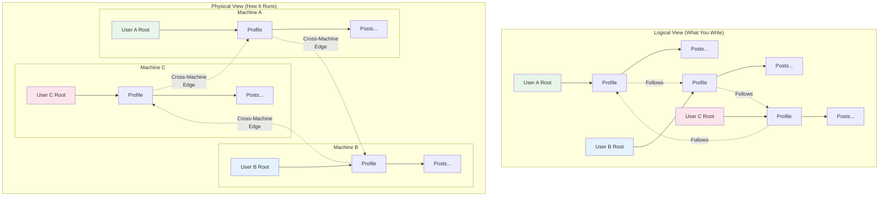

### Key Distribution Principles

1. **Location Transparency**: Code doesn't know or care where nodes physically reside
2. **Automatic Partitioning**: Jac runtime handles data distribution based on access patterns
3. **Seamless Walker Migration**: Walkers traverse cross-machine edges naturally
4. **Consistent Semantics**: Same behavior whether local or distributed

### Automatic Node Partitioning

Jac automatically partitions nodes across machines based on several strategies:

```jac
// This configuration goes in jac.toml
[distribution]
strategy = "user_affinity"  // or "load_balanced", "geo_distributed"
replication_factor = 3
consistency_level = "eventual"  // or "strong", "bounded"

[distribution.rules]
# Keeps user data together
affinity_paths = [
    "root -> Profile",
    "Profile -> Post",
    "Post -> Comment"
]

# Distributes shared data
distributed_types = [
    "SharedResource",
    "GlobalConfig"
]
```

### Cross-Machine Edges

Edges that span machines are handled transparently:

```jac
// This code works identically for local and cross-machine edges!
walker MessageSender {
    has message: str;
    has recipient: User;

    can send with entry {
        // Even if recipient is on another machine, this just works
        here ++> Message(
            content=self.message,
            from_user=here,
            to_user=self.recipient,
            timestamp=now()
        );

        // Visit recipient's node (automatic cross-machine travel)
        visit self.recipient;
    }

    can notify with User entry {
        // Now executing on recipient's machine!
        here ++> Notification(
            type="new_message",
            message=self.message
        );
    }
}
```

### Distribution Metadata

Jac provides built-in functions to inspect distribution:

```jac
// Check node location
can get_node_info(n: node) -> dict {
    return {
        "machine_id": n.__machine_id__,
        "partition": n.__partition__,
        "replicas": n.__replicas__,
        "is_local": n.__is_local__
    };
}

// Monitor cross-machine edges
walker DistributionAnalyzer {
    has cross_machine_count: int = 0;
    has local_count: int = 0;

    can analyze with entry {
        for edge in [<-->] {
            if edge.__is_cross_machine__ {
                self.cross_machine_count += 1;
            } else {
                self.local_count += 1;
            }
        }

        report {
            "node": here,
            "local_edges": self.local_count,
            "remote_edges": self.cross_machine_count,
            "distribution_score": self.local_count / (self.local_count + self.cross_machine_count)
        };
    }
}
```

#### 13.2 Scaling Patterns

### From Single-Machine to Distributed

The beauty of Jac is that the same code scales naturally. Here's a social media application that works identically from one to thousands of machines:

```jac
// User profile and social graph
node UserProfile {
    has username: str;
    has bio: str;
    has joined_date: str;
    has post_count: int = 0;
}

node Post {
    has content: str;
    has timestamp: str;
    has likes: int = 0;
    has view_count: int = 0;
}

edge Follows {
    has since: str;
    has notifications_enabled: bool = true;
}

edge Likes {
    has timestamp: str;
}

// This walker works across any number of machines!
walker CreatePost {
    has content: str;

    can create with UserProfile entry {
        // Create post (stays on same machine as user)
        new_post = here ++> Post(
            content=self.content,
            timestamp=now()
        );

        here.post_count += 1;

        // Notify followers (may span many machines)
        spawn NotifyFollowers(post=new_post) on here;
    }
}

walker NotifyFollowers {
    has post: Post;
    has notified_count: int = 0;

    can notify with UserProfile entry {
        // Get all followers (some local, some remote)
        followers = [<--:Follows:];

        // Spawn notification walkers (distributed automatically)
        for follower in followers {
            if follower.notifications_enabled {
                spawn CreateNotification(
                    post=self.post,
                    user=follower.source  // The following user
                ) on follower.source;

                self.notified_count += 1;
            }
        }

        report {
            "post": self.post,
            "notified": self.notified_count
        };
    }
}

walker CreateNotification {
    has post: Post;
    has user: UserProfile;

    can create with UserProfile entry {
        // This executes on the follower's machine
        here ++> Notification(
            type="new_post",
            post=self.post,
            timestamp=now(),
            read=false
        );
    }
}
```

### Load Balancing Through Topology

Jac can automatically balance load by redistributing nodes:

```jac
// Configuration for automatic load balancing
[distribution.load_balancing]
enabled = true
check_interval = 60  // seconds
threshold_cpu = 0.8
threshold_memory = 0.85
threshold_edge_latency = 100  // ms

// Nodes can provide hints for distribution
node ComputeIntensiveTask {
    has priority: int;
    has estimated_cpu_hours: float;
    has data_size_gb: float;

    // Distribution hints
    :distribution: {
        "prefer_high_cpu": true,
        "collocate_with": ["TaskData", "TaskResult"],
        "avoid_machines": ["low_memory_tier"]
    }
}

// Monitor and rebalance
walker LoadBalancer {
    can check_balance with entry {
        let machine_stats = get_cluster_stats();

        for machine in machine_stats {
            if machine.cpu_usage > 0.8 {
                // Find nodes to migrate
                candidates = get_migration_candidates(machine);
                target_machine = find_least_loaded_machine();

                for node in candidates[:5] {  // Migrate up to 5 nodes
                    migrate_node(node, target_machine);
                }
            }
        }
    }
}
```

### Fault Tolerance and Recovery

Jac provides built-in fault tolerance through replication and automatic recovery:

```jac
// Configure replication
node CriticalData {
    has data: dict;
    has version: int = 0;

    :replication: {
        "factor": 3,
        "sync_mode": "async",  // or "sync" for strong consistency
        "preferred_regions": ["us-east", "eu-west", "ap-south"]
    }
}

// Automatic failover handling
walker ResilientOperation {
    has max_retries: int = 3;
    has retry_count: int = 0;

    can operate with entry {
        try {
            // Normal operation
            result = process_critical_data(here);
            report {"success": true, "result": result};

        } except NodeUnavailableError as e {
            // Automatic failover to replica
            self.retry_count += 1;

            if self.retry_count < self.max_retries {
                // Jac automatically redirects to healthy replica
                visit here.__replica__;  // Transparent failover
            } else {
                report {"success": false, "error": "All replicas failed"};
            }
        }
    }
}

// Health monitoring
walker HealthChecker {
    can check with entry {
        let health = {
            "node": here,
            "status": "healthy",
            "checks": {}
        };

        // Check node health
        try {
            health["checks"]["data_integrity"] = verify_data_integrity(here);
            health["checks"]["connection_count"] = len([<-->]);
            health["checks"]["response_time"] = measure_response_time();

        } except Exception as e {
            health["status"] = "unhealthy";
            health["error"] = str(e);

            // Trigger automatic recovery
            initiate_recovery(here);
        }

        report health;
    }
}
```

### Geo-Distribution Patterns

Deploy Jac applications globally with location-aware distribution:

```jac
// Geo-distributed configuration
[distribution.geo]
enabled = true
regions = ["us-east-1", "eu-west-1", "ap-southeast-1"]
default_region = "us-east-1"

// Location-aware nodes
node GeoUser {
    has username: str;
    has preferred_region: str;
    has data_residency: str;  // Legal requirement

    :geo: {
        "pin_to_region": self.data_residency,
        "cache_in_regions": [self.preferred_region],
        "exclude_regions": []  // For compliance
    }
}

// Cross-region walker with latency awareness
walker GlobalSearch {
    has query: str;
    has max_latency_ms: int = 200;
    has results: list = [];

    can search with entry {
        let regions = get_all_regions();
        let local_region = here.__region__;

        // Search local region first
        local_results = search_region(local_region, self.query);
        self.results.extend(local_results);

        // Search remote regions in parallel
        for region in regions {
            if region != local_region {
                expected_latency = estimate_latency(local_region, region);

                if expected_latency < self.max_latency_ms {
                    spawn RegionalSearch(
                        query=self.query,
                        region=region
                    ) on get_region_root(region);
                }
            }
        }
    }
}

// Regional caching for performance
node CachedContent {
    has content: str;
    has cache_regions: list[str] = [];

    can ensure_cached_in(region: str) {
        if region not in self.cache_regions {
            replicate_to_region(self, region);
            self.cache_regions.append(region);
        }
    }
}
```

### Distributed Transactions

Jac handles distributed transactions transparently:

```jac
// Distributed transaction example
walker TransferCredits {
    has from_user: User;
    has to_user: User;
    has amount: int;

    can transfer with entry {
        // Start distributed transaction
        :transaction: {
            "isolation": "serializable",
            "timeout": 5000,  // ms
            "retry_on_conflict": true
        }

        // These operations are atomic across machines!
        try {
            // Debit from source (might be on machine A)
            visit self.from_user {
                if here.credits < self.amount {
                    raise InsufficientCreditsError();
                }
                here.credits -= self.amount;
            };

            // Credit to destination (might be on machine B)
            visit self.to_user {
                here.credits += self.amount;
            };

            // Log transaction (might be on machine C)
            spawn LogTransaction(
                from_user=self.from_user,
                to_user=self.to_user,
                amount=self.amount,
                status="completed"
            ) on get_transaction_log_node();

            :commit:;  // Commit distributed transaction

        } except Exception as e {
            :rollback:;  // Automatic rollback across all machines
            report {"success": false, "error": str(e)};
        }
    }
}
```

### Scaling Patterns in Practice

Here's a complete example of a distributed task processing system:

```jac
// Distributed task queue implementation
node TaskQueue {
    has name: str;
    has priority: int;

    :distribution: {
        "partition_by": "priority",
        "replicas": 2
    }
}

node Task {
    has id: str;
    has payload: dict;
    has status: str = "pending";
    has assigned_worker: str = "";
    has created_at: str;
    has completed_at: str = "";

    :distribution: {
        "collocate_with_parent": true  // Stay with queue
    }
}

edge InQueue {
    has position: int;
    has enqueued_at: str;
}

// Distributed worker pool
walker TaskWorker {
    has worker_id: str;
    has capabilities: list[str];
    has max_concurrent: int = 5;
    has current_tasks: list[Task] = [];

    can find_work with entry {
        // Find available task queues across cluster
        queues = find_all_nodes(TaskQueue);

        // Sort by priority and machine locality
        queues.sort(key=lambda q: (-q.priority, q.__is_local__));

        for queue in queues {
            if len(self.current_tasks) >= self.max_concurrent {
                break;
            }

            visit queue;
        }

        // Process tasks in parallel
        for task in self.current_tasks {
            spawn ProcessTask(
                task=task,
                worker=self
            ) on task;
        }
    }

    can claim_task with TaskQueue entry {
        // Atomic task claiming across distributed queue
        :transaction: {
            available_tasks = [-->:InQueue:-->:Task:]
                .filter(lambda t: t.status == "pending")
                .sort(key=lambda t: t.position);

            if available_tasks {
                task = available_tasks[0];
                task.status = "processing";
                task.assigned_worker = self.worker_id;
                self.current_tasks.append(task);

                // Remove from queue
                del here --> task;
            }
        :commit:;
        }
    }
}

walker ProcessTask {
    has task: Task;
    has worker: TaskWorker;

    can process with Task entry {
        try {
            // Process the task
            result = execute_task_payload(here.payload);

            here.status = "completed";
            here.completed_at = now();

            // Store result (might be on different machine)
            here ++> TaskResult(
                result=result,
                worker_id=self.worker.worker_id,
                completed_at=now()
            );

            // Update worker
            self.worker.current_tasks.remove(here);

        } except Exception as e {
            here.status = "failed";
            here ++> TaskError(
                error=str(e),
                traceback=get_traceback()
            );

            // Requeue for retry
            find_queue(here.priority) ++>:InQueue:++> here;
        }
    }
}

// Monitoring across distributed system
walker SystemMonitor {
    can monitor with entry {
        let stats = {
            "total_tasks": 0,
            "pending": 0,
            "processing": 0,
            "completed": 0,
            "failed": 0,
            "machines": {},
            "queue_depths": {}
        };

        // Gather stats from all machines
        all_tasks = find_all_nodes(Task);

        for task in all_tasks {
            stats["total_tasks"] += 1;
            stats[task.status] += 1;

            machine = task.__machine_id__;
            if machine not in stats["machines"] {
                stats["machines"][machine] = {"count": 0, "processing": 0};
            }
            stats["machines"][machine]["count"] += 1;
            if task.status == "processing" {
                stats["machines"][machine]["processing"] += 1;
            }
        }

        // Check queue depths
        for queue in find_all_nodes(TaskQueue) {
            depth = len([queue -->:InQueue:]);
            stats["queue_depths"][queue.name] = depth;
        }

        report stats;
    }
}

// Auto-scaling based on load
walker AutoScaler {
    has min_workers: int = 5;
    has max_workers: int = 50;
    has scale_up_threshold: float = 0.8;
    has scale_down_threshold: float = 0.3;

    can check_scaling with entry {
        let metrics = spawn SystemMonitor() on root;

        let total_capacity = count_workers() * 5;  // max_concurrent per worker
        let utilization = metrics["processing"] / total_capacity;

        if utilization > self.scale_up_threshold {
            let new_workers = min(5, self.max_workers - count_workers());
            for i in range(new_workers) {
                spawn_worker_on_best_machine();
            }
            print(f"Scaled up by {new_workers} workers");

        } elif utilization < self.scale_down_threshold {
            let remove_workers = min(5, count_workers() - self.min_workers);
            gracefully_shutdown_workers(remove_workers);
            print(f"Scaled down by {remove_workers} workers");
        }
    }
}

// Entry point that works at any scale
with entry {
    // Initialize task queues (distributed automatically)
    high_priority = root ++> TaskQueue(name="high", priority=10);
    medium_priority = root ++> TaskQueue(name="medium", priority=5);
    low_priority = root ++> TaskQueue(name="low", priority=1);

    // Start workers (distributed across available machines)
    for i in range(10) {
        spawn TaskWorker(
            worker_id=f"worker_{i}",
            capabilities=["general"]
        ) on root;
    }

    // Start monitoring and auto-scaling
    spawn SystemMonitor() on root;
    spawn AutoScaler() on root;

    print("Distributed task processing system initialized!");
}
```

### Summary

This chapter demonstrated how Jac's scale-agnostic programming model extends naturally to distributed systems:

- **Transparent Distribution**: The same code works across machines without modification
- **Automatic Partitioning**: Jac handles data distribution based on access patterns
- **Cross-Machine Traversal**: Walkers seamlessly move between machines
- **Built-in Fault Tolerance**: Replication and failover happen automatically
- **Geo-Distribution**: Deploy globally with location-aware optimizations

The key insight is that distribution becomes a deployment concern rather than a development concern. You write your application logic once, focusing on the relationships and computations, and Jac handles the complexities of distributed execution.

In the next chapter, we'll explore advanced language features including concurrent programming, type system deep dives, and sophisticated error handling patterns that make Jac suitable for production systems at any scale.

## Part V: Advanced Features and Patterns

### Chapter 14: Advanced Language Features

This chapter explores Jac's advanced features that enable sophisticated concurrent programming, leverage its powerful type system, and provide robust error handling for production systems. These features build upon the fundamentals to create applications that are both powerful and maintainable.

#### 14.1 Concurrent Programming

### `spawn` for Parallel Walkers

The `spawn` operator not only activates walkers but also enables natural concurrency. Multiple walkers can traverse the graph simultaneously, with Jac handling synchronization automatically:

```jac
// Basic parallel walker spawning
walker DataProcessor {
    has node_id: str;
    has processing_time: float;

    can process with entry {
        let start = time.now();

        // Simulate processing
        sleep(self.processing_time);
        process_node_data(here);

        let duration = time.now() - start;
        report {
            "node": self.node_id,
            "duration": duration,
            "thread": threading.current_thread().name
        };
    }
}

// Spawn multiple walkers concurrently
with entry {
    let nodes = root[-->:DataNode:];

    // These walkers execute in parallel!
    for i, node in enumerate(nodes) {
        spawn DataProcessor(
            node_id=f"node_{i}",
            processing_time=random.uniform(0.1, 0.5)
        ) on node;
    }
}
```

### Advanced Spawning Patterns

```jac
// Parallel map-reduce pattern
walker MapWorker {
    has mapper: callable;
    has data_chunk: list;
    has result_collector: node;

    can map with entry {
        // Process data chunk in parallel
        let results = [self.mapper(item) for item in self.data_chunk];

        // Send results to collector (thread-safe)
        visit self.result_collector {
            :atomic: {  // Atomic operation
                here.results.extend(results);
                here.completed_chunks += 1;
            }
        };
    }
}

walker ReduceWorker {
    has reducer: callable;
    has expected_chunks: int;

    can reduce with ResultCollector entry {
        // Wait for all map workers to complete
        while here.completed_chunks < self.expected_chunks {
            sleep(0.01);  // Busy wait (in practice, use conditions)
        }

        // Reduce results
        final_result = self.reducer(here.results);
        report final_result;
    }
}

// Usage
can parallel_map_reduce(
    data: list,
    mapper: callable,
    reducer: callable,
    chunk_size: int = 100
) -> any {
    // Create result collector
    collector = root ++> ResultCollector(
        results=[],
        completed_chunks=0
    );

    // Split data and spawn mappers
    chunks = [data[i:i+chunk_size] for i in range(0, len(data), chunk_size)];

    for chunk in chunks {
        spawn MapWorker(
            mapper=mapper,
            data_chunk=chunk,
            result_collector=collector
        ) on root;
    }

    // Spawn reducer
    result = spawn ReduceWorker(
        reducer=reducer,
        expected_chunks=len(chunks)
    ) on collector;

    return result;
}
```

### Walker Synchronization

Jac provides several mechanisms for coordinating concurrent walkers:

```jac
// Barrier synchronization
node BarrierNode {
    has required_count: int;
    has arrived_count: int = 0;
    has waiting_walkers: list = [];

    can wait_at_barrier with visitor entry {
        :synchronized: {  // Synchronized block
            self.arrived_count += 1;

            if self.arrived_count < self.required_count {
                // Add walker to waiting list
                self.waiting_walkers.append(visitor);
                visitor.suspend();  // Suspend walker execution
            } else {
                // All walkers arrived, release them
                for walker in self.waiting_walkers {
                    walker.resume();  // Resume suspended walkers
                }
                self.waiting_walkers.clear();
                self.arrived_count = 0;
            }
        }
    }
}

// Pipeline pattern with synchronized stages
walker PipelineStage {
    has stage_num: int;
    has process_func: callable;
    has next_stage: node?;

    can process with WorkItem entry {
        // Process work item
        result = self.process_func(here.data);
        here.data = result;

        // Mark stage completion
        here.completed_stages.add(self.stage_num);

        // Move to next stage if available
        if self.next_stage {
            :synchronized: {
                # Ensure ordering for pipeline
                visit self.next_stage;
            }
        } else {
            report here.data;  // Final result
        }
    }
}
```

### `async`/`await` Patterns

Jac fully supports asynchronous programming for I/O-bound operations:

```jac
import:py asyncio;
import:py aiohttp;
import:py from asyncio { gather, create_task }

// Async walker abilities
walker AsyncWebCrawler {
    has urls: list[str];
    has max_concurrent: int = 10;
    has results: dict = {};

    async can crawl with entry {
        // Create semaphore for rate limiting
        semaphore = asyncio.Semaphore(self.max_concurrent);

        // Create tasks for all URLs
        tasks = [
            create_task(self.fetch_url(url, semaphore))
            for url in self.urls
        ];

        // Wait for all to complete
        await gather(*tasks);

        report self.results;
    }

    async can fetch_url(url: str, semaphore: asyncio.Semaphore) -> None {
        async with semaphore {  // Limit concurrent requests
            try {
                async with aiohttp.ClientSession() as session {
                    async with session.get(url) as response {
                        content = await response.text();
                        self.results[url] = {
                            "status": response.status,
                            "length": len(content),
                            "title": extract_title(content)
                        };
                    }
                }
            } except Exception as e {
                self.results[url] = {"error": str(e)};
            }
        }
    }
}

// Async node abilities
node AsyncDataSource {
    has api_endpoint: str;
    has cache: dict = {};
    has cache_ttl: int = 300;  // seconds

    async can fetch_data with AsyncClient entry {
        cache_key = visitor.query_params;

        // Check cache
        if cache_key in self.cache {
            cached_data, timestamp = self.cache[cache_key];
            if time.now() - timestamp < self.cache_ttl {
                visitor.receive_data(cached_data);
                return;
            }
        }

        // Fetch fresh data
        try {
            data = await fetch_from_api(
                self.api_endpoint,
                visitor.query_params
            );

            // Update cache
            self.cache[cache_key] = (data, time.now());
            visitor.receive_data(data);

        } except APIError as e {
            visitor.receive_error(e);
        }
    }
}

// Async entry point
async with entry:main {
    // Spawn async walker
    crawler = AsyncWebCrawler(urls=[
        "https://example.com",
        "https://example.org",
        "https://example.net"
    ]);

    results = await spawn crawler on root;
    print(f"Crawled {len(results)} URLs");
}
```

### Thread-Safe Graph Operations

When multiple walkers operate on the same graph regions, Jac provides thread-safety guarantees:

```jac
// Thread-safe node with fine-grained locking
node ConcurrentCounter {
    has count: int = 0;
    has :lock: lock = threading.Lock();  // Node-level lock

    can increment with visitor entry {
        with self.lock {
            old_value = self.count;
            self.count += 1;

            // Log the change atomically
            self ++> CounterLog(
                timestamp=now(),
                old_value=old_value,
                new_value=self.count,
                walker_id=visitor.id
            );
        }
    }

    can get_value -> int {
        with self.lock {
            return self.count;
        }
    }
}

// Read-write lock pattern
node SharedResource {
    has data: dict = {};
    has :rwlock: rwlock = threading.RWLock();

    can read_data(key: str) -> any? {
        with self.rwlock.read() {  // Multiple readers allowed
            return self.data.get(key);
        }
    }

    can write_data(key: str, value: any) {
        with self.rwlock.write() {  // Exclusive write access
            self.data[key] = value;
        }
    }
}

// Atomic operations on edges
edge ConcurrentEdge {
    has weight: float;
    has access_count: int = 0;

    :atomic: ["weight", "access_count"];  // Declare atomic fields

    can traverse with visitor entry {
        # These operations are atomic
        self.access_count += 1;
        self.weight *= 0.99;  # Decay weight

        if self.weight < 0.1 {
            # Mark for deletion (thread-safe)
            self.mark_for_deletion();
        }
    }
}
```

#### 14.2 Type System Deep Dive

### Type Inference vs Explicit Typing

While Jac requires type annotations, it provides sophisticated type inference in many contexts:

```jac
// Explicit typing (required for declarations)
let numbers: list[int] = [1, 2, 3, 4, 5];
let processor: DataProcessor = DataProcessor();

// Type inference in expressions
let doubled = numbers.map(lambda x: int -> int : x * 2);  // Inferred: list[int]
let filtered = doubled.filter(lambda x: int -> bool : x > 5);  // Inferred: list[int]

// Generic type inference
can identity[T](value: T) -> T {
    return value;
}

let x = identity(42);  // T inferred as int
let y = identity("hello");  // T inferred as str

// Complex type inference
can process_data[T, R](
    data: list[T],
    transformer: callable[[T], R]
) -> list[R] {
    return [transformer(item) for item in data];
}

// Usage with inference
let strings = ["1", "2", "3"];
let integers = process_data(strings, int);  // Inferred: list[int]
```

### Generic Types and Constraints

Jac supports sophisticated generic programming with type constraints:

```jac
// Basic generics
obj Container[T] {
    has items: list[T] = [];

    can add(item: T) {
        self.items.append(item);
    }

    can get(index: int) -> T? {
        if 0 <= index < len(self.items) {
            return self.items[index];
        }
        return None;
    }
}

// Generic constraints
can sort_comparable[T: Comparable](items: list[T]) -> list[T] {
    return sorted(items);
}

// Multiple type parameters with constraints
obj Cache[K: Hashable, V] {
    has store: dict[K, tuple[V, float]] = {};
    has ttl: float;

    can set(key: K, value: V) {
        self.store[key] = (value, time.now());
    }

    can get(key: K) -> V? {
        if key in self.store {
            value, timestamp = self.store[key];
            if time.now() - timestamp < self.ttl {
                return value;
            }
            del self.store[key];
        }
        return None;
    }
}

// Bounded generics
walker TypedTraverser[N: node, E: edge] {
    has node_filter: callable[[N], bool];
    has edge_filter: callable[[E], bool];

    can traverse with N entry {
        if self.node_filter(here) {
            // Process node
            process_typed_node(here);

            // Traverse filtered edges
            let valid_edges = [e for e in [<-->]
                              if isinstance(e, E) and self.edge_filter(e)];

            for edge in valid_edges {
                visit edge.target;
            }
        }
    }
}
```

### Type-Safe Graph Operations

Jac's type system extends to graph operations, ensuring type safety in topological programming:

```jac
// Typed node references
node TypedNode {
    has data: str;
}

node SpecialNode(TypedNode) {
    has special_data: int;
}

// Type-safe traversal
walker StrictTraverser {
    can process with entry {
        // Type-checked at compile time
        let typed_nodes: list[TypedNode] = [-->(`TypedNode)];
        let special_nodes: list[SpecialNode] = [-->(`SpecialNode)];

        // This would be a compile error:
        // let wrong: list[SpecialNode] = [-->(`TypedNode)];
    }
}

// Generic graph algorithms
can find_path[N: node](
    start: N,
    end: N,
    filter_func: callable[[N], bool] = lambda n: N -> bool : True
) -> list[N]? {

    walker PathFinder[N] {
        has target: N;
        has filter_func: callable[[N], bool];
        has path: list[N] = [];
        has found: bool = False;

        can search with N entry {
            self.path.append(here);

            if here == self.target {
                self.found = True;
                report self.path;
                disengage;
            }

            let next_nodes: list[N] = [-->(`N)]
                .filter(self.filter_func)
                .filter(lambda n: N -> bool : n not in self.path);

            for next in next_nodes {
                visit next;
                if self.found {
                    disengage;
                }
            }

            self.path.pop();
        }
    }

    let finder = PathFinder[N](
        target=end,
        filter_func=filter_func
    );

    return spawn finder on start;
}
```

### Advanced Type Features

```jac
// Union types
type StringOrInt = str | int;
type MaybeNode = node | None;

can process_mixed(value: StringOrInt) -> str {
    match value {
        case str as s: return s;
        case int as i: return str(i);
    }
}

// Type aliases for complex types
type UserGraph = dict[str, list[tuple[User, Relationship]]];
type AsyncCallback = callable[[any], Awaitable[None]];

// Literal types
type Direction = "north" | "south" | "east" | "west";
type Priority = 1 | 2 | 3 | 4 | 5;

can move(direction: Direction, steps: int) -> Position {
    match direction {
        case "north": return Position(0, steps);
        case "south": return Position(0, -steps);
        case "east": return Position(steps, 0);
        case "west": return Position(-steps, 0);
    }
}

// Protocol types (structural typing)
protocol Serializable {
    can to_json() -> str;
    can from_json(data: str) -> Self;
}

can save_object[T: Serializable](obj: T, filename: str) {
    with open(filename, "w") as f {
        f.write(obj.to_json());
    }
}

// Variadic generics
can combine[*Ts](values: tuple[*Ts]) -> tuple[*Ts] {
    return values;
}

let combined = combine((1, "hello", 3.14, True));  // tuple[int, str, float, bool]
```

#### 14.3 Error Handling

### Exception Handling in Traversals

Error handling in graph traversal requires special consideration:

```jac
// Traversal-aware exception handling
walker ResilientTraverser {
    has errors: list[dict] = [];
    has continue_on_error: bool = True;

    can traverse with entry {
        try {
            // Process current node
            result = process_node(here);

            // Continue traversal
            visit [-->];

        } except NodeProcessingError as e {
            self.errors.append({
                "node": here,
                "error": str(e),
                "traceback": get_traceback()
            });

            if not self.continue_on_error {
                disengage;  // Stop traversal
            }

        } except NetworkError as e {
            // Handle cross-machine traversal errors
            print(f"Network error visiting remote node: {e}");

            // Try alternate path
            visit [-->:LocalEdge:];  // Only local edges
        }
    }

    can summarize with `root exit {
        if self.errors {
            report {
                "status": "completed_with_errors",
                "error_count": len(self.errors),
                "errors": self.errors
            };
        } else {
            report {"status": "success"};
        }
    }
}
```

### Ability-Specific Error Patterns

Different ability types require different error handling strategies:

```jac
// Node ability error handling
node DataNode {
    has data: dict;
    has error_count: int = 0;
    has max_errors: int = 3;

    can process_visitor with DataWalker entry {
        try {
            # Validate visitor
            if not visitor.is_authorized() {
                raise UnauthorizedError("Visitor not authorized");
            }

            # Process data
            result = transform_data(self.data, visitor.transform_spec);
            visitor.receive_result(result);

        } except UnauthorizedError as e {
            # Specific handling for auth errors
            log_security_event(visitor, e);
            visitor.reject(reason=str(e));

        } except DataTransformError as e {
            # Handle processing errors
            self.error_count += 1;

            if self.error_count >= self.max_errors {
                self.mark_as_failed();
                raise NodeFailureError(f"Node failed after {self.error_count} errors");
            }

            visitor.receive_error(e);

        } finally {
            # Always log visit
            self ++> VisitLog(
                visitor_type=type(visitor).__name__,
                timestamp=now(),
                success=not visitor.has_error()
            );
        }
    }
}

// Walker ability error handling
walker DataMigrator {
    has source_version: int;
    has target_version: int;
    has rollback_on_error: bool = True;
    has migrated_nodes: list[node] = [];

    can migrate with entry {
        # Create savepoint for rollback
        savepoint = create_graph_savepoint();

        try {
            # Check version compatibility
            if here.version != self.source_version {
                raise VersionMismatchError(
                    f"Expected v{self.source_version}, found v{here.version}"
                );
            }

            # Perform migration
            migrate_node_data(here, self.target_version);
            here.version = self.target_version;
            self.migrated_nodes.append(here);

            # Continue to connected nodes
            visit [-->];

        } except MigrationError as e {
            print(f"Migration failed at {here}: {e}");

            if self.rollback_on_error {
                # Rollback all migrated nodes
                restore_graph_savepoint(savepoint);

                # Report failure
                report {
                    "status": "failed",
                    "error": str(e),
                    "rolled_back": True,
                    "attempted_nodes": len(self.migrated_nodes)
                };

                disengage;
            } else {
                # Continue despite error
                self.errors.append({
                    "node": here,
                    "error": e
                });
            }
        }
    }
}
```

### Distributed Error Propagation

Handling errors across machine boundaries requires special consideration:

```jac
// Cross-machine error handling
walker DistributedProcessor {
    has timeout: float = 30.0;
    has retry_attempts: int = 3;

    can process with entry {
        for attempt in range(self.retry_attempts) {
            try {
                # Set timeout for cross-machine operations
                with timeout_context(self.timeout) {
                    # This might cross machine boundaries
                    remote_result = visit_and_get_result(
                        [-->:RemoteEdge:][0]
                    );

                    process_remote_result(remote_result);
                    break;  # Success, exit retry loop
                }

            } except TimeoutError as e {
                if attempt < self.retry_attempts - 1 {
                    # Exponential backoff
                    wait_time = 2 ** attempt;
                    print(f"Timeout, retrying in {wait_time}s...");
                    sleep(wait_time);
                } else {
                    # Final attempt failed
                    raise DistributedOperationError(
                        f"Operation timed out after {self.retry_attempts} attempts"
                    );

            } except RemoteMachineError as e {
                # Remote machine failure
                handle_machine_failure(e.machine_id);

                # Try alternate route
                alternate = find_alternate_route(here, e.failed_node);
                if alternate {
                    visit alternate;
                } else {
                    raise NoAlternateRouteError();
            }
        }
    }
}

// Circuit breaker pattern for distributed calls
obj CircuitBreaker {
    has failure_threshold: int = 5;
    has recovery_timeout: float = 60.0;
    has failure_count: int = 0;
    has last_failure_time: float = 0.0;
    has state: str = "closed";  # closed, open, half-open

    can call[T](func: callable[[], T]) -> T {
        if self.state == "open" {
            if time.now() - self.last_failure_time > self.recovery_timeout {
                self.state = "half-open";
            } else {
                raise CircuitOpenError("Circuit breaker is open");
            }
        }

        try {
            result = func();

            if self.state == "half-open" {
                # Success in half-open state, close circuit
                self.state = "closed";
                self.failure_count = 0;
            }

            return result;

        } except Exception as e {
            self.failure_count += 1;
            self.last_failure_time = time.now();

            if self.failure_count >= self.failure_threshold {
                self.state = "open";
                print(f"Circuit breaker opened after {self.failure_count} failures");
            }

            raise e;
        }
    }
}

// Using circuit breaker in distributed operations
walker ResilientDistributedWalker {
    has circuit_breakers: dict[str, CircuitBreaker] = {};

    can get_breaker(machine_id: str) -> CircuitBreaker {
        if machine_id not in self.circuit_breakers {
            self.circuit_breakers[machine_id] = CircuitBreaker();
        }
        return self.circuit_breakers[machine_id];
    }

    can visit_remote with entry {
        for remote_node in [-->:RemoteEdge:-->] {
            machine_id = remote_node.__machine_id__;
            breaker = self.get_breaker(machine_id);

            try {
                result = breaker.call(lambda: visit_and_process(remote_node));
                handle_result(result);

            } except CircuitOpenError {
                print(f"Skipping {machine_id} - circuit open");
                continue;

            } except Exception as e {
                print(f"Error processing remote node: {e}");
                continue;
            }
        }
    }
}
```

### Error Recovery Patterns

```jac
// Compensation pattern for distributed transactions
walker CompensatingTransaction {
    has operations: list[dict] = [];
    has compensations: list[callable] = [];

    can execute_with_compensation(
        operation: callable,
        compensation: callable
    ) -> any {
        try {
            result = operation();

            # Record successful operation and its compensation
            self.operations.append({
                "operation": operation.__name__,
                "result": result,
                "timestamp": now()
            });
            self.compensations.append(compensation);

            return result;

        } except Exception as e {
            # Operation failed, run compensations in reverse order
            print(f"Operation failed: {e}, running compensations...");

            for comp in reversed(self.compensations) {
                try {
                    comp();
                } except Exception as comp_error {
                    print(f"Compensation failed: {comp_error}");
                }
            }

            raise TransactionFailedError(
                f"Transaction rolled back due to: {e}"
            );
        }
    }
}

// Saga pattern for long-running transactions
walker SagaOrchestrator {
    has saga_id: str;
    has steps: list[SagaStep];
    has completed_steps: list[str] = [];

    can execute_saga with entry {
        for step in self.steps {
            try {
                # Execute step
                result = spawn step.walker on step.target_node;

                self.completed_steps.append(step.id);

                # Persist saga state
                persist_saga_state(self.saga_id, self.completed_steps);

            } except SagaStepError as e {
                # Step failed, initiate compensation
                print(f"Saga step {step.id} failed: {e}");

                spawn CompensatingSaga(
                    saga_id=self.saga_id,
                    failed_step=step.id,
                    completed_steps=self.completed_steps
                ) on root;

                disengage;
            }
        }

        report {
            "saga_id": self.saga_id,
            "status": "completed",
            "steps": self.completed_steps
        };
    }
}

// Bulkhead pattern for isolation
node ResourcePool {
    has name: str;
    has max_concurrent: int;
    has active_count: int = 0;
    has queue: list[walker] = [];

    can acquire_resource with visitor entry {
        :synchronized: {
            if self.active_count < self.max_concurrent {
                self.active_count += 1;
                visitor.resource_acquired = True;
            } else {
                # Add to queue
                self.queue.append(visitor);
                visitor.suspend();
            }
        }
    }

    can release_resource with visitor exit {
        :synchronized: {
            self.active_count -= 1;

            # Process queued walkers
            if self.queue {
                next_walker = self.queue.pop(0);
                self.active_count += 1;
                next_walker.resource_acquired = True;
                next_walker.resume();
            }
        }
    }
}
```

### Summary

This chapter covered Jac's advanced features that enable production-ready applications:

### Concurrent Programming
- **Parallel Walkers**: Natural concurrency through `spawn`
- **Async/Await**: Full support for asynchronous operations
- **Synchronization**: Thread-safe graph operations and coordination
- **Patterns**: Pipeline, map-reduce, and barrier synchronization

### Type System
- **Inference**: Smart type inference reduces boilerplate
- **Generics**: Powerful generic programming with constraints
- **Graph Types**: Type-safe topological operations
- **Advanced Features**: Union types, protocols, and variadic generics

### Error Handling
- **Traversal Errors**: Graceful handling of graph navigation failures
- **Distributed Errors**: Cross-machine error propagation
- **Recovery Patterns**: Compensation, sagas, and circuit breakers
- **Resilience**: Building fault-tolerant distributed systems

These advanced features, combined with Jac's scale-agnostic programming model, provide all the tools needed to build sophisticated, production-ready applications that can scale from single-user prototypes to global distributed systems.

In the next chapter, we'll explore design patterns specific to Jac that leverage these advanced features to solve common architectural challenges.

### Chapter 15: Design Patterns in Jac

This chapter explores design patterns that leverage Jac's unique features—data spatial programming, scale-agnostic architecture, and topological computation. These patterns provide reusable solutions to common problems while taking full advantage of Jac's paradigm shift from moving data to computation to moving computation to data.

#### 15.1 Graph Patterns

### Tree Structures

Trees are fundamental in Jac, but unlike traditional implementations, they leverage the natural parent-child relationships through edges:

```jac
// Generic tree node
node TreeNode {
    has value: any;
    has level: int = 0;
}

edge ChildOf {
    has position: int;  // For ordered children
}

// Binary tree specialization
node BinaryNode(TreeNode) {
    has max_children: int = 2;
}

edge LeftChild(ChildOf) {
    has position: int = 0;
}

edge RightChild(ChildOf) {
    has position: int = 1;
}

// Tree operations as walkers
walker TreeBuilder {
    has values: list[any];
    has build_binary: bool = true;

    can build_level_order with entry {
        if not self.values {
            return;
        }

        let queue: list[node] = [here];
        let index = 0;

        while queue and index < len(self.values) {
            let current = queue.pop(0);

            # Add children based on tree type
            if self.build_binary {
                # Left child
                if index < len(self.values) {
                    left = current ++>:LeftChild:++> BinaryNode(
                        value=self.values[index],
                        level=current.level + 1
                    );
                    queue.append(left);
                    index += 1;
                }

                # Right child
                if index < len(self.values) {
                    right = current ++>:RightChild:++> BinaryNode(
                        value=self.values[index],
                        level=current.level + 1
                    );
                    queue.append(right);
                    index += 1;
                }
            } else {
                # N-ary tree: add all available values as children
                let children_count = min(3, len(self.values) - index);
                for i in range(children_count) {
                    child = current ++>:ChildOf(position=i):++> TreeNode(
                        value=self.values[index],
                        level=current.level + 1
                    );
                    queue.append(child);
                    index += 1;
                }
            }
        }
    }
}

// Tree traversal patterns
walker TreeTraverser {
    has order: str = "inorder";  // preorder, inorder, postorder, levelorder
    has result: list = [];

    can traverse with BinaryNode entry {
        match self.order {
            case "preorder":
                self.result.append(here.value);
                self.visit_children();

            case "inorder":
                self.visit_left();
                self.result.append(here.value);
                self.visit_right();

            case "postorder":
                self.visit_children();
                self.result.append(here.value);

            case "levelorder":
                self.level_order_traverse();
        }
    }

    can visit_left {
        let left_edges = [-->:LeftChild:];
        if left_edges {
            visit left_edges[0];
        }
    }

    can visit_right {
        let right_edges = [-->:RightChild:];
        if right_edges {
            visit right_edges[0];
        }
    }

    can visit_children {
        visit [-->:ChildOf:] ordered by edge.position;
    }

    can level_order_traverse {
        let queue: list[node] = [here];

        while queue {
            let current = queue.pop(0);
            self.result.append(current.value);

            # Add children to queue
            let children = [current -->:ChildOf:] ordered by edge.position;
            queue.extend(children);
        }
    }
}

// Advanced tree algorithms
walker TreeAlgorithms {
    can find_height with TreeNode entry -> int {
        let children = [-->:ChildOf:];
        if not children {
            return 0;
        }

        let max_height = 0;
        for child in children {
            let height = spawn TreeAlgorithms().find_height on child;
            max_height = max(max_height, height);
        }

        return max_height + 1;
    }

    can is_balanced with BinaryNode entry -> bool {
        let left_height = 0;
        let right_height = 0;

        let left = [-->:LeftChild:];
        if left {
            left_height = spawn TreeAlgorithms().find_height on left[0];
        }

        let right = [-->:RightChild:];
        if right {
            right_height = spawn TreeAlgorithms().find_height on right[0];
        }

        # Check balance condition
        if abs(left_height - right_height) > 1 {
            return false;
        }

        # Check subtrees
        for child in [-->:ChildOf:] {
            if not spawn TreeAlgorithms().is_balanced on child {
                return false;
            }
        }

        return true;
    }
}
```

### Circular Graphs

Circular graphs require special handling to prevent infinite traversal:

```jac
// Circular linked list pattern
node CircularNode {
    has value: any;
    has is_head: bool = false;
}

edge NextInCircle {
    has traversal_count: int = 0;
}

walker CircularBuilder {
    has values: list[any];

    can build with entry {
        if not self.values {
            return;
        }

        # Mark head
        here.is_head = true;
        here.value = self.values[0];

        # Build chain
        let current = here;
        for i in range(1, len(self.values)) {
            let next_node = current ++>:NextInCircle:++> CircularNode(
                value=self.values[i]
            );
            current = next_node;
        }

        # Close the circle
        current ++>:NextInCircle:++> here;
    }
}

walker CircularTraverser {
    has max_iterations: int = 1;
    has visited_values: list = [];
    has iteration_count: int = 0;

    can traverse with CircularNode entry {
        # Check if we've completed enough iterations
        if here.is_head {
            self.iteration_count += 1;
            if self.iteration_count > self.max_iterations {
                report self.visited_values;
                disengage;
            }
        }

        self.visited_values.append(here.value);

        # Continue to next
        visit [-->:NextInCircle:];
    }
}

// Cycle detection using Floyd's algorithm
walker CycleDetector {
    has slow_ptr: node? = None;
    has fast_ptr: node? = None;
    has cycle_found: bool = false;
    has cycle_start: node? = None;

    can detect_cycle with entry {
        self.slow_ptr = here;
        self.fast_ptr = here;

        # Phase 1: Detect if cycle exists
        while True {
            # Move slow pointer one step
            let slow_next = [self.slow_ptr -->];
            if not slow_next {
                report {"has_cycle": false};
                disengage;
            }
            self.slow_ptr = slow_next[0];

            # Move fast pointer two steps
            let fast_next_1 = [self.fast_ptr -->];
            if not fast_next_1 {
                report {"has_cycle": false};
                disengage;
            }
            self.fast_ptr = fast_next_1[0];

            let fast_next_2 = [self.fast_ptr -->];
            if not fast_next_2 {
                report {"has_cycle": false};
                disengage;
            }
            self.fast_ptr = fast_next_2[0];

            # Check if pointers meet
            if self.slow_ptr == self.fast_ptr {
                self.cycle_found = true;
                break;
            }
        }

        # Phase 2: Find cycle start
        self.slow_ptr = here;
        while self.slow_ptr != self.fast_ptr {
            self.slow_ptr = [self.slow_ptr -->][0];
            self.fast_ptr = [self.fast_ptr -->][0];
        }

        self.cycle_start = self.slow_ptr;

        # Phase 3: Find cycle length
        let cycle_length = 1;
        self.fast_ptr = [self.slow_ptr -->][0];
        while self.fast_ptr != self.slow_ptr {
            self.fast_ptr = [self.fast_ptr -->][0];
            cycle_length += 1;
        }

        report {
            "has_cycle": true,
            "cycle_start": self.cycle_start,
            "cycle_length": cycle_length
        };
    }
}
```

### Hierarchical Organizations

Hierarchical structures are natural in Jac, supporting multiple hierarchy types:

```jac
// Organizational hierarchy
node Person {
    has name: str;
    has title: str;
    has department: str;
    has level: int = 0;
}

edge ReportsTo {
    has direct: bool = true;
}

edge BelongsTo {
    has role: str;
}

node Department {
    has name: str;
    has budget: float;
    has parent_dept: Department? = None;
}

edge SubdepartmentOf;

// Build organizational chart
walker OrgBuilder {
    has org_data: dict;

    can build with entry {
        # Create departments first
        let depts = {};
        for dept_name, dept_info in self.org_data["departments"].items() {
            let dept = root ++> Department(
                name=dept_name,
                budget=dept_info["budget"]
            );
            depts[dept_name] = dept;

            # Link to parent department
            if "parent" in dept_info {
                let parent = depts[dept_info["parent"]];
                dept ++>:SubdepartmentOf:++> parent;
                dept.parent_dept = parent;
            }
        }

        # Create people and relationships
        let people = {};
        for person_data in self.org_data["people"] {
            let person = root ++> Person(
                name=person_data["name"],
                title=person_data["title"],
                department=person_data["department"]
            );
            people[person_data["name"]] = person;

            # Link to department
            person ++>:BelongsTo(role=person_data["title"]):++>
                depts[person_data["department"]];

            # Link to manager
            if "manager" in person_data {
                person ++>:ReportsTo:++> people[person_data["manager"]];
            }
        }
    }
}

// Hierarchical queries
walker OrgAnalyzer {
    can find_all_reports with Person entry -> list[Person] {
        let direct_reports = [<--:ReportsTo(direct=true):];
        let all_reports = list(direct_reports);

        # Recursively find indirect reports
        for report in direct_reports {
            let indirect = spawn OrgAnalyzer().find_all_reports on report;
            all_reports.extend(indirect);
        }

        return all_reports;
    }

    can calculate_dept_headcount with Department entry -> dict {
        let stats = {
            "department": here.name,
            "direct_employees": 0,
            "total_employees": 0,
            "subdepartments": {}
        };

        # Count direct employees
        let direct = [<--:BelongsTo:];
        stats["direct_employees"] = len(direct);
        stats["total_employees"] = len(direct);

        # Include subdepartment counts
        let subdepts = [<--:SubdepartmentOf:];
        for subdept in subdepts {
            let subdept_stats = spawn OrgAnalyzer()
                .calculate_dept_headcount on subdept;
            stats["subdepartments"][subdept.name] = subdept_stats;
            stats["total_employees"] += subdept_stats["total_employees"];
        }

        return stats;
    }
}

// Matrix organization support
edge CollaboratesWith {
    has project: str;
    has role: str;
}

walker MatrixAnalyzer {
    has project_name: str;

    can find_project_team with entry {
        let team = [];
        let to_visit = [root];
        let visited = set();

        while to_visit {
            let current = to_visit.pop();
            if current in visited {
                continue;
            }
            visited.add(current);

            # Check if person is on project
            let collabs = [current <-->:CollaboratesWith:];
            for collab in collabs {
                if collab.project == self.project_name {
                    team.append({
                        "person": current,
                        "role": collab.role
                    });
                }
            }

            # Add connections to visit
            to_visit.extend([current <-->:CollaboratesWith:-->]);
        }

        report team;
    }
}
```

#### 15.2 Walker Patterns

### Visitor Pattern Reimagined

The classic Visitor pattern becomes natural in Jac, with walkers as visitors:

```jac
// Abstract syntax tree nodes
node ASTNode {
    has node_type: str;
}

node BinaryOp(ASTNode) {
    has operator: str;
}

node UnaryOp(ASTNode) {
    has operator: str;
}

node Literal(ASTNode) {
    has value: any;
}

edge LeftOperand;
edge RightOperand;
edge Operand;

// Different visitor walkers for different operations
walker Evaluator {
    has variables: dict[str, any] = {};

    can evaluate with Literal entry -> any {
        return here.value;
    }

    can evaluate with BinaryOp entry -> any {
        let left_val = spawn Evaluator(variables=self.variables)
            .evaluate on [-->:LeftOperand:][0];
        let right_val = spawn Evaluator(variables=self.variables)
            .evaluate on [-->:RightOperand:][0];

        match here.operator {
            case "+": return left_val + right_val;
            case "-": return left_val - right_val;
            case "*": return left_val * right_val;
            case "/": return left_val / right_val;
            case _: raise ValueError(f"Unknown operator: {here.operator}");
        }
    }

    can evaluate with UnaryOp entry -> any {
        let operand_val = spawn Evaluator(variables=self.variables)
            .evaluate on [-->:Operand:][0];

        match here.operator {
            case "-": return -operand_val;
            case "!": return not operand_val;
            case _: raise ValueError(f"Unknown operator: {here.operator}");
        }
    }
}

walker PrettyPrinter {
    has indent_level: int = 0;
    has indent_str: str = "  ";

    can print_ast with ASTNode entry -> str {
        let indent = self.indent_str * self.indent_level;

        match here {
            case Literal:
                return f"{indent}Literal({here.value})";

            case BinaryOp:
                let result = f"{indent}BinaryOp({here.operator})\n";

                # Print children with increased indent
                let printer = PrettyPrinter(
                    indent_level=self.indent_level + 1,
                    indent_str=self.indent_str
                );

                result += spawn printer.print_ast on [-->:LeftOperand:][0];
                result += "\n";
                result += spawn printer.print_ast on [-->:RightOperand:][0];

                return result;

            case UnaryOp:
                let result = f"{indent}UnaryOp({here.operator})\n";

                let printer = PrettyPrinter(
                    indent_level=self.indent_level + 1,
                    indent_str=self.indent_str
                );

                result += spawn printer.print_ast on [-->:Operand:][0];

                return result;
        }
    }
}

// Type checker visitor
walker TypeChecker {
    has type_env: dict[str, str] = {};
    has errors: list[str] = [];

    can check with ASTNode entry -> str? {
        match here {
            case Literal:
                return type(here.value).__name__;

            case BinaryOp:
                let left_type = spawn TypeChecker(type_env=self.type_env)
                    .check on [-->:LeftOperand:][0];
                let right_type = spawn TypeChecker(type_env=self.type_env)
                    .check on [-->:RightOperand:][0];

                if left_type != right_type {
                    self.errors.append(
                        f"Type mismatch in {here.operator}: {left_type} vs {right_type}"
                    );
                }

                # Determine result type
                match here.operator {
                    case "+" | "-" | "*" | "/":
                        return left_type;  # Assuming numeric
                    case "<" | ">" | "==" | "!=":
                        return "bool";
                }

            case UnaryOp:
                let operand_type = spawn TypeChecker(type_env=self.type_env)
                    .check on [-->:Operand:][0];

                match here.operator {
                    case "-": return operand_type;
                    case "!": return "bool";
                }
        }
    }
}
```

### Map-Reduce with Walkers

Map-reduce patterns become intuitive with walker-based distribution:

```jac
// Generic map-reduce framework
node DataPartition {
    has data: list[any];
    has partition_id: int;
}

node ResultCollector {
    has results: dict = {};
    has expected_partitions: int;
    has reducer: callable;
}

walker MapWorker {
    has mapper: callable;
    has collector: ResultCollector;

    can map_partition with DataPartition entry {
        # Apply mapper to each item
        let mapped = [self.mapper(item) for item in here.data];

        # Send to collector
        visit self.collector {
            :synchronized: {
                here.results[here.partition_id] = mapped;

                # Check if all partitions complete
                if len(here.results) == here.expected_partitions {
                    # Trigger reduction
                    spawn ReduceWorker() on here;
                }
            }
        };
    }
}

walker ReduceWorker {
    can reduce with ResultCollector entry {
        # Flatten all mapped results
        let all_results = [];
        for partition_results in here.results.values() {
            all_results.extend(partition_results);
        }

        # Apply reducer
        let final_result = here.reducer(all_results);

        report final_result;
    }
}

// Word count example
walker WordCounter {
    can count_words(text: str) -> dict[str, int] {
        # Partition text
        let lines = text.split('\n');
        let chunk_size = max(1, len(lines) // 4);  # 4 partitions

        # Create partitions
        let partitions = [];
        for i in range(0, len(lines), chunk_size) {
            let partition = root ++> DataPartition(
                data=lines[i:i+chunk_size],
                partition_id=len(partitions)
            );
            partitions.append(partition);
        }

        # Create collector with reducer
        let collector = root ++> ResultCollector(
            expected_partitions=len(partitions),
            reducer=lambda results: self.merge_word_counts(results)
        );

        # Spawn mappers
        for partition in partitions {
            spawn MapWorker(
                mapper=lambda line: self.count_line_words(line),
                collector=collector
            ) on partition;
        }

        # Wait for result
        return wait_for_result(collector);
    }

    can count_line_words(line: str) -> dict[str, int] {
        let counts = {};
        for word in line.split() {
            word = word.lower().strip('.,!?";');
            counts[word] = counts.get(word, 0) + 1;
        }
        return counts;
    }

    can merge_word_counts(count_dicts: list[dict]) -> dict[str, int] {
        let total = {};
        for counts in count_dicts {
            for word, count in counts.items() {
                total[word] = total.get(word, 0) + count;
            }
        }
        return total;
    }
}
```

### Pipeline Processing

Pipeline patterns for streaming data through transformation stages:

```jac
// Pipeline stage definition
node PipelineStage {
    has name: str;
    has transform: callable;
    has error_handler: callable? = None;
}

edge NextStage {
    has condition: callable? = None;  // Optional routing condition
}

// Data packet flowing through pipeline
walker DataPacket {
    has data: any;
    has metadata: dict = {};
    has trace: list[str] = [];

    can flow with PipelineStage entry {
        self.trace.append(here.name);

        try {
            # Transform data
            self.data = here.transform(self.data);
            self.metadata[f"{here.name}_processed"] = now();

            # Find next stage(s)
            let next_stages = [-->:NextStage:];

            if not next_stages {
                # End of pipeline
                report {
                    "data": self.data,
                    "metadata": self.metadata,
                    "trace": self.trace
                };
                disengage;
            }

            # Route to appropriate next stage
            for edge in next_stages {
                if edge.condition is None or edge.condition(self.data) {
                    visit edge.target;
                    break;  # Take first matching route
                }
            }

        } except Exception as e {
            if here.error_handler {
                self.data = here.error_handler(self.data, e);
                self.metadata[f"{here.name}_error"] = str(e);
                # Continue to next stage
                visit [-->:NextStage:];
            } else {
                # Propagate error
                report {
                    "error": str(e),
                    "stage": here.name,
                    "trace": self.trace
                };
                disengage;
            }
        }
    }
}

// Pipeline builder
walker PipelineBuilder {
    has stages: list[dict];

    can build with entry -> PipelineStage {
        let previous: PipelineStage? = None;
        let first_stage: PipelineStage? = None;

        for stage_def in self.stages {
            let stage = here ++> PipelineStage(
                name=stage_def["name"],
                transform=stage_def["transform"],
                error_handler=stage_def.get("error_handler")
            );

            if previous {
                # Connect stages
                if "condition" in stage_def {
                    previous ++>:NextStage(condition=stage_def["condition"]):++> stage;
                } else {
                    previous ++>:NextStage:++> stage;
                }
            } else {
                first_stage = stage;
            }

            previous = stage;
        }

        return first_stage;
    }
}

// Example: Data processing pipeline
with entry {
    # Define pipeline stages
    let pipeline_def = [
        {
            "name": "validation",
            "transform": lambda d: validate_data(d),
            "error_handler": lambda d, e: {"data": d, "validation_error": str(e)}
        },
        {
            "name": "normalization",
            "transform": lambda d: normalize_data(d)
        },
        {
            "name": "enrichment",
            "transform": lambda d: enrich_with_metadata(d)
        },
        {
            "name": "classification",
            "transform": lambda d: classify_data(d)
        },
        {
            "name": "storage_router",
            "transform": lambda d: d,  # Pass through
            "condition": lambda d: d.get("priority") == "high"
        }
    ];

    # Build pipeline
    let pipeline_start = spawn PipelineBuilder(stages=pipeline_def).build on root;

    # Process data through pipeline
    let data_items = load_data_items();
    for item in data_items {
        spawn DataPacket(data=item) on pipeline_start;
    }
}
```

#### 15.3 Persistence Patterns

### Event Sourcing with Graphs

Event sourcing becomes natural when events are nodes in a temporal graph:

```jac
// Event base node
node Event {
    has event_id: str;
    has event_type: str;
    has timestamp: str;
    has data: dict;
    has aggregate_id: str;
}

edge NextEvent {
    has causal: bool = true;
}

edge AppliesTo;

// Aggregate root
node Aggregate {
    has aggregate_id: str;
    has aggregate_type: str;
    has version: int = 0;
    has current_state: dict = {};
}

// Event store
walker EventStore {
    has events_to_append: list[dict] = [];

    can append_events with Aggregate entry {
        let last_event: Event? = None;

        # Find the last event for this aggregate
        let existing_events = [<--:AppliesTo:];
        if existing_events {
            # Get the most recent event
            last_event = existing_events
                .sort(key=lambda e: e.timestamp)
                .last();
        }

        # Append new events
        for event_data in self.events_to_append {
            let event = here ++> Event(
                event_id=generate_id(),
                event_type=event_data["type"],
                timestamp=now(),
                data=event_data["data"],
                aggregate_id=here.aggregate_id
            );

            # Link to aggregate
            event ++>:AppliesTo:++> here;

            # Link to previous event
            if last_event {
                last_event ++>:NextEvent:++> event;
            }

            last_event = event;
            here.version += 1;
        }
    }
}

// Event replay
walker EventReplayer {
    has from_version: int = 0;
    has to_version: int? = None;
    has state: dict = {};

    can replay with Aggregate entry {
        # Get all events
        let events = [<--:AppliesTo:]
            .filter(lambda e: e.version >= self.from_version)
            .sort(key=lambda e: e.timestamp);

        if self.to_version {
            events = events.filter(lambda e: e.version <= self.to_version);
        }

        # Replay events to rebuild state
        for event in events {
            self.apply_event(event);
        }

        report self.state;
    }

    can apply_event(event: Event) {
        match event.event_type {
            case "UserCreated":
                self.state["user_id"] = event.data["user_id"];
                self.state["email"] = event.data["email"];

            case "EmailChanged":
                self.state["email"] = event.data["new_email"];

            case "UserDeactivated":
                self.state["active"] = false;

            # Add more event handlers
        }
    }
}

// Snapshot pattern
node Snapshot {
    has aggregate_id: str;
    has version: int;
    has state: dict;
    has timestamp: str;
}

edge SnapshotOf;

walker SnapshotManager {
    has snapshot_interval: int = 100;

    can create_snapshot with Aggregate entry {
        if here.version % self.snapshot_interval == 0 {
            # Replay events to get current state
            let state = spawn EventReplayer().replay on here;

            # Create snapshot
            let snapshot = here ++> Snapshot(
                aggregate_id=here.aggregate_id,
                version=here.version,
                state=state,
                timestamp=now()
            );

            snapshot ++>:SnapshotOf:++> here;
        }
    }

    can load_from_snapshot with Aggregate entry -> dict {
        # Find latest snapshot
        let snapshots = [<--:SnapshotOf:]
            .sort(key=lambda s: s.version);

        if snapshots {
            let latest_snapshot = snapshots.last();

            # Replay only events after snapshot
            return spawn EventReplayer(
                from_version=latest_snapshot.version + 1,
                state=latest_snapshot.state.copy()
            ).replay on here;
        } else {
            # No snapshot, replay all
            return spawn EventReplayer().replay on here;
        }
    }
}
```

### Temporal Data Modeling

Model time-varying data with temporal edges:

```jac
// Temporal node
node TemporalEntity {
    has entity_id: str;
    has entity_type: str;
}

// Temporal property edge
edge HadProperty {
    has property_name: str;
    has property_value: any;
    has valid_from: str;
    has valid_to: str? = None;  // None means currently valid
}

// Temporal relationship edge
edge WasRelatedTo {
    has relationship_type: str;
    has valid_from: str;
    has valid_to: str? = None;
}

// Temporal queries
walker TemporalQuery {
    has as_of_date: str;
    has property_name: str? = None;

    can get_properties_at_time with TemporalEntity entry -> dict {
        let properties = {};

        # Find all property edges valid at the given time
        let prop_edges = [<-->:HadProperty:];

        for edge in prop_edges {
            if edge.valid_from <= self.as_of_date {
                if edge.valid_to is None or edge.valid_to > self.as_of_date {
                    # Property was valid at the query time
                    if self.property_name is None or
                       edge.property_name == self.property_name {
                        properties[edge.property_name] = edge.property_value;
                    }
                }
            }
        }

        return properties;
    }

    can get_relationships_at_time with TemporalEntity entry -> list[dict] {
        let relationships = [];

        # Find all relationships valid at the given time
        let rel_edges = [<-->:WasRelatedTo:];

        for edge in rel_edges {
            if edge.valid_from <= self.as_of_date {
                if edge.valid_to is None or edge.valid_to > self.as_of_date {
                    relationships.append({
                        "type": edge.relationship_type,
                        "entity": edge.target if edge.source == here else edge.source,
                        "valid_from": edge.valid_from,
                        "valid_to": edge.valid_to
                    });
                }
            }
        }

        return relationships;
    }
}

// Temporal updates
walker TemporalUpdater {
    has property_name: str;
    has new_value: any;
    has effective_date: str;

    can update_property with TemporalEntity entry {
        # Find current property edge
        let current_edges = [<-->:HadProperty:]
            .filter(lambda e: e.property_name == self.property_name
                    and e.valid_to is None);

        # End current validity
        for edge in current_edges {
            edge.valid_to = self.effective_date;
        }

        # Create new property edge
        here ++>:HadProperty(
            property_name=self.property_name,
            property_value=self.new_value,
            valid_from=self.effective_date
        ):++> here;  # Self-edge for properties
    }
}

// Bi-temporal modeling (system time + valid time)
edge HadPropertyBitemporal {
    has property_name: str;
    has property_value: any;
    has valid_from: str;
    has valid_to: str? = None;
    has system_from: str = now();
    has system_to: str? = None;
}

walker BitemporalQuery {
    has valid_time: str;
    has system_time: str = now();

    can query with TemporalEntity entry -> dict {
        let properties = {};

        let edges = [<-->:HadPropertyBitemporal:];

        for edge in edges {
            # Check both temporal dimensions
            let valid_in_business_time = (
                edge.valid_from <= self.valid_time and
                (edge.valid_to is None or edge.valid_to > self.valid_time)
            );

            let valid_in_system_time = (
                edge.system_from <= self.system_time and
                (edge.system_to is None or edge.system_to > self.system_time)
            );

            if valid_in_business_time and valid_in_system_time {
                properties[edge.property_name] = edge.property_value;
            }
        }

        return properties;
    }
}
```

### Migration Strategies

Patterns for evolving graph schemas over time:

```jac
// Schema version tracking
node SchemaVersion {
    has version: int;
    has applied_at: str;
    has description: str;
}

edge MigratedFrom;

// Migration definition
node Migration {
    has from_version: int;
    has to_version: int;
    has up_script: callable;
    has down_script: callable;
}

// Migration runner
walker MigrationRunner {
    has target_version: int;
    has dry_run: bool = false;

    can run_migrations with entry {
        # Find current version
        let versions = [root -->:SchemaVersion:]
            .sort(key=lambda v: v.version);

        let current_version = 0;
        if versions {
            current_version = versions.last().version;
        }

        if current_version == self.target_version {
            report {"status": "already_at_target_version"};
            disengage;
        }

        # Find migrations to run
        let direction = "up" if self.target_version > current_version else "down";
        let migrations = self.find_migration_path(
            current_version,
            self.target_version,
            direction
        );

        # Run migrations
        for migration in migrations {
            if self.dry_run {
                print(f"Would run migration from v{migration.from_version} "
                      f"to v{migration.to_version}");
            } else {
                self.run_migration(migration, direction);
            }
        }
    }

    can run_migration(migration: Migration, direction: str) {
        print(f"Running {direction} migration: "
              f"v{migration.from_version} -> v{migration.to_version}");

        if direction == "up" {
            migration.up_script();

            # Record new version
            let new_version = root ++> SchemaVersion(
                version=migration.to_version,
                applied_at=now(),
                description=f"Migrated from v{migration.from_version}"
            );

            # Link versions
            let old_version = [root -->:SchemaVersion:]
                .filter(lambda v: v.version == migration.from_version)
                .first();

            if old_version {
                new_version ++>:MigratedFrom:++> old_version;
            }
        } else {
            migration.down_script();
            # Remove version record
            let version_node = [root -->:SchemaVersion:]
                .filter(lambda v: v.version == migration.from_version)
                .first();
            if version_node {
                del version_node;
            }
        }
    }
}

// Example migrations
can create_user_email_index_v1_to_v2() {
    # Add email index to all users
    walker AddEmailIndex {
        can add_index with User entry {
            if not hasattr(here, "email_index") {
                here.email_index = here.email.lower();
            }
            visit [-->];  # Process all users
        }
    }

    spawn AddEmailIndex() on root;
}

can add_user_roles_v2_to_v3() {
    # Add default role to all users
    walker AddDefaultRole {
        can add_role with User entry {
            if not hasattr(here, "roles") {
                here.roles = ["user"];
            }
            visit [-->];
        }
    }

    spawn AddDefaultRole() on root;
}

# Migration registry
with entry {
    # Register migrations
    let migrations = [
        Migration(
            from_version=1,
            to_version=2,
            up_script=create_user_email_index_v1_to_v2,
            down_script=lambda: remove_property_from_all(User, "email_index")
        ),
        Migration(
            from_version=2,
            to_version=3,
            up_script=add_user_roles_v2_to_v3,
            down_script=lambda: remove_property_from_all(User, "roles")
        )
    ];

    for mig in migrations {
        root ++> mig;
    }
}
```

### Summary

This chapter explored essential design patterns that leverage Jac's unique features:

### Graph Patterns
- **Tree Structures**: Natural parent-child relationships through edges
- **Circular Graphs**: Cycle detection and controlled traversal
- **Hierarchical Organizations**: Multi-dimensional hierarchies with matrix support

### Walker Patterns
- **Visitor Pattern**: Walkers as natural visitors with type-specific behaviors
- **Map-Reduce**: Distributed computation through walker parallelism
- **Pipeline Processing**: Stage-based transformation with error handling

### Persistence Patterns
- **Event Sourcing**: Events as nodes in temporal graphs
- **Temporal Data**: Time-varying properties and relationships
- **Migration Strategies**: Schema evolution with version tracking

These patterns demonstrate how Jac's paradigm shift—from moving data to computation to moving computation to data—creates elegant solutions to complex architectural challenges. The combination of topological thinking, scale-agnostic design, and walker-based computation enables patterns that would be cumbersome or impossible in traditional programming paradigms.

In the next chapter, we'll explore comprehensive testing and debugging techniques that ensure these patterns work correctly in production environments.

### Chapter 16: Testing and Debugging

Testing and debugging in Jac requires unique approaches due to its data spatial nature, graph-based architecture, and scale-agnostic features. This chapter explores comprehensive strategies for ensuring your Jac applications work correctly from development through production.

#### 16.1 Testing Framework

### Built-in `test` Blocks

Jac provides first-class support for testing through the `test` keyword, making tests an integral part of the language:

```jac
// Basic test structure
test "basic arithmetic operations" {
    assert 2 + 2 == 4;
    assert 10 - 5 == 5;
    assert 3 * 4 == 12;
    assert 15 / 3 == 5.0;
}

// Testing with setup and teardown
test "user creation and validation" {
    // Setup
    let user = User(name="Alice", email="alice@example.com");

    // Test assertions
    assert user.name == "Alice";
    assert user.email == "alice@example.com";
    assert user.is_valid();

    // Cleanup happens automatically when test block ends
}

// Parameterized testing
test "edge cases for division" {
    let test_cases = [
        (10, 2, 5.0),
        (7, 2, 3.5),
        (0, 5, 0.0),
        (-10, 2, -5.0)
    ];

    for (a, b, expected) in test_cases {
        assert divide(a, b) == expected;
    }

    // Test error cases
    assert_raises(ZeroDivisionError) {
        divide(10, 0);
    };
}

// Test utilities
can assert_raises(exception_type: type) -> callable {
    can wrapper(code_block: callable) {
        try {
            code_block();
            assert False, f"Expected {exception_type.__name__} but no exception raised";
        } except exception_type {
            // Expected exception was raised
            pass;
        } except Exception as e {
            assert False, f"Expected {exception_type.__name__} but got {type(e).__name__}";
        }
    }
    return wrapper;
}

can assert_almost_equal(a: float, b: float, tolerance: float = 0.0001) {
    assert abs(a - b) < tolerance, f"{a} != {b} within tolerance {tolerance}";
}
```

### Testing Graph Structures

Testing nodes, edges, and their relationships requires specialized approaches:

```jac
// Graph structure test utilities
obj GraphTestCase {
    has root_node: node;

    can setup {
        self.root_node = create_test_root();
    }

    can teardown {
        // Clean up test graph
        clean_graph(self.root_node);
    }

    can assert_connected(source: node, target: node, edge_type: type? = None) {
        let edges = [source --> target];
        assert len(edges) > 0, f"No connection from {source} to {target}";

        if edge_type {
            let typed_edges = [e for e in edges if isinstance(e, edge_type)];
            assert len(typed_edges) > 0,
                f"No {edge_type.__name__} edge from {source} to {target}";
        }
    }

    can assert_not_connected(source: node, target: node) {
        let edges = [source --> target];
        assert len(edges) == 0, f"Unexpected connection from {source} to {target}";
    }

    can assert_node_count(expected: int, node_type: type? = None) {
        if node_type {
            let nodes = find_all_nodes(self.root_node, node_type);
            assert len(nodes) == expected,
                f"Expected {expected} {node_type.__name__} nodes, found {len(nodes)}";
        } else {
            let nodes = find_all_nodes(self.root_node);
            assert len(nodes) == expected,
                f"Expected {expected} total nodes, found {len(nodes)}";
        }
    }
}

// Example graph structure test
test "social network graph structure" {
    let tc = GraphTestCase();
    tc.setup();

    // Create test graph
    let alice = tc.root_node ++> User(name="Alice");
    let bob = tc.root_node ++> User(name="Bob");
    let charlie = tc.root_node ++> User(name="Charlie");

    alice ++>:Follows:++> bob;
    bob ++>:Follows:++> charlie;
    charlie ++>:Follows:++> alice;  // Circular

    // Test structure
    tc.assert_connected(alice, bob, Follows);
    tc.assert_connected(bob, charlie, Follows);
    tc.assert_connected(charlie, alice, Follows);
    tc.assert_not_connected(alice, charlie);  // No direct connection

    tc.assert_node_count(4);  // root + 3 users
    tc.assert_node_count(3, User);

    tc.teardown();
}

// Testing graph algorithms
test "shortest path algorithm" {
    // Create test graph
    let start = create_node("Start");
    let a = create_node("A");
    let b = create_node("B");
    let c = create_node("C");
    let end = create_node("End");

    // Create paths with weights
    start ++>:WeightedEdge(weight=1):++> a;
    start ++>:WeightedEdge(weight=4):++> b;
    a ++>:WeightedEdge(weight=2):++> c;
    b ++>:WeightedEdge(weight=1):++> c;
    c ++>:WeightedEdge(weight=1):++> end;

    // Test shortest path
    let path = find_shortest_path(start, end);

    assert path == [start, a, c, end];
    assert calculate_path_weight(path) == 4;

    // Test alternate path
    let all_paths = find_all_paths(start, end);
    assert len(all_paths) == 2;
}
```

### Testing Walker Behavior

Walker testing requires simulating graph traversal and verifying behavior:

```jac
// Walker test framework
obj WalkerTestCase {
    has test_graph: node;
    has walker_results: list = [];

    can setup_graph -> node abs;  // Abstract, must implement

    can spawn_and_collect[W: walker](
        walker_type: type[W],
        spawn_node: node,
        **kwargs: dict
    ) -> list {
        // Create walker with test parameters
        let w = walker_type(**kwargs);

        // Capture results
        self.walker_results = spawn w on spawn_node;

        return self.walker_results;
    }

    can assert_visited_sequence(walker: walker, expected_nodes: list[node]) {
        assert walker.visited_nodes == expected_nodes,
            f"Expected visit sequence {expected_nodes}, got {walker.visited_nodes}";
    }

    can assert_walker_state(walker: walker, **expected_state: dict) {
        for key, expected_value in expected_state.items() {
            actual_value = getattr(walker, key);
            assert actual_value == expected_value,
                f"Expected {key}={expected_value}, got {actual_value}";
        }
    }
}

// Walker behavior test
test "data aggregator walker" {
    obj AggregatorTest(WalkerTestCase) {
        can setup_graph -> node {
            self.test_graph = create_test_root();

            // Create data nodes
            let n1 = self.test_graph ++> DataNode(value=10);
            let n2 = self.test_graph ++> DataNode(value=20);
            let n3 = self.test_graph ++> DataNode(value=30);

            n1 ++> n2 ++> n3;  // Linear chain

            return self.test_graph;
        }
    }

    let tc = AggregatorTest();
    let start_node = tc.setup_graph();

    // Test walker
    walker DataAggregator {
        has sum: float = 0;
        has count: int = 0;
        has visited_nodes: list = [];

        can aggregate with DataNode entry {
            self.sum += here.value;
            self.count += 1;
            self.visited_nodes.append(here);

            visit [-->];
        }

        can finalize with `root exit {
            report {
                "sum": self.sum,
                "count": self.count,
                "average": self.sum / self.count if self.count > 0 else 0
            };
        }
    }

    let results = tc.spawn_and_collect(DataAggregator, start_node);

    assert len(results) == 1;
    assert results[0]["sum"] == 60;
    assert results[0]["count"] == 3;
    assert results[0]["average"] == 20;
}

// Testing walker interactions
test "walker communication" {
    // Create communicating walkers
    walker Sender {
        has message: str;
        has recipient: node;

        can send with entry {
            visit self.recipient {
                here.received_messages.append(self.message);
            };
        }
    }

    walker Receiver {
        has received_messages: list = [];
        has response: str = "ACK";

        can respond with entry {
            if self.received_messages {
                report {
                    "messages": self.received_messages,
                    "response": self.response
                };
            }
        }
    }

    // Test communication
    let sender_node = create_node();
    let receiver_node = create_node() with {
        has received_messages: list = [];
    };

    sender_node ++> receiver_node;

    // Send message
    spawn Sender(
        message="Hello",
        recipient=receiver_node
    ) on sender_node;

    // Check reception
    assert len(receiver_node.received_messages) == 1;
    assert receiver_node.received_messages[0] == "Hello";

    // Get response
    let response = spawn Receiver() on receiver_node;
    assert response[0]["response"] == "ACK";
}
```

### Testing with Mocks and Stubs

```jac
// Mock framework for Jac
obj Mock {
    has name: str;
    has return_values: dict = {};
    has call_history: list = [];
    has side_effects: dict = {};

    can __getattr__(attr: str) -> callable {
        can mock_method(*args: list, **kwargs: dict) -> any {
            // Record call
            self.call_history.append({
                "method": attr,
                "args": args,
                "kwargs": kwargs,
                "timestamp": now()
            });

            // Execute side effects
            if attr in self.side_effects {
                self.side_effects[attr](*args, **kwargs);
            }

            // Return configured value
            if attr in self.return_values {
                return self.return_values[attr];
            }

            return None;
        }

        return mock_method;
    }

    can assert_called(method: str, times: int? = None) {
        let calls = [c for c in self.call_history if c["method"] == method];

        if times is not None {
            assert len(calls) == times,
                f"{method} called {len(calls)} times, expected {times}";
        } else {
            assert len(calls) > 0,
                f"{method} was not called";
        }
    }

    can assert_called_with(method: str, *args: list, **kwargs: dict) {
        let calls = [c for c in self.call_history if c["method"] == method];

        for call in calls {
            if call["args"] == args and call["kwargs"] == kwargs {
                return;  // Found matching call
            }
        }

        assert False, f"{method} not called with args={args}, kwargs={kwargs}";
    }
}

// Using mocks in tests
test "payment processor with mocks" {
    // Create mock payment gateway
    let mock_gateway = Mock(name="PaymentGateway");
    mock_gateway.return_values["charge"] = {"status": "success", "id": "12345"};
    mock_gateway.side_effects["log"] = lambda msg: print(f"Mock log: {msg}");

    // Test payment processing
    walker PaymentProcessor {
        has gateway: any;
        has amount: float;

        can process with Order entry {
            let result = self.gateway.charge(
                amount=self.amount,
                currency="USD",
                order_id=here.id
            );

            if result["status"] == "success" {
                here.payment_id = result["id"];
                here.status = "paid";
                self.gateway.log(f"Payment successful for order {here.id}");
            }

            report result;
        }
    }

    // Create test order
    let order = create_node() with {
        has id: str = "ORDER-001";
        has status: str = "pending";
        has payment_id: str? = None;
    };

    // Process payment
    let result = spawn PaymentProcessor(
        gateway=mock_gateway,
        amount=99.99
    ) on order;

    // Verify mock interactions
    mock_gateway.assert_called("charge", times=1);
    mock_gateway.assert_called_with(
        "charge",
        amount=99.99,
        currency="USD",
        order_id="ORDER-001"
    );
    mock_gateway.assert_called("log");

    // Verify order state
    assert order.status == "paid";
    assert order.payment_id == "12345";
}
```

#### 16.2 Debugging Techniques

### Traversal Visualization

Understanding walker paths through complex graphs is crucial for debugging:

```jac
// Traversal tracer
walker TraversalTracer {
    has trace: list = [];
    has show_properties: list[str] = [];
    has max_depth: int = 10;
    has current_depth: int = 0;

    can trace_traversal with entry {
        // Record current position
        let trace_entry = {
            "depth": self.current_depth,
            "node_type": type(here).__name__,
            "node_id": here.__id__ if hasattr(here, "__id__") else id(here),
            "timestamp": now()
        };

        // Add requested properties
        for prop in self.show_properties {
            if hasattr(here, prop) {
                trace_entry[prop] = getattr(here, prop);
            }
        }

        self.trace.append(trace_entry);

        // Continue traversal with depth limit
        if self.current_depth < self.max_depth {
            self.current_depth += 1;
            visit [-->];
            self.current_depth -= 1;
        }
    }

    can visualize with `root exit {
        print("\n=== Traversal Trace ===");
        for entry in self.trace {
            indent = "  " * entry["depth"];
            print(f"{indent}→ {entry['node_type']} (id: {entry['node_id']})");

            for key, value in entry.items() {
                if key not in ["depth", "node_type", "node_id", "timestamp"] {
                    print(f"{indent}  {key}: {value}");
            }
        }

        print(f"\nTotal nodes visited: {len(self.trace)}");
        print("===================\n");
    }
}

// Visual graph representation
walker GraphVisualizer {
    has format: str = "mermaid";  // or "dot", "ascii"
    has visited: set = set();
    has edges: list = [];
    has nodes: dict = {};

    can visualize with entry {
        if here in self.visited {
            return;
        }
        self.visited.add(here);

        // Record node
        self.nodes[id(here)] = {
            "type": type(here).__name__,
            "label": self.get_node_label(here)
        };

        // Record edges
        for edge in [<-->] {
            self.edges.append({
                "from": id(here),
                "to": id(edge.target),
                "type": type(edge).__name__,
                "label": self.get_edge_label(edge)
            });
        }

        // Continue traversal
        visit [-->];
    }

    can get_node_label(n: node) -> str {
        if hasattr(n, "name") {
            return f"{n.name}";
        } elif hasattr(n, "id") {
            return f"#{n.id}";
        }
        return "";
    }

    can get_edge_label(e: edge) -> str {
        if hasattr(e, "label") {
            return e.label;
        }
        return "";
    }

    can render with `root exit -> str {
        if self.format == "mermaid" {
            return self.render_mermaid();
        } elif self.format == "dot" {
            return self.render_dot();
        } else {
            return self.render_ascii();
        }
    }

    can render_mermaid -> str {
        let output = ["graph TD"];

        // Add nodes
        for node_id, info in self.nodes.items() {
            let label = f"{info['type']}";
            if info['label'] {
                label += f": {info['label']}";
            }
            output.append(f"    N{node_id}[{label}]");
        }

        // Add edges
        for edge in self.edges {
            let arrow = "-->";
            if edge['type'] != "Edge" {
                arrow = f"-->|{edge['type']}|";
            }
            output.append(f"    N{edge['from']} {arrow} N{edge['to']}");
        }

        return "\n".join(output);
    }
}

// Usage in debugging
with entry:debug {
    // Trace a specific walker's path
    let tracer = TraversalTracer(
        show_properties=["name", "value", "status"],
        max_depth=5
    );
    spawn tracer on problematic_node;

    // Visualize graph structure
    let viz = GraphVisualizer(format="mermaid");
    let graph_diagram = spawn viz on root;
    print(graph_diagram);
}
```

### State Inspection

Tools for inspecting walker and node state during execution:

```jac
// State inspector
obj StateInspector {
    has breakpoints: dict[str, callable] = {};
    has watch_list: list[str] = [];
    has history: list[dict] = [];

    can add_breakpoint(location: str, condition: callable) {
        self.breakpoints[location] = condition;
    }

    can add_watch(expression: str) {
        self.watch_list.append(expression);
    }

    can checkpoint(location: str, context: dict) {
        // Check if we should break
        if location in self.breakpoints {
            if self.breakpoints[location](context) {
                self.interactive_debug(location, context);
            }
        }

        // Record state
        let state_snapshot = {
            "location": location,
            "timestamp": now(),
            "context": context.copy(),
            "watches": {}
        };

        // Evaluate watch expressions
        for expr in self.watch_list {
            try {
                state_snapshot["watches"][expr] = eval(expr, context);
            } except Exception as e {
                state_snapshot["watches"][expr] = f"Error: {e}";
            }
        }

        self.history.append(state_snapshot);
    }

    can interactive_debug(location: str, context: dict) {
        print(f"\n🔴 Breakpoint hit at {location}");
        print("Context variables:");
        for key, value in context.items() {
            print(f"  {key}: {value}");
        }

        // Simple REPL for inspection
        while True {
            let cmd = input("debug> ");
            if cmd == "continue" or cmd == "c" {
                break;
            } elif cmd == "quit" or cmd == "q" {
                raise DebuggerExit();
            } elif cmd.startswith("print ") {
                let expr = cmd[6:];
                try {
                    let result = eval(expr, context);
                    print(result);
                } except Exception as e {
                    print(f"Error: {e}");
                }
            } elif cmd == "help" {
                print("Commands: continue (c), quit (q), print <expr>");
            }
        }
    }
}

// Instrumented walker for debugging
walker DebuggedWalker {
    has inspector: StateInspector;
    has _original_process: callable;

    can __init__ {
        self.inspector = StateInspector();
        self._original_process = self.process;
        self.process = self._debug_process;
    }

    can _debug_process with entry {
        // Pre-process checkpoint
        self.inspector.checkpoint("pre_process", {
            "walker": self,
            "here": here,
            "here_type": type(here).__name__
        });

        // Call original process
        self._original_process();

        // Post-process checkpoint
        self.inspector.checkpoint("post_process", {
            "walker": self,
            "here": here,
            "here_type": type(here).__name__
        });
    }
}

// Property change tracking
node DebugNode {
    has _properties: dict = {};
    has _change_log: list = [];

    can __setattr__(name: str, value: any) {
        let old_value = self._properties.get(name, "<unset>");
        self._properties[name] = value;

        self._change_log.append({
            "property": name,
            "old_value": old_value,
            "new_value": value,
            "timestamp": now(),
            "stack_trace": get_stack_trace()
        });

        super.__setattr__(name, value);
    }

    can get_change_history(property_name: str? = None) -> list {
        if property_name {
            return [c for c in self._change_log if c["property"] == property_name];
        }
        return self._change_log;
    }
}
```

### Distributed Debugging

Debugging across multiple machines requires special tools:

```jac
// Distributed debugger
walker DistributedDebugger {
    has trace_id: str = generate_trace_id();
    has machine_traces: dict[str, list] = {};
    has correlation_id: str;

    can trace_cross_machine with entry {
        let machine_id = here.__machine_id__;

        # Initialize trace for this machine
        if machine_id not in self.machine_traces {
            self.machine_traces[machine_id] = [];
        }

        # Record entry
        self.machine_traces[machine_id].append({
            "event": "walker_arrival",
            "node": type(here).__name__,
            "timestamp": now(),
            "machine": machine_id,
            "correlation_id": self.correlation_id
        });

        # Check for cross-machine edges
        for edge in [<-->] {
            if edge.__is_cross_machine__ {
                self.machine_traces[machine_id].append({
                    "event": "cross_machine_edge",
                    "from_machine": machine_id,
                    "to_machine": edge.target.__machine_id__,
                    "edge_type": type(edge).__name__,
                    "timestamp": now()
                });
            }
        }

        # Continue traversal
        visit [-->];
    }

    can generate_distributed_timeline with `root exit {
        // Merge all machine traces
        let all_events = [];
        for machine_id, events in self.machine_traces.items() {
            for event in events {
                event["machine_id"] = machine_id;
                all_events.append(event);
            }
        }

        // Sort by timestamp
        all_events.sort(key=lambda e: e["timestamp"]);

        // Generate timeline
        print(f"\n=== Distributed Execution Timeline (Trace: {self.trace_id}) ===");
        for event in all_events {
            let time_str = event["timestamp"];
            let machine = event["machine_id"];

            match event["event"] {
                case "walker_arrival":
                    print(f"{time_str} [{machine}] Walker arrived at {event['node']}");

                case "cross_machine_edge":
                    print(f"{time_str} [{machine}] Cross-machine edge to "
                          f"[{event['to_machine']}] via {event['edge_type']}");
            }
        }
        print("=====================================\n");
    }
}

// Remote debugging session
obj RemoteDebugSession {
    has session_id: str;
    has target_machines: list[str];
    has debug_port: int = 5678;

    can attach_to_walker(walker_id: str, machine_id: str) {
        // Establish remote debug connection
        let connection = establish_debug_connection(machine_id, self.debug_port);

        // Set remote breakpoints
        connection.set_breakpoint(
            walker_type="*",
            condition=f"self.id == '{walker_id}'"
        );

        // Start monitoring
        self.monitor_walker(connection, walker_id);
    }

    can monitor_walker(connection: any, walker_id: str) {
        while True {
            let event = connection.get_next_event();

            match event.type {
                case "breakpoint_hit":
                    print(f"Walker {walker_id} hit breakpoint on "
                          f"{event.machine_id} at {event.location}");
                    self.remote_inspect(connection, event);

                case "state_change":
                    print(f"Walker {walker_id} state changed: "
                          f"{event.property} = {event.new_value}");

                case "exception":
                    print(f"Walker {walker_id} raised {event.exception_type}: "
                          f"{event.message}");
                    self.analyze_remote_exception(connection, event);
            }
        }
    }
}

// Distributed assertion framework
walker DistributedAssertion {
    has assertions: list[callable] = [];
    has machine_results: dict = {};

    can add_assertion(name: str, check: callable) {
        self.assertions.append({"name": name, "check": check});
    }

    can verify_distributed_state with entry {
        let machine_id = here.__machine_id__;
        let results = [];

        for assertion in self.assertions {
            try {
                assertion["check"](here);
                results.append({
                    "name": assertion["name"],
                    "status": "passed",
                    "machine": machine_id
                });
            } except AssertionError as e {
                results.append({
                    "name": assertion["name"],
                    "status": "failed",
                    "machine": machine_id,
                    "error": str(e)
                });
            }
        }

        self.machine_results[machine_id] = results;

        // Continue to other machines
        visit [-->];
    }

    can report_results with `root exit {
        let total_passed = 0;
        let total_failed = 0;

        print("\n=== Distributed Assertion Results ===");
        for machine_id, results in self.machine_results.items() {
            print(f"\nMachine: {machine_id}");
            for result in results {
                if result["status"] == "passed" {
                    print(f"  ✓ {result['name']}");
                    total_passed += 1;
                } else {
                    print(f"  ✗ {result['name']}: {result['error']}");
                    total_failed += 1;
                }
            }
        }

        print(f"\nTotal: {total_passed} passed, {total_failed} failed");
        print("===================================\n");
    }
}
```

### Performance Profiling

```jac
// Performance profiler for walkers
walker PerformanceProfiler {
    has profile_data: dict = {};
    has _start_times: dict = {};

    can start_timer(operation: str) {
        self._start_times[operation] = time.perf_counter();
    }

    can stop_timer(operation: str) {
        if operation in self._start_times {
            elapsed = time.perf_counter() - self._start_times[operation];

            if operation not in self.profile_data {
                self.profile_data[operation] = {
                    "count": 0,
                    "total_time": 0.0,
                    "min_time": float('inf'),
                    "max_time": 0.0
                };
            }

            let stats = self.profile_data[operation];
            stats["count"] += 1;
            stats["total_time"] += elapsed;
            stats["min_time"] = min(stats["min_time"], elapsed);
            stats["max_time"] = max(stats["max_time"], elapsed);

            del self._start_times[operation];
        }
    }

    can profile_ability(ability_name: str) -> callable {
        can profiled_ability(original_ability: callable) -> callable {
            can wrapper(*args, **kwargs) {
                self.start_timer(ability_name);
                try {
                    result = original_ability(*args, **kwargs);
                    return result;
                } finally {
                    self.stop_timer(ability_name);
                }
            }
            return wrapper;
        }
        return profiled_ability;
    }

    can generate_report with `root exit {
        print("\n=== Performance Profile ===");
        print(f"{'Operation':<30} {'Count':<10} {'Total(s)':<10} "
              f"{'Avg(ms)':<10} {'Min(ms)':<10} {'Max(ms)':<10}");
        print("-" * 80);

        for op, stats in self.profile_data.items() {
            avg_ms = (stats["total_time"] / stats["count"]) * 1000;
            print(f"{op:<30} {stats['count']:<10} "
                  f"{stats['total_time']:<10.3f} {avg_ms:<10.2f} "
                  f"{stats['min_time']*1000:<10.2f} "
                  f"{stats['max_time']*1000:<10.2f}");
        }
        print("========================\n");
    }
}

// Memory profiler
walker MemoryProfiler {
    has snapshots: list = [];
    has track_types: list[type] = [node, edge, walker];

    can take_snapshot(label: str) {
        import:py gc;
        import:py sys;

        gc.collect();  // Force garbage collection

        let snapshot = {
            "label": label,
            "timestamp": now(),
            "total_objects": 0,
            "by_type": {},
            "memory_usage": self.get_memory_usage()
        };

        for obj in gc.get_objects() {
            obj_type = type(obj);
            if any(isinstance(obj, t) for t in self.track_types) {
                type_name = obj_type.__name__;
                if type_name not in snapshot["by_type"] {
                    snapshot["by_type"][type_name] = {
                        "count": 0,
                        "size": 0
                    };
                }
                snapshot["by_type"][type_name]["count"] += 1;
                snapshot["by_type"][type_name]["size"] += sys.getsizeof(obj);
                snapshot["total_objects"] += 1;
            }
        }

        self.snapshots.append(snapshot);
    }

    can get_memory_usage -> dict {
        import:py psutil;
        import:py os;

        process = psutil.Process(os.getpid());
        mem_info = process.memory_info();

        return {
            "rss": mem_info.rss,  // Resident Set Size
            "vms": mem_info.vms,  // Virtual Memory Size
            "percent": process.memory_percent()
        };
    }

    can compare_snapshots(label1: str, label2: str) {
        let snap1 = [s for s in self.snapshots if s["label"] == label1][0];
        let snap2 = [s for s in self.snapshots if s["label"] == label2][0];

        print(f"\n=== Memory Comparison: {label1} → {label2} ===");

        // Overall memory change
        let mem_diff = snap2["memory_usage"]["rss"] - snap1["memory_usage"]["rss"];
        print(f"Memory change: {mem_diff / 1024 / 1024:.2f} MB");

        // Object count changes
        print("\nObject count changes:");
        let all_types = set(snap1["by_type"].keys()) | set(snap2["by_type"].keys());

        for type_name in sorted(all_types) {
            let count1 = snap1["by_type"].get(type_name, {}).get("count", 0);
            let count2 = snap2["by_type"].get(type_name, {}).get("count", 0);
            let diff = count2 - count1;

            if diff != 0 {
                print(f"  {type_name}: {count1} → {count2} ({diff:+})");
            }
        }
        print("================================\n");
    }
}
```

### Error Diagnostics

```jac
// Enhanced error reporting
obj ErrorDiagnostics {
    has error_handlers: dict[type, callable] = {};
    has context_collectors: list[callable] = [];

    can register_handler(error_type: type, handler: callable) {
        self.error_handlers[error_type] = handler;
    }

    can add_context_collector(collector: callable) {
        self.context_collectors.append(collector);
    }

    can diagnose(error: Exception, context: dict = {}) -> dict {
        let diagnosis = {
            "error_type": type(error).__name__,
            "message": str(error),
            "timestamp": now(),
            "context": context,
            "stack_trace": get_detailed_stack_trace(),
            "suggestions": []
        };

        // Collect additional context
        for collector in self.context_collectors {
            try {
                additional_context = collector(error, context);
                diagnosis["context"].update(additional_context);
            } except Exception as e {
                diagnosis["context"][f"collector_error_{collector.__name__}"] = str(e);
            }
        }

        // Run specific handler if available
        error_type = type(error);
        if error_type in self.error_handlers {
            let handler_result = self.error_handlers[error_type](error, diagnosis);
            diagnosis["suggestions"].extend(handler_result.get("suggestions", []));
            diagnosis["probable_cause"] = handler_result.get("probable_cause");
        }

        return diagnosis;
    }
}

// Graph-specific error diagnostics
can diagnose_graph_errors(error: Exception, context: dict) -> dict {
    let result = {"suggestions": []};

    match type(error) {
        case NodeNotFoundError:
            result["probable_cause"] = "Attempting to access non-existent node";
            result["suggestions"] = [
                "Check if node was deleted",
                "Verify node creation completed",
                "Check for race conditions in concurrent access"
            ];

        case CircularDependencyError:
            result["probable_cause"] = "Circular reference detected in graph";
            result["suggestions"] = [
                "Use cycle detection before traversal",
                "Implement maximum depth limit",
                "Consider using visited set"
            ];

        case CrossMachineError:
            result["probable_cause"] = "Failed cross-machine operation";
            result["suggestions"] = [
                "Check network connectivity",
                "Verify remote machine availability",
                "Check for version mismatches",
                "Enable distributed tracing"
            ];
    }

    return result;
}

// Automatic error reporting
walker ErrorReporter {
    has diagnostics: ErrorDiagnostics;
    has report_endpoint: str?;

    can __init__ {
        self.diagnostics = ErrorDiagnostics();
        self.diagnostics.register_handler(GraphError, diagnose_graph_errors);
    }

    can safe_traverse with entry {
        try {
            // Normal traversal
            self.process_node();
            visit [-->];

        } except Exception as e {
            // Diagnose error
            let diagnosis = self.diagnostics.diagnose(e, {
                "walker_type": type(self).__name__,
                "node_type": type(here).__name__,
                "node_id": here.__id__ if hasattr(here, "__id__") else None,
                "machine_id": here.__machine_id__ if hasattr(here, "__machine_id__") else None
            });

            // Report error
            self.report_error(diagnosis);

            // Decide whether to continue
            if self.should_continue_after_error(e) {
                visit [-->] else {
                    report {"error": diagnosis};
                    disengage;
                };
            } else {
                disengage;
            }
        }
    }

    can report_error(diagnosis: dict) {
        // Log locally
        print(f"\n🔴 Error Diagnostic Report");
        print(f"Type: {diagnosis['error_type']}");
        print(f"Message: {diagnosis['message']}");

        if diagnosis.get("probable_cause") {
            print(f"Probable Cause: {diagnosis['probable_cause']}");
        }

        if diagnosis["suggestions"] {
            print("Suggestions:");
            for suggestion in diagnosis["suggestions"] {
                print(f"  • {suggestion}");
            }
        }

        // Send to monitoring service if configured
        if self.report_endpoint {
            send_error_report(self.report_endpoint, diagnosis);
        }
    }
}
```

### Summary

This chapter covered comprehensive testing and debugging strategies for Jac applications:

### Testing Framework
- **Built-in Tests**: First-class `test` blocks with assertions
- **Graph Testing**: Specialized utilities for structure verification
- **Walker Testing**: Simulating traversals and verifying behavior
- **Mock Framework**: Isolating components for unit testing

### Debugging Techniques
- **Traversal Visualization**: Understanding walker paths
- **State Inspection**: Interactive debugging and property tracking
- **Distributed Debugging**: Cross-machine tracing and correlation
- **Performance Profiling**: Identifying bottlenecks and optimization opportunities

### Best Practices
1. **Test at Multiple Levels**: Unit, integration, and system tests
2. **Use Visualization**: Graph structure and traversal paths
3. **Profile Early**: Identify performance issues before scaling
4. **Embrace Distributed Debugging**: Essential for production systems
5. **Automate Error Reporting**: Comprehensive diagnostics for rapid fixes

These tools and techniques ensure that Jac applications are robust, performant, and maintainable at any scale, from development to global deployment.

## Part VI: Practical Applications

### Chapter 18: Migration Guide

#### 18.1 Porting Python Applications

Migrating Python applications to Jac requires a shift in thinking from object-oriented to data spatial patterns. This section guides you through identifying opportunities for migration and transforming Python code to leverage Jac's unique capabilities.

### Identifying Graph Structures

Most Python applications contain implicit graph structures that become explicit in Jac. Learning to recognize these patterns is the first step in successful migration.

#### Common Graph Patterns in Python Applications

```python
# Python: Hidden graph structure in user relationships
class User:
    def __init__(self, username):
        self.username = username
        self.followers = []
        self.following = []
        self.posts = []
        self.liked_posts = []
        self.blocked_users = []

    def follow(self, other_user):
        if other_user not in self.following:
            self.following.append(other_user)
            other_user.followers.append(self)

    def create_post(self, content):
        post = Post(content, self)
        self.posts.append(post)
        return post
```

This Python code hides several graph relationships:
- User → User (following/followers)
- User → Post (authored)
- User → Post (liked)
- User → User (blocked)

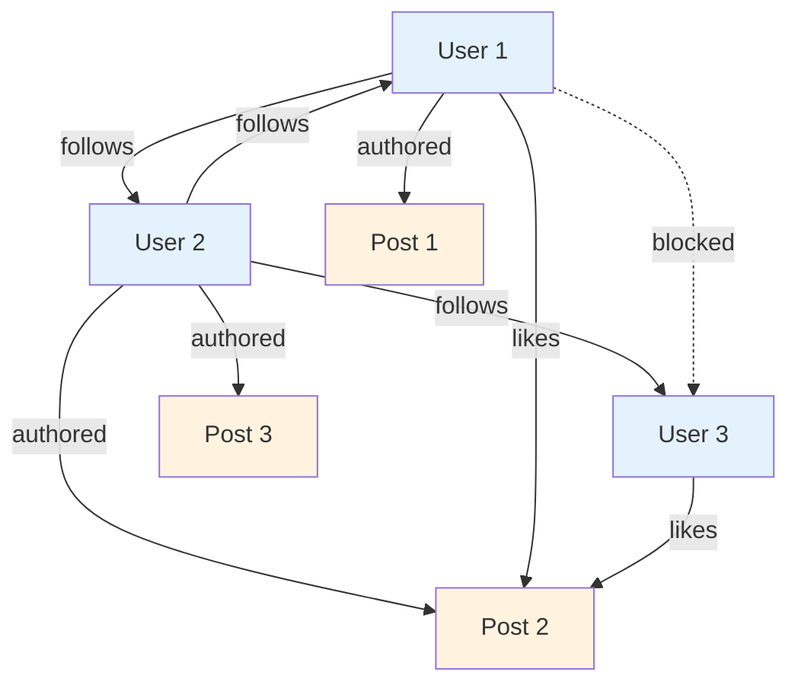

#### Recognizing Graph Structures

Look for these indicators in your Python code:

1. **Collections of References**
   ```python
   # Python: Collection indicates relationship
   self.friends = []  # → Friend edge
   self.items = []    # → Contains edge
   self.tags = []     # → TaggedWith edge
   ```

2. **Many-to-Many Relationships**
   ```python
   # Python: Join tables or intermediate objects
   class UserGroup:
       def __init__(self):
           self.members = []

   class GroupMembership:
       def __init__(self, user, group, role):
           self.user = user
           self.group = group
           self.role = role
   ```

3. **Hierarchical Structures**
   ```python
   # Python: Parent-child relationships
   class Category:
       def __init__(self, name, parent=None):
           self.name = name
           self.parent = parent
           self.children = []
   ```

4. **State Machines**
   ```python
   # Python: State transitions
   class Order:
       STATES = ['pending', 'paid', 'shipped', 'delivered']

       def transition_to(self, new_state):
           if self.can_transition(new_state):
               self.state = new_state
   ```

5. **Event Systems**
   ```python
   # Python: Observer patterns
   class EventEmitter:
       def __init__(self):
           self.listeners = defaultdict(list)

       def on(self, event, callback):
           self.listeners[event].append(callback)
   ```

### Converting Classes to Archetypes

The transformation from Python classes to Jac archetypes involves identifying which archetype best represents each class's role.

#### Decision Tree for Archetype Selection

```mermaid
graph TD
    A[Python Class] --> B{Represents a<br/>data entity?}
    B -->|Yes| C{Has connections<br/>to others?}
    B -->|No| D{Represents a<br/>relationship?}
    C -->|Yes| E[node]
    C -->|No| F[obj]
    D -->|Yes| G[edge]
    D -->|No| H{Represents a<br/>process/algorithm?}
    H -->|Yes| I[walker]
    H -->|No| J[obj or can]

    style E fill:#4caf50
    style G fill:#ff9800
    style I fill:#2196f3
    style F fill:#9c27b0
    style J fill:#9c27b0
```

#### Example: User Management System

**Python Original:**
```python
# models.py
from datetime import datetime
from typing import List, Optional

class User:
    def __init__(self, email: str, username: str):
        self.id = generate_id()
        self.email = email
        self.username = username
        self.created_at = datetime.now()
        self.profile = None
        self.sessions = []

    def create_profile(self, bio: str, avatar_url: str):
        self.profile = UserProfile(bio, avatar_url)
        return self.profile

    def get_active_sessions(self) -> List['Session']:
        return [s for s in self.sessions if s.is_active()]

class UserProfile:
    def __init__(self, bio: str, avatar_url: str):
        self.bio = bio
        self.avatar_url = avatar_url
        self.updated_at = datetime.now()

class Session:
    def __init__(self, user: User, ip_address: str):
        self.id = generate_id()
        self.user = user
        self.ip_address = ip_address
        self.created_at = datetime.now()
        self.last_activity = datetime.now()
        self.active = True

    def is_active(self) -> bool:
        timeout = datetime.now() - self.last_activity
        return self.active and timeout.seconds < 3600

    def terminate(self):
        self.active = False

class Friendship:
    def __init__(self, user1: User, user2: User):
        self.user1 = user1
        self.user2 = user2
        self.created_at = datetime.now()
        self.status = 'pending'

    def accept(self):
        self.status = 'accepted'

    def reject(self):
        self.status = 'rejected'
```

**Jac Migration:**
```jac
# models.jac

# User becomes a node (has connections)
node User {
    has email: str;
    has username: str;
    has created_at: str;

    # Automatic ID generation via postinit
    has id: str by postinit;

    can postinit {
        self.id = generate_id();
    }
}

# Profile becomes obj (1-1 with User, no independent connections)
obj UserProfile {
    has bio: str;
    has avatar_url: str;
    has updated_at: str;
}

# Session becomes an edge (connects User to temporal context)
edge Session(User, TimeContext) {
    has id: str by postinit;
    has ip_address: str;
    has created_at: str;
    has last_activity: str;
    has active: bool = true;

    can postinit {
        self.id = generate_id();
    }

    can is_active -> bool {
        import:py from datetime { datetime };
        if not self.active { return false; }

        last = datetime.fromisoformat(self.last_activity);
        timeout = datetime.now() - last;
        return timeout.seconds < 3600;
    }

    can terminate {
        self.active = false;
    }
}

# Friendship becomes an edge with status
edge Friendship(User, User) {
    has created_at: str;
    has status: str = 'pending';

    can accept {
        self.status = 'accepted';
    }

    can reject {
        self.status = 'rejected';
    }
}

# Profile creation becomes a walker
walker CreateProfile {
    has bio: str;
    has avatar_url: str;

    can create with User entry {
        # Check if profile already exists
        existing = here[-->:HasProfile:];
        if existing {
            report {"error": "Profile already exists"};
            disengage;
        }

        # Create profile and connect
        profile = UserProfile(
            bio=self.bio,
            avatar_url=self.avatar_url,
            updated_at=timestamp_now()
        );

        here ++>:HasProfile:++> profile;
        report {"success": true, "profile": profile};
    }
}

# Active sessions becomes a walker query
walker GetActiveSessions {
    has sessions: list = [];

    can collect with User entry {
        for session in [-->:Session:] {
            if session.is_active() {
                self.sessions.append({
                    "id": session.id,
                    "ip": session.ip_address,
                    "last_activity": session.last_activity
                });
            }
        }
    }
}
```

### Refactoring for Data Spatial Patterns

Moving beyond direct translation, we can refactor to truly leverage data spatial patterns.

##### Pattern 1: Replace Method Calls with Walker Traversal

**Python:**
```python
class NotificationService:
    def notify_followers(self, user, message):
        for follower in user.followers:
            if self.should_notify(follower, user):
                self.send_notification(follower, message)

    def should_notify(self, recipient, sender):
        # Check blocks, preferences, etc.
        return sender not in recipient.blocked_users
```

**Jac Refactored:**
```jac
walker NotifyFollowers {
    has message: str;
    has notifications_sent: int = 0;

    can notify with User entry {
        # Natural traversal with filtering
        for follower in [<--:Follows:] {
            # Blocked relationships prevent traversal
            if not follower[-->:Blocks:-->](?.target == here) {
                visit follower;
            }
        }
    }

    can deliver with User entry {
        # Create notification node
        notif = here ++> Notification(
            message=self.message,
            from_user=here,
            timestamp=timestamp_now(),
            read=false
        );
        self.notifications_sent += 1;
    }

    can summarize with `root exit {
        report {
            "sent": self.notifications_sent,
            "message": self.message
        };
    }
}
```

##### Pattern 2: Replace Queries with Graph Traversal

**Python:**
```python
# Finding mutual friends
def find_mutual_friends(user1, user2):
    friends1 = set(user1.friends)
    friends2 = set(user2.friends)
    return friends1.intersection(friends2)

# Finding friend recommendations
def recommend_friends(user, limit=10):
    recommendations = {}

    # Friends of friends
    for friend in user.friends:
        for fof in friend.friends:
            if fof != user and fof not in user.friends:
                recommendations[fof] = recommendations.get(fof, 0) + 1

    # Sort by mutual friend count
    sorted_recs = sorted(recommendations.items(),
                        key=lambda x: x[1], reverse=True)
    return [user for user, _ in sorted_recs[:limit]]
```

**Jac Refactored:**
```jac
walker FindMutualFriends {
    has other_user: User;
    has mutuals: set = {};

    can find with User entry {
        # Collect my friends
        my_friends = set([-->:Follows:-->]);

        # Visit other user and find intersection
        visit self.other_user else {
            report {"error": "User not found"};
        };
    }

    can compare with User entry {
        their_friends = set([-->:Follows:-->]);
        self.mutuals = my_friends.intersection(their_friends);
        report list(self.mutuals);
    }
}

walker RecommendFriends {
    has limit: int = 10;
    has recommendations: dict = {};
    has visited: set = {};
    has original_user: User by postinit;

    can postinit {
        self.original_user = here;
    }

    can explore with User entry {
        if here in self.visited { return; }
        self.visited.add(here);

        # First level: my friends
        if here == self.original_user {
            visit [-->:Follows:-->];
        }
        # Second level: friends of friends
        else {
            for fof in [-->:Follows:-->] {
                if fof != self.original_user and
                   not self.original_user[-->:Follows:-->](? == fof) {
                    self.recommendations[fof] = \
                        self.recommendations.get(fof, 0) + 1;
                }
            }
        }
    }

    can report_results with `root exit {
        # Sort and limit recommendations
        sorted_recs = sorted(
            self.recommendations.items(),
            key=lambda x: x[1],
            reverse=true
        );

        report [user for user, _ in sorted_recs[:self.limit]];
    }
}
```

##### Pattern 3: Replace State Machines with Graph Topology

**Python:**
```python
class Order:
    STATES = {
        'pending': ['cancelled', 'paid'],
        'paid': ['cancelled', 'processing'],
        'processing': ['shipped'],
        'shipped': ['delivered', 'returned'],
        'delivered': ['returned'],
        'cancelled': [],
        'returned': []
    }

    def __init__(self):
        self.state = 'pending'
        self.history = []

    def transition_to(self, new_state):
        if new_state in self.STATES[self.state]:
            self.history.append({
                'from': self.state,
                'to': new_state,
                'timestamp': datetime.now()
            })
            self.state = new_state
            self.trigger_state_actions(new_state)
        else:
            raise ValueError(f"Invalid transition: {self.state} -> {new_state}")
```

**Jac Refactored:**
```jac
# States as nodes
node OrderState {
    has name: str;
    has entry_actions: list = [];
    has exit_actions: list = [];
}

# Transitions as edges
edge Transition(OrderState, OrderState) {
    has name: str;
    has condition: str = "";
    has timestamp: str by postinit;

    can postinit {
        self.timestamp = timestamp_now();
    }
}

# Order exists in a state
edge InState(Order, OrderState);

# Walker to transition states
walker TransitionOrder {
    has target_state: str;
    has transition_history: list = [];

    can transition with Order entry {
        # Find current state
        current_state = here[-->:InState:-->][0];

        # Find valid transition
        for trans in current_state[-->:Transition:] {
            if trans.target.name == self.target_state {
                # Execute exit actions
                for action in current_state.exit_actions {
                    execute_action(action, here);
                }

                # Move to new state
                del here -->:InState:--> current_state;
                here ++>:InState:++> trans.target;

                # Record transition
                self.transition_history.append({
                    "from": current_state.name,
                    "to": trans.target.name,
                    "timestamp": trans.timestamp
                });

                # Execute entry actions
                for action in trans.target.entry_actions {
                    execute_action(action, here);
                }

                report {"success": true, "new_state": trans.target.name};
                disengage;
            }
        }

        report {"error": f"Invalid transition to {self.target_state}"};
    }
}

# Initialize state machine
with entry {
    # Create states
    pending = OrderState(name="pending");
    paid = OrderState(name="paid");
    processing = OrderState(name="processing");
    shipped = OrderState(name="shipped");
    delivered = OrderState(name="delivered");
    cancelled = OrderState(name="cancelled");
    returned = OrderState(name="returned");

    # Create transitions
    pending ++>:Transition(name="pay"):++> paid;
    pending ++>:Transition(name="cancel"):++> cancelled;
    paid ++>:Transition(name="process"):++> processing;
    paid ++>:Transition(name="cancel"):++> cancelled;
    processing ++>:Transition(name="ship"):++> shipped;
    shipped ++>:Transition(name="deliver"):++> delivered;
    shipped ++>:Transition(name="return"):++> returned;
    delivered ++>:Transition(name="return"):++> returned;
}
```

#### 18.2 Incremental Adoption

Jac is designed to work alongside Python, enabling gradual migration strategies that minimize risk and disruption.

### Using Python from Jac

Jac provides seamless Python interoperability through multiple mechanisms:

#### Direct Python Imports

```jac
# Import Python modules directly
import:py numpy as np;
import:py from pandas { DataFrame, Series };
import:py from sklearn.cluster { KMeans };

# Use Python libraries naturally
walker DataAnalyzer {
    has data: list;
    has clusters: int = 3;

    can analyze with entry {
        # Use pandas for data manipulation
        df = DataFrame(self.data);

        # Statistical analysis
        summary = df.describe();

        # Machine learning with sklearn
        features = df[['feature1', 'feature2']].values;
        kmeans = KMeans(n_clusters=self.clusters);
        labels = kmeans.fit_predict(features);

        # Store results in graph
        here ++> AnalysisResult(
            summary=summary.to_dict(),
            cluster_labels=labels.tolist(),
            centroids=kmeans.cluster_centers_.tolist()
        );
    }
}
```

#### Inline Python Code

```jac
# Complex Python logic inline
walker PythonIntegration {
    can process with entry {
        ::py::
        # Any Python code here
        import matplotlib.pyplot as plt
        import seaborn as sns

        # Create visualization
        data = here.get_metric_data()
        plt.figure(figsize=(10, 6))
        sns.lineplot(data=data, x='timestamp', y='value')
        plt.title(f'Metrics for {here.name}')
        plt.savefig(f'metrics_{here.id}.png')
        plt.close()

        # Complex computation
        result = perform_complex_calculation(data)
        ::py::

        # Back to Jac
        here.visualization_path = f'metrics_{here.id}.png';
        here.computed_result = result;
    }
}
```

#### Python Function Wrapping

```jac
# Wrap Python functions for Jac use
import:py from legacy_system {
    process_payment,
    validate_credit_card,
    send_email
};

# Create Jac-friendly wrappers
can process_payment_safe(amount: float, card: dict) -> dict {
    try {
        # Call Python function
        result = process_payment(amount, card);
        return {"success": true, "transaction_id": result.id};
    } except Exception as e {
        return {"success": false, "error": str(e)};
    }
}

# Use in walkers
walker ProcessOrder {
    has order_total: float;
    has payment_info: dict;

    can process with Order entry {
        # Validate card using Python
        if not validate_credit_card(self.payment_info) {
            report {"error": "Invalid card"};
            disengage;
        }

        # Process payment
        result = process_payment_safe(self.order_total, self.payment_info);

        if result["success"] {
            here ++> Payment(
                transaction_id=result["transaction_id"],
                amount=self.order_total,
                timestamp=timestamp_now()
            );

            # Send confirmation email
            send_email(
                to=here.customer_email,
                subject="Order Confirmed",
                body=f"Your order {here.id} has been confirmed."
            );
        }

        report result;
    }
}
```

### Hybrid Applications

Building applications that leverage both Python and Jac strengths:

#### Architecture Pattern: Python Backend, Jac Graph Layer

```python
# python_api.py
from flask import Flask, request, jsonify
from jac_runtime import JacRuntime

app = Flask(__name__)
jrt = JacRuntime('graph_layer.jac')

@app.route('/api/users/<user_id>/friends', methods=['GET'])
def get_friends(user_id):
    # Use Jac for graph operations
    result = jrt.run_walker('GetFriends', {
        'user_id': user_id,
        'include_pending': request.args.get('pending', False)
    })
    return jsonify(result)

@app.route('/api/recommendations/<user_id>', methods=['GET'])
def get_recommendations(user_id):
    # Complex graph algorithm in Jac
    result = jrt.run_walker('RecommendContent', {
        'user_id': user_id,
        'limit': int(request.args.get('limit', 10))
    })
    return jsonify(result)

# Traditional Python for non-graph operations
@app.route('/api/upload', methods=['POST'])
def upload_file():
    # Handle file upload with Python
    file = request.files['file']
    # Process with Python libraries
    processed = process_file(file)

    # Store metadata in Jac graph
    jrt.run_walker('StoreFileMetadata', {
        'filename': file.filename,
        'size': file.size,
        'processed_data': processed
    })

    return jsonify({'status': 'success'})
```

```jac
# graph_layer.jac

walker GetFriends {
    has user_id: str;
    has include_pending: bool = false;
    has friends: list = [];

    can find with entry {
        user = find_user_by_id(self.user_id);
        if not user {
            report {"error": "User not found"};
            disengage;
        }
        visit user;
    }

    can collect with User entry {
        for friend_edge in [-->:Friendship:] {
            if friend_edge.status == "accepted" or
               (self.include_pending and friend_edge.status == "pending") {
                self.friends.append({
                    "user": friend_edge.target.to_dict(),
                    "friendship_status": friend_edge.status,
                    "since": friend_edge.created_at
                });
            }
        }
        report {"friends": self.friends};
    }
}
```

#### Pattern: Jac for Business Logic, Python for Infrastructure

```jac
# business_logic.jac

# Define business rules in Jac
walker ApplyDiscounts {
    has order: dict;
    has discounts_applied: list = [];

    can apply with Customer entry {
        # Customer loyalty discount
        if here.loyalty_points > 1000 {
            self.add_discount("LOYALTY10", 0.10);
        }

        # Visit purchase history
        visit [-->:PurchaseHistory:];
    }

    can check_history with PurchaseHistory entry {
        # Frequent buyer discount
        recent_purchases = here.get_recent_purchases(days=30);
        if len(recent_purchases) >= 5 {
            self.add_discount("FREQUENT5", 0.05);
        }
    }

    can add_discount(code: str, percentage: float) {
        self.discounts_applied.append({
            "code": code,
            "percentage": percentage
        });
    }
}

# Wrapper for Python integration
can calculate_order_total(order: dict) -> dict {
    # Create temporary graph structure
    customer = Customer(id=order["customer_id"]);

    # Run business logic
    walker = ApplyDiscounts(order=order);
    spawn walker on customer;

    # Apply discounts using Python for calculation
    ::py::
    total = order["subtotal"]
    for discount in walker.discounts_applied:
        total *= (1 - discount["percentage"])

    # Add tax calculation (complex Python logic)
    tax = calculate_tax(total, order["shipping_address"])
    final_total = total + tax
    ::py::

    return {
        "subtotal": order["subtotal"],
        "discounts": walker.discounts_applied,
        "tax": tax,
        "total": final_total
    };
}
```

### Migration Strategies

##### Strategy 1: Strangler Fig Pattern

Gradually replace Python components with Jac equivalents:

```mermaid
graph LR
    subgraph "Phase 1: Python Monolith"
        P1[Python App]
    end

    subgraph "Phase 2: Extract Graph Layer"
        P2A[Python App]
        P2B[Jac Graph Layer]
        P2A <--> P2B
    end

    subgraph "Phase 3: Migrate Business Logic"
        P3A[Python API]
        P3B[Jac Business Logic]
        P3C[Jac Graph Layer]
        P3A --> P3B
        P3B <--> P3C
    end

    subgraph "Phase 4: Full Jac"
        P4[Jac Application]
    end

    P1 ==> P2A
    P2A ==> P3A
    P3A ==> P4
```

**Phase 1 to 2 Example:**
```python
# Original Python
class UserService:
    def get_user_network(self, user_id):
        user = User.query.get(user_id)
        friends = [f.to_dict() for f in user.friends]
        followers = [f.to_dict() for f in user.followers]
        return {
            'friends': friends,
            'followers': followers
        }
```

```jac
# Extract to Jac
walker GetUserNetwork {
    has user_id: str;

    can get with entry {
        # Still use Python for data access initially
        ::py::
        from models import User
        user = User.query.get(self.user_id)
        ::py::

        # Build graph structure
        user_node = User(
            id=user.id,
            username=user.username
        );

        # Migrate relationships to graph
        visit user_node;
    }

    can collect with User entry {
        report {
            "friends": [-->:Friend:-->].to_dict(),
            "followers": [<--:Follows:].to_dict()
        };
    }
}
```

##### Strategy 2: Feature Branch Migration

Implement new features in Jac while maintaining existing Python:

```python
# config.py
FEATURE_FLAGS = {
    'use_jac_recommendations': True,
    'use_jac_notifications': False,
    'use_jac_auth': False
}

# app.py
def get_recommendations(user_id):
    if FEATURE_FLAGS['use_jac_recommendations']:
        # New Jac implementation
        return jac_runtime.get_recommendations(user_id)
    else:
        # Legacy Python implementation
        return python_recommendation_engine.get_recommendations(user_id)
```

##### Strategy 3: Microservice Extraction

Build new microservices in Jac:

```yaml
# docker-compose.yml
version: '3.8'
services:
  legacy-api:
    build: ./python-api
    ports:
      - "5000:5000"

  recommendation-service:
    build: ./jac-recommendations
    environment:
      - JAC_PERSIST_PATH=/data/recommendations
    volumes:
      - jac-data:/data

  notification-service:
    build: ./jac-notifications
    environment:
      - JAC_PERSIST_PATH=/data/notifications
    volumes:
      - jac-data:/data

volumes:
  jac-data:
```

##### Strategy 4: Database Migration Pattern

```jac
# Migrate data from Python ORM to Jac graph
walker MigrateUsers {
    has batch_size: int = 100;
    has offset: int = 0;

    can migrate with entry {
        ::py::
        from sqlalchemy import create_engine
        from sqlalchemy.orm import sessionmaker
        from legacy_models import User, Friendship

        engine = create_engine('postgresql://...')
        Session = sessionmaker(bind=engine)
        session = Session()

        # Fetch batch of users
        users = session.query(User)\
            .offset(self.offset)\
            .limit(self.batch_size)\
            .all()
        ::py::

        # Convert to Jac nodes
        for py_user in users {
            jac_user = root ++> User(
                id=py_user.id,
                username=py_user.username,
                email=py_user.email,
                created_at=py_user.created_at.isoformat()
            );

            # Migrate relationships
            ::py::
            friendships = session.query(Friendship)\
                .filter_by(user_id=py_user.id)\
                .all()
            ::py::

            for friendship in friendships {
                target = find_or_create_user(friendship.friend_id);
                jac_user ++>:Friend(
                    since=friendship.created_at.isoformat(),
                    status=friendship.status
                ):++> target;
            }
        }

        # Continue with next batch
        if len(users) == self.batch_size {
            self.offset += self.batch_size;
            visit root;  # Process next batch
        } else {
            report {"migrated": self.offset + len(users)};
        }
    }
}
```

### Best Practices for Migration

1. **Start with the Graph**
   - Identify core entities and relationships
   - Model in Jac first, implement incrementally

2. **Maintain Compatibility**
   - Keep APIs stable during migration
   - Use adapter patterns for gradual transition

3. **Test Extensively**
   - Maintain parallel test suites
   - Verify behavior equivalence

4. **Monitor Performance**
   - Compare Python vs Jac implementations
   - Optimize graph traversal patterns

5. **Document Differences**
   - Note semantic changes
   - Create migration guides for team

### Migration Checklist

- [ ] Identify graph structures in Python code
- [ ] Map Python classes to Jac archetypes
- [ ] Create Jac equivalents for core models
- [ ] Implement Python-Jac interop layer
- [ ] Migrate business logic incrementally
- [ ] Convert data access patterns
- [ ] Update deployment infrastructure
- [ ] Train team on Jac concepts
- [ ] Monitor and optimize performance
- [ ] Deprecate Python components gradually

The key to successful migration is recognizing that Jac isn't just Python with different syntax—it's a fundamentally different way of thinking about program structure. Embrace the graph, let computation flow to data, and watch your applications become more intuitive, scalable, and maintainable.

### Chapter 19: Performance and Optimization

#### 19.1 Performance Characteristics

Understanding Jac's performance characteristics is crucial for building efficient applications. The data spatial paradigm introduces unique performance considerations that differ significantly from traditional programming models.

### Traversal Optimization

Walker traversal is at the heart of Jac's execution model. Understanding how to optimize traversal patterns can dramatically improve application performance.

#### Traversal Complexity Analysis

```jac
# Analyzing traversal patterns
walker PerformanceAnalyzer {
    has nodes_visited: int = 0;
    has edges_traversed: int = 0;
    has ability_executions: int = 0;
    has start_time: float by postinit;

    can postinit {
        import:py time;
        self.start_time = time.time();
    }

    can analyze with entry {
        self.nodes_visited += 1;
        self.ability_executions += 1;

        # Track edge traversals
        outgoing = [-->];
        self.edges_traversed += len(outgoing);

        # Continue traversal
        visit outgoing;
    }

    can report_metrics with `root exit {
        import:py time;
        elapsed = time.time() - self.start_time;

        report {
            "nodes_visited": self.nodes_visited,
            "edges_traversed": self.edges_traversed,
            "ability_executions": self.ability_executions,
            "elapsed_time": elapsed,
            "nodes_per_second": self.nodes_visited / elapsed,
            "traversal_efficiency": self.edges_traversed / self.nodes_visited
        };
    }
}
```

#### Breadth-First vs Depth-First Performance

```mermaid
graph TD
    subgraph "Breadth-First Traversal"
        B1[Root] --> B2[Level 1A]
        B1 --> B3[Level 1B]
        B2 --> B4[Level 2A]
        B2 --> B5[Level 2B]
        B3 --> B6[Level 2C]
        B3 --> B7[Level 2D]

        style B1 fill:#ff9999
        style B2 fill:#ffcc99
        style B3 fill:#ffcc99
        style B4 fill:#ffff99
        style B5 fill:#ffff99
        style B6 fill:#ffff99
        style B7 fill:#ffff99
    end

    subgraph "Depth-First Traversal"
        D1[Root] --> D2[Level 1A]
        D1 --> D3[Level 1B]
        D2 --> D4[Level 2A]
        D2 --> D5[Level 2B]
        D3 --> D6[Level 2C]
        D3 --> D7[Level 2D]

        style D1 fill:#ff9999
        style D2 fill:#ffcc99
        style D4 fill:#ccff99
        style D5 fill:#99ff99
        style D3 fill:#99ffcc
        style D6 fill:#99ccff
        style D7 fill:#cc99ff
    end
```

```jac
# Breadth-first traversal (default)
walker BreadthFirstSearch {
    has target_value: any;
    has max_depth: int = 5;
    has current_depth: int = 0;
    has found: bool = false;

    can search with entry {
        if here.value == self.target_value {
            self.found = true;
            report here;
            disengage;
        }

        if self.current_depth < self.max_depth {
            # Natural breadth-first
            visit [-->];
        }
    }
}

# Depth-first traversal (explicit implementation)
walker DepthFirstSearch {
    has target_value: any;
    has max_depth: int = 5;
    has path: list = [];

    can search with entry {
        self.path.append(here);

        if here.value == self.target_value {
            report {"found": here, "path": self.path};
            disengage;
        }

        if len(self.path) < self.max_depth {
            # Process children immediately
            for child in [-->] {
                spawn DepthFirstSearch(
                    target_value=self.target_value,
                    max_depth=self.max_depth,
                    path=self.path.copy()
                ) on child;
            }
        }
    }
}
```

#### Early Termination Strategies

```jac
# Efficient search with early termination
walker OptimizedSearch {
    has criteria: dict;
    has max_results: int = 10;
    has results: list = [];
    has visited: set = {};

    can search with entry {
        # Skip already visited nodes
        if here.id in self.visited {
            return;  # Don't visit children
        }
        self.visited.add(here.id);

        # Check criteria
        if matches_criteria(here, self.criteria) {
            self.results.append(here);

            # Early termination when enough results
            if len(self.results) >= self.max_results {
                report self.results;
                disengage;  # Stop entire traversal
            }
        }

        # Smart traversal - prioritize promising branches
        children = [-->];
        promising = sort_by_promise(children, self.criteria);

        # Visit only top branches
        visit promising[:3];
    }
}

# Helper functions
can matches_criteria(node: node, criteria: dict) -> bool {
    for key, value in criteria.items() {
        if not hasattr(node, key) or getattr(node, key) != value {
            return false;
        }
    }
    return true;
}

can sort_by_promise(nodes: list, criteria: dict) -> list {
    # Score nodes by how likely they lead to matches
    scored = [];
    for n in nodes {
        score = calculate_promise_score(n, criteria);
        scored.append((score, n));
    }
    scored.sort(reverse=true);
    return [n for _, n in scored];
}
```

### Memory Management

Jac's automatic memory management includes garbage collection, but understanding memory patterns helps optimize performance.

#### Node and Edge Memory Footprint

```jac
# Memory-efficient node design
node LightweightNode {
    # Use appropriate data types
    has id: int;  # 8 bytes vs string (variable)
    has flags: int;  # Bit flags vs multiple bools
    has data_ref: str;  # Reference vs embedded data
}

# Memory-heavy node (avoid for large graphs)
node HeavyNode {
    has id: str;  # UUID string = 36+ bytes
    has metadata: dict;  # Unbounded size
    has history: list;  # Grows over time
    has cached_computations: dict;  # Memory leak risk
}

# Monitoring memory usage
walker MemoryProfiler {
    has node_count: int = 0;
    has edge_count: int = 0;
    has total_data_size: int = 0;

    can profile with entry {
        import:py sys;

        self.node_count += 1;

        # Estimate node memory
        node_size = sys.getsizeof(here);

        # Add data structure sizes
        for attr_name in dir(here) {
            if not attr_name.startswith('_') {
                attr_value = getattr(here, attr_name);
                self.total_data_size += sys.getsizeof(attr_value);
            }
        }

        # Count edges
        self.edge_count += len([-->]) + len([<--]);

        visit [-->];
    }

    can report with `root exit {
        avg_node_size = self.total_data_size / self.node_count;

        report {
            "nodes": self.node_count,
            "edges": self.edge_count,
            "total_data_size": self.total_data_size,
            "avg_node_size": avg_node_size,
            "estimated_total_memory": (
                self.node_count * avg_node_size +
                self.edge_count * 64  # Rough edge overhead
            )
        };
    }
}
```

#### Walker State Management

```jac
# Memory-efficient walker with bounded state
walker EfficientCollector {
    has max_items: int = 1000;
    has buffer: list = [];
    has result_handler: callable;

    can collect with entry {
        if should_collect(here) {
            self.buffer.append(extract_data(here));

            # Flush buffer periodically
            if len(self.buffer) >= 100 {
                self.flush_buffer();
            }
        }

        visit [-->];
    }

    can flush_buffer {
        # Process and clear buffer
        self.result_handler(self.buffer);
        self.buffer = [];  # Free memory
    }

    can finalize with `root exit {
        # Final flush
        if self.buffer {
            self.flush_buffer();
        }
    }
}

# Memory-inefficient walker (avoid)
walker InefficientCollector {
    # Unbounded collections
    has all_nodes: list = [];
    has all_paths: list = [];
    has node_data_cache: dict = {};

    can collect with entry {
        # Keeps references to everything
        self.all_nodes.append(here);
        self.all_paths.append(self.current_path.copy());
        self.node_data_cache[here.id] = here.to_dict();

        # Memory grows with graph size
        visit [-->];
    }
}
```

#### Circular Reference Management

```jac
# Potential circular reference
node Document {
    has title: str;
    has metadata: dict = {};

    can add_reverse_reference(other: Document) {
        # Creates circular reference through dict
        self.metadata["related"] = other;
        other.metadata["related"] = self;
    }
}

# Better approach using edges
edge RelatedTo(Document, Document) {
    has relationship_type: str;
}

# Clean reference management
can link_documents(doc1: Document, doc2: Document, rel_type: str) {
    doc1 ++>:RelatedTo(relationship_type=rel_type):++> doc2;
    # Graph structure handles references properly
}
```

### Distribution Overhead

When Jac applications scale across machines, understanding distribution overhead becomes critical.

#### Cross-Machine Edge Traversal

```mermaid
graph LR
    subgraph "Machine A"
        A1[Node A1]
        A2[Node A2]
        A1 -->|Local<br/>~1μs| A2
    end

    subgraph "Machine B"
        B1[Node B1]
        B2[Node B2]
        B1 -->|Local<br/>~1μs| B2
    end

    A2 -.->|Network<br/>~1-10ms| B1

    style A1 fill:#e3f2fd
    style A2 fill:#e3f2fd
    style B1 fill:#fff3e0
    style B2 fill:#fff3e0
```

```jac
# Measuring distribution overhead
walker LatencyProfiler {
    has local_traversals: int = 0;
    has remote_traversals: int = 0;
    has local_time: float = 0.0;
    has remote_time: float = 0.0;

    can measure with entry {
        import:py time;

        for edge in [-->] {
            start = time.time();

            # Check if edge crosses machine boundary
            if is_remote(edge.target) {
                self.remote_traversals += 1;
                visit edge.target;
                self.remote_time += time.time() - start;
            } else {
                self.local_traversals += 1;
                visit edge.target;
                self.local_time += time.time() - start;
            }
        }
    }

    can report with `root exit {
        avg_local = self.local_time / max(1, self.local_traversals);
        avg_remote = self.remote_time / max(1, self.remote_traversals);

        report {
            "local_traversals": self.local_traversals,
            "remote_traversals": self.remote_traversals,
            "avg_local_latency": avg_local,
            "avg_remote_latency": avg_remote,
            "overhead_factor": avg_remote / max(0.000001, avg_local)
        };
    }
}
```

#### Optimizing Distributed Traversal

```jac
# Batch operations to reduce network calls
walker BatchedProcessor {
    has batch_size: int = 50;
    has operation_batch: list = [];

    can process with entry {
        # Queue operation
        self.operation_batch.append({
            "node": here,
            "operation": "process",
            "data": extract_data(here)
        });

        # Process batch when full
        if len(self.operation_batch) >= self.batch_size {
            self.process_batch();
        }

        visit [-->];
    }

    can process_batch {
        # Group by machine
        by_machine = group_by_machine(self.operation_batch);

        # Send batched operations
        for machine, operations in by_machine.items() {
            if machine == current_machine() {
                # Process locally
                for op in operations {
                    execute_local(op);
                }
            } else {
                # Send batch to remote machine
                send_remote_batch(machine, operations);
            }
        }

        self.operation_batch = [];
    }
}

# Data locality optimization
walker LocalityAwareTraverser {
    has prefer_local: bool = true;
    has locality_threshold: float = 0.8;

    can traverse with entry {
        edges = [-->];

        if self.prefer_local {
            # Partition edges by locality
            local_edges = [];
            remote_edges = [];

            for edge in edges {
                if is_local(edge.target) {
                    local_edges.append(edge);
                } else {
                    remote_edges.append(edge);
                }
            }

            # Visit local first
            visit local_edges;

            # Visit remote only if necessary
            if random.random() > self.locality_threshold {
                visit remote_edges;
            }
        } else {
            visit edges;
        }
    }
}
```

#### 19.2 Optimization Techniques

### Graph Layout Optimization

The physical layout of your graph structure significantly impacts performance. Optimizing this layout can reduce traversal time and memory usage.

#### Node Clustering Strategies

```jac
# Cluster related nodes for better cache locality
walker ClusterAnalyzer {
    has clusters: dict = {};
    has cluster_threshold: float = 0.7;

    can analyze with entry {
        # Find node clusters based on connectivity
        cluster_id = self.find_or_create_cluster(here);

        # Analyze connections
        connections = [-->] + [<--];
        for conn in connections {
            similarity = calculate_similarity(here, conn);
            if similarity > self.cluster_threshold {
                self.add_to_cluster(conn, cluster_id);
            }
        }

        visit [-->];
    }

    can find_or_create_cluster(node: node) -> str {
        # Check existing clusters
        for cluster_id, members in self.clusters.items() {
            if node in members {
                return cluster_id;
            }
        }

        # Create new cluster
        import:py uuid;
        cluster_id = str(uuid.uuid4());
        self.clusters[cluster_id] = {node};
        return cluster_id;
    }
}

# Reorganize graph based on clustering
walker GraphReorganizer {
    has clusters: dict;
    has hub_nodes: dict = {};

    can reorganize with entry {
        # Create hub nodes for each cluster
        for cluster_id, members in self.clusters.items() {
            hub = root ++> ClusterHub(
                cluster_id=cluster_id,
                member_count=len(members)
            );
            self.hub_nodes[cluster_id] = hub;

            # Connect members to hub
            for member in members {
                hub ++>:InCluster:++> member;
            }
        }

        # Optimize inter-cluster connections
        self.optimize_cross_cluster_edges();
    }

    can optimize_cross_cluster_edges {
        # Replace many-to-many with hub-to-hub connections
        for cluster_id, hub in self.hub_nodes.items() {
            members = hub[-->:InCluster:];

            # Find external connections
            external_counts = {};
            for member in members {
                for external in member[-->] {
                    if external not in self.clusters[cluster_id] {
                        external_cluster = self.find_cluster(external);
                        external_counts[external_cluster] = \
                            external_counts.get(external_cluster, 0) + 1;
                    }
                }
            }

            # Create hub-to-hub edges for frequent connections
            for other_cluster, count in external_counts.items() {
                if count > 5 {  # Threshold
                    other_hub = self.hub_nodes[other_cluster];
                    hub ++>:ClusterConnection(weight=count):++> other_hub;
                }
            }
        }
    }
}
```

#### Hot Path Optimization

```jac
# Identify and optimize frequently traversed paths
walker HotPathAnalyzer {
    has path_counts: dict = {};
    has edge_counts: dict = {};
    has sampling_rate: float = 0.1;

    can analyze with entry {
        # Sample traversals
        if random.random() < self.sampling_rate {
            self.record_path();
        }

        # Record edge usage
        for edge in [-->] {
            edge_id = f"{here.id}->{edge.target.id}";
            self.edge_counts[edge_id] = self.edge_counts.get(edge_id, 0) + 1;
        }

        visit [-->];
    }

    can identify_hot_paths with `root exit {
        # Sort by frequency
        hot_edges = sorted(
            self.edge_counts.items(),
            key=lambda x: x[1],
            reverse=true
        );

        # Top 10% are hot paths
        threshold_index = int(len(hot_edges) * 0.1);
        hot_paths = hot_edges[:threshold_index];

        report {
            "hot_paths": hot_paths,
            "total_edges": len(self.edge_counts),
            "optimization_targets": [edge_id for edge_id, _ in hot_paths]
        };
    }
}

# Create shortcuts for hot paths
walker PathOptimizer {
    has hot_paths: list;
    has shortcut_threshold: int = 3;

    can optimize with entry {
        for path_info in self.hot_paths {
            src_id, dst_id = path_info["path"].split("->");
            src = find_node_by_id(src_id);
            dst = find_node_by_id(dst_id);

            # Find actual path length
            path_length = find_shortest_path_length(src, dst);

            # Create shortcut if path is long
            if path_length > self.shortcut_threshold {
                src ++>:Shortcut(
                    original_length=path_length,
                    usage_count=path_info["count"]
                ):++> dst;
            }
        }
    }
}
```

### Walker Batching

Processing multiple items in a single walker traversal can significantly improve performance.

```jac
# Inefficient: One walker per item
walker SingleItemProcessor {
    has item_id: str;

    can process with entry {
        item = find_item(self.item_id);
        result = expensive_computation(item);
        here ++> ProcessingResult(
            item_id=self.item_id,
            result=result
        );
    }
}

# Efficient: Batch processing
walker BatchProcessor {
    has item_ids: list;
    has batch_size: int = 100;
    has results: dict = {};

    can process with entry {
        # Process items in batches
        for i in range(0, len(self.item_ids), self.batch_size) {
            batch = self.item_ids[i:i + self.batch_size];

            # Bulk operations are more efficient
            items = bulk_find_items(batch);

            # Vectorized computation
            batch_results = vectorized_computation(items);

            # Store results
            for item_id, result in zip(batch, batch_results) {
                self.results[item_id] = result;
            }
        }

        # Create result nodes
        for item_id, result in self.results.items() {
            here ++> ProcessingResult(
                item_id=item_id,
                result=result,
                batch_processed=true
            );
        }
    }
}

# Parallel batch processing
walker ParallelBatchProcessor {
    has items: list;
    has num_workers: int = 4;
    has results: list = [];

    can process with entry {
        import:py from concurrent.futures { ThreadPoolExecutor };

        # Split items into chunks
        chunk_size = len(self.items) // self.num_workers;
        chunks = [
            self.items[i:i + chunk_size]
            for i in range(0, len(self.items), chunk_size)
        ];

        # Process chunks in parallel
        with ThreadPoolExecutor(max_workers=self.num_workers) as executor {
            futures = [];

            for chunk in chunks {
                # Spawn sub-walker for each chunk
                sub_walker = ChunkProcessor(items=chunk);
                future = executor.submit(lambda: spawn sub_walker on here);
                futures.append(future);
            }

            # Collect results
            for future in futures {
                chunk_results = future.result();
                self.results.extend(chunk_results);
            }
        }

        report self.results;
    }
}
```

### Caching Strategies

Intelligent caching can dramatically improve performance for repeated operations.

#### Node-Level Caching

```jac
node CachedDataNode {
    has data: dict;
    has cache: dict = {};
    has cache_ttl: int = 300;  # 5 minutes
    has cache_timestamps: dict = {};

    can get_computed_value(key: str) -> any {
        import:py time;

        # Check cache
        if key in self.cache {
            timestamp = self.cache_timestamps.get(key, 0);
            if time.time() - timestamp < self.cache_ttl {
                return self.cache[key];
            }
        }

        # Compute value
        value = expensive_computation(self.data, key);

        # Update cache
        self.cache[key] = value;
        self.cache_timestamps[key] = time.time();

        return value;
    }

    can invalidate_cache(key: str = None) {
        if key {
            self.cache.pop(key, None);
            self.cache_timestamps.pop(key, None);
        } else {
            self.cache = {};
            self.cache_timestamps = {};
        }
    }
}
```

#### Walker Result Caching

```jac
# Cache walker results based on input parameters
glob WALKER_CACHE: dict = {};

walker CachedAnalyzer {
    has params: dict;
    has cache_key: str by postinit;
    has use_cache: bool = true;

    can postinit {
        # Generate cache key from parameters
        import:py json;
        self.cache_key = json.dumps(self.params, sort_keys=true);
    }

    can analyze with entry {
        # Check cache first
        if self.use_cache and self.cache_key in WALKER_CACHE {
            cache_entry = WALKER_CACHE[self.cache_key];

            # Validate cache age
            import:py time;
            if time.time() - cache_entry["timestamp"] < 3600 {  # 1 hour
                report cache_entry["result"];
                disengage;
            }
        }

        # Perform actual analysis
        result = self.perform_analysis();

        # Cache result
        if self.use_cache {
            import:py time;
            WALKER_CACHE[self.cache_key] = {
                "result": result,
                "timestamp": time.time()
            };
        }

        report result;
    }

    can perform_analysis -> dict {
        # Expensive analysis logic
        visited_count = 0;
        total_value = 0;

        queue = [here];
        visited = set();

        while queue {
            current = queue.pop(0);
            if current.id in visited {
                continue;
            }

            visited.add(current.id);
            visited_count += 1;
            total_value += current.value;

            # Add neighbors
            queue.extend([-->]);
        }

        return {
            "visited_count": visited_count,
            "total_value": total_value,
            "average_value": total_value / visited_count
        };
    }
}
```

#### Query Result Caching

```jac
# Cache complex graph queries
walker QueryOptimizer {
    has query_cache: dict = {};
    has cache_hits: int = 0;
    has cache_misses: int = 0;

    can find_pattern(pattern: dict) -> list {
        # Generate cache key
        cache_key = self.pattern_to_key(pattern);

        # Check cache
        if cache_key in self.query_cache {
            self.cache_hits += 1;
            return self.query_cache[cache_key];
        }

        self.cache_misses += 1;

        # Execute query
        results = self.execute_pattern_search(pattern);

        # Cache results
        self.query_cache[cache_key] = results;

        # Evict old entries if cache too large
        if len(self.query_cache) > 1000 {
            self.evict_oldest_entries(100);
        }

        return results;
    }

    can pattern_to_key(pattern: dict) -> str {
        # Convert pattern to stable string key
        import:py json;
        return json.dumps(pattern, sort_keys=true);
    }

    can evict_oldest_entries(count: int) {
        # Simple FIFO eviction
        keys = list(self.query_cache.keys());
        for key in keys[:count] {
            del self.query_cache[key];
        }
    }
}
```

### Performance Monitoring and Profiling

Building performance monitoring directly into your Jac applications helps identify bottlenecks.

```jac
# Performance monitoring walker
walker PerformanceMonitor {
    has metrics: dict = {
        "ability_timings": {},
        "node_visit_counts": {},
        "edge_traversal_counts": {},
        "memory_snapshots": []
    };
    has profile_enabled: bool = true;

    can monitor with entry {
        import:py time;
        import:py psutil;

        if self.profile_enabled {
            # Record node visit
            node_type = type(here).__name__;
            self.metrics["node_visit_counts"][node_type] = \
                self.metrics["node_visit_counts"].get(node_type, 0) + 1;

            # Memory snapshot
            process = psutil.Process();
            self.metrics["memory_snapshots"].append({
                "timestamp": time.time(),
                "memory_mb": process.memory_info().rss / 1024 / 1024,
                "node_id": here.id
            });
        }

        # Continue monitoring
        visit [-->];
    }

    can measure_ability(ability_name: str, ability_func: callable) -> any {
        if not self.profile_enabled {
            return ability_func();
        }

        import:py time;
        start = time.time();

        try {
            result = ability_func();
            elapsed = time.time() - start;

            # Record timing
            if ability_name not in self.metrics["ability_timings"] {
                self.metrics["ability_timings"][ability_name] = {
                    "count": 0,
                    "total_time": 0,
                    "max_time": 0,
                    "min_time": float('inf')
                };
            }

            timing = self.metrics["ability_timings"][ability_name];
            timing["count"] += 1;
            timing["total_time"] += elapsed;
            timing["max_time"] = max(timing["max_time"], elapsed);
            timing["min_time"] = min(timing["min_time"], elapsed);

            return result;
        } except Exception as e {
            self.metrics["errors"] = self.metrics.get("errors", 0) + 1;
            raise e;
        }
    }

    can generate_report with `root exit {
        # Calculate averages
        for ability_name, timing in self.metrics["ability_timings"].items() {
            timing["avg_time"] = timing["total_time"] / timing["count"];
        }

        # Memory analysis
        if self.metrics["memory_snapshots"] {
            memory_values = [s["memory_mb"] for s in self.metrics["memory_snapshots"]];
            self.metrics["memory_summary"] = {
                "start_mb": memory_values[0],
                "end_mb": memory_values[-1],
                "peak_mb": max(memory_values),
                "growth_mb": memory_values[-1] - memory_values[0]
            };
        }

        report self.metrics;
    }
}

# Usage example
with entry {
    monitor = PerformanceMonitor();

    # Wrap your main walker
    main_walker = YourApplicationWalker();

    # Run with monitoring
    spawn monitor on root;
    spawn main_walker on root;

    # Get performance report
    report = monitor.generate_report();
    save_performance_report(report);
}
```

### Best Practices Summary

1. **Optimize Traversal Patterns**
   - Use early termination when possible
   - Batch operations to reduce overhead
   - Consider traversal order (BFS vs DFS)

2. **Manage Memory Efficiently**
   - Keep walker state bounded
   - Use references instead of copies
   - Clear large collections when done

3. **Leverage Caching**
   - Cache expensive computations
   - Implement TTL for cache entries
   - Monitor cache hit rates

4. **Monitor Performance**
   - Build monitoring into your application
   - Profile different graph sizes
   - Track memory usage over time

5. **Optimize for Distribution**
   - Minimize cross-machine traversals
   - Batch remote operations
   - Consider data locality in graph design

The key to Jac performance is understanding that computation moves through your data structure. By optimizing the structure and the movement patterns, you can achieve excellent performance at any scale.

## Part VII: Reference and Resources

### Chapter 20: Quick Reference

#### 20.1 Syntax Comparison Table

This comprehensive comparison shows Python syntax alongside its Jac equivalent, helping you quickly translate between the two languages.

### Basic Syntax Elements

| Python | Jac | Notes |
|--------|-----|-------|
| `# Comment` | `# Comment` | Single-line comments identical |
| `"""Docstring"""` | `"""Docstring"""` | Multi-line strings identical |
| `pass` | `{}` or `;` | Empty statement/block |
| `:` (colon) | `{` ... `}` | Block delimiters |
| Indentation | Curly braces | Structural delimiter |
| No semicolons | `;` required | Statement terminator |

### Variable Declaration

| Python | Jac | Notes |
|--------|-----|-------|
| `x = 42` | `x = 42;` | Implicit declaration |
| `x: int = 42` | `let x: int = 42;` | Explicit typed declaration |
| `global x` | `:g: x;` or `glob x = 42;` | Global variable |
| `nonlocal x` | `:nl: x;` | Nonlocal variable |

### Functions

| Python | Jac | Notes |
|--------|-----|-------|
| `def func():` | `can func {` | Function declaration |
| `def func(x: int) -> str:` | `can func(x: int) -> str {` | Typed function |
| `return value` | `return value;` | Return statement |
| `lambda x: x * 2` | `lambda x: int : x * 2` | Lambda (types required) |
| `@decorator` | `@decorator` | Decorators work similarly |
| `def __init__(self):` | `can init {` | Constructor |
| N/A | `can postinit {` | Post-initialization hook |

### Classes and Objects

| Python | Jac | Notes |
|--------|-----|-------|
| `class MyClass:` | `obj MyClass {` | Standard class |
| `class MyClass:` | `class MyClass {` | Python-compatible class |
| `self.attr = value` | `has attr: type = value;` | Instance variables |
| `@staticmethod` | `static can method {` | Static methods |
| `super()` | `super` | Parent class access |
| N/A | `node MyNode {` | Graph node class |
| N/A | `edge MyEdge {` | Graph edge class |
| N/A | `walker MyWalker {` | Walker class |

### Control Flow

| Python | Jac | Notes |
|--------|-----|-------|
| `if x:` | `if x {` | Conditional |
| `elif y:` | `elif y {` | Else-if |
| `else:` | `else {` | Else clause |
| `while condition:` | `while condition {` | While loop |
| `for x in items:` | `for x in items {` | For-in loop |
| `for i in range(n):` | `for i=0 to i<n by i+=1 {` | Explicit counter loop |
| `break` | `break;` | Exit loop |
| `continue` | `continue;` | Skip iteration |
| `match value:` | `match value {` | Pattern matching |

#### Exception Handling

| Python | Jac | Notes |
|--------|-----|-------|
| `try:` | `try {` | Try block |
| `except Exception as e:` | `except Exception as e {` | Catch exception |
| `finally:` | `finally {` | Finally block |
| `raise Exception()` | `raise Exception();` | Raise exception |
| `assert condition` | `assert condition;` | Assertion |

### Data Types

| Python | Jac | Notes |
|--------|-----|-------|
| `list` | `list` | Lists identical |
| `dict` | `dict` | Dictionaries identical |
| `set` | `set` | Sets identical |
| `tuple` | `tuple` | Positional tuples |
| N/A | `(x=1, y=2)` | Keyword tuples |
| `None` | `None` | Null value |
| `True/False` | `True/False` | Booleans identical |

### Operators

| Python | Jac | Notes |
|--------|-----|-------|
| `and` | `and` or `&&` | Logical AND |
| `or` | `or` or `||` | Logical OR |
| `not` | `not` | Logical NOT |
| `is` | `is` | Identity comparison |
| `in` | `in` | Membership test |
| `:=` | `:=` | Walrus operator |
| N/A | `|>` | Pipe forward |
| N/A | `<|` | Pipe backward |
| N/A | `:>` | Atomic pipe forward |
| N/A | `<:` | Atomic pipe backward |

### Imports

| Python | Jac | Notes |
|--------|-----|-------|
| `import module` | `import:py module;` | Python module import |
| `from module import item` | `import:py from module { item };` | Selective import |
| `import module as alias` | `import:py module as alias;` | Import with alias |
| N/A | `import:jac module;` | Jac module import |
| N/A | `include module;` | Include all exports |

#### 20.2 Built-in Functions and Types

### Core Built-in Functions

| Function | Description | Example |
|----------|-------------|---------|
| `print(...)` | Output to console | `print("Hello", name);` |
| `len(obj)` | Get length/size | `len([1, 2, 3])` → `3` |
| `type(obj)` | Get object type | `type(42)` → `int` |
| `isinstance(obj, type)` | Type checking | `isinstance(x, str)` |
| `hasattr(obj, attr)` | Check attribute exists | `hasattr(node, "value")` |
| `getattr(obj, attr)` | Get attribute value | `getattr(node, "value")` |
| `setattr(obj, attr, val)` | Set attribute value | `setattr(node, "value", 42)` |
| `range(start, stop, step)` | Generate number sequence | `range(0, 10, 2)` |
| `enumerate(iterable)` | Get index with items | `enumerate(["a", "b"])` |
| `zip(iter1, iter2, ...)` | Combine iterables | `zip([1, 2], ["a", "b"])` |
| `map(func, iterable)` | Apply function to items | `map(str.upper, ["a", "b"])` |
| `filter(func, iterable)` | Filter items by predicate | `filter(is_even, [1, 2, 3])` |
| `sum(iterable)` | Sum numeric values | `sum([1, 2, 3])` → `6` |
| `min(iterable)` | Find minimum value | `min([3, 1, 4])` → `1` |
| `max(iterable)` | Find maximum value | `max([3, 1, 4])` → `4` |
| `abs(number)` | Absolute value | `abs(-42)` → `42` |
| `round(number, digits)` | Round to digits | `round(3.14159, 2)` → `3.14` |
| `sorted(iterable)` | Sort items | `sorted([3, 1, 4])` → `[1, 3, 4]` |
| `reversed(iterable)` | Reverse items | `reversed([1, 2, 3])` |
| `all(iterable)` | All items truthy | `all([True, True])` → `True` |
| `any(iterable)` | Any item truthy | `any([False, True])` → `True` |

### Type Constructors

| Type | Constructor | Example |
|------|-------------|---------|
| `int` | `int(value)` | `int("42")` → `42` |
| `float` | `float(value)` | `float("3.14")` → `3.14` |
| `str` | `str(value)` | `str(42)` → `"42"` |
| `bool` | `bool(value)` | `bool(1)` → `True` |
| `list` | `list(iterable)` | `list((1, 2, 3))` → `[1, 2, 3]` |
| `tuple` | `tuple(iterable)` | `tuple([1, 2, 3])` → `(1, 2, 3)` |
| `dict` | `dict(pairs)` | `dict([("a", 1)])` → `{"a": 1}` |
| `set` | `set(iterable)` | `set([1, 2, 2])` → `{1, 2}` |

### Data Spatial Built-ins

| Keyword/Function | Description | Example |
|------------------|-------------|---------|
| `root` | Current user's root node | `root ++> MyNode();` |
| `here` | Walker's current location | `here.process_data();` |
| `visitor` | Current visiting walker | `visitor.report_result();` |
| `spawn` | Activate walker | `spawn MyWalker() on node;` |
| `visit` | Queue traversal destination | `visit [-->];` |
| `disengage` | Terminate walker | `disengage;` |
| `skip` | Skip to next location | `skip;` |
| `report` | Report walker result | `report {"result": 42};` |

### Edge Reference Operators

| Operator | Description | Example |
|----------|-------------|---------|
| `[-->]` | Outgoing edges/nodes | `for n in [-->] { ... }` |
| `[<--]` | Incoming edges/nodes | `for n in [<--] { ... }` |
| `[<-->]` | Bidirectional edges/nodes | `neighbors = [<-->];` |
| `[-->:EdgeType:]` | Typed outgoing edges | `[-->:Follows:]` |
| `[-->(condition)]` | Filtered edges | `[-->(?.weight > 0.5)]` |
| `++>` | Create directed edge | `node1 ++> node2;` |
| `<++` | Create reverse edge | `node1 <++ node2;` |
| `<++>` | Create bidirectional edge | `node1 <++> node2;` |

#### 20.3 Standard Library Overview

### Core Modules

#### `math` - Mathematical Functions
```jac
import:py math;

# Constants
math.pi      # 3.14159...
math.e       # 2.71828...

# Functions
math.sqrt(16)     # 4.0
math.pow(2, 3)    # 8.0
math.sin(math.pi/2)  # 1.0
math.log(10)      # Natural log
```

#### `datetime` - Date and Time
```jac
import:py from datetime { datetime, timedelta };

# Current time
now = datetime.now();
timestamp = now.isoformat();

# Date arithmetic
tomorrow = now + timedelta(days=1);
diff = tomorrow - now;  # timedelta object
```

#### `json` - JSON Handling
```jac
import:py json;

# Serialize
data = {"name": "Jac", "version": 1.0};
json_str = json.dumps(data);

# Deserialize
parsed = json.loads(json_str);
```

#### `random` - Random Numbers
```jac
import:py random;

# Random values
random.random()          # 0.0 to 1.0
random.randint(1, 10)    # 1 to 10 inclusive
random.choice([1, 2, 3]) # Pick from list
random.shuffle(my_list)  # Shuffle in place
```

#### `re` - Regular Expressions
```jac
import:py re;

# Pattern matching
pattern = r"\d+";
matches = re.findall(pattern, "abc123def456");  # ["123", "456"]

# Substitution
result = re.sub(r"\d+", "X", "abc123def");  # "abcXdef"
```

### File Operations

```jac
# Reading files
with open("file.txt", "r") as f {
    content = f.read();
    # or line by line
    for line in f {
        process_line(line.strip());
    }
}

# Writing files
with open("output.txt", "w") as f {
    f.write("Hello, Jac!\n");
    f.write(f"Timestamp: {timestamp_now()}\n");
}

# JSON files
import:py json;
with open("data.json", "r") as f {
    data = json.load(f);
}
```

### Common Patterns Reference

#### Graph Creation Patterns
```jac
# Linear chain
prev = root;
for i in range(5) {
    node = Node(id=i);
    prev ++> node;
    prev = node;
}

# Star topology
hub = root ++> Hub();
for i in range(10) {
    hub ++> Node(id=i);
}

# Fully connected
nodes = [Node(id=i) for i in range(5)];
for i, n1 in enumerate(nodes) {
    for n2 in nodes[i+1:] {
        n1 <++> n2;
    }
}
```

#### Walker Patterns
```jac
# Visitor pattern
walker Visitor {
    can process with Node entry {
        here.visit_count += 1;
        visit [-->];
    }
}

# Collector pattern
walker Collector {
    has items: list = [];

    can collect with entry {
        if matches_criteria(here) {
            self.items.append(here);
        }
        visit [-->];
    }
}

# Transformer pattern
walker Transformer {
    can transform with entry {
        here.value = transform_function(here.value);
        visit [-->];
    }
}
```

#### Error Handling Patterns
```jac
# Safe traversal
walker SafeTraverser {
    can traverse with entry {
        try {
            process_node(here);
            visit [-->];
        } except ProcessingError as e {
            report {"error": str(e), "node": here.id};
            skip;  # Continue to next node
        } except CriticalError as e {
            report {"critical": str(e)};
            disengage;  # Stop traversal
        }
    }
}

# Retry pattern
can retry_operation(func: callable, max_attempts: int = 3) -> any {
    for attempt in range(max_attempts) {
        try {
            return func();
        } except TemporaryError as e {
            if attempt == max_attempts - 1 {
                raise e;
            }
            sleep(2 ** attempt);  # Exponential backoff
        }
    }
}
```

#### Type Checking Patterns
```jac
# Runtime type checking
can process_value(value: any) -> str {
    match type(value) {
        case int: return f"Integer: {value}";
        case str: return f"String: {value}";
        case list: return f"List with {len(value)} items";
        case dict: return f"Dict with keys: {list(value.keys())}";
        case _: return f"Unknown type: {type(value).__name__}";
    }
}

# Node type discrimination
walker TypedProcessor {
    can process with entry {
        match here {
            case UserNode: process_user(here);
            case DataNode: process_data(here);
            case _: visit [-->];  # Skip unknown types
        }
    }
}
```

#### Performance Patterns
```jac
# Lazy evaluation
can lazy_range(start: int, stop: int) {
    current = start;
    while current < stop {
        yield current;
        current += 1;
    }
}

# Memoization
glob memo_cache: dict = {};

can memoized_fibonacci(n: int) -> int {
    if n in memo_cache {
        return memo_cache[n];
    }

    if n <= 1 {
        result = n;
    } else {
        result = memoized_fibonacci(n-1) + memoized_fibonacci(n-2);
    }

    memo_cache[n] = result;
    return result;
}
```

### Quick Conversion Guide

#### Python Class to Jac Node
```python
# Python
class User:
    def __init__(self, name, email):
        self.name = name
        self.email = email
        self.friends = []

    def add_friend(self, other):
        self.friends.append(other)
```

```jac
# Jac
node User {
    has name: str;
    has email: str;
}

edge Friend;

walker AddFriend {
    has other_user: User;

    can add with User entry {
        here ++>:Friend:++> self.other_user;
    }
}
```

#### Python Function to Jac Walker
```python
# Python
def find_users_by_name(graph, name_pattern):
    results = []
    for user in graph.get_all_users():
        if name_pattern in user.name:
            results.append(user)
    return results
```

```jac
# Jac
walker FindUsersByName {
    has name_pattern: str;
    has results: list = [];

    can search with User entry {
        if self.name_pattern in here.name {
            self.results.append(here);
        }
        visit [-->];
    }

    can return_results with `root exit {
        report self.results;
    }
}
```

This quick reference provides the essential syntax mappings and patterns you'll need for day-to-day Jac development. Keep it handy as you transition from Python to Jac's data spatial paradigm!

### Chapter 21: Best Practices

#### 21.1 Code Organization

Organizing Jac code effectively is crucial for maintainability and team collaboration. Jac's unique features like implementation separation and data spatial constructs require thoughtful organization strategies.

### Project Structure Best Practices

#### Standard Project Layout
```
my-jac-project/
│
├── src/
│   ├── main.jac                    # Entry point and root configuration
│   │
│   ├── models/                     # Data models (nodes and objects)
│   │   ├── __init__.jac           # Module exports
│   │   ├── user.jac               # User node definition
│   │   ├── user.impl.jac          # User implementation
│   │   ├── user.test.jac          # User tests
│   │   ├── content.jac            # Content nodes
│   │   └── analytics.jac          # Analytics nodes
│   │
│   ├── edges/                      # Edge definitions
│   │   ├── __init__.jac
│   │   ├── social.jac             # Social relationship edges
│   │   ├── ownership.jac          # Ownership edges
│   │   └── workflow.jac           # Workflow transition edges
│   │
│   ├── walkers/                    # Walker definitions
│   │   ├── __init__.jac
│   │   ├── auth/                  # Authentication walkers
│   │   │   ├── login.jac
│   │   │   ├── register.jac
│   │   │   └── permissions.jac
│   │   ├── analytics/             # Analytics walkers
│   │   │   ├── metrics.jac
│   │   │   └── reports.jac
│   │   └── workflows/             # Business process walkers
│   │       ├── order.jac
│   │       └── approval.jac
│   │
│   ├── abilities/                  # Shared abilities
│   │   ├── validation.jac         # Validation abilities
│   │   ├── transformation.jac     # Data transformation
│   │   └── notification.jac       # Notification handling
│   │
│   ├── lib/                       # Utility libraries
│   │   ├── helpers.jac            # Helper functions
│   │   ├── constants.jac          # Global constants
│   │   └── types.jac              # Custom type definitions
│   │
│   └── api/                       # API entry points
│       ├── rest.jac               # REST API walkers
│       ├── graphql.jac            # GraphQL resolvers
│       └── websocket.jac          # WebSocket handlers
│
├── tests/
│   ├── unit/                      # Unit tests
│   ├── integration/               # Integration tests
│   └── fixtures/                  # Test data and fixtures
│
├── scripts/                       # Utility scripts
│   ├── migrate.jac               # Data migration
│   ├── seed.jac                  # Database seeding
│   └── analyze.jac               # Performance analysis
│
├── docs/                         # Documentation
│   ├── api.md                    # API documentation
│   ├── architecture.md           # Architecture decisions
│   └── deployment.md             # Deployment guide
│
├── config/                       # Configuration files
│   ├── development.toml          # Dev environment config
│   ├── production.toml           # Production config
│   └── test.toml                 # Test environment config
│
├── .jac_db/                      # Local persistence (git-ignored)
├── .gitignore
├── jac.toml                      # Project configuration
└── README.md
```

### Module Organization

#### Clear Module Boundaries
```jac
# models/__init__.jac
# Export public interfaces clearly

# Public exports
export { User, UserProfile } from .user;
export { Post, Comment } from .content;
export { Analytics } from .analytics;

# Internal implementations stay private
# Don't export implementation details
```

#### Cohesive Module Design
```jac
# Good: Cohesive module with related functionality
# walkers/order/processing.jac

node OrderState;
edge OrderTransition;

walker ProcessOrder {
    has order_id: str;
    # Order processing logic
}

walker ValidateOrder {
    has validation_rules: list;
    # Order validation logic
}

walker NotifyOrderStatus {
    has notification_channels: list;
    # Order notification logic
}
```

#### Avoid Circular Dependencies
```jac
# Bad: Circular dependency
# user.jac
import from .post { Post };  # Post imports User!

# Good: Use interfaces or separate common types
# types.jac
obj IUser {
    has id: str;
    has name: str;
}

obj IPost {
    has id: str;
    has author_id: str;
}

# user.jac
import from .types { IUser, IPost };
```

### Implementation Separation Strategy

#### When to Separate Implementations
```jac
# api/user.jac - Interface definitions
walker GetUser {
    has user_id: str;
    has include_posts: bool = false;

    can retrieve with entry;
    can format_response -> dict;
}

walker UpdateUser {
    has user_id: str;
    has updates: dict;

    can validate -> bool;
    can update with entry;
}

# api/user.impl.jac - Implementations
impl GetUser {
    can retrieve with entry {
        user = find_user_by_id(self.user_id);
        if not user {
            report {"error": "User not found"};
            disengage;
        }

        visit user;
    }

    can format_response -> dict {
        # Complex formatting logic
        return {
            "id": self.user_data.id,
            "name": self.user_data.name,
            # ... more formatting
        };
    }
}
```

#### Implementation File Organization
```
walkers/
├── analytics.jac              # Interfaces
├── analytics.impl/            # Implementation directory
│   ├── metrics.impl.jac      # Metrics implementations
│   ├── reports.impl.jac      # Report implementations
│   └── visualization.impl.jac # Visualization implementations
└── analytics.test/            # Test directory
    ├── metrics.test.jac
    └── reports.test.jac
```

### Graph Structure Organization

#### Logical Node Grouping
```jac
# models/social_graph.jac
# Group related node types together

# User-related nodes
node User {
    has username: str;
    has email: str;
}

node UserProfile {
    has bio: str;
    has avatar_url: str;
}

node UserSettings {
    has notifications_enabled: bool;
    has privacy_level: str;
}

# Relationship edges
edge Follows(User, User);
edge ProfileOf(UserProfile, User);
edge SettingsOf(UserSettings, User);
```

#### Hierarchical Graph Organization
```jac
# Create a clear graph hierarchy
with entry {
    # Root level - major categories
    root ++> users_root = UsersRoot();
    root ++> content_root = ContentRoot();
    root ++> analytics_root = AnalyticsRoot();

    # Users subtree
    users_root ++> active_users = ActiveUsers();
    users_root ++> inactive_users = InactiveUsers();

    # Content subtree
    content_root ++> posts = Posts();
    content_root ++> comments = Comments();
    content_root ++> media = Media();
}
```

#### 21.2 Naming Conventions

Consistent naming conventions make Jac code more readable and maintainable. Follow these guidelines adapted from Python's PEP 8 with Jac-specific additions.

### General Naming Rules

| Element | Convention | Example |
|---------|------------|---------|
| Files | `snake_case.jac` | `user_management.jac` |
| Modules | `snake_case` | `import from auth_helpers` |
| Objects/Nodes/Edges | `PascalCase` | `UserProfile`, `FriendshipEdge` |
| Walkers | `PascalCase` + verb | `ProcessOrder`, `ValidateUser` |
| Functions/Abilities | `snake_case` | `calculate_total`, `validate_input` |
| Variables | `snake_case` | `user_count`, `is_active` |
| Constants | `UPPER_SNAKE_CASE` | `MAX_RETRIES`, `DEFAULT_TIMEOUT` |
| Type aliases | `PascalCase` | `UserId`, `Timestamp` |

### Archetype-Specific Conventions

#### Node Naming
```jac
# Nodes represent entities - use nouns
node User { }              # Good
node ProcessUser { }       # Bad - sounds like an action

node OrderItem { }         # Good
node ItemInOrder { }       # Awkward - avoid

# For state nodes, include "State" suffix
node PendingState { }      # Clear it's a state
node Pending { }           # Ambiguous
```

#### Edge Naming
```jac
# Edges represent relationships - use descriptive names
edge Follows(User, User);        # Good - clear relationship
edge UserUser(User, User);       # Bad - unclear relationship

edge AuthoredBy(Post, User);     # Good - directional clarity
edge PostUser(Post, User);       # Bad - ambiguous

# For typed relationships, be specific
edge Manages(Employee, Employee);     # Good if clear
edge DirectlyManages(Employee, Employee);  # Better - more specific
```

#### Walker Naming
```jac
# Walkers perform actions - use verb phrases
walker ValidateOrder { }      # Good - clear action
walker OrderValidator { }     # Acceptable alternative
walker Order { }             # Bad - sounds like a node

# Be specific about the action
walker CalculateMonthlyRevenue { }  # Good - specific
walker Calculate { }                # Bad - too vague

# For multi-step processes, use descriptive names
walker ProcessAndShipOrder { }      # Clear workflow
walker OrderWorkflow { }            # Acceptable but less clear
```

#### Ability Naming
```jac
# Entry/exit abilities describe triggers
can validate_data with entry { }     # Good - what happens
can on_entry with entry { }         # Bad - redundant

can cleanup with exit { }           # Good - clear purpose
can exit_handler with exit { }     # Redundant

# Action abilities use verb phrases
can calculate_total -> float { }    # Good
can get_total -> float { }         # Good - getter pattern
can total -> float { }             # Ambiguous
```

### Variable Naming Patterns

#### Boolean Variables
```jac
# Use is_, has_, can_, should_ prefixes
has is_active: bool = true;
has has_permission: bool = false;
has can_edit: bool = true;
has should_notify: bool = false;

# Avoid negative names
has is_enabled: bool = true;     # Good
has is_not_disabled: bool = true; # Bad - double negative
```

#### Collection Variables
```jac
# Use plural forms
has users: list[User] = [];
has active_user_ids: set[str] = {};
has user_by_email: dict[str, User] = {};

# For single items, use singular
has current_user: User;
has selected_item: Item;
```

#### Counter and Index Variables
```jac
# Use descriptive names for loop variables
for user in users { }           # Good
for u in users { }             # Avoid single letters

# Exceptions: i, j, k for numeric indices
for i = 0 to i < len(items) by i += 1 { }  # Acceptable

# Use descriptive counters
has retry_count: int = 0;      # Good
has count: int = 0;           # Too vague
```

### Special Naming Cases

#### Private Members
```jac
# Use leading underscore for internal use
obj DatabaseConnection {
    has :priv _connection: any;
    has :priv _is_connected: bool = false;

    can connect {
        self._connection = establish_connection();
        self._is_connected = true;
    }
}
```

#### Test Naming
```jac
# Test names should describe what they test
test "user can follow another user" { }          # Good
test "test_follow" { }                          # Less descriptive

test "order total calculates correctly with tax" { }  # Good
test "test_calculation" { }                          # Vague
```

#### Entry Point Naming
```jac
# Use descriptive entry point names
with entry:web_server { }     # Clear purpose
with entry:cli { }           # Clear purpose
with entry:main { }          # Generic but acceptable
with entry:entry1 { }        # Bad - meaningless
```

#### 21.3 Documentation Standards

Well-documented Jac code is essential for maintainability and team collaboration. Follow these standards for comprehensive documentation.

### Module-Level Documentation

```jac
"""
User Management Module

This module provides core functionality for user creation, authentication,
and profile management in the application.

Key Components:
- User node: Represents a user account
- UserProfile node: Extended user information
- Authentication walkers: Handle login/logout flows
- Profile management walkers: Update user information

Usage Example:
    spawn CreateUser(
        email="user@example.com",
        username="johndoe"
    ) on root;

Dependencies:
- auth_lib: For password hashing
- email_service: For sending notifications
"""

import from auth_lib { hash_password, verify_password };
import from email_service { send_email };
```

### Archetype Documentation

#### Node Documentation
```jac
"""
Represents a user in the system.

The User node is the central entity for authentication and identification.
It connects to UserProfile for extended information and to various content
nodes for user-generated content.

Attributes:
    id (str): Unique identifier (auto-generated)
    username (str): Unique username for login
    email (str): User's email address
    created_at (str): ISO timestamp of account creation
    is_active (bool): Whether the account is active
    last_login (str): ISO timestamp of last successful login

Relationships:
    - ProfileOf: One-to-one with UserProfile
    - Authored: One-to-many with Post nodes
    - Follows: Many-to-many with other User nodes

Example:
    user = User(
        username="johndoe",
        email="john@example.com"
    );
    root ++> user;
"""
node User {
    has id: str by postinit;
    has username: str;
    has email: str;
    has created_at: str by postinit;
    has is_active: bool = true;
    has last_login: str = "";

    can postinit {
        import:py uuid;
        import:py from datetime { datetime };
        self.id = str(uuid.uuid4());
        self.created_at = datetime.now().isoformat();
    }
}
```

#### Walker Documentation
```jac
"""
Authenticates a user with email and password.

This walker handles the complete authentication flow including:
- Input validation
- Password verification
- Session creation
- Login tracking

The walker reports authentication results and creates a session
edge if successful.

Attributes:
    email (str): User's email address
    password (str): Plain text password to verify
    create_session (bool): Whether to create a session (default: true)

Reports:
    On success:
        {
            "success": true,
            "user_id": str,
            "session_id": str,
            "message": "Login successful"
        }

    On failure:
        {
            "success": false,
            "error": str,
            "message": str
        }

Example:
    result = spawn LoginUser(
        email="user@example.com",
        password="secure123"
    ) on root;
"""
walker LoginUser {
    has email: str;
    has password: str;
    has create_session: bool = true;

    can validate_input -> bool {
        """Validates email format and password presence."""
        # Implementation
    }

    can authenticate with entry {
        """Main authentication logic."""
        # Implementation
    }
}
```

### Ability Documentation

```jac
can calculate_compound_interest(
    principal: float,
    rate: float,
    time: float,
    compounds_per_year: int = 12
) -> float {
    """
    Calculate compound interest.

    Uses the formula: A = P(1 + r/n)^(nt)

    Args:
        principal: Initial amount
        rate: Annual interest rate (as decimal, e.g., 0.05 for 5%)
        time: Time period in years
        compounds_per_year: Number of times interest compounds per year

    Returns:
        float: Final amount after compound interest

    Example:
        >>> calculate_compound_interest(1000, 0.05, 2)
        1104.94
    """
    return principal * (1 + rate/compounds_per_year) ** (compounds_per_year * time);
}
```

### Inline Documentation

```jac
walker ComplexProcessor {
    has threshold: float = 0.8;
    has max_iterations: int = 100;

    can process with entry {
        # Initialize processing metrics
        metrics = {
            "processed": 0,
            "skipped": 0,
            "errors": 0
        };

        # Phase 1: Validate all nodes
        # This ensures data integrity before processing
        validation_results = self.validate_all_nodes();

        if not validation_results["valid"] {
            # Early exit if validation fails
            # Log details for debugging
            log_validation_errors(validation_results["errors"]);
            report {"error": "Validation failed", "details": validation_results};
            disengage;
        }

        # Phase 2: Process nodes in priority order
        # High-priority nodes are processed first to ensure
        # critical data is handled even if we hit limits
        priority_queue = self.build_priority_queue();

        # ... more processing
    }
}
```

### API Documentation

```jac
"""
REST API Endpoints for User Management

All endpoints require authentication unless otherwise noted.
Authentication is done via Bearer token in the Authorization header.

Endpoints:
    POST   /users           - Create new user (no auth required)
    GET    /users/:id       - Get user details
    PUT    /users/:id       - Update user
    DELETE /users/:id       - Delete user
    GET    /users/:id/posts - Get user's posts

Error Responses:
    All endpoints may return these error codes:
    - 400: Bad Request - Invalid input data
    - 401: Unauthorized - Missing or invalid auth token
    - 403: Forbidden - Insufficient permissions
    - 404: Not Found - Resource doesn't exist
    - 500: Internal Server Error
"""

walker CreateUserAPI {
    """
    POST /users

    Create a new user account.

    Request Body:
        {
            "email": "user@example.com",    // required, valid email
            "username": "johndoe",          // required, 3-20 chars
            "password": "secure123",        // required, min 8 chars
            "full_name": "John Doe"         // optional
        }

    Response:
        201 Created
        {
            "id": "uuid",
            "email": "user@example.com",
            "username": "johndoe",
            "created_at": "2024-01-01T00:00:00Z"
        }

    Errors:
        400: Invalid input data
        409: Email or username already exists
    """
    has email: str;
    has username: str;
    has password: str;
    has full_name: str = "";
}
```

### Documentation Generation

```jac
# Use docstring extraction tools
walker DocumentationGenerator {
    has output_format: str = "markdown";

    can generate with entry {
        # Extract all docstrings from nodes
        for node_type in get_all_node_types() {
            doc = extract_docstring(node_type);
            if doc {
                self.format_and_save(node_type.__name__, doc);
            }
        }

        # Extract walker documentation
        for walker_type in get_all_walker_types() {
            doc = extract_docstring(walker_type);
            if doc {
                self.format_and_save(walker_type.__name__, doc);
            }
        }
    }
}
```

### Best Practices Summary

1. **Consistency is Key**
   - Stick to chosen conventions throughout the project
   - Document conventions in a CONTRIBUTING.md file
   - Use linters and formatters to enforce standards

2. **Clear Module Boundaries**
   - Each module should have a single, clear purpose
   - Minimize inter-module dependencies
   - Use explicit exports to control module interfaces

3. **Meaningful Names**
   - Names should convey purpose without needing comments
   - Avoid abbreviations except well-known ones
   - Update names when functionality changes

4. **Comprehensive Documentation**
   - Document "why" not just "what"
   - Include examples in docstrings
   - Keep documentation up-to-date with code changes

5. **Thoughtful Organization**
   - Group related functionality together
   - Separate concerns clearly
   - Make the codebase navigable for newcomers

Following these best practices will make your Jac code more maintainable, understandable, and enjoyable to work with for your entire team.

# Learning Path Recommendations

### For Quick Start (Chapters 1-3, 6-8)

If you need to get productive with Jac quickly, this accelerated path covers the essentials in about 1-2 weeks of focused learning.

##### Week 1: Foundations and Setup

**Day 1-2: Understanding Jac (Chapter 1)**
- Read about the paradigm shift from "data to computation" to "computation to data"
- Understand why graph structures matter
- Learn about scale-agnostic programming benefits
- **Exercise**: Write a comparison of how you'd model a social network in Python vs Jac

**Day 3-4: Environment Setup (Chapter 2)**
- Install Jac and set up your development environment
- Create your first "Hello World" program
- Build the todo list application
- **Exercise**: Modify the todo app to add priority levels to tasks

**Day 5-7: Core Syntax (Chapter 3)**
- Master the syntax differences from Python
- Learn about mandatory type annotations
- Understand entry blocks and control flow
- Practice with pipe operators
- **Exercise**: Convert a simple Python script to Jac

##### Week 2: Data Spatial Basics

**Day 8-9: Data Spatial Concepts (Chapter 6)**
- Understand nodes, edges, and walkers
- Learn the difference between objects and nodes
- Grasp the concept of computation moving to data
- **Exercise**: Design a graph structure for a problem you're familiar with

**Day 10-11: Building Graphs (Chapter 7)**
- Create nodes and connect them with edges
- Learn edge reference syntax
- Master graph navigation patterns
- **Exercise**: Build a simple family tree graph

**Day 12-14: Walkers in Action (Chapter 8)**
- Create your first walker
- Understand spawn and visit operations
- Learn about walker abilities
- Master traversal patterns
- **Exercise**: Build a walker that finds all descendants in your family tree

### Quick Start Project

Build a simple contact management system:
```jac
node Contact {
    has name: str;
    has email: str;
    has phone: str;
}

edge Knows {
    has context: str;  # "work", "family", "friend"
}

walker FindConnections {
    has context_filter: str;
    has max_depth: int = 2;
    has connections: list = [];

    can search with Contact entry {
        # Find all connections of a specific type
        for edge in [-->:Knows:] {
            if edge.context == self.context_filter {
                self.connections.append(edge.target);
            }
        }
        report self.connections;
    }
}
```

### Success Criteria
You should be able to:
- ✓ Set up a Jac development environment
- ✓ Understand the basic data spatial concepts
- ✓ Create simple graphs with nodes and edges
- ✓ Write walkers that traverse graphs
- ✓ Convert simple Python logic to Jac

#### Next Steps
- Continue to Chapter 4-5 for advanced language features
- Jump to Chapter 10 if you need persistence immediately
- Explore Chapter 17 for real-world examples

---

### For Full Migration (All chapters)

This comprehensive path is designed for teams or individuals planning to fully migrate from Python to Jac. Expect 2-3 months for complete mastery.

##### Month 1: Language Mastery

**Week 1-2: Foundations (Chapters 1-5)**
- Complete the Quick Start path
- Deep dive into Jac's type system
- Master object-oriented features
- Learn implementation separation
- **Project**: Convert a small Python application to Jac

**Week 3-4: Data Spatial Programming (Chapters 6-9)**
- Master all archetype types
- Understand abilities vs methods
- Learn advanced traversal patterns
- Study bidirectional computation
- **Project**: Build a workflow engine using state machines

##### Month 2: Scale and Distribution

**Week 5-6: Scale-Agnostic Features (Chapters 10-13)**
- Understand the root node and persistence
- Master multi-user patterns
- Learn walker-as-API patterns
- Study distribution concepts
- **Project**: Convert single-user app to multi-user

**Week 7-8: Advanced Patterns (Chapters 14-16)**
- Master concurrent programming with walkers
- Learn advanced type system features
- Study design patterns in Jac
- Understand testing strategies
- **Project**: Build a distributed task processing system

##### Month 3: Real-World Application

**Week 9-10: Case Studies (Chapter 17)**
- Study the social network implementation
- Understand the workflow engine patterns
- Learn microservices in Jac
- **Project**: Design your own case study

**Week 11-12: Migration and Optimization (Chapters 18-19)**
- Plan migration strategy for existing Python codebase
- Learn incremental adoption techniques
- Master performance optimization
- Study monitoring and profiling
- **Project**: Create migration plan for your Python application

### Comprehensive Learning Project

Build a complete e-commerce platform:

1. **User Management** (Week 2)
   ```jac
   node Customer {
       has email: str;
       has verified: bool = false;
   }

   node Merchant {
       has business_name: str;
       has rating: float = 0.0;
   }
   ```

2. **Product Catalog** (Week 3)
   ```jac
   node Product {
       has name: str;
       has price: float;
       has inventory: int;
   }

   edge Sells(Merchant, Product) {
       has since: str;
       has commission_rate: float;
   }
   ```

3. **Order Processing** (Week 4)
   ```jac
   walker ProcessOrder {
       has items: list[dict];

       can validate with entry {
           # Check inventory
           # Verify payment
           # Create order
       }
   }
   ```

4. **Multi-User Scaling** (Week 6)
   ```jac
   walker CustomerDashboard {
       # Automatically scoped to current user's root
       can get_orders with entry {
           orders = root[-->:Order:];
           report orders;
       }
   }
   ```

5. **API Layer** (Week 7)
   ```jac
   walker:api CreateProduct {
       has name: str;
       has price: float;
       has description: str;

       can create with entry {
           # REST API endpoint
           # Automatic parameter validation
           # Returns JSON response
       }
   }
   ```

### Success Criteria
You should be able to:
- ✓ Architect complete applications in Jac
- ✓ Migrate Python applications incrementally
- ✓ Build scalable, multi-user systems
- ✓ Optimize performance for large graphs
- ✓ Deploy distributed Jac applications

### Certification Path
Consider building and open-sourcing:
1. A Jac library/framework
2. A migration tool for Python→Jac
3. A complete application case study

---

### For Specific Use Cases

### Web Services Focus (Chapters 10-12)

**2-Week Intensive Path**

**Week 1: Multi-User Foundations**
- Day 1-2: Understanding root nodes and persistence (Ch 10)
- Day 3-4: Multi-user patterns and isolation (Ch 11)
- Day 5-7: Walkers as API endpoints (Ch 12)

**Week 2: Building Services**
- Day 8-9: REST API patterns
- Day 10-11: WebSocket integration
- Day 12-14: Complete service project

**Sample Web Service Project**
```jac
# Real-time chat service
node ChatRoom {
    has name: str;
    has created_at: str;
}

node Message {
    has content: str;
    has timestamp: str;
}

edge InRoom(User, ChatRoom);
edge Posted(User, Message);
edge Contains(ChatRoom, Message);

walker:api SendMessage {
    has room_id: str;
    has content: str;

    can send with entry {
        # Find room and user
        room = find_room(self.room_id);

        # Create message
        msg = Message(
            content=self.content,
            timestamp=timestamp_now()
        );

        # Connect relationships
        root ++>:Posted:++> msg;
        room ++>:Contains:++> msg;

        # Notify room members
        spawn NotifyRoomMembers(message=msg) on room;

        report {"success": true, "message_id": msg.id};
    }
}

walker:websocket MessageStream {
    has room_id: str;

    can stream with ChatRoom entry {
        # Send existing messages
        for msg in [-->:Contains:-->][-20:] {
            yield msg.to_json();
        }

        # Wait for new messages
        while true {
            new_msg = wait_for_new_message(here);
            yield new_msg.to_json();
        }
    }
}
```

### Distributed Systems Focus (Chapters 13, 19)

**3-Week Advanced Path**

**Week 1: Distribution Concepts**
- Understanding topology-aware distribution
- Cross-machine edge traversal
- Distributed walker patterns

**Week 2: Implementation**
- Partitioning strategies
- Consistency patterns
- Fault tolerance

**Week 3: Optimization**
- Minimizing network traversals
- Caching strategies
- Monitoring distributed performance

**Distributed System Project**
```jac
# Distributed task processing
node TaskQueue {
    has name: str;
    has priority: int;
}

node Task {
    has id: str;
    has payload: dict;
    has status: str = "pending";
    has assigned_worker: str = "";
}

edge Queued(TaskQueue, Task) {
    has queued_at: str;
}

walker:distributed TaskWorker {
    has worker_id: str;
    has capabilities: list[str];

    can claim_task with TaskQueue entry {
        # Find unclaimed task matching capabilities
        for task in [-->:Queued:-->] {
            if task.status == "pending" and
               task.matches_capabilities(self.capabilities) {
                # Atomic claim operation
                if atomic_claim(task, self.worker_id) {
                    spawn ProcessTask(task=task) on task;
                    return;
                }
            }
        }
    }
}

walker ProcessTask {
    has task: Task;

    can process with Task entry {
        try {
            # Process task
            result = execute_task(here.payload);
            here.status = "completed";
            here.result = result;

            # Notify completion
            spawn TaskCompleted(task_id=here.id) on root;
        } except as e {
            here.status = "failed";
            here.error = str(e);

            # Retry logic
            spawn RetryTask(task=here) on root;
        }
    }
}
```

### Data Processing Focus (Chapters 8-9, 15)

**2-Week Specialized Path**

**Week 1: Graph Algorithms**
- Graph traversal patterns
- Data aggregation with walkers
- Stream processing patterns

**Week 2: Advanced Processing**
- Map-reduce with walkers
- Pipeline architectures
- Real-time analytics

**Data Processing Project**
```jac
# Real-time analytics pipeline
node DataSource {
    has source_type: str;
    has config: dict;
}

node DataPoint {
    has timestamp: str;
    has metrics: dict;
    has processed: bool = false;
}

walker StreamProcessor {
    has buffer: list = [];
    has buffer_size: int = 100;

    can process with DataPoint entry {
        if here.processed {
            return;
        }

        # Add to buffer
        self.buffer.append(here);
        here.processed = true;

        # Process when buffer full
        if len(self.buffer) >= self.buffer_size {
            self.flush_buffer();
        }

        # Continue to next data point
        visit [-->];
    }

    can flush_buffer {
        # Aggregate metrics
        aggregated = aggregate_metrics(self.buffer);

        # Store results
        result_node = root ++> AggregatedMetrics(
            timestamp=timestamp_now(),
            data=aggregated,
            point_count=len(self.buffer)
        );

        # Clear buffer
        self.buffer = [];

        # Trigger downstream processing
        spawn DownstreamAnalytics() on result_node;
    }
}

walker RealTimeAlerting {
    has alert_rules: list[dict];

    can check with AggregatedMetrics entry {
        for rule in self.alert_rules {
            if evaluate_rule(rule, here.data) {
                spawn SendAlert(
                    rule=rule,
                    metrics=here.data
                ) on root;
            }
        }
    }
}
```

### Learning Resources by Path

**Quick Start Resources**
- Official Jac tutorials
- Interactive playground
- Quick reference card
- Community Discord

**Full Migration Resources**
- Migration guide and tools
- Architecture patterns book
- Performance tuning guide
- Case study repository

**Web Services Resources**
- REST API templates
- GraphQL integration guide
- WebSocket examples
- Authentication patterns

**Distributed Systems Resources**
- Distribution patterns guide
- Consistency models in Jac
- Monitoring and observability
- Fault tolerance patterns

**Data Processing Resources**
- Graph algorithms library
- Streaming patterns guide
- Analytics templates
- Visualization integration

### Assessment Checkpoints

**Week 2 Check**: Can you build a basic graph application?
**Week 4 Check**: Can you implement complex traversal patterns?
**Week 8 Check**: Can you build a multi-user application?
**Week 12 Check**: Can you optimize and scale your application?

### Community Learning

Join the Jac community for accelerated learning:
- **Discord**: Real-time help and discussions
- **GitHub**: Contribute to open source projects
- **Forums**: Share your learning journey
- **Meetups**: Local and virtual events

Remember: The best learning path is the one that matches your goals and timeline. Start with Quick Start if you need immediate productivity, or commit to Full Migration if you're planning a significant transition. Either way, the Jac community is here to support your journey from Python to the future of programming!