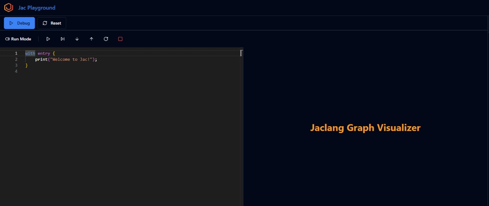

# Jac Playground Guide

Welcome to the Jac Playground! This interactive development environment lets you write, run, and debug Jac programs directly in your browser.

## Getting Started

The Jac Playground is designed to help you learn and experiment with the Jac programming language. When you first open the playground, you'll see a simple "Hello World" program:

```jac
with entry {
    print("Welcome to Jac!");
}
```

## How to Use

1. **Start with Examples**: Click on any example from the right sidebar to load it into the editor
2. **Modify and Experiment**: Edit the code to see how changes affect the output
3. **Run Your Code**: Press the "Run" button to execute your program
4. **Debug When Needed**: Enable Debug Mode for detailed execution analysis
5. **Reset When Stuck**: Use the Reset button to start with a clean slate

## Debug Mode

Debug Mode transforms the Jac Playground into a powerful development environment with advanced debugging capabilities. When enabled, the interface splits into two main sections: the code editor on the left and the **Jaclang Graph Visualizer** on the right.

### Jaclang Graph Visualizer



### Using Debug Mode Effectively

1. **Set breakpoints** by clicking on line numbers in the editor
2. **Start debugging** by clicking the Debug button instead of Run
3. **Navigate execution** using the arrow keys or debug controls
4. **Observe the graph** to understand how your nodes and edges are connected
5. **Step through slowly** to see how data flows through your spatial program structure

The Graph Visualizer makes Jac's spatial programming concepts tangible, allowing you to see exactly how your objects, walkers, and edges interact during program execution.

## Interface Overview

### Main Editor

The left side of the screen contains the code editor where you can write your Jac programs. The editor features:

- Syntax highlighting for Jac language
- Line numbers for easy reference
- Auto-indentation and bracket matching

### Control Panel

At the top of the editor, you'll find:

- **Run Button** ▶️ - Execute your Jac program
- **Reset Button**  - Clear the editor and start fresh
- **Debug Mode Toggle**  - Enable debugging features for step-by-step execution

### Debug Controls

When Debug Mode is active, you'll notice additional controls in the Run Mode toolbar:

- **Continue** ▶️ - Start or continue execution
- **Step Over** ⏭️ - Execute the next line of code
- **Step Into** ⬇️ - Move deeper into function calls
- **Step Out** ⬆️ - Move up from current execution context
- **Restart**  - Reset the debug session
- **Stop** ⏹️ - Terminate the current debug session

The Graph Visualizer is one of Jac's most powerful debugging features, providing a real-time visual representation of your program's execution flow. This unique tool shows:

### Output Panel

The bottom section displays the output of your program, including:

- Print statements and results
- Error messages and debugging information
- Program execution feedback

### Example Library

The right sidebar contains a collection of sample programs organized by category:

#### Basic Examples

- **For Loop** - Learn iteration with for loops
- **While Loop** - Understand conditional looping
- **Archetypes** - Explore Jac's type system
- **Code Block Statements** - Work with code organization
- **Assignments** - Variable declaration and manipulation
- **Conditional Statements** - If/else logic and branching

#### Object Spatial Programming

- **Reference** - Understanding object references and relationships

## Tips for New Users

- Start with the "Basic" examples to understand Jac syntax
- Use the print statement to output values and debug your code
- Experiment with modifying the example programs
- Don't be afraid to break things - that's how you learn!
- Use Debug Mode when your program doesn't behave as expected

## Example Categories Explained

### Basic Programming Concepts

These examples cover fundamental programming constructs that are essential for any Jac programmer.

### Object Spatial Programming

Jac's unique approach to spatial programming and object relationships. These advanced examples show how Jac handles complex data structures and spatial reasoning.

## Getting Help

If you encounter issues or want to learn more about specific Jac language features, refer to the official Jac documentation or community resources.

Happy coding with Jac!
