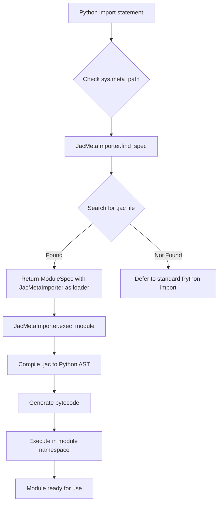
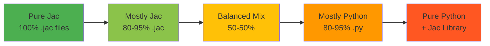

## **Jac's Native Superset of Python**

At its core, Jac is a natural evolution of Python—not a replacement, but an enhancement. For Python developers, Jac offers a familiar foundation with powerful new features for modern software architecture, all while integrating seamlessly with the existing Python ecosystem.

### **How it Works: Transpilation to Native Python**

Unlike languages that require their own runtime environments, virtual machines, or interpreters, Jac programs execute on the standard Python runtime. The Jac compiler **transpiles** your Jac code into pure, efficient Python code through a multi-stage compilation pipeline that generates optimized Python bytecode. This means:

*   **100% Python Runtime:** Your Jac programs execute on the standard Python runtime, giving you access to Python's mature garbage collector, memory management, and threading model.
*   **Full Ecosystem Access:** Every package on PyPI, every internal library, and every Python tool you already use works out-of-the-box with Jac.
*   **Readable Output:** The transpiled Python is clean, maintainable code that you can inspect, debug, and understand.

Essentially, Jac is to Python what TypeScript is to JavaScript: a powerful superset that compiles down to the language you know and love.

**Example: From Jac to Python**

A simple Jac module with functions, objects, and an entrypoint...

```jac
"""Functions in Jac."""

def factorial(n: int) -> int {
    if n == 0 { return 1; }
    else { return n * factorial(n-1); }
}

obj Person {
    has name: str;
    has age: int;

    def greet() -> None {
        print(f"Hello, my name is {self.name} and I'm {self.age} years old.");
    }
}

with entry {
    person = Person("John", 42);
    person.greet();
    print(f"5! = {factorial(5)}");
}
```

...is transpiled into clean, readable Python code:

```python
"""Functions in Jac."""
from __future__ import annotations
from jaclang.runtimelib.builtin import *
from jaclang import JacMachineInterface as jl

def factorial(n: int) -> int:
    if n == 0:
        return 1
    else:
        return n * factorial(n - 1)

class Person(jl.Obj):
    name: str
    age: int

    def __init__(self, name: str, age: int) -> None:
        self.name = name
        self.age = age

    def greet(self) -> None:
        print(f"Hello, my name is {self.name} and I'm {self.age} years old.")

if __name__ == "__main__":
    person = Person("John", 42)
    person.greet()
    print(f"5! = {factorial(5)}")
```

Notice how Jac's object-oriented features compile to standard Python classes inheriting from `jl.Obj` (Jac's base object archetype), and the `with entry` block becomes Python's `if __name__ == "__main__"` pattern.

---

### **Seamless Interoperability: The PEP 302 Import Hook**

Jac achieves seamless interoperability with Python through a sophisticated import hook based on [PEP 302](https://peps.python.org/pep-0302/) (New Import Hooks). When you `import jaclang`, it registers a custom `MetaPathFinder` and `Loader` in Python's `sys.meta_path`, enabling Python to discover and compile `.jac` files transparently.

**How the Import Hook Works:**



The `JacMetaImporter` class implements both `MetaPathFinder` and `Loader` interfaces:

1. **Finding Modules:** When Python encounters an import, `find_spec()` searches for `.jac` files in the import path, supporting both single files (`module.jac`) and packages (`module/__init__.jac`).

2. **Loading Modules:** When a `.jac` file is found, `exec_module()` invokes the Jac compiler to transpile the code and execute it within the module's namespace.

3. **Bidirectional Imports:** The hook allows both `.jac` files to import Python modules and Python files to import `.jac` modules seamlessly.

This implementation ensures that mixing Jac and Python requires zero configuration beyond the initial `import jaclang` statement.

---

### **Five Adoption Patterns: Choose Your Integration Level**

Jac offers flexible adoption strategies to fit your team's needs, from pure Python with Jac enhancements to pure Jac applications. Here are the five primary patterns:

#### **Pattern Comparison Table**

| Pattern | Use Case | Jac Content | Python Content | Key Benefits | Example Scenario |
|---------|----------|-------------|----------------|--------------|------------------|
| **1. Pure Jac** | New projects, microservices | 100% | 0% | Full Jac language features, modern syntax | Building a new graph-based application from scratch |
| **2. Mostly Jac** | Jac-first with legacy Python | 80-95% | 5-20% | Jac architecture with existing Python libraries | New service that uses pandas, numpy, or other Python packages |
| **3. Balanced Mix** | Gradual migration, hybrid teams | 50-50% | 50-50% | Best of both worlds, incremental adoption | Migrating existing Python codebase to Jac module by module |
| **4. Mostly Python** | Python-first with Jac features | 5-20% | 80-95% | Python codebase with Jac for specific features | Python app using Jac's `by llm` for AI features |
| **5. Pure Python + Jac Library** | Conservative adoption | 0% | 100% | No new syntax, just Jac runtime capabilities | Existing Python project using decorators for graph features |



---

### **Pattern Details and Examples**

#### **Pattern 1: Pure Jac - All Jac for Your Python**

Write 100% Jac code for new projects. The compiler handles everything, generating optimized Python bytecode.

**When to use:** New projects, microservices, greenfield development

```jac
"""Pure Jac application - graph-based task manager."""

node Task {
    has title: str;
    has completed: bool = False;
}

edge DependsOn {
    has priority: int = 1;
}

walker CompleteTask {
    has task_name: str;

    can mark_complete with Task entry {
        if here.title == self.task_name {
            here.completed = True;
            print(f"Completed: {here.title}");
        }
        visit [-->];
    }
}

with entry {
    root ++> Task(title="Design");
    root ++> Task(title="Implement");
    CompleteTask(task_name="Design") spawn root;
}
```

**Transpiles to:**

```python
from __future__ import annotations
from jaclang.runtimelib.builtin import *
from jaclang import JacMachineInterface as jl

class Task(jl.Node):
    title: str
    completed: bool = False

class DependsOn(jl.Edge):
    priority: int = 1

class CompleteTask(jl.Walker):
    task_name: str

    @jl.entry
    def mark_complete(self, here: Task) -> None:
        if here.title == self.task_name:
            here.completed = True
            print(f"Completed: {here.title}")
        jl.visit(self, jl.refs(jl.Path(here)._out().visit()))

if __name__ == "__main__":
    jl.connect(left=jl.root(), right=Task(title="Design"))
    jl.connect(left=jl.root(), right=Task(title="Implement"))
    jl.spawn(CompleteTask(task_name="Design"), jl.root())
```

---

#### **Pattern 2: Mostly Jac, Import Legacy Python Modules**

Use Jac for your application logic while importing existing Python libraries seamlessly.

**When to use:** New Jac projects that need pandas, numpy, Django, FastAPI, or other Python packages

```jac
"""Data analysis with Jac + Python libraries."""

import pandas as pd;
import numpy as np;

node DataPoint {
    has value: float;
    has category: str;
}

walker Analyzer {
    has data: list = [];

    can collect with DataPoint entry {
        self.data.append(here.value);
        visit [-->];
    }

    can analyze with DataPoint exit {
        # Use Python libraries directly
        df = pd.DataFrame({'values': self.data});
        mean = np.mean(self.data);
        print(f"Mean: {mean}, Std: {df['values'].std()}");
    }
}
```

**Transpiles to:**

```python
from __future__ import annotations
from jaclang.runtimelib.builtin import *
from jaclang import JacMachineInterface as jl
import pandas as pd
import numpy as np

class DataPoint(jl.Node):
    value: float
    category: str

class Analyzer(jl.Walker):
    data: list = jl.field(factory=lambda: [])

    @jl.entry
    def collect(self, here: DataPoint) -> None:
        self.data.append(here.value)
        jl.visit(self, jl.refs(jl.Path(here)._out().visit()))

    @jl.exit
    def analyze(self, here: DataPoint) -> None:
        df = pd.DataFrame({'values': self.data})
        mean = np.mean(self.data)
        print(f"Mean: {mean}, Std: {df['values'].std()}")
```

---

#### **Pattern 3: Mix Jac and Python Code**

Import Jac modules into Python files or vice versa. Perfect for gradual migration or team collaboration.

**When to use:** Migrating existing Python codebases, teams with mixed expertise

**Jac module (graph_utils.jac):**

```jac
"""Reusable graph utilities."""

node Person {
    has name: str;
}

walker FindPerson {
    has target: str;
    has result: Person | None = None;

    can search with Person entry {
        if here.name == self.target {
            self.result = here;
            disengage;
        }
        visit [-->];
    }
}
```

**Python application (main.py):**

```python
# Enable Jac imports
import jaclang

# Import Jac modules like Python modules
from graph_utils import Person, FindPerson
from jaclang import JacMachineInterface as jl

def create_social_graph():
    """Build graph using Jac nodes in Python."""
    alice = Person(name="Alice")
    bob = Person(name="Bob")

    jl.connect(left=jl.root(), right=alice)
    jl.connect(left=alice, right=bob)

    # Use Jac walkers from Python
    finder = FindPerson(target="Bob")
    jl.spawn(finder, jl.root())

    if finder.result:
        print(f"Found: {finder.result.name}")

if __name__ == "__main__":
    create_social_graph()
```

---

#### **Pattern 4: Mostly Python, Jac for Just Some Features (e.g., by llm)**

Use Jac's unique features like `by llm` in an otherwise Python codebase.

**When to use:** Existing Python applications that want AI/LLM integration or data-spatial features

```python
"""Python application with Jac's by llm feature."""
from __future__ import annotations
from jaclang.runtimelib.builtin import *
from jaclang import JacMachineInterface as jl
import byllm
from byllm import Model

# Configure LLM
llm = Model(model_name='gpt-4', temperature=0.7)

@jl.sem("""
Generate a creative product description for the given product name.
Include key features and benefits in 2-3 sentences.
""", {})
def generate_description(product_name: str) -> str:
    """AI-powered product description generator."""
    return jl.call_llm(
        model=llm(),
        mtir=byllm.MTIR.factory(
            caller=generate_description,
            args={'product_name': product_name},
            call_params=llm().call_params
        )
    )

# Regular Python code
class Product:
    def __init__(self, name: str, price: float):
        self.name = name
        self.price = price
        self.description = generate_description(name)

    def display(self):
        print(f"{self.name} (${self.price})")
        print(f"Description: {self.description}")

if __name__ == "__main__":
    product = Product("Smart Watch Pro", 299.99)
    product.display()
```

---

#### **Pattern 5: Pure Python and Jac as a Library (Decorators, Functions, Base Classes)**

Use Jac's runtime capabilities without writing any `.jac` files. Import base classes and decorators to build graph-based applications in pure Python.

**When to use:** Teams uncomfortable with new syntax, existing Python projects, conservative adoption

```python
"""Pure Python using Jac runtime as a library."""
from jaclang import JacMachineInterface as jl
from jaclang.runtimelib.archetype import NodeArchetype, EdgeArchetype, WalkerArchetype

# Define nodes by inheriting from Jac base classes
class Employee(NodeArchetype):
    name: str
    role: str

    def __init__(self, name: str, role: str):
        super().__init__()
        self.name = name
        self.role = role

class ReportsTo(EdgeArchetype):
    since: int

    def __init__(self, since: int = 2024):
        super().__init__()
        self.since = since

# Define walkers with entry decorators
class OrgChartWalker(WalkerArchetype):
    def __init__(self):
        super().__init__()
        self.depth = 0

    @jl.entry
    def enter_employee(self, here: Employee) -> None:
        indent = "  " * self.depth
        print(f"{indent}{here.name} ({here.role})")
        self.depth += 1
        jl.visit(self, jl.refs(jl.Path(here)._out().visit()))
        self.depth -= 1

# Build and traverse graph using Jac functions
if __name__ == "__main__":
    # Create organizational hierarchy
    ceo = Employee(name="Alice", role="CEO")
    cto = Employee(name="Bob", role="CTO")
    dev = Employee(name="Charlie", role="Developer")

    # Connect nodes
    jl.connect(left=jl.root(), right=ceo)
    jl.connect(left=ceo, right=cto, edge=ReportsTo(since=2020))
    jl.connect(left=cto, right=dev, edge=ReportsTo(since=2022))

    # Spawn walker
    walker = OrgChartWalker()
    jl.spawn(walker, jl.root())
```

**Output:**
```
Alice (CEO)
  Bob (CTO)
    Charlie (Developer)
```

This pattern provides access to Jac's powerful data-spatial programming model using familiar Python syntax and patterns.

---

### **Advanced Integration: The Escape Hatch**

For situations where you need Python-specific syntax or want to gradually migrate a file, you can embed raw Python code directly inside a `.jac` module using the `::py::` directive.

```jac
"""Mixing Jac and raw Python in one file."""

node Task {
    has title: str;
}

with entry {
    task = Task(title="Learn Jac");
    print(f"Created task: {task.title}");
}

::py::
# This is raw Python code embedded in Jac
def legacy_function():
    """Existing Python code that's hard to migrate."""
    import sys
    print(f"Python version: {sys.version}")
    return {"status": "ok"}

result = legacy_function()
print(result)
::py::
```

---

### **Key Takeaways**

Jac's relationship with Python isn't about choosing one over the other—it's about providing a powerful "and". You get:

- **Incremental Adoption:** Start with Pattern 5 (pure Python + Jac library) and gradually move toward Pattern 1 (pure Jac) at your own pace
- **Full Ecosystem Access:** Continue using your favorite Python libraries, frameworks, and tools without compatibility issues
- **Flexible Integration:** Choose from five adoption patterns based on your team's comfort level and project requirements
- **Zero Lock-in:** Transpiled Python code is readable and maintainable, giving you an exit strategy if needed
- **Seamless Imports:** PEP 302 import hooks enable transparent `.jac` and `.py` interoperability

| Adoption Pattern | Learning Curve | Migration Effort | Feature Access | Risk Level |
|------------------|---------------|------------------|----------------|------------|
| Pattern 1: Pure Jac | High | High | 100% Jac features | Low |
| Pattern 2: Mostly Jac | Medium-High | Medium-High | 95% Jac features | Low |
| Pattern 3: Balanced Mix | Medium | Medium | Full bidirectional | Medium |
| Pattern 4: Mostly Python | Low-Medium | Low | Select Jac features | Low |
| Pattern 5: Pure Python + Library | Low | Very Low | Core runtime only | Very Low |

Whether you're building a new application from scratch or enhancing an existing Python codebase, Jac provides the tools and flexibility to write more structured, maintainable, and scalable code—without abandoning the Python ecosystem you know and trust.
