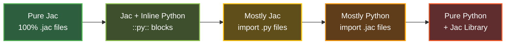

## **Jac's Native Superset of Python**

At its core, Jac is a natural evolution of Python—not a replacement, but an enhancement. For Python developers, Jac offers a familiar foundation with powerful new features for modern software architecture, all while integrating seamlessly with the existing Python ecosystem.

### **How it Works: Transpilation to Native Python**

Unlike languages that require their own runtime environments, virtual machines, or interpreters, Jac programs execute on the standard Python runtime. The Jac compiler **transpiles** your Jac code into pure, efficient Python code through a multi-stage compilation pipeline that generates optimized Python bytecode. This means:

*   **100% Python Runtime:** Your Jac programs execute on the standard Python runtime, giving you access to Python's mature garbage collector, memory management, and threading model.
*   **Full Ecosystem Access:** Every package on PyPI, every internal library, and every Python tool you already use works out-of-the-box with Jac.
*   **Readable Output:** The transpiled Python is clean, maintainable code that you can inspect, debug, and understand.

Essentially, Jac is to Python what TypeScript is to JavaScript: a powerful superset that compiles down to the language you know and love.

**Example: From Jac to Python**

A simple Jac module with functions, objects, and an entrypoint...

```jac
"""Functions in Jac."""

def factorial(n: int) -> int {
    if n == 0 { return 1; }
    else { return n * factorial(n-1); }
}

obj Person {
    has name: str;
    has age: int;

    def greet() -> None {
        print(f"Hello, my name is {self.name} and I'm {self.age} years old.");
    }
}

with entry {
    person = Person("John", 42);
    person.greet();
    print(f"5! = {factorial(5)}");
}
```

...is transpiled into clean, readable Python code:

```python
"""Functions in Jac."""
from __future__ import annotations
from jaclang.lib import Obj

def factorial(n: int) -> int:
    if n == 0:
        return 1
    else:
        return n * factorial(n - 1)

class Person(Obj):
    name: str
    age: int

    def greet(self) -> None:
        print(f"Hello, my name is {self.name} and I'm {self.age} years old.")

person = Person('John', 42)
person.greet()
print(f'5! = {factorial(5)}')
```

Notice how Jac's object-oriented features compile to standard Python classes inheriting from `Obj` (Jac's base object archetype), with clean imports from `jaclang.lib`.

---

### **Seamless Interoperability: Import Jac Files Like Python Modules**

One of Jac's most powerful features is how effortlessly it integrates with Python. Once you add a single line—`import jaclang`—to your Python code, you can import `.jac` files exactly as you would any Python module. No build steps, no compilation commands, no configuration files.

**What This Means for You:**

*   **Mix and Match Files Freely:** Write some modules in `.jac` and others in `.py`, then import them interchangeably. Your Python files can import Jac modules, and your Jac files can import Python modules—it just works.

*   **Zero Friction Adoption:** Add Jac to your existing Python project without restructuring your codebase. Keep your Python files as-is, and gradually introduce Jac modules where they add value.

*   **Natural Developer Experience:** Use the same `import` statements you already know. No special syntax, no extra tools—just natural Python imports that happen to work with `.jac` files too.

**Example: Importing Across Languages**

Say you have a Jac module with graph utilities:

```jac
# graph_tools.jac
node Task {
    has name: str;
    has priority: int;
}
```

Import it in Python just like any other module:

```python
# main.py
import jaclang  # Enable Jac imports (one-time setup)
from graph_tools import Task  # Import from .jac file

# Use Jac classes in Python naturally
my_task = Task(name="Deploy", priority=1)
```

It works in reverse too—your Jac files can import Python libraries:

```jac
# analyzer.jac
import pandas as pd;
import numpy as np;

# Use Python libraries directly in Jac code
```

**How It Works:** Jac leverages Python's [PEP 302](https://peps.python.org/pep-0302/) import hook system to extend Python's native import mechanism. When you `import jaclang`, it registers a custom importer that teaches Python how to find and load `.jac` files. From that point forward, whenever Python encounters an import statement, it automatically checks for `.jac` files alongside `.py` files, compiles them transparently, and loads them into your program—all behind the scenes. This means Jac modules become first-class citizens in your Python environment, indistinguishable from native Python modules.

---

### **Five Adoption Patterns: Choose Your Integration Level**

Jac offers flexible adoption strategies to fit your team's needs, from pure Python with Jac enhancements to pure Jac applications. Here are the five primary patterns:

#### **Pattern Comparison Table**

| Pattern | Use Case | Jac Content | Python Content | Key Benefits | Example Scenario |
|---------|----------|-------------|----------------|--------------|------------------|
| **1. Pure Jac** | New projects, microservices | 100% | 0% | Full Jac language features, modern syntax | Building a new graph-based application with only `.jac` files |
| **2. Jac + Inline Python** | Inline Python in Jac files | Mixed (::py:: blocks) | Embedded inline | Gradual migration, use Python syntax when needed | `.jac` files with embedded Python for legacy logic or complex imports |
| **3. Mostly Jac** | Import Python modules into Jac | 80-95% .jac | 5-20% .py | Jac architecture with existing Python utilities | Project with `.jac` files importing your existing `.py` utility modules |
| **4. Mostly Python** | Import Jac modules into Python | 5-20% .jac | 80-95% .py | Python codebase with select Jac features | Python project with `.py` files importing specialized `.jac` modules for graphs/AI |
| **5. Pure Python + Jac Library** | Conservative adoption | 0% | 100% | No new syntax, just Jac runtime capabilities | Pure `.py` project using Jac runtime via imports and decorators |



---

### **Pattern Details and Examples**

**Example Project:** A simple task manager that stores tasks and generates AI-powered task descriptions.

**Core Features:**
- Task storage with graph-based relationships
- Task validation (title length check)
- AI-generated task descriptions

Let's see how to build this across all 5 patterns.

---

#### **Pattern 1: Pure Jac**

Everything in `.jac` files—no Python files needed.

**When to use:** New projects where you want full Jac features

**Directory Structure:**
```
project/
├── main.jac
├── models.jac
└── utils.jac
```

=== "main.jac"
    ```jac
    """Main application."""
    import models, utils;

    walker TaskCreator {
        has title: str;

        can create with `root entry {
            if utils.validate_title(self.title) {
                task = models.Task(title=self.title);
                here ++> task;
                desc = utils.generate_desc(self.title);
                print(f"✓ Created: {task.title}");
                print(f"  AI: {desc}");
            } else {
                print("✗ Title too short!");
            }
        }
    }

    with entry {
        root spawn TaskCreator(title="Build API");
    }
    ```

=== "models.jac"
    ```jac
    """Task node definition."""

    node Task {
        has title: str;
        has done: bool = False;
    }
    ```

=== "utils.jac"
    ```jac
    """Validation and AI utilities."""

    def validate_title(title: str) -> bool {
        return len(title) > 3;
    }

    def generate_desc(title: str) -> str {
        return f"Task description for: {title}";
    }
    ```

---

#### **Pattern 2: Jac + Inline Python**

Embed Python code directly in `.jac` files using `::py::` blocks—useful for migration or when you need Python-specific libraries.

**When to use:** Migrating Python code incrementally, keeping legacy utilities as-is

**Directory Structure:**
```
project/
├── main.jac
└── models.jac
```

=== "main.jac"
    ```jac
    """Application with inline Python validation."""
    import models;

    def generate_desc(title: str) -> str {
        return f"Task description for: {title}";
    }

    ::py::
    # Legacy Python validation - kept as-is
    def validate_title(title):
        """Complex validation logic from old codebase."""
        return len(title) > 3 and title.strip() != ""

    def get_sample_task():
        """Helper from legacy code."""
        return {"title": "Build API"}
    ::py::

    walker TaskCreator {
        can create with `root entry {
            # Use inline Python functions
            task_data = get_sample_task();

            if validate_title(task_data["title"]) {
                task = models.Task(title=task_data["title"]);
                here ++> task;
                desc = generate_desc(task.title);
                print(f"✓ Created: {task.title}");
                print(f"  AI: {desc}");
            } else {
                print("✗ Title invalid!");
            }
        }
    }

    with entry {
        root spawn TaskCreator();
    }
    ```

=== "models.jac"
    ```jac
    """Task node definition."""

    node Task {
        has title: str;
        has done: bool = False;
    }
    ```

Keep tested Python code while adding Jac features—best for incremental migration.

---

#### **Pattern 3: Mostly Jac**

Write your app in Jac, import Python utilities from separate `.py` files.

**When to use:** Jac-first development with existing Python utilities or shared modules

**Directory Structure:**
```
project/
├── main.jac
├── models.jac
└── validators.py
```

=== "main.jac"
    ```jac
    """Main application - imports Python module."""
    import models;
    import validators;

    def generate_desc(title: str) -> str {
        return f"Task description for: {title}";
    }

    walker TaskCreator {
        has title: str;

        can create with `root entry {
            # Call Python module functions
            if validators.validate_title(self.title) {
                task = models.Task(title=self.title);
                here ++> task;
                desc = generate_desc(task.title);
                print(f"✓ Created: {task.title}");
                print(f"  AI: {desc}");
            } else {
                print("✗ Title too short!");
            }
        }
    }

    with entry {
        root spawn TaskCreator(title="Build API");
    }
    ```

=== "models.jac"
    ```jac
    """Task node definition."""

    node Task {
        has title: str;
        has done: bool = False;
    }
    ```

=== "validators.py"
    ```python
    """Python validation utilities - shared with other projects."""

    def validate_title(title: str) -> bool:
        """Validator used across multiple projects."""
        return len(title) > 3

    def get_sample_title():
        """Helper to load sample data."""
        return "Build API"
    ```

Jac seamlessly imports Python modules—no configuration needed.

---

#### **Pattern 4: Mostly Python**

Python-first application that imports `.jac` modules for graph and AI features.

**When to use:** Existing Python projects adding Jac's graph/AI capabilities

**Directory Structure:**
```
project/
├── main.py
├── validators.py
└── task_graph.jac
```

=== "main.py"
    ```python
    """Python application importing Jac modules."""
    import jaclang  # Enable Jac imports

    from validators import validate_title
    from task_graph import Task, TaskCreator, generate_desc
    from jaclang.lib import spawn, root

    def create_task(title: str):
        """Python function using Jac features."""
        if not validate_title(title):
            print("✗ Title too short!")
            return

        # Use Jac walker
        creator = TaskCreator(title=title)
        spawn(creator, root())

        # Use Jac's AI
        desc = generate_desc(title)
        print(f"  AI: {desc}")

    if __name__ == "__main__":
        create_task("Build API")
    ```

=== "validators.py"
    ```python
    """Python validation utilities."""

    def validate_title(title: str) -> bool:
        """Title validator."""
        return len(title) > 3
    ```

=== "task_graph.jac"
    ```jac
    """Jac module with graph and AI features."""

    node Task {
        has title: str;
        has done: bool = False;
    }

    walker TaskCreator {
        has title: str;

        can create with `root entry {
            task = Task(title=self.title);
            here ++> task;
            print(f"✓ Created: {task.title}");
        }
    }

    def generate_desc(title: str) -> str {
        return f"Task description for: {title}";
    }
    ```

Python stays familiar, but you get Jac's graph and AI features where needed.

---

#### **Pattern 5: Pure Python + Jac Library**

Pure Python using Jac's runtime as a library—no `.jac` files.

**When to use:** Conservative adoption, teams preferring Python syntax, existing projects

**Directory Structure:**
```
project/
├── main.py
└── validators.py
```

=== "main.py"
    ```python
    """Pure Python using Jac runtime."""
    from jaclang.lib import Node, Walker, on_entry, connect, spawn, root
    from validators import validate_title

    # Define Task node using Jac base class
    class Task(Node):
        title: str
        done: bool

        def __init__(self, title: str):
            super().__init__()
            self.title = title
            self.done = False

    # Define walker using Jac decorators
    class TaskCreator(Walker):
        def __init__(self, title: str):
            super().__init__()
            self.title = title

        @on_entry
        def create(self, here) -> None:
            """Entry point - creates task."""
            if validate_title(self.title):
                task = Task(title=self.title)
                connect(here, task)
                print(f"✓ Created: {task.title}")
                # Note: AI features require .jac syntax
            else:
                print("✗ Title too short!")

    if __name__ == "__main__":
        creator = TaskCreator(title="Build API")
        spawn(creator, root())
    ```

=== "validators.py"
    ```python
    """Python validation utilities."""

    def validate_title(title: str) -> bool:
        """Title validator."""
        return len(title) > 3
    ```

Pure Python with graph capabilities—no new syntax, but you get Jac's object-spatial model.

---

### **Key Takeaways**

Jac's relationship with Python isn't about choosing one over the other—it's about providing a powerful "and". You get:

- **Incremental Adoption:** Start with Pattern 5 (pure Python + Jac library) and gradually move toward Pattern 1 (pure Jac) at your own pace
- **Full Ecosystem Access:** Continue using your favorite Python libraries, frameworks, and tools without compatibility issues
- **Flexible Integration:** Choose from five adoption patterns based on your team's comfort level and project requirements
- **Zero Lock-in:** Transpiled Python code is readable and maintainable, giving you an exit strategy if needed
- **Seamless Imports:** PEP 302 import hooks enable transparent `.jac` and `.py` interoperability

| Adoption Pattern | Learning Curve | Migration Effort | Feature Access | Risk Level |
|------------------|---------------|------------------|----------------|------------|
| Pattern 1: Pure Jac | Higher | Higher | 100% Jac features | Low |
| Pattern 2: Jac + Inline Python | Medium | Low | 100% Jac features | Low |
| Pattern 3: Mostly Jac | Medium-High | Medium | 100% Jac features | Low |
| Pattern 4: Mostly Python | Low-Medium | Low | Select Jac features | Low |
| Pattern 5: Pure Python + Library | Low | Very Low | Core runtime only | Very Low |

Whether you're building a new application from scratch or enhancing an existing Python codebase, Jac provides the tools and flexibility to write more structured, maintainable, and scalable code—without abandoning the Python ecosystem you know and trust.
