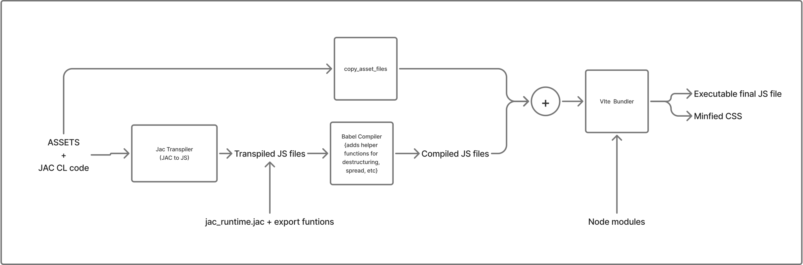

# Jac Client Architecture Overview

## Vite-Enhanced Client Bundle System

The `jac-client` package uses a **Vite-based bundling system** to transform Jac code into optimized JavaScript bundles for web front-ends.

### Core Components

#### `ViteClientBundleBuilder`
Extends the base `ClientBundleBuilder` to provide Vite integration. Key responsibilities:

1. **Compilation Pipeline**
   - Compiles `.jac` files to JavaScript
   - Copies local `.js` files to temp directory
   - Preserves bare module specifiers (e.g., `"antd"`, `"react"`) for Vite to resolve

2. **Dependency Processing** (`_compile_dependencies_recursively`)
   - Recursively traverses import graphs
   - Processes both `.jac` and `.js` imports
   - Accumulates exports and globals across all modules
   - Writes compiled artifacts to `src/` directory

3. **Import Handling** (`_process_imports`)
   - **`.jac` imports**: Compiled and inlined
   - **`.js` imports**: Copied and inlined
   - **Bare specifiers**: Left as ES imports for Vite to bundle

4. **Bundle Generation** (`_bundle_with_vite`)
   - Creates React entry point (`main.js`) with:
     ```javascript
     import React from "react";
     import { createRoot } from "react-dom/client";
     import { app as App } from "./app.js";
     ```
   - Runs `npm run compile` then copies assets (`_copy_asset_files`)
   - Runs `npm run build` to bundle with Vite
   - Generates hashed bundle file (`client.[hash].js`)
   - Vite extracts CSS to `dist/main.css`
   - Returns bundle code and SHA256 hash

### Build Flow




```
1. Module compilation
   ├── Compile root .jac file → JS
   ├── Extract exports & globals from manifest
   └── Generate client_runtime.js from client_runtime.jac

2. Recursive dependency resolution
   ├── Traverse all .jac/.js imports
   ├── Compile/copy each to src/ directory
   ├── Accumulate exports & globals
   └── Skip bare specifiers (handled by Vite)

3. Babel compilation
   ├── Run npm run compile
   ├── Transpile JavaScript from src/ to build/
   └── Preserves CSS import statements

4. Asset copying
   ├── Copy CSS and other assets from src/ to build/
   └── Ensures Vite can resolve CSS imports during bundling

5. Vite bundling
   ├── Write entry point (main.js)
   ├── Run npm run build
   ├── Process CSS imports and extract to dist/main.css
   ├── Locate generated bundle in dist/
   └── Return code + hash

6. Cleanup
   └── Remove src/ directory
```

### CSS Serving

CSS files are handled through a multi-stage process that ensures styles are properly bundled and served:

#### 1. CSS Import in Jac Code
CSS files are imported in Jac code using the `cl import` syntax:
```jac
cl import ".styles.css";
```

This gets compiled to JavaScript:
```javascript
import "./styles.css";
```

#### 2. Asset Copying (`_copy_asset_files`)
After Babel compilation, CSS and other asset files are copied from `src/` to `build/`:
- **Why**: Babel only transpiles JavaScript, so CSS files need manual copying
- **When**: After `npm run compile`, before `npm run build`
- **What**: Copies `.css`, `.scss`, `.sass`, `.less`, and image files
- **Location**: `src/styles.css` → `build/styles.css`

#### 3. Vite CSS Processing
Vite processes CSS imports during bundling:
- Extracts CSS from JavaScript imports
- Bundles and minifies CSS
- Outputs to `dist/main.css` (default filename)
- Preserves CSS import statements in the bundle

#### 4. HTML Template Generation
The `JacClientModuleIntrospector.render_page()` method:
- Detects CSS files in the `dist/` directory
- Generates a hash from the CSS file content for cache busting
- Includes a `<link>` tag in the HTML `<head>`:
  ```html
  <link rel="stylesheet" href="/static/main.css?hash=abc123..."/>
  ```

#### 5. Server-Side CSS Serving
The `JacAPIServer` handles CSS file requests:
- **Route**: `/static/*.css` (e.g., `/static/main.css`)
- **Handler**: Reads CSS file from `dist/` directory
- **Response**: Serves with `text/css` content type
- **Location**: `{base_path}/dist/{filename}.css`

**Implementation** (`server.py`):
```python
# CSS files from dist directory
if path.startswith("/static/") and path.endswith(".css"):
    css_file = base_path / "dist" / Path(path).name
    if css_file.exists():
        css_content = css_file.read_text(encoding="utf-8")
        ResponseBuilder.send_css(self, css_content)
```

#### CSS File Flow
```
app.jac (cl import ".styles.css")
  ↓
src/app.js (import "./styles.css")
  ↓
Babel: src/app.js → build/app.js (preserves import)
  ↓
_copy_asset_files: src/styles.css → build/styles.css
  ↓
Vite: Processes CSS import, extracts to dist/main.css
  ↓
HTML: <link href="/static/main.css?hash=..."/>
  ↓
Server: Serves from dist/main.css
```

### Key Design Decisions

- **No inlining of external packages**: Bare imports like `"antd"` remain as imports for Vite's tree-shaking and code-splitting
- **Export collection**: All client exports are aggregated across the dependency tree
- **React-based**: Entry point uses React 18's `createRoot` API
- **Hash-based caching**: Bundle hash enables browser cache invalidation
- **Temp directory isolation**: Builds in `vite_package_json.parent/src/` to avoid conflicts
- **CSS asset handling**: CSS files are copied after Babel compilation to ensure Vite can resolve imports, then extracted to separate files for optimal loading

### Vite Configuration

The system requires a `vite.config.js` with specific settings:

```javascript
resolve: {
  alias: {
    "@jac-client/utils": path.resolve(__dirname, "src/client_runtime.js"),
  },
}
```

This alias is critical because:
- Compiled Jac code imports runtime utilities via `import {__jacJsx} from "@jac-client/utils"`
- Vite resolves this to the generated `src/client_runtime.js` file
- Enables clean imports without hardcoded relative paths

### Configuration Parameters

- `vite_package_json`: Path to package.json (must exist)
- `runtime_path`: Path to client runtime file
- `vite_output_dir`: Build output (defaults to `src/dist/assets`)
- `vite_minify`: Enable/disable minification

