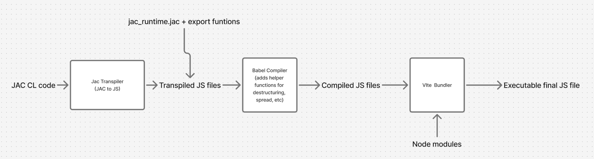

# Jac Client Architecture Overview

## Vite-Enhanced Client Bundle System

The `jac-client` package uses a **Vite-based bundling system** to transform Jac code into optimized JavaScript bundles for web front-ends.

### Core Components

#### `ViteClientBundleBuilder`
Extends the base `ClientBundleBuilder` to provide Vite integration. Key responsibilities:

1. **Compilation Pipeline**
   - Compiles `.jac` files to JavaScript
   - Copies local `.js` files to temp directory
   - Preserves bare module specifiers (e.g., `"antd"`, `"react"`) for Vite to resolve

2. **Dependency Processing** (`_compile_dependencies_recursively`)
   - Recursively traverses import graphs
   - Processes both `.jac` and `.js` imports
   - Accumulates exports and globals across all modules
   - Writes compiled artifacts to `src/` directory

3. **Import Handling** (`_process_imports`)
   - **`.jac` imports**: Compiled and inlined
   - **`.js` imports**: Copied and inlined
   - **Bare specifiers**: Left as ES imports for Vite to bundle

4. **Bundle Generation** (`_bundle_with_vite`)
   - Creates React entry point (`main.js`) with:
     ```javascript
     import React from "react";
     import { createRoot } from "react-dom/client";
     import { app as App } from "./app.js";
     ```
   - Runs `npm run compile` then `npm run build`
   - Generates hashed bundle file (`client.[hash].js`)
   - Returns bundle code and SHA256 hash

### Build Flow




```
1. Module compilation
   ├── Compile root .jac file → JS
   ├── Extract exports & globals from manifest
   └── Generate client_runtime.js from client_runtime.jac

2. Recursive dependency resolution
   ├── Traverse all .jac/.js imports
   ├── Compile/copy each to src/ directory
   ├── Accumulate exports & globals
   └── Skip bare specifiers (handled by Vite)

3. Vite bundling
   ├── Write entry point (main.js)
   ├── Run npm compile & build
   ├── Locate generated bundle in dist/assets/
   └── Return code + hash

4. Cleanup
   └── Remove src/ directory
```

### Key Design Decisions

- **No inlining of external packages**: Bare imports like `"antd"` remain as imports for Vite's tree-shaking and code-splitting
- **Export collection**: All client exports are aggregated across the dependency tree
- **React-based**: Entry point uses React 18's `createRoot` API
- **Hash-based caching**: Bundle hash enables browser cache invalidation
- **Temp directory isolation**: Builds in `vite_package_json.parent/src/` to avoid conflicts

### Vite Configuration

The system requires a `vite.config.js` with specific settings:

```javascript
resolve: {
  alias: {
    "@jac-client/utils": path.resolve(__dirname, "src/client_runtime.js"),
  },
}
```

This alias is critical because:
- Compiled Jac code imports runtime utilities via `import {__jacJsx} from "@jac-client/utils"`
- Vite resolves this to the generated `src/client_runtime.js` file
- Enables clean imports without hardcoded relative paths

### Configuration Parameters

- `vite_package_json`: Path to package.json (must exist)
- `runtime_path`: Path to client runtime file
- `vite_output_dir`: Build output (defaults to `src/dist/assets`)
- `vite_minify`: Enable/disable minification

