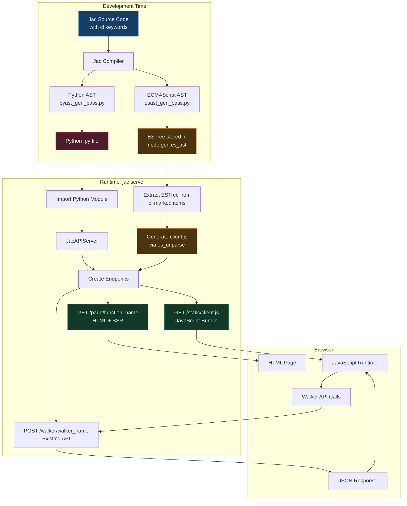
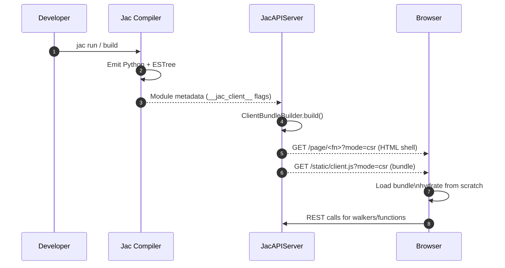
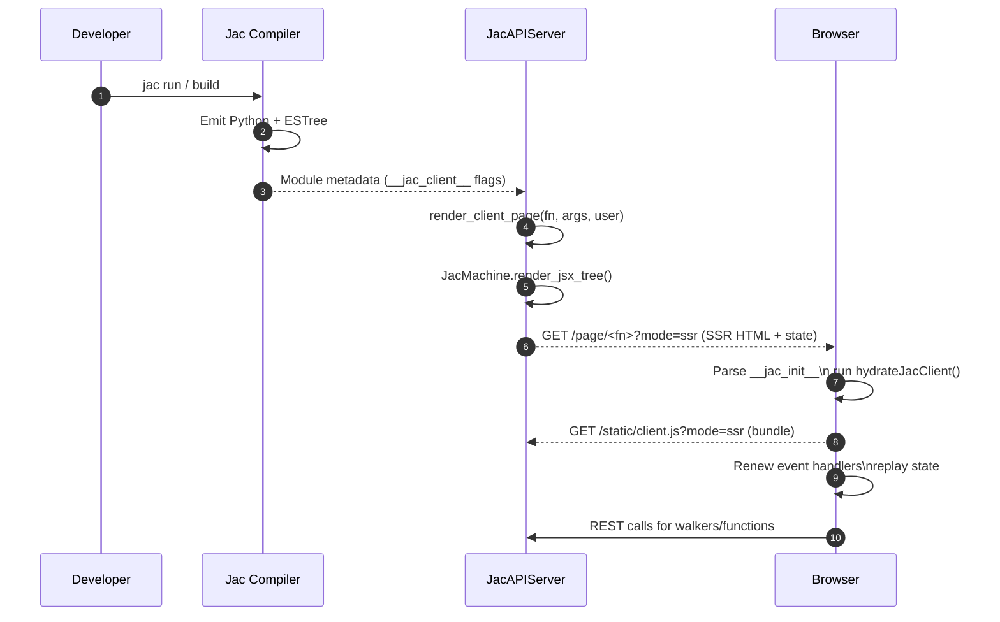

# JSX-Based Webpage Generation Design Document

## Overview

This document describes the design and implementation plan for enabling Jac's `cl` (client) keyword to generate full-stack web applications. Functions and objects marked with `cl` will be compiled to JavaScript (client-side), enabling seamless integration between Jac backend services and browser-based UIs. With this approach jac serve will be able to create both json and webpage endpoint, converting walkers and functions without `cl` into rest endpoint (already supported), and functions with `cl` into html+js end points.

## Architecture Overview



### Rendering Models

#### Client-Side Rendering (CSR)



#### Server-Side Rendering + Hydration (SSR + CSR)



## Language Features

### 1. The `cl` (Client) Keyword

The `cl` keyword marks Jac code items for client side compilation - this way a single jac file would include normal server-side (Python) code and client-side (JavaScript) code that will go through the esast_gen_pass to produce javascript.

#### Supported Constructs

```jac
// Mark a function for client-side execution
cl def homepage() -> JsxElement {
    return <div>
        <h1>Welcome</h1>
        <button onclick={spawn load_feed()}>Load Feed</button>
    </div>;
}

// Mark an object for shared client/server usage
cl obj TweetInfo {
    has username: str;
    has content: str;
    has likes: int;
}

// Mark a global variable
cl let API_BASE_URL: str = "https://api.example.com";
```

#### Grammar (from jac.lark)

```lark
toplevel_stmt: KW_CLIENT? import_stmt
       | KW_CLIENT? archetype
       | KW_CLIENT? ability
       | KW_CLIENT? global_var

KW_CLIENT: "cl"
```

### 2. JSX Syntax

JSX is already fully supported in Jac with grammar defined in [jac.lark:424-453](jac.lark#L424-L453).

```jac
cl def render_tweet(tweet: Tweet) -> JsxElement {
    return <div class="tweet">
        <h3>{tweet.username}</h3>
        <p>{tweet.content}</p>
        <button onclick={spawn like_tweet(tweet_id=jid(tweet))}>
            Like ({tweet.likes.length})
        </button>
    </div>;
}
```

## Current State Assessment
- `jac/jaclang/compiler/emcascript/esast_gen_pass.py` currently emits every top-level declaration (server and client) and lacks JSX-specific handlers; binary operator handling does not rewrite `spawn`/pipe constructs, global declarations are dropped, and there is no import/export shaping for client code.
- `jac/jaclang/compiler/passes/main/pyast_gen_pass.py` already lowers JSX to Python via `JacMachine.jsx` but never annotates the resulting callables with any `__jac_client__` metadata, so the runtime cannot discover which symbols need to ship to the browser.
- `jac/jaclang/runtimelib/client_runtime.jac` defines the browser helpers with placeholder `pass;` bodies, meaning the compiled JavaScript still needs concrete implementations for DOM creation, fetch/localStorage, and walker spawning.
- `jac/jaclang/runtimelib/machine.py` provides `JacMachine.jsx` (dict builder) but has no renderer to produce HTML, and `JacAPIServer` in `jac/jaclang/runtimelib/server.py` only exposes JSON endpoints—no `/page/*` HTML or static bundle delivery exists yet.
- There is no bundling pipeline: nothing compiles the client AST to JavaScript, merges `client_runtime.jac`, fingerprints the result, or serves it; the existing test suite covers generic JS codegen only.

## Implementation Plan

### Phase 1 – Compiler foundations
- Filter client declarations: update `EsastGenPass.exit_module` (and related visitors) to drop nodes unless `node.is_client_decl` is true, while still honouring nested `cl` abilities inside `cl` archetypes.
- JSX to ESTree: mirror the Python pass by adding `exit_jsx_*` handlers in `EsastGenPass` that emit `CallExpression(__jacJsx, ...)`, `ArrayExpression` children, fragment handling, and attribute object construction.
- Jac-specific rewrites: extend `exit_binary_expr` and friends to translate `spawn`, pipe syntax, and graph operators into runtime helper calls; update `exit_global_vars`/object handling to produce `const`/`class` definitions for `cl let` and `cl obj`.
- Builtin shims: add a lookup in `exit_func_call` for helper names (`__fetch`, `__jsonParse`, etc.) so they become native identifiers, and wire `client_runtime` exports.
- Python metadata: modify `pyast_gen_pass` to attach `__jac_client__ = True` on functions, objects, and globals at compile time, enabling discovery on the Python side.
- Tests: add focused fixtures under `compiler/emcascript/tests` for JSX trees, `cl` filtering, and spawn rewrites; assert generated JS via `es_to_js`.

### Phase 2 – Client runtime and bundling
- Flesh out `jac/jaclang/runtimelib/client_runtime.jac`: implement DOM helpers, walker API wrapper, auth helpers, and event binding (removing `pass;`), ensuring generated JS only depends on browser globals.
- Create bundler utility (e.g. `jac/jaclang/runtimelib/client_bundle.py`): compile requested Jac modules plus `client_runtime.jac` through `JacProgram` + `EsastGenPass`, concatenate/unparse to `client.js`, and cache by module + mtime hash.
- Inject module exports: decide on a global namespace (for example `window.__jacClient`) and emit glue so pages can call their compiled functions; ensure the bundler appends registration code.
- Build invalidation/caching logic in `JacAPIServer` to recompute bundles when source files change, reusing the existing reload path.

### Phase 3 – Server-side rendering and endpoints
- Add `JacMachine.render_jsx_tree` (and helpers) to convert the dict structure produced by `JacMachine.jsx` into sanitized HTML, covering literal text, child lists, fragments, functional components, attribute escaping, and removal of event handlers from SSR output.
- Update `JacAPIServer` to collect `cl` callables via the new `__jac_client__` flag, exposing metadata about argument signatures for hydration.
- Implement `/page/<function>` endpoint: authenticate the user, call the server-side Jac function, render HTML via `render_jsx_tree`, inject serialized props/state, and return an HTML document scaffold that loads `client.js`.
- Implement `/static/client.js`: stream the cached bundle with appropriate cache headers and regenerate when invalidated; optionally add `GET /page_index` listing available pages.
- Wire these endpoints into `jac serve`, updating CLI help and ensuring existing JSON endpoints continue working.

### Phase 4 – Hydration, walker integration, and `cl obj`
- Ensure generated JS exports async functions correctly and that `spawn` rewrites call `__jacSpawn`, with the runtime performing authenticated fetches against the REST API. ✅
- Implement shared object support: when `cl obj` is compiled, generate matching ES6 class definitions, SSR emits the correct markup, and hydration rebuilds state before re-rendering. ✅
- Add hydration bootstrap in the bundle: locate the SSR root, deserialize state (globals, arg order, props), and re-invoke client functions to attach event handlers. ✅

- Add unit tests for `JacMachine.render_jsx_tree` (HTML equivalence, XSS sanitization, component invocation) and for the bundler (stable hash, regeneration on change). 🔄
- Write integration tests that spin up `JacAPIServer` (in-process when sockets are unavailable) to assert `/page/*` and `/static/client.js` behaviour, including walker spawn round-trips. 🔄
- Update examples (`jac/examples/littleX`) to showcase a real page, and extend docs (`docs/docs/communityhub/roadmap.md`, `release_notes.md`) once features land. 🔄
- Document developer workflow for debugging client bundles and outline how `jac serve --csr` and `jac serve --ssr` flags will toggle rendering strategies. 🔄

### Current Progress
- ✅ Phase 1 compiler foundations: JSX lowering, client filtering, and metadata tagging implemented in `esast_gen_pass.py` and `pyast_gen_pass.py`.
- ✅ Phase 2 client runtime & bundling: browser helpers now live in `client_runtime.jac`, and `client_bundle.py` builds cached bundles with module metadata.
- ✅ Phase 3 server endpoints: `JacMachine.render_jsx_tree`, `/page/<function>`, and `/static/client.js` are wired into `JacAPIServer` with SSR HTML scaffolding.
- ✅ Phase 4 hydration & shared objects: ES6 classes are emitted for `cl obj`, globals/arg order/state are embedded in the SSR payload, and hydration rebuilds state before invoking client functions.
- 🔄 Phase 5 testing & docs: expand automated coverage (including offline render tests), refresh examples, and document CSR vs SSR workflows alongside future `jac serve` flags.

## Deployment Checklist (Next Steps)

The items below capture the remaining work to deliver a production-ready implementation. They are grouped roughly in execution order.

### 1. CLI Integration (`jac serve`)
1. Add `--csr` / `--ssr` flags (default to `--ssr`).
2. In CSR mode:
   - Serve `<div id="__jac_root"></div>` shell via `/page/<fn>?mode=csr`.
   - Include minimal JSON payload (module/function only) and skip server rendering.
   - Bundle hydrator should detect missing markup and call the client function to render from scratch.
3. In SSR mode:
   - Preserve current behaviour (`render_client_page`, embedded `__jac_init__`).
4. Update CLI help text, unit tests (use `click.testing` or existing harness) and documentation.

### 2. Integration Testing (Socket-enabled environment)
1. Extend `TestServeCommand` (or a new suite) to cover:
   - `/page/<fn>?mode=csr` -> returns shell, bundle hydrates.
   - `/page/<fn>?mode=ssr` -> existing SSR flow.
   - `/static/client.js?mode=csr/ssr` -> caching and hash behaviour.
   - Walker spawn round-trips from the hydrated client (use existing `client_runtime` helpers).
2. Add negative scenarios:
   - Invalid function names -> `404`.
   - Bundle compilation errors -> `503` with reason.
3. Ensure tests attach/detach `JacAPIServer` cleanly to avoid port conflicts.

### 3. Example Migration (littleX)
1. Identify UI-facing parts of `littleX_single_nodeps.jac` (dashboards, metrics, etc.).
2. Introduce `cl` functions/components and `cl obj` structures for shared models.
3. Replace walker-driven interactions with hydrator-friendly handlers:
   - Use `spawn` rewrites (already mapping to `__jacSpawn`).
   - Align walker payloads with client forms.
4. Provide SSR entry point (e.g., `cl def littlex_page`), expose via `/page/littlex_page`.
5. Update documentation and README for the example.

### 4. Documentation & Release Notes
1. Update `docs/docs/communityhub/roadmap.md` & `release_notes.md` with:
   - CSR/SSR flag behaviour.
   - Testing strategy (offline vs socket integration).
   - Shared-object guidance.
2. Provide developer guide outlining how to:
   - Mark client functions.
   - Debug bundle generation (`render_client_page`, `get_client_bundle_code`).
   - Extend hydration for custom state.
3. Add troubleshooting section (missing `cl` markers, bundle cache invalidation, hydration failures).

### 5. Optional Enhancements
- Bundle minification (integrate with `es_unparse` or external tool).
- Source maps for debugging generated JS.
- Hot reload hooks for development (`watch` option that rebuilds bundle on file change).
- CI pipeline that runs offline tests and socket integration tests (in an environment that allows binding ports).

> **Note:** Anything involving the HTTP server (Items 1–3) requires an environment where sockets are permitted. All other steps can be done offline.
