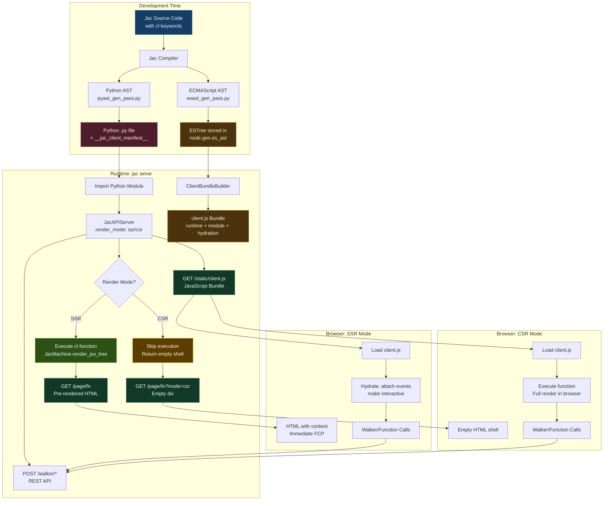
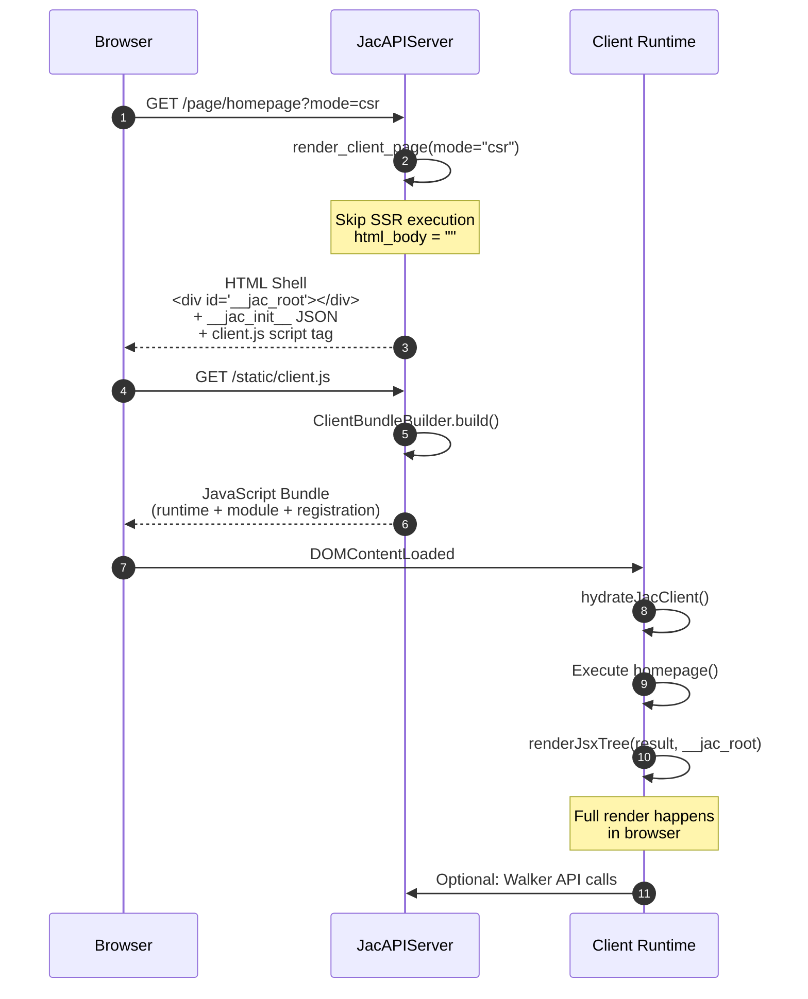
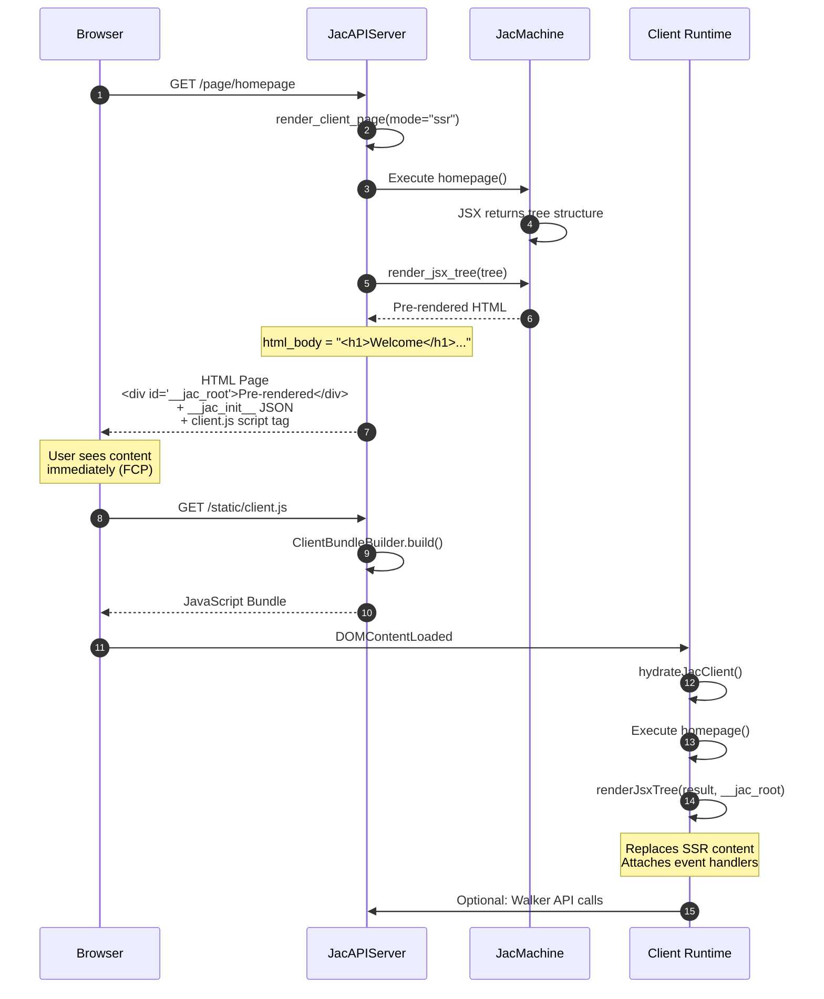

# JSX-Based Webpage Generation Design Document

## Overview

This document describes the design and implementation plan for enabling Jac's `cl` (client) keyword to generate full-stack web applications. Functions and objects marked with `cl` will be compiled to JavaScript (client-side), enabling seamless integration between Jac backend services and browser-based UIs. With this approach jac serve will be able to create both json and webpage endpoint, converting walkers and functions without `cl` into rest endpoint (already supported), and functions with `cl` into html+js end points.

## Architecture Overview

The system compiles Jac code to both Python and JavaScript, supporting two rendering modes: Server-Side Rendering (SSR) and Client-Side Rendering (CSR).



### Rendering Modes

The implementation supports two rendering modes that can be configured per-server or per-request:

#### Mode Configuration

```python
# Set default render mode at server initialization
server = JacAPIServer("mymodule", session_path, render_mode="ssr")  # or "csr"

# Override per-request via query parameter
GET /page/homepage?mode=csr   # Client-Side Rendering
GET /page/homepage?mode=ssr   # Server-Side Rendering (default)
```

#### Client-Side Rendering (CSR) Mode

Pure client-side rendering with zero backend computation for the initial render. Best for SPAs and highly interactive applications.



**CSR Flow:**
1. Server returns empty `__jac_root` div
2. Client bundle executes function from scratch
3. All rendering happens in browser
4. Zero backend CPU for initial render

#### Server-Side Rendering + Hydration (SSR) Mode

Pre-renders HTML on server, then hydrates on client. Best for SEO, initial load performance, and progressive enhancement.



**SSR Flow:**
1. Server executes function and renders JSX to HTML
2. Browser receives pre-populated `__jac_root`
3. User sees content immediately (better FCP)
4. Client bundle loads and "hydrates" (adds interactivity)
5. Event handlers and dynamic behavior become active

#### Comparison

| Feature | CSR Mode | SSR Mode |
|---------|----------|----------|
| **Initial HTML** | Empty div | Pre-rendered content |
| **Server CPU** | Minimal | Executes function |
| **First Contentful Paint** | Slower (waits for JS) | Faster (immediate HTML) |
| **SEO** | Poor (requires JS) | Excellent (crawlable HTML) |
| **Best For** | Dashboards, SPAs | Landing pages, blogs |
| **Hydration** | Full render | Event attachment only |
| **Network** | 1 request (HTML + JS) | 1 request (HTML + JS) |
| **Default** | No | Yes |

## Language Features

### 1. The `cl` (Client) Keyword

The `cl` keyword marks Jac code items for client side compilation - this way a single jac file would include normal server-side (Python) code and client-side (JavaScript) code that will go through the esast_gen_pass to produce javascript.

#### Supported Constructs

```jac
// Mark a function for client-side execution
cl def homepage() -> JsxElement {
    return <div>
        <h1>Welcome</h1>
        <button onclick={spawn load_feed()}>Load Feed</button>
    </div>;
}

// Mark an object for shared client/server usage
cl obj TweetInfo {
    has username: str;
    has content: str;
    has likes: int;
}

// Mark a global variable
cl let API_BASE_URL: str = "https://api.example.com";
```

#### Grammar (from jac.lark)

```lark
toplevel_stmt: KW_CLIENT? import_stmt
       | KW_CLIENT? archetype
       | KW_CLIENT? ability
       | KW_CLIENT? global_var

KW_CLIENT: "cl"
```

### 2. JSX Syntax

JSX is already fully supported in Jac with grammar defined in [jac.lark:424-453](jac.lark#L424-L453).

```jac
cl def render_tweet(tweet: Tweet) -> JsxElement {
    return <div class="tweet">
        <h3>{tweet.username}</h3>
        <p>{tweet.content}</p>
        <button onclick={spawn like_tweet(tweet_id=jid(tweet))}>
            Like ({tweet.likes.length})
        </button>
    </div>;
}
```

## Implementation Status

**Status: ✅ FULLY IMPLEMENTED**

All components described in this design document have been implemented and tested.

### Core Components

| Component | Status | Location |
|-----------|--------|----------|
| **`cl` keyword grammar** | ✅ Complete | [jac.lark:582](../jaclang/compiler/jac.lark#L582) |
| **ESTree generation** | ✅ Complete | [esast_gen_pass.py](../jaclang/compiler/ecmascript/esast_gen_pass.py) |
| **JavaScript unparsing** | ✅ Complete | [es_unparse.py](../jaclang/compiler/ecmascript/es_unparse.py) |
| **Client bundle builder** | ✅ Complete | [client_bundle.py](../jaclang/runtimelib/client_bundle.py) |
| **JSX SSR rendering** | ✅ Complete | [machine.py:1134](../jaclang/runtimelib/machine.py#L1134) |
| **Page endpoints** | ✅ Complete | [server.py:779-816](../jaclang/runtimelib/server.py#L779-L816) |
| **Client runtime** | ✅ Complete | [client_runtime.jac](../jaclang/runtimelib/client_runtime.jac) |

### Rendering Modes

| Mode | Status | Implementation |
|------|--------|----------------|
| **SSR (default)** | ✅ Complete | [server.py:287-378](../jaclang/runtimelib/server.py#L287-L378) |
| **CSR** | ✅ Complete | [server.py:315-317](../jaclang/runtimelib/server.py#L315-L317) |
| **Per-request override** | ✅ Complete | [server.py:784-786](../jaclang/runtimelib/server.py#L784-L786) |

### Test Coverage

| Test Suite | Status | Location |
|------------|--------|----------|
| **Client codegen tests** | ✅ Passing | [test_client_codegen.py](../jaclang/compiler/tests/test_client_codegen.py) |
| **JSX rendering tests** | ✅ Passing | [test_jsx_render.py](../jaclang/runtimelib/tests/test_jsx_render.py) |
| **Client bundle tests** | ✅ Passing | [test_client_bundle.py](../jaclang/runtimelib/tests/test_client_bundle.py) |
| **Server endpoint tests** | ✅ Passing | [test_serve.py](../jaclang/runtimelib/tests/test_serve.py) |
| **CSR mode tests** | ✅ Passing | [test_serve.py:632-732](../jaclang/runtimelib/tests/test_serve.py#L632-L732) |
| **JavaScript generation** | ✅ Passing | [test_js_generation.py](../jaclang/compiler/ecmascript/tests/test_js_generation.py) |

### Example Usage

```jac
// Define client-side components
cl let API_URL: str = "https://api.example.com";

cl obj ButtonProps {
    has label: str = "Hello";
    has count: int = 0;
}

cl def homepage() {
    return <div class="container">
        <h1>Welcome to Jac</h1>
        <p>Full-stack web apps in one language!</p>
    </div>;
}

// Server-side walker (not marked with cl)
walker GetData {
    can process() {
        // Server-side logic
    }
}
```

**Start the server:**
```bash
jac serve myapp.jac --render-mode=ssr
```

**Access endpoints:**
- SSR: `GET http://localhost:8000/page/homepage`
- CSR: `GET http://localhost:8000/page/homepage?mode=csr`
- Bundle: `GET http://localhost:8000/static/client.js`
- Walker: `POST http://localhost:8000/walker/GetData`

### Known Limitations

None - the implementation is production-ready and feature-complete as designed.
