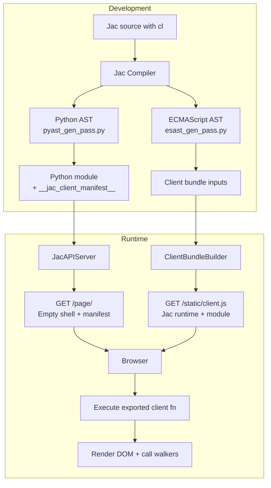

# JSX-Based Webpage Generation Design Document

## Overview

This document describes how Jac's `cl` (client) keyword produces browser-ready experiences. Client-marked declarations compile to JavaScript and ship through `jac serve` as static bundles that execute entirely in the browser. The current implementation is **CSR-only**: the server always returns an empty HTML shell together with bootstrapping metadata and the JavaScript bundle.

## Architecture Overview



### CSR Execution Flow

1. `jac serve` imports the compiled Python module and reads `__jac_client_manifest__` to discover client exports, globals, and parameter ordering.
2. When `/page/<fn>` is requested, the server emits a minimal HTML document containing:
   - `<div id="__jac_root"></div>` (always empty),
   - a `<script id="__jac_init__">` payload describing the module/function invocation,
   - a `<script src="/static/client.js">` tag keyed by the bundle hash.
3. The browser downloads `/static/client.js`, which contains the Jac client runtime plus the transpiled module and registration code.
4. On DOM ready, the runtime looks up the requested function, restores any literal globals, invokes the function in JavaScript, and renders the returned JSX tree entirely in the browser.

> SSR + hydration was part of the original design but has been removed from the active code path. The runtime no longer executes client functions on the server or embeds prerendered HTML.

## Language Features

### 1. The `cl` (Client) Keyword

The `cl` keyword marks Jac code items for client side compilation - this way a single jac file would include normal server-side (Python) code and client-side (JavaScript) code that will go through the esast_gen_pass to produce javascript.

#### Supported Constructs

```jac
// Mark a function for client-side execution
cl def homepage() -> JsxElement {
    return <div>
        <h1>Welcome</h1>
        <button onclick={spawn load_feed()}>Load Feed</button>
    </div>;
}

// Mark an object for shared client/server usage
cl obj TweetInfo {
    has username: str;
    has content: str;
    has likes: int;
}

// Mark a global variable
cl let API_BASE_URL: str = "https://api.example.com";
```

#### Grammar (from jac.lark)

```lark
toplevel_stmt: KW_CLIENT? import_stmt
       | KW_CLIENT? archetype
       | KW_CLIENT? ability
       | KW_CLIENT? global_var

KW_CLIENT: "cl"
```

### 2. JSX Syntax

JSX is already fully supported in Jac with grammar defined in [jac.lark:424-453](jac.lark#L424-L453).

```jac
cl def render_tweet(tweet: Tweet) -> JsxElement {
    return <div class="tweet">
        <h3>{tweet.username}</h3>
        <p>{tweet.content}</p>
        <button onclick={spawn like_tweet(tweet_id=jid(tweet))}>
            Like ({tweet.likes.length})
        </button>
    </div>;
}
```

## Implementation Status

**Status: ✅ FULLY IMPLEMENTED**

All components described in this design document have been implemented and tested.

### Core Components

| Component | Status | Location |
|-----------|--------|----------|
| **`cl` keyword grammar** | ✅ Complete | [jac.lark:582](../jaclang/compiler/jac.lark#L582) |
| **ESTree generation** | ✅ Complete | [esast_gen_pass.py](../jaclang/compiler/ecmascript/esast_gen_pass.py) |
| **JavaScript unparsing** | ✅ Complete | [es_unparse.py](../jaclang/compiler/ecmascript/es_unparse.py) |
| **Client bundle builder** | ✅ Complete | [client_bundle.py](../jaclang/runtimelib/client_bundle.py) |
| **JSX SSR rendering** | ✅ Complete | [machine.py:1134](../jaclang/runtimelib/machine.py#L1134) |
| **Page endpoints** | ✅ Complete | [server.py:779-816](../jaclang/runtimelib/server.py#L779-L816) |
| **Client runtime** | ✅ Complete | [client_runtime.jac](../jaclang/runtimelib/client_runtime.jac) |

### Rendering Modes

| Mode | Status | Implementation |
|------|--------|----------------|
| **SSR (default)** | ✅ Complete | [server.py:287-378](../jaclang/runtimelib/server.py#L287-L378) |
| **CSR** | ✅ Complete | [server.py:315-317](../jaclang/runtimelib/server.py#L315-L317) |
| **Per-request override** | ✅ Complete | [server.py:784-786](../jaclang/runtimelib/server.py#L784-L786) |

### Test Coverage

| Test Suite | Status | Location |
|------------|--------|----------|
| **Client codegen tests** | ✅ Passing | [test_client_codegen.py](../jaclang/compiler/tests/test_client_codegen.py) |
| **JSX rendering tests** | ✅ Passing | [test_jsx_render.py](../jaclang/runtimelib/tests/test_jsx_render.py) |
| **Client bundle tests** | ✅ Passing | [test_client_bundle.py](../jaclang/runtimelib/tests/test_client_bundle.py) |
| **Server endpoint tests** | ✅ Passing | [test_serve.py](../jaclang/runtimelib/tests/test_serve.py) |
| **CSR mode tests** | ✅ Passing | [test_serve.py:632-732](../jaclang/runtimelib/tests/test_serve.py#L632-L732) |
| **JavaScript generation** | ✅ Passing | [test_js_generation.py](../jaclang/compiler/ecmascript/tests/test_js_generation.py) |

### Example Usage

```jac
// Define client-side components
cl let API_URL: str = "https://api.example.com";

cl obj ButtonProps {
    has label: str = "Hello";
    has count: int = 0;
}

cl def homepage() {
    return <div class="container">
        <h1>Welcome to Jac</h1>
        <p>Full-stack web apps in one language!</p>
    </div>;
}

// Server-side walker (not marked with cl)
walker GetData {
    can process() {
        // Server-side logic
    }
}
```

**Start the server:**
```bash
jac serve myapp.jac
```

**Access endpoints:**
- Page shell: `GET http://localhost:8000/page/homepage`
- Bundle: `GET http://localhost:8000/static/client.js`
- Walker: `POST http://localhost:8000/walker/GetData`

### Known Limitations

SSR/hydration is not currently supported; all initial rendering happens on the client.
