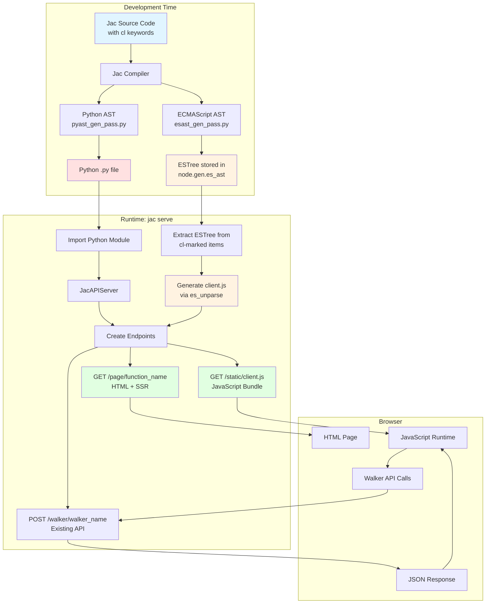
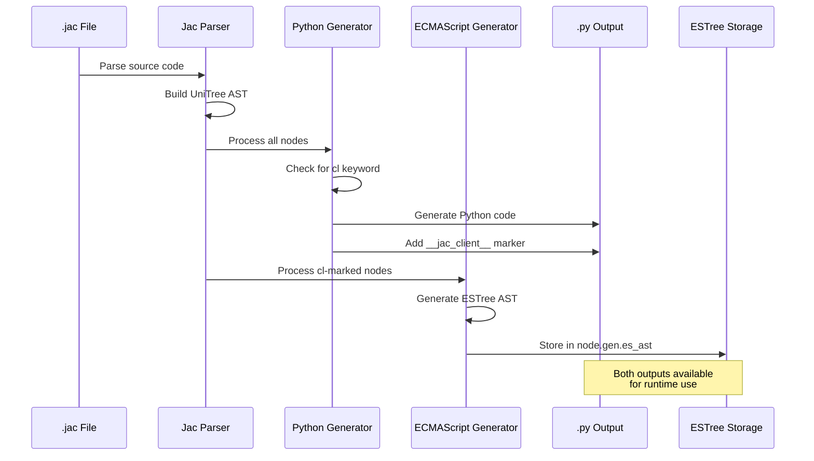
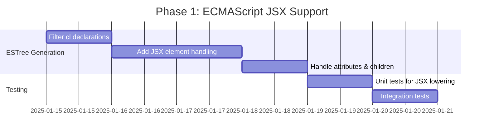
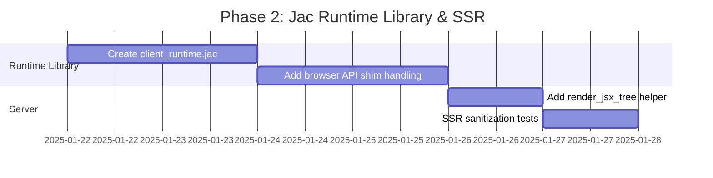
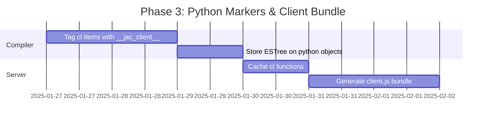
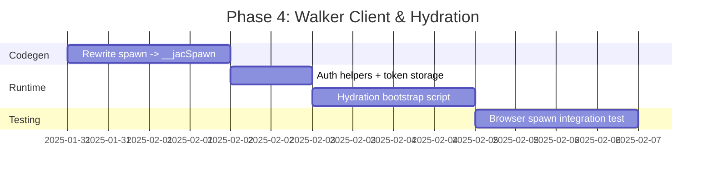
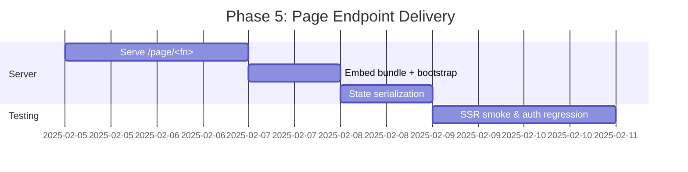
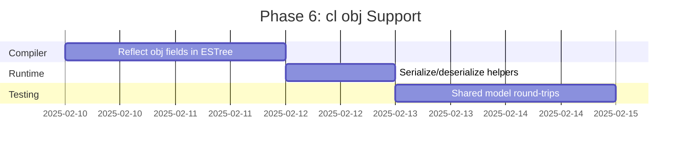
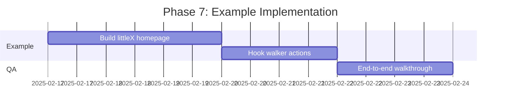

# JSX-Based Webpage Generation Design Document

## Overview

This document describes the design and implementation plan for enabling Jac's `cl` (client) keyword to generate full-stack web applications. Functions and objects marked with `cl` will be compiled to both Python (server-side) and JavaScript (client-side), enabling seamless integration between Jac backend services and browser-based UIs.

## Architecture Overview



## Language Features

### 1. The `cl` (Client) Keyword

The `cl` keyword marks Jac code items for dual compilation - both server-side (Python) and client-side (JavaScript).

#### Supported Constructs

```jac
// Mark a function for client-side execution
cl def homepage() -> JsxElement {
    return <div>
        <h1>Welcome</h1>
        <button onclick={spawn load_feed()}>Load Feed</button>
    </div>;
}

// Mark an object for shared client/server usage
cl obj TweetInfo {
    has username: str;
    has content: str;
    has likes: int;
}

// Mark a global variable
cl let API_BASE_URL: str = "https://api.example.com";
```

#### Grammar (from jac.lark)

```lark
toplevel_stmt: KW_CLIENT? import_stmt
       | KW_CLIENT? archetype
       | KW_CLIENT? ability
       | KW_CLIENT? global_var

KW_CLIENT: "cl"
```

### 2. JSX Syntax

JSX is already fully supported in Jac with grammar defined in [jac.lark:424-453](jac.lark#L424-L453).

```jac
cl def render_tweet(tweet: Tweet) -> JsxElement {
    return <div class="tweet">
        <h3>{tweet.username}</h3>
        <p>{tweet.content}</p>
        <button onclick={spawn like_tweet(tweet_id=jid(tweet))}>
            Like ({tweet.likes.length})
        </button>
    </div>;
}
```

## Compilation Flow



### Compilation Phases

#### Phase 1: Parsing (Already Complete)
- JSX syntax parsed into `JsxElement` AST nodes
- `cl` keyword parsed and attached to relevant nodes

#### Phase 2: Python Generation (Already Complete)
```python
# In pyast_gen_pass.py - already implemented
def exit_jsx_element(self, node: uni.JsxElement) -> None:
    # Converts JSX to: Jac.jsx('div', {...}, [...])
    ...
```

#### Phase 3: ECMAScript Generation (TO BE IMPLEMENTED)
```python
# In esast_gen_pass.py - needs JSX support
def exit_jsx_element(self, node: uni.JsxElement) -> None:
    # Converts JSX to ESTree JSXElement or React.createElement
    ...
```

## Current Codebase Assessment

- The parser already tags `cl` declarations, but nothing downstream consumes the flag yet (`jac/jaclang/compiler/parser.py:425` and `jac/jaclang/compiler/unitree.py:579`).
- JSX is lowered on the Python side by calling `JacMachineInterface.jsx`, which currently returns a data tree rather than HTML (`jac/jaclang/compiler/passes/main/pyast_gen_pass.py:3086` and `jac/jaclang/runtimelib/machine.py:1109`).
- The ECMAScript pass emits whole-module programs and still lacks JSX support or awareness of `cl` markers (`jac/jaclang/compiler/emcascript/esast_gen_pass.py:80`).
- `JacAPIServer` only exposes JSON APIs today and keeps no cache of page functions or static bundles (`jac/jaclang/runtimelib/server.py:200`).

## Detailed Component Design

### 1. ECMAScript Generation Enhancements

**Goals**

- Emit JavaScript only for declarations marked with Jac's `cl` keyword so that the browser bundle stays focused.
- Preserve the existing JSX data shape (`{"tag", "attributes", "children"}`) so server-side and client-side code agree.
- Surface walker spawns in the ESTree so the client runtime can call the REST API without hand-written glue.

**Key updates**

1. Inside `exit_module`, filter `node.body` to the subset where `getattr(stmt, "is_client_decl", False)` is true before emitting `Program.body`. Everything else should be ignored by the ECMAScript pass.
2. Implement JSX lowering helpers (`exit_jsx_element`, `exit_jsx_element_name`, `exit_jsx_normal_attribute`, `exit_jsx_spread_attribute`, `exit_jsx_text`, `exit_jsx_expression`). Each JSX element becomes a call to an in-bundle factory:
   ```python
   call = es.CallExpression(
       callee=es.Identifier(name="__jacJsx"),
       arguments=[
           self._jsx_tag(node),
           self._jsx_props(node),
           es.ArrayExpression(elements=self._jsx_children(node)),
       ],
   )
   node.gen.es_ast = self.sync_loc(call, node)
   ```
   `_jsx_props` should return an `ObjectExpression` that applies spread attributes by wrapping them in `es.SpreadElement`. `_jsx_children` should produce ESTree expressions for text, nested JSX, or interpolated expressions.
3. Detect `spawn` calls under client code (the UniTree exposes them as `uni.SpawnStmt` or `uni.FuncCall` depending on form). Rewrite them to `__jacSpawn("WalkerName", fieldsExpr)` so that the runtime can POST to `/walker/<name>` without type checking at codegen time.
4. Skip emitting implementation blocks (`uni.ImplDef`) and retain location metadata using `sync_loc` so source maps stay precise.

### 2. Jac Runtime Library (Client-Side)

The runtime is written in **Jac itself** and marked with `cl` tags, so it compiles to JavaScript alongside user code. This provides a clean, self-contained approach where the runtime is just another Jac module.

**File:** `jaclang/runtimelib/client_runtime.jac`

```jac
"""Client-side runtime for Jac JSX and walker interactions."""

# JSX factory function
cl def __jacJsx(tag: any, props: dict = {}, children: list = []) -> dict {
    """Create JSX element representation."""
    return {"tag": tag, "props": props, "children": children};
}

# Walker spawn function
cl def __jacSpawn(walker: str, fields: dict = {}) -> any {
    """Spawn a walker via REST API."""
    # Note: This will be transpiled to async/await JavaScript
    # The Python version won't actually make HTTP calls
    token = __getLocalStorage("jac_token");

    # In JavaScript, this becomes fetch()
    response = __fetch(
        f"/walker/{walker}",
        {
            "method": "POST",
            "headers": {
                "Content-Type": "application/json",
                "Authorization": f"Bearer {token}" if token else ""
            },
            "body": __jsonStringify({"fields": fields})
        }
    );

    if not response.ok {
        raise Exception(f"Walker {walker} failed: {response.statusText}");
    }

    return __jsonParse(response.body);
}

# DOM rendering function
cl def renderJsxTree(node: any, container: any) -> None {
    """Render JSX tree to DOM."""
    container.replaceChildren(__buildDom(node));
}

# Internal: Build DOM from JSX tree
cl def __buildDom(node: any) -> any {
    """Build DOM element from JSX node."""
    if node == None {
        return __createTextNode("");
    }

    if not __isObject(node) {
        return __createTextNode(str(node));
    }

    # Handle component functions
    if __isFunction(node.get("tag")) {
        return __buildDom(node["tag"](node.get("props", {})));
    }

    tag = node.get("tag", "div");
    element = __createElement(tag);

    # Apply properties
    props = node.get("props", {});
    for key, value in props.items() {
        __applyProp(element, key, value);
    }

    # Render children
    children = node.get("children", []);
    for child in children {
        element.appendChild(__buildDom(child));
    }

    return element;
}

# Internal: Apply property to DOM element
cl def __applyProp(element: any, key: str, value: any) -> None {
    """Apply a prop to a DOM element."""
    if key.startswith("on") {
        # Event handler: onclick -> click
        event = key[2:].lower();
        element.addEventListener(event, value);
    } elif key == "className" {
        element.className = value;
    } elif key != "children" {
        element.setAttribute(key, str(value));
    }
}

# Browser API shims (these map directly to JS APIs)
# The ESTree generator recognizes these and converts to native calls

cl def __fetch(url: str, options: dict) -> any {
    """Fetch API (maps to native fetch in JS)."""
    pass;  # Placeholder - ESTree generator handles this
}

cl def __getLocalStorage(key: str) -> str {
    """Get from localStorage (maps to localStorage.getItem in JS)."""
    pass;
}

cl def __setLocalStorage(key: str, value: str) -> None {
    """Set in localStorage (maps to localStorage.setItem in JS)."""
    pass;
}

cl def __jsonStringify(obj: any) -> str {
    """JSON.stringify in JS."""
    pass;
}

cl def __jsonParse(text: str) -> any {
    """JSON.parse in JS."""
    pass;
}

cl def __createElement(tag: str) -> any {
    """document.createElement in JS."""
    pass;
}

cl def __createTextNode(text: str) -> any {
    """document.createTextNode in JS."""
    pass;
}

cl def __isObject(value: any) -> bool {
    """Check if value is object."""
    pass;
}

cl def __isFunction(value: any) -> bool {
    """Check if value is function."""
    pass;
}
```

**Usage in Server:**

When `JacAPIServer` generates `client.js`, it:
1. Imports `client_runtime.jac`
2. Extracts all `cl`-marked items (runtime functions + user code)
3. Passes through ESTree generation
4. Bundles into single JavaScript file

The ESTree generator has special handling for browser API shims (`__fetch`, `__createElement`, etc.) to map them to native JavaScript APIs.

### 3. Server-Side Rendering

- Keep `JacMachineInterface.jsx` returning the plain data tree (`jac/jaclang/runtimelib/machine.py:1109`).
- Add `JacBuiltin.render_jsx_tree(node)` that walks the tree, escapes unsafe strings with `html.escape`, and evaluates callable tags (allowing components to be reused on the server).
- Introduce a thin wrapper on `ExecutionContext` (e.g. `ctx.render_mode = 'html'`) only if we need conditional behaviour; otherwise call the helper directly inside `_render_page` so the JSX pipeline stays side-effect free.
- Ensure walker responses that reach the browser reuse the same serialization path (`serialize_for_response`) so the client can hydrate with consistent shapes.

### 4. Server Endpoint Extensions

Extend `JacAPIServer` (`jac/jaclang/runtimelib/server.py:200`) with:

- `_collect_client_functions()` that scans the module for callables carrying `__jac_client__` (added during Python codegen) and caches them by name.
- `_generate_client_bundle()` that:
  1. **Imports `client_runtime.jac`** from the Jac runtime library
  2. Compiles it through `EsastGenPass` to get runtime JavaScript
  3. Compiles the user module through `EsastGenPass` to get user code
  4. Concatenates runtime + user code into a single bundle
  5. Caches the result in `self._client_code_cache`
- A `GET /static/client.js` handler that streams the cached bundle and refreshes it on reloads (`jac serve --reload` path already toggles `force_reload`).
- A `/page/<function_name>` handler that authenticates, executes the Python function to produce a JSX tree, renders it to HTML, and embeds the serialized state plus `<script src="/static/client.js">` in the response.

**Key Advantage:** The runtime is versioned alongside Jac itself. When Jac updates, the runtime JavaScript automatically updates. No manual JavaScript maintenance needed.

### 5. Browser API Shim Handling in ESTree Generator

The ESTree generator needs special handling for browser API shims defined in `client_runtime.jac`:

```python
# In esast_gen_pass.py
BROWSER_API_SHIMS = {
    '__fetch': 'fetch',
    '__getLocalStorage': ('localStorage', 'getItem'),
    '__setLocalStorage': ('localStorage', 'setItem'),
    '__jsonStringify': ('JSON', 'stringify'),
    '__jsonParse': ('JSON', 'parse'),
    '__createElement': ('document', 'createElement'),
    '__createTextNode': ('document', 'createTextNode'),
    '__isObject': lambda: 'typeof {arg} === "object" && {arg} !== null',
    '__isFunction': lambda: 'typeof {arg} === "function"',
}

def exit_func_call(self, node: uni.FuncCall) -> None:
    """Handle function calls - detect browser API shims."""
    if isinstance(node.target, uni.Name):
        func_name = node.target.sym_name

        if func_name in BROWSER_API_SHIMS:
            # Replace with native browser API
            shim = BROWSER_API_SHIMS[func_name]
            if callable(shim):
                # Custom transformation
                node.gen.es_ast = self._transform_shim(shim, node)
            else:
                # Simple member access
                node.gen.es_ast = self._create_native_call(shim, node)
            return

    # Regular function call handling
    super().exit_func_call(node)
```

This ensures that `__fetch(url, opts)` in Jac becomes `fetch(url, opts)` in JavaScript, without runtime overhead.

### 6. Python Code Markers

Update `PyastGenPass` so that any `ClientFacingNode` marked with `cl` emits `__jac_client__ = True` alongside the generated Python object/function. For objects, set the attribute on the class body; for functions, use a decorator. This marker is the bridge the server uses when building caches.
## Implementation Steps

### Phase 1: ECMAScript JSX Support (Week 1)



**Tasks:**
1. 🔨 Guard `exit_module` so only `cl` declarations feed the client `Program.body`.
2. 🔨 Implement JSX node visitors that emit `__jacJsx(tag, props, children)` calls.
3. 🔨 Normalize walker spawn detection and rewrite to `__jacSpawn(...)` inside client code.
4. 🔨 Extend `es_unparse` only if new node types require coverage.
5. 🔨 Add fixtures covering plain tags, components, fragments, spreads, and interpolations.

**Files to Modify:**
- `jaclang/compiler/emcascript/esast_gen_pass.py`
- `jaclang/compiler/emcascript/es_unparse.py` (if additional node handlers are needed)

**Success Criteria:**
```jac
cl def test() -> JsxElement {
    return <div class="container">{greeting}</div>;
}
```
Generates:
```javascript
export function test() {
  return __jacJsx('div', { class: 'container' }, [greeting]);
}
```

### Phase 2: Jac Runtime Library & SSR (Week 2)



**Tasks:**
1. 🔨 Create `jaclang/runtimelib/client_runtime.jac` with all runtime functions marked `cl`.
2. 🔨 Add browser API shim detection to `esast_gen_pass.py` (`__fetch` → `fetch`, etc.).
3. 🔨 Add `JacBuiltin.render_jsx_tree()` for server-side HTML generation.
4. 🔨 Write SSR unit tests covering text escaping, nested components, and callable tags.
5. 🔨 Test that `client_runtime.jac` compiles to valid JavaScript.

**Files to Create:**
- `jaclang/runtimelib/client_runtime.jac` (~150 lines of Jac code)

**Files to Modify:**
- `jaclang/compiler/emcascript/esast_gen_pass.py` (add ~50 lines for shim handling)
- `jaclang/runtimelib/machine.py` (add ~80 lines for SSR)

**Success Criteria:**
```python
# Server-side
jsx_tree = homepage()
html = JacBuiltin.render_jsx_tree(jsx_tree)
# '<div class="container">Hello &amp; welcome</div>'
```

JavaScript generated from `client_runtime.jac`:
```javascript
export function __jacJsx(tag, props, children) {
  return { tag, props, children };
}

export async function __jacSpawn(walker, fields) {
  const token = localStorage.getItem("jac_token");
  const response = await fetch(`/walker/${walker}`, {
    method: 'POST',
    headers: {
      'Content-Type': 'application/json',
      'Authorization': token ? `Bearer ${token}` : ''
    },
    body: JSON.stringify({ fields })
  });
  // ... rest of implementation
}
```

### Phase 3: Python Markers & Client Bundle (Week 3)



**Tasks:**
1. 🔨 Emit `__jac_client__ = True` for `cl` functions/objects in `PyastGenPass`.
2. 🔨 Persist the ESTree program on the python artifact (e.g., `__jac_es_ast__`).
3. 🔨 Extend `JacAPIServer` with `_collect_client_functions()` and `_generate_client_bundle()`.
4. 🔨 Cache the generated code to avoid recomputation on every request.
5. 🔨 Add CLI smoke test to ensure `jac serve` reports the new endpoints.

**Success Criteria:**
- `cl` callables expose both `__jac_client__` and `__jac_es_ast__`.
- `GET /static/client.js` returns the generated bundle containing runtime helpers and exported functions.

### Phase 4: Walker Client & Hydration (Week 4)



**Tasks:**
1. 🔨 Ensure rewritten spawn calls include field serialization that matches the POST body.
2. 🔨 Provide login/logout helpers in the runtime that manage tokens and call `__jacSpawn`.
3. 🔨 Embed a boot script in `/page/<fn>` that rehydrates the DOM with `renderJsxTree`.
4. 🔨 Write integration tests covering button-triggered walkers and response rendering.
5. 🔨 Document how client errors propagate back to Jac reports.

**Success Criteria:**
```jac
<button onclick={spawn load_feed(page=1)}>Load</button>
```
Produces:
```javascript
<button onclick={() => __jacSpawn('load_feed', { page: 1 })}>Load</button>
```
And the runtime updates the DOM with the walker response.

### Phase 5: Page Endpoint Delivery (Week 5)



**Tasks:**
1. 🔨 Build HTML template that injects SSR HTML, serialized props, and `<script src="/static/client.js">`.
2. 🔨 Ensure `_render_page` restores the previous Jac execution context after rendering.
3. 🔨 Serialize initial state (walker results, auth info) so hydration can reuse it.
4. 🔨 Add regression tests for unauthorized access and stale bundles.
5. 🔨 Update CLI output to list new endpoints.

**Success Criteria:**
`GET /page/homepage` returns a full HTML document with SSR markup, a preload of the serialized state, and a hydration script that calls `renderJsxTree` once the bundle loads.

### Phase 6: cl obj Support (Week 6)



**Tasks:**
1. 🔨 Extend `EsastGenPass` to emit ES6 classes or factory functions for `cl obj` definitions.
2. 🔨 Update Python serialization so walker responses containing `cl obj` retain field order/types.
3. 🔨 Add runtime helpers to revive serialized objects on the client when hydrating.
4. 🔨 Write unit tests covering nested objects and arrays of objects.
5. 🔨 Confirm objects remain usable on the Python side with no regression.

**Success Criteria:**
```jac
cl obj TweetInfo {
    has username: str;
    has content: str;
}
```
Generates:
```javascript
export class TweetInfo {
  constructor({ username, content }) {
    this.username = username;
    this.content = content;
  }
}
```
And instances survive JSON serialization back to Python walkers.

### Phase 7: Example Implementation (Week 7)



**Tasks:**
1. 🔨 Upgrade `littleX_single_nodeps.jac` to use `cl` pages and shared objects.
2. 🔨 Implement client interactions (load feed, like tweet) using the new runtime helpers.
3. 🔨 Document setup steps in the examples directory.
4. 🔨 Produce a screencast or README that demonstrates SSR + hydration working together.
5. 🔨 Capture performance metrics (TTFB, hydration time) to validate the approach.

**Success Criteria:**
Visiting `/page/homepage` renders the feed server-side immediately, the client bundle hydrates the page, and subsequent walker actions update the interface without full reloads.
## Testing Strategy

### Unit Tests

```python
# test_jsx_esgen.py
def test_jsx_element_to_estree():
    """Test JSX element converts to ESTree correctly."""
    # Parse: <div>Hello</div>
    # Assert: generates __jacJsx(...) call

def test_jsx_attributes():
    """Test JSX attributes become object properties."""
    # Parse: <div id="foo" class="bar">Hello</div>
    # Assert: props object has id and class

def test_jsx_children():
    """Test JSX children are rendered correctly."""
    # Parse: <div><span>A</span><span>B</span></div>
    # Assert: children array has 2 elements
```

### Integration Tests

```python
# test_client_generation.py
def test_collect_cl_items():
    """Test server collects cl-marked functions."""
    # Create module with cl functions
    # Assert: _page_functions contains them

def test_generate_client_js():
    """Test client.js generation."""
    # Create module with cl functions
    # Assert: client.js contains generated exports
    # Assert: bundle ends with runtime helpers
    # Assert: JavaScript validates via esprima or eslint
```

### End-to-End Tests

```python
# test_e2e_webpage.py
def test_page_endpoint():
    """Test full page rendering."""
    # Start server
    # Create user and login
    # Request /page/homepage
    # Assert: Returns valid HTML
    # Assert: HTML contains SSR content
    # Assert: HTML includes client.js script and bootstrap state

def test_walker_spawn_from_client():
    """Test walker spawn from browser."""
    # Selenium/Playwright test
    # Open /page/homepage
    # Click button that spawns walker
    # Assert: Fetch request sent
    # Assert: UI updates with results
```

## Security Considerations

1. **XSS Prevention:** All user data must be escaped in SSR
2. **Authentication:** Page endpoints require valid tokens
3. **CSRF Protection:** Add CSRF tokens for state-changing operations
4. **Code Injection:** Validate all JSX attributes during SSR
5. **API Access:** Enforce same permissions for walker calls from browser

## Performance Optimization

1. **Client Bundle Caching:** Generate client.js once, cache in memory
2. **SSR Caching:** Cache rendered HTML for common pages
3. **Lazy Loading:** Split client.js by route
4. **Minification:** Minify generated JavaScript in production

## Future Enhancements

1. **TypeScript Generation:** Generate `.d.ts` files for type safety
2. **CSS Support:** `cl style` blocks compiled to CSS
3. **Hot Module Replacement:** Live reload during development
4. **Server Components:** Async components that fetch data server-side
5. **Streaming SSR:** Stream HTML as components resolve
6. **Static Site Generation:** Pre-render pages at build time

## Implementation Commit Sequence

This section provides a detailed, ordered list of commits required to complete the project. Each commit represents an atomic, testable unit of work.

### Phase 1: ECMAScript JSX Support (Commits 1-8)

**Commit 1: Add JSX element handler to ESTree generator**
Add `exit_jsx_element` method to `EsastGenPass` that converts JSX nodes to `__jacJsx(tag, props, children)` call expressions. Includes handling for tag names (string literals vs component references).

**Commit 2: Implement JSX attribute handling in ESTree**
Add `exit_jsx_normal_attribute` and `exit_jsx_spread_attribute` methods. Normal attributes become object properties, spread attributes use ESTree SpreadElement nodes.

**Commit 3: Add JSX children processing to ESTree generator**
Implement `exit_jsx_text`, `exit_jsx_expression` methods. Handle text nodes, nested JSX elements, and expression interpolations within children arrays.

**Commit 4: Add JSX fragment support to ESTree generator**
Handle JSX fragments (`<>...</>`) by passing `null` as the tag argument to `__jacJsx`. Update fragment detection logic from UniTree AST.

**Commit 5: Filter module body to client-marked declarations only**
Update `exit_module` in `EsastGenPass` to filter `node.body` to only include items where `is_client_decl == True`. Ensures bundle contains only `cl`-marked code.

**Commit 6: Add source map generation to ESTree output**
Extend `es_unparse` to generate inline source maps using existing `sync_loc` location data. Enables debugging of generated JavaScript in browser DevTools.

**Commit 7: Add unit tests for JSX ESTree generation**
Create `test_jsx_esgen.py` with tests covering: basic elements, attributes, children, spreads, fragments, nested structures. Validate ESTree structure and JavaScript output.

**Commit 8: Add integration test for cl-filtered JavaScript output**
Test that `cl`-marked functions generate JavaScript while non-marked functions are excluded. Verify complete module compilation with mixed client/server code.

### Phase 2: Jac Runtime Library & SSR (Commits 9-16)

**Commit 9: Create client_runtime.jac with __jacJsx factory**
Create new file `jaclang/runtimelib/client_runtime.jac` containing the `cl def __jacJsx(tag, props, children)` function. Returns standardized JSX data structure.

**Commit 10: Add renderJsxTree and DOM building functions**
Implement `cl def renderJsxTree()` and `cl def __buildDom()` in `client_runtime.jac`. Handles conversion from JSX tree to actual DOM elements with recursive processing.

**Commit 11: Add __jacSpawn walker API client function**
Implement `cl def __jacSpawn(walker, fields)` that makes POST requests to `/walker/<name>`. Includes token handling, error checking, and JSON response parsing.

**Commit 12: Add browser API shims to client_runtime.jac**
Create placeholder functions (`__fetch`, `__createElement`, `__getLocalStorage`, etc.) that will be detected and replaced by ESTree generator.

**Commit 13: Add browser API shim detection to ESTree generator**
Create `BROWSER_API_SHIMS` mapping in `esast_gen_pass.py`. Update `exit_func_call` to detect shim calls and emit native browser API calls instead.

**Commit 14: Add render_jsx_tree HTML generator to machine.py**
Implement `JacBuiltin.render_jsx_tree(node) -> str` that walks JSX data tree, escapes HTML, handles callable component tags, and returns safe HTML string.

**Commit 15: Add HTML sanitization for dangerous attributes**
Extend `render_jsx_tree` with `sanitize_attr()` helper that strips `javascript:` and `data:` protocols from `href`, `src`, and other dangerous attributes.

**Commit 16: Add SSR tests with XSS prevention validation**
Create tests verifying HTML escaping of user content, script tag filtering, and dangerous protocol sanitization. Test component functions and nested structures.

### Phase 3: Python Markers & Client Bundle (Commits 17-23)

**Commit 17: Emit __jac_client__ marker in PyastGenPass**
Update `PyastGenPass` to add `__jac_client__ = True` attribute to generated Python functions/classes when source node has `is_client_decl == True`.

**Commit 18: Store ESTree on generated Python objects**
Add `__jac_es_ast__` attribute containing serialized ESTree Program to Python artifacts. Enables runtime access to client-side code generation.

**Commit 19: Add Enum to ClientFacingNode mixin**
Update `uni.Enum` class definition in `unitree.py` to inherit from `ClientFacingNode`. Enables `cl enum` declarations for shared constants.

**Commit 20: Add _collect_client_functions to JacAPIServer**
Implement method that scans loaded module for callables with `__jac_client__ == True` marker. Caches discovered client functions by name.

**Commit 21: Implement _generate_client_bundle in JacAPIServer**
Create method that: (1) imports and compiles `client_runtime.jac`, (2) compiles user module's client code, (3) concatenates into single JavaScript bundle, (4) caches result.

**Commit 22: Add GET /static/client.js endpoint**
Register new FastAPI endpoint that serves cached client bundle with proper content-type header. Implement cache invalidation on module reload.

**Commit 23: Add client bundle generation tests**
Test that `cl` functions appear in bundle, runtime helpers are included, non-`cl` functions are excluded, and JavaScript syntax is valid.

### Phase 4: Walker Client & Hydration (Commits 24-31)

**Commit 24: Detect spawn statements in client code**
Update ESTree generator to identify `spawn` calls within `cl`-marked functions. Use symbol table to distinguish walker spawns from regular function calls.

**Commit 25: Rewrite spawn to __jacSpawn in client code**
Transform detected `spawn walker_name(field=value)` calls into `__jacSpawn('walker_name', {field: value})` call expressions with proper argument serialization.

**Commit 26: Add async/await handling for spawn calls**
Detect when spawn appears in async context and generate appropriate `await` keywords. Handle promise chaining for non-awaited spawns.

**Commit 27: Add authentication helpers to client_runtime.jac**
Implement `cl def login(username, password)`, `cl def logout()`, and token storage helpers. Update `__jacSpawn` to automatically include stored token.

**Commit 28: Create hydration bootstrap script template**
Add HTML template with `<script>window.__JAC_INITIAL_STATE__ = {...}</script>` block. Include `renderJsxTree` call to hydrate server-rendered content.

**Commit 29: Add event handler binding in __buildDom**
Update `__buildDom` to detect `on*` attributes (onclick, onchange, etc.) and bind them as event listeners. Map JSX event names to DOM event names.

**Commit 30: Add spawn error handling and reporting**
Extend `__jacSpawn` to catch fetch failures, parse error responses, and throw descriptive JavaScript errors. Add optional error callback parameter.

**Commit 31: Add browser integration tests for walker spawns**
Create Selenium/Playwright tests that click buttons triggering walker spawns, verify fetch requests, and validate DOM updates with response data.

### Phase 5: Page Endpoint Delivery (Commits 32-37)

**Commit 32: Add HTML page template with SSR slots**
Create Jinja2/string template for full HTML documents with slots for: title, SSR content, initial state JSON, client.js script tag, and meta tags.

**Commit 33: Implement _render_page method in JacAPIServer**
Add method that: (1) authenticates request, (2) calls page function to get JSX tree, (3) renders to HTML, (4) injects serialized state, (5) returns complete document.

**Commit 34: Add GET /page/<function_name> endpoint**
Register FastAPI route that calls `_render_page` for client functions. Include authentication check and 404 handling for non-existent pages.

**Commit 35: Add state serialization for hydration**
Implement `serialize_initial_state()` helper that JSON-encodes walker results, user context, and page props. Ensure consistent serialization with walker API.

**Commit 36: Add execution context restoration after SSR**
Ensure `_render_page` properly saves and restores Jac execution context. Prevent SSR side effects from affecting subsequent requests.

**Commit 37: Add page endpoint tests with auth and SSR**
Test authenticated access, unauthorized rejection, SSR HTML output, state serialization, and full page structure. Verify script tags and hydration data.

### Phase 6: cl obj Support (Commits 38-43)

**Commit 38: Add Archetype handling to ESTree for cl obj**
Update `exit_archetype` in `EsastGenPass` to emit ES6 class definitions for `cl obj` declarations. Map `has` fields to class properties.

**Commit 39: Generate ES6 class constructors for cl obj**
Add constructor generation that accepts object literal with named parameters. Assign fields from constructor args to `this` properties.

**Commit 40: Add cl obj serialization in Python**
Update `serialize_for_response` to detect `cl obj` instances and serialize them with `__class__` metadata. Preserve field order and types.

**Commit 41: Add cl obj deserialization helpers in client_runtime.jac**
Implement `cl def __reviveObject(data)` that reconstructs JavaScript class instances from serialized walker responses using `__class__` metadata.

**Commit 42: Integrate cl obj revival in __jacSpawn**
Update `__jacSpawn` to automatically call `__reviveObject` on response data. Handle nested objects and arrays of objects.

**Commit 43: Add cl obj round-trip tests**
Test that `cl obj` instances pass from server walker to client, get manipulated client-side, pass back to server walker, and maintain field integrity.

### Phase 7: Example Implementation (Commits 44-50)

**Commit 44: Convert littleX models to cl obj**
Update `TweetInfo`, `UserInfo` classes in `littleX_single_nodeps.jac` to use `cl obj` prefix. Ensure fields are properly typed.

**Commit 45: Create cl homepage function for littleX**
Implement `cl def homepage()` that returns JSX structure with header, feed container, and load button. Include initial SSR data.

**Commit 46: Add cl feed rendering components**
Create `cl def render_tweet(tweet: TweetInfo)` and `cl def render_feed(tweets: list)` component functions. Use JSX to structure tweet cards.

**Commit 47: Wire walker spawns to UI interactions**
Add `onclick={spawn load_feed(page=1)}` and `onclick={spawn like_tweet(tweet_id=id)}` handlers to buttons. Connect client actions to server walkers.

**Commit 48: Add authentication UI to littleX**
Create login/logout UI components using client runtime auth helpers. Show/hide content based on authentication state.

**Commit 49: Add setup documentation for littleX example**
Create README with instructions to run `jac serve littleX_single_nodeps.jac`, navigate to `/page/homepage`, and test interactions. Document architecture.

**Commit 50: Add performance benchmarks for littleX**
Measure and document TTFB, hydration time, and bundle size. Create performance regression tests to track metrics over time.

### Additional Recommended Commits (Post-Phase 7)

**Commit 51: Add developer mode hot reload for client.js**
Implement file watching in `jac serve --reload` that detects changes to `cl`-marked code and triggers client bundle regeneration. WebSocket notification to browser.

**Commit 52: Add source map file generation**
Extend source map generation to write separate `.js.map` files. Configure browser DevTools integration for stepping through Jac source.

**Commit 53: Add TypeScript definition generation**
Create pass that generates `.d.ts` files from `cl`-marked code with proper type annotations. Enables TypeScript-aware IDE features.

**Commit 54: Add graph navigation client stubs**
Create client-side implementations of `-->`, `<--`, and other data spatial operators that work with walker responses. Enable graph queries from browser.

**Commit 55: Add comprehensive error boundary component**
Implement React-style error boundaries in `client_runtime.jac` that catch client-side exceptions and render fallback UI. Log errors for debugging.

**Commit 56: Add CSRF token support**
Generate and validate CSRF tokens for all state-changing walker spawns. Update `__jacSpawn` to include token in headers.

**Commit 57: Add client-side caching for walker responses**
Implement simple cache in `client_runtime.jac` that deduplicates identical walker spawns within time window. Configurable cache TTL.

**Commit 58: Add bundle minification for production**
Integrate JavaScript minifier (terser) into bundle generation. Only enable in production mode, keep readable output for development.

**Commit 59: Add bundle code splitting by route**
Implement dynamic import detection and code splitting so each page loads only required JavaScript. Generate manifest mapping pages to chunks.

**Commit 60: Add comprehensive end-to-end test suite**
Create Playwright test suite covering: navigation, authentication flows, walker spawns, error handling, offline behavior, and accessibility.

## Conclusion

This design enables full-stack Jac applications with:
- ✅ Type-safe client/server code sharing
- ✅ Automatic API client generation
- ✅ Server-side rendering for performance
- ✅ Client-side interactivity with JSX
- ✅ Seamless walker integration

The implementation is divided into 7 phases over 7 weeks, with clear milestones and testing at each phase. The 60 commits above provide a complete roadmap from initial ECMAScript JSX support through production-ready features.

## References

- [ESTree Specification](https://github.com/estree/estree)
- [MDN DOM API](https://developer.mozilla.org/docs/Web/API/Document_Object_Model/Introduction)
- [JAC Language Grammar](jac.lark)
- [Fetch API](https://developer.mozilla.org/docs/Web/API/Fetch_API)
- [JSX Specification](https://facebook.github.io/jsx/)
