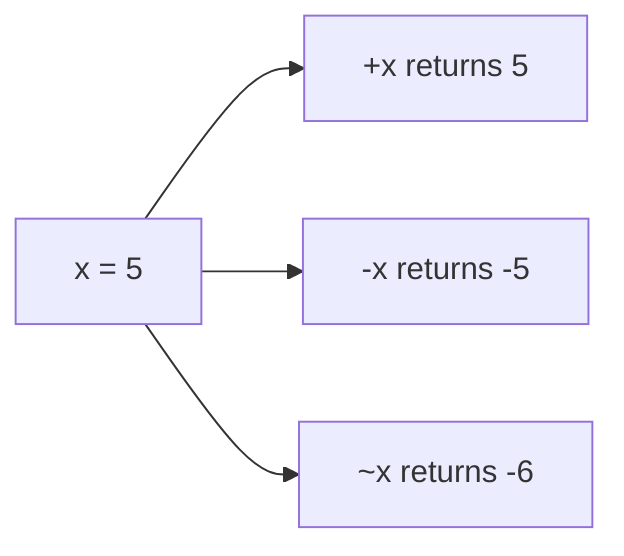

Arithmetic expressions in Jac enable mathematical calculations using standard operators with well-defined precedence and associativity rules.

**Basic Arithmetic Operations**

Jac supports fundamental arithmetic operations that follow standard mathematical conventions:

| Operator | Operation | Example Lines | Description |
|----------|-----------|---------------|-------------|
| `+` | Addition | 5 | Adds two numbers together |
| `-` | Subtraction | 6 | Subtracts the second number from the first |
| `*` | Multiplication | 9 | Multiplies two numbers |
| `/` | Division | 10 | Divides and returns a float result |
| `//` | Floor Division | 11, 39 | Divides and returns integer (rounds down) |
| `%` | Modulo | 12, 40 | Returns the remainder after division |
| `**` | Exponentiation | 15-16 | Raises first number to the power of second |

Lines 5-6 show addition and subtraction: `10 + 5` produces 15, while `10 - 5` produces 5.

Lines 9-12 demonstrate multiplication and division operations. Note that regular division `/` on line 10 produces a float result (2.0), while floor division `//` on line 11 produces an integer (3). The modulo operator `%` on line 12 gives the remainder when dividing 10 by 3, which is 1.

**Exponentiation and Power Operations**

Lines 15-16 show how exponentiation works. Line 15 calculates `2 ** 3`, which means 2 raised to the power of 3, resulting in 8.

Line 16 demonstrates an important concept: exponentiation is **right-associative**. This means `2 ** 3 ** 2` evaluates as `2 ** (3 ** 2)`, not `(2 ** 3) ** 2`. First it calculates 3 squared (9), then raises 2 to that power (512).

**Unary Operators**

Lines 18-22 introduce unary operators that work on a single value:

- Line 20: Unary plus `+x` returns the value unchanged
- Line 21: Unary minus `-x` negates the value (5 becomes -5)
- Line 22: Bitwise NOT `~x` inverts all bits (-6 in two's complement)

**Operator Precedence**

Jac follows standard mathematical precedence rules, which determine the order operations are performed:

| Priority | Operators | Associativity |
|----------|-----------|---------------|
| Highest | `**` | Right-to-left |
| High | `~`, `+`, `-` (unary) | Right-to-left |
| Medium | `*`, `/`, `//`, `%` | Left-to-right |
| Low | `+`, `-` (binary) | Left-to-right |

Line 25 demonstrates precedence: `2 + 3 * 4` equals 14, not 20, because multiplication happens before addition.

Line 26 shows how parentheses override precedence: `(2 + 3) * 4` equals 20 because the parentheses force addition to happen first.

Lines 27-28 show that operators of the same precedence evaluate left-to-right:

- `10 - 3 + 2` evaluates as `(10 - 3) + 2 = 9`
- `10 / 2 * 3` evaluates as `(10 / 2) * 3 = 15.0`

**Complex Expressions**

Line 31 shows a complex expression combining multiple operators. This evaluates in the following order:

1. `4 ** 2` = 16 (exponentiation first)
2. `3 * 16` = 48 (multiplication)
3. `10 / 2` = 5.0 (division)
4. `2 + 48` = 50 (addition)
5. `50 - 5.0` = 45.0 (subtraction)

**Chained Operations**

Lines 35-36 demonstrate operations with the same precedence:

- Line 35: `100 - 50 + 25 - 10` evaluates left-to-right as `((100 - 50) + 25) - 10 = 65`
- Line 36: `2 * 3 * 4 / 2` evaluates as `((2 * 3) * 4) / 2 = 12.0`

**Floor Division and Modulo Relationship**

Lines 39-40 show how floor division and modulo work together:

- `17 // 5` = 3 (quotient)
- `17 % 5` = 2 (remainder)

Together they satisfy the equation: `17 = 5 * 3 + 2`

**Precedence Examples**

Lines 43-45 provide additional precedence demonstrations:

- Line 43: `2 + 3 * 4` = 14 (multiplication before addition)
- Line 44: `2 ** 3 * 4` = 32 (exponentiation before multiplication: 8 * 4)
- Line 45: `10 / 2 + 5` = 10.0 (division before addition: 5.0 + 5)
