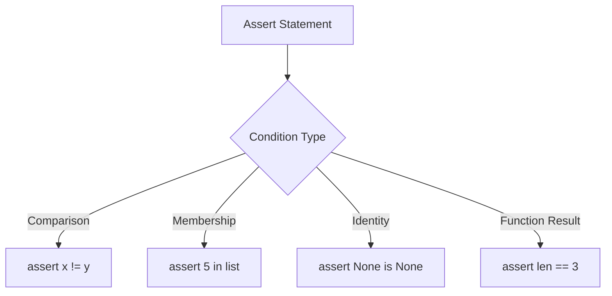

Assert statements validate conditions at runtime, ensuring code fails quickly when assumptions are violated. They are essential for debugging and testing.

**Basic Assert Syntax**

The simplest form of assert checks if a condition is true. Line 5 shows the basic usage. If the condition is false, an AssertionError is raised. Line 6 prints a confirmation message after the assertion passes.

**Assertions with Expressions**

Lines 9-11 demonstrate using expressions in assertions. After setting `x = 10`, line 10 asserts that `x > 5`. Since 10 is indeed greater than 5, the assertion passes and line 11 prints confirmation.

**Assertions with Custom Messages**

Line 14 shows how to add a descriptive error message to the assertion. The message after the comma appears when the assertion fails, facilitating error diagnosis. This is particularly helpful when debugging complex conditions.

**Handling Assertion Failures**

Lines 18-22 demonstrate catching assertion failures with try-except blocks:

| Line | Purpose |
|------|---------|
| 18-19 | Try block contains assertion that will fail |
| 20-21 | Except catches AssertionError and handles it |

When `assert False` on line 19 executes, it raises an AssertionError. The except block catches this error and prints "assertion failed" instead of crashing the program.

**Capturing Error Messages**

Lines 25-29 show how to access the error message from a failed assertion. The `as e` clause captures the exception object, enabling printing or logging of the custom message. This is useful for creating informative error reports.

**Assertions with Function Calls**

Line 32 demonstrates using function calls within assertions. The assertion evaluates the entire expression. First `len([1, 2, 3])` returns 3, then checks if it equals 3. This pattern is common for validating data structures.

**Common Assertion Patterns**

The example demonstrates several assertion patterns:

| Lines | Pattern | Example | Use Case |
|-------|---------|---------|----------|
| 36-37 | Inequality | `assert "hello" != "world"` | Verify values differ |
| 40-41 | Membership | `assert 5 in [1, 2, 3, 4, 5]` | Check list/set contents |
| 44-45 | Identity | `assert None is None` | Verify object identity |
| 32-33 | Equality | `assert len([1, 2, 3]) == 3` | Validate computed values |

**When to Use Assertions**

Assertions are perfect for:
- Validating function preconditions (input requirements)
- Checking function postconditions (output guarantees)
- Verifying internal invariants (conditions that should always be true)
- Writing test cases

**Assertions vs Exceptions**

Unlike regular exceptions, assertions should be used for:
- Debugging during development
- Catching programming errors (not user errors)
- Validating assumptions in code

For user input validation or expected runtime errors, use regular if statements and raise proper exceptions instead.
