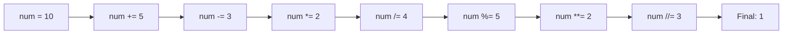

Assignment statements bind values to variables, providing the foundation for storing and manipulating data in programs.

**Simple Assignment**

Line 5 shows the most basic assignment: `x = 10;`. The equals sign `=` takes the value on the right (10) and binds it to the variable name on the left (x). Line 6 prints the value to verify the assignment worked.

**Chain Assignment**

Line 9 demonstrates chaining assignments to give multiple variables the same value. This evaluates right-to-left: first 20 is assigned to c, then to b, then to a. All three variables now hold the value 20, as confirmed by printing them on line 10.

**The let Keyword**

Lines 13-14 introduce the `let` keyword for explicit variable declaration. While `let` is optional, it makes the intent clear by explicitly creating a new variable. This improves code readability, especially in complex scopes.

**Type Annotations**

Jac supports optional type annotations to document what kind of value a variable should hold:

| Pattern | Example Line | Description |
|---------|--------------|-------------|
| Type with value | 17-18 | `age: int = 25;` declares and assigns |
| Type without value | 22-23 | `result: str;` declares for later assignment |
| Let with type | 27 | `let count: int = 5;` combines declaration and typing |

Lines 17-18 show annotating variables with their types: `age: int = 25` and `name: str = "Alice"`. These annotations serve as documentation and enable type checking tools to catch errors.

Lines 22-23 demonstrate declaring a variable with a type but without an initial value. Line 22 declares `result: str`, then line 23 assigns it the value "computed".

**Augmented Assignment Operators**

Instead of writing `x = x + 5`, you can use augmented assignment: `x += 5`. These operators combine an operation with assignment:

Lines 31-39 show all arithmetic augmented assignments:

| Operator | Line | Meaning | Effect on num |
|----------|------|---------|---------------|
| `+=` | 32 | Add and assign | 10 + 5 = 15 |
| `-=` | 33 | Subtract and assign | 15 - 3 = 12 |
| `*=` | 34 | Multiply and assign | 12 * 2 = 24 |
| `/=` | 35 | Divide and assign | 24 / 4 = 6.0 |
| `%=` | 36 | Modulo and assign | 6.0 % 5 = 1.0 |
| `**=` | 37 | Power and assign | 1.0 ** 2 = 1.0 |
| `//=` | 38 | Floor divide and assign | 1.0 // 3 = 0.0 |

Lines 42-48 demonstrate bitwise augmented assignments:

| Operator | Line | Operation |
|----------|------|-----------|
| `&=` | 43 | Bitwise AND |
| `\|=` | 44 | Bitwise OR |
| `^=` | 45 | Bitwise XOR |
| `<<=` | 46 | Left shift |
| `>>=` | 47 | Right shift |

**Tuple Unpacking**

Lines 51-52 show unpacking a tuple into multiple variables. The tuple `(10, 20)` on the right is unpacked, assigning 10 to x and 20 to y in a single statement. This provides more concise syntax than two separate assignments.

**The Swap Pattern**

Line 55 demonstrates the classic swap using tuple unpacking. This swaps the values of x and y without needing a temporary variable. If x was 10 and y was 20, they become 20 and 10 respectively.

**List Unpacking**

Lines 59-60 show that lists can also be unpacked. This works identically to tuple unpacking - the values from the list are distributed to the variables in order.

**Nested Unpacking**

Lines 63-64 demonstrate unpacking nested structures. The outer tuple contains 5 and another tuple (6, 7). Variable m gets 5, while the inner tuple is unpacked with n getting 6 and o getting 7.

**Extended Unpacking with Asterisk**

The `*` operator captures remaining elements into a list:

| Pattern | Line | Example | Result |
|---------|------|---------|--------|
| Rest elements | 67 | `(first, *rest) = [1, 2, 3, 4, 5]` | first=1, rest=[2,3,4,5] |
| Middle elements | 70 | `(head, *middle, tail) = [10, 20, 30, 40, 50]` | head=10, middle=[20,30,40], tail=50 |
| Beginning elements | 73 | `(*beginning, last) = [100, 200, 300]` | beginning=[100,200], last=300 |

Line 67 shows `(first, *rest)` where first captures the first element and rest captures everything else as a list.

Line 70 demonstrates `(head, *middle, tail)` where the asterisk variable captures all elements between the first and last.

Line 73 shows `(*beginning, last)` where the asterisk comes first, capturing all elements except the last one.

**Practical Applications**

Unpacking is particularly useful for:

- Function returns: Extracting multiple return values
- Data processing: Separating headers from data rows
- Pattern matching: Pulling apart structured data
- Swapping: Exchanging values elegantly

The combination of simple assignments, type annotations, augmented operators, and unpacking patterns gives you powerful tools for managing data in your Jac programs.
