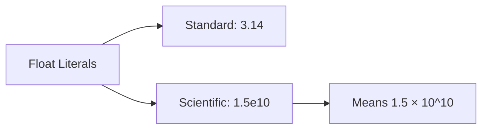
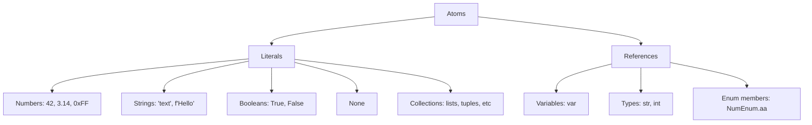

Atoms are the fundamental building blocks of expressions - the smallest, indivisible pieces of code that represent values directly.

**String Literals**

Line 7 shows a basic string literal: `s = "string";`. Strings are sequences of characters enclosed in double quotes.

Lines 42-43 demonstrate multistring concatenation. When string literals are placed adjacent to each other, Jac automatically concatenates them into a single string "Hello World". This is useful for splitting long strings across multiple lines.

**F-Strings (Formatted Strings)**

Lines 45-46 introduce f-strings for embedding expressions within strings. The `f` prefix before the string makes it a formatted string literal. Expressions inside curly braces `{}` are evaluated and their values are inserted into the string. This creates "Hello Alice".

**Boolean Literals**

Lines 8-9 show the two boolean values. These represent truth values. Note they are capitalized - `True` and `False` are keywords.

**None Literal**

Line 10 introduces the None literal. None represents the absence of a value, similar to null in other languages. It is commonly used as a default value or to indicate "no result".

**Integer Formats**

Jac supports multiple ways to write integer literals:

| Format | Prefix | Example Line | Value | Decimal Equivalent |
|--------|--------|--------------|-------|-------------------|
| Decimal | none | 13 | `42` | 42 |
| Binary | `0b` | 14 | `0b1100` | 12 |
| Octal | `0o` | 15 | `0o755` | 493 |
| Hexadecimal | `0x` | 16 | `0xFF` | 255 |

Line 13 shows standard decimal notation: `dec = 42`.

Line 14 uses binary prefix `0b`: `binary = 0b1100` equals 12 in decimal.

Line 15 uses octal prefix `0o`: `octal = 0o755` equals 493 in decimal (commonly used for Unix file permissions).

Line 16 uses hexadecimal prefix `0x`: `hexa = 0xFF` equals 255 in decimal.

**Float Formats**

Lines 19-20 demonstrate floating-point number formats:

- Line 19: Standard decimal notation `flt = 3.14`
- Line 20: Scientific notation `sci = 1.5e10` represents 1.5 × 10^10 (15,000,000,000)

**Ellipsis Literal**

Line 23 shows the ellipsis literal. The `...` (three dots) is a special literal used as a placeholder in various contexts, such as slice notation or to indicate "to be implemented".

**Parenthesized Expressions**

Line 26 demonstrates using parentheses to group expressions. Parentheses control evaluation order. Without them, this would be `5 + (3 * 2) = 11`. With parentheses, it becomes `(5 + 3) * 2 = 16`.

**Named References**

Line 29 shows a simple variable reference. Once a variable has a value, its name can be used to reference that value in expressions.

**Type Objects as Values**

Lines 32-33 demonstrate that types themselves can be values. This assigns the type objects for strings and integers to variables. These can be used to create instances or check types at runtime.

**Collection Literals**

Lines 36-39 show the four main collection types:

| Collection | Syntax | Line | Characteristics |
|------------|--------|------|-----------------|
| Tuple | `(1, 2, 3)` | 36 | Immutable, ordered sequence |
| List | `[1, 2, 3]` | 37 | Mutable, ordered sequence |
| Dictionary | `{"k": "v"}` | 38 | Mutable key-value mapping |
| Set | `{1, 2, 3}` | 39 | Mutable, unordered unique values |

Tuples use parentheses and cannot be changed after creation. Lists use square brackets and can be modified. Dictionaries use curly braces with `key: value` pairs. Sets use curly braces with just values (no duplicates allowed).

**Enum Member Access**

Line 48 demonstrates accessing an enum's value. The enum `NumEnum` defined at line 3 has members. You access a member with dot notation (`NumEnum.aa`), then get its numeric value with `.value`. According to line 3, `aa = 67`, so this prints 67.

**Summary of Atomic Values**

Atoms are the foundation of all expressions. These are combined with operators and function calls to build more complex computations, but every expression ultimately breaks down into these atomic pieces.
