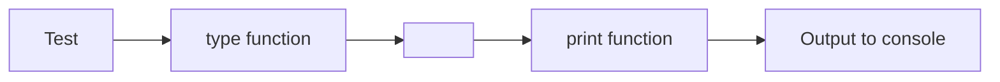

The atomic forward pipe operator `:>` enables elegant data pipelines by passing values from left to right through a series of transformations.

**Basic Atomic Pipe Syntax**

Line 5 introduces the atomic forward pipe operator:

This takes the string "Hello" on the left and pipes it to the `print` function on the right. It's equivalent to `print("Hello")`, but the pipe syntax emphasizes the flow of data from source to destination.

The `:>` operator reads naturally: "take this value and send it to this function."

**Chaining Multiple Pipes**

Line 8 demonstrates the real power of pipes - chaining transformations:

This creates a pipeline:

The execution flows left-to-right:
1. Start with the string `"Test"`
2. Pipe it to `type()`, which returns the type object `<class 'str'>`
3. Pipe that type object to `print()`, which displays it

Compare this to the nested function call equivalent: `print(type("Test"))`. The piped version reads in the same direction as the data flows, making the sequence of operations clearer.

**Pipes with Lambda Functions**

Lines 11-12 show using pipes with lambda expressions for custom transformations:

This creates a computation pipeline:

| Step | Operation | Input | Output |
|------|-----------|-------|--------|
| 1 | Start | - | 5 |
| 2 | First lambda: multiply by 2 | 5 | 10 |
| 3 | Second lambda: add 10 | 10 | 20 |

The value 5 is doubled to 10, then increased by 10 to get a final result of 20.

The lambda syntax `(lambda x: int : x * 2)` defines an anonymous function:
- `lambda` keyword starts the lambda
- `x` is the parameter name
- `: int` is the return type annotation
- `x * 2` is the function body

**Why Atomic Pipes?**

The atomic pipe operator is called "atomic" because it passes the complete value as a single unit to each function. Unlike some pipe operators that might do partial application, `:>` always passes the entire left-hand value as the argument to the right-hand function.

**Benefits of Pipe Syntax**

Pipes make code more readable when you have multiple transformations:

Without pipes (nested):

With pipes (linear):

For longer chains, the difference is even more dramatic:

Without pipes:

With pipes:

The piped version reads like a recipe: "Take the value, apply func1, then func2, then func3."

**Practical Applications**

Atomic pipes are especially useful for:
- Data transformation pipelines
- Method chaining alternatives
- Functional programming patterns
- Making data flow explicit in your code

When you see `:>`, think "and then send it to" - it describes the journey of data through your program.
