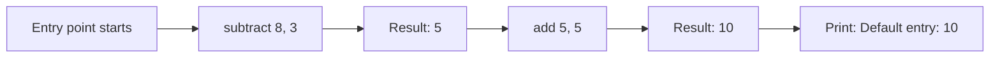
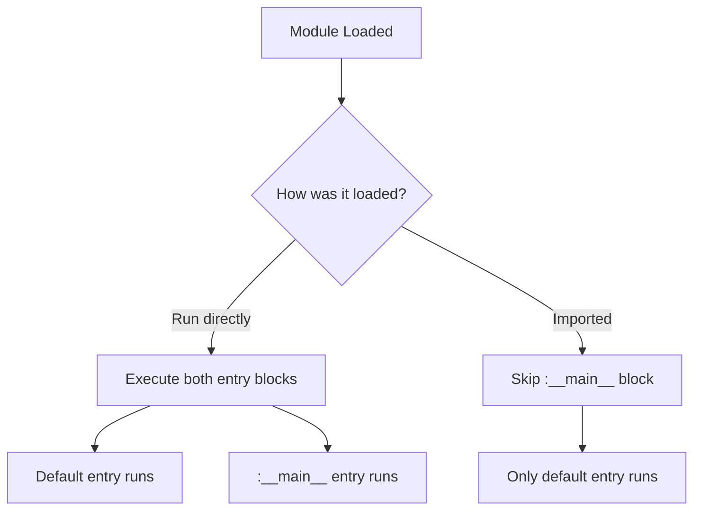

Jac modules organize code with docstrings for documentation and entry points for execution control.

**Module-Level Docstrings**

Lines 1-5 show the module docstring - a string literal at the very beginning of the file:

This triple-quoted string documents what the entire module does. It appears before any code elements (functions, classes, etc.). Module docstrings are used by documentation tools and can be accessed at runtime to provide help text.

**Function Definitions**

Lines 7-13 define two simple functions:

| Function | Lines | Purpose |
|----------|-------|---------|
| `add` | 7-9 | Adds two integers and returns the result |
| `subtract` | 11-13 | Subtracts second integer from first |

Both functions use type annotations (`a: int, b: int -> int`) to specify parameter and return types. These functions can be called from within the module or imported by other modules.

**Default Entry Point**

Lines 16-18 define the default entry point using `with entry`:

This code block executes when the module runs. Let's trace the execution:

The nested call evaluates from inside out:
1. `subtract(8, 3)` returns 5
2. `add(5, 5)` returns 10
3. Prints "Default entry: 10"

**Named Entry Point**

Lines 21-23 define a named entry point using `with entry:__main__`:

The `:__main__` label creates a conditional entry point that only executes when the module is run directly as the main program (not when imported by another module).

This pattern is similar to Python's `if __name__ == "__main__":` idiom.

Execution trace:
1. `subtract(3, 1)` returns 2
2. `add(1, 2)` returns 3
3. Prints "Named entry: 3"

**Entry Point Behavior**

When you run the module directly:
- The default `with entry` block executes
- The `with entry:__main__` block executes

When you import the module:
- The default `with entry` block may execute (depending on implementation)
- The `with entry:__main__` block is skipped

This separation allows you to:
- Define reusable functions (lines 7-13)
- Provide examples or tests in the `__main__` block (lines 21-23)
- Keep library code separate from executable code

**Practical Module Organization**

A typical Jac module structure:

1. Module docstring (lines 1-5)
2. Imports (not shown in this example)
3. Function/class definitions (lines 7-13)
4. Default entry point for module initialization (lines 16-18)
5. Main entry point for direct execution (lines 21-23)

This structure keeps your code organized: documentation at the top, reusable components in the middle, and execution logic at the bottom.
