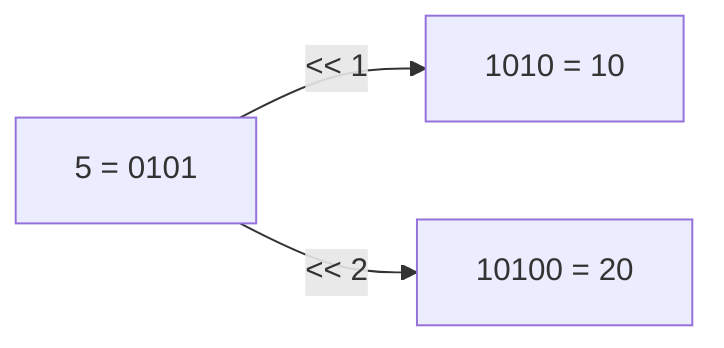
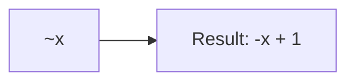

Bitwise expressions manipulate individual bits in integer values using logical operations and shift operators.

**Bitwise OR Operator**

Lines 5-6 demonstrate the bitwise OR operator `|`. The OR operation compares each bit position:

| Operation | Binary | Decimal |
|-----------|--------|---------|
| 5 | 0101 | 5 |
| 3 | 0011 | 3 |
| 5 \| 3 | 0111 | 7 |

Each bit is 1 if either operand has 1 in that position. Line 5 produces 7 because all positions with 1 in either number result in 1.

**Bitwise XOR Operator**

Lines 9-10 show the bitwise XOR (exclusive OR) operator `^`. XOR returns 1 only when bits differ:

| Operation | Binary | Decimal |
|-----------|--------|---------|
| 5 | 0101 | 5 |
| 3 | 0011 | 3 |
| 5 ^ 3 | 0110 | 6 |

Line 9 produces 6. The rightmost bit is 0 (both operands have 1), but the second bit from right is 1 (5 has 0, 3 has 1).

**Bitwise AND Operator**

Lines 13-14 demonstrate the bitwise AND operator `&`. AND returns 1 only when both operands have 1:

| Operation | Binary | Decimal |
|-----------|--------|---------|
| 5 | 0101 | 5 |
| 3 | 0011 | 3 |
| 5 & 3 | 0001 | 1 |

Line 13 produces 1 because only the rightmost bit is 1 in both numbers.

**Left Shift Operator**

Lines 17-18 show the left shift operator `<<`. Left shift moves all bits to the left, filling with zeros:



| Operation | Binary | Decimal | Equivalent |
|-----------|--------|---------|------------|
| 5 | 0101 | 5 | 5 |
| 5 << 1 | 1010 | 10 | 5 * 2 |
| 5 << 2 | 10100 | 20 | 5 * 4 |

Left shifting by n positions multiplies by 2^n.

**Right Shift Operator**

Lines 21-22 demonstrate the right shift operator `>>`. Right shift moves all bits to the right:

| Operation | Binary | Decimal | Equivalent |
|-----------|--------|---------|------------|
| 10 | 1010 | 10 | 10 |
| 10 >> 1 | 0101 | 5 | 10 / 2 |
| 10 >> 2 | 0010 | 2 | 10 / 4 |

Right shifting by n positions divides by 2^n (integer division).

**Bitwise NOT Operator**

Lines 25-27 show the bitwise NOT operator `~` (unary). NOT inverts all bits. Due to two's complement representation:



| Value | Result | Explanation |
|-------|--------|-------------|
| ~5 | -6 | -(5 + 1) |
| ~0 | -1 | -(0 + 1) |
| ~-1 | 0 | -(-1 + 1) |

In two's complement, `~x` always equals `-(x + 1)`.

**Combined Bitwise Operations**

Lines 30-31 demonstrate combining bitwise operations. Line 30 uses parentheses to control order:
1. `8 | 4` = 12 (binary: 1000 | 0100 = 1100)
2. `12 & 12` = 12 (binary: 1100 & 1100 = 1100)

Line 31 follows operator precedence (AND before XOR):
1. `3 & 7` = 3 (binary: 0011 & 0111 = 0011)
2. `5 ^ 3` = 6 (binary: 0101 ^ 0011 = 0110)

**Chained Bitwise Operations**

Lines 34-35 show chaining operators. Line 34: AND has higher precedence than OR:
1. `15 & 7` = 7 (binary: 1111 & 0111 = 0111)
2. `7 | 8` = 15 (binary: 0111 | 1000 = 1111)

Line 35: Shifts have equal precedence, evaluated left-to-right:
1. `5 << 1` = 10 (double: 0101 → 1010)
2. `10 >> 1` = 5 (halve: 1010 → 0101)

**Complex Bitwise Expression**

Lines 38-39 demonstrate a complex expression. Breaking it down:

```mermaid
graph TD
    A[12 | 5] --> B[13: 1101]
    C[7 ^ 3] --> D[4: 0100]
    B --> E[13 & 4]
    D --> E
    E --> F[4: 0100]
```

1. `12 | 5` = 13 (binary: 1100 | 0101 = 1101)
2. `7 ^ 3` = 4 (binary: 0111 ^ 0011 = 0100)
3. `13 & 4` = 4 (binary: 1101 & 0100 = 0100)

**Bitwise Operator Precedence**

From highest to lowest precedence:
1. `~` (NOT) - unary operator
2. `<<`, `>>` (shifts)
3. `&` (AND)
4. `^` (XOR)
5. `|` (OR)

**Common Uses for Bitwise Operations**

- Flags and permissions (checking/setting individual bits)
- Optimization (multiplication/division by powers of 2)
- Cryptography and hashing
- Low-level hardware control
- Data compression
- Network protocol parsing
