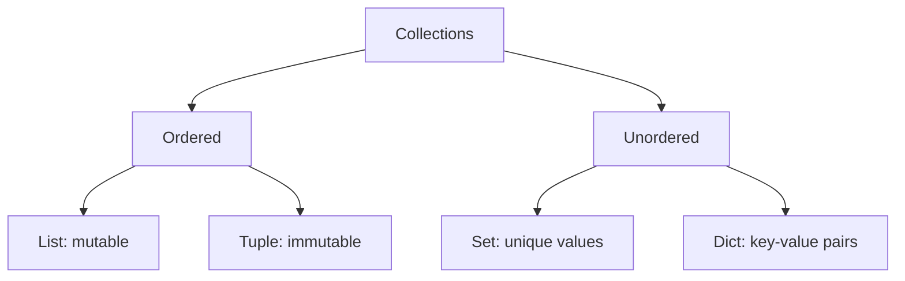
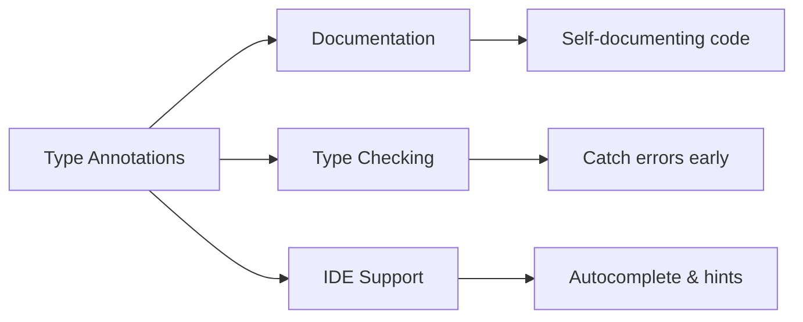

Jac provides a rich set of built-in types for representing different kinds of data, with optional type annotations to enhance code clarity and type safety.

**String Type**

Lines 5-6 demonstrate the string type `str`. Strings hold text data - sequences of characters. The type annotation `: str` documents that `s` should contain a string value.

**Integer Type**

Lines 9-10 show the integer type `int`. Integers are whole numbers without decimal points. They can be positive, negative, or zero.

**Float Type**

Lines 13-14 demonstrate the floating-point type `float`. Floats represent numbers with decimal points, used for measurements, calculations requiring precision, and scientific notation.

**Core Data Types Summary**

| Type | Line | Example Value | Purpose |
|------|------|---------------|---------|
| `str` | 5 | `"hello"` | Text and characters |
| `int` | 9 | `42` | Whole numbers |
| `float` | 13 | `3.14` | Decimal numbers |
| `bool` | 33 | `True` | Truth values |
| `bytes` | 37 | `b"binary"` | Binary data |

**Collection Types**

Jac provides four main collection types for organizing multiple values:

**List Type**

Lines 17-18 show lists - mutable, ordered sequences. Lists can grow, shrink, and have elements modified. Use square brackets `[]` to create them.

**Tuple Type**

Lines 21-22 demonstrate tuples - immutable, ordered sequences. Once created, tuples cannot be changed. Use parentheses `()` to create them. Tuples are faster than lists and can be used as dictionary keys.

**Set Type**

Lines 25-26 show sets - unordered collections of unique values. Sets automatically remove duplicates and provide fast membership testing. Use curly braces `{}` with just values.

**Dictionary Type**

Lines 29-30 demonstrate dictionaries - key-value mappings. Dictionaries store associations between keys and values. Use curly braces with `key: value` pairs.

**Collection Characteristics**

| Type | Ordered | Mutable | Duplicates | Syntax |
|------|---------|---------|------------|--------|
| list | Yes | Yes | Yes | `[1, 2, 3]` |
| tuple | Yes | No | Yes | `(1, 2, 3)` |
| set | No | Yes | No | `{1, 2, 3}` |
| dict | No* | Yes | Keys: No | `{"k": "v"}` |

*Dictionaries preserve insertion order in modern implementations.

**Boolean Type**

Lines 33-34 show the boolean type `bool`. Booleans have exactly two values: `True` and `False`. They are used for conditions, flags, and logic. Note the capitalization - these are keywords.

**Bytes Type**

Lines 37-38 demonstrate the bytes type. Bytes represent binary data - sequences of integers from 0-255. The `b` prefix before the string creates bytes. This type is essential for:

- Reading/writing binary files
- Network protocols
- Cryptography
- Image/video data

**Special Types**

**Any Type**

Lines 41-44 introduce the `any` type. The `any` type accepts values of any type. Variable `a` starts as a string, then becomes an integer. This provides flexibility but sacrifices type safety.

**Type Type**

Lines 47-48 show the `type` type. The `type` type holds type objects themselves. This enables:

- Store types in variables
- Pass types as arguments
- Create instances dynamically
- Check types at runtime

**Type Annotations in Functions**

Lines 51-56 demonstrate function type annotations. Function signatures can specify:

- Parameter types: `x: int, y: str`
- Return type: `-> tuple`

The `->` arrow indicates what the function returns. Line 55 calls the function with an integer and string, returning a tuple containing both.

**Benefits of Type Annotations**

Type annotations provide:

- **Documentation**: Makes code intent clear
- **Type Checking**: Tools can verify type correctness
- **IDE Support**: Better autocomplete and error detection
- **Refactoring Safety**: Helps catch breaking changes

**Optional vs Required**

Type annotations in Jac are **optional** - code works without them. However, they are strongly recommended for:

- Public APIs and functions
- Complex data structures
- Long-lived codebases
- Team projects

**Type Annotation Patterns**

| Pattern | Example | When to Use |
|---------|---------|-------------|
| Variable with value | `name: str = "Alice"` | Clear declaration |
| Function parameters | `def foo(x: int, y: str)` | Document inputs |
| Function returns | `-> tuple` | Document outputs |
| Flexible typing | `value: any = ...` | When type varies |
| No annotation | `x = 42` | Quick scripts |

All the built-in types work together to give you powerful tools for representing and manipulating data in your Jac programs.
